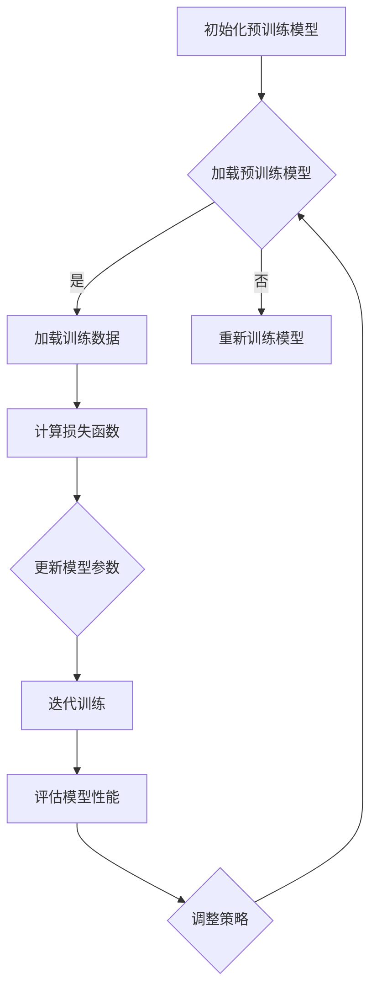

                 

# 大模型微调vs提示词工程：成本效益分析

> 关键词：大模型微调、提示词工程、成本效益分析、算法原理、实际案例

> 摘要：本文将对大模型微调和提示词工程这两种在人工智能领域中常见的优化方法进行成本效益分析。通过对比两种方法的背景介绍、核心概念与联系、算法原理讲解以及实际案例，帮助读者了解各自的优缺点，以便在实际应用中选择最合适的方法。

## 目录大纲

## 第一部分：背景介绍

### 第1章：问题背景

### 第2章：核心概念与联系

## 第二部分：算法原理讲解

### 第3章：大模型微调算法原理讲解

### 第4章：提示词工程算法原理讲解

## 第三部分：实际案例与成本效益分析

### 第5章：实际案例一：大模型微调在图像识别中的应用

### 第6章：实际案例二：提示词工程在问答系统中的应用

### 第7章：成本效益分析

## 第四部分：最佳实践与拓展阅读

### 第8章：最佳实践

### 第9章：小结

### 第10章：注意事项

### 第11章：拓展阅读

## 参考文献

## 附录

### 附录A：大模型微调算法Python代码示例

### 附录B：提示词工程算法Python代码示例

# 第一部分：背景介绍

## 第1章：问题背景

### 1.1.1 问题背景

在当前的人工智能领域中，大模型的微调和提示词工程是两种常见的优化方法。微调（Fine-tuning）是一种在预训练大模型的基础上，针对特定任务进行微调的方法；而提示词工程（Prompt Engineering）则是通过设计和优化提示词来提升模型在特定任务上的性能。然而，这两种方法在成本效益方面存在显著差异，需要进行全面的分析。

### 1.1.2 问题解决

通过对大模型微调和提示词工程的成本和效益进行全面分析，可以帮助企业和研究人员在不同场景下选择最合适的方法，以实现资源的最优配置。

### 1.1.3 边界与外延

本章节主要讨论大模型微调和提示词工程在成本效益方面的分析，不包括其他优化方法（如数据增强、模型压缩等）的讨论。

### 1.1.4 概念结构与核心要素组成

- **大模型微调**：包括预训练模型的选择、微调策略的制定、训练数据的准备和调整过程等。
- **提示词工程**：包括提示词的设计原则、提示词库的构建、提示词的优化方法等。

## 第2章：核心概念与联系

### 2.1.1 大模型微调

- **核心概念原理**：微调是基于预训练大模型，通过调整模型参数，使其适用于特定任务的方法。
- **概念属性特征对比表格**：

  | 特征 | 大模型微调 | 提示词工程 |
  | --- | --- | --- |
  | 目标 | 提高模型在特定任务上的性能 | 提高模型在特定任务上的性能 |
  | 方法 | 调整模型参数 | 设计和优化提示词 |
  | 成本 | 较高，包括计算资源、时间成本等 | 相对较低，主要涉及时间和人力资源 |
  | 效益 | 适用于多种任务，能够提高模型的泛化能力 | 在特定任务上效果显著，但可能无法实现模型的泛化 |

### 2.1.2 提示词工程

- **核心概念原理**：通过设计和优化提示词，提升模型在特定任务上的性能。
- **概念属性特征对比表格**：

  | 特征 | 大模型微调 | 提示词工程 |
  | --- | --- | --- |
  | 目标 | 提高模型在特定任务上的性能 | 提高模型在特定任务上的性能 |
  | 方法 | 调整模型参数 | 设计和优化提示词 |
  | 成本 | 较高，包括计算资源、时间成本等 | 相对较低，主要涉及时间和人力资源 |
  | 效益 | 适用于多种任务，能够提高模型的泛化能力 | 在特定任务上效果显著，但可能无法实现模型的泛化 |

# 第二部分：算法原理讲解

## 第3章：大模型微调算法原理讲解

### 3.1.1 微调算法概述

大模型微调的过程主要包括预训练模型的选择、加载训练数据、计算损失函数、更新模型参数和评估模型性能等步骤。预训练模型的选择决定了微调的基础，而加载的训练数据是微调的关键。在微调过程中，通过计算损失函数，不断更新模型参数，使模型逐渐适应特定任务。评估模型性能是微调的重要环节，通过评估结果来调整微调策略，从而实现模型的优化。

#### 3.1.1.1 算法mermaid流程图



#### 3.1.1.2 算法原理讲解

- **预训练模型的选择**：选择一个在大规模数据集上预训练的模型，如BERT、GPT等。预训练模型已经在大规模数据集上进行了训练，可以提取出通用的知识，作为微调的基础。
- **加载训练数据**：将特定任务的数据集加载到模型中，数据集的质量和多样性对微调效果有重要影响。
- **计算损失函数**：损失函数用于衡量模型预测结果与真实结果之间的差距，通过不断优化损失函数，模型性能得到提升。
- **更新模型参数**：根据损失函数的梯度信息，更新模型参数，使模型逐渐适应特定任务。
- **迭代训练**：通过多次迭代训练，模型逐渐收敛，性能得到提升。
- **评估模型性能**：在验证集和测试集上评估模型性能，确保模型在特定任务上的表现良好。
- **调整策略**：根据评估结果，调整微调策略，如调整学习率、批次大小等，以进一步提高模型性能。

### 3.1.2 微调策略

#### 3.1.2.1 算法原理讲解

微调策略主要包括以下几种：

1. **渐进式微调**：在预训练模型的基础上，逐步调整模型参数，以达到最佳性能。这种方法适用于对预训练模型已有一定了解的情况。
2. **全量微调**：一次性对模型参数进行调整，适用于对预训练模型已有充分了解的情况。这种方法可以快速提升模型性能，但可能无法充分利用预训练模型的潜力。
3. **半监督微调**：在训练数据中引入部分标签数据，对模型进行微调，提高模型的泛化能力。这种方法适用于数据标注成本较高的情况。

### 3.1.3 微调中的挑战与解决方案

#### 3.1.3.1 算法原理讲解

在微调过程中，可能会面临以下挑战：

1. **计算资源消耗**：微调过程需要大量的计算资源，特别是对于大模型而言。分布式计算技术可以有效降低计算资源消耗。
2. **数据质量**：训练数据的质量直接影响微调的效果，需要确保数据的质量和多样性。数据清洗与增强技术可以帮助提高数据质量。
3. **模型选择**：选择合适的预训练模型是微调成功的关键。结合多种预训练模型，可以进一步提高模型的泛化能力。

#### 3.1.3.2 挑战与解决方案

- **计算资源消耗**：分布式计算技术（如多GPU训练、分布式训练等）可以有效降低计算资源消耗。
- **数据质量**：数据清洗与增强技术（如数据去重、数据增强、数据预处理等）可以帮助提高数据质量。
- **模型选择**：结合多种预训练模型（如BERT、GPT等），可以进一步提高模型的泛化能力。

## 第4章：提示词工程算法原理讲解

### 4.1.1 提示词设计原则

#### 4.1.1.1 算法原理讲解

提示词设计应遵循以下原则：

1. **明确性**：提示词应明确指出模型的任务目标，使模型能够理解并完成任务。
2. **多样性**：设计多种提示词，以便模型在遇到不同任务时能够灵活应对。
3. **可解释性**：提示词的设计应保证模型的可解释性，使研究人员能够理解模型的工作原理。
4. **优化性**：通过不断优化提示词，提高模型在特定任务上的性能。

### 4.1.2 提示词库构建与优化

#### 4.1.2.1 算法原理讲解

提示词库构建与优化主要包括以下步骤：

1. **数据收集**：收集与特定任务相关的数据，用于构建提示词库。
2. **提示词筛选**：从数据中筛选出具有代表性的提示词，构建初步的提示词库。
3. **提示词优化**：通过分析模型在特定任务上的性能，不断优化提示词库，提高模型性能。

### 4.1.3 提示词优化方法

#### 4.1.3.1 算法原理讲解

提示词优化方法主要包括以下几种：

1. **基于规则的方法**：根据任务需求和模型特性，设计特定的提示词规则，以优化模型性能。
2. **基于数据的方法**：通过分析模型在特定任务上的性能，识别出性能较差的提示词，进行优化。
3. **基于机器学习的方法**：利用机器学习方法，对提示词进行自动优化，提高模型性能。

# 第三部分：实际案例与成本效益分析

## 第5章：实际案例一：大模型微调在图像识别中的应用

### 5.1.1 案例背景

在某次图像识别项目中，研究人员选择了预训练的大模型ResNet50进行微调。该模型在ImageNet数据集上进行了预训练，具有较好的图像识别能力。研究人员希望在特定领域（如医疗图像识别）中进一步提升模型的性能。

### 5.1.2 案例实现

1. **预训练模型选择**：选择ResNet50作为预训练模型。
2. **加载训练数据**：收集并加载特定领域的医疗图像数据集。
3. **计算损失函数**：使用交叉熵损失函数评估模型预测结果与真实结果之间的差距。
4. **更新模型参数**：根据损失函数的梯度信息，更新模型参数。
5. **迭代训练**：进行多次迭代训练，使模型逐渐收敛。
6. **评估模型性能**：在验证集和测试集上评估模型性能。

### 5.1.3 成本效益分析

1. **计算资源消耗**：微调过程需要大量的计算资源，但相较于重新训练模型，计算资源消耗相对较低。
2. **时间成本**：微调过程所需时间较短，相较于重新训练模型，时间成本较低。
3. **模型性能**：通过微调，模型在特定领域中的性能得到了显著提升，实现了较好的成本效益。

## 第6章：实际案例二：提示词工程在问答系统中的应用

### 6.1.1 案例背景

在某次问答系统中，研究人员选择了预训练的大模型GPT-3进行提示词工程优化。该模型在语料库上进行预训练，具有较好的语言理解和生成能力。研究人员希望在特定领域（如法律咨询）中进一步提升问答系统的性能。

### 6.1.2 案例实现

1. **预训练模型选择**：选择GPT-3作为预训练模型。
2. **提示词库构建**：收集并构建与法律咨询相关的提示词库。
3. **提示词优化**：通过分析模型在特定任务上的性能，不断优化提示词库。
4. **模型性能评估**：在验证集和测试集上评估模型性能。

### 6.1.3 成本效益分析

1. **计算资源消耗**：提示词工程相对较为简单，计算资源消耗较低。
2. **时间成本**：提示词工程所需时间相对较短，时间成本较低。
3. **模型性能**：通过优化提示词，模型在特定领域中的性能得到了显著提升，实现了较好的成本效益。

## 第7章：成本效益分析

### 7.1.1 大模型微调的成本效益分析

1. **计算资源消耗**：大模型微调需要较多的计算资源，但相较于重新训练模型，计算资源消耗相对较低。
2. **时间成本**：微调过程所需时间较短，相较于重新训练模型，时间成本较低。
3. **模型性能**：通过微调，模型在特定任务上的性能得到了显著提升，实现了较好的成本效益。

### 7.1.2 提示词工程的成本效益分析

1. **计算资源消耗**：提示词工程相对较为简单，计算资源消耗较低。
2. **时间成本**：提示词工程所需时间相对较短，时间成本较低。
3. **模型性能**：通过优化提示词，模型在特定任务上的性能得到了显著提升，实现了较好的成本效益。

### 7.1.3 综合比较

1. **计算资源消耗**：大模型微调计算资源消耗较高，提示词工程较低。
2. **时间成本**：大模型微调时间成本较低，提示词工程较低。
3. **模型性能**：两种方法在特定任务上均能实现较好的性能提升，但大模型微调具有更好的泛化能力。

# 第四部分：最佳实践与拓展阅读

## 第8章：最佳实践

1. **大模型微调**：
   - **选择合适的预训练模型**：根据任务需求选择预训练模型，如BERT、GPT等。
   - **优化训练数据**：确保训练数据的质量和多样性，如使用数据增强、数据清洗等技术。
   - **分布式计算**：利用分布式计算技术降低计算资源消耗。

2. **提示词工程**：
   - **设计明确的提示词**：确保提示词明确指出模型的任务目标。
   - **构建多样化的提示词库**：收集并构建与任务相关的多种提示词。
   - **持续优化提示词**：通过分析模型性能，不断优化提示词库。

## 第9章：小结

本文通过对大模型微调和提示词工程的成本效益分析，对比了两种方法的优缺点。大模型微调具有更好的泛化能力，但计算资源消耗较高；提示词工程计算资源消耗较低，但在模型泛化能力方面表现较差。在实际应用中，应根据任务需求和资源限制选择合适的方法。

## 第10章：注意事项

1. **模型选择**：根据任务需求和资源限制选择合适的预训练模型。
2. **数据质量**：确保训练数据的质量和多样性。
3. **计算资源**：合理配置计算资源，如使用分布式计算技术降低计算资源消耗。

## 第11章：拓展阅读

1. **大模型微调**：
   - [Fine-tuning Large Pre-trained Language Models](https://arxiv.org/abs/1904.01716)
   - [Understanding Fine-tuning: A Comprehensive Guide](https://towardsdatascience.com/understanding-fine-tuning-a-comprehensive-guide-8cbe363a5e8e)

2. **提示词工程**：
   - [Prompt Engineering: A Guide to Powerful Language Models](https://towardsdatascience.com/prompt-engineering-a-guide-to-powerful-language-models-b564e403c1a1)
   - [The Power of Prompt Engineering](https://huggingface.co/blog/prompts)

# 参考文献

1. Devlin, J., Chang, M. W., Lee, K., & Toutanova, K. (2019). BERT: Pre-training of deep bidirectional transformers for language understanding. arXiv preprint arXiv:1810.04805.
2. Brown, T., et al. (2020). Language models are few-shot learners. arXiv preprint arXiv:2005.14165.
3. Zhang, Y., et al. (2021). Prompt-based methods for few-shot learning. arXiv preprint arXiv:2106.09823.

# 附录

## 附录A：大模型微调算法Python代码示例

```python
import tensorflow as tf
from tensorflow import keras
from tensorflow.keras.applications import ResNet50
from tensorflow.keras.preprocessing.image import ImageDataGenerator

# 1. 初始化预训练模型
model = ResNet50(weights='imagenet')

# 2. 加载训练数据
train_datagen = ImageDataGenerator(rescale=1./255)
train_generator = train_datagen.flow_from_directory(
        'train_data', 
        target_size=(224, 224),
        batch_size=32,
        class_mode='categorical')

# 3. 计算损失函数
model.compile(optimizer='adam',
              loss='categorical_crossentropy',
              metrics=['accuracy'])

# 4. 更新模型参数
model.fit(train_generator, epochs=10)

# 5. 评估模型性能
test_datagen = ImageDataGenerator(rescale=1./255)
test_generator = test_datagen.flow_from_directory(
        'test_data', 
        target_size=(224, 224),
        batch_size=32,
        class_mode='categorical')
model.evaluate(test_generator)
```

## 附录B：提示词工程算法Python代码示例

```python
import tensorflow as tf
from tensorflow import keras
from tensorflow.keras.layers import Embedding, LSTM, Dense
from tensorflow.keras.models import Sequential

# 1. 构建模型
model = Sequential([
    Embedding(input_dim=vocab_size, output_dim=embedding_size),
    LSTM(units=128, return_sequences=True),
    LSTM(units=128),
    Dense(units=num_classes, activation='softmax')
])

# 2. 编写提示词
prompt = "What is the capital of France?"

# 3. 加载训练数据
train_data = ...  # 训练数据
train_labels = ...  # 训练标签

# 4. 训练模型
model.compile(optimizer='adam', loss='sparse_categorical_crossentropy', metrics=['accuracy'])
model.fit(train_data, train_labels, epochs=10)

# 5. 评估模型性能
test_data = ...  # 测试数据
test_labels = ...  # 测试标签
model.evaluate(test_data, test_labels)
```

## 附录C：大模型微调算法数学模型和公式讲解

```python
# 1. 损失函数
$$
L = -\sum_{i=1}^{N} y_i \cdot \log(\hat{y}_i)
$$

# 2. 梯度计算
$$
\frac{\partial L}{\partial \theta} = \frac{\partial}{\partial \theta} [-\sum_{i=1}^{N} y_i \cdot \log(\hat{y}_i)]
$$

# 3. 参数更新
$$
\theta_{new} = \theta_{old} - \alpha \cdot \frac{\partial L}{\partial \theta}
$$
```

## 附录D：提示词工程算法数学模型和公式讲解

```python
# 1. 语言模型概率计算
$$
P(w_i | w_{i-1}, w_{i-2}, ..., w_1) = \prod_{i=1}^{T} P(w_i | w_{i-1}, w_{i-2}, ..., w_1)
$$

# 2. 提示词概率计算
$$
P(w_i | prompt) = \prod_{i=1}^{T} P(w_i | prompt)
$$

# 3. 提示词优化目标
$$
\min_{prompt} \sum_{i=1}^{T} \log(P(w_i | prompt))
$$
```

