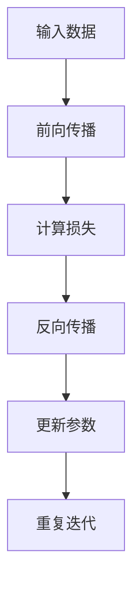
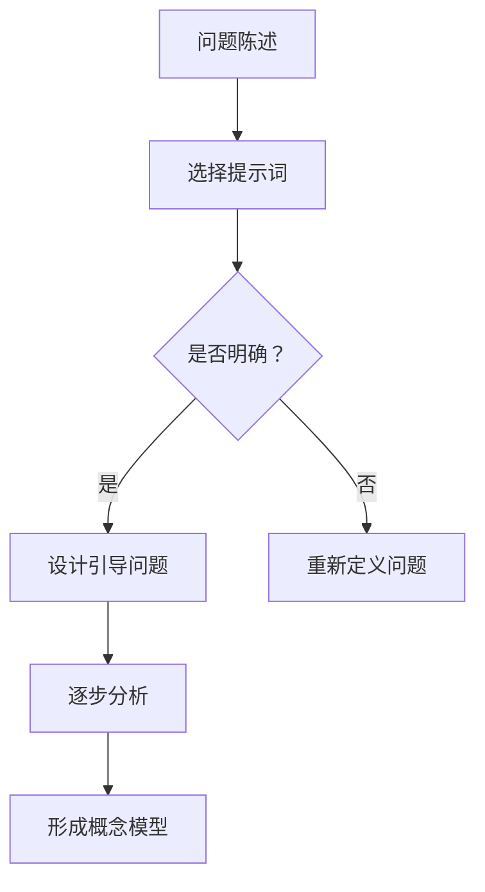
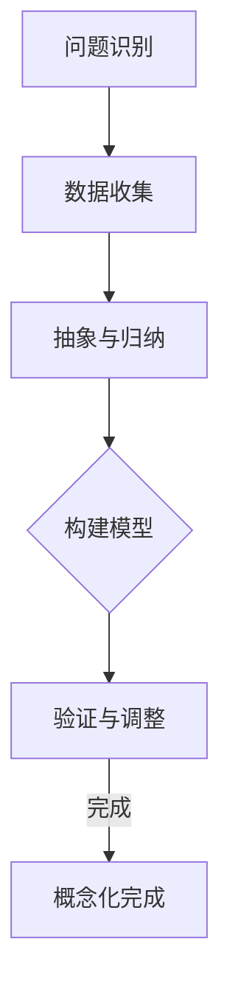

                 

# 大模型抽象思维：提示词引导概念化过程

## 关键词
- 大模型
- 抽象思维
- 提示词
- 概念化过程
- 人工智能

## 摘要
本文旨在探讨大模型抽象思维的概念及其在提示词引导下的概念化过程。通过深入分析大模型的基础知识、抽象思维的方法与实践、概念化过程的实施以及相关案例分析，本文旨在为读者提供一个系统化的理解框架，帮助其在人工智能领域中更好地应用这些理论。同时，本文也将结合具体项目实战，为读者提供实际操作的经验与技巧。

## 引言

### 1.1 书籍目的与结构
随着人工智能技术的不断发展，大模型成为当前研究的热点。然而，如何理解和运用这些复杂的大模型，实现有效的抽象思维和概念化过程，成为了一个亟待解决的问题。本书旨在为读者提供一个全面、系统的指南，帮助其掌握大模型抽象思维和提示词引导的概念化过程。

本书分为五个部分：

- **第一部分：引言与背景**：介绍大模型和抽象思维的基本概念，为后续内容奠定基础。
- **第二部分：大模型的基础知识**：详细阐述大模型的定义、特点和应用。
- **第三部分：抽象思维的方法与实践**：探讨抽象思维的基本原理和应用方法。
- **第四部分：概念化过程的实施**：介绍概念化过程的理论基础和实践方法。
- **第五部分：案例分析**：通过具体案例，展示概念化过程在实际中的应用。

### 1.2 大模型时代背景
大模型的概念最早可以追溯到深度学习的兴起。随着计算能力的提升和数据的积累，深度学习模型变得越来越复杂，规模也日益庞大。大模型的出现不仅提升了人工智能的准确性，也推动了新的研究方法和应用场景的出现。例如，在自然语言处理、计算机视觉和推荐系统等领域，大模型已经取得了显著的成果。

然而，大模型也带来了一系列挑战，如计算成本高、模型解释性差等。因此，如何有效理解和运用大模型，实现高效的抽象思维和概念化过程，成为了一个重要的研究方向。

### 1.3 抽象思维的概念与应用
抽象思维是人类思考的高级形式，它能够将具体的事物抽象成概念，从而进行更为复杂的推理和判断。在人工智能领域，抽象思维的应用主要体现在两个方面：一是对大模型的深入理解，二是通过概念化过程，将复杂的问题转化为可操作的模型。

提示词作为一种引导工具，可以在抽象思维过程中发挥重要作用。通过选择合适的提示词，可以帮助人们更准确地捕捉问题的核心，从而实现有效的概念化。

## 第二部分：大模型的基础知识

### 2.1 大模型概述
大模型，顾名思义，是指那些规模庞大、参数数量巨大的机器学习模型。这类模型在训练过程中需要消耗大量的计算资源和时间，但它们在处理复杂数据和任务时也展现了强大的能力。

大模型的基本概念可以从以下几个方面进行理解：

- **参数数量**：大模型通常包含数十亿至数万亿个参数。这些参数通过训练过程学习到数据中的特征，从而实现模型的能力提升。
- **计算资源**：大模型的训练和推理过程需要大量的计算资源，包括GPU、TPU等高性能计算设备。
- **应用领域**：大模型在自然语言处理、计算机视觉、推荐系统等领域展现了出色的性能，推动了相关技术的发展。

### 2.2 大模型的特点与分类
大模型具有以下特点：

- **高准确性**：由于模型参数数量庞大，大模型能够捕捉到数据中的更多细节，从而实现更高的预测准确性。
- **强泛化能力**：大模型在训练过程中通过大量的数据学习，具备较强的泛化能力，能够处理未见过的数据。
- **复杂性**：大模型的结构复杂，通常包含多层神经网络，这使得其理解和解释变得困难。

根据不同的分类标准，大模型可以分为多种类型：

- **按任务类型**：可以分为分类模型、回归模型、生成模型等。
- **按架构类型**：可以分为卷积神经网络（CNN）、循环神经网络（RNN）、变换器模型（Transformer）等。
- **按应用领域**：可以分为自然语言处理模型、计算机视觉模型、推荐系统模型等。

### 2.3 主流大模型介绍
在人工智能领域，一些主流的大模型成为研究和应用的焦点。以下介绍几个具有代表性的模型：

- **BERT**（Bidirectional Encoder Representations from Transformers）：BERT是一种预训练语言模型，通过双向Transformer结构学习到上下文信息，广泛应用于自然语言处理任务。
- **GPT-3**（Generative Pre-trained Transformer 3）：GPT-3是OpenAI开发的一种大型语言模型，拥有1750亿个参数，能够生成高质量的文本。
- **ResNet**（Residual Network）：ResNet是一种深度神经网络架构，通过引入残差连接解决了深层网络训练困难的问题，广泛应用于计算机视觉领域。
- **BERTweet**：BERTweet是一种针对Twitter文本的BERT变种，通过调整词汇表和模型结构，适应Twitter文本的特点。

这些模型在各自的领域取得了显著的成果，为后续的研究和应用提供了重要的参考。

## 2.2 大模型的数学基础

### 2.2.1 深度学习基础

深度学习是构建大模型的核心技术。它通过多层的神经网络对数据进行特征提取和学习，从而实现复杂的模式识别和预测任务。以下是深度学习的一些基本概念：

- **神经网络**：神经网络由多个神经元（节点）组成，每个节点负责计算输入信号的加权和，并通过激活函数产生输出。
- **前向传播**：在前向传播过程中，输入信号从网络的输入层流向输出层，每个节点计算输入的加权和，并通过激活函数产生输出。
- **反向传播**：在反向传播过程中，模型根据预测误差计算梯度，从而更新模型的参数，以达到更准确的预测。
- **损失函数**：损失函数用于衡量模型的预测误差，常见的损失函数包括均方误差（MSE）和交叉熵损失。

### 2.2.2 数学公式与原理

深度学习中的数学公式和原理是理解和应用大模型的基础。以下是几个关键的数学概念：

- **激活函数**：激活函数用于引入非线性特性，常见的激活函数包括 sigmoid、ReLU 和 tanh。
- **反向传播算法**：反向传播算法通过计算梯度更新模型参数，以优化模型性能。
- **梯度下降**：梯度下降是一种优化算法，通过沿着梯度的反方向更新参数，以减少损失函数的值。

以下是几个常用的数学公式：

- 梯度计算公式：
  $$\frac{\partial L}{\partial w} = \frac{\partial L}{\partial z} \cdot \frac{\partial z}{\partial w}$$
  
  其中，\(L\) 是损失函数，\(w\) 是模型参数，\(z\) 是前一层节点的输出。

- 反向传播算法公式：
  $$w_{\text{new}} = w_{\text{current}} - \alpha \cdot \frac{\partial L}{\partial w}$$

  其中，\(\alpha\) 是学习率。

### 2.2.3 Mermaid流程图示例

为了更好地理解深度学习的数学原理，我们可以使用Mermaid流程图来可视化相关过程。以下是一个简单的Mermaid流程图示例：



通过这样的流程图，我们可以清晰地看到深度学习过程中的各个步骤及其相互关系。

## 2.3 大模型的应用场景

### 2.3.1 人工智能领域的应用

大模型在人工智能领域具有广泛的应用。以下是一些典型的应用场景：

- **自然语言处理**：大模型如BERT和GPT-3在文本分类、机器翻译、问答系统等方面取得了显著成果。例如，BERT在多项自然语言处理任务中取得了SOTA（State-of-the-Art）的性能。
- **计算机视觉**：大模型如ResNet和EfficientNet在图像分类、目标检测、图像生成等方面表现优异。例如，EfficientNet通过设计高效的网络架构，在保持性能的同时大幅减少了计算成本。
- **推荐系统**：大模型如DeepFM和BERT-4Rec在推荐系统中发挥了重要作用。例如，DeepFM结合了深度学习和因子分解机，实现了高效的推荐效果。

### 2.3.2 抽象思维在现实中的应用

抽象思维不仅在大模型中发挥作用，也在现实生活中得到了广泛应用。以下是一些具体的例子：

- **商业决策**：通过抽象思维，企业可以更清晰地理解市场需求和竞争态势，从而做出更为科学的决策。
- **科学研究**：抽象思维帮助科学家从具体现象中提炼出核心问题，从而推动科学发现和技术创新。
- **日常生活**：在日常生活中，抽象思维可以帮助我们更好地理解复杂的信息，提高工作和学习效率。

### 2.4 大模型的挑战与未来

尽管大模型在许多领域取得了显著成果，但它们也面临一系列挑战：

- **计算成本**：大模型的训练和推理需要大量的计算资源，这给硬件设备和能源消耗带来了巨大的压力。
- **模型解释性**：大模型通常表现为“黑盒”模型，其内部机制难以解释，这给模型的可靠性和可解释性带来了挑战。
- **数据隐私**：大模型的训练和推理过程需要大量数据，这涉及到数据隐私和安全的问题。

未来，随着技术的不断发展，大模型的应用前景将更加广阔。以下是一些可能的发展趋势：

- **高效算法**：研究者将开发更高效的训练和推理算法，以减少计算成本。
- **可解释性**：通过改进模型结构和算法，提高大模型的可解释性，使其在实际应用中更具可信度。
- **联邦学习**：通过联邦学习等技术，实现数据的隐私保护和模型的协同训练。

## 第三部分：抽象思维的方法与实践

### 3.1 抽象思维的基本原理

抽象思维是人类思维的高级形式，它通过将具体的事物抽象为概念，从而实现对复杂问题的理解和解决。以下从几个方面介绍抽象思维的基本原理：

#### 3.1.1 抽象思维的定义与特征

抽象思维是指从具体事物中抽象出一般特征和规律，形成概念和原则，从而进行推理和判断的过程。其核心特征包括：

- **抽象性**：将具体事物简化为抽象的概念和模型。
- **普适性**：抽象思维能够将某一领域的知识应用到其他领域。
- **系统性**：通过构建概念体系和模型，实现对复杂问题的系统化理解。

#### 3.1.2 抽象思维的核心概念

抽象思维的核心概念包括：

- **概念**：抽象思维的基本单元，用于表示一类具有共同特征的事物。
- **模型**：通过抽象概念构建的数学或逻辑结构，用于描述和预测现实世界。
- **原则**：基于抽象思维得出的规律和规则，用于指导实践。

#### 3.1.3 抽象思维的数学模型

在抽象思维过程中，数学模型发挥着重要作用。常见的数学模型包括：

- **函数模型**：用于描述变量之间的关系。
- **概率模型**：用于描述随机事件的发生概率。
- **神经网络模型**：用于模拟人脑的神经网络结构，实现复杂的抽象思维。

### 3.2 提示词在抽象思维中的应用

提示词是一种引导工具，它能够帮助人们在抽象思维过程中更准确地捕捉问题的核心。以下从几个方面介绍提示词在抽象思维中的应用：

#### 3.2.1 提示词的概念与类型

提示词是指用于引导思考、提示思维方向的词语或短语。根据不同的用途和形式，提示词可以分为以下类型：

- **引导性提示词**：用于引导思考方向，如“为什么”、“如何”等。
- **反思性提示词**：用于反思现有思维，如“是否”、“是否可能”等。
- **扩展性提示词**：用于扩展思维，如“除此之外”、“还有哪些”等。

#### 3.2.2 提示词的设计与使用

设计和使用提示词需要遵循以下原则：

- **针对性**：根据问题的具体情境，选择适合的提示词。
- **启发性**：提示词应能够激发思考和创造力，引导思维向更深层次发展。
- **连贯性**：提示词之间应形成合理的逻辑关系，确保思维过程的连贯性。

#### 3.2.3 Mermaid流程图示例

为了更好地理解提示词在抽象思维中的应用，我们可以使用Mermaid流程图来可视化相关过程。以下是一个简单的Mermaid流程图示例：



通过这样的流程图，我们可以清晰地看到提示词在抽象思维过程中的应用和作用。

### 3.3 抽象思维的实际应用

抽象思维在现实生活中有着广泛的应用。以下从几个方面介绍抽象思维在实际应用中的具体实例：

#### 3.3.1 抽象思维在商业决策中的应用

在商业决策中，抽象思维可以帮助企业更清晰地理解市场动态和竞争态势，从而做出更为科学的决策。以下是一个具体案例：

- **案例背景**：某电商企业需要评估是否进入一个新的市场。
- **抽象思维过程**：企业通过收集市场数据，分析市场需求、竞争态势、消费者行为等，形成市场概貌，并构建概念模型，评估进入该市场的可行性和潜在风险。

#### 3.3.2 抽象思维在科学研究中的应用

在科学研究中，抽象思维可以帮助科学家更深入地理解自然现象和科学规律。以下是一个具体案例：

- **案例背景**：某科学家研究地球气候变化的规律。
- **抽象思维过程**：科学家通过分析气象数据、地质数据等，构建气候变化的数学模型，研究气候变化的影响因素和机制，提出科学假设并验证。

#### 3.3.3 抽象思维在日常生活中的应用

在日常生活中，抽象思维可以帮助我们更好地理解和解决问题。以下是一个具体案例：

- **案例背景**：家庭主妇需要为家人准备一桌丰盛的晚餐。
- **抽象思维过程**：家庭主妇通过分析家庭成员的口味、营养需求等，设计菜谱，并合理安排烹饪时间，确保晚餐丰盛且健康。

### 3.4 抽象思维的最佳实践

为了提高抽象思维的效果，以下是一些建议和最佳实践：

- **多角度思考**：在思考问题时，尝试从多个角度进行分析，避免片面思维。
- **记录与反思**：在思考过程中，及时记录自己的想法和疑问，进行反思和调整。
- **学习借鉴**：学习其他领域和行业的抽象思维方法，借鉴其经验和技巧。
- **实践检验**：将抽象思维应用于实际问题，通过实践检验思维的有效性和可行性。

通过以上方法，我们可以更好地运用抽象思维，提高问题解决能力和创新思维。

## 第四部分：概念化过程的实施

### 4.1 概念化过程的理论基础

概念化过程是指将复杂的问题或现象转化为概念和模型的过程。这一过程的理论基础主要包括以下几个方面：

#### 4.1.1 概念化过程的定义

概念化过程是指通过抽象和归纳，将具体的事物或现象转化为抽象概念和模型的过程。概念化过程的核心目标是从复杂的现象中提取出关键信息，形成易于理解和操作的概念体系。

#### 4.1.2 概念化过程的关键步骤

概念化过程通常包括以下关键步骤：

1. **问题识别**：明确要解决的问题或要理解的现象。
2. **数据收集**：收集与问题相关的数据和信息。
3. **抽象与归纳**：从数据中提取关键特征，形成抽象概念。
4. **模型构建**：根据抽象概念，构建数学或逻辑模型。
5. **验证与调整**：通过实践检验模型的有效性，并进行调整。

#### 4.1.3 概念化过程的数学模型

在概念化过程中，数学模型发挥着重要作用。常见的数学模型包括：

- **函数模型**：用于描述变量之间的关系。
- **概率模型**：用于描述随机事件的发生概率。
- **神经网络模型**：用于模拟人脑的神经网络结构，实现复杂的抽象思维。

### 4.2 提示词引导的概念化方法

提示词是引导概念化过程的重要工具。以下从几个方面介绍提示词引导的概念化方法：

#### 4.2.1 提示词的选择策略

选择合适的提示词是概念化过程的关键。以下是一些建议：

- **针对性**：根据问题的具体情境，选择能够引导思维方向的提示词。
- **启发性**：选择能够激发思考和创造力的提示词。
- **连贯性**：确保提示词之间形成合理的逻辑关系。

#### 4.2.2 提示词的引导技巧

在使用提示词时，以下技巧有助于提高概念化过程的效率：

- **逐步引导**：从简单到复杂，逐步引导思维。
- **多角度思考**：从多个角度分析问题，形成全面的概念体系。
- **反思与修正**：在概念化过程中，不断反思和修正自己的思考方向。

#### 4.2.3 Mermaid流程图示例

为了更好地理解提示词引导的概念化过程，我们可以使用Mermaid流程图来可视化相关过程。以下是一个简单的Mermaid流程图示例：



通过这样的流程图，我们可以清晰地看到提示词在概念化过程中的作用。

### 4.3 概念化过程的实践

#### 4.3.1 实践案例解析

以下通过一个具体案例，解析概念化过程的实践：

- **案例背景**：某企业需要开发一款新的人工智能产品。
- **概念化过程**：
  1. **问题识别**：明确产品目标、市场需求和竞争态势。
  2. **数据收集**：收集用户反馈、市场数据、竞品分析等。
  3. **抽象与归纳**：从数据中提取关键特征，形成产品概念。
  4. **模型构建**：根据产品概念，构建技术架构和业务模型。
  5. **验证与调整**：通过用户测试和反馈，验证产品效果，并进行调整。

#### 4.3.2 实践技巧与注意事项

在概念化过程的实践中，以下技巧和注意事项有助于提高效果：

- **明确目标**：确保概念化过程的目标清晰，避免盲目性。
- **充分数据支持**：确保收集到的数据充分且可靠，为概念化过程提供坚实基础。
- **持续反馈与调整**：在概念化过程中，及时反馈和调整，确保概念的准确性和可行性。
- **跨学科合作**：结合不同领域的知识和经验，形成更为全面的概念体系。

#### 4.3.3 Mermaid流程图与Python代码结合示例

为了更好地展示概念化过程，我们可以使用Mermaid流程图和Python代码进行结合。以下是一个简单的示例：

```python
# 导入所需库
import pandas as pd
import numpy as np

# 数据收集
data = {'特征1': [1, 2, 3, 4, 5],
         '特征2': [5, 4, 3, 2, 1]}
df = pd.DataFrame(data)

# 抽象与归纳
abstracted_data = df.describe()

# 模型构建
model = np.mean(df)

# 验证与调整
print("抽象化数据：", abstracted_data)
print("模型结果：", model)
```

通过这样的结合，我们可以更直观地看到概念化过程的不同阶段。

### 4.4 概念化过程的应用场景

概念化过程在各个领域都有广泛的应用。以下从几个方面介绍概念化过程的应用场景：

#### 4.4.1 教育领域的应用

在教育领域，概念化过程可以帮助学生更好地理解和掌握知识。以下是一个具体案例：

- **案例背景**：某教师需要为学生讲解复杂的概念。
- **概念化过程**：
  1. **问题识别**：明确要讲解的概念。
  2. **数据收集**：收集相关资料和案例。
  3. **抽象与归纳**：从资料和案例中提取关键特征，形成概念模型。
  4. **模型构建**：根据概念模型，设计教学方法和策略。
  5. **验证与调整**：通过教学实践，验证教学效果，并进行调整。

#### 4.4.2 企业管理的应用

在企业领域，概念化过程可以帮助管理者更好地理解和解决管理问题。以下是一个具体案例：

- **案例背景**：某企业需要进行战略规划。
- **概念化过程**：
  1. **问题识别**：明确企业面临的挑战和机遇。
  2. **数据收集**：收集市场数据、竞争态势等。
  3. **抽象与归纳**：从数据中提取关键信息，形成战略模型。
  4. **模型构建**：根据战略模型，制定具体战略计划。
  5. **验证与调整**：通过市场反馈和绩效评估，验证战略效果，并进行调整。

#### 4.4.3 科研创新的应用

在科研领域，概念化过程可以帮助科研人员更好地理解和解决科研问题。以下是一个具体案例：

- **案例背景**：某科研团队需要解决一个复杂的科研问题。
- **概念化过程**：
  1. **问题识别**：明确科研问题。
  2. **数据收集**：收集相关数据和文献。
  3. **抽象与归纳**：从数据和文献中提取关键信息，形成科研模型。
  4. **模型构建**：根据科研模型，设计实验方案和研究方法。
  5. **验证与调整**：通过实验结果，验证科研假设，并进行调整。

通过这些案例，我们可以看到概念化过程在各个领域的广泛应用和重要作用。

## 第五部分：案例分析

### 5.1 案例一：教育领域的概念化过程应用

#### 5.1.1 案例背景

在当前教育领域中，如何提高学生的学习效果成为了一个重要问题。某教育科技公司希望通过概念化过程，设计出一款能够有效提升学生学习效果的学习软件。

#### 5.1.2 概念化过程实施

1. **问题识别**：明确要提升学生学习效果的目标。
2. **数据收集**：收集学生反馈、教师意见、教育专家建议等。
3. **抽象与归纳**：从数据中提取关键特征，如学生的学习习惯、兴趣爱好、学科知识点等。
4. **模型构建**：根据提取的关键特征，构建学习模型，包括学习路径规划、个性化推荐、学习反馈机制等。
5. **验证与调整**：通过实际使用和反馈，验证学习软件的效果，并根据反馈进行调整。

#### 5.1.3 案例分析与总结

通过概念化过程，教育科技公司成功设计出一款能够有效提升学生学习效果的学习软件。该软件通过个性化推荐和学习反馈机制，帮助学生更好地掌握知识点，提高学习效率。同时，通过持续反馈和调整，软件不断优化，为学生提供更好的学习体验。

### 5.2 案例二：企业管理的抽象思维应用

#### 5.2.1 案例背景

某企业在市场竞争中面临巨大压力，需要通过战略调整来提升竞争力。企业高层希望通过抽象思维，找到提升竞争力的关键点。

#### 5.2.2 概念化过程实施

1. **问题识别**：明确企业面临的竞争压力和战略目标。
2. **数据收集**：收集市场数据、竞争对手分析、企业内部数据等。
3. **抽象与归纳**：从数据中提取关键信息，如市场趋势、竞争对手策略、企业优势等。
4. **模型构建**：根据提取的关键信息，构建战略模型，包括市场定位、产品创新、市场营销等。
5. **验证与调整**：通过市场反馈和绩效评估，验证战略效果，并根据反馈进行调整。

#### 5.2.3 案例分析与总结

通过抽象思维和概念化过程，企业成功找到了提升竞争力的关键点，并制定了具体的战略计划。该战略计划通过市场定位、产品创新和市场营销等措施，有效提升了企业的市场竞争力。同时，通过持续反馈和调整，战略计划不断完善，为企业的发展提供了有力支持。

## 总结

本文围绕大模型抽象思维和提示词引导的概念化过程进行了深入探讨。通过分析大模型的基础知识、抽象思维的方法与实践、概念化过程的实施以及相关案例分析，我们系统地理解了大模型抽象思维和概念化过程的核心概念和实际应用。

### 主要结论：

1. **大模型的特点与应用**：大模型在人工智能领域具有高准确性和强泛化能力，广泛应用于自然语言处理、计算机视觉和推荐系统等。
2. **抽象思维的基本原理**：抽象思维是人类思维的高级形式，通过抽象和归纳，将具体的事物转化为概念和模型，实现对复杂问题的理解和解决。
3. **提示词在概念化过程中的作用**：提示词是引导概念化过程的重要工具，通过选择和运用合适的提示词，可以提高概念化过程的效率和质量。
4. **概念化过程的应用场景**：概念化过程在多个领域具有广泛应用，包括教育、企业管理、科学研究等。

### 最佳实践：

1. **明确目标**：在进行概念化过程时，确保明确目标，避免盲目性。
2. **充分数据支持**：收集充分且可靠的数据，为概念化过程提供坚实基础。
3. **持续反馈与调整**：在概念化过程中，及时反馈和调整，确保概念的准确性和可行性。
4. **跨学科合作**：结合不同领域的知识和经验，形成更为全面的概念体系。

### 注意事项：

1. **计算成本**：大模型的训练和推理需要大量计算资源，需要合理规划和使用。
2. **模型解释性**：大模型通常表现为“黑盒”模型，其内部机制难以解释，需要提高模型的可解释性。
3. **数据隐私**：大模型的训练和推理过程需要大量数据，需要关注数据隐私和安全问题。

### 拓展阅读：

1. **《大模型与深度学习》**：深入了解大模型和深度学习的理论基础和应用。
2. **《抽象思维与创造力》**：探讨抽象思维在创新中的应用和作用。
3. **《概念化过程与知识管理》**：研究概念化过程在知识管理中的应用和实践。

### 作者信息

作者：AI天才研究院/AI Genius Institute & 禅与计算机程序设计艺术 /Zen And The Art of Computer Programming

---

通过本文的深入探讨，我们希望能够为读者提供关于大模型抽象思维和概念化过程的理论指导和实践经验，助力其在人工智能领域取得更大的成就。

