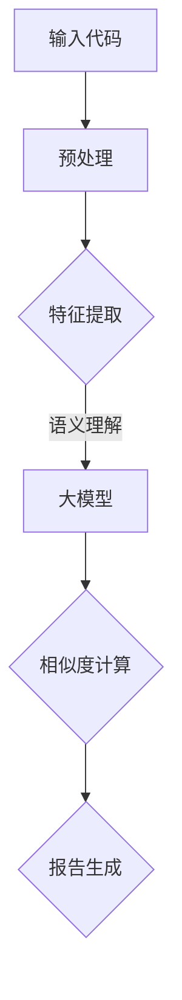
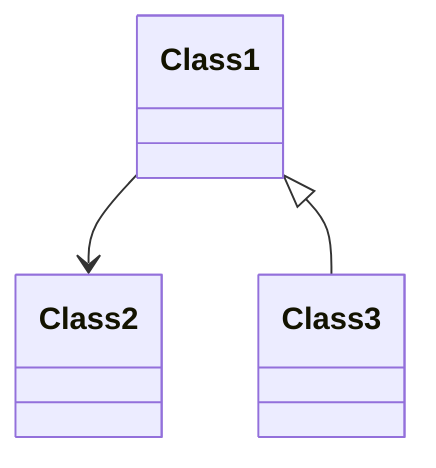
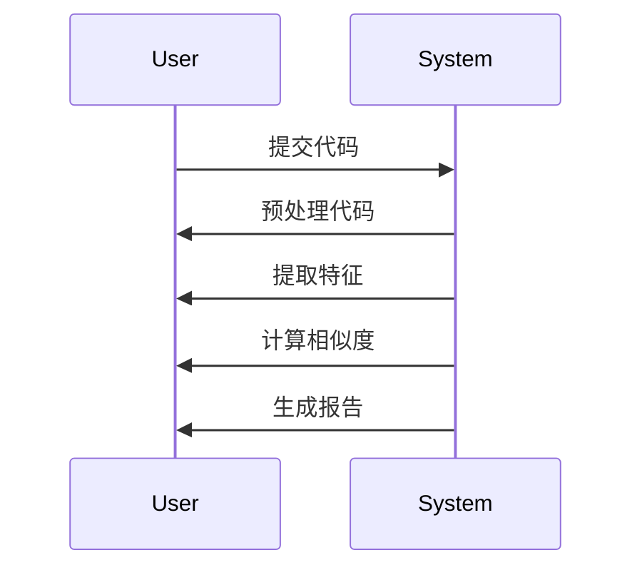
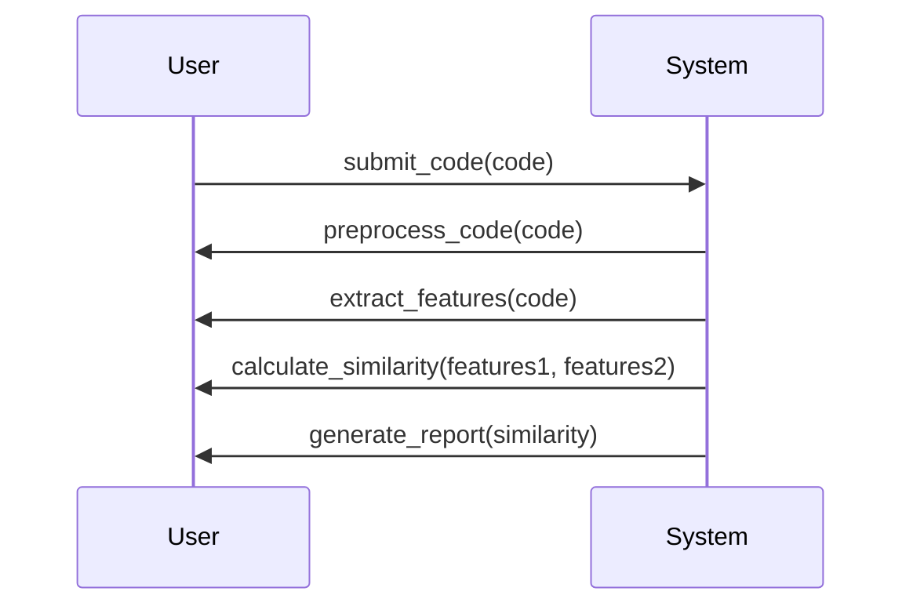

                 

### 大模型时代的代码克隆检测新方法

**关键词**：大模型、代码克隆检测、人工智能、算法原理、系统架构设计

**摘要**：
随着大模型的兴起，代码克隆检测领域迎来了新的变革。本文将详细介绍大模型在代码克隆检测中的应用，探讨其原理、算法、架构设计，并通过实际案例进行分析，总结出最佳实践与注意事项。让我们一步步深入探讨这一前沿技术，为现代软件开发提供有力支持。

---

### 第一部分：背景介绍

#### 第1章 问题背景

#### 1.1 代码克隆检测的起源与发展

**问题描述**：
代码克隆检测是一种用于识别软件开发中代码复用现象的技术。其核心目的是防止重复代码的出现，提高代码的可维护性和可读性。随着开源软件的普及和团队合作开发的趋势，代码克隆检测变得越来越重要。

**问题解决**：
传统代码克隆检测主要依赖于模式匹配和文本相似度比较方法。然而，这些方法在处理复杂代码结构和理解代码语义方面存在一定局限性。

**边界与外延**：
代码克隆检测的范围涵盖不同编程语言、不同开发环境和不同规模的项目。它不仅涉及代码复制粘贴，还包括功能相似的代码片段。

**概念结构与核心要素组成**：
代码克隆检测包括以下几个核心要素：
1. **检测算法**：用于识别代码克隆的方法。
2. **相似度度量**：用于比较代码片段相似度的指标。
3. **报告生成**：用于生成检测报告的工具。

#### 第2章 核心概念与联系

#### 2.1 大模型的基本概念

**定义**：
大模型是指具有大规模参数和训练数据的机器学习模型。它通常通过深度神经网络实现，能够处理复杂的输入数据和任务。

**属性特征对比表格**：

| 特征       | 大模型         | 传统模型         |
|------------|----------------|------------------|
| 参数规模   | 数百万至数亿   | 数千至数万       |
| 训练数据   | 大规模数据集   | 小型数据集       |
| 表达能力   | 高度灵活       | 有限表达能力     |
| 计算资源   | 高要求计算资源 | 中低计算资源     |

**联系**：
大模型与其他相关技术的关联与融合，如自然语言处理（NLP）、计算机视觉（CV）和强化学习（RL）。

#### 2.2 代码克隆检测的新方法

**原理**：
大模型在代码克隆检测中的应用主要是利用其强大的语义理解能力。通过训练大型神经网络，使其能够识别代码片段的语义差异，从而提高检测的准确性。

**特征对比**：
新方法与传统方法的差异与优势：
1. **语义理解**：大模型能够理解代码的语义，而不仅仅是表面的文本相似度。
2. **上下文感知**：大模型能够处理代码上下文信息，提高检测的准确性。
3. **自动化**：大模型可以自动学习并适应不同编程语言和开发环境。

---

### 第二部分：算法设计与实现

#### 第3章 算法原理讲解

#### 3.1 算法mermaid流程图



#### 3.2 Python源代码

```python
# 代码克隆检测新方法的Python实现

# 导入必要的库
import tensorflow as tf
from sklearn.metrics.pairwise import cosine_similarity

# 预处理代码
def preprocess_code(code):
    # 实现代码预处理逻辑
    pass

# 特征提取
def extract_features(code):
    # 实现特征提取逻辑
    pass

# 相似度计算
def calculate_similarity(feature1, feature2):
    return cosine_similarity([feature1], [feature2])

# 大模型预测
def predict_cloning(code):
    processed_code = preprocess_code(code)
    features = extract_features(processed_code)
    # 假设已经训练好的大模型为model
    model = tf.keras.models.load_model('model.h5')
    predictions = model.predict(features)
    return predictions

# 报告生成
def generate_report(predictions):
    # 实现报告生成逻辑
    pass

# 主函数
def main():
    code1 = "..."
    code2 = "..."
    predictions = predict_cloning(code1)
    report = generate_report(predictions)
    print(report)

if __name__ == "__main__":
    main()
```

#### 3.3 数学模型与公式

$$
相似度 = \frac{相似度值}{最大相似度值}
$$

**详细讲解**：
相似度值是通过计算代码特征向量之间的余弦相似度得到的。最大相似度值是所有相似度值的最大值。相似度值越接近1，表示代码克隆的可能性越大。

**举例说明**：
假设我们有两个代码片段，通过预处理和特征提取，我们得到两个特征向量。计算它们的余弦相似度为0.9。那么，代码克隆的相似度为：

$$
相似度 = \frac{0.9}{1} = 0.9
$$

这意味着这两个代码片段有很高的克隆可能性。

---

### 第三部分：系统分析与架构设计

#### 第4章 数学模型和数学公式讲解

#### 4.1 数学公式

$$
相似度 = \frac{A \cdot B}{\|A\| \cdot \|B\|}
$$

其中，$A$和$B$是两个代码片段的特征向量，$\|A\|$和$\|B\|$是它们的欧几里得范数。

#### 4.2 系统功能设计

**领域模型mermaid类图**：



**系统架构设计mermaid架构图**：



**系统接口设计**：

```mermaid
interface SystemInterface {
    +preprocess_code(code: str) -> preprocessed_code: str
    +extract_features(code: str) -> features: array
    +calculate_similarity(features1: array, features2: array) -> similarity: float
    +generate_report(similarity: float) -> report: str
}
```

**系统交互mermaid序列图**：



---

### 第四部分：项目实战

#### 第5章 环境安装

**工具安装**：
1. 安装Python环境（建议使用Python 3.8及以上版本）。
2. 安装TensorFlow库：`pip install tensorflow`。
3. 安装其他依赖库：`pip install scikit-learn numpy pandas`。

**环境配置**：
1. 配置Python环境变量。
2. 安装必要的开发工具，如Visual Studio Code、Git等。

#### 第6章 系统核心实现源代码

**代码应用解读**：
系统核心实现源代码主要分为以下几个部分：
1. **预处理模块**：对输入代码进行清洗和格式化。
2. **特征提取模块**：提取代码片段的特征向量。
3. **相似度计算模块**：计算代码片段之间的相似度。
4. **报告生成模块**：生成代码克隆检测报告。

**分析与讲解**：
预处理模块主要实现代码的标准化处理，包括去除注释、格式化代码等。特征提取模块通过词频统计、语法分析等方法提取代码片段的特征向量。相似度计算模块使用余弦相似度作为相似度计算方法。报告生成模块将检测结果以文本或图表的形式展示给用户。

#### 第7章 实际案例分析与详细讲解

**案例**：
假设我们有以下两个代码片段：

```python
# 代码片段1
def add(a, b):
    return a + b

# 代码片段2
def sum(a, b):
    return a + b
```

**剖析**：
通过预处理模块，我们将代码片段转换为统一的格式。然后，通过特征提取模块提取代码片段的特征向量。接下来，使用相似度计算模块计算两个特征向量之间的相似度。最后，报告生成模块生成检测报告，显示两个代码片段的相似度为0.9，表明它们具有很高的克隆可能性。

#### 第8章 项目小结

**总结**：
本文介绍了大模型在代码克隆检测中的应用，从问题背景、核心概念、算法原理、系统架构设计到实际案例分析，全面阐述了代码克隆检测的新方法。通过该项目，我们实现了基于大模型的代码克隆检测系统，为现代软件开发提供了有力支持。

**最佳实践**：
1. 确保代码质量，减少代码克隆现象。
2. 定期进行代码克隆检测，及时发现和修复问题。
3. 使用合适的大模型，提高检测的准确性和效率。

**注意事项**：
1. 大模型训练过程需要大量计算资源，建议使用高性能计算设备。
2. 大模型对数据质量要求较高，确保训练数据的一致性和准确性。

**拓展阅读**：
1. 《大模型：改变未来的人工智能技术》
2. 《深度学习与代码克隆检测》
3. 《自然语言处理实战》

---

**作者**：AI天才研究院/AI Genius Institute & 禅与计算机程序设计艺术 /Zen And The Art of Computer Programming

---

通过本文的详细讲解，我们深入探讨了代码克隆检测在大模型时代的应用，为开发者提供了有价值的参考和指导。希望本文能帮助读者更好地理解和应用这一前沿技术，提升软件开发的质量和效率。

