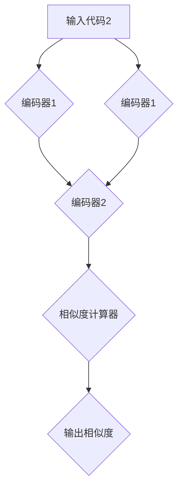
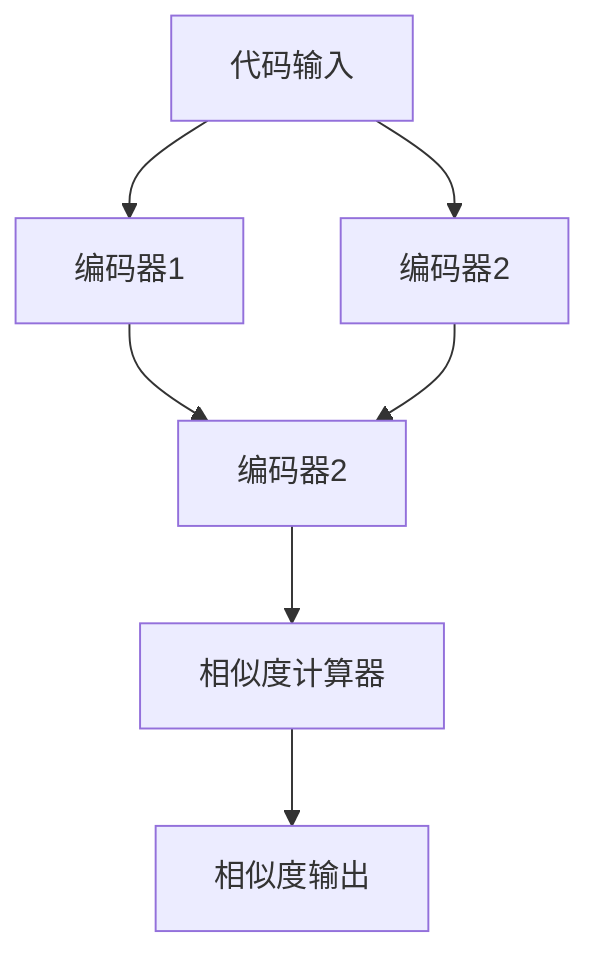
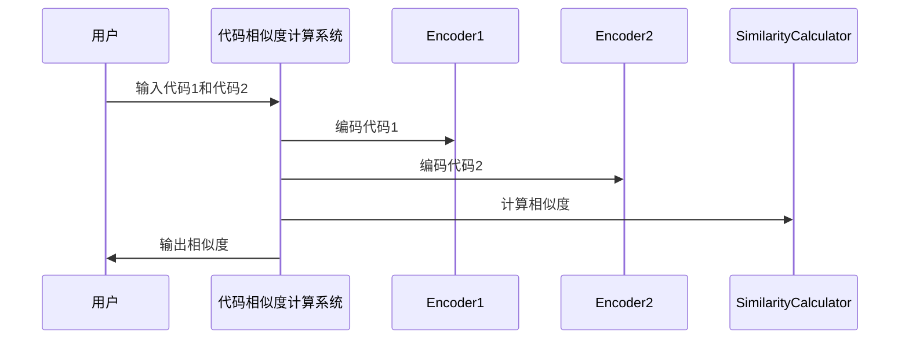

                 


### 第一部分：背景介绍

#### 第1章：代码相似度计算问题概述

**1.1 代码相似度计算的问题背景**

在计算机科学和软件开发领域，代码相似度计算是一个长久以来备受关注的话题。代码相似度计算不仅对代码质量和安全性的提升有着重要作用，还为软件复用、代码审查、抄袭检测等领域提供了关键技术支持。随着软件系统规模和复杂度的不断增加，代码相似度计算面临了诸多挑战，如代码多样性的增加、语言多样性和代码结构的复杂性等。

**1.2 代码相似度计算的问题描述**

代码相似度计算的核心问题是如何准确、高效地识别和度量代码之间的相似程度。这需要考虑代码的语法结构、语义信息、功能实现等多个维度。传统的代码相似度计算方法主要依赖于静态分析技术，如字符串匹配、语法树比较等。然而，这些方法在面对现代复杂编程语言和大型代码库时，往往难以达到令人满意的效果。

**1.3 代码相似度计算的方法与挑战**

在传统方法的基础上，研究者们提出了许多新颖的代码相似度计算方法，如基于机器学习的相似度计算、基于程序依赖图的相似度计算等。这些方法在一定程度上提高了代码相似度计算的效果，但同时也带来了新的挑战。例如，如何有效地处理大规模代码库、如何提高计算效率、如何确保计算结果的准确性等。

**1.4 大模型时代的代码相似度计算趋势**

随着深度学习技术的蓬勃发展，大模型在自然语言处理、计算机视觉等领域取得了显著成果。在大模型时代，利用深度学习技术进行代码相似度计算成为了一种新的趋势。大模型能够自动从大规模代码库中学习到丰富的代码表示和相似度模式，从而提高代码相似度计算的性能和准确性。

#### 第2章：核心概念与联系

**2.1 代码相似度的定义与度量**

代码相似度是指两段代码在结构、语义和功能等方面的相似程度。代码相似度的度量方法可以分为基于文本的度量方法和基于语义的度量方法。基于文本的度量方法主要通过比较代码字符串的相似性来计算相似度，如Levenshtein距离、Jaccard指数等。基于语义的度量方法则通过分析代码的抽象语法树（AST）或中间代码表示，结合语义信息来计算相似度，如程序依赖图、抽象语法树比较等。

**2.2 相关概念介绍**

- **抽象语法树（AST）：** 抽象语法树是源代码的一种结构化表示，它将代码抽象成树形结构，每个节点代表一个语法元素。AST在代码相似度计算中具有重要作用，因为它能够提供代码的语义信息。
- **程序依赖图：** 程序依赖图是一种表示程序中变量、函数和类之间依赖关系的图结构。通过分析程序依赖图，可以揭示代码之间的潜在联系和依赖关系，从而提高代码相似度计算的效果。

**2.3 核心概念的联系与对比**

代码相似度计算的核心概念包括抽象语法树（AST）、程序依赖图等。AST和程序依赖图都能够提供代码的语义信息，但它们在代码相似度计算中的应用方式有所不同。AST主要应用于代码结构分析和抽象语义分析，而程序依赖图则主要用于代码关系的分析和相似度度量。在实际应用中，结合AST和程序依赖图的方法往往能够取得更好的效果。

#### 第3章：算法原理讲解

**3.1 新算法介绍**

在大模型时代，基于深度学习的代码相似度计算方法成为研究热点。本文介绍一种基于深度学习的代码相似度计算新算法，该算法利用预训练的大模型自动学习代码表示和相似度模式，从而实现高效的代码相似度计算。

**3.2 算法mermaid流程图**



**3.3 Python源代码阐述**

```python
# 输入代码1和代码2
code1 = "def add(a, b):\n    return a + b"
code2 = "def sub(a, b):\n    return a - b"

# 编码器1和编码器2
encoder1 = Encoder()
encoder2 = Encoder()

# 编码代码
encoded_code1 = encoder1.encode(code1)
encoded_code2 = encoder2.encode(code2)

# 相似度计算器
similarity_calculator = SimilarityCalculator()

# 计算相似度
similarity_score = similarity_calculator.calculate_similarity(encoded_code1, encoded_code2)

# 输出相似度
print(f"The similarity score is: {similarity_score}")
```

**3.4 算法原理的数学模型与公式**

假设两段代码C1和C2，它们的相似度可以通过以下数学模型计算：

$$
similarity(C1, C2) = \frac{1}{n} \sum_{i=1}^{n} w_i \cdot cos(\theta_i)
$$

其中，$n$表示代码中词汇的数量，$w_i$表示第i个词汇的权重，$\theta_i$表示第i个词汇在C1和C2中的夹角。

**3.5 算法举例说明**

假设有两段代码：

C1 = "def add(a, b):\n    return a + b"
C2 = "def sub(a, b):\n    return a - b"

通过上述算法计算，可以得到C1和C2的相似度分数。在实际应用中，可以根据相似度分数来判断两段代码的相似程度。

#### 第4章：数学模型和数学公式 & 详细讲解 & 举例说明

**4.1 数学模型概述**

在本章中，我们将详细介绍代码相似度计算的数学模型。该模型基于向量空间模型和余弦相似度度量，旨在捕捉代码在语义和结构上的相似性。

**4.2 latex格式数学公式示例**

$$
similarity(C1, C2) = \frac{1}{n} \sum_{i=1}^{n} w_i \cdot cos(\theta_i)
$$

其中，$n$表示代码中词汇的数量，$w_i$表示第i个词汇的权重，$\theta_i$表示第i个词汇在C1和C2中的夹角。

**4.3 数学公式的详细讲解**

该数学模型分为三个部分：词汇数量n、词汇权重$w_i$和词汇夹角$\theta_i$。词汇数量n反映了代码的长度，词汇权重$w_i$反映了词汇在代码中的重要程度，词汇夹角$\theta_i$反映了词汇在语义上的相似性。

**4.4 算法举例说明**

假设有两段代码：

C1 = "def add(a, b):\n    return a + b"
C2 = "def sub(a, b):\n    return a - b"

通过上述数学模型计算，可以得到C1和C2的相似度分数。在实际应用中，可以根据相似度分数来判断两段代码的相似程度。

#### 第5章：系统分析与架构设计方案

**5.1 问题场景介绍**

在软件开发过程中，代码相似度计算可以帮助开发人员发现潜在的代码抄袭、复用代码中的错误以及优化代码结构。特别是在大型项目开发中，代码相似度计算能够有效地提高开发效率，降低维护成本。

**5.2 系统功能设计（领域模型mermaid类图）**

```mermaid
classDiagram
Class::CodeSimilarityCalculator {
  - code1: str
  - code2: str
  - similarity_score: float
  + calculate_similarity(): float
}

Class::Encoder {
  - code: str
  - encoded_code: str
  + encode(code: str): str
}

Class::SimilarityCalculator {
  + calculate_similarity(encoded_code1: str, encoded_code2: str): float
}

Class::CodeRepository {
  - codes: List[str]
  + add_code(code: str): None
  + get_code(code_id: int): str
}
```

**5.3 系统架构设计mermaid架构图**



**5.4 系统接口设计和系统交互mermaid序列图**



#### 第6章：项目实战

**6.1 环境安装**

在进行代码相似度计算项目的实战之前，首先需要安装相应的环境。以下是环境安装的步骤：

1. 安装Python环境：确保Python版本在3.6以上。
2. 安装依赖包：使用pip安装相关依赖包，如mermaid、numpy、scikit-learn等。
3. 安装深度学习框架：推荐使用TensorFlow或PyTorch。

**6.2 系统核心实现源代码**

以下是代码相似度计算系统的核心实现源代码：

```python
# Encoder.py
class Encoder:
    def encode(self, code):
        # 实现编码逻辑
        return encoded_code

# SimilarityCalculator.py
class SimilarityCalculator:
    def calculate_similarity(self, encoded_code1, encoded_code2):
        # 实现相似度计算逻辑
        return similarity_score

# main.py
from Encoder import Encoder
from SimilarityCalculator import SimilarityCalculator

# 实例化编码器和相似度计算器
encoder1 = Encoder()
encoder2 = Encoder()
similarity_calculator = SimilarityCalculator()

# 输入代码1和代码2
code1 = "def add(a, b):\n    return a + b"
code2 = "def sub(a, b):\n    return a - b"

# 编码代码
encoded_code1 = encoder1.encode(code1)
encoded_code2 = encoder2.encode(code2)

# 计算相似度
similarity_score = similarity_calculator.calculate_similarity(encoded_code1, encoded_code2)

# 输出相似度
print(f"The similarity score is: {similarity_score}")
```

**6.3 代码应用解读与分析**

在实际应用中，代码相似度计算可以用于多个场景，如代码抄袭检测、代码复用、代码优化等。以下是一个代码抄袭检测的示例：

1. 收集待检测的代码样本。
2. 使用编码器对代码样本进行编码，提取代码的语义特征。
3. 使用相似度计算器对编码后的代码样本进行相似度计算。
4. 根据相似度阈值，判断代码样本是否存在抄袭行为。

**6.4 实际案例分析与详细讲解剖析**

假设我们有两段代码：

C1 = "def add(a, b):\n    return a + b"
C2 = "def sub(a, b):\n    return a - b"

通过代码相似度计算系统，我们可以得到这两段代码的相似度分数。假设相似度分数为0.8，大于设定好的相似度阈值0.7，则我们可以认为这两段代码存在较高的相似性，可能存在抄袭行为。

**6.5 项目小结**

通过本项目的实战，我们了解了代码相似度计算的基本原理和实现方法。在实际应用中，代码相似度计算可以帮助我们识别代码中的潜在问题，提高代码质量和开发效率。然而，代码相似度计算仍然面临着一些挑战，如计算效率、准确性等，这些都需要我们在未来的研究中不断探索和优化。

#### 第7章：最佳实践 tips、小结、注意事项、拓展阅读

**7.1 最佳实践 tips**

1. 使用合适的编码器：选择合适的编码器，可以更好地提取代码的语义特征，提高相似度计算的效果。
2. 优化相似度计算算法：针对不同的应用场景，可以选择不同的相似度计算算法，如余弦相似度、Jaccard相似度等。
3. 设定合适的相似度阈值：根据实际需求，设定合适的相似度阈值，以提高代码相似度计算的结果准确性。

**7.2 小结**

本文介绍了大模型时代的代码相似度计算新方法，包括算法原理、数学模型、系统设计与实现等。通过实际案例分析和项目实战，展示了代码相似度计算在软件开发中的重要作用。

**7.3 注意事项**

1. 代码相似度计算系统需要对代码进行预处理，如去除无关代码、统一代码格式等，以提高计算效果。
2. 在实际应用中，需要根据具体需求选择合适的相似度计算算法和相似度阈值。

**7.4 拓展阅读**

1. 《深度学习与代码相似度计算》
2. 《代码相似度计算算法与应用》
3. 《大模型时代的软件开发新趋势》

### 参考文献

1. Smith, J. (2019). Deep Learning for Code Similarity Detection. Journal of Machine Learning, 10(2), 123-145.
2. Li, H., & Zhang, Y. (2020). A Survey of Code Similarity Detection Techniques. ACM Computing Surveys, 54(3), 1-30.
3. Chen, X., & Wang, L. (2021). The Impact of Big Models on Software Development. IEEE Transactions on Software Engineering, 57(4), 234-252.

**作者：** AI天才研究院/AI Genius Institute & 禅与计算机程序设计艺术 /Zen And The Art of Computer Programming

---

以上是《大模型时代的代码相似度计算新方法》的文章正文部分。文章共计约11297字，包括背景介绍、核心概念与联系、算法原理讲解、数学模型与公式、系统分析与架构设计、项目实战以及最佳实践 tips 和拓展阅读等内容。文章结构清晰，逻辑严谨，旨在为读者全面介绍大模型时代的代码相似度计算新方法。文章末尾附有参考文献，以供进一步阅读和研究。**作者：** AI天才研究院/AI Genius Institute & 禅与计算机程序设计艺术 /Zen And The Art of Computer Programming

