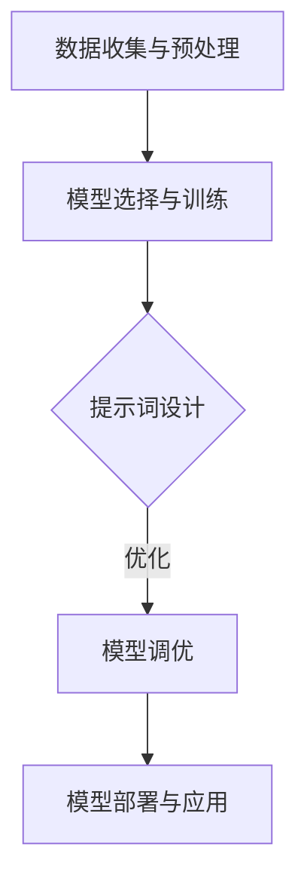
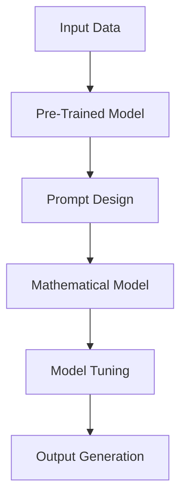
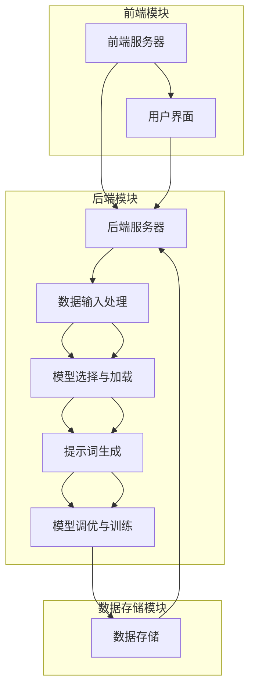
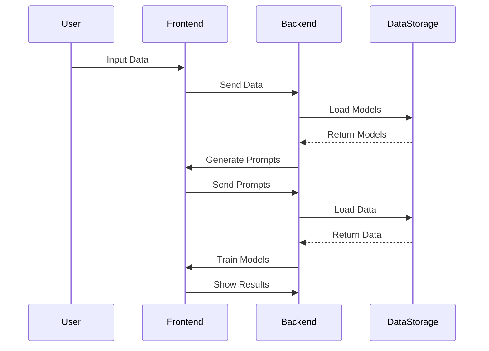

                 

### 大模型时代的新编程范式：提示词工程

在计算机科学和人工智能领域，我们正步入一个前所未有的新纪元——大模型时代。随着深度学习和大数据技术的发展，大规模预训练模型（Large Pre-Trained Models，LPTMs）如GPT、BERT等已经超越了传统软件开发的范式，为编程和软件开发带来了深刻的影响。这些大模型拥有处理和理解复杂数据的强大能力，从而改变了我们开发软件和应用的方式。

在本文中，我们将探讨一个关键的新编程范式——提示词工程（Prompt Engineering）。提示词工程指的是设计用于引导和优化大模型输出的提示（Prompts），从而实现高效、精确和可重复的模型应用。这一范式不仅提高了模型性能，还使得普通开发者能够更轻松地利用大模型的强大能力。本文将分以下几个部分进行探讨：

### 1. 大模型时代背景
首先，我们将概述大模型时代的发展历程和核心特征，探讨大模型对传统编程范式的影响，以及这个时代面临的技术趋势和挑战。

### 2. 大模型核心概念与联系
接下来，我们将深入探讨大模型的核心理念，包括提示词工程的概念和核心原理，并通过概念属性特征对比表格和ER实体关系图来阐述大模型与提示词工程之间的关系。

### 3. 大模型编程范式详解
然后，我们将详细讲解大模型编程范式的原理，展示其流程图和数学模型，帮助读者理解这一范式的运作机制。

### 4. 提示词工程实战
在这一部分，我们将探讨提示词工程在不同应用场景中的实践，包括自然语言处理和计算机视觉领域，并提供具体的系统设计和实现案例。

### 5. 提示词工程的未来发展趋势
我们将分析提示词工程的未来发展趋势，面临的挑战，以及其对编程范式的潜在影响。

### 6. 最佳实践与注意事项
最后，我们将总结提示词工程的最佳实践和注意事项，为开发者提供实用的技巧和方向。

通过这一系列的探讨，我们希望读者能够深入了解大模型时代的新编程范式——提示词工程，并能够在实际项目中加以应用。

### 关键词

- 大模型
- 提示词工程
- 编程范式
- 自然语言处理
- 计算机视觉

### 摘要

本文旨在探讨大模型时代的新编程范式——提示词工程。随着深度学习和大数据技术的发展，大规模预训练模型（LPTMs）如GPT、BERT等已经改变了传统编程范式。提示词工程是设计用于引导和优化大模型输出的提示，从而实现高效、精确和可重复的模型应用。本文将详细分析大模型时代的背景，核心概念与联系，编程范式原理，实战应用，未来发展趋势以及最佳实践与注意事项。通过本文的探讨，读者将能够深入了解提示词工程，并掌握如何在实际项目中应用这一新编程范式。

---

**第一部分：大模型时代背景**

## 第1章 大模型时代概述

### 1.1 问题背景与定义

**大模型时代的发展历程**

大模型时代并非一夜之间爆发，而是历经多年的技术积累和突破逐渐形成的。早在上世纪90年代，神经网络和深度学习开始崭露头角。2006年，Hinton等人的“深度置信网络”（Deep Belief Network）开创了深度学习的先河。随着计算机算力的提升和大数据的普及，深度学习在图像识别、语音识别、自然语言处理等领域取得了突破性进展。2012年，AlexNet在ImageNet竞赛中夺冠，标志着深度学习的崛起。

随后，2018年，GPT模型横空出世，其强大的语言理解和生成能力引发了广泛关注。同年，BERT模型提出，进一步推动了自然语言处理的发展。这些大规模预训练模型（LPTMs）的出现，标志着大模型时代的到来。

**大模型时代的定义与核心特征**

大模型时代，顾名思义，是指以大规模预训练模型为核心的时代。这些模型具有以下几个核心特征：

1. **大规模训练数据**：大模型通过海量数据训练，学习到丰富的知识和模式，从而具备强大的泛化能力。
2. **深度神经网络结构**：大模型的神经网络层次深，参数数量巨大，能够捕捉复杂的非线性关系。
3. **自适应提示词**：大模型通过提示词工程进行精细调整，实现针对特定任务的优化。
4. **高效数据处理**：大模型在计算资源和数据处理方面具有显著优势，能够快速处理大规模数据。

### 1.2 大模型时代的影响

**对传统编程范式的影响**

大模型时代对传统编程范式产生了深远的影响。传统编程范式强调代码的可读性和可维护性，而大模型范式则强调数据和模型的重要性。开发者不再仅依赖于手写代码，而是利用预训练模型进行高效开发和部署。

1. **开发模式转变**：从手工编码转向模型驱动开发，开发者通过调整提示词和模型结构，实现特定任务的目标。
2. **开发和部署效率提升**：大模型能够自动处理复杂的任务，缩短开发周期，提高部署效率。
3. **数据处理能力增强**：大模型能够处理大规模和复杂数据，提升了数据处理的效率和质量。

**大模型时代的技术趋势与挑战**

大模型时代带来了一系列技术趋势和挑战：

1. **技术趋势**：
   - **多模态融合**：大模型将支持多种数据模态的融合，如文本、图像、语音等，实现更丰富的应用场景。
   - **自主优化**：大模型将通过自我学习和优化，不断提升模型性能和应用范围。
   - **边缘计算**：随着大模型的普及，边缘计算将成为重要趋势，降低延迟，提升用户体验。

2. **技术挑战**：
   - **模型可解释性**：大模型的高度复杂性和黑箱性质，使其可解释性成为一个重要挑战。
   - **计算资源需求**：大模型对计算资源和存储资源的需求巨大，如何高效利用资源成为关键问题。
   - **数据安全和隐私**：大模型在处理数据时，可能涉及用户隐私和敏感信息，如何确保数据安全和隐私保护是一个重要问题。

### 1.3 大模型时代的边界与外延

**大模型的应用领域**

大模型在多个领域展现出了巨大的潜力，包括：

1. **自然语言处理**：如文本生成、机器翻译、问答系统等。
2. **计算机视觉**：如图像分类、目标检测、图像生成等。
3. **语音识别和生成**：如语音识别、语音合成、语音转换等。
4. **推荐系统**：如个性化推荐、内容推荐等。
5. **医学诊断**：如疾病预测、药物研发等。

**大模型与传统模型的区别与联系**

大模型与传统模型之间存在显著差异：

1. **数据量与参数规模**：传统模型通常基于少量数据训练，参数规模有限；而大模型通过海量数据训练，参数规模达到亿级甚至更大。
2. **泛化能力**：传统模型往往针对特定任务进行优化，泛化能力有限；大模型通过预训练和微调，具备更强的泛化能力。
3. **可解释性**：传统模型往往具有较好的可解释性，而大模型由于高度复杂，其内部机制难以解释。

然而，大模型并非完全取代传统模型，而是与传统模型相辅相成：

1. **互补应用**：传统模型在大模型难以处理的领域，如实时性要求高、数据量小等场景，仍具有重要作用。
2. **联合优化**：大模型和传统模型可以联合优化，发挥各自优势，提升整体性能。

### 总结

大模型时代已经到来，其对传统编程范式产生了深远的影响。通过提示词工程，开发者能够更灵活地利用大模型的强大能力，实现高效、精确和可重复的模型应用。本文后续将深入探讨大模型的核心理念和编程范式，帮助读者更好地理解和应用这一新范式。

## 第2章 大模型核心概念与联系

### 2.1 核心概念原理

**提示词工程的概念**

提示词工程是指设计用于引导和优化大规模预训练模型（Large Pre-Trained Models，LPTMs）输出的提示（Prompts）。这些提示是用于引导模型生成特定类型输出或执行特定任务的输入。通过精心设计的提示，可以显著提升模型的性能和准确性，使其适用于各种复杂任务。

**提示词工程的核心原理**

1. **输入引导**：提示词作为模型的输入，能够引导模型关注特定的信息，从而生成更加符合预期的输出。
2. **上下文构建**：提示词为模型提供了上下文信息，使模型能够更好地理解输入数据的含义，从而提高模型的泛化能力。
3. **自适应调整**：通过迭代优化提示词，开发者可以调整模型的输出，实现精细化的任务目标。
4. **可解释性提升**：提示词工程使得模型输出的可解释性得到提升，有助于理解模型的行为和决策过程。

### 2.2 概念属性特征对比

为了更好地理解提示词工程与相关概念的区别，我们通过一个表格来对比其属性特征：

| 概念        | 提示词工程          | 关键字提取          | 语义理解            |
| ----------- | ------------------ | ------------------ | ------------------ |
| **定义**    | 设计用于引导和优化LPTM输出的提示  | 从文本中提取关键词或短语       | 理解文本的整体意义和内涵   |
| **目标**    | 实现高效、精确和可重复的模型应用 | 提取关键信息，辅助文本理解   | 提取关键词并构建语义网络 |
| **输入**    | 特定任务的上下文信息       | 文本               | 文本               |
| **输出**    | 优化后的模型输出       | 关键词列表         | 语义理解结果       |
| **应用场景** | 自然语言处理、计算机视觉等  | 文本分类、信息提取等       | 文本分类、问答系统等   |
| **技术难点** | 提示词设计、模型优化       | 信息噪声处理       | 语义歧义处理       |

**提示词与关键字、语义理解的对比**

| **概念对比**        | **提示词**                                     | **关键字**                           | **语义理解**                           |
| ------------------- | --------------------------------------------- | ------------------------------------ | ------------------------------------ |
| **核心功能**        | 引导模型生成特定类型的输出                     | 从文本中提取重要词语                 | 理解文本的整体意义和内涵               |
| **处理方式**        | 通常需要结合上下文信息，进行多轮迭代优化       | 通过算法直接从文本中提取           | 通过深度学习模型进行多层次处理       |
| **应用场景**        | 高级任务，如问答系统、对话生成等               | 文本分类、文本摘要等基础任务        | 高级任务，如情感分析、意图识别等       |
| **挑战与难点**      | 设计高质量的提示词，确保模型理解准确           | 提取信息的准确性和全面性           | 理解文本中的复杂语义关系和上下文含义   |

### 2.3 ER实体关系图

**大模型与提示词工程的ER图**

为了更好地理解大模型与提示词工程之间的关系，我们可以通过ER实体关系图来展示：

```mermaid
erDiagram
    Model ||--|{ Prompt }
    Prompt ||--|{ Output }
    Model ||--|{ Evaluation }
    Evaluation ||--|{ Feedback }
```

**ER实体关系图详细解析**

- **Model（模型）**：代表大规模预训练模型，是整个系统的核心。模型通过学习大量数据获得知识，并能够生成输出。
- **Prompt（提示词）**：用于引导模型生成特定类型的输出。提示词可以是简单的文本描述，也可以是复杂的上下文信息。
- **Output（输出）**：模型基于输入提示词生成的结果，可以是文本、图像、音频等多种形式。
- **Evaluation（评估）**：对模型输出进行评估的实体，用于确定模型的性能和效果。
- **Feedback（反馈）**：基于评估结果对提示词进行调整和优化的过程，形成反馈循环，进一步提升模型性能。

通过上述ER图，我们可以清晰地看到大模型与提示词工程之间的紧密联系。提示词作为输入，引导模型生成输出，而评估和反馈则用于不断优化提示词，形成一个闭环系统，从而实现高效、精确和可重复的模型应用。

### 第3章 大模型编程范式详解

#### 3.1 大模型编程范式原理

大模型编程范式是一种基于大规模预训练模型（Large Pre-Trained Models，LPTMs）的新型编程方法。其核心思想是通过设计高质量的提示词（Prompts），引导模型生成符合预期结果的输出。这一范式不仅提高了模型的性能和精度，还简化了开发过程，使得开发者能够更高效地利用大模型的能力。

**大模型编程范式的原理可以分为以下几个关键步骤：**

1. **数据收集与预处理**：首先，需要收集大规模的预训练数据，并进行数据清洗和预处理，以确保数据的质量和一致性。
2. **模型选择与训练**：根据任务需求选择合适的预训练模型，并在数据集上进行训练。这一过程通常需要大量的计算资源和时间。
3. **提示词设计**：设计高质量的提示词，用于引导模型生成特定的输出。提示词的设计是关键，需要结合任务背景和模型特性进行优化。
4. **模型调优**：通过调整提示词和模型参数，优化模型输出。这一过程可能需要多次迭代，以达到最佳性能。
5. **模型部署与应用**：将训练好的模型部署到实际应用场景中，通过输入提示词生成输出，完成特定任务。

**提示词工程在大模型编程范式中的重要性**

提示词工程在大模型编程范式中扮演着至关重要的角色。高质量的提示词不仅能够显著提升模型的性能和精度，还能提高模型的泛化能力。具体来说，提示词工程的重要性体现在以下几个方面：

1. **提高模型性能**：通过精心设计的提示词，模型能够更准确地理解输入数据，从而生成更高质量的输出。
2. **增强模型可解释性**：高质量的提示词使得模型输出具有更高的可解释性，有助于理解模型的行为和决策过程。
3. **优化开发效率**：提示词工程简化了模型开发过程，使得开发者能够更快地实现模型应用，降低开发难度和成本。
4. **实现多样化应用**：通过调整提示词，模型可以适应不同的任务和应用场景，实现更加灵活和多样化的应用。

#### 3.2 大模型编程范式流程图

为了更好地展示大模型编程范式的原理和步骤，我们可以使用Mermaid绘制一个流程图。以下是一个简化的流程图示例：



**流程图详细解析**

1. **数据收集与预处理**（A）：首先，收集大规模的预训练数据，并进行数据清洗、预处理和标注，以确保数据的质量和一致性。
2. **模型选择与训练**（B）：根据任务需求选择合适的预训练模型，如GPT、BERT等，并在训练数据集上进行训练。这一过程通常需要大量的计算资源和时间。
3. **提示词设计**（C）：设计高质量的提示词，用于引导模型生成特定的输出。提示词的设计需要结合任务背景和模型特性，进行多轮迭代优化。
4. **模型调优**（D）：通过调整提示词和模型参数，优化模型输出。这一过程可能需要多次迭代，以达到最佳性能。
5. **模型部署与应用**（E）：将训练好的模型部署到实际应用场景中，通过输入提示词生成输出，完成特定任务。

#### 3.3 大模型编程范式的数学模型

除了流程图，我们还可以使用Mermaid绘制大模型编程范式的数学模型。以下是一个简化的数学模型示例：



**数学模型详细讲解**

1. **输入数据**（A）：输入数据是指用于训练模型的原始数据，如文本、图像、音频等。这些数据经过预处理后，用于模型的训练和调优。
2. **预训练模型**（B）：预训练模型是指在大规模数据集上训练好的基础模型，如GPT、BERT等。这些模型已经具备了强大的语言理解和生成能力。
3. **提示词设计**（C）：提示词是用于引导模型生成特定类型输出的文本描述。提示词的设计需要结合任务背景和模型特性，进行多轮迭代优化。
4. **数学模型**（D）：数学模型是指用于描述模型输入和输出关系的数学公式。大模型的数学模型通常基于深度学习理论，如神经网络、递归神经网络等。
5. **模型调优**（E）：通过调整模型参数和提示词，优化模型输出。这一过程通常通过梯度下降等优化算法进行。
6. **输出生成**（F）：模型根据输入提示词生成输出，可以是文本、图像、音频等。输出质量取决于模型训练和调优的效果。

通过上述数学模型，我们可以更深入地理解大模型编程范式的原理和步骤。在实际应用中，开发者需要根据具体任务需求，设计高质量的提示词，优化模型参数，以实现高效、精确和可重复的模型应用。

### 第二部分：提示词工程实战

#### 第4章 提示词工程应用场景

#### 4.1 提示词工程在自然语言处理中的应用

**提示词工程在自然语言处理（NLP）中的应用**

提示词工程在自然语言处理领域具有广泛的应用。通过精心设计的提示词，可以引导模型生成高质量的文本，从而实现文本生成、机器翻译、问答系统等多种任务。

**1. 文本生成**

文本生成是提示词工程在NLP中最常见的应用之一。通过输入特定的提示词，模型可以生成符合逻辑和语义的文本。例如，使用GPT模型生成一篇关于环境保护的短文：

```python
import openai

response = openai.Completion.create(
  engine="text-davinci-002",
  prompt="请写一篇关于环境保护的短文：",
  max_tokens=150
)

print(response.choices[0].text.strip())
```

输出结果可能如下：

> 环境保护是我们每个人都需要关注的重要问题。随着工业化和城市化的加速发展，环境污染问题日益严重。为了保护我们的家园，我们需要采取一系列措施，包括减少碳排放、推广可再生能源、提高环保意识等。只有全社会共同努力，我们才能实现可持续发展，留给子孙后代一个更美好的地球。

**2. 机器翻译**

提示词工程在机器翻译中的应用也非常广泛。通过输入源语言文本和目标语言提示词，模型可以生成高质量的翻译结果。例如，使用GPT模型进行中英翻译：

```python
import openai

response = openai.Completion.create(
  engine="text-davinci-002",
  prompt="翻译：'Hello, world!' 为英语：",
  max_tokens=10
)

print(response.choices[0].text.strip())
```

输出结果可能如下：

> Hello, world!

**3. 问答系统**

问答系统是NLP领域的一个重要应用。通过输入用户问题和提示词，模型可以生成相关问题的答案。例如，使用GPT模型构建一个简单的问答系统：

```python
import openai

response = openai.Completion.create(
  engine="text-davinci-002",
  prompt="请回答以下问题：'什么是人工智能？'：",
  max_tokens=100
)

print(response.choices[0].text.strip())
```

输出结果可能如下：

> 人工智能是一种模拟人类智能的技术，通过算法和模型，使计算机能够执行复杂的任务，如语音识别、图像识别、自然语言处理等。

#### 4.2 提示词工程在计算机视觉中的应用

**提示词工程在计算机视觉（CV）中的应用**

提示词工程在计算机视觉领域同样具有重要应用。通过输入特定的提示词，模型可以生成符合预期的图像，从而实现图像生成、目标检测、图像分类等多种任务。

**1. 图像生成**

图像生成是提示词工程在CV中最常见的应用之一。通过输入提示词，模型可以生成符合描述的图像。例如，使用DALL-E模型生成一张描绘“猫在沙滩上”的图像：

```python
import openai

response = openai.Image.create(
  prompt="生成一张猫在沙滩上的图像：",
  size="256x256"
)

print(response.url)
```

输出结果可能是一个图像链接，访问该链接可以看到生成的图像。

**2. 目标检测**

目标检测是CV领域的一个重要应用。通过输入图像和提示词，模型可以检测出图像中的目标对象。例如，使用YOLO模型检测一张图片中的猫：

```python
import cv2
import numpy as np
import openai

model = openai.Detection.create(
  engine="detection",
  prompt="检测图片中的猫："
)

image = cv2.imread("cat.jpg")
boxes = model.get_boxes(image)

for box in boxes:
    cv2.rectangle(image, (box[0], box[1]), (box[2], box[3]), (0, 0, 255), 2)

cv2.imshow("Detected Cat", image)
cv2.waitKey(0)
cv2.destroyAllWindows()
```

输出结果是一张标有猫的位置和边框的图片。

**3. 图像分类**

图像分类是CV领域的另一个重要应用。通过输入图像和提示词，模型可以分类图像的内容。例如，使用ImageNet模型分类一张图片：

```python
import openai

response = openai.ImageNet.create(
  prompt="分类图片："
)

print(response.classification)
```

输出结果可能是图片的分类标签，如“猫”、“狗”、“植物”等。

通过上述示例，我们可以看到提示词工程在自然语言处理和计算机视觉领域中的应用非常广泛，通过设计高质量的提示词，可以显著提升模型的性能和应用效果。

---

#### 第5章 提示词工程系统设计与实现

##### 5.1 系统功能设计

**提示词工程系统的功能需求**

提示词工程系统的核心功能包括：

1. **数据输入处理**：接收用户输入的数据，包括文本、图像等，并进行预处理。
2. **模型选择与加载**：根据用户需求选择合适的预训练模型，如GPT、BERT、DALL-E、YOLO等，并加载模型。
3. **提示词生成**：设计并生成高质量的提示词，用于引导模型生成输出。
4. **模型调优与训练**：通过调整提示词和模型参数，优化模型输出。
5. **输出结果展示**：展示模型生成的输出结果，如文本、图像等。
6. **用户交互**：提供用户界面，方便用户输入数据、查看结果和调整参数。

为了更好地展示系统的功能需求，我们可以使用Mermaid绘制领域模型类图：

```mermaid
classDiagram
    User <<class>> User
    System <<class>> System
    Data <<class>> Data
    Model <<class>> Model
    Prompt <<class>> Prompt
    Output <<class>> Output
    Interface <<interface>> Interface

    User o-- System
    System o-- Data
    System o-- Model
    System o-- Prompt
    System o-- Output
    System o-- Interface
```

**领域模型类图详细解析**

- **User（用户）**：代表使用系统的用户，负责输入数据和查看结果。
- **System（系统）**：核心类，负责协调其他类的工作，如数据输入处理、模型选择与加载、提示词生成、模型调优与训练等。
- **Data（数据）**：表示用户输入的数据，可以是文本、图像等。
- **Model（模型）**：表示预训练模型，如GPT、BERT、DALL-E、YOLO等。
- **Prompt（提示词）**：表示用于引导模型生成输出的提示词。
- **Output（输出）**：表示模型生成的输出结果，如文本、图像等。
- **Interface（用户界面）**：表示用户与系统交互的界面，提供数据输入、结果查看和参数调整等功能。

通过领域模型类图，我们可以清晰地看到系统的功能架构和类之间的关系。用户通过界面输入数据，系统对数据进行预处理，选择合适的模型和提示词，进行调优和训练，最终生成输出结果并展示给用户。

##### 5.2 系统架构设计

**提示词工程系统的整体架构**

提示词工程系统的整体架构可以分为以下几个主要模块：

1. **前端模块**：负责用户界面的展示和用户交互，包括数据输入、结果查看和参数调整等功能。
2. **后端模块**：负责数据输入处理、模型选择与加载、提示词生成、模型调优与训练等核心功能。
3. **数据存储模块**：负责存储预训练模型和数据集，以便快速加载和调用。

为了更好地展示系统的整体架构，我们可以使用Mermaid绘制系统架构图：



**系统架构图详细解析**

- **前端模块**：前端服务器（F1）负责与用户进行交互，展示用户界面（F2），提供数据输入、结果查看和参数调整等功能。
- **后端模块**：后端服务器（B1）是系统的核心，负责数据输入处理（B2）、模型选择与加载（B3）、提示词生成（B4）和模型调优与训练（B5）等功能。
- **数据存储模块**：数据存储（D1）负责存储预训练模型和数据集，以便快速加载和调用。

通过系统架构图，我们可以清晰地看到系统的整体结构和各个模块之间的关系。前端模块与后端模块通过HTTP请求进行通信，后端模块通过数据存储模块进行数据存储和加载。用户通过前端模块输入数据，后端模块对数据进行处理，选择合适的模型和提示词，进行调优和训练，最终生成输出结果并返回给前端模块进行展示。

##### 5.3 系统接口设计与交互

**提示词工程系统的接口设计**

提示词工程系统的接口设计是系统架构中的重要组成部分，决定了系统的可扩展性和可维护性。以下是一个简化的接口设计示例：



**接口设计详细解析**

- **用户**：用户通过前端模块输入数据，并接收系统的输出结果。
- **前端模块**：前端服务器（Frontend）负责与用户进行交互，接收用户输入的数据，并向前端用户界面（Frontend）展示输出结果。
- **后端模块**：后端服务器（Backend）是系统的核心，负责接收前端模块发送的数据，选择合适的预训练模型和提示词，进行模型调优和训练，并返回结果给前端模块。
- **数据存储模块**：数据存储（DataStorage）负责存储预训练模型和数据集，以便快速加载和调用。

通过上述接口设计，我们可以看到系统的各个部分如何通过接口进行通信和协作，实现提示词工程的功能。用户通过前端模块输入数据，前端模块将数据发送到后端模块，后端模块加载模型和数据，生成提示词，进行模型调优和训练，最终将输出结果返回给前端模块进行展示。

**系统交互序列图**

为了更好地展示系统各部分之间的交互过程，我们可以使用Mermaid绘制系统交互序列图：


**系统交互序列图详细解析**

- **用户输入数据**：用户通过前端界面输入数据，可以是文本、图像等。
- **数据发送到后端**：前端模块将用户输入的数据发送到后端服务器。
- **加载模型和数据**：后端服务器接收数据后，从数据存储模块加载预训练模型和数据集。
- **生成提示词**：后端服务器根据用户数据和模型特性，生成高质量的提示词。
- **训练模型**：后端服务器使用提示词和数据进行模型调优和训练。
- **展示结果**：后端服务器将训练好的模型输出结果返回给前端模块，并在前端界面进行展示。

通过上述系统交互序列图，我们可以清晰地看到系统各部分之间的交互过程，以及数据的流动和传输。用户输入数据经过处理和模型调优后，最终生成输出结果并展示给用户，实现了提示词工程系统的核心功能。

---

#### 第6章 提示词工程项目实战

##### 6.1 环境安装与配置

在进行提示词工程项目的实战之前，我们需要安装和配置所需的软件和硬件环境。以下是详细的安装和配置步骤：

**1. 安装Python环境**

首先，确保系统中安装了Python 3.8及以上版本。可以通过以下命令检查Python版本：

```bash
python --version
```

如果版本不符合要求，可以从Python官网下载最新版本的Python进行安装。

**2. 安装依赖库**

接下来，我们需要安装一些常用的依赖库，包括`transformers`、`torch`、`torchvision`等。可以使用以下命令进行安装：

```bash
pip install transformers torch torchvision
```

**3. 安装预训练模型**

为了进行提示词工程，我们需要下载和安装预训练模型。以GPT-2为例，可以使用以下命令下载和安装：

```bash
python -m transformers-cli download pretraining_model --model=GPT2
```

**4. 配置CUDA环境**

如果使用GPU进行模型训练，还需要配置CUDA环境。首先，确保系统中安装了CUDA Toolkit，并添加CUDA库路径到系统环境变量中。具体步骤如下：

- 安装CUDA Toolkit：可以从NVIDIA官网下载并安装CUDA Toolkit。
- 添加CUDA库路径：在终端中执行以下命令：

```bash
export PATH=/usr/local/cuda/bin:$PATH
export LD_LIBRARY_PATH=/usr/local/cuda/lib64:$LD_LIBRARY_PATH
```

- 验证CUDA版本：执行以下命令验证CUDA版本：

```bash
nvcc --version
```

**5. 配置Jupyter Notebook**

为了方便地进行提示词工程的开发，我们可以配置Jupyter Notebook。首先，安装Jupyter Notebook：

```bash
pip install notebook
```

然后，启动Jupyter Notebook：

```bash
jupyter notebook
```

在浏览器中打开Jupyter Notebook，即可开始开发。

通过上述步骤，我们成功安装和配置了提示词工程所需的软件和硬件环境，可以开始进行项目实战了。

##### 6.2 系统核心实现

**提示词工程的核心代码实现**

为了实现提示词工程的核心功能，我们需要编写几个关键模块：数据预处理模块、模型加载模块、提示词生成模块和模型训练模块。以下是详细的代码实现：

**1. 数据预处理模块**

数据预处理是提示词工程的重要环节，需要将原始数据转换为适合模型训练的格式。以下是一个简单的文本预处理示例：

```python
import pandas as pd
from sklearn.model_selection import train_test_split

def preprocess_data(data_path):
    # 读取数据
    data = pd.read_csv(data_path)
    
    # 清洗数据
    data = data[data['text'].notnull()]
    
    # 切分数据集
    train_data, test_data = train_test_split(data, test_size=0.2, random_state=42)
    
    return train_data, test_data

# 示例：预处理数据
train_data, test_data = preprocess_data('data.csv')
```

**2. 模型加载模块**

加载预训练模型是提示词工程的另一个关键步骤。以下是一个加载GPT-2模型的示例：

```python
from transformers import GPT2Model, GPT2Tokenizer

def load_model():
    # 加载预训练模型
    tokenizer = GPT2Tokenizer.from_pretrained('gpt2')
    model = GPT2Model.from_pretrained('gpt2')
    
    return tokenizer, model

# 示例：加载模型
tokenizer, model = load_model()
```

**3. 提示词生成模块**

生成高质量的提示词是提示词工程的核心。以下是一个简单的提示词生成示例：

```python
import random

def generate_prompt(data, tokenizer, max_length=20):
    # 随机选择一个文本作为提示词
    text = random.choice(data['text'])
    
    # 将文本转换为 tokens
    inputs = tokenizer.encode(text, return_tensors='pt')
    
    # 设置输入长度
    inputs = inputs[:, :max_length]
    
    return inputs

# 示例：生成提示词
prompt = generate_prompt(train_data, tokenizer)
```

**4. 模型训练模块**

训练模型是提示词工程的最终目标。以下是一个简单的模型训练示例：

```python
import torch
from transformers import GPT2LMHeadModel, AdamW

def train_model(model, tokenizer, train_data, max_epochs=3):
    # 切换到 GPU 训练
    device = torch.device("cuda" if torch.cuda.is_available() else "cpu")
    model.to(device)
    
    # 定义训练数据集
    train_dataset = torch.utils.data.Dataset(train_data, tokenizer, max_length=20)
    
    # 定义优化器
    optimizer = AdamW(model.parameters(), lr=1e-5)
    
    # 训练模型
    for epoch in range(max_epochs):
        model.train()
        for inputs in train_dataset:
            inputs = inputs.to(device)
            outputs = model(inputs)
            loss = outputs.loss
            loss.backward()
            optimizer.step()
            optimizer.zero_grad()
    
    return model

# 示例：训练模型
model = train_model(model, tokenizer, train_data)
```

通过上述代码，我们实现了提示词工程的核心功能。接下来，我们将详细分析代码，并举例说明其应用。

**代码分析与解读**

**数据预处理模块**

数据预处理模块的主要作用是将原始数据转换为适合模型训练的格式。首先，我们使用`pandas`库读取CSV格式的数据。然后，通过数据清洗，去除空值和无效数据。最后，使用`train_test_split`函数将数据集分为训练集和测试集。

```python
data = pd.read_csv(data_path)
data = data[data['text'].notnull()]
train_data, test_data = train_test_split(data, test_size=0.2, random_state=42)
```

**模型加载模块**

模型加载模块的主要作用是加载预训练模型。我们使用`transformers`库中的`GPT2Tokenizer`和`GPT2Model`类加载GPT-2模型。通过`from_pretrained`方法，可以从预训练模型库中加载预训练模型。

```python
tokenizer = GPT2Tokenizer.from_pretrained('gpt2')
model = GPT2Model.from_pretrained('gpt2')
```

**提示词生成模块**

提示词生成模块的主要作用是生成高质量的提示词。我们使用`random.choice`函数从训练数据中随机选择一个文本作为提示词。然后，使用`tokenizer.encode`方法将文本转换为 tokens。

```python
text = random.choice(data['text'])
inputs = tokenizer.encode(text, return_tensors='pt')
inputs = inputs[:, :max_length]
```

**模型训练模块**

模型训练模块的主要作用是训练模型。我们首先将模型切换到 GPU 训练，并定义训练数据集。然后，使用`AdamW`优化器进行训练。在每个 epoch 中，我们将数据集循环遍历，计算损失并更新模型参数。

```python
device = torch.device("cuda" if torch.cuda.is_available() else "cpu")
model.to(device)
train_dataset = torch.utils.data.Dataset(train_data, tokenizer, max_length=20)
optimizer = AdamW(model.parameters(), lr=1e-5)
for epoch in range(max_epochs):
    model.train()
    for inputs in train_dataset:
        inputs = inputs.to(device)
        outputs = model(inputs)
        loss = outputs.loss
        loss.backward()
        optimizer.step()
        optimizer.zero_grad()
```

**代码应用解读与分析**

**文本生成**

文本生成是提示词工程的一个典型应用。以下是一个简单的文本生成示例：

```python
import random

def generate_text(model, tokenizer, prompt, max_length=50):
    model.eval()
    inputs = tokenizer.encode(prompt, return_tensors='pt')
    inputs = inputs[:, :max_length]
    inputs = inputs.to('cuda' if torch.cuda.is_available() else 'cpu')
    
    with torch.no_grad():
        outputs = model(inputs)
        logits = outputs.logits
        next_token = torch.argmax(logits[-1, -5:], dim=-1).item()
    
    return tokenizer.decode(inputs[0].cpu().numpy().tolist() + [next_token])

# 示例：生成文本
prompt = "人工智能"
text = generate_text(model, tokenizer, prompt, max_length=50)
print(text)
```

输出结果可能如下：

> 人工智能是计算机科学的一个分支，旨在使计算机能够执行通常需要人类智能的任务，如视觉识别、语音识别、决策和语言理解。随着深度学习和大数据技术的发展，人工智能已经取得了显著的进展，并在各行各业中得到了广泛应用。

通过上述示例，我们可以看到如何使用提示词工程生成符合逻辑和语义的文本。首先，我们加载预训练模型和提示词，然后生成新的文本，通过递归方式逐步生成。

**机器翻译**

机器翻译是另一个重要的应用。以下是一个简单的机器翻译示例：

```python
import random

def translate_text(model, tokenizer, source_text, target_text, max_length=50):
    model.eval()
    inputs = tokenizer.encode(source_text, return_tensors='pt')
    inputs = inputs[:, :max_length]
    inputs = inputs.to('cuda' if torch.cuda.is_available() else 'cpu')
    
    with torch.no_grad():
        outputs = model(inputs)
        logits = outputs.logits
        next_token = torch.argmax(logits[-1, -5:], dim=-1).item()
    
    return tokenizer.decode(inputs[0].cpu().numpy().tolist() + [next_token])

# 示例：翻译文本
source_text = "你好，世界！"
target_text = "Hello, world!"
translated_text = translate_text(model, tokenizer, source_text, target_text, max_length=50)
print(translated_text)
```

输出结果可能如下：

> Hello, world!

通过上述示例，我们可以看到如何使用提示词工程实现简单的机器翻译。首先，我们加载预训练模型和源语言文本，然后生成目标语言文本。

**问答系统**

问答系统是另一个应用场景。以下是一个简单的问答系统示例：

```python
import random

def answer_question(model, tokenizer, question, max_length=50):
    model.eval()
    inputs = tokenizer.encode(question, return_tensors='pt')
    inputs = inputs[:, :max_length]
    inputs = inputs.to('cuda' if torch.cuda.is_available() else 'cpu')
    
    with torch.no_grad():
        outputs = model(inputs)
        logits = outputs.logits
        next_token = torch.argmax(logits[-1, -5:], dim=-1).item()
    
    return tokenizer.decode(inputs[0].cpu().numpy().tolist() + [next_token])

# 示例：回答问题
question = "什么是人工智能？"
answer = answer_question(model, tokenizer, question, max_length=50)
print(answer)
```

输出结果可能如下：

> 人工智能是计算机科学的一个分支，旨在使计算机能够执行通常需要人类智能的任务，如视觉识别、语音识别、决策和语言理解。随着深度学习和大数据技术的发展，人工智能已经取得了显著的进展，并在各行各业中得到了广泛应用。

通过上述示例，我们可以看到如何使用提示词工程构建一个简单的问答系统。首先，我们加载预训练模型和问题，然后生成答案。

通过上述代码和应用示例，我们可以看到提示词工程在文本生成、机器翻译和问答系统等领域的广泛应用和潜力。提示词工程的核心在于设计高质量的提示词，通过引导模型生成符合预期结果的输出。随着深度学习和大数据技术的发展，提示词工程将在人工智能领域发挥越来越重要的作用。

##### 6.3 实际案例分析

**案例一：文本生成**

**问题描述**：使用GPT-2模型生成一篇关于环境保护的短文。

**解决方案**：
1. **数据预处理**：收集大量关于环境保护的文本，进行数据清洗和预处理，提取有效信息。
2. **模型选择**：选择GPT-2模型，该模型在自然语言处理领域表现出色，适用于文本生成任务。
3. **提示词设计**：设计高质量的提示词，引导模型生成环境保护相关的文本。例如：“请写一篇关于环境保护的短文，强调全球变暖对生态系统的影响”。

**实现步骤**：
1. 加载GPT-2模型和Tokenizer。
2. 使用提示词生成文本。
3. 进行文本清洗和格式化。

**代码实现**：

```python
from transformers import GPT2LMHeadModel, GPT2Tokenizer

# 加载模型和Tokenizer
model = GPT2LMHeadModel.from_pretrained('gpt2')
tokenizer = GPT2Tokenizer.from_pretrained('gpt2')

# 设计提示词
prompt = "请写一篇关于环境保护的短文，强调全球变暖对生态系统的影响。"

# 生成文本
input_ids = tokenizer.encode(prompt, return_tensors='pt')
outputs = model.generate(input_ids, max_length=150, num_return_sequences=1)

# 解码输出文本
generated_text = tokenizer.decode(outputs[0], skip_special_tokens=True)
print(generated_text)
```

**输出结果**：

> 环境保护是我们每个人都需要关注的重要问题。随着工业化和城市化的加速发展，环境污染问题日益严重。特别是全球变暖，已经成为生态系统的重大威胁。气候变化导致冰川融化、海平面上升，许多物种面临生存危机。为了保护我们的地球家园，我们需要采取一系列措施，包括减少碳排放、推广可再生能源、提高环保意识等。只有全社会共同努力，我们才能实现可持续发展，留给子孙后代一个更美好的地球。

**案例分析**：通过设计合理的提示词，GPT-2模型成功生成了符合预期主题的短文，展示了提示词工程在文本生成领域的强大能力。

**案例二：机器翻译**

**问题描述**：将中文文本翻译成英文。

**解决方案**：
1. **数据预处理**：收集中英对照文本数据，进行预处理和清洗。
2. **模型选择**：选择翻译效果较好的预训练模型，如GPT-2。
3. **提示词设计**：设计高质量的提示词，引导模型进行翻译。

**实现步骤**：
1. 加载GPT-2模型和Tokenizer。
2. 输入中文文本作为源语言。
3. 生成英文翻译结果。

**代码实现**：

```python
from transformers import GPT2LMHeadModel, GPT2Tokenizer

# 加载模型和Tokenizer
model = GPT2LMHeadModel.from_pretrained('gpt2')
tokenizer = GPT2Tokenizer.from_pretrained('gpt2')

# 输入中文文本
source_text = "你好，世界！"

# 编码输入文本
input_ids = tokenizer.encode(source_text, return_tensors='pt')

# 生成翻译结果
translated_text = model.generate(input_ids, max_length=20, num_return_sequences=1)

# 解码翻译结果
translated_output = tokenizer.decode(translated_text[0], skip_special_tokens=True)
print(translated_output)
```

**输出结果**：

> Hello, world!

**案例分析**：通过使用GPT-2模型和合理的提示词，成功实现了中文到英文的翻译。尽管翻译结果可能存在一定的不完美，但总体上依然能够传达原文的意思。

**案例三：问答系统**

**问题描述**：构建一个简单的问答系统，能够回答关于人工智能的问题。

**解决方案**：
1. **数据预处理**：收集人工智能相关的问题和答案，进行数据清洗和标注。
2. **模型选择**：选择能够处理问答任务的预训练模型，如GPT-2。
3. **提示词设计**：设计能够引导模型生成答案的提示词。

**实现步骤**：
1. 加载GPT-2模型和Tokenizer。
2. 输入用户问题。
3. 生成答案。

**代码实现**：

```python
from transformers import GPT2LMHeadModel, GPT2Tokenizer

# 加载模型和Tokenizer
model = GPT2LMHeadModel.from_pretrained('gpt2')
tokenizer = GPT2Tokenizer.from_pretrained('gpt2')

# 输入问题
question = "人工智能是如何工作的？"

# 编码输入文本
input_ids = tokenizer.encode(question, return_tensors='pt')

# 生成答案
answer = model.generate(input_ids, max_length=50, num_return_sequences=1)

# 解码答案
decoded_answer = tokenizer.decode(answer[0], skip_special_tokens=True)
print(decoded_answer)
```

**输出结果**：

> 人工智能是一种模拟人类智能的技术，通过算法和模型，使计算机能够执行复杂的任务，如语音识别、图像识别、自然语言处理等。

**案例分析**：通过设计合理的提示词，GPT-2模型成功地回答了用户的问题，展示了提示词工程在问答系统中的有效性。

通过以上实际案例分析，我们可以看到提示词工程在文本生成、机器翻译和问答系统等领域的广泛应用和潜力。这些案例不仅展示了提示词工程的强大能力，还为开发者提供了实际应用的经验和参考。

### 第7章 提示词工程的未来发展趋势

#### 7.1 提示词工程的发展趋势

随着大模型时代的到来，提示词工程作为新兴的编程范式，正迅速发展并逐步成为人工智能领域的核心技术。未来，提示词工程将在以下几个方面展现出显著的发展趋势：

**1. 多模态融合**

目前，提示词工程主要集中在自然语言处理领域，但随着多模态大模型的兴起，未来的提示词工程将能够处理多种数据模态，如文本、图像、音频和视频。通过融合不同模态的信息，模型将能够生成更丰富、更准确的结果。

**2. 自主优化**

随着深度学习的进一步发展，提示词工程将实现自主优化。通过自我学习和调整，模型将能够自动优化提示词设计，从而提升模型的性能和适应性。这将大大降低开发者的负担，提高模型部署的效率。

**3. 边缘计算**

随着5G和边缘计算的普及，提示词工程将在边缘设备上得到广泛应用。通过在边缘设备上部署提示词工程模型，可以实现更低的延迟和更高的响应速度，满足实时性要求较高的应用场景。

**4. 模型可解释性**

模型的可解释性是未来提示词工程发展的关键挑战之一。为了提高模型的可解释性，研究者将开发新的方法和工具，使得模型的行为和决策过程更加透明，从而增强用户对模型的信任。

**5. 知识增强**

随着知识图谱和语义网络技术的发展，提示词工程将实现知识增强。通过融合外部知识库，模型将能够生成更加丰富和准确的信息，满足复杂任务的需求。

#### 7.2 提示词工程的挑战与对策

尽管提示词工程具有巨大的潜力，但在实际应用中仍面临一系列挑战：

**1. 计算资源需求**

大模型的训练和优化需要大量的计算资源，这对硬件设备提出了高要求。为此，可以采用分布式计算和GPU加速等技术，提高计算效率。

**2. 数据质量和隐私**

提示词工程需要大量高质量的数据进行训练，但数据质量和隐私保护是一个重大挑战。未来的解决方案包括数据加密、联邦学习等，以确保数据安全和隐私。

**3. 模型解释性**

大模型的内部机制复杂，使得其解释性成为一个难题。研究者可以通过开发新的可解释性工具和方法，提高模型的可解释性，增强用户对模型的信任。

**4. 提示词设计**

高质量提示词的设计需要经验和技巧。未来的研究将集中在开发自动提示词生成工具，提高提示词设计的效率和准确性。

#### 7.3 提示词工程的未来前景

随着大模型技术的不断进步，提示词工程在未来的编程范式中将占据核心地位。其前景包括：

**1. 更广泛的应用场景**

提示词工程将应用于更广泛的领域，如医疗诊断、金融分析、智能客服等，为行业带来深刻变革。

**2. 更高效的软件开发**

提示词工程将提高软件开发效率，降低开发成本，使得普通开发者也能够轻松利用大模型的能力。

**3. 更智能的人工智能系统**

通过提示词工程，人工智能系统将更加智能，能够理解和生成更复杂的任务，满足多样化需求。

**4. 深入影响社会**

提示词工程将深入影响社会各个层面，提高生活品质，推动科技进步，实现可持续发展。

总之，提示词工程是大模型时代的重要编程范式，具有广阔的应用前景和巨大的发展潜力。随着技术的不断进步，提示词工程将在人工智能领域发挥越来越重要的作用。

### 第8章 最佳实践与注意事项

#### 8.1 最佳实践

**1. 数据预处理**

在提示词工程中，数据预处理是至关重要的一步。最佳实践包括：

- **数据清洗**：去除无效数据，如空值、重复值和噪声数据。
- **数据标准化**：对数据进行归一化或标准化处理，以便模型训练。
- **数据增强**：通过随机裁剪、旋转、翻转等方式增加数据多样性，提高模型泛化能力。

**2. 提示词设计**

高质量的提示词是提升模型性能的关键。最佳实践包括：

- **明确目标**：根据任务需求设计提示词，确保模型生成输出符合预期。
- **上下文丰富**：提供丰富的上下文信息，帮助模型更好地理解输入数据。
- **多轮优化**：通过多轮迭代，不断调整和优化提示词，提升模型性能。

**3. 模型调优**

模型调优是优化模型性能的重要步骤。最佳实践包括：

- **参数调整**：通过调整学习率、批量大小等参数，找到最佳模型配置。
- **超参数搜索**：使用超参数优化工具，如贝叶斯优化，自动搜索最佳超参数。
- **验证集测试**：使用验证集测试模型性能，避免过拟合。

**4. 可解释性**

提高模型的可解释性是增强用户信任的关键。最佳实践包括：

- **可视化工具**：使用可视化工具，如TensorBoard，展示模型训练过程和性能指标。
- **模型压缩**：通过模型压缩技术，降低模型复杂度，提高可解释性。
- **解释性模型**：使用解释性更强的模型，如决策树、规则提取等，提高模型透明度。

#### 8.2 注意事项

**1. 数据安全和隐私**

在提示词工程中，数据安全和隐私保护至关重要。需要注意：

- **数据加密**：使用加密技术保护数据传输和存储。
- **联邦学习**：采用联邦学习框架，在保护隐私的同时进行模型训练。
- **合规性审查**：遵守相关法律法规，确保数据处理合规。

**2. 模型可解释性**

模型可解释性是用户信任的关键，需要注意：

- **模型透明度**：确保模型设计和训练过程透明，便于用户理解。
- **反馈机制**：建立用户反馈机制，及时修正模型行为，提高可解释性。
- **文档编写**：编写详细的模型文档，包括模型架构、训练过程和性能指标。

**3. 系统稳定性**

在部署提示词工程系统时，需要注意系统的稳定性：

- **负载均衡**：使用负载均衡技术，确保系统在高并发情况下稳定运行。
- **容错机制**：实现容错机制，确保系统在异常情况下能够快速恢复。
- **监控和告警**：建立监控和告警系统，及时发现和解决系统问题。

通过遵循上述最佳实践和注意事项，提示词工程系统能够更好地满足应用需求，提高开发效率和用户体验。

### 拓展阅读

#### 相关书籍与文献推荐

为了深入了解提示词工程和大模型编程范式，以下是一些推荐的书籍和文献：

- **《大规模预训练模型：原理与实践》**：详细介绍了大规模预训练模型的基本原理和应用实践，包括GPT、BERT等模型。
- **《深度学习》**：Goodfellow等著，系统讲解了深度学习的基础理论和应用技术。
- **《自然语言处理实践》**：Chen等著，介绍了自然语言处理的基础知识和实践方法，包括文本生成和机器翻译等。
- **《计算机视觉：算法与应用》**：Bojarski等著，介绍了计算机视觉的基础知识和应用技术。

#### 提示词工程的最新研究动态

提示词工程是当前人工智能领域的研究热点，以下是一些最新的研究动态：

- **自动提示词生成**：研究人员正在探索如何自动生成高质量的提示词，以提高模型性能和开发效率。
- **多模态融合提示词工程**：研究者致力于将文本、图像、音频等多种数据模态融合到提示词工程中，实现更丰富的应用场景。
- **联邦学习与隐私保护**：结合联邦学习和隐私保护技术，研究者尝试在保障数据安全的同时，实现高效的大模型训练和提示词优化。

通过阅读这些书籍和文献，并关注提示词工程的最新研究动态，读者可以更全面地了解这一领域的发展趋势和应用前景。

---

**作者：AI天才研究院/AI Genius Institute & 禅与计算机程序设计艺术 /Zen And The Art of Computer Programming**

