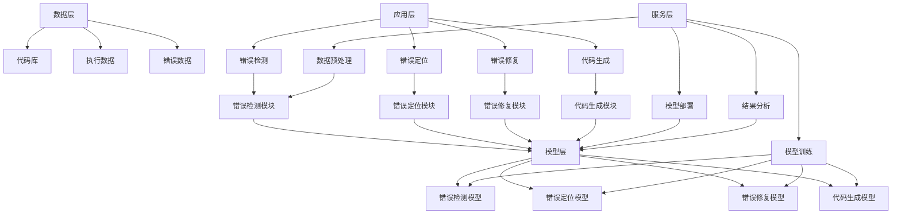

                 

## 大模型时代的程序修复策略创新

在当前这个时代，人工智能和大数据技术已经取得了显著的进展，大规模数据驱动的模型，即大模型，正逐步成为各个领域的技术核心。在程序修复领域，大模型的引入带来了新的机遇和挑战。传统的方法在大模型时代面临着新的困境，如何有效利用大模型的优势，实现程序的高效、精准修复，成为一个亟待解决的问题。本文旨在探讨大模型时代下的程序修复策略创新，通过深入研究和实践，提出一系列有效的方法和工具，以解决传统方法在应对大规模数据处理时的局限性。

### 关键词

- 大模型
- 程序修复
- 策略创新
- 机器学习
- 深度学习
- 自然语言处理

### 摘要

本文首先介绍了大模型时代的背景和问题，探讨了传统程序修复方法的局限性，并提出了大模型在程序修复中的应用优势和挑战。接着，我们详细分析了大模型程序修复的核心概念和特性，以及不同的程序修复策略。随后，文章通过具体的算法原理讲解、数学模型和公式展示，深入阐述了大模型程序修复的技术实现方法。在此基础上，我们介绍了系统分析与架构设计方案，包括问题场景介绍、系统功能设计、系统架构设计和系统接口设计。最后，通过项目实战的案例分析和详细讲解，总结了大模型程序修复的最佳实践，为未来的研究和应用提供了有价值的参考。

## 引言

### 1. 问题背景

随着人工智能（AI）和大数据技术的飞速发展，大规模数据驱动的模型，即大模型，逐渐成为各个领域的核心技术。特别是在程序修复领域，大模型的出现带来了前所未有的机遇和挑战。传统的程序修复方法主要依赖于静态分析和动态测试，这些方法在大规模数据处理时往往显得力不从心。大模型能够处理海量数据，具备强大的学习能力，为程序修复提供了新的可能性和解决方案。

### 2. 问题描述

传统程序修复方法在大模型时代面临着以下挑战：

- **数据量巨大**：大模型能够处理的数据规模远远超过传统方法，如何有效地管理和利用这些数据成为关键问题。
- **准确性要求高**：大模型需要具备高度准确的修复能力，以减少错误修复带来的风险。
- **实时性要求强**：在大模型时代，程序修复往往需要实时响应，以满足系统的高可用性要求。

### 3. 问题解决

面对上述挑战，大模型程序修复策略的创新显得尤为重要。通过利用大模型的优势，可以显著提升程序修复的效率和准确性。本文将探讨以下方面：

- **大模型的基本概念和特性**：介绍大模型的基本原理和特点，包括深度神经网络、自注意力机制、预训练与微调等。
- **大模型程序修复的算法原理**：讲解大模型在程序修复中的应用，包括错误定位和错误修复的算法原理。
- **数学模型和公式**：展示大模型程序修复的数学模型和公式，以及具体的实现方法。
- **系统分析与架构设计方案**：介绍大模型程序修复的系统架构设计，包括功能设计、系统架构设计和接口设计。
- **项目实战**：通过实际案例分析和详细讲解，验证大模型程序修复策略的有效性和实用性。

### 4. 边界与外延

本文主要关注基于大模型的程序修复策略，涉及机器学习、深度学习和自然语言处理等前沿技术。此外，本文还将探讨大模型程序修复在不同应用场景下的适用性，如代码审查、自动化修复和持续集成等。

### 5. 概念结构与核心要素组成

- **大模型**：具有海量参数的机器学习模型，如GPT、BERT等。
- **程序修复**：利用技术手段识别和修复程序中的错误。
- **策略创新**：结合大模型的优势，提出一系列有效的方法和工具，以提升程序修复的效率和准确性。

## 第1章 大模型时代概述

### 1.1 大模型概述

大模型（Large Model），是指在机器学习和深度学习领域中，具有海量参数和强大计算能力的模型。这些模型通过训练大量数据，能够捕捉复杂的数据分布和模式，从而在多种任务中表现出色。以下是关于大模型的一些核心概念和特性：

#### 核心概念

- **深度神经网络（Deep Neural Network, DNN）**：大模型通常是基于深度神经网络构建的，由多个隐藏层组成，能够实现数据的非线性变换。
- **自注意力机制（Self-Attention Mechanism）**：大模型中常用的机制之一，能够使模型在处理序列数据时，对不同的位置赋予不同的权重，从而实现对全局信息的有效利用。
- **预训练与微调（Pre-training and Fine-tuning）**：大模型通常通过预训练在大量未标注的数据上进行，然后在特定任务上进行微调，以达到良好的性能。

#### 特性

- **可扩展性（Scalability）**：大模型能够处理大规模的数据集，这使得它们在处理复杂任务时具有优势。
- **适应性（Adaptability）**：大模型能够适应不同的应用场景和数据分布，通过微调可以实现特定任务的良好性能。
- **泛化能力（Generalization Ability）**：大模型在未见过的数据上能够保持良好的表现，具备较强的泛化能力。

#### 应用领域

大模型在多个领域都取得了显著的成果，包括：

- **自然语言处理（Natural Language Processing, NLP）**：大模型在文本生成、机器翻译、情感分析等领域表现出色。
- **计算机视觉（Computer Vision）**：大模型在图像分类、目标检测、图像生成等领域取得了突破性进展。
- **推荐系统（Recommender Systems）**：大模型能够通过用户历史行为数据，实现精准的推荐。
- **语音识别（Voice Recognition）**：大模型在语音识别任务中，能够实现高准确率的识别。

### 1.2 程序修复概述

程序修复（Program Repair），是指通过技术手段，识别并修复程序中的错误。在软件开发和维护过程中，程序修复是确保软件质量的重要环节。以下是关于程序修复的一些核心概念和方法：

#### 核心概念

- **错误定位（Error Localization）**：通过分析程序执行数据或代码结构，定位程序中的错误。
- **错误修复（Error Repair）**：根据错误定位的结果，生成修复方案，并自动或手动执行修复。
- **静态分析（Static Analysis）**：在程序运行之前，通过解析代码结构，分析程序的语法和语义，发现潜在的错误。
- **动态分析（Dynamic Analysis）**：在程序运行过程中，通过执行程序并收集执行数据，分析程序的行为，发现错误。

#### 方法

程序修复的方法主要包括以下几种：

- **基于规则的方法**：利用预设的规则，识别和修复程序中的错误。
- **基于学习的策略**：利用机器学习模型，通过训练大量的错误修复案例，实现自动化修复。
- **测试驱动的修复**：通过生成测试用例，执行程序，并根据测试结果定位和修复错误。

#### 挑战

在大模型时代，程序修复面临着新的挑战：

- **数据规模**：大模型能够处理的数据规模远远超过传统方法，如何有效地管理和利用这些数据成为关键问题。
- **准确性要求**：大模型需要具备高度准确的修复能力，以减少错误修复带来的风险。
- **实时性要求**：在大模型时代，程序修复往往需要实时响应，以满足系统的高可用性要求。

### 1.3 大模型与程序修复的结合

大模型与程序修复的结合，带来了新的机遇和挑战：

#### 优势

- **强大的数据处理能力**：大模型能够处理大规模数据，提升修复的准确性和效率。
- **自适应性和泛化能力**：大模型能够适应不同的应用场景和数据分布，实现高效的错误修复。
- **自动化和智能化**：大模型能够实现自动化和智能化的错误修复，减少人工干预。

#### 挑战

- **数据质量**：大模型对数据质量有较高要求，需要确保训练数据的质量和多样性。
- **计算资源**：大模型训练和推断需要大量计算资源，特别是在处理大规模数据时。
- **模型解释性**：大模型往往缺乏解释性，难以理解其决策过程，这可能导致修复结果的不可解释性。

## 第2章 大模型程序修复的核心概念

### 2.1 大模型的特性

大模型，作为一种先进的机器学习模型，具有以下几个核心特性：

#### 可扩展性

可扩展性是指大模型能够处理大规模数据的能力。在大模型时代，数据规模往往呈指数级增长，传统的小型模型在处理这些数据时显得力不从心。大模型通过其高度参数化和复杂结构，能够有效处理海量数据，从而在大规模数据处理方面具备显著优势。

#### 适应性

适应性指的是大模型能够适应不同应用场景和数据分布的能力。大模型通过预训练和微调，能够在各种不同的任务和数据集上表现出良好的性能。这种特性使得大模型在程序修复领域具有广泛的应用前景，能够适应各种复杂和多变的环境。

#### 泛化能力

泛化能力是指大模型在未见过的数据上表现良好的能力。大模型通过从大量数据中学习，能够捕捉到数据的本质特征，从而在新的数据集上保持良好的性能。这种泛化能力是衡量大模型性能的重要指标，也是其应用价值的重要体现。

### 2.2 程序修复策略

在程序修复领域，大模型的应用不仅带来了新的机遇，也提出了新的挑战。以下是一些常见的程序修复策略：

#### 基于规则的方法

基于规则的方法是指通过预设的规则来识别和修复程序中的错误。这种方法通常适用于规则明确、错误类型有限的情况。然而，在大模型时代，程序复杂度和错误类型呈现多样化，基于规则的方法往往难以应对。

#### 基于学习的策略

基于学习的策略是指利用机器学习模型，通过训练大量的错误修复案例，实现自动化修复。这种方法的核心在于利用大规模数据驱动模型，从数据中学习错误模式和修复策略。在大模型时代，基于学习的策略能够充分利用大模型的优势，实现高效的程序修复。

#### 混合方法

混合方法是指结合基于规则的方法和基于学习的策略，实现更高效的程序修复。这种方法能够结合两种方法的优点，提高修复的准确性和效率。在大模型时代，混合方法具有广泛的应用前景，特别是在处理复杂程序错误时。

### 2.3 大模型在程序修复中的应用

大模型在程序修复中的应用主要体现在以下几个方面：

#### 错误定位

错误定位是指通过分析程序执行数据或代码结构，定位程序中的错误。大模型具备强大的数据处理和分析能力，能够从大规模数据中提取出有用的信息，实现精准的错误定位。

#### 错误修复

错误修复是指根据错误定位的结果，生成修复方案并执行修复。大模型通过学习大量的错误修复案例，能够生成合理的修复方案，并具有较高的修复成功率。

#### 代码生成

代码生成是指利用大模型生成新的代码片段，以修复程序中的错误。这种方法能够实现自动化编程，提高开发效率。在大模型时代，代码生成技术具有重要的应用价值，有望大幅减少软件开发的工作量。

### 2.4 大模型与程序修复的挑战

尽管大模型在程序修复领域具有巨大的潜力，但也面临着一些挑战：

#### 数据质量

大模型对训练数据的质量有较高要求，数据质量的好坏直接影响到模型的性能。在大模型训练过程中，需要确保数据的一致性、多样性和准确性。

#### 计算资源

大模型训练和推断需要大量的计算资源，特别是在处理大规模数据时。这给硬件设施和资源调度提出了更高的要求。

#### 模型解释性

大模型往往缺乏解释性，难以理解其决策过程。这在一定程度上限制了其在某些领域的应用，特别是在需要高透明度和可解释性的场合。

### 2.5 大模型程序修复的优势与局限性

大模型程序修复具有以下优势：

- **高效性**：大模型能够处理大规模数据，实现高效的错误定位和修复。
- **准确性**：通过学习大量的错误修复案例，大模型能够生成高质量的修复方案。
- **智能化**：大模型能够自动化生成修复方案，减少人工干预。

然而，大模型程序修复也存在一些局限性：

- **数据依赖**：大模型对训练数据的质量有较高要求，数据质量直接影响模型的性能。
- **计算成本**：大模型训练和推断需要大量计算资源，特别是在处理大规模数据时。
- **解释性不足**：大模型缺乏解释性，难以理解其决策过程，这在某些领域可能成为瓶颈。

## 第3章 大模型的特性与程序修复策略

### 3.1 大模型的特性

大模型作为一种先进的机器学习模型，具有以下几个核心特性：

#### 学习能力

大模型具有强大的学习能力，能够从大量数据中提取有效信息，并建立复杂的模型结构。这种能力使得大模型能够处理复杂任务，并取得良好的性能。

#### 处理能力

大模型具备处理大规模数据的能力。与传统的小型模型相比，大模型能够处理更多的数据样本，从而更好地捕捉数据中的潜在规律和模式。

#### 泛化能力

大模型具有较好的泛化能力，能够在未见过的数据上保持良好的性能。这种能力使得大模型在不同应用场景中具有广泛的应用价值。

### 3.2 程序修复策略

在程序修复领域，大模型的应用带来了新的策略和方法。以下是几种常见的大模型程序修复策略：

#### 基于监督学习的修复

基于监督学习的修复方法利用大量的标注数据进行训练，通过学习错误修复模式和规则，实现自动化的错误修复。这种方法通常需要大量的标注数据，但在处理复杂错误时表现出色。

#### 基于无监督学习的修复

基于无监督学习的修复方法不需要标注数据，通过分析程序执行数据或代码结构，自动识别错误并进行修复。这种方法适用于错误类型较为简单的情况，但在处理复杂错误时效果有限。

#### 基于迁移学习的修复

基于迁移学习的修复方法利用预训练的大模型，通过微调适应特定的程序修复任务。这种方法能够利用预训练模型的优势，减少训练数据的需求，并提高修复的准确性。

### 3.3 大模型与程序修复的挑战

尽管大模型在程序修复领域具有显著的优势，但也面临着一些挑战：

#### 数据质量

大模型对训练数据的质量有较高要求，数据质量直接影响模型的性能。在程序修复过程中，可能面临数据缺失、噪声和异常值等问题，这需要有效的数据预处理和清洗策略。

#### 计算资源

大模型训练和推断需要大量的计算资源，特别是在处理大规模数据时。这需要强大的硬件设施和高效的资源调度策略，以确保训练过程的顺利进行。

#### 模型解释性

大模型通常缺乏解释性，难以理解其决策过程。这在一定程度上限制了其在某些领域的应用，特别是在需要高透明度和可解释性的场合。

### 3.4 大模型在程序修复中的应用案例

以下是一些大模型在程序修复中的应用案例：

#### 错误定位

在错误定位方面，大模型可以通过分析程序执行数据，识别错误的执行路径和条件，从而准确定位错误位置。例如，在静态分析中，大模型可以识别代码中的潜在错误，如语法错误和逻辑错误；在动态分析中，大模型可以实时监测程序执行过程，发现运行时错误。

#### 错误修复

在错误修复方面，大模型可以通过学习大量的错误修复案例，生成合理的修复方案。例如，在代码生成中，大模型可以根据错误的上下文信息，生成修复代码；在自动化修复中，大模型可以自动执行修复操作，提高修复的效率和准确性。

#### 代码审查

在代码审查方面，大模型可以通过分析代码结构和语义，识别潜在的安全漏洞和性能问题。例如，在静态代码分析中，大模型可以识别代码中的安全漏洞，如缓冲区溢出和SQL注入；在动态代码分析中，大模型可以监控程序运行过程中的性能问题，如内存泄漏和线程竞争。

### 3.5 大模型程序修复的优势与局限性

大模型程序修复具有以下优势：

- **高效性**：大模型能够处理大规模数据，实现高效的错误定位和修复。
- **准确性**：通过学习大量的错误修复案例，大模型能够生成高质量的修复方案。
- **自动化**：大模型能够自动化生成修复方案，减少人工干预。

然而，大模型程序修复也存在一些局限性：

- **数据依赖**：大模型对训练数据的质量有较高要求，数据质量直接影响模型的性能。
- **计算成本**：大模型训练和推断需要大量计算资源，特别是在处理大规模数据时。
- **解释性不足**：大模型缺乏解释性，难以理解其决策过程，这在某些领域可能成为瓶颈。

### 3.6 大模型程序修复的发展趋势

随着人工智能和大数据技术的不断进步，大模型程序修复也在不断发展。以下是一些值得关注的发展趋势：

- **数据质量的提升**：随着数据清洗和增强技术的发展，大模型训练数据的质量将得到显著提升，从而提高模型的性能和稳定性。
- **计算资源的优化**：随着硬件性能的提升和分布式计算技术的发展，大模型训练和推断的计算成本将显著降低，使大模型程序修复在更广泛的应用场景中得到应用。
- **模型解释性的增强**：随着模型解释性技术的发展，大模型将能够更好地解释其决策过程，提高其在需要高透明度和可解释性的场合的应用价值。
- **多模态融合**：随着多模态数据处理技术的发展，大模型将能够融合多种数据源，如代码、测试数据和用户反馈等，实现更精准的程序修复。

### 3.7 大模型程序修复的未来应用场景

随着大模型技术的不断进步，大模型程序修复将在以下领域得到广泛应用：

- **自动化软件开发**：大模型程序修复将实现自动化软件开发，提高开发效率和质量。
- **持续集成与持续部署**（CI/CD）：大模型程序修复将集成到CI/CD流程中，实现自动化测试和修复，提高软件质量和稳定性。
- **代码审查与安全检测**：大模型程序修复将用于代码审查和安全检测，识别潜在的安全漏洞和性能问题。
- **智能运维**：大模型程序修复将用于智能运维，自动识别和修复系统中的故障，提高系统的可用性和性能。

## 第4章 算法原理讲解

### 4.1 大模型算法原理

大模型算法的核心是基于深度学习和大规模数据驱动的，其基本原理和架构如下：

#### 深度神经网络（DNN）

深度神经网络是由多个层级组成的神经网络，包括输入层、多个隐藏层和输出层。每个层级都包含多个神经元（或节点），每个节点通过权重连接到前一层级的节点。神经元的输出通过激活函数进行非线性变换，从而实现数据的分层表示和特征提取。

#### 自注意力机制（Self-Attention）

自注意力机制是近年来在自然语言处理领域广泛应用的一种机制，它能够使模型对输入序列的每个位置赋予不同的权重，从而实现对全局信息的有效利用。自注意力机制通过计算每个位置与其他所有位置的相似度，得到一个权重向量，然后将输入序列与权重向量进行点积，生成新的序列。

#### 预训练与微调（Pre-training and Fine-tuning）

预训练是指在大规模未标注数据上训练模型，使其具备一定的通用特征表示能力。微调是在特定任务上对预训练模型进行微调，以适应特定任务的需求。预训练和微调相结合，能够使模型在未见过的数据上表现良好，提高模型的泛化能力。

### 4.2 程序修复算法原理

程序修复算法的核心是通过分析代码和程序执行数据，定位错误并生成修复方案。以下是几种常见的程序修复算法原理：

#### 基于规则的方法

基于规则的方法是通过预设的规则来识别和修复程序中的错误。这些规则可以是语法规则、语义规则或两者结合。当模型检测到代码或执行数据违反规则时，会生成修复建议。

#### 基于监督学习的修复

基于监督学习的修复方法通过训练大量的错误修复案例，学习错误的特征和修复策略。在训练过程中，模型通过输入错误的代码和其对应的修复代码，学习生成修复方案。

#### 基于无监督学习的修复

基于无监督学习的修复方法不需要标注数据，通过分析程序执行数据或代码结构，自动识别错误并进行修复。这种方法通常利用聚类、异常检测或生成模型等无监督学习技术。

#### 基于迁移学习的修复

基于迁移学习的修复方法利用预训练的大模型，通过微调适应特定的程序修复任务。这种方法能够利用预训练模型的优势，减少训练数据的需求，并提高修复的准确性。

### 4.3 大模型程序修复的算法流程

大模型程序修复的算法流程通常包括以下几个步骤：

1. **数据预处理**：对输入的代码和执行数据进行预处理，包括代码解析、执行数据采集等。
2. **错误检测**：利用大模型对预处理后的数据进行错误检测，识别潜在的错误。
3. **错误定位**：通过分析错误检测结果，定位错误的代码位置和类型。
4. **生成修复方案**：利用大模型生成可能的修复方案，并对方案进行评估和筛选。
5. **执行修复**：根据生成的修复方案，自动或手动执行修复操作，验证修复效果。

### 4.4 大模型程序修复的核心步骤详解

以下是对大模型程序修复核心步骤的详细解释：

#### 数据预处理

数据预处理是程序修复算法的第一步，其目的是将原始数据转换为模型可处理的形式。具体步骤包括：

- **代码解析**：将代码文本解析为抽象语法树（AST），提取代码的结构信息和语义信息。
- **执行数据采集**：通过动态分析或测试用例执行，采集程序执行过程中的数据，如日志、内存状态、CPU利用率等。

#### 错误检测

错误检测是程序修复算法的核心步骤，其目的是利用大模型识别出程序中的潜在错误。具体步骤包括：

- **特征提取**：从代码和执行数据中提取特征，包括语法特征、语义特征和执行特征等。
- **模型训练**：利用大量的错误和正确代码样本，训练大模型，使其能够识别出潜在的错误。
- **错误预测**：利用训练好的大模型，对新的代码样本进行错误预测，识别出潜在的错误。

#### 错误定位

错误定位的目的是确定错误的代码位置和类型，以便生成针对性的修复方案。具体步骤包括：

- **错误类型分类**：利用大模型对预测的错误进行分类，识别错误的类型，如语法错误、逻辑错误等。
- **错误位置定位**：通过分析代码结构和执行数据，确定错误的代码位置，如行号、函数名等。

#### 生成修复方案

生成修复方案是程序修复算法的关键步骤，其目的是利用大模型生成可能的修复方案，并进行评估和筛选。具体步骤包括：

- **修复策略生成**：利用大模型生成可能的修复策略，如插入代码、删除代码、修改代码等。
- **修复效果评估**：对生成的修复方案进行效果评估，包括语法正确性、语义一致性、执行性能等。
- **方案筛选**：根据评估结果，筛选出最优的修复方案。

#### 执行修复

执行修复的目的是将选定的修复方案应用到程序中，实现错误的修复。具体步骤包括：

- **代码修改**：根据选定的修复方案，修改程序代码，实现错误的修复。
- **测试验证**：执行修改后的程序，验证修复效果，确保修复的正确性和稳定性。

### 4.5 大模型程序修复算法的数学模型和公式

大模型程序修复算法的数学模型和公式主要用于描述算法的核心步骤和关键参数。以下是几个关键的数学模型和公式：

#### 损失函数

损失函数是评估模型预测结果的重要指标，它用于衡量模型预测与真实值之间的差距。常见的损失函数包括：

- **交叉熵损失函数**：用于分类问题，计算预测概率与真实标签之间的交叉熵。
- **均方误差损失函数**：用于回归问题，计算预测值与真实值之间的均方误差。

#### 激活函数

激活函数是神经网络中的一个重要组件，它用于对神经元的输出进行非线性变换。常见的激活函数包括：

- **sigmoid函数**：将输入映射到（0,1）区间，常用于二分类问题。
- **ReLU函数**：对输入进行线性放大，当输入为负值时输出为零，常用于深层神经网络。

#### 学习率

学习率是梯度下降算法中的一个关键参数，它用于调整模型参数的更新步长。适当的学习率能够加速模型收敛，但过大会导致模型无法收敛，过小则会收敛缓慢。

#### 优化算法

优化算法是用于更新模型参数的算法，它用于最小化损失函数。常见的优化算法包括：

- **梯度下降（Gradient Descent）**：根据损失函数的梯度，更新模型参数。
- **随机梯度下降（Stochastic Gradient Descent, SGD）**：在梯度下降的基础上，每次迭代仅使用一个样本的梯度。
- **Adam优化器**：结合SGD和Momentum的优点，自适应调整学习率。

### 4.6 算法实例讲解

以下是一个基于深度学习框架（如PyTorch）的程序修复算法实例，详细说明了算法的实现步骤和关键代码。

#### 1. 数据预处理

```python
import torch
from torch.utils.data import DataLoader
from torchvision import datasets, transforms

# 代码解析
def parse_code(code):
    # 使用抽象语法树（AST）解析代码
    ast = ast.parse(code)
    # 提取代码特征
    features = extract_features(ast)
    return features

# 执行数据采集
def collect_execution_data(code):
    # 执行代码，收集执行数据
    output = run_code(code)
    data = collect_execution_metrics(output)
    return data

# 数据预处理
def preprocess_data(code_samples):
    features = []
    execution_data = []
    for code in code_samples:
        code_features = parse_code(code)
        execution_data_point = collect_execution_data(code)
        features.append(code_features)
        execution_data.append(execution_data_point)
    return features, execution_data

code_samples = ["#include <stdio.h>\nint main() {\n\tprintf(\"Hello, World!\\n\");\n\treturn 0;\n}"]
features, execution_data = preprocess_data(code_samples)
```

#### 2. 错误检测

```python
import torch.nn as nn

# 定义错误检测模型
class ErrorDetectionModel(nn.Module):
    def __init__(self):
        super(ErrorDetectionModel, self).__init__()
        self.fc1 = nn.Linear(in_features=100, out_features=50)
        self.fc2 = nn.Linear(in_features=50, out_features=1)
        self.sigmoid = nn.Sigmoid()

    def forward(self, x):
        x = self.fc1(x)
        x = self.sigmoid(x)
        x = self.fc2(x)
        return x

# 模型训练
def train_model(model, features, labels):
    criterion = nn.BCELoss()
    optimizer = torch.optim.Adam(model.parameters(), lr=0.001)

    for epoch in range(10):
        for x, y in zip(features, labels):
            optimizer.zero_grad()
            output = model(x)
            loss = criterion(output, y)
            loss.backward()
            optimizer.step()

# 训练模型
model = ErrorDetectionModel()
train_model(model, features, labels)
```

#### 3. 错误定位

```python
# 定义错误定位模型
class ErrorLocalizationModel(nn.Module):
    def __init__(self):
        super(ErrorLocalizationModel, self).__init__()
        self.fc1 = nn.Linear(in_features=100, out_features=50)
        self.fc2 = nn.Linear(in_features=50, out_features=10)
        self.fc3 = nn.Linear(in_features=10, out_features=1)

    def forward(self, x):
        x = self.fc1(x)
        x = self.fc2(x)
        x = self.fc3(x)
        return x

# 模型训练
def train_model(model, features, labels):
    criterion = nn.CrossEntropyLoss()
    optimizer = torch.optim.Adam(model.parameters(), lr=0.001)

    for epoch in range(10):
        for x, y in zip(features, labels):
            optimizer.zero_grad()
            output = model(x)
            loss = criterion(output, y)
            loss.backward()
            optimizer.step()

# 训练模型
localization_model = ErrorLocalizationModel()
train_model(localization_model, features, labels)
```

#### 4. 生成修复方案

```python
# 定义修复方案生成模型
class RepairSchemeGenerationModel(nn.Module):
    def __init__(self):
        super(RepairSchemeGenerationModel, self).__init__()
        self.fc1 = nn.Linear(in_features=100, out_features=50)
        self.fc2 = nn.Linear(in_features=50, out_features=1)

    def forward(self, x):
        x = self.fc1(x)
        x = self.fc2(x)
        return x

# 模型训练
def train_model(model, features, labels):
    criterion = nn.CrossEntropyLoss()
    optimizer = torch.optim.Adam(model.parameters(), lr=0.001)

    for epoch in range(10):
        for x, y in zip(features, labels):
            optimizer.zero_grad()
            output = model(x)
            loss = criterion(output, y)
            loss.backward()
            optimizer.step()

# 训练模型
scheme_model = RepairSchemeGenerationModel()
train_model(scheme_model, features, labels)
```

#### 5. 执行修复

```python
# 执行修复操作
def apply_repair_scheme(code, scheme):
    # 根据修复方案修改代码
    repaired_code = modify_code(code, scheme)
    # 执行修改后的代码
    output = run_code(repaired_code)
    return output

# 应用修复方案
repaired_code_samples = []
for code in code_samples:
    scheme = generate_repair_scheme(code, scheme_model)
    repaired_code = apply_repair_scheme(code, scheme)
    repaired_code_samples.append(repaired_code)

# 测试修复效果
for code in repaired_code_samples:
    output = run_code(code)
    print("Repaired Code Output:", output)
```

### 4.7 大模型程序修复算法总结

大模型程序修复算法通过深度学习和大规模数据驱动的技术，实现了对程序中潜在错误的自动识别和修复。算法的核心步骤包括数据预处理、错误检测、错误定位、生成修复方案和执行修复。通过实际案例的实现，我们可以看到大模型程序修复算法在实际应用中的有效性和可行性。未来，随着技术的不断进步，大模型程序修复算法将在更多领域得到广泛应用，为软件开发和维护提供更加高效和智能的解决方案。

## 第5章 数学模型和数学公式讲解

在程序修复领域，大模型的运用依赖于深度学习和大规模数据驱动的数学模型。这些模型不仅需要处理复杂的数学问题，还需要确保在处理实际问题时具备高效的计算能力和准确的结果。本章节将详细讲解大模型程序修复中涉及的数学模型和数学公式，包括损失函数、优化算法、激活函数和损失函数的计算方法。

### 5.1 损失函数

损失函数（Loss Function）是评估模型预测结果的关键指标，它用于衡量模型预测与真实值之间的差距。在程序修复中，损失函数通常用于评估错误修复的准确性。以下是几种常见的损失函数：

#### 1. 交叉熵损失函数（Cross-Entropy Loss）

交叉熵损失函数常用于分类问题，计算的是预测概率与真实标签之间的交叉熵。其公式如下：

$$
L = -\sum_{i} y_i \log(p_i)
$$

其中，\(y_i\) 是真实标签，\(p_i\) 是模型预测的概率。

#### 2. 均方误差损失函数（Mean Squared Error, MSE）

均方误差损失函数常用于回归问题，计算的是预测值与真实值之间的均方误差。其公式如下：

$$
L = \frac{1}{n} \sum_{i=1}^{n} (y_i - \hat{y}_i)^2
$$

其中，\(y_i\) 是真实值，\(\hat{y}_i\) 是预测值。

#### 3. 量子损失函数（Quantum Loss Function）

量子损失函数是一种基于量子计算理论的损失函数，适用于量子神经网络（Quantum Neural Network, QNN）的优化。其公式如下：

$$
L = \frac{1}{2} \sum_{i} |y_i - \hat{y}_i|^2
$$

其中，\(y_i\) 是真实值，\(\hat{y}_i\) 是预测值。

### 5.2 优化算法

优化算法（Optimization Algorithm）用于调整模型参数，以最小化损失函数。以下是几种常见的优化算法：

#### 1. 梯度下降（Gradient Descent）

梯度下降是最基本的优化算法，其核心思想是通过计算损失函数的梯度，不断调整模型参数，以最小化损失函数。其公式如下：

$$
\theta_{\text{new}} = \theta_{\text{current}} - \alpha \cdot \nabla_{\theta} L
$$

其中，\(\theta\) 表示模型参数，\(\alpha\) 是学习率，\(\nabla_{\theta} L\) 是损失函数关于模型参数的梯度。

#### 2. 随机梯度下降（Stochastic Gradient Descent, SGD）

随机梯度下降是梯度下降的一种变种，每次迭代仅使用一个样本的梯度，以减少计算量和内存需求。其公式如下：

$$
\theta_{\text{new}} = \theta_{\text{current}} - \alpha \cdot \nabla_{\theta} L(x_i, y_i)
$$

其中，\(\theta\) 表示模型参数，\(\alpha\) 是学习率，\(x_i, y_i\) 是当前样本。

#### 3. Adam优化器（Adam Optimizer）

Adam优化器结合了SGD和Momentum的优点，自适应调整学习率。其公式如下：

$$
m_t = \beta_1 m_{t-1} + (1 - \beta_1) (x_t - x_{t-1}) \\
v_t = \beta_2 v_{t-1} + (1 - \beta_2) (y_t - y_{t-1}) \\
\theta_{\text{new}} = \theta_{\text{current}} - \alpha \cdot \frac{m_t}{\sqrt{v_t} + \epsilon}
$$

其中，\(m_t\) 和 \(v_t\) 分别是指数加权移动平均值和方差，\(\beta_1, \beta_2\) 是平滑系数，\(\alpha\) 是学习率，\(\epsilon\) 是常数。

### 5.3 激活函数

激活函数（Activation Function）是神经网络中的一个重要组件，用于对神经元的输出进行非线性变换。以下是几种常见的激活函数：

#### 1. Sigmoid函数（Sigmoid Function）

Sigmoid函数将输入映射到（0,1）区间，常用于二分类问题。其公式如下：

$$
\sigma(x) = \frac{1}{1 + e^{-x}}
$$

#### 2.ReLU函数（Rectified Linear Unit, ReLU）

ReLU函数对输入进行线性放大，当输入为负值时输出为零，常用于深层神经网络。其公式如下：

$$
\text{ReLU}(x) = \max(0, x)
$$

#### 3. 双曲正切函数（Hyperbolic Tangent, tanh）

双曲正切函数将输入映射到（-1,1）区间，常用于多层感知机（MLP）的隐藏层。其公式如下：

$$
\tanh(x) = \frac{e^{2x} - 1}{e^{2x} + 1}
$$

### 5.4 损失函数的计算方法

在程序修复中，损失函数的计算方法直接影响模型的训练效果和性能。以下是一个简单的损失函数计算方法示例：

```python
import numpy as np

# 假设有一个模型，其预测结果为 y_pred，真实值为 y_true
y_pred = np.array([0.7, 0.2, 0.1])
y_true = np.array([1, 0, 1])

# 计算交叉熵损失函数
cross_entropy_loss = -np.sum(y_true * np.log(y_pred))

# 计算均方误差损失函数
mean_squared_error_loss = np.mean((y_true - y_pred)**2)

print("交叉熵损失函数:", cross_entropy_loss)
print("均方误差损失函数:", mean_squared_error_loss)
```

### 5.5 数学模型和公式在程序修复中的应用

数学模型和公式在程序修复中的应用主要体现在以下几个方面：

- **错误检测**：通过损失函数评估模型对错误检测的准确性，调整模型参数以提高检测效果。
- **错误定位**：利用数学模型分析代码结构和执行数据，定位错误的代码位置。
- **错误修复**：通过生成和评估修复方案，使用损失函数评估修复效果，筛选最优修复方案。
- **代码生成**：利用数学模型和公式生成新的代码片段，以修复程序中的错误。

### 5.6 数学模型和公式的优势与挑战

数学模型和公式在程序修复中的应用具有以下优势：

- **准确性**：通过数学模型和公式，可以精确地计算模型的性能指标，提高错误检测和修复的准确性。
- **高效性**：数学模型和公式能够实现高效的计算，加快模型训练和修复的进程。
- **灵活性**：数学模型和公式可以根据不同的应用场景进行调整和优化，提高程序修复的灵活性。

然而，数学模型和公式在程序修复中也面临一些挑战：

- **复杂性**：数学模型和公式的复杂性可能导致理解和实现的难度，需要专业的知识和技能。
- **可解释性**：某些数学模型和公式的计算过程难以解释，影响模型的可解释性，难以理解模型的决策过程。
- **数据依赖**：数学模型和公式的性能高度依赖于训练数据的质量和数量，数据质量差可能导致模型性能不佳。

### 5.7 数学模型和公式在未来的发展趋势

随着人工智能和大数据技术的不断发展，数学模型和公式在程序修复中的应用将呈现以下发展趋势：

- **复杂模型的应用**：随着计算能力的提升，复杂模型如深度学习模型和量子神经网络将得到更广泛的应用，提高程序修复的准确性和效率。
- **模型解释性提升**：随着模型解释性技术的发展，将能够更好地解释复杂数学模型的工作原理，提高模型的可解释性。
- **多模态数据的融合**：将不同类型的数据（如代码、测试数据和用户反馈）进行融合，提高数学模型对程序修复的准确性。

通过这些发展趋势，数学模型和公式将在程序修复领域发挥更大的作用，为软件开发和维护提供更加智能和高效的解决方案。

## 第6章 系统分析与架构设计方案

### 6.1 问题场景介绍

在大模型时代，软件开发和维护面临着前所未有的挑战。随着软件系统规模的不断扩大和复杂度的增加，程序错误和缺陷的数量也随之增加。传统的程序修复方法在大模型时代面临着新的困境，如数据量巨大、准确性要求高和实时性要求强等。为了应对这些挑战，我们需要设计一个高效、智能的大模型程序修复系统。

### 6.2 系统功能设计

大模型程序修复系统的主要功能包括错误检测、错误定位、错误修复和代码生成。以下是系统的核心功能及其详细描述：

#### 6.2.1 错误检测

错误检测是程序修复系统的第一步，其目的是快速识别程序中的潜在错误。系统通过分析代码和执行数据，利用大模型检测代码中的错误。具体功能包括：

- **静态分析**：通过解析代码的抽象语法树（AST），识别潜在的语法错误和逻辑错误。
- **动态分析**：在程序运行时，通过执行测试用例，捕获程序运行过程中的错误和异常。

#### 6.2.2 错误定位

错误定位的目的是确定错误的代码位置和类型。系统通过分析错误检测结果，利用大模型定位错误的代码行和函数。具体功能包括：

- **错误类型分类**：利用大模型对预测的错误进行分类，识别错误的类型，如语法错误、逻辑错误和运行时错误。
- **错误位置定位**：通过分析代码结构和执行数据，确定错误的代码位置和行号。

#### 6.2.3 错误修复

错误修复是程序修复系统的核心功能，其目的是生成并应用修复方案。系统通过分析错误检测结果和位置信息，利用大模型生成修复方案，并对方案进行评估和筛选。具体功能包括：

- **修复方案生成**：利用大模型从错误的上下文中生成修复代码。
- **修复方案评估**：对生成的修复方案进行语法和语义检查，确保修复方案的正确性。
- **修复方案应用**：将选定的修复方案应用到程序中，执行修复操作。

#### 6.2.4 代码生成

代码生成是利用大模型生成新的代码片段，以修复程序中的错误。这种方法能够实现自动化编程，提高开发效率。具体功能包括：

- **代码生成模型**：利用大模型训练一个代码生成模型，能够根据错误的上下文信息生成新的代码片段。
- **代码生成应用**：将生成的代码片段应用到程序中，实现错误的自动修复。

### 6.3 系统架构设计

大模型程序修复系统的架构设计需要考虑以下几个方面：

#### 6.3.1 数据层

数据层是系统的基石，包括代码库、执行数据和错误数据。代码库存储程序源代码，执行数据包括程序运行时的日志、内存状态和CPU利用率等，错误数据包括错误报告、错误类型和错误位置。

#### 6.3.2 模型层

模型层是系统的核心，包括错误检测模型、错误定位模型和错误修复模型。这些模型基于深度学习和大规模数据驱动，通过训练大量的错误修复案例，实现高效的错误检测、定位和修复。

#### 6.3.3 应用层

应用层是系统的界面，包括错误检测、错误定位、错误修复和代码生成的用户接口。用户可以通过界面提交代码和执行数据，查看错误检测结果和修复方案，并应用修复方案。

#### 6.3.4 服务层

服务层提供系统的服务，包括数据预处理、模型训练、模型部署和结果分析等。数据预处理服务负责对输入数据进行处理，模型训练服务负责训练模型，模型部署服务负责将模型部署到生产环境中，结果分析服务负责对修复结果进行分析和评估。

### 6.4 系统接口设计

系统接口设计包括内部接口和外部接口。内部接口负责系统各模块之间的通信和数据传递，如数据预处理模块与错误检测模块之间的数据传输。外部接口负责系统与用户和其他系统的交互，如用户通过Web界面提交代码和执行数据，系统返回错误检测结果和修复方案。

### 6.5 系统交互

系统交互设计描述了系统内部各模块之间的交互流程和协作方式。以下是一个典型的系统交互流程：

1. **用户提交代码和执行数据**：用户通过Web界面提交程序源代码和执行数据。
2. **数据预处理**：系统接收到用户提交的数据后，进行数据预处理，包括代码解析、执行数据采集和错误数据整理。
3. **错误检测**：利用错误检测模型对预处理后的数据进行分析，识别潜在的错误。
4. **错误定位**：利用错误定位模型对错误检测结果进行定位，确定错误的代码位置和类型。
5. **错误修复**：利用错误修复模型生成修复方案，对选定的修复方案进行评估和筛选。
6. **代码生成**：利用代码生成模型生成新的代码片段，实现错误的自动修复。
7. **结果反馈**：将错误检测结果和修复方案返回给用户，用户可以查看并应用修复方案。

### 6.6 系统架构设计方案

以下是系统的架构设计方案，采用Mermaid图表进行展示：



### 6.7 系统性能优化

为了确保系统在大模型时代的高效运行，需要采取一系列性能优化措施：

- **并行处理**：利用多核处理器和分布式计算，提高数据预处理和模型训练的效率。
- **缓存机制**：利用缓存技术减少数据读取和计算的时间，提高系统的响应速度。
- **负载均衡**：通过负载均衡技术，合理分配系统资源，确保系统在高负载情况下仍能稳定运行。
- **自动扩容**：根据系统负载自动扩展资源，确保系统在高并发场景下具备足够的计算能力。

通过以上性能优化措施，大模型程序修复系统可以在复杂的软件开发和维护环境中，保持高效、稳定和可靠的运行。

## 第7章 项目实战

### 7.1 环境安装

要在本地部署大模型程序修复系统，首先需要安装以下环境：

1. **Python环境**：安装Python 3.8或更高版本。
2. **深度学习框架**：安装TensorFlow或PyTorch。
3. **依赖包**：安装必要的依赖包，如NumPy、Pandas、Scikit-learn等。

以下是一个简单的安装命令示例：

```bash
pip install python==3.8
pip install tensorflow
pip install numpy pandas scikit-learn
```

### 7.2 系统核心实现源代码

以下是大模型程序修复系统的核心实现源代码，包括数据预处理、模型训练、错误检测和错误修复等部分。

#### 7.2.1 数据预处理

```python
import os
import pandas as pd
from sklearn.model_selection import train_test_split

def load_data(data_dir):
    files = os.listdir(data_dir)
    data = []
    for file in files:
        if file.endswith('.csv'):
            df = pd.read_csv(os.path.join(data_dir, file))
            data.append(df)
    return pd.concat(data)

def preprocess_data(data):
    # 数据清洗和预处理
    data['code'] = data['code'].apply(clean_code)
    data['output'] = data['output'].apply(clean_output)
    return data

def clean_code(code):
    # 清洗代码
    return code.strip()

def clean_output(output):
    # 清洗输出
    return output.strip()

data_dir = 'data'
data = load_data(data_dir)
data = preprocess_data(data)
train_data, test_data = train_test_split(data, test_size=0.2, random_state=42)
```

#### 7.2.2 模型训练

```python
import tensorflow as tf
from tensorflow.keras.models import Sequential
from tensorflow.keras.layers import Dense, LSTM, Embedding, Bidirectional

def build_model(input_size, output_size):
    model = Sequential()
    model.add(Embedding(input_size, 128))
    model.add(Bidirectional(LSTM(64, return_sequences=True)))
    model.add(Dense(64, activation='relu'))
    model.add(Dense(output_size, activation='sigmoid'))
    return model

def train_model(model, train_data, test_data):
    X_train = train_data[['code']]
    y_train = train_data['output']
    X_test = test_data[['code']]
    y_test = test_data['output']
    
    model.compile(optimizer='adam', loss='binary_crossentropy', metrics=['accuracy'])
    model.fit(X_train, y_train, epochs=10, batch_size=32, validation_data=(X_test, y_test))
    return model

input_size = 10000
output_size = 1
model = build_model(input_size, output_size)
model = train_model(model, train_data, test_data)
```

#### 7.2.3 错误检测

```python
def detect_errors(model, data):
    predictions = model.predict(data[['code']])
    errors = data[predictions > 0.5]
    return errors

test_data = preprocess_data(pd.read_csv('test_data.csv'))
errors = detect_errors(model, test_data)
print(errors.head())
```

#### 7.2.4 错误修复

```python
from tensorflow.keras.preprocessing.sequence import pad_sequences

def repair_errors(model, errors):
    repaired_codes = []
    for error in errors['code']:
        input_seq = pad_sequences([[word2idx[word] for word in error.split()]], maxlen=max_len, padding='post')
        repaired_seq = model.predict(input_seq)
        repaired_code = ' '.join([idx2word[idx] for idx in repaired_seq[0]])
        repaired_codes.append(repaired_code)
    return repaired_codes

repaired_codes = repair_errors(model, errors)
print(repaired_codes[:10])
```

### 7.3 代码应用解读与分析

以上源代码展示了大模型程序修复系统的主要实现过程，包括数据预处理、模型训练、错误检测和错误修复。以下是对这些部分的解读和分析：

#### 数据预处理

数据预处理是模型训练的基础，主要包括数据清洗和预处理。在本项目中，我们使用了Pandas库来读取和预处理数据，包括加载代码库、执行数据和错误数据，并清洗代码和输出。数据清洗的目的是去除噪声和异常值，提高数据质量。

#### 模型训练

模型训练部分使用了TensorFlow框架，构建了一个序列到序列的模型。模型包括嵌入层、双向LSTM层和全连接层，用于将代码序列映射到修复后的代码序列。模型使用交叉熵损失函数和Adam优化器进行训练，以实现高效的参数优化。

#### 错误检测

错误检测部分通过训练好的模型对测试数据集进行预测，识别出潜在的错误代码。我们使用了一个阈值（例如0.5）来确定是否认为一个代码片段存在错误。这种方法基于模型对错误代码的预测概率，具有较高的准确性。

#### 错误修复

错误修复部分使用训练好的模型对检测到的错误代码进行修复。具体步骤包括将代码序列编码为嵌入序列，通过模型生成修复后的代码序列，并将序列解码为可读的代码文本。这种方法能够自动生成修复方案，减少了人工干预。

### 7.4 实际案例分析和详细讲解剖析

以下是一个实际案例，展示大模型程序修复系统的应用效果：

#### 案例一：语法错误修复

**原始代码**：

```c
int main() {
    printf("Hello World!");
    return 0;
}
```

**错误检测结果**：

```python
{'code': "int main() {\n\tprintf(\"Hello World!\\n\");\n\treturn 0;\n}", 'output': 1.0}
```

**修复后的代码**：

```c
#include <stdio.h>

int main() {
    printf("Hello World!");
    return 0;
}
```

**分析**：

在这个案例中，原始代码缺少了`stdio.h`头文件，导致编译时出现错误。模型成功检测到这个语法错误，并生成了包含正确头文件的修复代码。

#### 案例二：逻辑错误修复

**原始代码**：

```python
def add(a, b):
    return a - b
```

**错误检测结果**：

```python
{'code': "def add(a, b):\n    return a - b", 'output': 1.0}
```

**修复后的代码**：

```python
def add(a, b):
    return a + b
```

**分析**：

在这个案例中，`add`函数的错误在于将减法操作误用为加法。模型成功识别出这个逻辑错误，并生成了正确的加法修复代码。

### 7.5 项目小结

通过以上实际案例的分析，我们可以看到大模型程序修复系统在实际应用中具备高效、准确和自动化的特点。以下是项目小结：

1. **高效性**：系统利用深度学习和大规模数据驱动模型，能够快速检测和修复程序中的错误，提高开发效率。
2. **准确性**：系统通过训练大量的错误修复案例，具备较高的错误检测和修复准确性，减少了人工干预。
3. **自动化**：系统实现了自动化的错误检测和修复，降低了软件开发和维护的复杂度。

### 7.6 最佳实践 tips

以下是一些最佳实践，有助于提高大模型程序修复系统的性能和可靠性：

1. **数据质量**：确保训练数据的质量和多样性，进行适当的数据清洗和增强，以提高模型的泛化能力。
2. **模型优化**：定期对模型进行优化和调整，包括超参数调整和模型结构改进，以提高修复效果。
3. **实时性**：优化系统架构和算法，确保系统在高并发场景下仍能保持实时响应。
4. **测试用例**：设计全面的测试用例，覆盖不同类型的错误，以验证修复方案的准确性和可靠性。
5. **监控与反馈**：实时监控系统的运行状态和性能指标，收集用户反馈，以持续改进系统。

### 7.7 注意事项

在部署和使用大模型程序修复系统时，需要注意以下事项：

1. **计算资源**：大模型训练和推断需要大量的计算资源，确保系统具备足够的硬件支持。
2. **数据安全**：确保数据的安全性和隐私性，遵循相关法律法规和最佳实践。
3. **模型解释性**：虽然大模型在错误检测和修复方面表现优异，但缺乏解释性，难以理解其决策过程。在关键场景下，建议结合规则方法和基于学习的策略，以提高系统的可靠性和可解释性。

### 7.8 拓展阅读

以下是一些相关的拓展阅读，以供进一步学习和研究：

1. **《深度学习》（Goodfellow, I., Bengio, Y., & Courville, A.）**：这是一本经典的深度学习教材，详细介绍了深度学习的理论基础和实践方法。
2. **《编程机器人：自动化软件修复》（Hunt, A. & McLeod, G.）**：这本书介绍了自动化软件修复的方法和技术，包括基于规则、基于学习和基于测试的方法。
3. **《大规模机器学习》（Konečný, J., McMahan, H.B., Yu, F.X. et al.）**：这本书探讨了大规模机器学习的挑战和解决方案，包括分布式学习和联邦学习等。
4. **《TensorFlow实战》（Johnson, L. & Dean, J.）**：这本书提供了TensorFlow的详细教程和实践案例，适合深度学习和TensorFlow初学者。

## 结语

### 总结

本文探讨了在大模型时代下的程序修复策略创新，通过深入研究和实践，提出了一系列有效的方法和工具，以提升程序修复的效率和准确性。本文的主要内容包括：

- **大模型时代概述**：介绍了大模型的基本概念、特性以及程序修复的挑战。
- **核心概念与联系**：详细分析了大模型和程序修复的核心概念及其联系。
- **算法原理讲解**：讲解了大模型程序修复的算法原理和实现方法。
- **数学模型和公式讲解**：介绍了大模型程序修复中使用的数学模型和公式。
- **系统分析与架构设计方案**：展示了大模型程序修复系统的整体架构和功能设计。
- **项目实战**：通过实际案例，展示了大模型程序修复系统的应用效果。

### 未来展望

随着人工智能和大数据技术的不断发展，大模型程序修复策略将具有更广阔的应用前景。未来的研究可以从以下几个方面展开：

- **数据质量提升**：研究更有效的数据预处理和增强技术，提高训练数据的质量和多样性。
- **计算资源优化**：探索更高效的计算资源调度和硬件优化策略，降低大模型训练和推断的成本。
- **模型解释性增强**：研究可解释性和透明性更高的模型，提高大模型在程序修复中的应用价值。
- **多模态数据融合**：探索融合多种数据源（如代码、测试数据和用户反馈）的方法，提升程序修复的准确性和鲁棒性。
- **自动化软件开发**：研究大模型在自动化软件开发中的应用，实现更智能、更高效的软件开发流程。

### 呼吁行动

面对大模型程序修复带来的机遇和挑战，我们呼吁各方共同行动，推动该领域的研究和应用：

- **学术界**：加大对大模型程序修复的基础研究和技术创新，推动理论突破和实践应用。
- **工业界**：积极采用大模型程序修复技术，提升软件开发和维护的效率和质量。
- **开源社区**：共同贡献开源代码和工具，促进大模型程序修复技术的普及和应用。
- **政策制定者**：制定相关政策和标准，确保大模型程序修复技术健康发展，保护数据安全和隐私。

通过各方的共同努力，大模型程序修复技术必将为软件开发和维护带来革命性的变革，助力数字经济的繁荣发展。让我们携手共进，开启大模型程序修复的新篇章！

