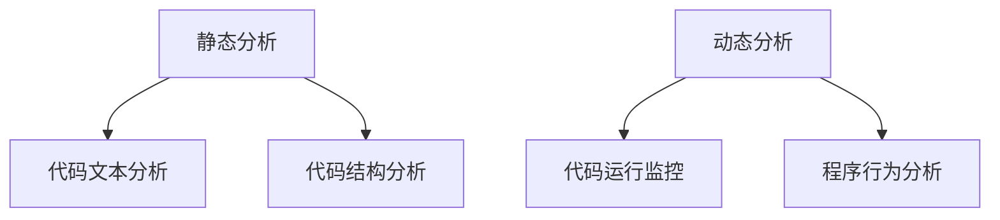
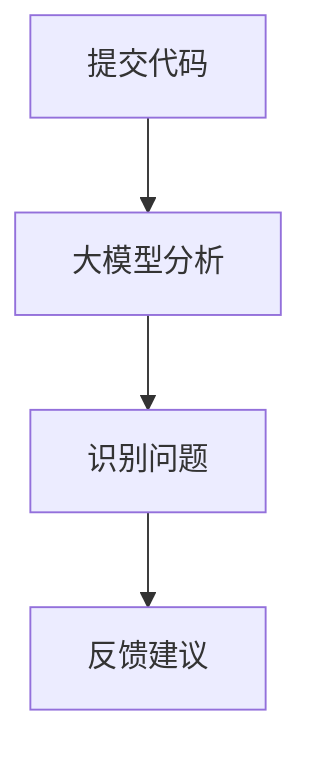
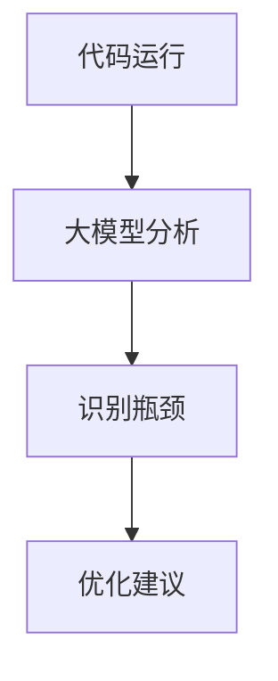
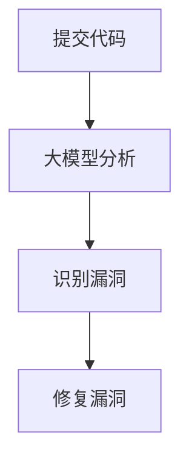

                 

### 《大模型时代的程序分析新技术》

> 关键词：大模型、程序分析、新技术、人工智能、算法

> 摘要：本文将深入探讨大模型时代的程序分析新技术，从背景介绍、核心概念、技术原理、应用案例到未来展望，全面解析这一领域的最新进展和应用。文章旨在为广大开发者提供清晰、实用的技术指导，助力他们在新时代的技术浪潮中乘风破浪。

## 第1章：背景介绍

### 1.1 大模型时代的到来

近年来，人工智能（AI）领域取得了惊人的进展，尤其是在大模型（Large Models）方面。大模型，如GPT-3、BERT和AlphaGo，通过学习海量数据，实现了前所未有的性能提升。大模型时代的到来，不仅改变了自然语言处理、计算机视觉等领域，也对程序分析产生了深远影响。

### 1.2 程序分析的新需求

随着软件系统日益复杂，程序分析变得至关重要。传统的程序分析方法已难以满足新需求。大模型的出现，为程序分析带来了新的可能性，使得复杂代码的理解、优化和修复变得更加高效。

### 1.3 程序分析新技术概述

程序分析新技术包括静态分析、动态分析、机器学习和深度学习等多种方法。这些新技术借助大模型的能力，能够自动识别代码中的缺陷、优化代码性能，甚至预测软件未来的行为。

## 第2章：核心概念

### 2.1 程序分析的定义

程序分析是一种静态或动态的代码分析方法，旨在理解、优化或修复软件。传统的程序分析主要依赖于规则和模式匹配，而新技术则借助大模型进行更高级别的抽象和推理。

### 2.2 大模型在程序分析中的应用

大模型，如GPT-3和Bert，可以通过学习海量代码库，理解代码的结构和语义。这使得它们能够自动生成代码、修复bug、优化性能，甚至进行代码审查。

### 2.3 程序分析新技术特点

程序分析新技术具有以下特点：

- **高效性**：大模型可以快速处理大量代码，提高分析效率。
- **准确性**：大模型通过学习海量数据，能够更准确地识别代码中的问题。
- **灵活性**：大模型可以适应不同类型的代码和不同的编程语言。

## 第3章：技术原理

### 3.1 算法原理讲解

程序分析新技术主要基于以下算法：

- **静态分析**：通过分析代码文本，识别潜在的缺陷和问题。
- **动态分析**：通过运行代码，监控程序的行为，发现运行时的问题。
- **机器学习和深度学习**：利用大模型对代码进行高级别的抽象和推理。

### 3.2 算法 Mermaid 流程图

以下是一个简单的 Mermaid 流程图，展示了静态分析和动态分析的基本流程：



### 3.3 Python 源代码展示

以下是一个简单的 Python 源代码示例，展示了如何使用静态分析来检查代码中的潜在错误：

```python
def add(a, b):
    return a + b

def subtract(a, b):
    return a - b

# 检查代码中的潜在错误
code = "def multiply(a, b):\n    return a * b"
errors = ["add", "subtract"]

for error in errors:
    if error in code:
        print(f"代码中存在潜在的错误：{error}")
```

## 第4章：应用案例

### 4.1 案例一：代码审查

在代码审查中，大模型可以帮助开发人员快速识别代码中的潜在问题，提高代码质量。以下是一个简单的案例：



### 4.2 案例二：性能优化

大模型可以通过分析代码的运行时行为，识别潜在的性能瓶颈，并提供优化建议。以下是一个简单的案例：



### 4.3 案例三：漏洞检测

大模型可以通过分析代码的语义，识别潜在的安全漏洞。以下是一个简单的案例：



## 第5章：未来展望

### 5.1 技术发展趋势

随着大模型能力的不断提升，程序分析新技术将越来越成熟，有望在更多领域得到应用。

### 5.2 挑战与机遇

尽管大模型在程序分析中具有巨大潜力，但也面临一系列挑战，如数据隐私、模型解释性等。解决这些挑战，将为程序分析带来新的机遇。

### 5.3 未来研究方向

未来研究方向包括提高大模型的可解释性、开发更适合程序分析的模型、以及探索大模型在新兴领域（如物联网、区块链等）的应用。

## 总结

大模型时代的程序分析新技术，为开发者提供了强大的工具，有助于提高代码质量、优化性能、提升安全性。随着技术的不断进步，我们有理由相信，这一领域将迎来更加辉煌的未来。

### 作者信息

作者：AI天才研究院/AI Genius Institute & 禅与计算机程序设计艺术 /Zen And The Art of Computer Programming

通过以上章节的详细讲解，我们希望能够为您带来关于大模型时代程序分析新技术的全面理解。在接下来的章节中，我们将继续深入探讨这一领域的核心概念、技术原理和应用案例，帮助您更好地掌握这一前沿技术。让我们继续一起思考，探索程序分析的新境界。

