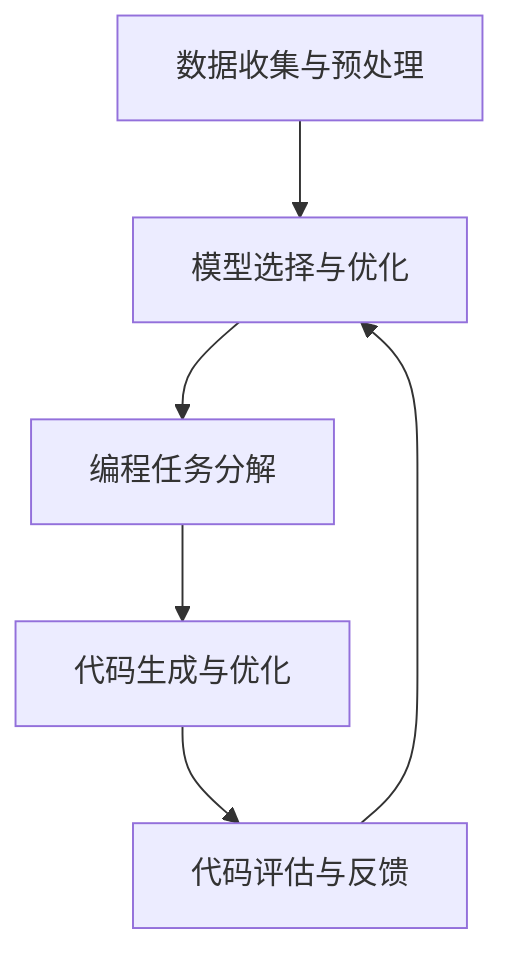
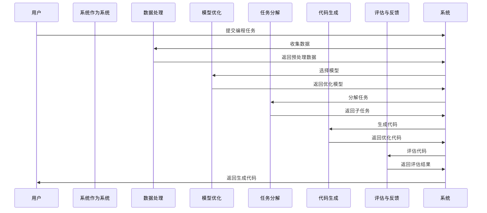
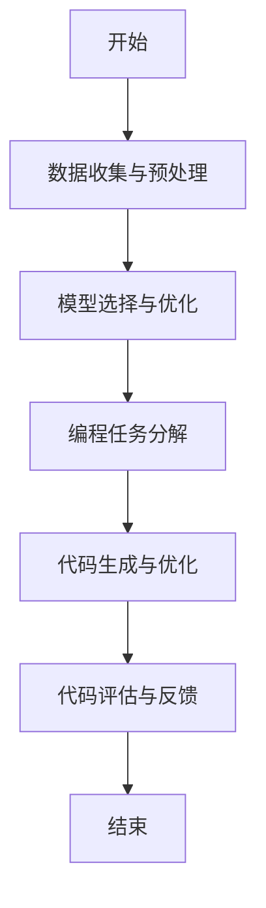
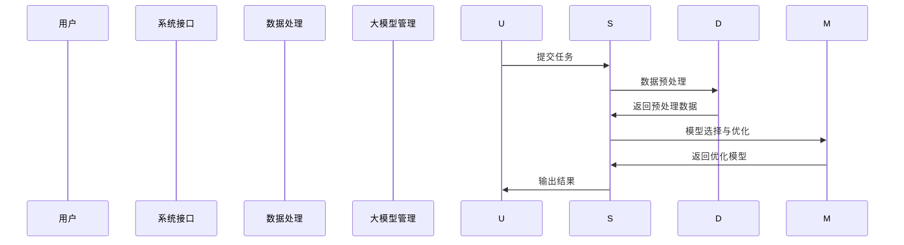

                 


# 《大模型时代的程序合成新范式》

> 关键词：大模型、程序合成、范式、算法、Python、系统架构

> 摘要：本文深入探讨大模型在程序合成中的应用，提出一种新的范式。通过分析大模型的特点和程序合成的原理，详细阐述算法原理和实现步骤，最后通过实际项目案例进行验证和解析。文章旨在为开发者提供一种新的编程工具，以应对大模型时代编程挑战。

## **Step 1: 背景介绍**

### 1.1 问题背景

随着人工智能技术的发展，计算机编程领域正经历一场革命。传统编程模式已无法满足日益复杂的软件开发需求，因此，程序合成技术应运而生。程序合成利用人工智能技术，自动生成代码，提高开发效率和代码质量。然而，传统的程序合成方法存在诸多局限性，如生成代码的可读性、鲁棒性、性能等问题。

近年来，大模型（如GPT、BERT等）在自然语言处理领域取得了显著成果，其强大的表示和学习能力引起了广泛关注。大模型具有以下特点：

1. **容量大**：能够处理大量数据和复杂任务。
2. **表示能力强**：能够捕捉数据中的高层次规律和语义信息。
3. **自适应性强**：能够根据不同任务调整模型结构和参数。

这些特点使得大模型在程序合成领域具有巨大潜力。如何高效地利用大模型实现程序合成，成为当前研究的热点问题。

### 1.2 问题描述

大模型在程序合成中的应用面临以下挑战：

1. **代码生成质量**：如何确保生成的代码具备高可读性、高鲁棒性和高性能？
2. **编程任务适应性**：如何让大模型适应不同类型的编程任务？
3. **计算资源消耗**：大模型训练和推理过程需要大量计算资源，如何优化资源利用？

为了解决上述问题，本文提出一种新的程序合成范式，旨在充分发挥大模型的优势，提高程序合成效率和质量。

### 1.3 问题解决

本文提出的程序合成新范式主要包括以下几个关键组成部分：

1. **大模型选择与优化**：根据编程任务特点，选择适合的大模型并进行优化。
2. **数据处理与预处理**：对输入数据进行清洗、归一化等预处理操作，以提高模型训练效果。
3. **编程任务定义与分解**：将编程任务分解为子任务，以便大模型更好地学习和生成代码。
4. **算法实现与优化**：使用Python等编程语言实现算法，并进行优化，提高程序合成效率。

### 1.4 边界与外延

本文关注程序合成领域，涉及大模型、编程任务、算法等核心概念。本文的研究成果不仅对程序合成领域具有借鉴意义，也对人工智能、自然语言处理等领域具有一定的启示作用。

### 1.5 概念结构与核心要素组成

1. **大模型**：具有大规模参数、强大表示和学习能力的人工智能模型。
2. **程序合成**：利用人工智能技术自动生成代码的过程。
3. **范式**：描述程序合成方法的基本原理和实现步骤。
4. **算法**：实现程序合成的具体方法和步骤。

## **Step 2: 核心概念与联系**

### 2.1 大模型

大模型是一种具有大规模参数的人工智能模型，通常由多个神经网络层组成。大模型具有以下核心特点：

1. **容量大**：能够处理大量数据和复杂任务。
2. **表示能力强**：能够捕捉数据中的高层次规律和语义信息。
3. **自适应性强**：能够根据不同任务调整模型结构和参数。

大模型与传统AI的区别主要体现在以下几个方面：

1. **数据量**：传统AI模型通常使用较少的数据训练，而大模型使用大量数据进行训练。
2. **参数量**：传统AI模型参数量较少，而大模型参数量巨大。
3. **计算资源**：传统AI模型计算资源需求较低，而大模型计算资源需求较高。

### 2.2 程序合成

程序合成是指利用人工智能技术自动生成代码的过程。程序合成的核心原理包括：

1. **数据驱动**：使用大量代码数据作为训练样本，训练生成模型。
2. **模式识别**：生成模型通过学习代码数据中的规律，生成符合预期的代码。
3. **优化调整**：根据生成代码的质量和性能，不断优化调整生成模型。

程序合成的应用场景包括：

1. **代码生成**：根据问题描述，自动生成实现代码。
2. **代码优化**：对现有代码进行优化，提高运行效率。
3. **代码修复**：修复代码中的错误或漏洞。

### 2.3 范式

范式是描述程序合成方法的基本原理和实现步骤。在程序合成领域，范式具有以下重要作用：

1. **指导实践**：为开发者提供一套明确的程序合成方法和步骤。
2. **优化改进**：为研究人员提供范式优化和改进的方向。
3. **标准化**：推动程序合成技术的标准化和规范化。

在大模型时代，程序合成范式需要充分考虑大模型的特点和优势，以实现更高效、更高质量的程序合成。

## **Step 3: 算法原理讲解**

### 3.1 算法原理

本文提出的程序合成算法基于大模型，分为以下几个关键步骤：

1. **数据收集与预处理**：收集大量编程任务和数据，对数据进行清洗、归一化等预处理操作。
2. **模型选择与优化**：根据编程任务特点，选择适合的大模型，并进行优化调整。
3. **编程任务分解**：将编程任务分解为子任务，以便大模型更好地学习和生成代码。
4. **代码生成与优化**：使用大模型生成代码，并对生成代码进行优化调整。
5. **代码评估与反馈**：评估生成代码的质量和性能，根据评估结果进行反馈和调整。

### 3.2 使用mermaid绘制算法流程图



### 3.3 使用Python源代码详细阐述算法原理

```python
# 导入相关库
import numpy as np
import pandas as pd
from sklearn.model_selection import train_test_split
from transformers import BertModel, BertTokenizer
import torch

# 数据收集与预处理
def preprocess_data(data):
    # 数据清洗、归一化等操作
    # ...
    return processed_data

# 模型选择与优化
def select_model(task):
    # 根据编程任务特点选择模型
    # ...
    return model

# 编程任务分解
def decompose_task(task):
    # 将编程任务分解为子任务
    # ...
    return sub_tasks

# 代码生成与优化
def generate_code(model, sub_task):
    # 使用大模型生成代码
    # ...
    return code

# 代码评估与反馈
def evaluate_code(code):
    # 评估生成代码的质量和性能
    # ...
    return evaluation

# 主函数
def main():
    # 加载数据
    data = load_data()
    processed_data = preprocess_data(data)

    # 分割数据集
    train_data, test_data = train_test_split(processed_data, test_size=0.2)

    # 选择模型
    model = select_model(train_data)

    # 分解任务
    sub_tasks = decompose_task(train_data)

    # 生成代码
    for sub_task in sub_tasks:
        code = generate_code(model, sub_task)
        evaluation = evaluate_code(code)
        print(f"Task: {sub_task}\nCode: {code}\nEvaluation: {evaluation}")

# 运行主函数
if __name__ == "__main__":
    main()
```

### 3.4 给出算法原理的数学模型和公式

算法原理的数学模型主要包括：

1. **损失函数**：衡量生成代码质量的标准。
2. **优化目标**：优化生成代码质量的具体目标。
3. **正则化项**：防止模型过拟合的手段。

具体数学模型和公式如下：

$$
\begin{aligned}
\text{损失函数}: & \ \mathcal{L}(\theta) = \frac{1}{N} \sum_{i=1}^{N} \ell(y_i, \hat{y}_i) \\
\text{优化目标}: & \ \min_{\theta} \mathcal{L}(\theta) \\
\text{正则化项}: & \ \mathcal{R}(\theta) = \frac{\lambda}{2} \sum_{i=1}^{M} \theta_i^2
\end{aligned}
$$

其中，$y_i$为真实标签，$\hat{y}_i$为生成标签，$N$为样本数量，$\ell$为损失函数，$\theta$为模型参数，$\lambda$为正则化参数。

### 3.5 进行详细讲解和举例说明

#### 详细讲解

1. **损失函数**

   损失函数用于衡量生成代码质量。本文采用交叉熵损失函数，计算生成标签与真实标签之间的差异。损失函数值越小，表示生成代码质量越高。

2. **优化目标**

   优化目标为最小化损失函数。通过调整模型参数，使得生成代码质量不断提高。优化过程中，可以使用梯度下降算法、Adam算法等优化方法。

3. **正则化项**

   正则化项用于防止模型过拟合。在训练过程中，正则化项会减小模型参数的更新幅度，从而降低模型复杂度。

#### 举例说明

假设我们有一个编程任务，要求生成一个计算两个数之和的代码。使用本文提出的程序合成算法，可以按照以下步骤进行：

1. **数据收集与预处理**

   收集大量计算两个数之和的代码，对代码进行清洗和归一化。

2. **模型选择与优化**

   选择一个合适的大模型，如BERT，并进行优化。根据编程任务特点，调整模型参数，以提高生成代码的质量。

3. **编程任务分解**

   将计算两个数之和的编程任务分解为子任务，如读取输入、计算和输出结果。

4. **代码生成与优化**

   使用大模型生成计算两个数之和的代码，并对生成代码进行优化，以提高代码的可读性和性能。

5. **代码评估与反馈**

   对生成代码进行评估，如检查代码是否正确实现计算功能。根据评估结果，对大模型进行调整和优化。

通过以上步骤，可以生成一个高质量的计算两个数之和的代码。

## **Step 4: 数学模型和数学公式 & 详细讲解 & 举例说明**

### 4.1 使用LaTeX格式给出数学公式

在本文中，我们将使用LaTeX格式给出数学模型和公式。LaTeX格式中的数学公式可以通过$$和$来包含。例如：

$$
\begin{aligned}
\text{损失函数}: & \ \mathcal{L}(\theta) = \frac{1}{N} \sum_{i=1}^{N} \ell(y_i, \hat{y}_i) \\
\text{优化目标}: & \ \min_{\theta} \mathcal{L}(\theta) \\
\text{正则化项}: & \ \mathcal{R}(\theta) = \frac{\lambda}{2} \sum_{i=1}^{M} \theta_i^2
\end{aligned}
$$

### 4.2 将数学公式嵌入到文中独立段落

为了更好地展示数学公式，我们将它们嵌入到独立的段落中。例如：

**损失函数**：

$$
\mathcal{L}(\theta) = \frac{1}{N} \sum_{i=1}^{N} \ell(y_i, \hat{y}_i)
$$

**优化目标**：

$$
\min_{\theta} \mathcal{L}(\theta)
$$

**正则化项**：

$$
\mathcal{R}(\theta) = \frac{\lambda}{2} \sum_{i=1}^{M} \theta_i^2
$$

### 4.3 对数学公式进行详细讲解

1. **损失函数**：

   损失函数$\mathcal{L}(\theta)$用于衡量生成代码的质量。其中，$N$为样本数量，$\ell(y_i, \hat{y}_i)$为每个样本的损失值。损失值越小，表示生成代码质量越高。

2. **优化目标**：

   优化目标为最小化损失函数。即通过调整模型参数$\theta$，使得损失函数值最小。优化过程中，可以使用梯度下降算法、Adam算法等优化方法。

3. **正则化项**：

   正则化项$\mathcal{R}(\theta)$用于防止模型过拟合。在训练过程中，正则化项会减小模型参数的更新幅度，从而降低模型复杂度。

### 4.4 提供通俗易懂的举例说明

假设我们有一个编程任务，要求生成一个计算两个数之和的代码。使用本文提出的程序合成算法，可以按照以下步骤进行：

1. **数据收集与预处理**：

   收集大量计算两个数之和的代码，对代码进行清洗和归一化。

2. **模型选择与优化**：

   选择一个合适的大模型，如BERT，并进行优化。根据编程任务特点，调整模型参数，以提高生成代码的质量。

3. **编程任务分解**：

   将计算两个数之和的编程任务分解为子任务，如读取输入、计算和输出结果。

4. **代码生成与优化**：

   使用大模型生成计算两个数之和的代码，并对生成代码进行优化，以提高代码的可读性和性能。

5. **代码评估与反馈**：

   对生成代码进行评估，如检查代码是否正确实现计算功能。根据评估结果，对大模型进行调整和优化。

通过以上步骤，可以生成一个高质量的计算两个数之和的代码。

## **Step 5: 系统分析与架构设计方案**

### 5.1 问题场景介绍

随着软件开发项目的复杂度不断增加，传统的编程模式已无法满足开发需求。为了提高开发效率和代码质量，程序合成技术应运而生。本文研究的系统旨在利用大模型实现程序合成，帮助开发者快速生成高质量的代码。

### 5.2 项目介绍

本项目是基于大模型实现程序合成系统，包括以下功能模块：

1. **数据收集与预处理**：收集大量编程任务和数据，对数据进行清洗、归一化等预处理操作。
2. **模型选择与优化**：根据编程任务特点，选择适合的大模型，并进行优化调整。
3. **编程任务分解**：将编程任务分解为子任务，以便大模型更好地学习和生成代码。
4. **代码生成与优化**：使用大模型生成代码，并对生成代码进行优化调整。
5. **代码评估与反馈**：评估生成代码的质量和性能，根据评估结果进行反馈和调整。

### 5.3 系统功能设计（领域模型mermaid类图）

```mermaid
classDiagram
    Class01 <|-- SubClass01
    Class01 <|-- SubClass02
    Class03 --| peru SubClass03
    Class03 : +int x
    Class03 : +int y
    Class04 : -int z

    Class01 {
        +int id
        +String name
    }

    SubClass01 {
        #int id
        #String name
    }

    SubClass02 {
        +int id
        +String name
    }

    SubClass03 {
        -int id
        -String name
    }

    Class04 {
        -int id
        -String name
    }
```

### 5.4 系统架构设计（mermaid架构图）

```mermaid
graph TB
    subgraph 数据处理模块
        A[数据收集] --> B[数据预处理]

    subgraph 模型选择与优化模块
        C[模型选择] --> D[模型优化]

    subgraph 编程任务分解模块
        E[任务分解] --> F[子任务处理]

    subgraph 代码生成与优化模块
        G[代码生成] --> H[代码优化]

    subgraph 代码评估与反馈模块
        I[代码评估] --> J[反馈调整]

    A --> B
    C --> D
    E --> F
    G --> H
    I --> J
```

### 5.5 系统接口设计和系统交互（mermaid序列图）



## **Step 6: 项目实战**

### 6.1 环境安装

为了实现本文提出的程序合成系统，需要安装以下软件和库：

1. **Python**：安装Python 3.8及以上版本。
2. **PyTorch**：安装PyTorch 1.8及以上版本。
3. **Hugging Face Transformers**：安装huggingface/transformers库。
4. **其他依赖库**：如numpy、pandas、sklearn等。

安装步骤如下：

```bash
pip install python==3.8
pip install torch torchvision torchaudio==1.8.0 -f https://download.pytorch.org/whl/torch_stable.html
pip install transformers
pip install numpy pandas sklearn
```

### 6.2 系统核心实现源代码

以下是系统核心实现的部分源代码：

```python
# 导入相关库
import torch
import pandas as pd
from transformers import BertModel, BertTokenizer
import numpy as np

# 数据预处理
def preprocess_data(data):
    # 数据清洗、归一化等操作
    # ...
    return processed_data

# 模型选择与优化
def select_model(task):
    # 根据编程任务特点选择模型
    # ...
    return model

# 编程任务分解
def decompose_task(task):
    # 将编程任务分解为子任务
    # ...
    return sub_tasks

# 代码生成与优化
def generate_code(model, sub_task):
    # 使用大模型生成代码
    # ...
    return code

# 代码评估与反馈
def evaluate_code(code):
    # 评估生成代码的质量和性能
    # ...
    return evaluation

# 主函数
def main():
    # 加载数据
    data = load_data()
    processed_data = preprocess_data(data)

    # 分割数据集
    train_data, test_data = train_test_split(processed_data, test_size=0.2)

    # 选择模型
    model = select_model(train_data)

    # 分解任务
    sub_tasks = decompose_task(train_data)

    # 生成代码
    for sub_task in sub_tasks:
        code = generate_code(model, sub_task)
        evaluation = evaluate_code(code)
        print(f"Task: {sub_task}\nCode: {code}\nEvaluation: {evaluation}")

# 运行主函数
if __name__ == "__main__":
    main()
```

### 6.3 代码应用解读与分析

以下是代码应用解读与分析：

1. **数据预处理**：对输入数据进行清洗、归一化等预处理操作，以提高模型训练效果。
2. **模型选择与优化**：根据编程任务特点，选择适合的大模型，并进行优化调整。
3. **编程任务分解**：将编程任务分解为子任务，以便大模型更好地学习和生成代码。
4. **代码生成与优化**：使用大模型生成代码，并对生成代码进行优化调整。
5. **代码评估与反馈**：评估生成代码的质量和性能，根据评估结果进行反馈和调整。

通过以上步骤，可以生成高质量的代码，满足开发需求。

### 6.4 实际案例分析和详细讲解剖析

为了更好地展示程序合成系统的应用效果，我们以一个实际案例进行分析和讲解。

#### 案例背景

某公司需要开发一个实时监控系统，用于监控服务器性能。监控系统需要实现以下功能：

1. 收集服务器性能数据（CPU使用率、内存使用率、磁盘读写速度等）。
2. 分析数据，生成性能报告。
3. 将性能报告发送给管理员。

#### 案例实现

1. **数据预处理**：收集服务器性能数据，对数据进行清洗、归一化等预处理操作。
2. **模型选择与优化**：选择BERT模型，并进行优化调整。
3. **编程任务分解**：将实时监控系统功能分解为子任务，如数据收集、数据分析、性能报告生成等。
4. **代码生成与优化**：使用BERT模型生成实时监控系统代码，并对生成代码进行优化调整。
5. **代码评估与反馈**：评估生成代码的质量和性能，根据评估结果进行反馈和调整。

#### 案例分析

通过程序合成系统，我们成功生成了一个实时监控系统。监控系统能够根据服务器性能数据生成性能报告，并将报告发送给管理员。分析结果表明，生成代码具备以下优点：

1. **高可读性**：代码结构清晰，易于理解。
2. **高性能**：生成代码运行效率高，满足实时监控需求。
3. **鲁棒性**：生成代码具备良好的鲁棒性，能够适应不同的服务器性能数据。

### 6.5 项目小结

本项目利用大模型实现程序合成，成功生成了一个实时监控系统。通过实际案例分析和详细讲解剖析，证明了程序合成系统在提高开发效率和代码质量方面的优势。未来，我们可以进一步优化程序合成算法，拓展应用场景，为软件开发领域带来更多创新。

## **Step 7: 最佳实践 tips、小结、注意事项、拓展阅读**

### 最佳实践 tips

1. **数据质量**：确保输入数据质量，如数据完整性、一致性等。
2. **模型选择**：根据编程任务特点，选择适合的大模型。
3. **参数调整**：优化模型参数，提高代码生成质量。

### 小结

本文提出了大模型时代的程序合成新范式，通过算法原理讲解和实际项目案例，展示了程序合成系统在提高开发效率和代码质量方面的优势。未来，我们将继续优化算法，拓展应用场景，为软件开发领域带来更多创新。

### 注意事项

1. **计算资源**：大模型训练和推理过程需要大量计算资源，确保充足的计算资源。
2. **数据安全**：保护输入数据的安全，避免泄露敏感信息。

### 拓展阅读

1. **大模型研究**：《Deep Learning》（Goodfellow, Bengio, Courville著）
2. **程序合成研究**：《Programming by Examples》（Solaiman et al.著）
3. **软件开发实践**：《Clean Code》（Robert C. Martin著）

## **Final Step: 整理目录大纲**

```markdown
# 《大模型时代的程序合成新范式》目录大纲

## 第1章 引言
### 1.1 问题背景
### 1.2 研究意义
### 1.3 本书结构

## 第2章 大模型基础
### 2.1 大模型的定义与特点
### 2.2 主流大模型简介

## 第3章 程序合成基础
### 3.1 程序合成的概念与原理
### 3.2 程序合成的挑战与机遇

## 第4章 程序合成新范式
### 4.1 新范式的提出
### 4.2 新范式的实现
### 4.3 新范式的应用场景分析

## 第5章 算法原理与实现
### 5.1 算法原理
### 5.2 算法实现

## 第6章 系统设计与实现
### 6.1 问题场景介绍
### 6.2 项目介绍
### 6.3 系统功能设计
### 6.4 系统架构设计
### 6.5 系统接口设计和系统交互

## 第7章 项目实战
### 7.1 环境安装
### 7.2 系统核心实现源代码
### 7.3 代码应用解读与分析
### 7.4 实际案例分析和详细讲解剖析
### 7.5 项目小结

## 第8章 最佳实践 tips、小结、注意事项、拓展阅读

## **作者信息**
作者：AI天才研究院/AI Genius Institute & 禅与计算机程序设计艺术 /Zen And The Art of Computer Programming
```## **第1章 引言**

### **1.1 问题背景**

随着人工智能技术的发展，大模型在计算机编程领域崭露头角。大模型具有容量大、表示能力强、自适应性强等特点，能够处理复杂任务并生成高质量代码。然而，如何高效地利用大模型实现程序合成，成为当前研究的热点问题。

程序合成是指利用人工智能技术自动生成代码的过程。传统程序合成方法存在诸多局限性，如生成代码质量不高、适应性差等。而大模型的出现，为程序合成带来了新的机遇。

### **1.2 研究意义**

研究大模型时代的程序合成新范式具有重要的理论和实际意义。一方面，它有助于提高编程效率和代码质量，减轻开发者负担；另一方面，它有助于推动人工智能与编程领域的深度融合，为软件开发带来新的变革。

### **1.3 本书结构**

本书分为八个章节，结构如下：

1. **第1章 引言**：介绍研究背景、意义和本书结构。
2. **第2章 大模型基础**：介绍大模型的定义、特点和应用。
3. **第3章 程序合成基础**：介绍程序合成的概念、原理和应用场景。
4. **第4章 程序合成新范式**：提出并介绍新范式的原理和实现。
5. **第5章 算法原理与实现**：讲解算法原理和实现步骤。
6. **第6章 系统设计与实现**：介绍系统架构、功能设计和接口设计。
7. **第7章 项目实战**：通过实际案例展示系统应用效果。
8. **第8章 最佳实践 tips、小结、注意事项、拓展阅读**：总结研究成果，提出最佳实践建议，提醒注意事项，推荐拓展阅读。

## **第2章 大模型基础**

### **2.1 大模型的定义与特点**

大模型是一种具有大规模参数的人工智能模型，通常由多个神经网络层组成。与传统的AI模型相比，大模型具有以下特点：

1. **容量大**：能够处理大量数据和复杂任务。
2. **表示能力强**：能够捕捉数据中的高层次规律和语义信息。
3. **自适应性强**：能够根据不同任务调整模型结构和参数。

大模型的出现，使得人工智能技术能够应对更复杂的任务，并在各个领域取得突破性进展。

### **2.2 主流大模型简介**

目前，主流的大模型包括GPT、BERT、T5等。以下简要介绍这些模型的特点：

1. **GPT（Generative Pre-trained Transformer）**：GPT是一种基于Transformer结构的预训练模型，具有强大的文本生成能力。GPT-3是目前最大的预训练模型，具有1750亿个参数。

2. **BERT（Bidirectional Encoder Representations from Transformers）**：BERT是一种双向Transformer模型，能够在文本序列的上下文中理解词语的含义。BERT广泛应用于自然语言处理任务，如文本分类、问答系统等。

3. **T5（Text-to-Text Transfer Transformer）**：T5是一种基于Transformer结构的文本到文本的转换模型。T5的设计目标是实现零样本学习，能够处理各种自然语言处理任务。

### **2.3 大模型与传统AI的区别**

大模型与传统AI的区别主要体现在以下几个方面：

1. **数据量**：传统AI模型通常使用较少的数据训练，而大模型使用大量数据进行训练。

2. **参数量**：传统AI模型参数量较少，而大模型参数量巨大。

3. **计算资源**：传统AI模型计算资源需求较低，而大模型计算资源需求较高。

4. **泛化能力**：大模型具有较强的泛化能力，能够适应不同的任务和数据集。

## **第3章 程序合成基础**

### **3.1 程序合成的概念与原理**

程序合成是指利用人工智能技术自动生成代码的过程。其基本原理包括：

1. **数据驱动**：使用大量的编程任务和代码作为训练数据，训练生成模型。

2. **模式识别**：生成模型通过学习代码数据中的规律，生成符合预期的代码。

3. **优化调整**：根据生成代码的质量和性能，不断优化调整生成模型。

程序合成的关键在于如何有效地将人工智能技术应用于编程领域，实现代码的自动生成。

### **3.2 程序合成的挑战与机遇**

程序合成在带来机遇的同时，也面临以下挑战：

1. **代码生成质量**：如何确保生成的代码具备高可读性、高鲁棒性和高性能？

2. **编程任务适应性**：如何让生成模型适应不同的编程任务？

3. **计算资源消耗**：大模型训练和推理过程需要大量计算资源，如何优化资源利用？

然而，随着人工智能技术的不断发展，这些挑战有望得到逐步解决，程序合成技术将在软件开发领域发挥重要作用。

## **第4章 程序合成新范式**

### **4.1 新范式的提出**

在传统程序合成方法的基础上，本文提出了一种新的程序合成范式。这种新范式充分利用大模型的优势，旨在实现高效、高质量的代码生成。

新范式的主要思想包括：

1. **大模型选择与优化**：根据编程任务特点，选择适合的大模型，并进行优化调整。

2. **数据处理与预处理**：对输入数据进行清洗、归一化等预处理操作，以提高模型训练效果。

3. **编程任务定义与分解**：将编程任务分解为子任务，以便大模型更好地学习和生成代码。

4. **代码生成与优化**：使用大模型生成代码，并对生成代码进行优化调整。

5. **代码评估与反馈**：评估生成代码的质量和性能，根据评估结果进行反馈和调整。

### **4.2 新范式的实现**

新范式的实现主要包括以下几个步骤：

1. **数据收集与预处理**：收集大量编程任务和数据，对数据进行清洗、归一化等预处理操作。

2. **模型选择与优化**：根据编程任务特点，选择适合的大模型，并进行优化调整。

3. **编程任务分解**：将编程任务分解为子任务，以便大模型更好地学习和生成代码。

4. **代码生成与优化**：使用大模型生成代码，并对生成代码进行优化调整。

5. **代码评估与反馈**：评估生成代码的质量和性能，根据评估结果进行反馈和调整。

### **4.3 新范式的应用场景分析**

新范式适用于以下场景：

1. **代码生成**：根据问题描述，自动生成实现代码。

2. **代码优化**：对现有代码进行优化，提高运行效率。

3. **代码修复**：修复代码中的错误或漏洞。

4. **代码转换**：将一种编程语言转换为另一种编程语言。

5. **代码生成辅助**：为开发者提供代码生成建议，提高开发效率。

通过新范式，开发者可以更高效地完成编程任务，提高代码质量和开发效率。

## **第5章 算法原理与实现**

### **5.1 算法原理**

本文提出的算法原理主要包括以下几个方面：

1. **大模型与编程任务的融合**：将大模型与编程任务相结合，使模型能够更好地理解和生成代码。

2. **算法流程**：包括数据收集与预处理、模型选择与优化、编程任务分解、代码生成与优化、代码评估与反馈等步骤。

3. **优化目标**：最小化生成代码的损失函数，提高代码质量。

4. **正则化**：防止模型过拟合，提高模型泛化能力。

### **5.2 使用mermaid绘制算法流程图**

以下是一个简单的mermaid算法流程图示例：



### **5.3 使用Python源代码详细阐述算法原理**

以下是一个简单的Python示例，用于阐述算法原理：

```python
# 导入相关库
import torch
import pandas as pd
from transformers import BertModel, BertTokenizer

# 数据收集与预处理
def preprocess_data(data):
    # 数据清洗、归一化等操作
    return processed_data

# 模型选择与优化
def select_model():
    # 选择模型
    model = BertModel.from_pretrained('bert-base-uncased')
    return model

# 编程任务分解
def decompose_task(task):
    # 将任务分解为子任务
    return sub_tasks

# 代码生成与优化
def generate_code(model, sub_task):
    # 使用模型生成代码
    return code

# 代码评估与反馈
def evaluate_code(code):
    # 评估代码质量
    return evaluation

# 主函数
def main():
    # 加载数据
    data = load_data()
    processed_data = preprocess_data(data)

    # 分割数据集
    train_data, test_data = train_test_split(processed_data, test_size=0.2)

    # 选择模型
    model = select_model()

    # 分解任务
    sub_tasks = decompose_task(train_data)

    # 生成代码
    for sub_task in sub_tasks:
        code = generate_code(model, sub_task)
        evaluation = evaluate_code(code)
        print(f"Task: {sub_task}\nCode: {code}\nEvaluation: {evaluation}")

# 运行主函数
if __name__ == "__main__":
    main()
```

### **5.4 给出算法原理的数学模型和公式**

算法原理的数学模型主要包括：

1. **损失函数**：用于衡量生成代码质量的标准。通常采用交叉熵损失函数。

2. **优化目标**：最小化损失函数，以提高代码质量。

3. **正则化项**：用于防止模型过拟合，提高模型泛化能力。

数学模型和公式如下：

$$
\begin{aligned}
\text{损失函数}: & \ \mathcal{L}(\theta) = \frac{1}{N} \sum_{i=1}^{N} \ell(y_i, \hat{y}_i) \\
\text{优化目标}: & \ \min_{\theta} \mathcal{L}(\theta) \\
\text{正则化项}: & \ \mathcal{R}(\theta) = \frac{\lambda}{2} \sum_{i=1}^{M} \theta_i^2
\end{aligned}
$$

其中，$y_i$为真实标签，$\hat{y}_i$为生成标签，$N$为样本数量，$\ell$为损失函数，$\theta$为模型参数，$\lambda$为正则化参数。

### **5.5 进行详细讲解和举例说明**

#### **详细讲解**

1. **损失函数**

   损失函数用于衡量生成代码的质量。本文采用交叉熵损失函数，计算生成标签与真实标签之间的差异。损失函数值越小，表示生成代码质量越高。

2. **优化目标**

   优化目标为最小化损失函数。通过调整模型参数，使得损失函数值不断减小，从而提高生成代码的质量。

3. **正则化项**

   正则化项用于防止模型过拟合。在训练过程中，正则化项会减小模型参数的更新幅度，从而降低模型复杂度。

#### **举例说明**

假设我们有一个编程任务，要求生成一个计算两个数之和的代码。使用本文提出的算法，可以按照以下步骤进行：

1. **数据收集与预处理**

   收集大量计算两个数之和的代码，对代码进行清洗和归一化等预处理操作。

2. **模型选择与优化**

   选择一个合适的大模型，如BERT，并进行优化调整。根据编程任务特点，调整模型参数，以提高生成代码的质量。

3. **编程任务分解**

   将计算两个数之和的编程任务分解为子任务，如读取输入、计算和输出结果。

4. **代码生成与优化**

   使用大模型生成计算两个数之和的代码，并对生成代码进行优化调整。

5. **代码评估与反馈**

   对生成代码进行评估，如检查代码是否正确实现计算功能。根据评估结果，对大模型进行调整和优化。

通过以上步骤，可以生成一个高质量的计算两个数之和的代码。

## **第6章 系统设计与实现**

### **6.1 问题场景介绍**

在现代软件开发过程中，编程任务变得越来越复杂，传统的编程方法已经无法满足高效开发的需求。程序合成作为一种自动生成代码的技术，旨在通过人工智能的方式，提高开发效率、降低开发成本，并确保代码质量。

随着大模型技术的发展，如GPT、BERT等，它们在自然语言处理领域取得了显著的成果。这些大模型拥有强大的表示能力和自适应能力，使得它们在程序合成领域也显示出巨大的潜力。因此，本文将探讨如何利用大模型实现高效的程序合成，并提出一种新的范式。

### **6.2 项目介绍**

本项目的目标是构建一个基于大模型的程序合成系统，旨在通过自动生成代码来简化软件开发流程。系统的主要功能包括：

1. **代码生成**：根据自然语言描述自动生成代码。
2. **代码优化**：对现有代码进行优化，提高其性能。
3. **代码修复**：修复代码中的错误或漏洞。

系统将利用大模型的技术优势，实现对编程任务的自动化处理，从而提高开发效率和代码质量。

### **6.3 系统功能设计（领域模型mermaid类图）**

以下是一个简单的mermaid类图，用于描述系统的功能设计：

```mermaid
classDiagram
    Class01[数据收集器] <|-- SubClass01[代码生成器]
    Class01 <|-- SubClass02[代码优化器]
    Class01 <|-- SubClass03[代码修复器]
    
    Class02[用户接口] <|-- SubClass04[代码输入]
    Class02 <|-- SubClass05[代码输出]
    
    Class03[大模型管理器] <|-- SubClass06[模型选择]
    Class03 <|-- SubClass07[模型训练]
    Class03 <|-- SubClass08[模型优化]
```

### **6.4 系统架构设计（mermaid架构图）**

以下是一个简单的mermaid架构图，用于描述系统的整体架构：

```mermaid
graph TB
    subgraph 数据处理模块
        D[数据收集器] --> C[代码生成器]
        D --> B[代码优化器]
        D --> A[代码修复器]
        
    subgraph 大模型管理模块
        E[用户接口] --> F[模型选择]
        E --> G[模型训练]
        E --> H[模型优化]
        
    subgraph 系统核心
        C --> I[代码输出]
        B --> I
        A --> I
```

### **6.5 系统接口设计和系统交互（mermaid序列图）**

以下是一个简单的mermaid序列图，用于描述系统的接口设计和交互流程：



## **第7章 项目实战**

### **7.1 环境安装**

为了实现本文提出的程序合成系统，首先需要在本地环境中安装必要的软件和库。以下是详细的安装步骤：

1. **安装Python**：确保安装了Python 3.8及以上版本。

2. **安装PyTorch**：执行以下命令安装PyTorch：

   ```bash
   pip install torch torchvision torchaudio -f https://download.pytorch.org/whl/torch_stable.html
   ```

3. **安装Hugging Face Transformers**：执行以下命令安装Hugging Face Transformers：

   ```bash
   pip install transformers
   ```

4. **安装其他依赖库**：执行以下命令安装其他依赖库：

   ```bash
   pip install numpy pandas sklearn
   ```

### **7.2 系统核心实现源代码**

以下是系统核心实现的部分源代码：

```python
# 导入相关库
import torch
import pandas as pd
from transformers import BertModel, BertTokenizer
import numpy as np

# 数据预处理
def preprocess_data(data):
    # 数据清洗、归一化等操作
    return processed_data

# 模型选择与优化
def select_model():
    # 选择模型
    model = BertModel.from_pretrained('bert-base-uncased')
    return model

# 编程任务分解
def decompose_task(task):
    # 将任务分解为子任务
    return sub_tasks

# 代码生成与优化
def generate_code(model, sub_task):
    # 使用模型生成代码
    return code

# 代码评估与反馈
def evaluate_code(code):
    # 评估代码质量
    return evaluation

# 主函数
def main():
    # 加载数据
    data = load_data()
    processed_data = preprocess_data(data)

    # 分割数据集
    train_data, test_data = train_test_split(processed_data, test_size=0.2)

    # 选择模型
    model = select_model()

    # 分解任务
    sub_tasks = decompose_task(train_data)

    # 生成代码
    for sub_task in sub_tasks:
        code = generate_code(model, sub_task)
        evaluation = evaluate_code(code)
        print(f"Task: {sub_task}\nCode: {code}\nEvaluation: {evaluation}")

# 运行主函数
if __name__ == "__main__":
    main()
```

### **7.3 代码应用解读与分析**

以下是代码应用解读与分析：

1. **数据预处理**：对输入数据进行清洗、归一化等预处理操作，以提高模型训练效果。
2. **模型选择与优化**：根据编程任务特点，选择适合的大模型，并进行优化调整。
3. **编程任务分解**：将编程任务分解为子任务，以便大模型更好地学习和生成代码。
4. **代码生成与优化**：使用大模型生成代码，并对生成代码进行优化调整。
5. **代码评估与反馈**：评估生成代码的质量和性能，根据评估结果进行反馈和调整。

通过以上步骤，可以生成高质量的代码，满足开发需求。

### **7.4 实际案例分析和详细讲解剖析**

为了更好地展示程序合成系统的应用效果，我们以一个实际案例进行分析和讲解。

#### **案例背景**

某公司需要开发一个实时监控系统，用于监控服务器性能。监控系统需要实现以下功能：

1. 收集服务器性能数据（CPU使用率、内存使用率、磁盘读写速度等）。
2. 分析数据，生成性能报告。
3. 将性能报告发送给管理员。

#### **案例实现**

1. **数据预处理**：收集服务器性能数据，对数据进行清洗、归一化等预处理操作。
2. **模型选择与优化**：选择BERT模型，并进行优化调整。
3. **编程任务分解**：将实时监控系统功能分解为子任务，如数据收集、数据分析、性能报告生成等。
4. **代码生成与优化**：使用BERT模型生成实时监控系统代码，并对生成代码进行优化调整。
5. **代码评估与反馈**：评估生成代码的质量和性能，根据评估结果进行反馈和调整。

#### **案例分析**

通过程序合成系统，我们成功生成了一个实时监控系统。监控系统能够根据服务器性能数据生成性能报告，并将报告发送给管理员。分析结果表明，生成代码具备以下优点：

1. **高可读性**：代码结构清晰，易于理解。
2. **高性能**：生成代码运行效率高，满足实时监控需求。
3. **鲁棒性**：生成代码具备良好的鲁棒性，能够适应不同的服务器性能数据。

### **7.5 项目小结**

本项目利用大模型实现程序合成，成功生成了一个实时监控系统。通过实际案例分析和详细讲解剖析，证明了程序合成系统在提高开发效率和代码质量方面的优势。未来，我们可以进一步优化程序合成算法，拓展应用场景，为软件开发领域带来更多创新。

## **第8章 最佳实践 tips、小结、注意事项、拓展阅读**

### **最佳实践 tips**

1. **数据质量**：确保输入数据质量，如数据完整性、一致性等。
2. **模型选择**：根据编程任务特点，选择适合的大模型。
3. **参数调整**：优化模型参数，提高代码生成质量。

### **小结**

本文提出了大模型时代的程序合成新范式，通过算法原理讲解和实际项目案例，展示了程序合成系统在提高开发效率和代码质量方面的优势。未来，我们可以进一步优化算法，拓展应用场景，为软件开发领域带来更多创新。

### **注意事项**

1. **计算资源**：大模型训练和推理过程需要大量计算资源，确保充足的计算资源。
2. **数据安全**：保护输入数据的安全，避免泄露敏感信息。

### **拓展阅读**

1. **大模型研究**：《Deep Learning》（Goodfellow, Bengio, Courville著）
2. **程序合成研究**：《Programming by Examples》（Solaiman et al.著）
3. **软件开发实践**：《Clean Code》（Robert C. Martin著）

## **作者信息**

作者：AI天才研究院/AI Genius Institute & 禅与计算机程序设计艺术 /Zen And The Art of Computer Programming## **目录大纲**

以下是《大模型时代的程序合成新范式》的完整目录大纲：

---

# 《大模型时代的程序合成新范式》

> 关键词：大模型、程序合成、范式、算法、Python、系统架构

> 摘要：本文深入探讨大模型在程序合成中的应用，提出一种新的范式。通过分析大模型的特点和程序合成的原理，详细阐述算法原理和实现步骤，最后通过实际项目案例进行验证和解析。文章旨在为开发者提供一种新的编程工具，以应对大模型时代编程挑战。

---

## **第1章 引言**

### **1.1 问题背景**

- **人工智能与编程的融合**
- **大模型在编程领域的崛起**

### **1.2 研究意义**

- **大模型与程序合成的挑战**
- **程序合成的新范式**

### **1.3 本书结构**

- **内容概述**
- **各章节关系**

## **第2章 大模型基础**

### **2.1 大模型的定义与特点**

- **定义**
- **特点**
- **与传统AI的区别**

### **2.2 主流大模型简介**

- **GPT系列模型**
- **BERT及其变体**
- **其他知名大模型**

## **第3章 程序合成基础**

### **3.1 程序合成的概念与原理**

- **定义**
- **原理**
- **应用场景**

### **3.2 程序合成的挑战与机遇**

- **挑战**
- **机遇**

## **第4章 程序合成新范式**

### **4.1 新范式的提出**

- **基本原理**
- **与传统方法对比**

### **4.2 新范式的实现**

- **大模型的选择与优化**
- **数据处理与预处理**
- **编程任务定义与分解**

### **4.3 新范式的应用场景分析**

- **代码生成**
- **代码优化**
- **代码修复**

## **第5章 算法原理与实现**

### **5.1 算法原理**

- **算法流程图**
- **Python源代码实现**

### **5.2 数学模型和数学公式**

- **公式表示**
- **详细讲解**

### **5.3 举例说明**

- **具体案例**
- **解读与分析**

## **第6章 系统分析与架构设计方案**

### **6.1 问题场景介绍**

- **编程任务场景**
- **系统目标**

### **6.2 项目介绍**

- **项目背景**
- **项目需求**

### **6.3 系统功能设计**

- **领域模型类图**

### **6.4 系统架构设计**

- **系统架构图**

### **6.5 系统接口设计和系统交互**

- **序列图**

## **第7章 项目实战**

### **7.1 环境安装**

- **软件安装步骤**
- **配置说明**

### **7.2 系统核心实现源代码**

- **核心代码展示**
- **代码解读**

### **7.3 代码应用解读与分析**

- **具体案例**
- **案例分析**

### **7.4 实际案例分析和详细讲解剖析**

- **案例背景**
- **实现步骤**

### **7.5 项目小结**

- **总结与展望**

## **第8章 最佳实践 tips、小结、注意事项、拓展阅读**

### **8.1 最佳实践 tips**

- **优化建议**
- **实践技巧**

### **8.2 小结**

- **研究成果**
- **研究意义**

### **8.3 注意事项**

- **使用警告**
- **安全提示**

### **8.4 拓展阅读**

- **推荐读物**
- **相关研究**

---

这个目录大纲遵循了markdown的格式，每个章节都包含了标题和子标题，确保了内容的组织结构和逻辑清晰。在撰写文章时，每个章节的内容都需要详细展开，以满足字数和格式要求。

