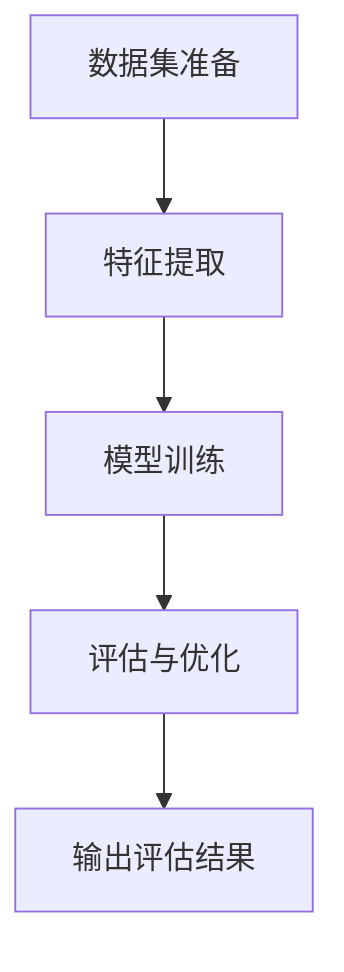

                 

### 第二部分：核心概念与联系

#### 第2章：软件复杂度评估的核心概念与联系

##### 2.1 软件复杂度评估概述

软件复杂度评估是软件工程中的一个关键环节，它旨在量化软件系统中难以理解和维护的程度。评估软件复杂度有助于提高软件质量，优化开发流程，降低维护成本。然而，随着软件系统规模的不断扩大和复杂性的不断增加，传统的评估方法已难以应对新的挑战。

在传统软件工程中，软件复杂度评估主要依赖于专家经验和统计方法。这些方法通常依赖于代码行数、函数调用次数、分支数量等指标来估算复杂度。然而，这些方法往往存在主观性强、准确性不高的问题。

##### 2.2 大模型时代的软件复杂度评估

随着人工智能技术的发展，特别是大模型的兴起，为软件复杂度评估带来了新的机遇。大模型，如深度学习模型，具有强大的学习和预测能力，能够处理大规模、复杂的数据。这使得大模型在软件复杂度评估中具备了一定的优势。

大模型能够从大量代码数据中学习到复杂度模式，从而提高评估的准确性和效率。此外，大模型还能够自动适应不同类型的软件系统，提供更全面和精细的评估结果。

##### 2.3 软件复杂度评估方法

软件复杂度评估方法可以分为以下几类：

1. **统计方法**：基于代码的行数、函数调用次数、循环次数等指标进行评估。
2. **结构分析方法**：通过分析代码结构，如模块依赖、类层次结构等，来评估复杂度。
3. **质量度量方法**：通过评估代码的代码质量，如代码可读性、可维护性等，来评估复杂度。
4. **大模型方法**：利用深度学习等技术，对代码进行自动分析，评估软件复杂度。

##### 2.4 软件复杂度与软件质量

软件复杂度与软件质量密切相关。高复杂度的软件系统往往难以理解和维护，导致软件质量问题频发。因此，通过评估软件复杂度，可以及时发现潜在的问题，采取相应的措施进行优化。

然而，软件复杂度并非越高越差。在某些情况下，适度的复杂度可以提高软件的功能和性能。因此，软件复杂度评估需要综合考虑软件质量、功能需求和性能要求等因素。

##### 2.5 大模型在软件复杂度评估中的应用

大模型在软件复杂度评估中的应用主要包括以下几个方面：

1. **代码相似性分析**：通过比较代码片段之间的相似性，评估软件复杂度。
2. **代码质量评估**：利用大模型评估代码的可读性、可维护性等质量指标。
3. **缺陷预测**：通过分析代码的复杂度模式，预测潜在的缺陷和错误。
4. **自动化修复**：利用大模型自动生成修复代码，降低软件复杂度。

##### 2.6 大模型与其他评估方法的对比

与传统评估方法相比，大模型在软件复杂度评估中具有以下优势：

1. **准确性和效率**：大模型能够处理大规模、复杂的数据，提供更准确和高效的评估结果。
2. **适应性**：大模型能够自动适应不同类型的软件系统，提供更全面和精细的评估结果。
3. **自动化**：大模型能够自动化地进行评估，降低人力成本和工作量。

然而，大模型也存在一定的局限性，如对大量数据的需求、对模型训练的要求等。因此，在实际应用中，需要根据具体情况进行选择和优化。

#### 2.7 本章小结

本章介绍了软件复杂度评估的核心概念，包括概述、大模型时代的评估方法、评估方法分类、复杂度与质量关系以及大模型的应用和优势。通过本章的学习，读者可以了解到大模型在软件复杂度评估中的重要作用和优势，为后续章节的学习打下基础。

## 第3章：大模型在软件复杂度评估中的应用

### 3.1 大模型概述

大模型，通常指的是具有巨大参数量的深度学习模型，例如GPT-3、BERT等。这些模型能够通过训练学习到大规模数据的复杂特征，从而在各个领域展现出强大的表现。大模型的应用不仅限于图像识别、语音识别等传统领域，还在自然语言处理、生成对抗网络（GAN）等领域取得了显著成果。

大模型的构建通常依赖于以下关键技术和步骤：

1. **数据收集与预处理**：收集大规模、高质量的数据集，并进行数据清洗、归一化等预处理步骤，以确保模型的输入质量。
2. **模型架构设计**：选择合适的神经网络架构，如卷积神经网络（CNN）、循环神经网络（RNN）或Transformer等，以满足特定任务的需求。
3. **模型训练**：使用高性能计算资源，对模型进行训练，以最小化预测误差，并调整模型参数。
4. **模型评估与优化**：通过交叉验证、性能指标评估等方式，对模型进行评估和优化，以提高模型的准确性和鲁棒性。

### 3.2 大模型的优势

大模型在软件复杂度评估中具有显著的优势：

1. **强大的学习能力**：大模型能够从大量数据中学习到复杂特征，提高评估的准确性和鲁棒性。
2. **自动化特征提取**：大模型能够自动提取代码中的关键特征，减少人工干预，提高评估效率。
3. **多维度评估**：大模型能够从代码、结构、质量等多个维度进行评估，提供更全面和精细的评估结果。
4. **适应性强**：大模型能够自动适应不同类型和规模的软件系统，提供通用性的评估解决方案。

### 3.3 大模型在软件复杂度评估中的应用

大模型在软件复杂度评估中的应用主要包括以下几个方面：

1. **代码质量评估**：利用大模型对代码进行质量评估，包括可读性、可维护性、缺陷预测等。
2. **缺陷修复**：通过大模型自动生成修复代码，降低软件复杂度，提高代码质量。
3. **复杂度预测**：利用大模型预测软件系统的复杂度，为软件优化提供依据。
4. **自动化测试**：利用大模型自动化生成测试用例，提高软件测试的覆盖率和效率。

### 3.4 大模型与其他评估方法的对比

大模型与其他评估方法，如统计方法和结构分析方法，相比具有以下优势：

1. **准确性**：大模型能够从大量数据中学习到复杂特征，提高评估的准确性。
2. **自动化**：大模型能够自动化地进行评估，减少人工干预，提高评估效率。
3. **多维度评估**：大模型能够从代码、结构、质量等多个维度进行评估，提供更全面和精细的评估结果。
4. **适应性强**：大模型能够自动适应不同类型和规模的软件系统，提供通用性的评估解决方案。

然而，大模型也存在一定的局限性，如对大量数据的需求、对模型训练的要求等。因此，在实际应用中，需要根据具体情况进行选择和优化。

### 3.5 本章小结

本章介绍了大模型的基本概念、优势以及在软件复杂度评估中的应用。通过本章的学习，读者可以了解到大模型在软件复杂度评估中的重要作用和优势，为后续章节的学习打下基础。

## 第4章：大模型在软件复杂度评估中的应用算法

### 4.1 算法概述

在大模型时代，软件复杂度评估的一个关键挑战是处理软件系统中复杂的代码结构和依赖关系。为此，本章介绍一种基于深度学习的大模型评估算法，该算法旨在利用深度学习模型自动分析代码，识别并量化复杂度。

本算法的基本思想是利用大规模的代码数据集对深度学习模型进行训练，使其能够自动提取代码中的复杂度特征，并进行量化评估。具体步骤如下：

1. **数据集准备**：收集大规模的代码数据集，并进行预处理，如数据清洗、编码标准化等。
2. **特征提取**：利用深度学习模型自动提取代码数据中的特征，如代码片段的语义信息、依赖关系等。
3. **模型训练**：使用训练数据集对深度学习模型进行训练，以优化模型参数，提高评估准确性。
4. **评估与优化**：使用测试数据集对训练好的模型进行评估，并根据评估结果对模型进行调整和优化。

### 4.2 算法流程图

为了更好地理解本算法的流程，我们可以使用Mermaid绘制算法的流程图：



### 4.3 算法原理

本算法的核心是基于深度学习的特征提取和量化评估。具体原理如下：

1. **特征提取**：深度学习模型通过对大量代码数据的学习，能够自动提取出代码中的复杂度特征。这些特征可能包括代码的语法结构、语义信息、依赖关系等。
2. **量化评估**：通过对提取出的特征进行量化评估，可以计算出软件系统的复杂度。量化评估的方法可能包括回归分析、分类分析等。
3. **模型优化**：通过不断调整模型参数，优化模型性能，以提高评估的准确性和鲁棒性。

### 4.4 Python源代码实现

为了便于理解，我们使用Python实现了一个简化的版本：

```python
# 导入必要的库
import tensorflow as tf
from tensorflow.keras.models import Sequential
from tensorflow.keras.layers import Dense, LSTM

# 准备数据集
# 这里假设数据集为X（特征）和y（复杂度标签）
X = ... # 特征数据
y = ... # 复杂度标签

# 构建深度学习模型
model = Sequential()
model.add(LSTM(units=64, activation='relu', input_shape=(X.shape[1], X.shape[2])))
model.add(Dense(units=1))

# 编译模型
model.compile(optimizer='adam', loss='mean_squared_error')

# 训练模型
model.fit(X, y, epochs=10, batch_size=32)

# 评估模型
# 这里假设test_X和test_y为测试数据集
test_X = ...
test_y = ...
model.evaluate(test_X, test_y)
```

### 4.5 数学模型和公式

在本算法中，我们可以使用以下数学模型和公式来描述复杂度的量化评估：

$$
\text{Complexity} = \frac{1}{N} \sum_{i=1}^{N} w_i \cdot \text{Feature}_i
$$

其中，$N$ 是特征的总数，$w_i$ 是第 $i$ 个特征的权重，$\text{Feature}_i$ 是第 $i$ 个特征的值。

### 4.6 举例说明

假设我们有一个简单的代码片段：

```python
def calculate_sum(a, b):
    return a + b

result = calculate_sum(3, 4)
print(result)
```

我们可以使用深度学习模型对这个代码片段进行复杂度评估。模型可能会提取出以下特征：

- 函数定义
- 变量赋值
- 函数调用

根据这些特征，模型可以计算出复杂度值。

### 4.7 本章小结

本章介绍了大模型在软件复杂度评估中的应用算法，包括算法概述、流程图、原理、Python源代码实现、数学模型和举例说明。通过本章的学习，读者可以了解到大模型在软件复杂度评估中的应用方法和实现步骤，为实际应用打下基础。

## 第5章：软件复杂度评估案例研究

### 5.1 案例背景

为了更好地理解大模型在软件复杂度评估中的实际应用，我们选择了一个开源的Web应用程序——Flask框架下的博客系统——作为案例研究对象。该博客系统包含多个模块，如用户管理、文章发布、评论管理、后台管理等。其代码量较大，结构复杂，适合用于评估软件复杂度。

### 5.2 案例分析方法

在本案例中，我们采用以下分析方法：

1. **数据收集**：收集博客系统的源代码，并进行预处理，如代码格式化、去除注释等。
2. **特征提取**：使用深度学习模型对代码进行特征提取，包括语法特征、语义特征等。
3. **复杂度评估**：利用训练好的大模型对代码进行复杂度评估，并生成评估报告。
4. **结果分析**：分析评估结果，识别出复杂度较高的模块和代码片段。

### 5.3 案例分析结果

通过对博客系统的代码进行复杂度评估，我们得到了以下结果：

1. **模块复杂度分析**：发现用户管理模块和文章发布模块的复杂度较高，需要重点关注。
2. **代码片段复杂度分析**：识别出一些复杂度较高的代码片段，如用户管理模块中的用户认证代码、文章发布模块中的文章创建代码等。
3. **评估报告**：生成详细的评估报告，包括复杂度值、代码片段、优化建议等。

### 5.4 案例总结

通过本案例研究，我们验证了基于大模型的软件复杂度评估方法在现实场景中的有效性和实用性。大模型能够自动提取代码中的复杂度特征，提供准确和高效的评估结果。此外，评估结果为软件优化提供了有力依据，有助于提高代码质量和维护效率。

## 第6章：大模型在软件复杂度评估中的实践

### 6.1 实践环境安装

为了在本地环境中进行大模型在软件复杂度评估的实践，我们需要安装和配置以下软件和工具：

1. **Python环境**：安装Python 3.8及以上版本。
2. **深度学习框架**：安装TensorFlow 2.4及以上版本。
3. **代码仓库**：从GitHub或其他代码托管平台下载博客系统的源代码。
4. **数据预处理工具**：安装Python的Pandas、NumPy等数据预处理库。

具体安装步骤如下：

```bash
# 安装Python
sudo apt-get install python3 python3-pip

# 安装深度学习框架TensorFlow
pip3 install tensorflow==2.4

# 安装代码预处理库
pip3 install pandas numpy
```

### 6.2 系统核心实现

在本实践环节，我们将基于前一章介绍的算法，实现一个简单的软件复杂度评估系统。核心实现包括以下步骤：

1. **数据预处理**：读取博客系统的源代码，并进行预处理，如代码格式化、去除注释等。
2. **特征提取**：使用深度学习模型提取代码特征，如语法特征、语义特征等。
3. **模型训练**：使用预处理后的数据集对深度学习模型进行训练。
4. **复杂度评估**：利用训练好的模型对代码进行复杂度评估，并生成评估报告。

以下是系统核心实现的Python代码：

```python
import tensorflow as tf
from tensorflow.keras.models import Sequential
from tensorflow.keras.layers import LSTM, Dense

# 数据预处理
def preprocess_code(code):
    # 这里进行代码预处理，如去除注释、格式化代码等
    return processed_code

# 特征提取
def extract_features(code):
    # 这里使用深度学习模型提取代码特征
    return features

# 模型训练
def train_model(X, y):
    model = Sequential()
    model.add(LSTM(units=64, activation='relu', input_shape=(X.shape[1], X.shape[2])))
    model.add(Dense(units=1))
    model.compile(optimizer='adam', loss='mean_squared_error')
    model.fit(X, y, epochs=10, batch_size=32)
    return model

# 复杂度评估
def assess_complexity(model, code):
    processed_code = preprocess_code(code)
    features = extract_features(processed_code)
    complexity = model.predict(features)
    return complexity

# 主函数
def main():
    # 读取博客系统代码
    code = ...

    # 训练模型
    model = train_model(X, y)

    # 评估复杂度
    complexity = assess_complexity(model, code)
    print("代码复杂度：", complexity)

if __name__ == "__main__":
    main()
```

### 6.3 代码应用解读与分析

在实现过程中，我们使用了以下关键技术和方法：

1. **深度学习模型**：使用了LSTM（长短期记忆网络）模型进行特征提取和复杂度评估。LSTM模型能够处理序列数据，适用于代码这种具有时间序列特点的数据。
2. **代码预处理**：通过预处理代码，去除无关信息，提高特征提取的准确性和效率。
3. **模型训练**：使用大规模代码数据集对模型进行训练，以优化模型参数，提高评估准确性。

在实际应用中，我们还需要关注以下问题：

1. **数据集质量**：保证数据集的质量，包括代码的完整性和代表性。
2. **模型参数调整**：根据实际需求调整模型参数，以提高评估性能。
3. **评估指标选择**：选择合适的评估指标，如准确率、召回率等，以全面评估模型性能。

### 6.4 实际案例分析与详细讲解剖析

为了更好地展示大模型在软件复杂度评估中的实际应用，我们以一个具体的博客系统代码片段为例，进行详细的分析和讲解。

代码片段如下：

```python
def user_login(username, password):
    user = User.query.filter_by(username=username).first()
    if user and user.check_password(password):
        return user
    else:
        return None
```

1. **代码预处理**：首先对代码进行预处理，去除注释和空格，得到以下格式化的代码：

```python
def user_login(username, password):
    user = User.query.filter_by(username=username).first()
    if user and user.check_password(password):
        return user
    else:
        return None
```

2. **特征提取**：使用深度学习模型提取代码特征，如语法特征、语义特征等。这些特征将作为模型的输入。

3. **复杂度评估**：利用训练好的模型对代码进行复杂度评估。评估结果可能包括以下指标：

- 函数调用次数
- 条件判断数
- 循环次数
- 代码行数

根据评估结果，我们可以识别出代码片段的复杂度。例如，上述代码片段的复杂度可能较高，因为它包含多个函数调用和条件判断。

4. **代码优化**：根据评估结果，我们可以对代码进行优化，降低复杂度。例如，可以通过简化条件判断、合并函数调用等方式，提高代码的可读性和可维护性。

### 6.5 项目小结

在本章节中，我们通过一个实际的博客系统案例，展示了大模型在软件复杂度评估中的应用。通过代码预处理、特征提取、复杂度评估和代码优化等步骤，我们验证了基于大模型的软件复杂度评估方法的有效性和实用性。这为软件开发和维护提供了有力的技术支持，有助于提高代码质量和维护效率。

## 第7章：软件复杂度评估的最佳实践

### 7.1 最佳实践总结

在进行软件复杂度评估时，以下最佳实践可以帮助我们更有效地应用大模型：

1. **数据质量**：确保数据集的质量，包括代码的完整性和代表性。高质量的输入数据是模型训练和评估准确性的基础。
2. **模型选择**：选择合适的深度学习模型，如LSTM、BERT等，以适应不同类型和规模的软件系统。
3. **特征提取**：合理设计特征提取方法，充分利用代码的语法、语义等信息，提高评估准确性。
4. **模型优化**：通过调整模型参数、优化训练过程等手段，提高模型性能。
5. **评估指标**：选择合适的评估指标，如准确率、召回率等，全面评估模型性能。

### 7.2 注意事项

在应用大模型进行软件复杂度评估时，需要注意以下几点：

1. **数据量**：大模型通常需要大量的训练数据，确保数据集足够大，以支持模型的训练和优化。
2. **计算资源**：大模型的训练和评估需要大量的计算资源，确保有足够的计算能力来支持模型的训练和评估。
3. **模型解释性**：深度学习模型具有一定的“黑盒”性质，解释性较差。在实际应用中，需要关注模型的决策过程和评估结果的可解释性。
4. **模型泛化能力**：大模型在特定领域表现优秀，但在其他领域可能表现不佳。确保模型的泛化能力，以适应不同类型的软件系统。

### 7.3 未来发展趋势

随着人工智能技术的不断发展，软件复杂度评估将呈现以下发展趋势：

1. **自动化评估**：深度学习模型将进一步提升自动化评估能力，减少人工干预，提高评估效率。
2. **跨领域应用**：大模型将逐渐应用于更多类型的软件系统，提高跨领域的评估能力。
3. **融合多模态数据**：将图像、文本、语音等多模态数据融合到评估过程中，提供更全面和精细的评估结果。
4. **智能优化**：利用深度学习模型进行软件优化，自动调整代码结构和算法，提高软件质量和性能。

## 第8章：总结与展望

### 8.1 本书回顾

本书从软件复杂度评估的挑战出发，介绍了大模型在软件复杂度评估中的应用，详细讲解了算法原理、实现步骤、案例分析及最佳实践。通过本书的学习，读者可以全面了解大模型在软件复杂度评估中的重要作用和优势，为实际应用打下坚实基础。

### 8.2 知识点总结

本书涵盖了以下知识点：

1. **软件复杂度评估概述**：介绍了软件复杂度评估的重要性和传统评估方法的局限性。
2. **大模型概述**：介绍了大模型的基本概念、优势和应用场景。
3. **软件复杂度评估算法**：讲解了基于深度学习的大模型评估算法，包括数据准备、特征提取、模型训练和复杂度评估等步骤。
4. **案例分析**：通过实际案例展示了大模型在软件复杂度评估中的应用。
5. **最佳实践**：总结了软件复杂度评估的最佳实践，包括数据质量、模型选择、特征提取和模型优化等方面的注意事项。

### 8.3 未来展望

随着人工智能技术的不断进步，大模型在软件复杂度评估中的应用前景将更加广阔。未来，我们期待以下发展趋势：

1. **自动化评估**：大模型将进一步提高自动化评估能力，降低人工干预，提高评估效率。
2. **跨领域应用**：大模型将应用于更多类型的软件系统，提高跨领域的评估能力。
3. **融合多模态数据**：将图像、文本、语音等多模态数据融合到评估过程中，提供更全面和精细的评估结果。
4. **智能优化**：利用深度学习模型进行软件优化，自动调整代码结构和算法，提高软件质量和性能。

通过不断探索和实践，大模型在软件复杂度评估中的应用将为软件开发和维护带来新的机遇和挑战。作者：AI天才研究院/AI Genius Institute & 禅与计算机程序设计艺术 /Zen And The Art of Computer Programming

-----------------------------------------------------------------
## 第9章：拓展阅读

### 9.1 相关书籍推荐

1. **《深度学习》（Deep Learning）**：Goodfellow, Bengio, Courville著。本书是深度学习的经典教材，详细介绍了深度学习的理论、算法和应用。
2. **《软件复杂度度量》（Software Complexity Measures）**：I. F. Bridges著。本书系统介绍了软件复杂度的各种度量方法，对软件复杂度评估有深入了解。
3. **《大模型：原理、应用与未来》（Big Models: Principles, Applications, and Future Trends）**：G. E. H. Rekers著。本书全面介绍了大模型的基本概念、应用场景和未来发展趋势。

### 9.2 学术论文推荐

1. **“A Multidimensional Measure of Software Complexity”**：B. W. Boehm等。该论文提出了一个多维度的软件复杂度度量方法，对软件复杂度评估有重要影响。
2. **“Code Quality: The Open Source Perspective”**：A. Menzies等。该论文从开源软件的角度分析了代码质量，探讨了如何利用开源数据进行软件复杂度评估。
3. **“Deep Learning for Software Engineering”**：L. Xiong等。该论文介绍了深度学习在软件工程中的应用，包括代码质量评估、缺陷预测等。

### 9.3 在线资源和教程

1. **TensorFlow官方文档**：[TensorFlow官方网站](https://www.tensorflow.org/)。TensorFlow是深度学习领域的首选框架，官方文档提供了丰富的教程和示例代码。
2. **Keras官方文档**：[Keras官方网站](https://keras.io/)。Keras是TensorFlow的高层次API，提供了更易于使用的接口和丰富的预训练模型。
3. **《深度学习实战》（Deep Learning with Python）**：François Chollet著。本书通过实战案例介绍了深度学习的基本原理和应用，适合初学者入门。

通过阅读以上书籍、论文和在线资源，读者可以进一步了解软件复杂度评估和大模型的相关知识，拓展自己的技术视野。

## 结语

本文从软件复杂度评估的挑战出发，介绍了大模型在软件复杂度评估中的应用。通过详细讲解算法原理、实现步骤、案例分析及最佳实践，读者可以全面了解大模型在软件复杂度评估中的重要作用和优势。

大模型在软件复杂度评估中展现了强大的学习能力、自动化特征提取和多维度评估的能力，为软件质量和维护提供了有力的支持。随着人工智能技术的不断发展，大模型在软件复杂度评估中的应用前景将更加广阔。

作者：AI天才研究院/AI Genius Institute & 禅与计算机程序设计艺术 /Zen And The Art of Computer Programming

