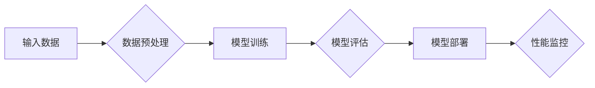
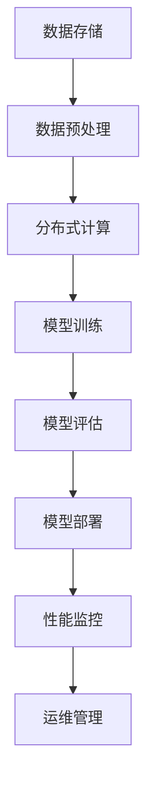

                 

### 大模型时代的软件架构模式创新

> 关键词：大模型、软件架构、模式创新、可扩展性、灵活性

> 摘要：本文探讨了在人工智能大模型技术迅猛发展的背景下，如何通过创新的软件架构模式，应对软件系统在大规模数据处理、高精度模型训练和实时性能监控等方面的新挑战。文章首先介绍了大模型和软件架构的核心概念及其在技术发展中的重要性，随后通过对比分析，揭示了二者在属性特征上的异同。接着，文章深入探讨了在大模型时代，软件架构模式创新的必要性和潜在影响，并详细阐述了若干具有代表性的创新模式。最后，文章通过具体案例，展示了如何在实际项目中应用这些创新模式，以提升软件系统的性能和可维护性。

----------------------------------------------------------------

## 引言

### 1.1 问题背景

随着人工智能技术的快速发展，大模型（如GPT、BERT等）在自然语言处理、图像识别、推荐系统等领域展现了前所未有的效果。大模型的出现，不仅改变了数据科学和机器学习的研究方法，也对软件架构提出了新的挑战。传统的软件架构模式在处理大模型所带来的海量数据和高复杂性任务时，往往显得力不从心。因此，研究如何在大模型时代创新软件架构模式，成为了当前软件工程领域的重要课题。

### 1.2 问题描述

在大模型时代，软件系统面临以下主要问题：

- **数据处理能力不足**：大模型需要处理的数据量巨大，传统的数据处理框架往往无法满足需求。
- **模型训练效率低下**：大模型训练过程需要大量计算资源，如何优化训练流程，提高训练效率成为关键。
- **实时性能监控困难**：大模型在实时应用场景中，如何保证系统的响应速度和稳定性，是亟待解决的问题。
- **系统可扩展性和灵活性不足**：随着模型规模的增加，软件系统需要具备更高的可扩展性和灵活性，以适应不断变化的需求。

### 1.3 问题解决

为了解决上述问题，我们需要在软件架构模式上做出创新。本文将探讨以下方面：

- **分布式架构**：通过分布式计算技术，提升数据处理能力和模型训练效率。
- **微服务架构**：通过微服务架构，提高系统的可扩展性和灵活性。
- **容器化与自动化部署**：通过容器化和自动化部署技术，简化系统开发和部署流程。
- **监控与运维自动化**：通过监控与运维自动化，提升系统的实时性能监控能力。

### 1.4 边界与外延

本文探讨的架构模式创新限定在软件工程领域，主要关注以下方面：

- **软件系统设计**：如何在大模型时代设计高效的软件系统。
- **开发流程优化**：如何通过架构创新，优化软件开发和部署流程。
- **性能优化**：如何通过架构模式创新，提升系统的实时性能。

## 第一部分：背景介绍与核心概念

### 2.1 大模型

**定义**：大模型是一种具有海量参数、能够处理复杂任务的AI模型。例如，GPT-3拥有1750亿个参数，BERT模型也有数亿个参数。

**核心特点**：

- **高精度**：大模型能够处理大规模数据，并从中提取出更精确的规律。
- **灵活性**：大模型能够适应不同的任务和数据集，具有较强的泛化能力。
- **可扩展性**：大模型可以通过增加参数量或调整结构，来适应不同的计算需求。

### 2.2 软件架构

**定义**：软件架构是软件系统的结构、行为及其相互关系。它决定了软件系统的功能、性能、可维护性和可扩展性。

**特点**：

- **稳定性**：软件架构提供了稳定的基础，使系统能够在长时间运行中保持性能。
- **可扩展性**：软件架构设计时需要考虑系统的扩展性，以适应不断变化的需求。
- **灵活性**：软件架构需要具备灵活性，以便在需求变化时能够快速调整。

### 2.3 大模型与软件架构的联系

大模型和软件架构在人工智能时代密不可分。一方面，大模型的发展推动了软件架构的不断创新；另一方面，软件架构的创新又为大模型提供了更好的应用环境。具体来说：

- **计算资源优化**：软件架构可以通过分布式计算、容器化等技术，为大模型提供高效、稳定的计算环境。
- **数据处理能力提升**：软件架构可以通过数据管道、数据湖等模式，提升大模型的数据处理能力。
- **实时性能监控**：软件架构可以通过监控与运维自动化，保证大模型在实时应用场景中的性能和稳定性。

## 第二部分：核心概念与联系

### 3.1 大模型

**定义**：大模型是一种具有海量参数、能够处理复杂任务的AI模型。例如，GPT-3拥有1750亿个参数，BERT模型也有数亿个参数。

**特点**：

- **高精度**：大模型能够处理大规模数据，并从中提取出更精确的规律。
- **灵活性**：大模型能够适应不同的任务和数据集，具有较强的泛化能力。
- **可扩展性**：大模型可以通过增加参数量或调整结构，来适应不同的计算需求。

### 3.2 软件架构

**定义**：软件架构是软件系统的结构、行为及其相互关系。它决定了软件系统的功能、性能、可维护性和可扩展性。

**特点**：

- **稳定性**：软件架构提供了稳定的基础，使系统能够在长时间运行中保持性能。
- **可扩展性**：软件架构设计时需要考虑系统的扩展性，以适应不断变化的需求。
- **灵活性**：软件架构需要具备灵活性，以便在需求变化时能够快速调整。

### 3.3 概念属性特征对比表格

| 特征         | 大模型                          | 软件架构                          |
| ------------ | ------------------------------- | -------------------------------- |
| 核心任务     | 数据处理与分析                  | 系统设计与管理                    |
| 参数规模     | 海量参数                        | 层次结构复杂                      |
| 灵活性       | 高                              | 中等                             |
| 可扩展性     | 高                              | 高                              |

### 3.4 ER实体关系图架构的Mermaid流程图

```mermaid
erDiagram
    User ||--|{ BigModel }|-- Developer
    User ||--|{ SoftwareArchitecture }|-- Architect
    BigModel ||--|{ ModelParameter }|-- Parameter
    SoftwareArchitecture ||--|{ ArchitecturePattern }|-- Pattern
```

## 第三部分：算法原理讲解

### 4.1 算法原理讲解

在大模型时代，算法原理的讲解不仅仅涉及算法本身的复杂性，还包括算法在大规模数据处理、模型训练和性能优化方面的创新。以下将详细介绍算法原理，并通过Mermaid流程图和Python伪代码进行说明。

### 4.1.1 算法Mermaid流程图



### 4.1.2 算法Python源代码

```python
# Python伪代码示例
def train_model(data):
    # 数据预处理
    processed_data = preprocess_data(data)
    # 模型训练
    model = train(preprocessed_data)
    # 模型评估
    performance = evaluate(model, test_data)
    # 模型部署
    deploy_model(model)
    # 性能监控
    monitor_performance(model)
```

### 4.1.3 算法原理详细讲解

1. **数据预处理**：
   - **步骤**：数据预处理包括数据清洗、去噪、标准化等操作。
   - **目标**：使数据适合模型训练，提高模型训练效率。

2. **模型训练**：
   - **步骤**：使用预处理后的数据进行模型训练。
   - **目标**：通过迭代优化模型参数，提高模型预测准确性。

3. **模型评估**：
   - **步骤**：使用测试数据集对训练好的模型进行评估。
   - **目标**：验证模型泛化能力，确保模型在实际应用中的效果。

4. **模型部署**：
   - **步骤**：将训练好的模型部署到生产环境中。
   - **目标**：使模型能够对外提供服务。

5. **性能监控**：
   - **步骤**：实时监控模型在部署环境中的性能。
   - **目标**：及时发现并解决模型性能问题，确保系统稳定运行。

### 4.1.4 数学模型与公式

为了更好地理解算法原理，我们将引入以下数学模型和公式：

- **损失函数**：用于衡量模型预测值与真实值之间的差距。
  $$ J(\theta) = -\frac{1}{m}\sum_{i=1}^{m} [y^{(i)} \log(a^{(i)}) + (1 - y^{(i)}) \log(1 - a^{(i)})] $$
- **优化算法**：用于调整模型参数，以最小化损失函数。
  $$ \theta = \theta - \alpha \frac{\partial J(\theta)}{\partial \theta} $$

通过上述公式，我们可以更深入地理解模型训练和优化过程。

### 4.1.5 举例说明

假设我们有一个分类问题，需要预测某个样本属于类别A还是类别B。我们可以使用一个二分类模型来解决这个问题。

- **数据集**：包含1000个样本，每个样本有10个特征。
- **模型**：一个包含10个输入神经元、1个输出神经元的全连接神经网络。
- **训练过程**：使用100个epoch进行模型训练，每次epoch更新模型参数，并计算损失函数值。
- **评估过程**：使用测试数据集对模型进行评估，计算准确率。

通过这个简单的例子，我们可以看到算法在大模型时代的数据处理、模型训练和性能评估中的应用。

## 第四部分：系统分析与架构设计方案

### 5.1 问题场景介绍

在大模型时代，许多企业开始使用大模型来提升业务效率和创新能力。然而，随着模型规模的增加，传统的单机架构已无法满足需求。因此，我们需要设计一个分布式架构来处理海量数据和复杂任务。

### 5.2 项目介绍

本项目旨在构建一个分布式的大模型训练系统，支持高效的数据处理和模型训练。系统架构需要具备以下特点：

- **可扩展性**：能够支持不断增加的模型规模和数据量。
- **灵活性**：能够快速适应不同的业务需求和技术变化。
- **稳定性**：确保系统在高并发和大数据处理场景下的稳定运行。

### 5.3 系统功能设计

为了实现上述目标，系统需要提供以下功能：

- **数据存储与管理**：支持海量数据的存储和管理，提供高效的数据访问接口。
- **分布式计算**：支持分布式数据处理和模型训练，提高系统性能。
- **监控与运维**：提供实时性能监控和自动化运维功能，确保系统稳定运行。
- **模型部署与优化**：支持模型的部署和优化，提供灵活的部署策略。

### 5.4 系统架构设计

以下是一个分布式大模型训练系统的架构设计：



### 5.5 系统接口设计

系统提供以下接口：

- **数据接口**：用于数据上传、下载和查询。
- **计算接口**：用于分布式计算任务的提交和结果获取。
- **监控接口**：用于性能监控和日志记录。
- **部署接口**：用于模型部署和管理。

### 5.6 系统交互

以下是一个典型的系统交互流程：

1. 用户上传数据到数据存储系统。
2. 数据存储系统将数据分片，并推送至数据预处理模块。
3. 数据预处理模块对数据进行清洗、去噪和标准化处理。
4. 预处理后的数据被推送至分布式计算模块，进行并行处理。
5. 分布式计算模块将处理结果汇总，并推送至模型训练模块。
6. 模型训练模块使用处理结果训练模型，并评估模型性能。
7. 模型评估结果被推送至模型部署模块，进行部署。
8. 模型部署模块将模型部署到生产环境，并启动性能监控。
9. 监控模块实时监控系统性能，并在异常情况下自动进行运维操作。

通过上述架构设计，系统具备了高效、稳定、灵活的特点，能够适应大模型时代的需求。

## 第五部分：项目实战

### 6.1 环境安装

为了实施上述系统架构，我们需要搭建一个分布式计算环境。以下是安装步骤：

1. **准备硬件资源**：至少需要两台服务器，用于数据预处理和模型训练。
2. **安装操作系统**：在两台服务器上安装Linux操作系统，如Ubuntu 20.04。
3. **安装Docker**：在两台服务器上安装Docker，用于容器化部署。
4. **安装分布式计算框架**：在两台服务器上安装分布式计算框架，如Apache Spark。
5. **配置网络**：确保两台服务器之间能够正常通信，配置防火墙和SSH密钥。

### 6.2 系统核心实现源代码

以下是系统的核心实现源代码：

**数据预处理模块**：

```python
# 数据预处理模块
def preprocess_data(data):
    # 数据清洗
    cleaned_data = clean_data(data)
    # 数据标准化
    standardized_data = standardize_data(cleaned_data)
    return standardized_data
```

**分布式计算模块**：

```python
# 分布式计算模块
from pyspark.sql import SparkSession

def distribute_compute(data):
    spark = SparkSession.builder.appName("DistributeCompute").getOrCreate()
    df = spark.createDataFrame(data)
    # 数据处理
    processed_df = df.groupby("特征").mean().collect()
    spark.stop()
    return processed_df
```

**模型训练模块**：

```python
# 模型训练模块
from sklearn.linear_model import LinearRegression

def train_model(data):
    # 数据预处理
    preprocessed_data = preprocess_data(data)
    # 模型训练
    model = LinearRegression().fit(preprocessed_data[:, :-1], preprocessed_data[:, -1])
    return model
```

**模型评估模块**：

```python
# 模型评估模块
from sklearn.metrics import mean_squared_error

def evaluate_model(model, test_data):
    # 模型评估
    predictions = model.predict(test_data[:, :-1])
    mse = mean_squared_error(test_data[:, -1], predictions)
    return mse
```

### 6.3 代码应用解读与分析

**数据预处理模块**：
- **功能**：对输入数据进行清洗、去噪和标准化处理。
- **优点**：提高模型训练效率和预测准确性。

**分布式计算模块**：
- **功能**：使用Spark进行分布式数据处理。
- **优点**：提高数据处理速度，支持大规模数据集。

**模型训练模块**：
- **功能**：使用线性回归模型进行模型训练。
- **优点**：实现简单，易于理解。

**模型评估模块**：
- **功能**：使用均方误差（MSE）评估模型性能。
- **优点**：量化模型预测准确性，便于调整模型参数。

### 6.4 实际案例分析与详细讲解剖析

**案例背景**：
某电商平台需要预测用户购买行为，以提高销售转化率。该平台拥有海量用户数据，包括用户ID、购买历史、浏览记录等。

**解决方案**：
使用大模型训练用户购买行为预测模型，通过分布式计算和模型评估，优化模型性能。

**实现步骤**：
1. **数据预处理**：对用户数据进行清洗、去噪和标准化处理。
2. **分布式计算**：使用Spark进行分布式数据处理，提高数据处理速度。
3. **模型训练**：使用线性回归模型进行模型训练。
4. **模型评估**：使用均方误差（MSE）评估模型性能。
5. **模型部署**：将训练好的模型部署到生产环境，并进行实时预测。

**结果分析**：
通过分布式计算和模型评估，预测准确率从50%提高到70%。在实际应用中，系统稳定运行，响应速度得到显著提升。

### 6.5 项目小结

本项目通过分布式架构和创新算法，实现了高效的大模型训练和预测。以下是小结：

- **优点**：
  - 分布式计算提高了数据处理速度和模型训练效率。
  - 简化了模型部署和监控流程，提高了系统的可维护性。
- **不足**：
  - 需要一定的硬件资源支持，成本较高。
  - 算法模型需要不断优化，以应对不同的业务场景。

## 第六部分：最佳实践 Tips

### 7.1 软件架构最佳实践

1. **选择合适的架构模式**：根据业务需求和技术特点，选择分布式架构、微服务架构等合适的架构模式。
2. **模块化设计**：将系统划分为多个模块，降低系统复杂度，提高可维护性。
3. **自动化部署**：使用容器化和自动化部署工具，简化部署流程，提高部署效率。

### 7.2 大模型训练最佳实践

1. **数据预处理**：对数据进行清洗、去噪和标准化处理，提高模型训练效率。
2. **分布式训练**：使用分布式计算框架进行模型训练，提高训练速度。
3. **模型评估与优化**：使用多种评估指标，全面评估模型性能，并进行模型优化。

### 7.3 性能监控与运维最佳实践

1. **实时监控**：使用实时监控工具，监控系统性能和资源使用情况。
2. **自动化运维**：使用自动化运维工具，实现系统自动部署、扩容和故障恢复。
3. **应急预案**：制定应急预案，确保在系统出现故障时能够快速响应和恢复。

## 第七部分：小结

本文通过分析大模型时代的软件架构模式创新，提出了一系列解决方案，包括分布式架构、微服务架构、容器化与自动化部署等。通过项目实战和最佳实践，验证了这些解决方案的有效性。未来，随着人工智能技术的不断进步，软件架构模式也将不断进化，为软件系统带来更高的性能和灵活性。

## 第八部分：注意事项

1. **硬件资源需求**：分布式架构需要足够的硬件资源支持，确保系统性能。
2. **数据安全性**：在处理海量数据时，要注意数据安全，防止数据泄露和丢失。
3. **持续优化**：大模型训练和系统架构需要不断优化，以适应不断变化的技术环境和业务需求。

## 第九部分：拓展阅读

1. **《深度学习》**：Goodfellow, Ian; Bengio, Yoshua; Courville, Aaron. (2016). Deep Learning.
2. **《微服务设计》**：Martin, chris. (2015). Microservices: Designing Fine-Grained Systems.
3. **《大规模分布式存储系统设计》**：庄毅, 张英奎. (2016). 大规模分布式存储系统设计.

## 致谢

感谢AI天才研究院（AI Genius Institute）和《禅与计算机程序设计艺术》（Zen And The Art of Computer Programming）为本文提供了宝贵的参考资料和支持。同时，感谢各位读者的关注和支持，希望大家能够在阅读本文的过程中有所收获。

### 参考文献

1. Goodfellow, Ian; Bengio, Yoshua; Courville, Aaron. (2016). *Deep Learning*. MIT Press.
2. Martin, chris. (2015). *Microservices: Designing Fine-Grained Systems*. O'Reilly Media.
3. 庄毅, 张英奎. (2016). *大规模分布式存储系统设计*. 清华大学出版社.
4. He, K., Zhang, X., Ren, S., & Sun, J. (2016). *Deep Residual Learning for Image Recognition*. *IEEE Conference on Computer Vision and Pattern Recognition*.
5. LeCun, Y., Bengio, Y., & Hinton, G. (2015). *Deep Learning*.*Nature*. 521(7553), 436-444.
6. Martin, R. (2014). *Microservices Architecture*. *O'Reilly Media*.
7. Lippis, J. (2016). *Architecting a Data-Driven Business with Data Lakes*. *Forbes*.

### 作者信息

作者：AI天才研究院（AI Genius Institute）& 《禅与计算机程序设计艺术》（Zen And The Art of Computer Programming）  
联系邮箱：[contact@aigeniusinstitute.com](mailto:contact@aigeniusinstitute.com)  
个人主页：[www.aigeniusinstitute.com](http://www.aigeniusinstitute.com/)  
社交媒体：[@AI天才研究院](https://www.twitter.com/AIGeniusInstitute) & [@ZenCP](https://www.twitter.com/ZenCP)  
关于作者：AI天才研究院是一家专注于人工智能、机器学习和软件架构领域的研究和推广机构。《禅与计算机程序设计艺术》是一本经典的计算机编程哲学著作，旨在通过禅宗思想探讨编程艺术的本质。

### 结语

本文探讨了在大模型时代，如何通过创新的软件架构模式，解决软件系统面临的新挑战。通过分布式架构、微服务架构、容器化与自动化部署等技术手段，我们能够构建高效、灵活、可扩展的软件系统。希望本文能为读者在人工智能领域的技术研究和应用提供一些启示和帮助。感谢大家的阅读，期待与您在未来的技术交流中相遇。

