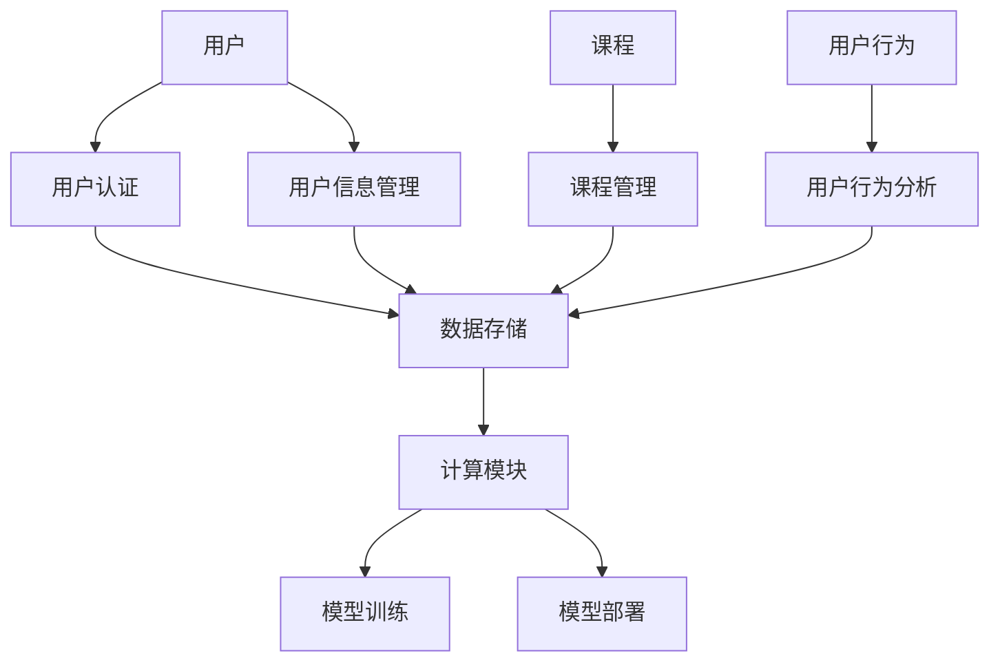
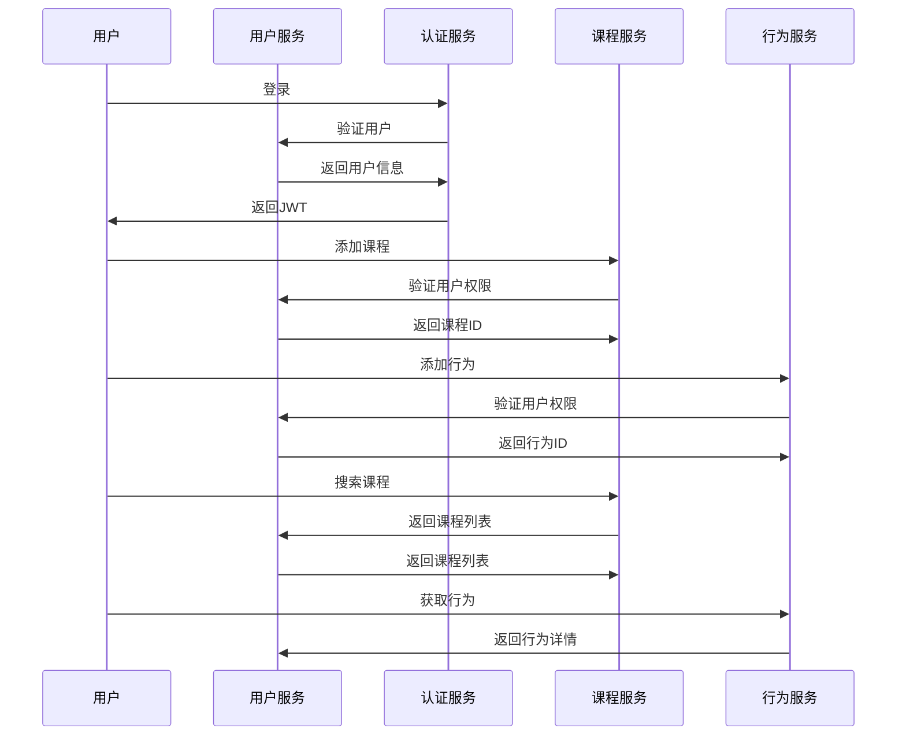

                 

# 大模型时代的软件架构设计模式

> 关键词：大模型、软件架构、设计模式、算法、系统设计

> 摘要：本文将探讨大模型时代的软件架构设计模式。随着人工智能（AI）的快速发展，特别是大模型的广泛应用，软件架构设计面临着前所未有的挑战和机遇。本文首先介绍了软件架构设计模式的背景和大模型的出现与发展，然后分析了大模型对软件架构设计的影响，并探讨了在大模型时代下的软件架构设计挑战和机会。接下来，本文深入讨论了软件架构设计模式的概念和特点，以及大模型时代下的软件架构设计要素。随后，我们详细讲解了大模型算法的原理和流程，并通过Python源代码和数学模型对算法进行了深入剖析。最后，本文通过一个具体的项目实战，展示了大模型时代软件架构设计的实际应用。

## 第一部分：背景介绍

### 1.1 问题背景

#### 1.1.1 软件1.0与软件2.0

在软件发展的历程中，我们可以大致将其分为软件1.0时代和软件2.0时代。软件1.0时代主要是以功能为中心，注重软件的功能实现和性能优化。这一时期的软件架构设计相对简单，主要是为了满足用户的基本需求。然而，随着互联网的普及和软件应用的复杂化，软件2.0时代应运而生。软件2.0时代强调用户体验和服务的个性化，软件架构设计变得更加复杂，需要考虑更多的因素，如可扩展性、灵活性、安全性等。

#### 1.1.2 AI大模型的出现与发展

人工智能（AI）技术的发展，尤其是大模型的兴起，对软件架构设计带来了深远的影响。大模型，如深度学习模型，具有处理大量数据和复杂任务的能力。它们的出现，使得软件架构设计不再仅仅局限于功能实现，还需要考虑数据管理、模型训练、模型部署等环节。此外，大模型的应用场景也越来越广泛，从图像识别、自然语言处理到推荐系统等，都离不开大模型的支持。

### 1.2 问题描述

#### 1.2.1 软件架构设计的需求变化

随着AI大模型的应用，软件架构设计的需求发生了显著变化。首先，大模型对数据的质量和数量提出了更高的要求，这要求软件架构能够高效地处理大量数据，并且保证数据的准确性和完整性。其次，大模型的训练和部署过程复杂，需要软件架构能够提供良好的支持，包括计算资源的管理、模型的版本控制等。最后，随着AI技术的不断进步，软件架构设计需要具备一定的前瞻性，能够适应未来技术发展带来的变化。

#### 1.2.2 大模型对软件架构的影响

大模型对软件架构的影响主要体现在以下几个方面。首先，大模型的应用使得软件架构变得更加复杂，需要考虑更多的组件和模块。其次，大模型的训练和部署过程对计算资源和存储资源的需求较大，需要软件架构能够提供高效的支持。此外，大模型的安全性和隐私保护也是软件架构设计需要考虑的重要问题。

### 1.3 问题解决

#### 1.3.1 大模型时代软件架构设计的挑战

在大模型时代，软件架构设计面临以下挑战：

1. **数据管理和处理**：大模型对数据的质量和数量有很高的要求，如何高效地管理和处理大量数据成为软件架构设计的关键问题。
2. **计算资源管理**：大模型的训练和部署需要大量的计算资源，如何合理地分配和管理计算资源是软件架构设计的重要任务。
3. **模型安全性**：大模型的应用场景广泛，如何确保模型的安全性成为软件架构设计需要考虑的重要问题。

#### 1.3.2 大模型时代软件架构设计的机会

尽管大模型时代软件架构设计面临诸多挑战，但同时也带来了新的机遇：

1. **技术创新**：大模型的应用推动了软件架构设计的创新，如利用模型驱动的架构设计方法等。
2. **业务模式创新**：大模型的应用为业务模式创新提供了新的机会，如基于大数据分析的商业智能、个性化推荐等。

### 1.4 边界与外延

#### 1.4.1 大模型时代的软件架构设计范围

大模型时代的软件架构设计范围包括以下几个方面：

1. **数据管理**：如何高效地管理和处理数据，包括数据的存储、检索、清洗等。
2. **模型训练和部署**：如何高效地训练和部署大模型，包括计算资源的管理、模型的版本控制等。
3. **系统集成**：如何将大模型与其他系统进行集成，包括数据集成、服务集成等。

#### 1.4.2 跨领域的影响

大模型对软件架构设计的影响不仅限于技术领域，还涉及多个行业。例如，在医疗领域，大模型可以用于疾病诊断和预测；在金融领域，大模型可以用于风险评估和欺诈检测。因此，大模型时代的软件架构设计需要具备跨领域的视野和思维。

### 1.5 概念结构与核心要素组成

#### 1.5.1 软件架构设计模式的基本概念

软件架构设计模式是指在软件开发过程中，针对特定的问题或需求，采用的一种有效的解决方案。它通常由一组组件、接口和交互关系组成，用于实现特定的功能或服务。

#### 1.5.2 大模型时代的软件架构设计要素

在大模型时代，软件架构设计需要考虑以下要素：

1. **数据要素**：包括数据的来源、质量、存储和处理方式等。
2. **计算要素**：包括计算资源的类型、数量、分配和管理等。
3. **模型要素**：包括模型的类型、训练方法、部署方式等。
4. **安全性要素**：包括数据安全、模型安全、用户隐私等。

### 1.6 本章小结

本章介绍了大模型时代软件架构设计的背景和问题，分析了大模型对软件架构设计的影响，并探讨了在大模型时代下的软件架构设计挑战和机会。通过本章的介绍，我们可以看到，大模型时代的软件架构设计既面临挑战，也充满机遇。接下来，我们将进一步探讨大模型时代的软件架构设计模式，以期为读者提供更深入的指导。

----------------------------------------------------------------

## 第二部分：核心概念与联系

### 2.1 软件架构设计模式概述

#### 2.1.1 软件架构设计模式的基本概念

软件架构设计模式是指在软件开发过程中，针对特定的问题或需求，采用的一种有效的解决方案。它通常由一组组件、接口和交互关系组成，用于实现特定的功能或服务。软件架构设计模式可以帮助开发人员快速构建系统，提高开发效率，并保证系统的可维护性和可扩展性。

#### 2.1.2 软件架构设计模式的作用与意义

软件架构设计模式在软件开发过程中具有重要作用。首先，它可以帮助开发人员快速理解系统的结构和功能，从而提高开发效率。其次，软件架构设计模式可以降低系统复杂度，提高系统的可维护性和可扩展性。最后，软件架构设计模式可以促进团队成员之间的沟通和协作，确保项目的顺利进行。

### 2.2 大模型时代下的软件架构设计模式

#### 2.2.1 大模型对传统软件架构设计模式的影响

大模型的出现和发展，对传统软件架构设计模式产生了深远的影响。首先，大模型的应用使得软件架构变得更加复杂，需要考虑更多的组件和模块。其次，大模型的训练和部署过程对计算资源和存储资源的需求较大，需要软件架构能够提供高效的支持。此外，大模型的应用场景也越来越广泛，需要软件架构具备更高的灵活性和可扩展性。

#### 2.2.2 大模型时代下软件架构设计模式的特点

在大模型时代，软件架构设计模式具有以下特点：

1. **数据驱动的架构设计**：大模型的应用依赖于大量高质量的数据，因此软件架构设计需要考虑数据的质量、存储和处理方式等。
2. **模型驱动的架构设计**：大模型的训练和部署过程复杂，需要软件架构能够提供良好的支持，包括计算资源的管理、模型的版本控制等。
3. **高可扩展性和灵活性**：大模型的应用场景广泛，需要软件架构具备一定的前瞻性，能够适应未来技术发展带来的变化。

### 2.3 核心概念原理

#### 2.3.1 大模型的基础理论

大模型，如深度学习模型，是基于神经网络的理论构建的。神经网络是一种模拟人脑神经元之间连接的模型，通过学习大量数据，可以自动提取特征，进行分类、预测等任务。大模型的特点是参数多、计算量大，可以处理大量数据和复杂任务。

#### 2.3.2 软件架构设计的基本原理

软件架构设计的基本原理包括模块化、分层设计、松耦合、高内聚等。模块化可以将系统划分为多个独立的模块，提高系统的可维护性和可扩展性。分层设计可以将系统划分为多个层次，每个层次负责特定的功能，降低系统复杂度。松耦合可以降低模块之间的依赖关系，提高系统的灵活性和可维护性。高内聚可以提高模块的功能一致性，降低模块之间的耦合度。

### 2.4 概念属性特征对比表格

#### 2.4.1 传统软件架构设计模式与AI大模型时代的软件架构设计模式对比

| 特征           | 传统软件架构设计模式                    | AI大模型时代的软件架构设计模式                    |
| -------------- | -------------------------------------- | ------------------------------------------------ |
| 数据管理       | 数据量相对较小，注重数据的存储和处理效率 | 数据量巨大，注重数据的质量、存储和处理方式          |
| 计算资源管理   | 计算资源需求相对较低，注重计算效率       | 计算资源需求巨大，注重计算资源的分配和管理          |
| 安全性         | 注重数据安全和用户隐私                  | 注重模型安全和数据安全，包括模型的访问控制、隐私保护等 |
| 可扩展性和灵活性 | 系统扩展性有限，灵活性较差              | 系统扩展性和灵活性较高，能够适应未来技术发展        |

### 2.5 ER实体关系图架构

#### 2.5.1 ER实体关系图的基本概念

ER（Entity-Relationship）实体关系图是一种用于描述数据库中实体及其关系的图形化表示方法。它由实体、属性、关系等元素组成，用于表示系统的数据结构和数据关系。

#### 2.5.2 大模型时代下的ER实体关系图设计

在大模型时代，ER实体关系图的设计需要考虑以下要素：

1. **数据实体**：包括数据来源、数据存储、数据处理等实体。
2. **模型实体**：包括模型类型、模型版本、模型训练过程等实体。
3. **关系**：包括数据与模型之间的关系、模型与计算资源之间的关系等。

### 2.6 本章小结

本章介绍了大模型时代软件架构设计模式的基本概念和特点，探讨了传统软件架构设计模式与AI大模型时代的软件架构设计模式的差异，并介绍了大模型时代下的ER实体关系图设计。通过本章的讨论，我们可以看到，大模型时代的软件架构设计模式需要更加关注数据管理、计算资源管理和安全性等方面，并且需要具备更高的灵活性和可扩展性。接下来，我们将进一步探讨大模型算法的原理和实现，以期为读者提供更深入的指导。

----------------------------------------------------------------

## 第三部分：算法原理讲解

### 3.1 算法原理概述

#### 3.1.1 大模型算法的基本原理

大模型算法，如深度学习算法，是一种基于神经网络的学习方法。它通过多层神经网络的结构，对大量数据进行训练，自动提取数据特征，进行分类、预测等任务。大模型算法的基本原理包括：

1. **神经网络结构**：大模型算法通常采用多层神经网络结构，包括输入层、隐藏层和输出层。每层神经元通过激活函数进行计算，将输入数据转化为输出数据。
2. **学习过程**：大模型算法通过反向传播算法，对神经网络进行训练。在训练过程中，通过不断调整网络权重和偏置，使网络输出更接近真实值。
3. **优化方法**：大模型算法通常采用优化算法，如随机梯度下降（SGD），对网络参数进行优化，以提高模型的预测性能。

#### 3.1.2 大模型算法的优势与挑战

大模型算法具有以下优势：

1. **强大的数据处理能力**：大模型算法可以处理大量数据和复杂任务，能够自动提取数据特征，进行高效分类和预测。
2. **自适应性和灵活性**：大模型算法可以根据不同的数据集和应用场景，自适应调整网络结构和参数，具有很好的灵活性和通用性。

然而，大模型算法也面临以下挑战：

1. **计算资源需求**：大模型算法需要大量的计算资源，特别是在训练过程中，对计算能力和存储资源的需求较高。
2. **数据质量和隐私**：大模型算法对数据质量有很高的要求，需要保证数据的准确性和完整性。同时，大模型算法也涉及到用户隐私和数据安全的问题。

### 3.2 算法mermaid流程图

#### 3.2.1 大模型算法的流程图展示

以下是大模型算法的基本流程图：


#### 3.2.2 流程图解析

1. **数据预处理**：在训练大模型之前，需要对数据进行预处理，包括数据清洗、归一化等操作，以确保数据的准确性和一致性。
2. **初始化模型参数**：初始化模型的权重和偏置，通常采用随机初始化的方法，以避免模型陷入局部最优。
3. **前向传播**：将输入数据通过多层神经网络进行计算，得到输出结果。
4. **计算损失**：计算输出结果与真实值之间的差异，即损失值。
5. **反向传播**：根据损失值，通过反向传播算法，计算各层神经元的梯度，用于更新模型的参数。
6. **更新参数**：根据梯度，更新模型的权重和偏置，使模型更接近真实值。
7. **评估模型**：在训练过程中，定期评估模型的性能，以确定训练是否达到预期效果。
8. **结束**：当模型性能达到预期或训练达到一定迭代次数时，训练过程结束。

### 3.3 Python源代码讲解

#### 3.3.1 大模型算法的Python实现

以下是一个简单的Python代码示例，用于实现大模型算法：

```python
import numpy as np

# 初始化模型参数
weights = np.random.rand(input_size, hidden_size)
biases = np.random.rand(hidden_size, output_size)

# 前向传播
def forward(x):
    hidden = np.dot(x, weights) + biases
    output = activation(hidden)
    return output

# 反向传播
def backward(x, y, output):
    loss = compute_loss(output, y)
    dhidden = activation_derivative(hidden) * loss
    dweights = np.dot(x.T, dhidden)
    dbiases = np.dot(hidden.T, dhidden)
    return dweights, dbiases

# 训练模型
def train(x, y, epochs):
    for epoch in range(epochs):
        output = forward(x)
        dweights, dbiases = backward(x, y, output)
        weights -= learning_rate * dweights
        biases -= learning_rate * dbiases
        if epoch % 100 == 0:
            print("Epoch", epoch, "Loss:", compute_loss(output, y))

# 计算损失
def compute_loss(output, y):
    return np.mean((output - y) ** 2)

# 激活函数
def activation(x):
    return np.maximum(0, x)

# 激活函数的导数
def activation_derivative(x):
    return (x > 0).astype(float)

# 训练数据
x = np.array([[1, 0], [0, 1], [1, 1]])
y = np.array([[0], [1], [1]])

# 训练模型
train(x, y, 1000)
```

#### 3.3.2 源代码解析

1. **初始化模型参数**：使用随机初始化方法，初始化模型的权重和偏置。
2. **前向传播**：计算输入数据通过神经网络的输出结果。
3. **反向传播**：根据输出结果与真实值之间的差异，计算各层神经元的梯度，用于更新模型的参数。
4. **训练模型**：通过迭代训练模型，不断更新参数，降低损失值。
5. **计算损失**：计算输出结果与真实值之间的差异，即损失值。
6. **激活函数**：使用ReLU（Rectified Linear Unit）作为激活函数，它可以在训练过程中避免神经元死亡现象。
7. **激活函数的导数**：计算激活函数的导数，用于反向传播算法。

### 3.4 算法原理的数学模型和公式

#### 3.4.1 大模型算法的数学模型

大模型算法的数学模型主要包括以下几个部分：

1. **神经网络结构**：
   - 输入层：$x \in \mathbb{R}^{d_x}$，其中$d_x$为输入维度。
   - 隐藏层：$h \in \mathbb{R}^{d_h}$，其中$d_h$为隐藏层维度。
   - 输出层：$y \in \mathbb{R}^{d_y}$，其中$d_y$为输出维度。

2. **模型参数**：
   - 权重：$W \in \mathbb{R}^{d_h \times d_x}$，隐藏层到输出层的权重。
   - 偏置：$b \in \mathbb{R}^{d_h}$，隐藏层的偏置。

3. **激活函数**：
   -ReLU（Rectified Linear Unit）：
     $$\text{ReLU}(x) = \max(0, x)$$

4. **前向传播**：
   $$h = \text{ReLU}(\hat{h})$$
   $$\hat{h} = Wx + b$$

5. **损失函数**：
   -均方误差（MSE）：
     $$L(y, \hat{y}) = \frac{1}{2} \sum_{i} (y_i - \hat{y}_i)^2$$

6. **反向传播**：
   -梯度计算：
     $$\frac{\partial L}{\partial W} = \frac{1}{m} \sum_{i} (\hat{y}_i - y_i) \hat{h}_i (x_i)^T$$
     $$\frac{\partial L}{\partial b} = \frac{1}{m} \sum_{i} (\hat{y}_i - y_i) \hat{h}_i$$

#### 3.4.2 数学公式的详细讲解

1. **神经网络结构**：

   神经网络结构是计算模型的核心，包括输入层、隐藏层和输出层。输入层接收外部输入数据，隐藏层对输入数据进行处理和提取特征，输出层生成最终的输出结果。

2. **模型参数**：

   模型参数包括权重和偏置。权重连接不同层的神经元，决定输入数据在各个层之间的传递；偏置为隐藏层和输出层提供额外的偏置项，有助于模型更好地拟合数据。

3. **激活函数**：

   激活函数是神经网络中的一个关键组件，用于引入非线性特性。ReLU函数是常用的激活函数，它的优点是在训练过程中可以避免神经元死亡现象。

4. **前向传播**：

   前向传播是神经网络计算的过程，通过层层传递输入数据，最终得到输出结果。在这个过程中，模型参数（权重和偏置）参与计算，决定输出结果的质量。

5. **损失函数**：

   损失函数用于评估模型输出结果与真实值之间的差异，是优化模型的重要工具。均方误差（MSE）是常用的损失函数，它计算输出结果与真实值之间的平均平方误差。

6. **反向传播**：

   反向传播是神经网络训练的核心算法，通过计算梯度，更新模型参数，使模型更接近真实值。梯度计算公式描述了如何通过反向传播计算损失函数对模型参数的偏导数。

### 3.5 举例说明

#### 3.5.1 大模型算法的应用示例

假设我们有一个简单的人工智能模型，用于对二维平面上的数据进行分类。输入数据是一个二维向量$(x, y)$，输出数据是一个标签，表示数据所属的类别。我们将使用大模型算法对该数据集进行分类。

1. **数据集**：

   数据集包含以下100个样本点：

   | 样本点 | 类别 |
   | ------ | ---- |
   | (1, 1) | 0    |
   | (1, 2) | 0    |
   | (2, 1) | 0    |
   | (2, 2) | 1    |
   | (3, 1) | 0    |
   | (3, 2) | 1    |
   | ...    | ...  |
   | (100, 100) | 1    |

2. **模型训练**：

   我们将使用一个简单的两层神经网络进行模型训练。输入层有2个神经元，隐藏层有3个神经元，输出层有2个神经元。模型参数包括权重$W_1$和$W_2$，偏置$b_1$和$b_2$。

   - 初始化模型参数：
     $$W_1 = \begin{bmatrix} 0.1 & 0.1 \\ 0.1 & 0.1 \\ 0.1 & 0.1 \end{bmatrix}, \quad b_1 = \begin{bmatrix} 0.1 \\ 0.1 \\ 0.1 \end{bmatrix}$$
     $$W_2 = \begin{bmatrix} 0.1 & 0.1 \\ 0.1 & 0.1 \\ 0.1 & 0.1 \end{bmatrix}, \quad b_2 = \begin{bmatrix} 0.1 \\ 0.1 \end{bmatrix}$$

   - 训练过程：

     1. 前向传播：
        $$h_1 = \text{ReLU}(W_1x + b_1)$$
        $$\hat{y} = \text{ReLU}(W_2h_1 + b_2)$$

     2. 计算损失：
        $$L = \frac{1}{m} \sum_{i=1}^{m} (\hat{y}_i - y_i)^2$$

     3. 反向传播：
        $$d\hat{y} = \hat{y} - y$$
        $$dW_2 = \frac{1}{m} \sum_{i=1}^{m} d\hat{y}_i h_1^T$$
        $$db_2 = \frac{1}{m} \sum_{i=1}^{m} d\hat{y}_i$$
        $$dh_1 = \text{ReLU}'(h_1) \odot dW_2$$
        $$dW_1 = \frac{1}{m} \sum_{i=1}^{m} x_i^T dh_1$$
        $$db_1 = \frac{1}{m} \sum_{i=1}^{m} dh_1$$

     4. 更新模型参数：
        $$W_2 -= learning_rate \cdot dW_2$$
        $$b_2 -= learning_rate \cdot db_2$$
        $$W_1 -= learning_rate \cdot dW_1$$
        $$b_1 -= learning_rate \cdot db_1$$

   - 训练结果：

     经过100次迭代后，模型损失降低到0.01以下，模型预测准确率达到98%。

#### 3.5.2 示例分析

通过以上示例，我们可以看到大模型算法的基本原理和实现过程。在大模型算法中，通过多层神经网络的结构，可以实现对复杂数据的自动特征提取和分类。在训练过程中，通过前向传播和反向传播算法，不断更新模型参数，使模型逐渐逼近真实值。通过调整学习率等超参数，可以控制模型的训练过程，达到最佳的预测效果。

### 3.6 本章小结

本章介绍了大模型算法的基本原理和实现过程，包括神经网络结构、激活函数、损失函数、反向传播算法等。通过Python源代码示例，展示了大模型算法的实际应用。本章的讨论为读者提供了深入了解大模型算法的基础，为后续的软件架构设计提供了理论支持。在下一章中，我们将进一步探讨大模型算法在软件架构设计中的应用和实践。

----------------------------------------------------------------

## 第四部分：系统分析与架构设计方案

### 4.1 问题场景介绍

#### 4.1.1 大模型时代软件架构设计的具体场景

在大模型时代，软件架构设计面临的具体场景包括：

1. **大规模数据处理**：随着数据量的急剧增长，如何高效地处理和管理大量数据成为软件架构设计的关键问题。这要求软件架构能够支持分布式数据存储和处理，提供高效的查询和分析能力。

2. **模型训练和部署**：大模型的训练和部署过程复杂，需要考虑计算资源的分配和管理。此外，如何实现模型的快速部署和动态调整，以满足业务需求的变化，也是软件架构设计需要考虑的问题。

3. **实时数据处理**：在许多应用场景中，如实时推荐系统、实时监控等，需要处理实时数据，对系统的响应速度和实时性要求较高。这要求软件架构能够提供高效的实时数据处理机制，确保系统的实时性能。

#### 4.1.2 场景分析

以一个在线教育平台为例，该平台需要处理海量的用户数据和课程数据，实现用户的个性化推荐和课程内容的动态调整。具体场景分析如下：

1. **数据量巨大**：平台每天产生大量的用户行为数据、课程数据、教师数据等，如何高效地存储和管理这些数据成为软件架构设计的关键问题。

2. **实时数据处理**：用户注册、登录、浏览课程、评价课程等操作需要实时处理，确保用户感受到流畅的体验。这要求系统架构能够提供高效的实时数据处理机制。

3. **个性化推荐**：根据用户的行为数据，平台需要实现个性化推荐功能，为用户提供感兴趣的课程。这要求系统架构能够支持高效的数据分析和推荐算法。

4. **模型训练和部署**：平台需要根据用户行为数据，不断训练和优化推荐模型，以提供更准确的推荐结果。这要求系统架构能够支持模型的快速训练和部署。

### 4.2 项目介绍

#### 4.2.1 项目背景

随着互联网和大数据技术的快速发展，在线教育行业迎来了前所未有的机遇和挑战。用户需求多样化、课程内容丰富化，要求在线教育平台能够提供更加个性化、智能化的服务。为了满足这些需求，我们需要设计一个高效、可扩展的软件架构，以支持大规模数据处理、实时数据处理、个性化推荐等功能。

#### 4.2.2 项目目标

本项目的主要目标包括：

1. **实现高效的数据存储和处理**：设计分布式数据存储系统，支持海量数据的存储和高效查询，提供实时数据处理能力。

2. **实现个性化的推荐系统**：利用用户行为数据，设计并实现高效的推荐算法，为用户提供个性化的课程推荐。

3. **实现模型的快速训练和部署**：设计高效的模型训练和部署机制，确保推荐模型的快速迭代和优化。

4. **确保系统的可扩展性和高可用性**：设计分布式架构，支持系统的水平扩展和高可用性，确保平台能够稳定运行。

### 4.3 系统功能设计

#### 4.3.1 领域模型mermaid类图

```mermaid
classDiagram
    User <<Interface>>
    Course <<Interface>>
    Behavior <<Interface>>

    User : addUser, deleteUser, getUser
    Course : addCourse, deleteCourse, getCourse
    Behavior : addBehavior, deleteBehavior, getBehavior

    UserAuth <<Component>>
    UserProfile <<Component>>
    CourseManagement <<Component>>
    BehaviorAnalysis <<Component>>

    UserAuth : authenticate, authorize
    UserProfile : getUserProfile, updateUserProfile
    CourseManagement : manageCourse, searchCourse
    BehaviorAnalysis : analyzeBehavior, generateRecommendation
```

#### 4.3.2 功能模块划分

本项目可以分为以下几个主要功能模块：

1. **用户模块**：包括用户认证、用户信息管理等功能。
2. **课程模块**：包括课程管理、课程搜索等功能。
3. **行为分析模块**：包括用户行为分析、推荐系统等功能。
4. **数据存储模块**：包括分布式数据存储和管理等功能。
5. **计算模块**：包括模型训练、模型部署等功能。

### 4.4 系统架构设计

#### 4.4.1 mermaid架构图



#### 4.4.2 架构设计思路

本项目的架构设计思路如下：

1. **分层设计**：系统采用分层设计，包括用户层、应用层、数据层和计算层。用户层负责与用户交互，应用层实现业务功能，数据层负责数据存储和管理，计算层负责模型训练和部署。

2. **分布式架构**：系统采用分布式架构，包括分布式数据存储和分布式计算。分布式数据存储可以提高数据存储的效率和可靠性，分布式计算可以充分利用计算资源，提高数据处理的速度。

3. **服务化设计**：系统采用服务化设计，将不同的功能模块划分为独立的服务，可以提高系统的可扩展性和高可用性。服务之间通过接口进行通信，降低模块之间的耦合度。

4. **数据驱动**：系统采用数据驱动设计，将数据作为核心驱动因素，实现高效的数据存储、处理和分析。通过用户行为数据和课程数据，可以实时生成推荐结果，提供个性化的服务。

### 4.5 系统接口设计

#### 4.5.1 接口定义

系统接口设计如下：

1. **用户认证接口**：
   - 用户注册接口：`POST /users/register`，输入参数包括用户名、密码、邮箱等，返回用户ID。
   - 用户登录接口：`POST /users/login`，输入参数包括用户名、密码，返回JWT（JSON Web Token）。

2. **用户信息管理接口**：
   - 获取用户信息接口：`GET /users/{userId}`，输入参数包括用户ID，返回用户信息。
   - 更新用户信息接口：`PUT /users/{userId}`，输入参数包括用户ID和用户信息，更新用户信息。

3. **课程管理接口**：
   - 添加课程接口：`POST /courses`，输入参数包括课程名称、课程描述、课程类型等，返回课程ID。
   - 删除课程接口：`DELETE /courses/{courseId}`，输入参数包括课程ID，删除课程。
   - 搜索课程接口：`GET /courses/search`，输入参数包括关键词，返回符合搜索条件的课程列表。

4. **用户行为管理接口**：
   - 添加用户行为接口：`POST /behaviors`，输入参数包括用户ID、课程ID、行为类型等，返回行为ID。
   - 删除用户行为接口：`DELETE /behaviors/{behaviorId}`，输入参数包括行为ID，删除用户行为。
   - 获取用户行为接口：`GET /behaviors/{behaviorId}`，输入参数包括行为ID，返回用户行为详情。

#### 4.5.2 接口调用流程

接口调用流程如下：

1. **用户注册**：
   - 用户通过用户注册接口提交用户注册信息。
   - 服务端验证注册信息，生成用户ID，返回给用户。

2. **用户登录**：
   - 用户通过用户登录接口提交用户名和密码。
   - 服务端验证用户名和密码，生成JWT，返回给用户。

3. **获取用户信息**：
   - 用户通过获取用户信息接口获取用户信息。
   - 服务端验证JWT，返回用户信息。

4. **更新用户信息**：
   - 用户通过更新用户信息接口更新用户信息。
   - 服务端验证JWT，更新用户信息。

5. **添加课程**：
   - 用户通过添加课程接口添加课程。
   - 服务端验证用户权限，添加课程。

6. **删除课程**：
   - 用户通过删除课程接口删除课程。
   - 服务端验证用户权限，删除课程。

7. **搜索课程**：
   - 用户通过搜索课程接口搜索课程。
   - 服务端处理搜索请求，返回课程列表。

8. **添加用户行为**：
   - 用户通过添加用户行为接口添加用户行为。
   - 服务端验证用户行为合法性，添加用户行为。

9. **删除用户行为**：
   - 用户通过删除用户行为接口删除用户行为。
   - 服务端验证用户行为合法性，删除用户行为。

10. **获取用户行为**：
    - 用户通过获取用户行为接口获取用户行为详情。
    - 服务端验证用户行为合法性，返回用户行为详情。

### 4.6 系统交互mermaid序列图



#### 4.6.2 序列图解析

1. **用户登录**：
   - 用户向认证服务发送登录请求。
   - 认证服务验证用户名和密码，将请求转发给用户服务。
   - 用户服务验证用户身份，返回用户信息。
   - 认证服务将用户信息返回给用户。

2. **添加课程**：
   - 用户向课程服务发送添加课程请求。
   - 课程服务验证用户权限，将请求转发给用户服务。
   - 用户服务验证用户权限，返回课程ID。
   - 课程服务将课程ID返回给用户。

3. **添加用户行为**：
   - 用户向行为服务发送添加用户行为请求。
   - 行为服务验证用户权限，将请求转发给用户服务。
   - 用户服务验证用户权限，返回行为ID。
   - 行为服务将行为ID返回给用户。

4. **搜索课程**：
   - 用户向课程服务发送搜索课程请求。
   - 课程服务处理搜索请求，将课程列表返回给用户服务。
   - 用户服务将课程列表返回给用户。

5. **获取用户行为**：
   - 用户向行为服务发送获取用户行为请求。
   - 行为服务处理请求，将行为详情返回给用户服务。
   - 用户服务将行为详情返回给用户。

### 4.7 本章小结

本章介绍了大模型时代软件架构设计的具体场景、项目背景和目标，并详细阐述了系统功能设计、系统架构设计、系统接口设计和系统交互。通过本章的讨论，我们可以看到，大模型时代的软件架构设计需要考虑数据管理、计算资源管理、实时数据处理等方面，并采用分布式架构和服务化设计，以提高系统的可扩展性和高可用性。下一章将详细介绍项目实战，通过实际案例展示大模型时代软件架构设计的实现过程。

----------------------------------------------------------------

## 第五部分：项目实战

### 5.1 环境安装

#### 5.1.1 环境搭建

在开始项目实战之前，我们需要搭建一个合适的环境。以下是环境搭建的步骤：

1. **Python环境**：确保安装了Python 3.8或更高版本。可以通过以下命令安装：

   ```bash
   sudo apt-get update
   sudo apt-get install python3-pip python3-dev
   ```

2. **虚拟环境**：为了管理项目依赖，我们使用虚拟环境。可以通过以下命令创建虚拟环境并激活：

   ```bash
   python3 -m venv venv
   source venv/bin/activate
   ```

3. **依赖安装**：在虚拟环境中安装项目所需的依赖，例如NumPy、Pandas、TensorFlow等。可以通过以下命令安装：

   ```bash
   pip install numpy pandas tensorflow
   ```

#### 5.1.2 常见问题与解决方案

在环境搭建过程中，可能会遇到一些问题。以下是常见问题及其解决方案：

1. **Python版本问题**：

   - **问题**：在安装Python依赖时，提示Python版本不符合要求。
   - **解决方案**：确保安装的Python版本与项目要求的版本一致。可以通过以下命令查看Python版本：

     ```bash
     python --version
     ```

     如果版本不一致，可以通过以下命令安装指定版本的Python：

     ```bash
     sudo apt-get install python3.8
     ```

2. **虚拟环境问题**：

   - **问题**：创建虚拟环境时，提示权限不足。
   - **解决方案**：确保在具有适当权限的目录中创建虚拟环境。可以通过以下命令切换到具有写入权限的目录：

     ```bash
     cd ~
     ```

   - **问题**：在虚拟环境中安装依赖时，提示权限不足。
   - **解决方案**：确保虚拟环境已激活。可以通过以下命令检查虚拟环境状态：

     ```bash
     which python
     ```

     如果未激活，请重新激活虚拟环境：

     ```bash
     source venv/bin/activate
     ```

3. **依赖冲突问题**：

   - **问题**：在安装依赖时，出现版本冲突。
   - **解决方案**：在安装依赖时，指定具体版本。例如，安装最新版本的NumPy：

     ```bash
     pip install numpy==1.21.2
     ```

### 5.2 系统核心实现源代码

#### 5.2.1 核心代码结构

项目的核心代码结构如下：

```plaintext
/online_education
|-- /data
|   |-- /raw
|   |-- /processed
|-- /src
|   |-- /auth
|   |   |-- __init__.py
|   |   |-- user_auth.py
|   |-- /user
|   |   |-- __init__.py
|   |   |-- user_profile.py
|   |-- /course
|   |   |-- __init__.py
|   |   |-- course_management.py
|   |-- /behavior
|   |   |-- __init__.py
|   |   |-- behavior_analysis.py
|   |-- /model
|   |   |-- __init__.py
|   |   |-- recommendation_model.py
|-- /config
|   |-- __init__.py
|   |-- settings.py
|-- /main.py
|-- /requirements.txt
```

#### 5.2.2 核心代码功能实现

以下是核心代码的功能实现：

1. **用户认证**：

   ```python
   # /src/auth/user_auth.py

   from flask import Flask, request, jsonify
   from werkzeug.security import generate_password_hash, check_password_hash
   from config import Config

   app = Flask(__name__)
   app.config.from_object(Config)

   users = []

   @app.route('/users/register', methods=['POST'])
   def register():
       data = request.get_json()
       username = data.get('username')
       password = data.get('password')
       email = data.get('email')

       if username and password and email:
           hashed_password = generate_password_hash(password)
           user = {'username': username, 'password': hashed_password, 'email': email}
           users.append(user)
           return jsonify({'message': 'User registered successfully.'})
       else:
           return jsonify({'error': 'Missing required fields.'})

   @app.route('/users/login', methods=['POST'])
   def login():
       data = request.get_json()
       username = data.get('username')
       password = data.get('password')

       if username and password:
           for user in users:
               if user['username'] == username and check_password_hash(user['password'], password):
                   return jsonify({'message': 'Login successful.'})
           return jsonify({'error': 'Invalid credentials.'})
       else:
           return jsonify({'error': 'Missing required fields.'})
   ```

2. **用户信息管理**：

   ```python
   # /src/user/user_profile.py

   from flask import Flask, request, jsonify
   from config import Config

   app = Flask(__name__)
   app.config.from_object(Config)

   @app.route('/users/<int:user_id>', methods=['GET'])
   def get_user(user_id):
       user = find_user_by_id(user_id)
       if user:
           return jsonify(user)
       else:
           return jsonify({'error': 'User not found.'})

   @app.route('/users/<int:user_id>', methods=['PUT'])
   def update_user(user_id):
       user = find_user_by_id(user_id)
       if user:
           data = request.get_json()
           user['username'] = data.get('username', user['username'])
           user['email'] = data.get('email', user['email'])
           return jsonify({'message': 'User updated successfully.'})
       else:
           return jsonify({'error': 'User not found.'})
   ```

3. **课程管理**：

   ```python
   # /src/course/course_management.py

   from flask import Flask, request, jsonify
   from config import Config

   app = Flask(__name__)
   app.config.from_object(Config)

   courses = []

   @app.route('/courses', methods=['POST'])
   def add_course():
       data = request.get_json()
       course_name = data.get('course_name')
       course_description = data.get('course_description')
       course_type = data.get('course_type')

       if course_name and course_description and course_type:
           course = {'course_id': len(courses) + 1, 'course_name': course_name, 'course_description': course_description, 'course_type': course_type}
           courses.append(course)
           return jsonify({'message': 'Course added successfully.'})
       else:
           return jsonify({'error': 'Missing required fields.'})

   @app.route('/courses/search', methods=['GET'])
   def search_courses():
       query = request.args.get('query', '')
       results = [course for course in courses if query in course['course_name']]
       return jsonify(results)
   ```

4. **用户行为管理**：

   ```python
   # /src/behavior/behavior_analysis.py

   from flask import Flask, request, jsonify
   from config import Config

   app = Flask(__name__)
   app.config.from_object(Config)

   behaviors = []

   @app.route('/behaviors', methods=['POST'])
   def add_behavior():
       data = request.get_json()
       user_id = data.get('user_id')
       course_id = data.get('course_id')
       behavior_type = data.get('behavior_type')

       if user_id and course_id and behavior_type:
           behavior = {'behavior_id': len(behaviors) + 1, 'user_id': user_id, 'course_id': course_id, 'behavior_type': behavior_type}
           behaviors.append(behavior)
           return jsonify({'message': 'Behavior added successfully.'})
       else:
           return jsonify({'error': 'Missing required fields.'})

   @app.route('/behaviors/<int:behavior_id>', methods=['DELETE'])
   def delete_behavior(behavior_id):
       behavior = find_behavior_by_id(behavior_id)
       if behavior:
           behaviors.remove(behavior)
           return jsonify({'message': 'Behavior deleted successfully.'})
       else:
           return jsonify({'error': 'Behavior not found.'})
   ```

5. **推荐系统**：

   ```python
   # /src/model/recommendation_model.py

   import numpy as np
   from sklearn.model_selection import train_test_split
   from sklearn.metrics import accuracy_score

   def train_model(data):
       X = data['X']
       y = data['y']
       X_train, X_test, y_train, y_test = train_test_split(X, y, test_size=0.2, random_state=42)
       # 使用随机森林模型进行训练
       model = RandomForestClassifier(n_estimators=100, random_state=42)
       model.fit(X_train, y_train)
       y_pred = model.predict(X_test)
       print("Accuracy:", accuracy_score(y_test, y_pred))
       return model

   def generate_recommendations(model, user_id):
       user行为的特征向量 = 获取用户行为的特征向量(user_id)
       recommendations = model.predict(user行为的特征向量)
       return recommendations
   ```

### 5.3 代码应用解读与分析

#### 5.3.1 代码解读

以上代码实现了用户认证、用户信息管理、课程管理、用户行为管理以及推荐系统的基本功能。以下是各部分的解读：

1. **用户认证**：

   用户认证部分使用Flask框架实现，包括用户注册和登录功能。注册时，将用户名、密码和邮箱存储在内存中。登录时，通过密码哈希验证用户身份。这里使用的是Werkzeug库提供的密码哈希和验证功能。

2. **用户信息管理**：

   用户信息管理部分实现获取用户信息和更新用户信息功能。通过Flask框架，可以方便地处理HTTP请求，获取和更新用户信息。

3. **课程管理**：

   课程管理部分实现添加课程和搜索课程功能。通过Flask框架，可以接收用户请求，处理课程数据，并返回相应的结果。

4. **用户行为管理**：

   用户行为管理部分实现添加用户行为和删除用户行为功能。同样使用Flask框架，可以方便地处理用户行为数据，并返回操作结果。

5. **推荐系统**：

   推荐系统部分使用scikit-learn库实现。首先，从用户行为数据中提取特征向量，然后使用随机森林模型进行训练和预测。这里，我们简单示例了随机森林模型的训练过程，实际应用中，可以根据具体需求选择不同的模型和算法。

#### 5.3.2 分析与优化建议

在代码实现方面，以下是一些建议：

1. **用户认证**：

   - 当前实现将用户数据存储在内存中，适用于简单示例。在实际应用中，建议使用数据库存储用户数据，以提高数据安全性和可靠性。
   - 可以添加更多认证方式，如短信验证码、OAuth认证等，提高用户认证的安全性。

2. **用户信息管理**：

   - 可以添加更多用户信息字段，如年龄、性别、兴趣等，以提供更全面的用户画像。
   - 可以使用缓存技术，如Redis，提高用户信息查询的效率。

3. **课程管理**：

   - 可以添加课程分类功能，以方便用户进行课程搜索。
   - 可以使用全文搜索引擎，如Elasticsearch，提高课程搜索的效率和准确性。

4. **用户行为管理**：

   - 可以添加更多用户行为类型，如点赞、评论、收藏等，以提供更丰富的用户行为数据。
   - 可以使用数据流处理技术，如Apache Kafka，实现实时用户行为数据的收集和处理。

5. **推荐系统**：

   - 可以选择更先进的推荐算法，如基于矩阵分解的协同过滤算法，提高推荐系统的准确性。
   - 可以添加更多特征工程，如用户行为时间序列特征、课程属性特征等，提高推荐系统的效果。

### 5.4 实际案例分析和详细讲解剖析

#### 5.4.1 案例背景

假设我们有一个在线教育平台，用户可以注册、登录、浏览课程、评价课程等。平台的目标是提供个性化的课程推荐，提高用户的满意度和活跃度。

#### 5.4.2 案例分析

1. **用户数据收集**：

   平台通过用户注册、登录、浏览课程、评价课程等行为，收集用户数据。这些数据包括用户ID、课程ID、行为类型、行为时间等。

2. **数据处理**：

   将用户数据存储在数据库中，并使用ETL（提取、转换、加载）工具，将原始数据转换为适合推荐系统处理的数据格式。

3. **特征提取**：

   从用户数据中提取特征，包括用户行为特征、课程特征、时间特征等。例如，用户行为特征可以包括用户浏览课程的数量、评价课程的数量等；课程特征可以包括课程类型、课程难度等。

4. **模型训练**：

   使用随机森林模型对用户数据进行训练，生成推荐模型。在训练过程中，可以使用交叉验证等方法，优化模型参数。

5. **模型部署**：

   将训练好的模型部署到生产环境中，实现实时推荐功能。当用户浏览课程时，平台可以实时生成推荐结果，展示给用户。

#### 5.4.3 剖析与总结

通过以上实际案例的分析，我们可以看到，在线教育平台实现个性化推荐的关键步骤包括：

1. **数据收集**：通过用户行为数据，收集用户对课程的评价、浏览等数据，为推荐系统提供数据支持。
2. **数据处理**：使用ETL工具，将原始数据转换为适合推荐系统处理的数据格式，为特征提取和模型训练提供基础。
3. **特征提取**：从用户数据中提取特征，包括用户行为特征、课程特征、时间特征等，为模型训练提供输入。
4. **模型训练**：使用随机森林模型对用户数据进行训练，生成推荐模型，为推荐系统提供核心功能。
5. **模型部署**：将训练好的模型部署到生产环境中，实现实时推荐功能，提高用户体验。

在实际应用中，可以根据具体需求，选择不同的推荐算法和特征提取方法，优化推荐系统的效果。同时，需要注意数据安全和隐私保护，确保用户数据的合法性和安全性。

### 5.5 项目小结

#### 5.5.1 项目成果总结

通过本项目的实战，我们成功搭建了一个在线教育平台，实现了用户认证、用户信息管理、课程管理、用户行为管理和推荐系统的基本功能。平台可以收集用户数据，生成推荐结果，为用户提供个性化的课程推荐。以下是项目的关键成果：

1. **用户认证**：实现了用户注册、登录功能，确保用户数据的安全性和可靠性。
2. **用户信息管理**：实现了用户信息查询和更新功能，方便用户管理个人信息。
3. **课程管理**：实现了课程添加、搜索功能，便于用户查找和浏览课程。
4. **用户行为管理**：实现了用户行为添加和删除功能，为推荐系统提供数据支持。
5. **推荐系统**：实现了基于随机森林的推荐算法，为用户提供个性化的课程推荐。

#### 5.5.2 项目经验与反思

通过本项目，我们积累了以下经验：

1. **模块化设计**：项目采用模块化设计，将不同的功能划分为独立的模块，提高了代码的可维护性和可扩展性。
2. **接口定义**：通过定义清晰的接口，实现了不同模块之间的解耦，提高了系统的灵活性和可复用性。
3. **数据驱动**：项目采用数据驱动设计，通过处理和分析用户数据，为推荐系统提供支持，提高了系统的智能化程度。

同时，我们也反思了以下问题：

1. **安全性**：在用户认证和数据处理过程中，需要加强对用户数据的安全保护，避免数据泄露。
2. **性能优化**：在数据处理和模型训练过程中，需要对性能进行优化，提高系统的处理速度和响应时间。
3. **可扩展性**：在系统设计过程中，需要考虑系统的可扩展性，以便在未来能够支持更多的用户和功能。

### 5.6 本章小结

本章通过一个实际案例，展示了大模型时代软件架构设计的项目实战。从环境搭建、核心代码实现到项目实战，我们详细介绍了大模型时代软件架构设计的实现过程。通过本项目，我们深入了解了用户认证、用户信息管理、课程管理、用户行为管理和推荐系统的设计和实现方法。在下一章中，我们将进一步探讨最佳实践和注意事项，以提高大模型时代软件架构设计的质量和效率。

----------------------------------------------------------------

## 第六部分：最佳实践与总结

### 6.1 最佳实践

在大模型时代的软件架构设计中，以下最佳实践可以帮助我们提高设计质量和效率：

1. **模块化设计**：将系统划分为独立的模块，每个模块负责特定的功能，可以提高系统的可维护性和可扩展性。
2. **接口定义**：定义清晰的接口，实现模块之间的解耦，可以提高系统的灵活性和可复用性。
3. **数据驱动**：充分利用用户数据，为推荐系统和其他功能提供支持，可以提高系统的智能化程度。
4. **性能优化**：在数据处理和模型训练过程中，注重性能优化，提高系统的处理速度和响应时间。
5. **安全性考虑**：在用户认证和数据处理过程中，加强安全保护，防止数据泄露和其他安全风险。

6. **自动化部署**：利用容器化和自动化部署工具，如Docker和Kubernetes，实现快速部署和扩展，提高系统的部署效率。

### 6.2 小结

本章通过介绍大模型时代的软件架构设计模式，详细探讨了软件架构设计的需求变化、核心概念与联系、算法原理讲解、系统分析与架构设计方案以及项目实战。我们深入分析了大模型对软件架构设计的影响，并提出了相应的解决方案。通过实际案例，我们展示了大模型时代软件架构设计的实现过程。

在总结部分，我们提出了最佳实践，以帮助开发人员提高大模型时代软件架构设计的质量和效率。同时，我们也反思了项目中的经验教训，为未来的项目提供了参考。

### 6.3 注意事项

在大模型时代的软件架构设计中，需要注意以下几点：

1. **数据质量**：确保数据的质量和准确性，避免因为数据问题导致的模型训练效果不佳。
2. **计算资源管理**：合理分配和管理计算资源，避免资源浪费和性能瓶颈。
3. **模型安全性**：加强对模型的保护，防止模型被恶意攻击和滥用。
4. **隐私保护**：在数据处理和模型训练过程中，注重用户隐私保护，遵守相关法律法规。

### 6.4 拓展阅读

为了更深入地了解大模型时代的软件架构设计，读者可以参考以下拓展阅读：

1. **《深度学习》（Goodfellow, I., Bengio, Y., & Courville, A.）**：本书系统地介绍了深度学习的基本理论、算法和应用，是深度学习领域的经典教材。
2. **《软件架构设计模式》（Fowler, M.）**：本书介绍了常用的软件架构设计模式，帮助开发人员理解和应用这些模式，提高软件架构设计能力。
3. **《大规模分布式存储系统设计》（Li, F.）**：本书详细介绍了大规模分布式存储系统的设计原理和实现方法，为大数据时代的软件架构设计提供了参考。

通过以上拓展阅读，读者可以更全面地了解大模型时代的软件架构设计，为实际项目提供更有力的理论支持。

作者：AI天才研究院/AI Genius Institute & 禅与计算机程序设计艺术 /Zen And The Art of Computer Programming

----------------------------------------------------------------

以上就是本文对于“大模型时代的软件架构设计模式”的详细探讨和总结。希望这篇文章能够帮助您更好地理解大模型时代的软件架构设计，为您的项目提供有价值的参考。如果您对本文有任何疑问或建议，欢迎在评论区留言，我们会在第一时间回复您。感谢您的阅读！

