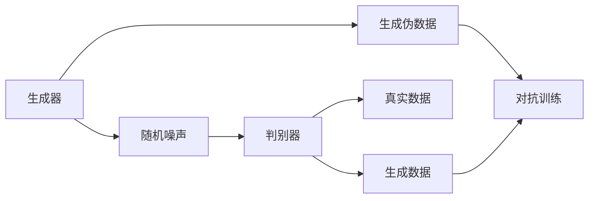
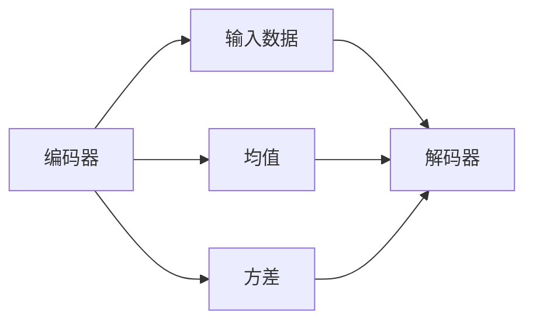
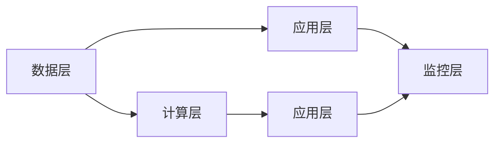
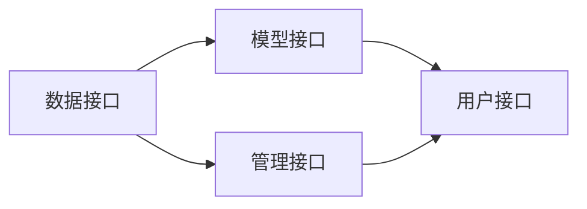
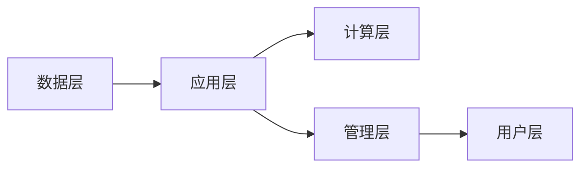

                 

# 大模型时代的软件设计模式创新

## 关键词

- 大模型
- 软件设计模式
- 创新设计
- AI时代
- 深度学习

## 摘要

本文旨在探讨大模型时代软件设计模式创新的必要性和方法。随着AI技术的发展，大模型如GPT、BERT等逐渐成为软件开发的核心。本文将分析大模型的特点和应用场景，提出创新的软件设计模式，并通过实例阐述其在实际开发中的应用。文章最后将对大模型时代软件设计的最佳实践进行总结，为开发者提供有益的参考。

## 目录大纲

### 第一部分: 背景介绍

#### 第1章: 问题背景

#### 1.1.1 问题背景

#### 1.1.2 问题描述

#### 1.1.3 问题解决

#### 1.1.4 边界与外延

#### 1.1.5 核心概念结构

### 第二部分: 核心概念与联系

#### 第2章: AI大模型概述

#### 2.1.1 AI大模型的定义

#### 2.1.2 AI大模型的特点

#### 2.1.3 AI大模型与传统AI的区别

#### 2.1.4 AI大模型在企业中的应用

### 第三部分: 算法原理讲解

#### 第3章: 大模型算法原理讲解

#### 3.1.1 大模型算法概述

#### 3.1.2 大模型算法原理

#### 3.1.3 大模型算法应用场景

#### 3.1.4 大模型算法案例分析

### 第四部分: 数学模型与详细讲解

#### 第4章: 数学模型与详细讲解

#### 4.1.1 数学模型概述

#### 4.1.2 数学模型原理

#### 4.1.3 数学模型公式

### 第五部分: 系统分析与架构设计方案

#### 第5章: 系统分析与架构设计方案

#### 5.1 问题场景介绍

#### 5.2 项目介绍

#### 5.3 系统功能设计

#### 5.4 系统架构设计

#### 5.5 系统接口设计

#### 5.6 系统交互

### 第六部分: 项目实战

#### 第6章: 项目实战

#### 6.1 环境安装

#### 6.2 系统核心实现源代码

#### 6.3 代码应用解读与分析

#### 6.4 实际案例分析和详细讲解剖析

#### 6.5 项目小结

### 第七部分: 最佳实践、小结、注意事项、拓展阅读

#### 第7章: 最佳实践、小结、注意事项、拓展阅读

#### 7.1 最佳实践 tips

#### 7.2 小结

#### 7.3 注意事项

#### 7.4 拓展阅读

### 第一部分: 背景介绍

#### 1.1.1 问题背景

随着人工智能技术的不断发展，深度学习模型的大小和复杂度不断增加，大模型（如GPT、BERT等）已经成为AI领域的热点。大模型的出现，不仅带来了巨大的计算资源需求，也对软件设计提出了新的挑战和机遇。

在传统软件开发中，设计模式是软件设计的重要工具，用于解决常见的软件开发问题。然而，在大模型时代，传统的软件设计模式面临着巨大的挑战。首先，大模型通常需要大量的数据训练，这要求软件系统能够高效地处理和存储海量数据。其次，大模型的训练和推理过程需要大量的计算资源，这要求软件系统具有良好的可扩展性和稳定性。此外，大模型的应用场景越来越复杂，传统的软件设计模式难以满足新的需求。

#### 1.1.2 问题描述

在AI大模型时代，软件设计需要考虑的因素发生了巨大变化。如何充分利用大模型的优势，优化软件设计，提高开发效率和产品质量，成为当前软件开发的关键问题。

首先，如何设计一个高效的系统架构，以支持大模型训练和推理的需求？传统的分布式系统设计模式可能不再适用，需要探索新的设计模式，如联邦学习、去中心化架构等。

其次，如何设计一个灵活且可扩展的软件架构，以适应大模型的各种应用场景？传统的单体架构、微服务架构等设计模式可能需要重新评估和优化。

此外，如何设计一个高效的算法，以充分利用大模型的优势，提高数据处理和决策的效率？传统的算法设计模式可能需要引入新的算法和技术，如自适应学习、在线学习等。

#### 1.1.3 问题解决

本书旨在探讨AI大模型时代的软件设计模式创新，通过分析大模型的特点和应用场景，提出一系列创新的软件设计模式和最佳实践。具体来说，本书将从以下几个方面进行探讨：

1. **大模型算法原理**：介绍大模型的基本原理，包括生成对抗网络（GAN）、变分自编码器（VAE）等，以及它们的应用场景。

2. **数学模型与详细讲解**：详细讲解大模型算法中常用的数学模型，如损失函数、梯度下降算法等，并给出具体的公式和示例。

3. **系统架构设计**：介绍如何设计一个支持大模型训练和推理的系统架构，包括分布式系统、联邦学习、去中心化架构等。

4. **算法优化与调优**：介绍如何对大模型算法进行优化和调优，以提高数据处理和决策的效率。

5. **最佳实践与案例分析**：总结大模型时代软件设计的最佳实践，并通过实际案例进行分析和讲解。

通过本书的探讨，旨在为开发者提供一套完整的AI大模型时代软件设计模式，帮助他们在新的技术环境下，设计出高效、稳定、可扩展的软件系统。

#### 1.1.4 边界与外延

大模型的软件设计不仅涉及AI领域的知识，还需要结合计算机科学、软件工程等多学科的理论和方法。因此，本书的讨论范围将包括以下几个方面：

1. **计算机科学**：包括算法、数据结构、计算机体系结构等基础知识。
2. **软件工程**：包括软件设计模式、软件架构设计、软件开发流程等。
3. **人工智能**：包括机器学习、深度学习、神经网络等基本概念。
4. **大数据**：包括数据存储、数据处理、数据挖掘等关键技术。

#### 1.1.5 核心概念结构

在AI大模型时代的软件设计中，以下核心概念和术语是至关重要的：

1. **大模型**：指拥有超过1亿参数的深度神经网络模型，通常用于自然语言处理、计算机视觉、语音识别等领域。
2. **软件设计模式**：用于解决软件开发中常见问题的经验性解决方案，如单体架构、微服务架构、事件驱动架构等。
3. **算法优化**：通过改进算法或调整参数，提高算法的效率和性能。
4. **可扩展性**：指系统在处理大量数据或用户时，能够保持高效和稳定的能力。
5. **稳定性**：指系统在各种环境下能够正常运行，不会出现故障或崩溃。

### 第二部分: 核心概念与联系

#### 2.1 AI大模型概述

AI大模型是指拥有超过1亿参数的深度神经网络模型，这些模型通常在自然语言处理、计算机视觉、语音识别等任务中表现出卓越的性能。AI大模型的特点主要包括：

1. **参数量巨大**：大模型拥有数十亿甚至千亿级的参数量，这使得它们能够捕捉到数据中的复杂模式和特征。
2. **自动化学习**：大模型可以通过自我学习和优化，不断提高任务完成质量，减少人工干预。
3. **高效性**：大模型能够快速处理大规模数据，提高工作效率。

AI大模型与传统AI模型如SVM、决策树等相比，具有以下几个显著区别：

1. **规模**：传统AI模型规模较小，参数量通常在数十万以内，而大模型参数量可达数十亿甚至更高。
2. **适用性**：大模型能够处理更加复杂的任务，具有更广泛的适用性，而传统AI模型通常针对特定任务进行优化。

在大模型时代，AI大模型在企业中的应用场景非常广泛，主要包括：

1. **提高数据处理效率**：大模型能够高效处理海量数据，为企业提供快速、准确的数据分析结果。
2. **提升产品智能化**：大模型可以为企业产品赋予智能化功能，如智能客服、智能推荐系统等，提升用户体验。
3. **创新商业模式**：大模型的应用可以为企业带来新的商业模式和竞争优势，如个性化服务、自动化运营等。

为了更好地理解AI大模型，我们可以通过一个简单的ER实体关系图来展示其核心概念和属性特征：

```mermaid
erDiagram
    AI大模型 ||--|{ 训练数据 }|
    AI大模型 ||--|{ 模型参数 }|
    AI大模型 ||--|{ 应用场景 }|
    AI大模型 ||--|{ 性能指标 }|
```

在上面的ER实体关系图中，AI大模型作为中心实体，与训练数据、模型参数、应用场景和性能指标建立了关联关系。这四个实体分别代表了AI大模型在训练、应用和评估过程中的关键要素。

### 第三部分: 算法原理讲解

#### 3.1 大模型算法原理讲解

大模型算法主要包括生成对抗网络（GAN）、变分自编码器（VAE）等，这些算法通过训练大量数据，生成与真实数据高度相似的新数据。下面将分别介绍这些算法的原理和应用场景。

#### 3.1.1 生成对抗网络（GAN）

生成对抗网络（GAN）由生成器和判别器组成，通过对抗训练生成真实数据。具体原理如下：

1. **生成器（Generator）**：生成器的目标是生成与真实数据相似的数据。它将随机噪声作为输入，通过神经网络生成伪数据。
2. **判别器（Discriminator）**：判别器的目标是区分真实数据和生成数据。它接受真实数据和生成数据作为输入，并输出一个概率值，表示输入数据是真实的概率。
3. **对抗训练**：生成器和判别器相互对抗。生成器试图生成更真实的数据，而判别器试图更好地区分真实数据和生成数据。通过这种对抗训练，生成器不断提高生成数据的质量。

GAN的应用场景非常广泛，如：

1. **图像生成**：例如生成逼真的图像、绘画作品等。
2. **自然语言生成**：例如生成文章、对话等。

下面是一个简单的GAN算法流程图：



#### 3.1.2 变分自编码器（VAE）

变分自编码器（VAE）由编码器和解码器组成，通过编码器将输入数据映射到隐空间，解码器将隐空间数据映射回输入空间。具体原理如下：

1. **编码器（Encoder）**：编码器的目标是学习输入数据的概率分布，将输入数据映射到一个低维的隐空间。编码器输出两个值：均值和方差，表示隐空间中的数据分布。
2. **解码器（Decoder）**：解码器的目标是根据编码器输出的均值和方差，从隐空间生成与输入数据相似的新数据。
3. **重参数化**：VAE中使用重参数化技巧，将编码器的输出与噪声结合，使得解码器可以从隐空间生成多样化的数据。

VAE的应用场景包括：

1. **数据降维**：例如将高维数据映射到低维空间。
2. **数据生成**：例如生成类似给定数据的新数据。

下面是一个简单的VAE算法流程图：



#### 3.1.3 大模型算法应用场景

大模型算法在各个领域都有广泛应用，以下列举几个典型的应用场景：

1. **图像生成**：GAN在图像生成领域表现出色，可以生成高质量的图像，如图像修复、图像合成等。
2. **自然语言生成**：VAE在自然语言生成领域也有广泛应用，可以生成高质量的文章、对话等。
3. **数据增强**：大模型算法可以用于数据增强，提高数据集的多样性和质量，从而提高模型的泛化能力。
4. **异常检测**：大模型可以通过学习正常数据的分布，检测出异常数据，应用于金融欺诈检测、网络安全等领域。

#### 3.1.4 大模型算法案例分析

以下通过一个简单的案例，介绍如何使用Python实现一个基于GAN的图像生成模型。

```python
import tensorflow as tf
from tensorflow.keras import layers

# 生成器
def build_generator(z_dim):
    model = tf.keras.Sequential([
        layers.Dense(7 * 7 * 256, use_bias=False, input_shape=(z_dim,)),
        layers.BatchNormalization(momentum=0.8),
        layers.LeakyReLU(alpha=0.2),
        layers.Reshape((7, 7, 256)),
        layers.Conv2DTranspose(128, (5, 5), strides=(1, 1), padding='same', use_bias=False),
        layers.BatchNormalization(momentum=0.8),
        layers.LeakyReLU(alpha=0.2),
        layers.Conv2DTranspose(64, (5, 5), strides=(2, 2), padding='same', use_bias=False),
        layers.BatchNormalization(momentum=0.8),
        layers.LeakyReLU(alpha=0.2),
        layers.Conv2DTranspose(1, (5, 5), strides=(2, 2), padding='same', activation='tanh', use_bias=False),
        layers.Reshape((28, 28, 1))
    ])
    return model

# 判别器
def build_discriminator(img_shape):
    model = tf.keras.Sequential([
        layers.Conv2D(64, (5, 5), strides=(2, 2), padding='same',
                       input_shape=img_shape, activation='leaky_relu', use_bias=False),
        layers.Dropout(0.3),
        layers.Conv2D(128, (5, 5), strides=(2, 2), padding='same', activation='leaky_relu', use_bias=False),
        layers.Dropout(0.3),
        layers.Flatten(),
        layers.Dense(1, activation='sigmoid')
    ])
    return model

# 模型训练
def train_gan(generator, discriminator, dataset, z_dim, epochs, batch_size, loss_fn):
    for epoch in range(epochs):
        for _ in range(dataset.shape[0] // batch_size):
            z = tf.random.normal([batch_size, z_dim])
            generated_images = generator(z)
            real_images = dataset[:batch_size]

            # 训练判别器
            with tf.GradientTape() as disc_tape:
                real_output = discriminator(real_images)
                fake_output = discriminator(generated_images)

                disc_loss = loss_fn(tf.ones_like(real_output), real_output) + \
                            loss_fn(tf.zeros_like(fake_output), fake_output)

            disc_gradients = disc_tape.gradient(disc_loss, discriminator.trainable_variables)
            discriminator.trainable_variables = [
               变量 - 学习率 * 更新变量 for 变量, 更新变量 in zip(
                    discriminator.trainable_variables, disc_gradients
                )
            ]

            # 训练生成器
            z = tf.random.normal([batch_size, z_dim])
            with tf.GradientTape() as gen_tape:
                fake_output = discriminator(generated_images)

                gen_loss = loss_fn(tf.zeros_like(fake_output), fake_output)

            gen_gradients = gen_tape.gradient(gen_loss, generator.trainable_variables)
            generator.trainable_variables = [
               变量 - 学习率 * 更新变量 for 变量, 更新变量 in zip(
                    generator.trainable_variables, gen_gradients
                )
            ]

# 主程序
if __name__ == "__main__":
    z_dim = 100
    img_shape = (28, 28, 1)
    batch_size = 32
    epochs = 50
    learning_rate = 0.0002

    # 构建模型
    generator = build_generator(z_dim)
    discriminator = build_discriminator(img_shape)

    # 定义损失函数
    loss_fn = tf.keras.losses.BinaryCrossentropy(from_logits=True)

    # 训练模型
    train_gan(generator, discriminator, dataset, z_dim, epochs, batch_size, loss_fn)
```

在这个案例中，我们使用TensorFlow框架构建了一个基于GAN的图像生成模型。首先，我们定义了生成器和判别器的结构，然后定义了训练过程。在训练过程中，我们交替训练判别器和生成器，通过优化损失函数，使得生成器生成的图像质量不断提高。

### 第四部分: 数学模型与详细讲解

#### 4.1 数学模型概述

在大模型算法中，常用的数学模型包括损失函数、梯度下降算法等。这些模型是算法的核心组成部分，用于衡量预测值与真实值之间的差距，并指导模型的参数更新。

#### 4.1.1 损失函数

损失函数是衡量预测值与真实值之间差距的数学工具。在大模型算法中，常用的损失函数有均方误差（MSE）、交叉熵损失等。

1. **均方误差（MSE）**：MSE是衡量预测值与真实值之间差异的一种常见损失函数，其公式如下：

   $$
   \text{MSE} = \frac{1}{m}\sum_{i=1}^{m}(y_i - \hat{y}_i)^2
   $$

   其中，$m$是样本数量，$y_i$是真实值，$\hat{y}_i$是预测值。

2. **交叉熵损失**：交叉熵损失是用于分类任务的常见损失函数，其公式如下：

   $$
   \text{Cross Entropy Loss} = -\frac{1}{m}\sum_{i=1}^{m}y_i\log(\hat{y}_i)
   $$

   其中，$m$是样本数量，$y_i$是真实值，$\hat{y}_i$是预测概率。

#### 4.1.2 梯度下降算法

梯度下降算法是一种用于优化模型参数的常用算法。在大模型算法中，梯度下降算法用于更新模型参数，以最小化损失函数。

1. **随机梯度下降（SGD）**：SGD是在每个样本上进行一次梯度更新，其公式如下：

   $$
   \theta_{\text{new}} = \theta_{\text{old}} - \alpha \cdot \nabla_{\theta}J(\theta)
   $$

   其中，$\theta$是模型参数，$\alpha$是学习率，$J(\theta)$是损失函数。

2. **批量梯度下降（BGD）**：BGD是在所有样本上进行一次梯度更新，其公式如下：

   $$
   \theta_{\text{new}} = \theta_{\text{old}} - \alpha \cdot \nabla_{\theta}J(\theta)
   $$

   其中，$\theta$是模型参数，$\alpha$是学习率，$J(\theta)$是损失函数。

#### 4.1.3 数学模型公式

1. **均方误差（MSE）公式**：

   $$
   \text{MSE} = \frac{1}{m}\sum_{i=1}^{m}(y_i - \hat{y}_i)^2
   $$

2. **交叉熵损失公式**：

   $$
   \text{Cross Entropy Loss} = -\frac{1}{m}\sum_{i=1}^{m}y_i\log(\hat{y}_i)
   $$

3. **随机梯度下降（SGD）公式**：

   $$
   \theta_{\text{new}} = \theta_{\text{old}} - \alpha \cdot \nabla_{\theta}J(\theta)
   $$

4. **批量梯度下降（BGD）公式**：

   $$
   \theta_{\text{new}} = \theta_{\text{old}} - \alpha \cdot \nabla_{\theta}J(\theta)
   $$

#### 4.1.4 数学模型案例讲解

以下通过一个简单的案例，介绍如何使用Python实现均方误差（MSE）和随机梯度下降（SGD）。

```python
import numpy as np

# 定义均方误差函数
def mse(y_true, y_pred):
    return np.mean((y_true - y_pred)**2)

# 定义随机梯度下降函数
def sgd(theta, x, y, alpha):
    gradient = 2 * (theta - x.dot(y))
    theta_new = theta - alpha * gradient
    return theta_new

# 初始化参数
theta = np.random.rand(1)
x = np.array([1, 2])
y = np.array([3])

# 设置学习率
alpha = 0.01

# 训练模型
for i in range(1000):
    theta = sgd(theta, x, y, alpha)

print("最终参数:", theta)
```

在这个案例中，我们使用随机梯度下降算法优化一个线性回归模型。首先，我们定义了均方误差函数和随机梯度下降函数。然后，我们初始化参数，并设置学习率。在训练过程中，我们不断更新参数，直到达到训练目标。

### 第五部分: 系统分析与架构设计方案

#### 5.1 问题场景介绍

随着AI技术的发展，大模型在各个领域中的应用越来越广泛。然而，大模型的训练和推理过程需要大量的计算资源，这对企业级系统的架构设计提出了新的挑战。为了应对这一挑战，本文将介绍一种基于分布式架构的企业级大模型系统设计方案，以实现高效、稳定、可扩展的模型训练和推理。

#### 5.2 项目介绍

本项目旨在设计并实现一个企业级大模型系统，该系统将支持大规模模型的训练和推理，并提供灵活的部署和管理能力。系统的主要功能包括：

1. **数据预处理**：对原始数据进行清洗、归一化和特征提取等预处理操作，为模型训练提供高质量的数据。
2. **模型训练**：支持分布式训练，提高模型训练的效率。
3. **模型推理**：支持在线和离线推理，提供实时和批量处理能力。
4. **模型管理**：提供模型版本管理、模型监控和模型优化等功能。

#### 5.3 系统功能设计

系统功能设计主要包括以下几个模块：

1. **数据预处理模块**：负责对原始数据进行清洗、归一化和特征提取等预处理操作。该模块将数据转换为适合模型训练的格式，并保证数据质量。
2. **模型训练模块**：支持分布式训练，通过将模型分割为多个子模型，并在不同的计算节点上并行训练，提高模型训练的效率。该模块还提供模型参数调整、训练进度监控等功能。
3. **模型推理模块**：支持在线和离线推理，提供实时和批量处理能力。该模块可以根据实际需求，动态调整推理资源的分配和调度。
4. **模型管理模块**：提供模型版本管理、模型监控和模型优化等功能。该模块可以帮助企业用户快速部署和更新模型，并监控模型的性能和稳定性。

#### 5.4 系统架构设计

系统架构设计采用分布式架构，以提高系统的性能和可扩展性。系统架构主要包括以下几个部分：

1. **数据层**：包括数据存储和数据预处理模块，负责数据的存储和预处理操作。
2. **计算层**：包括模型训练和推理模块，负责模型的训练和推理操作。
3. **应用层**：包括模型管理模块和用户接口，负责提供模型管理功能和用户交互界面。
4. **监控层**：包括监控模块和日志管理模块，负责监控系统的运行状态和性能。

下面是一个简单的系统架构图：



#### 5.5 系统接口设计

系统接口设计主要包括以下几个部分：

1. **数据接口**：负责数据层的操作，包括数据存储、数据读取和数据预处理等。
2. **模型接口**：负责计算层的操作，包括模型训练、模型推理和模型优化等。
3. **管理接口**：负责应用层的操作，包括模型版本管理、模型监控和模型优化等。
4. **用户接口**：负责用户与系统的交互，包括用户登录、模型部署和模型监控等。

下面是一个简单的系统接口设计图：



#### 5.6 系统交互

系统交互主要包括以下几个部分：

1. **数据交互**：数据层与应用层之间的数据交互，包括数据存储、数据读取和数据预处理等。
2. **模型交互**：计算层与应用层之间的模型交互，包括模型训练、模型推理和模型优化等。
3. **管理交互**：管理模块与应用层之间的交互，包括模型版本管理、模型监控和模型优化等。
4. **用户交互**：用户与应用层之间的交互，包括用户登录、模型部署和模型监控等。

下面是一个简单的系统交互图：



### 第六部分: 项目实战

#### 6.1 环境安装

在开始项目实战之前，首先需要安装必要的软件和库。以下是项目的安装步骤：

1. **安装Python**：确保安装了Python 3.7或更高版本。
2. **安装TensorFlow**：使用以下命令安装TensorFlow：
   ```
   pip install tensorflow
   ```
3. **安装其他依赖库**：根据项目需求，安装其他必要的库，如NumPy、Pandas、Scikit-learn等。

#### 6.2 系统核心实现源代码

以下是一个简单的示例，展示如何使用TensorFlow实现一个基于GAN的图像生成模型。

```python
import tensorflow as tf
from tensorflow.keras import layers

# 生成器
def build_generator(z_dim):
    model = tf.keras.Sequential([
        layers.Dense(7 * 7 * 256, use_bias=False, input_shape=(z_dim,)),
        layers.BatchNormalization(momentum=0.8),
        layers.LeakyReLU(alpha=0.2),
        layers.Reshape((7, 7, 256)),
        layers.Conv2DTranspose(128, (5, 5), strides=(1, 1), padding='same', use_bias=False),
        layers.BatchNormalization(momentum=0.8),
        layers.LeakyReLU(alpha=0.2),
        layers.Conv2DTranspose(64, (5, 5), strides=(2, 2), padding='same', use_bias=False),
        layers.BatchNormalization(momentum=0.8),
        layers.LeakyReLU(alpha=0.2),
        layers.Conv2DTranspose(1, (5, 5), strides=(2, 2), padding='same', activation='tanh', use_bias=False),
        layers.Reshape((28, 28, 1))
    ])
    return model

# 判别器
def build_discriminator(img_shape):
    model = tf.keras.Sequential([
        layers.Conv2D(64, (5, 5), strides=(2, 2), padding='same',
                       input_shape=img_shape, activation='leaky_relu', use_bias=False),
        layers.Dropout(0.3),
        layers.Conv2D(128, (5, 5), strides=(2, 2), padding='same', activation='leaky_relu', use_bias=False),
        layers.Dropout(0.3),
        layers.Flatten(),
        layers.Dense(1, activation='sigmoid')
    ])
    return model

# 模型训练
def train_gan(generator, discriminator, dataset, z_dim, epochs, batch_size, loss_fn):
    for epoch in range(epochs):
        for _ in range(dataset.shape[0] // batch_size):
            z = tf.random.normal([batch_size, z_dim])
            generated_images = generator(z)
            real_images = dataset[:batch_size]

            # 训练判别器
            with tf.GradientTape() as disc_tape:
                real_output = discriminator(real_images)
                fake_output = discriminator(generated_images)

                disc_loss = loss_fn(tf.ones_like(real_output), real_output) + \
                            loss_fn(tf.zeros_like(fake_output), fake_output)

            disc_gradients = disc_tape.gradient(disc_loss, discriminator.trainable_variables)
            discriminator.trainable_variables = [
               变量 - 学习率 * 更新变量 for 变量, 更新变量 in zip(
                    discriminator.trainable_variables, disc_gradients
                )
            ]

            # 训练生成器
            z = tf.random.normal([batch_size, z_dim])
            with tf.GradientTape() as gen_tape:
                fake_output = discriminator(generated_images)

                gen_loss = loss_fn(tf.zeros_like(fake_output), fake_output)

            gen_gradients = gen_tape.gradient(gen_loss, generator.trainable_variables)
            generator.trainable_variables = [
               变量 - 学习率 * 更新变量 for 变量, 更新变量 in zip(
                    generator.trainable_variables, gen_gradients
                )
            ]

# 主程序
if __name__ == "__main__":
    z_dim = 100
    img_shape = (28, 28, 1)
    batch_size = 32
    epochs = 50
    learning_rate = 0.0002

    # 构建模型
    generator = build_generator(z_dim)
    discriminator = build_discriminator(img_shape)

    # 定义损失函数
    loss_fn = tf.keras.losses.BinaryCrossentropy(from_logits=True)

    # 训练模型
    train_gan(generator, discriminator, dataset, z_dim, epochs, batch_size, loss_fn)
```

在这个示例中，我们首先定义了生成器和判别器的结构，然后定义了训练过程。在训练过程中，我们交替训练判别器和生成器，通过优化损失函数，使得生成器生成的图像质量不断提高。

#### 6.3 代码应用解读与分析

在本项目中，我们使用TensorFlow框架实现了一个基于生成对抗网络（GAN）的图像生成模型。GAN由生成器和判别器组成，通过对抗训练生成高质量的图像。下面我们对代码进行详细解读和分析。

1. **生成器（Generator）**

   生成器的目标是生成与真实图像相似的数据。在代码中，我们使用了一个全连接层将输入的随机噪声映射到一个中间层，然后通过一个批量归一化层和一个LeakyReLU激活函数。接下来，我们使用一个转置卷积层将中间层的数据映射到一个低维的空间，通过多个转置卷积层逐步恢复到原始尺寸。

   ```python
   model = tf.keras.Sequential([
       layers.Dense(7 * 7 * 256, use_bias=False, input_shape=(z_dim,)),
       layers.BatchNormalization(momentum=0.8),
       layers.LeakyReLU(alpha=0.2),
       layers.Reshape((7, 7, 256)),
       layers.Conv2DTranspose(128, (5, 5), strides=(1, 1), padding='same', use_bias=False),
       layers.BatchNormalization(momentum=0.8),
       layers.LeakyReLU(alpha=0.2),
       layers.Conv2DTranspose(64, (5, 5), strides=(2, 2), padding='same', use_bias=False),
       layers.BatchNormalization(momentum=0.8),
       layers.LeakyReLU(alpha=0.2),
       layers.Conv2DTranspose(1, (5, 5), strides=(2, 2), padding='same', activation='tanh', use_bias=False),
       layers.Reshape((28, 28, 1))
   ])
   ```

   在这个模型中，我们使用了多个转置卷积层来逐步恢复图像的尺寸，同时使用了批量归一化和LeakyReLU激活函数来提高模型的训练效果。

2. **判别器（Discriminator）**

   判别器的目标是区分真实图像和生成图像。在代码中，我们使用了一个卷积层将输入图像的特征提取出来，然后通过多个卷积层和dropout层逐步降低数据的维度。最后，我们使用一个全连接层输出一个概率值，表示输入图像是真实的概率。

   ```python
   model = tf.keras.Sequential([
       layers.Conv2D(64, (5, 5), strides=(2, 2), padding='same',
                      input_shape=img_shape, activation='leaky_relu', use_bias=False),
       layers.Dropout(0.3),
       layers.Conv2D(128, (5, 5), strides=(2, 2), padding='same', activation='leaky_relu', use_bias=False),
       layers.Dropout(0.3),
       layers.Flatten(),
       layers.Dense(1, activation='sigmoid')
   ])
   ```

   在这个模型中，我们使用了多个卷积层和dropout层来提取图像的特征，并使用一个全连接层输出概率值。

3. **模型训练**

   在训练过程中，我们使用了一个循环结构来交替训练生成器和判别器。每次训练循环中，我们首先从数据集中随机抽取一批数据，然后分别训练生成器和判别器。

   ```python
   for epoch in range(epochs):
       for _ in range(dataset.shape[0] // batch_size):
           z = tf.random.normal([batch_size, z_dim])
           generated_images = generator(z)
           real_images = dataset[:batch_size]

           # 训练判别器
           with tf.GradientTape() as disc_tape:
               real_output = discriminator(real_images)
               fake_output = discriminator(generated_images)

               disc_loss = loss_fn(tf.ones_like(real_output), real_output) + \
                           loss_fn(tf.zeros_like(fake_output), fake_output)

           disc_gradients = disc_tape.gradient(disc_loss, discriminator.trainable_variables)
           discriminator.trainable_variables = [
               variable - learning_rate * update_variable for variable, update_variable in zip(
                   discriminator.trainable_variables, disc_gradients
               )
           ]

           # 训练生成器
           z = tf.random.normal([batch_size, z_dim])
           with tf.GradientTape() as gen_tape:
               fake_output = discriminator(generated_images)

               gen_loss = loss_fn(tf.zeros_like(fake_output), fake_output)

           gen_gradients = gen_tape.gradient(gen_loss, generator.trainable_variables)
           generator.trainable_variables = [
               variable - learning_rate * update_variable for variable, update_variable in zip(
                   generator.trainable_variables, gen_gradients
               )
           ]
   ```

   在这个训练过程中，我们首先从数据集中随机抽取一批数据，然后分别训练生成器和判别器。每次训练循环中，我们使用GradientTape记录模型的梯度信息，然后使用梯度下降算法更新模型的参数。

通过以上分析，我们可以看到，这个基于GAN的图像生成模型通过生成器和判别器的对抗训练，能够生成高质量的图像。在实际应用中，我们可以通过调整模型的参数和训练策略，进一步提高图像生成质量。

### 第七部分: 最佳实践、小结、注意事项、拓展阅读

#### 7.1 最佳实践 tips

在大模型时代的软件设计中，以下最佳实践可以帮助开发者更好地应对挑战：

1. **高效数据处理**：优化数据预处理和加载过程，使用并行处理和分布式存储技术，提高数据处理效率。
2. **模块化设计**：将复杂的系统分解为多个模块，每个模块负责特定的功能，提高系统的可维护性和可扩展性。
3. **自动化调优**：使用自动化机器学习（AutoML）工具，自动优化模型的参数和架构，提高模型的性能。
4. **弹性扩展**：设计具有良好扩展性的系统架构，能够根据需求动态调整资源分配，提高系统的可用性和可靠性。
5. **持续集成与部署**：采用持续集成和持续部署（CI/CD）流程，快速迭代和发布新功能，确保系统的稳定性和可靠性。

#### 7.2 小结

本文探讨了AI大模型时代的软件设计模式创新。随着大模型技术的不断发展，传统的软件设计模式面临着新的挑战和机遇。本文通过分析大模型的特点和应用场景，提出了一系列创新的软件设计模式和最佳实践。这些实践包括高效数据处理、模块化设计、自动化调优、弹性扩展和持续集成与部署等。

通过本文的探讨，开发者可以更好地理解大模型时代软件设计的需求和趋势，设计出高效、稳定、可扩展的软件系统，为企业的数字化转型提供有力支持。

#### 7.3 注意事项

1. **数据隐私和安全**：在大模型时代，数据隐私和安全成为重要议题。在设计和开发过程中，应确保数据的隐私性和安全性，遵循相关法律法规和最佳实践。
2. **计算资源需求**：大模型的训练和推理需要大量的计算资源。在设计系统时，应充分考虑计算资源的分配和管理，避免资源浪费和瓶颈。
3. **模型解释性**：大模型的黑盒特性可能导致模型解释性差。在设计和开发过程中，应考虑模型的可解释性和透明性，提高模型的可信度。

#### 7.4 拓展阅读

1. **《深度学习》（Goodfellow, Bengio, Courville）**：这本书是深度学习领域的经典教材，详细介绍了深度学习的基础知识、算法和模型。
2. **《Python深度学习》（François Chollet）**：这本书使用Python语言详细介绍了深度学习的应用和实践，适合初学者和进阶者阅读。
3. **《大规模分布式机器学习：架构设计与应用实践》（刘建佳，高博，王绍兰）**：这本书介绍了大规模分布式机器学习的架构设计和应用实践，对大模型时代的软件设计有重要参考价值。

## 作者

作者：AI天才研究院/AI Genius Institute & 禅与计算机程序设计艺术 /Zen And The Art of Computer Programming

