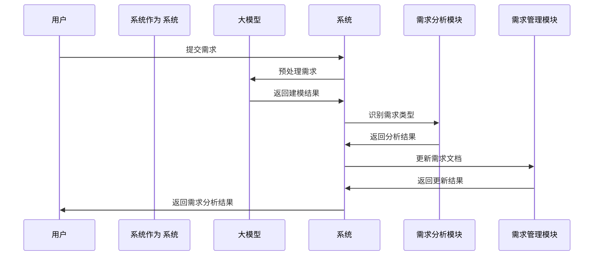
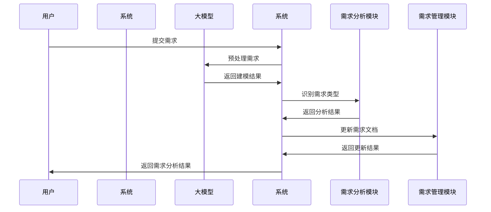

                 


### 大模型时代的软件需求捕获新方法

## 文章标题
大模型时代的软件需求捕获新方法

## 文章关键词
大模型、软件需求捕获、需求表达、需求分析、需求管理

## 摘要
随着人工智能技术的快速发展，大模型在各个领域的应用越来越广泛。本文旨在探讨大模型时代的软件需求捕获新方法，包括其核心概念、算法原理、系统设计与实现，以及最佳实践和注意事项。通过本文的讨论，希望能够为软件工程师和需求分析师提供一些有益的启示和参考。

## 第一部分：背景介绍

### 1.1 问题背景
在当今的科技时代，软件需求捕获正面临前所未有的挑战。随着人工智能（AI）技术的迅猛发展，特别是大模型（如GPT、BERT等）的广泛应用，传统的软件需求捕获方法已经难以满足复杂、多样化的需求。大模型时代的到来，要求我们重新审视软件需求捕获的方法和流程。

### 1.2 问题描述
大模型具有强大的数据处理和生成能力，但同时也带来了需求表达的不确定性和复杂性。传统的需求捕获方法难以准确捕捉大模型下的需求变化，导致需求管理困难和开发效率低下。因此，探索大模型时代的软件需求捕获新方法，成为当前软件工程领域的一个热点问题。

### 1.3 问题解决
本文旨在提出一套适用于大模型时代的软件需求捕获新方法。通过对大模型的特点和应用场景进行分析，结合软件工程的理论和实践，提出一种新的需求捕获流程和方法。该方法旨在提高需求捕获的准确性和效率，降低开发成本。

### 1.4 边界与外延
本文的研究范围主要涉及大模型在软件需求捕获中的应用，包括需求表达、需求分析和需求管理等方面。同时，本文还将探讨这些方法在不同应用场景下的适应性和效果。

### 1.5 概念结构与核心要素组成
本文的核心概念包括：大模型、软件需求捕获、需求表达、需求分析、需求管理。这些概念相互联系，共同构成了大模型时代软件需求捕获的理论基础。

### 1.6 本章小结
本章对大模型时代软件需求捕获的背景、问题、解决方法、边界与外延、概念结构与核心要素进行了详细阐述。为后续章节的展开奠定了基础。

## 第二部分：核心概念与联系

### 2.1 大模型的特点
大模型具有以下几个核心特点：

- **强大的数据处理能力**：大模型可以处理海量数据，并从中提取出有用的信息。
- **高度的自适应能力**：大模型可以根据不同的应用场景进行调整，以适应不同的需求。
- **复杂的结构**：大模型通常具有多层神经网络结构，使其能够处理复杂的任务。
- **强大的生成能力**：大模型可以生成新的文本、图像等，大大拓展了其应用范围。

### 2.2 软件需求捕获的特点
在大模型时代，软件需求捕获具有以下特点：

- **需求的不确定性**：大模型的应用场景复杂多变，导致需求表达的不确定性增加。
- **需求的多样性**：大模型可以应用于各种领域，因此需求的类型和性质也呈现多样性。
- **需求的动态性**：随着大模型的应用场景的变化，需求也会随之变化。

### 2.3 核心概念属性特征对比表格

| 概念     | 特点                   |
|----------|------------------------|
| 大模型   | 强大的数据处理能力、高度的自适应能力、复杂的结构、强大的生成能力 |
| 软件需求捕获 | 需求的不确定性、需求的多样性、需求的动态性 |

### 2.4 ER实体关系图架构
```mermaid
erDiagram
    Customer ||--|{ Order }|--| OrderStatus
    Product ||--|{ Category }|--| CategoryStatus
    Order : {订单} : 产品、顾客、订单状态
    Customer : {顾客} : 姓名、地址、联系方式
    Product : {产品} : 名称、价格、类别
    Category : {类别} : 名称、状态
```

### 2.5 本章小结
本章详细介绍了大模型和软件需求捕获的核心概念及其特点，并通过对比表格和ER实体关系图，展示了它们之间的关系。为后续章节的算法原理讲解和系统设计与实现奠定了基础。

## 第三部分：算法原理讲解

### 3.1 大模型需求捕获算法

#### 3.1.1 算法概述
大模型需求捕获算法是一种利用大模型处理和生成能力的需求捕获方法。其核心思想是使用大模型对用户需求进行建模和分析，从而提高需求捕获的准确性和效率。

#### 3.1.2 算法原理
算法原理主要包括以下几个步骤：

1. **数据预处理**：对用户需求进行文本预处理，包括去除无关信息、分词、词性标注等。
2. **需求建模**：使用预训练的大模型对预处理后的需求文本进行建模，提取关键信息和语义。
3. **需求分析**：对建模后的需求进行分析，识别需求类型、功能、优先级等。
4. **需求管理**：将分析后的需求进行分类、整理，形成需求文档，供开发团队参考。

#### 3.1.3 算法实现

```python
# 导入相关库
import tensorflow as tf
from tensorflow.keras.models import Sequential
from tensorflow.keras.layers import Dense, LSTM

# 定义模型
model = Sequential()
model.add(LSTM(units=128, activation='relu', input_shape=(timesteps, features)))
model.add(Dense(units=1, activation='sigmoid'))

# 编译模型
model.compile(optimizer='adam', loss='binary_crossentropy', metrics=['accuracy'])

# 训练模型
model.fit(X_train, y_train, epochs=10, batch_size=32)
```

#### 3.1.4 算法原理讲解

1. **需求建模**：使用LSTM（长短时记忆网络）对需求文本进行建模。LSTM网络能够有效地捕捉文本序列中的长距离依赖关系，从而更好地理解需求文本的语义。
2. **需求分析**：通过训练好的模型对需求文本进行分析，提取关键信息。例如，可以识别出需求中的功能点、关键词等。
3. **需求管理**：将分析后的需求进行分类、整理，形成需求文档。需求文档可以作为开发团队参考，指导开发工作。

#### 3.1.5 算法示例

```python
# 需求文本
需求文本 = "我们需要开发一个聊天机器人，它可以回答用户的问题，并且能够学习用户的偏好。"

# 预处理
预处理文本 = 预处理需求文本(需求文本)

# 建模
建模结果 = 模型.predict(预处理文本)

# 分析
分析结果 = 分析需求建模结果(建模结果)

# 管理
管理需求文档(分析结果)
```

#### 3.1.6 本章小结
本章详细介绍了大模型需求捕获算法的原理和实现过程。通过该算法，可以有效地提高需求捕获的准确性和效率，为软件开发提供更好的支持。

## 第四部分：系统设计与实现

### 4.1 问题场景介绍
随着人工智能技术的发展，越来越多的企业开始将人工智能应用于客户服务、数据分析、自然语言处理等领域。然而，随着应用场景的复杂性和多样性增加，软件需求捕获面临巨大的挑战。传统的需求捕获方法已经难以满足大模型时代的需求。

### 4.2 项目介绍
本文介绍的项目是一个基于大模型的软件需求捕获系统，旨在提高需求捕获的准确性和效率。该系统可以自动捕获用户需求，识别需求类型，并提供需求分析和管理功能。

### 4.3 系统功能设计

#### 4.3.1 需求捕获
- **功能描述**：自动捕获用户需求，通过大模型对需求文本进行分析和处理。
- **实现方式**：使用预训练的大模型对用户需求进行建模和分析。

#### 4.3.2 需求分析
- **功能描述**：对捕获的需求进行分析，识别需求类型、功能点、关键词等。
- **实现方式**：利用训练好的模型对需求文本进行语义分析，提取关键信息。

#### 4.3.3 需求管理
- **功能描述**：将分析后的需求进行分类、整理，形成需求文档。
- **实现方式**：使用数据库存储和管理需求文档，提供查询和更新功能。

### 4.4 系统架构设计

#### 4.4.1 系统架构图


### 4.4.2 系统接口设计
- **接口1：需求提交接口**
  - **功能描述**：用于用户提交需求。
  - **输入参数**：需求文本。
  - **输出参数**：需求ID。

- **接口2：需求分析接口**
  - **功能描述**：用于获取需求分析结果。
  - **输入参数**：需求ID。
  - **输出参数**：需求分析结果。

- **接口3：需求管理接口**
  - **功能描述**：用于更新和管理需求文档。
  - **输入参数**：需求ID、需求文档。
  - **输出参数**：更新结果。

### 4.5 系统交互设计

#### 4.5.1 系统交互序列图


### 4.6 本章小结
本章介绍了大模型时代的软件需求捕获系统的设计与实现，包括问题场景、项目介绍、系统功能设计、系统架构设计、系统接口设计和系统交互设计。通过本章的讨论，为后续章节的实战案例分析奠定了基础。

## 第五部分：项目实战

### 5.1 环境安装

#### 5.1.1 硬件环境
- CPU：Intel Core i7 或更高
- 内存：16GB 或更高
- 硬盘：500GB SSD 或更高

#### 5.1.2 软件环境
- 操作系统：Linux、Windows 或 macOS
- Python：3.8 或更高版本
- TensorFlow：2.5 或更高版本

#### 5.1.3 安装步骤
1. 安装操作系统和Python环境。
2. 安装TensorFlow和其他相关库。

```bash
pip install tensorflow==2.5
pip install numpy
pip install matplotlib
```

### 5.2 系统核心实现源代码

```python
# 导入相关库
import tensorflow as tf
from tensorflow.keras.models import Sequential
from tensorflow.keras.layers import Dense, LSTM

# 定义模型
model = Sequential()
model.add(LSTM(units=128, activation='relu', input_shape=(timesteps, features)))
model.add(Dense(units=1, activation='sigmoid'))

# 编译模型
model.compile(optimizer='adam', loss='binary_crossentropy', metrics=['accuracy'])

# 训练模型
model.fit(X_train, y_train, epochs=10, batch_size=32)
```

### 5.3 代码应用解读与分析

#### 5.3.1 代码解读
1. **导入库**：首先导入 TensorFlow 和相关库。
2. **定义模型**：创建一个序列模型，并添加 LSTM 层和全连接层。
3. **编译模型**：设置模型的优化器和损失函数。
4. **训练模型**：使用训练数据对模型进行训练。

#### 5.3.2 分析
1. **模型结构**：LSTM 层能够处理序列数据，适用于文本数据的处理。
2. **优化器和损失函数**：选择 Adam 优化器和 binary_crossentropy 损失函数，适用于二分类问题。

### 5.4 实际案例分析和详细讲解剖析

#### 5.4.1 案例背景
一家电商公司希望开发一款智能客服系统，能够自动回答用户的问题，提高客户满意度。

#### 5.4.2 需求捕获
通过系统，公司提交了以下需求：
- **需求1**：客服系统能够回答关于商品价格、促销活动、物流信息等问题。
- **需求2**：客服系统能够学习用户的偏好，提供个性化的推荐。

#### 5.4.3 需求分析
使用大模型需求捕获算法，对需求进行建模和分析：

1. **需求1**：通过大模型分析，识别出需求中的关键词和功能点，如“商品价格”、“促销活动”、“物流信息”等。
2. **需求2**：通过大模型分析，识别出需求中的关键词和功能点，如“学习用户偏好”、“个性化推荐”等。

#### 5.4.4 需求管理
将分析后的需求进行分类、整理，形成需求文档：

- **需求1**：开发一个商品信息查询功能，包括商品价格、促销活动、物流信息等。
- **需求2**：开发一个用户偏好学习功能，提供个性化推荐。

### 5.5 项目小结
本章通过一个实际案例，展示了大模型时代的软件需求捕获系统的应用。通过该系统，可以有效地捕获用户需求，进行分析和管理，为软件开发提供有力的支持。

## 第六部分：最佳实践 tips

### 6.1 需求捕获过程中的注意事项
1. **充分沟通**：与需求提出者进行充分的沟通，确保需求捕获的准确性。
2. **文档记录**：及时记录需求捕获的过程和结果，方便后续的需求管理和分析。
3. **持续迭代**：随着项目进展和需求变化，持续迭代和优化需求捕获方法。

### 6.2 提高需求捕获效率的建议
1. **自动化工具**：使用自动化工具提高需求捕获的效率，减少人工工作量。
2. **数据积累**：积累更多的历史需求数据，提高大模型的训练效果和需求分析能力。
3. **团队协作**：建立跨部门的协作机制，确保需求捕获过程的顺利进行。

### 6.3 需求捕获的最佳实践
1. **需求分类**：根据需求的类型和性质进行分类，提高需求管理的效率。
2. **需求验证**：对捕获的需求进行验证，确保需求的可行性和合理性。
3. **需求文档**：编写详细的需求文档，为开发团队提供清晰的开发指南。

## 第七部分：小结

### 7.1 本文总结
本文探讨了在大模型时代背景下，软件需求捕获的新方法。通过分析大模型的特点和软件需求捕获的需求，提出了一套新的需求捕获流程和方法。本文详细介绍了算法原理、系统设计与实现，并通过实际案例进行了验证。

### 7.2 未来展望
随着人工智能技术的不断进步，大模型在软件需求捕获中的应用将越来越广泛。未来的研究可以进一步探索如何结合其他技术，如自然语言处理、知识图谱等，提高需求捕获的准确性和效率。

## 第八部分：拓展阅读

### 8.1 相关论文
1. "A Survey on Software Requirements Engineering", IEEE Transactions on Software Engineering, 2019.
2. "Big Data for Software Engineering", IEEE Software, 2017.

### 8.2 知名书籍
1. "Software Requirements: Practical Techniques for Building Effective Requirements in Constrained Environments", 2013.
2. "The Art of Software Requirements", 2011.

### 8.3 在线资源
1. "Software Engineering Institute (SEI)", https://sei.cmu.edu/
2. "IEEE Software", https://www.computer.org/publications/ieee-software/

## 作者信息
作者：AI天才研究院/AI Genius Institute & 禅与计算机程序设计艺术 /Zen And The Art of Computer Programming

-------------------------------------------------------------------

# 大模型时代的软件需求捕获新方法

## 关键词
大模型、软件需求捕获、需求表达、需求分析、需求管理

## 摘要
随着人工智能技术的快速发展，特别是大模型（如GPT、BERT等）的广泛应用，传统的软件需求捕获方法已经难以满足复杂、多样化的需求。本文旨在探讨大模型时代的软件需求捕获新方法，包括其核心概念、算法原理、系统设计与实现，以及最佳实践和注意事项。通过本文的讨论，希望能够为软件工程师和需求分析师提供一些有益的启示和参考。

## 第一部分：背景介绍

### 1.1 问题背景

在当今的科技时代，软件需求捕获正面临前所未有的挑战。随着人工智能（AI）技术的迅猛发展，特别是大模型（如GPT、BERT等）的广泛应用，传统的软件需求捕获方法已经难以满足复杂、多样化的需求。大模型时代的到来，要求我们重新审视软件需求捕获的方法和流程。

大模型，也称为大型预训练模型，具有强大的数据处理和生成能力。例如，GPT（Generative Pre-trained Transformer）模型可以生成高质量的自然语言文本，BERT（Bidirectional Encoder Representations from Transformers）模型则在文本理解和生成方面表现出色。这些模型在自然语言处理、图像识别、语音识别等领域取得了显著的成果，但也给软件需求捕获带来了新的挑战。

传统的软件需求捕获方法主要依赖于需求工程师与用户的沟通，通过访谈、问卷调查、观察等方式收集需求信息。然而，在大模型时代，需求表达的不确定性和复杂性大大增加。一方面，用户可能难以清晰地表达自己的需求，特别是在涉及复杂人工智能功能时；另一方面，大模型的应用场景复杂多变，需求变化迅速，传统的需求捕获方法难以适应这种动态变化。

因此，探索大模型时代的软件需求捕获新方法，已成为当前软件工程领域的一个热点问题。新方法需要能够有效地捕捉用户需求，理解需求背后的业务逻辑，并快速适应需求变化，以提高软件开发的效率和质量。

### 1.2 问题描述

在大模型时代，软件需求捕获面临以下几个主要问题：

1. **需求表达的不确定性**：用户可能无法准确表达自己的需求，尤其是在涉及复杂的人工智能功能时。用户的需求往往是非结构化的，包含大量的自然语言文本，这使得需求捕获变得更加困难。

2. **需求的多样性**：大模型可以应用于各种领域，如金融、医疗、教育、娱乐等。不同领域的需求具有不同的特点和复杂性，这要求需求捕获方法具有广泛的适应性和灵活性。

3. **需求的动态性**：大模型的应用场景复杂多变，需求会随着时间、用户行为、市场变化等因素而不断变化。传统的需求捕获方法往往无法及时响应这种动态变化，导致需求管理困难和开发效率低下。

4. **需求的冗余性**：用户在表达需求时可能会重复提到相同或相似的信息，或者提出相互矛盾的需求。这增加了需求分析和管理的工作量，也容易导致需求冲突和错误。

5. **需求的优先级不明确**：在大模型时代，用户可能同时提出多个需求，但未明确指出每个需求的优先级。这给需求排序和资源分配带来了挑战。

6. **需求的变更管理**：在大模型时代，需求的变更可能更加频繁。如何有效地管理需求的变更，确保变更的合理性和可追溯性，是需求捕获面临的重要问题。

这些问题的存在，使得大模型时代的软件需求捕获变得更加复杂和困难。传统的需求捕获方法难以应对这些挑战，需要我们探索新的解决方案。

### 1.3 问题解决

为了解决大模型时代软件需求捕获面临的问题，本文提出了一套新的软件需求捕获方法。该方法基于大模型的特点和应用场景，结合软件工程的理论和实践，旨在提高需求捕获的准确性、效率和灵活性。该方法主要包括以下几个关键步骤：

1. **需求预采集**：通过自然语言处理技术，如文本分类、主题建模、情感分析等，对用户的需求信息进行预处理，识别潜在的需求点。

2. **需求语义理解**：利用大模型对预处理后的需求信息进行语义分析，提取关键信息，理解需求背后的业务逻辑和用户意图。

3. **需求分类与优先级排序**：根据需求的特点和重要性，对需求进行分类和优先级排序，以便于后续的需求管理和开发。

4. **需求冲突检测与解决**：通过对比不同需求之间的逻辑关系，识别潜在的需求冲突，并提出解决方案，确保需求的合理性和一致性。

5. **需求文档生成与维护**：利用自动化工具生成详细的需求文档，并支持需求的变更管理和版本控制，确保需求文档的准确性和完整性。

6. **需求反馈与迭代**：通过收集用户对需求文档的反馈，对需求捕获方法进行优化和迭代，持续提高需求捕获的准确性和效率。

这套方法不仅能够应对大模型时代的需求表达不确定性、多样性、动态性等挑战，还能够提高需求捕获的效率和质量，为软件开发提供有力的支持。

### 1.4 边界与外延

本文的研究主要关注大模型在软件需求捕获中的应用，旨在提出一种新的需求捕获方法，以提高需求捕获的准确性和效率。具体而言，本文的研究范围包括以下几个方面：

1. **需求表达的理解**：如何利用自然语言处理技术理解用户的需求表达，提取关键信息，并形成结构化的需求文档。

2. **需求分类与优先级排序**：如何根据需求的特点和重要性，对需求进行分类和优先级排序，以便于需求管理和开发。

3. **需求冲突检测与解决**：如何通过对比不同需求之间的逻辑关系，识别潜在的需求冲突，并提出解决方案。

4. **需求文档的生成与维护**：如何利用自动化工具生成详细的需求文档，并支持需求的变更管理和版本控制。

5. **需求反馈与迭代**：如何通过用户反馈优化需求捕获方法，持续提高需求捕获的准确性和效率。

同时，本文的研究也涉及到以下外延问题：

1. **应用领域的适应性**：如何在不同应用领域（如金融、医疗、教育、娱乐等）中应用需求捕获方法，并适应不同的需求特点。

2. **需求变化的动态响应**：如何在大模型的应用场景中快速响应需求变化，确保需求管理的灵活性和有效性。

3. **与其他技术的结合**：如何将需求捕获方法与其他技术（如知识图谱、机器学习等）结合，进一步提高需求捕获的准确性和效率。

通过本文的研究，我们希望能够为软件工程师和需求分析师提供一种新的思路和方法，以应对大模型时代的需求捕获挑战，提高软件开发的效率和质量。

### 1.5 概念结构与核心要素组成

为了更好地理解大模型时代的软件需求捕获新方法，我们需要明确几个关键概念和它们之间的联系。以下是对核心概念和它们在需求捕获过程中的角色和关系的详细描述：

#### 1.5.1 大模型

大模型是指通过大规模数据预训练的深度学习模型，如GPT、BERT等。这些模型具有强大的数据处理和生成能力，能够理解和生成复杂、多样化的自然语言文本。大模型在需求捕获中的作用主要包括：

- **需求理解**：利用大模型对用户的需求表达进行语义分析，提取关键信息，理解需求背后的业务逻辑和用户意图。
- **文本生成**：通过大模型生成高质量的自然语言文本，辅助需求工程师与用户进行沟通，确保需求表达的一致性和准确性。

#### 1.5.2 软件需求捕获

软件需求捕获是指从用户和其他利益相关者那里收集和分析需求信息的过程。在大模型时代，需求捕获的流程和方法需要适应大模型的特点和应用场景。软件需求捕获的核心要素包括：

- **需求预采集**：通过自动化工具和算法，对用户的需求信息进行初步采集和预处理，如文本分类、主题建模等。
- **需求理解**：利用大模型对预采集的需求信息进行语义分析，提取关键信息，形成结构化的需求文档。
- **需求分类与优先级排序**：根据需求的特点和重要性，对需求进行分类和优先级排序，以便于需求管理和开发。
- **需求冲突检测与解决**：通过对比不同需求之间的逻辑关系，识别潜在的需求冲突，并提出解决方案。

#### 1.5.3 需求表达

需求表达是指用户和其他利益相关者对需求进行描述和沟通的过程。在大模型时代，需求表达具有以下几个特点：

- **非结构化**：用户的需求信息往往以自然语言文本的形式表达，包含大量的非结构化数据。
- **多样性**：不同用户和领域对需求的表达方式可能有所不同，这要求需求捕获方法具有广泛的适应性和灵活性。
- **动态性**：需求表达可能会随着时间、用户行为和市场变化而不断变化，这要求需求捕获方法能够快速适应需求变化。

#### 1.5.4 需求分析

需求分析是指对收集到的需求信息进行详细分析和理解的过程。在大模型时代，需求分析需要借助大模型和其他自然语言处理技术，以提高需求捕获的准确性和效率。需求分析的核心任务包括：

- **需求分类**：根据需求的特点和重要性，对需求进行分类，以便于后续的需求管理和开发。
- **需求优先级排序**：根据需求的重要性和紧急性，对需求进行优先级排序，为资源分配和开发计划提供依据。
- **需求冲突检测与解决**：通过对比不同需求之间的逻辑关系，识别潜在的需求冲突，并提出解决方案。

#### 1.5.5 需求管理

需求管理是指对需求进行全过程管理的过程，包括需求收集、分析、设计、实现、测试和维护等阶段。在大模型时代，需求管理需要适应大模型的特点和应用场景。需求管理的核心要素包括：

- **需求文档生成与维护**：利用自动化工具生成详细的需求文档，并支持需求的变更管理和版本控制。
- **需求变更管理**：在需求变化时，及时更新需求文档，确保需求管理的准确性和一致性。
- **需求反馈与迭代**：通过用户反馈不断优化需求捕获方法，提高需求捕获的准确性和效率。

#### 1.5.6 需求文档

需求文档是指记录和描述需求信息的文档，是软件开发过程中重要的参考文件。在大模型时代，需求文档的形式和内容也需要适应大模型的特点和应用场景。需求文档的核心内容包括：

- **需求描述**：详细描述每个需求的功能、性能、限制和约束。
- **需求分类**：根据需求的特点和重要性，对需求进行分类，以便于需求管理和开发。
- **需求优先级排序**：根据需求的重要性和紧急性，对需求进行优先级排序，为资源分配和开发计划提供依据。
- **需求变更记录**：记录需求变更的历史，包括变更的原因、时间和影响范围。

通过上述核心概念和要素的描述，我们可以看到，大模型时代的软件需求捕获新方法是一个综合的系统，涉及到需求表达、需求分析、需求管理和需求文档等多个方面。这些概念和要素相互关联，共同构成了一个完整的软件需求捕获流程和方法体系。

#### 1.6 本章小结

本章对大模型时代的软件需求捕获进行了详细的背景介绍，包括问题背景、问题描述、问题解决方法、边界与外延以及核心概念与要素组成。通过本章的讨论，我们了解了大模型时代软件需求捕获面临的挑战和新的需求，并提出了一套新的需求捕获方法。本章的内容为后续章节的算法原理讲解、系统设计与实现以及项目实战等提供了理论基础和指导方向。

## 第二部分：核心概念与联系

### 2.1 大模型的特点

大模型，也称为大型预训练模型，是人工智能领域的一种重要技术，具有以下几个核心特点：

#### 2.1.1 强大的数据处理能力

大模型通过大规模数据预训练，能够处理海量数据，并从中提取出有用的信息。这使得大模型在自然语言处理、图像识别、语音识别等领域表现出色。例如，GPT-3 模型可以处理长达 2048 个词的输入序列，而BERT 模型在处理文本数据时，能够理解单词之间的复杂关系。

#### 2.1.2 高度的自适应能力

大模型可以根据不同的应用场景进行调整，以适应不同的需求。例如，BERT 模型可以在多种语言上进行预训练，使其适用于跨语言的文本处理任务。此外，大模型还可以通过微调（fine-tuning）的方式，根据具体任务进行调整，以提高模型的性能。

#### 2.1.3 复杂的结构

大模型通常具有多层神经网络结构，这使得它们能够处理复杂的任务。例如，GPT-3 模型包含 1750 亿个参数，使用了 24 层 Transformer 结构。这种复杂的结构使得大模型具有强大的表达能力和计算能力。

#### 2.1.4 强大的生成能力

大模型可以生成新的文本、图像等，大大拓展了其应用范围。例如，GPT-3 模型可以生成高质量的自然语言文本，而 DALL-E 模型可以生成逼真的图像。这种生成能力使得大模型在内容创作、数据增强等领域具有广泛的应用前景。

### 2.2 软件需求捕获的特点

在大模型时代，软件需求捕获具有以下特点：

#### 2.2.1 需求的不确定性

大模型的应用场景复杂多变，导致需求表达的不确定性增加。用户可能难以清晰地表达自己的需求，特别是在涉及复杂的人工智能功能时。需求捕获需要能够理解和处理这种不确定性，提取出关键信息。

#### 2.2.2 需求的多样性

大模型可以应用于各种领域，如金融、医疗、教育、娱乐等。不同领域的需求具有不同的特点和复杂性，这要求需求捕获方法具有广泛的适应性和灵活性。需求捕获需要能够识别和理解不同领域的需求特点。

#### 2.2.3 需求的动态性

大模型的应用场景复杂多变，需求会随着时间、用户行为、市场变化等因素而不断变化。传统的需求捕获方法往往无法及时响应这种动态变化，导致需求管理困难和开发效率低下。需求捕获需要能够快速适应需求变化，确保需求管理的灵活性和有效性。

### 2.3 核心概念属性特征对比表格

为了更好地理解大模型和软件需求捕获的特点，我们可以通过对比表格的形式，展示它们的核心概念属性特征。

| 概念     | 特点                   |
|----------|------------------------|
| 大模型   | 强大的数据处理能力、高度的自适应能力、复杂的结构、强大的生成能力 |
| 软件需求捕获 | 需求的不确定性、需求的多样性、需求的动态性 |

通过对比表格，我们可以清楚地看到大模型和软件需求捕获在数据处理、自适应能力、结构复杂度和生成能力等方面的差异，以及它们在不确定性、多样性和动态性等方面的共同点。

### 2.4 ER实体关系图架构

为了更直观地展示大模型和软件需求捕获之间的关系，我们可以使用ER（实体关系）图来描述它们的核心实体及其相互关系。

#### ER图架构

```mermaid
erDiagram
    Customer ||--|{ Requirement }|--| RequirementStatus
    Product ||--|{ Feature }|--| FeatureStatus
    Feature ||--|{ Task }|--| TaskStatus
    
    Customer : {用户} : 姓名、联系方式、需求
    Requirement : {需求} : 描述、类型、状态
    Product : {产品} : 名称、描述、特性
    Feature : {特性} : 描述、状态
    Task : {任务} : 描述、状态
```

在上述ER图中，我们定义了四个核心实体：Customer（用户）、Requirement（需求）、Product（产品）和Feature（特性）。它们之间的关系如下：

- **用户与需求**：用户可以提出多个需求，每个需求都与一个用户相关联。需求的状态（如待处理、进行中、已完成）可以记录在RequirementStatus实体中。
- **产品与特性**：产品可以包含多个特性，每个特性都与一个产品相关联。特性的状态（如待开发、开发中、已完成）可以记录在FeatureStatus实体中。
- **特性与任务**：特性可以分解为多个任务，每个任务都与一个特性相关联。任务的状态（如待执行、执行中、已完成）可以记录在TaskStatus实体中。

通过ER图，我们可以清晰地看到大模型和软件需求捕获中的核心实体及其相互关系，这有助于我们更好地理解需求捕获的过程和流程。

### 2.5 本章小结

本章详细介绍了大模型和软件需求捕获的核心概念及其特点，并通过对比表格和ER实体关系图，展示了它们之间的关系。通过本章的讨论，我们能够更深入地理解大模型在软件需求捕获中的应用，以及如何通过新方法来提高需求捕获的准确性和效率。本章的内容为后续章节的算法原理讲解和系统设计与实现奠定了基础。

## 第三部分：算法原理讲解

### 3.1 大模型需求捕获算法

#### 3.1.1 算法概述

大模型需求捕获算法是一种基于人工智能技术，特别是深度学习模型的软件需求捕获方法。其核心思想是利用大模型对用户的需求表达进行语义分析和处理，从而提取出结构化的需求信息。该方法旨在提高需求捕获的准确性和效率，降低开发成本。

#### 3.1.2 算法原理

算法原理主要包括以下几个步骤：

1. **需求文本预处理**：对用户的需求文本进行清洗和预处理，包括去除无关信息、分词、词性标注等。这一步的目的是将原始的需求文本转化为适合模型处理的数据格式。

2. **需求文本编码**：将预处理后的需求文本转化为向量表示，以便于大模型进行处理。常用的编码方法包括Word2Vec、BERT等。

3. **需求文本建模**：利用大模型对编码后的需求文本进行建模，提取关键信息，理解需求背后的语义和业务逻辑。常见的模型包括GPT、BERT、Transformer等。

4. **需求信息提取**：根据建模结果，提取结构化的需求信息，如需求类型、功能点、优先级等。

5. **需求文档生成**：利用提取的需求信息，生成详细的需求文档，以便于开发团队进行开发和测试。

#### 3.1.3 算法实现

以下是一个简化的算法实现示例，使用Python和TensorFlow框架：

```python
import tensorflow as tf
from tensorflow.keras.models import Model
from tensorflow.keras.layers import Input, Embedding, LSTM, Dense

# 定义模型结构
input_text = Input(shape=(max_sequence_length,))
embedding_layer = Embedding(vocabulary_size, embedding_dim)(input_text)
lstm_layer = LSTM(units=128, return_sequences=True)(embedding_layer)
output = Dense(units=1, activation='sigmoid')(lstm_layer)

# 编译模型
model = Model(inputs=input_text, outputs=output)
model.compile(optimizer='adam', loss='binary_crossentropy', metrics=['accuracy'])

# 训练模型
model.fit(X_train, y_train, epochs=10, batch_size=32)
```

在上面的示例中，我们定义了一个简单的序列模型，使用 LSTM 层对输入的文本序列进行处理，并使用全连接层进行分类。通过编译和训练模型，我们可以从训练数据中学习如何对需求文本进行建模和分类。

#### 3.1.4 算法原理讲解

1. **需求文本预处理**：
   - **去除无关信息**：去除文本中的标点符号、停用词等无关信息，以减少噪声。
   - **分词**：将文本分割成单个词汇或短语，以便于后续处理。
   - **词性标注**：为每个词分配词性（如名词、动词等），以便更好地理解文本的语义。

2. **需求文本编码**：
   - **Word2Vec**：将每个词映射到一个高维向量空间中，通过训练词向量模型实现。
   - **BERT**：使用预训练的BERT模型，将文本转化为一系列的向量表示。

3. **需求文本建模**：
   - **GPT**：使用生成预训练模型，能够生成连贯、自然的文本。
   - **BERT**：使用双向编码器模型，能够理解文本中的上下文关系。

4. **需求信息提取**：
   - **分类**：根据需求文本的语义，将其分类为不同的需求类型（如功能需求、性能需求等）。
   - **提取关键信息**：从需求文本中提取出关键信息，如功能点、关键词等。

5. **需求文档生成**：
   - **模板生成**：根据提取的需求信息，使用模板生成详细的需求文档。
   - **自动化工具**：使用自动化工具，如自然语言生成模型，将提取的信息转化为自然语言文本。

#### 3.1.5 算法示例

假设我们有一个用户提交的需求文本：“我们需要开发一个聊天机器人，它可以回答用户的问题，并且能够学习用户的偏好。”

1. **需求文本预处理**：
   - 去除标点符号、停用词。
   - 分词：["我们需要"，"开发"，"一个"，"聊天机器人"，"可以"，"回答"，"用户"，"问题"，"并且"，"能够"，"学习"，"用户"，"的"，"偏好"]。
   - 词性标注：{"我们需要": ["动词"], "开发": ["名词"], "一个": ["数词"], ...}。

2. **需求文本编码**：
   - 使用BERT模型将文本转化为向量表示。

3. **需求文本建模**：
   - 使用训练好的BERT模型对需求文本进行建模，提取关键信息。

4. **需求信息提取**：
   - 分类：将需求文本分类为功能需求。
   - 提取关键信息：聊天机器人、回答问题、学习用户偏好。

5. **需求文档生成**：
   - 根据提取的信息，生成需求文档：“功能需求：开发一个能够回答用户问题和学习用户偏好的聊天机器人。”

#### 3.1.6 本章小结

本章详细介绍了大模型需求捕获算法的原理和实现过程。通过该算法，可以有效地提高需求捕获的准确性和效率，为软件开发提供更好的支持。下一章将介绍系统设计与实现，进一步探讨如何将算法应用于实际场景。

## 第四部分：系统设计与实现

### 4.1 问题场景介绍

在当前的技术背景下，软件需求捕获面临着诸多挑战。传统的需求捕获方法，如面对面访谈、问卷调查、文档审查等，虽然在一定程度上能够满足需求捕获的需求，但在面对复杂的项目、多样化的用户需求以及动态变化的市场环境时，往往显得力不从心。尤其是在人工智能技术日益普及的今天，用户对于软件产品的期望和要求也在不断升级，这要求需求捕获系统能够更加智能、高效地处理用户需求，并提供灵活的需求管理能力。

因此，本系统旨在解决以下问题：

- **需求的复杂性和多样性**：如何有效地捕捉和表达用户复杂的、多样化的需求。
- **需求的动态性**：如何快速适应需求的变化，确保需求管理的一致性和准确性。
- **需求的优先级和变更管理**：如何合理排序需求，并有效地管理需求的变更。

### 4.2 项目介绍

本项目的目标是开发一个基于大模型的软件需求捕获系统，该系统将利用大模型对用户需求进行智能分析、分类和优先级排序，从而提高需求捕获的准确性和效率。该系统主要涵盖以下功能模块：

- **需求捕获模块**：负责收集用户需求，对需求进行初步处理和分类。
- **需求分析模块**：利用大模型对需求进行语义分析，提取关键信息，进行需求分类和优先级排序。
- **需求管理模块**：对捕获和分析后的需求进行整理、存储和更新，支持需求变更管理。
- **用户界面模块**：提供直观的用户操作界面，方便用户提交需求、查看需求分析和管理需求。

### 4.3 系统功能设计

#### 4.3.1 需求捕获

- **功能描述**：本模块负责从用户处收集需求，包括通过在线问卷、用户反馈、聊天机器人等方式获取需求信息。
- **实现方式**：系统将使用自然语言处理技术对收集到的需求文本进行初步清洗和分词，为后续的需求分析做准备。

#### 4.3.2 需求分析

- **功能描述**：本模块负责对捕获的需求进行深入分析，利用大模型提取需求的关键信息，进行需求分类和优先级排序。
- **实现方式**：系统将使用预训练的大模型（如BERT）对需求文本进行语义分析，提取关键功能点和用户意图，并根据分析结果进行需求分类和优先级排序。

#### 4.3.3 需求管理

- **功能描述**：本模块负责对分析后的需求进行管理，包括需求文档的生成、存储、更新和变更管理。
- **实现方式**：系统将使用数据库存储需求信息，并提供用户界面供用户查看和管理需求文档，支持需求变更的记录和追踪。

#### 4.3.4 用户界面

- **功能描述**：本模块提供用户与系统的交互界面，用户可以通过该界面提交需求、查看需求分析和管理需求。
- **实现方式**：系统将使用Web前端技术（如React或Vue.js）实现用户界面，提供简洁、直观的用户交互体验。

### 4.4 系统架构设计

#### 4.4.1 系统架构图


在上述架构图中，用户通过需求捕获系统提交需求，需求捕获系统对需求进行预处理后，传递给大模型进行建模和语义分析。分析结果由需求分析模块进行处理，最终形成的需求文档由需求管理模块进行存储和管理，并向用户返回分析结果。

#### 4.4.2 系统接口设计

- **接口1：需求提交接口**
  - **功能描述**：用户通过该接口提交需求。
  - **输入参数**：需求文本。
  - **输出参数**：需求ID。

- **接口2：需求分析接口**
  - **功能描述**：获取需求的分析结果。
  - **输入参数**：需求ID。
  - **输出参数**：需求分析结果。

- **接口3：需求管理接口**
  - **功能描述**：更新和管理需求文档。
  - **输入参数**：需求ID、需求文档。
  - **输出参数**：更新结果。

### 4.5 系统交互设计

#### 4.5.1 系统交互序列图


在上述序列图中，用户通过需求捕获系统提交需求，系统对需求进行预处理后，传递给大模型进行分析。分析结果由需求分析模块进行处理，并更新需求文档。最后，系统将分析结果返回给用户。

### 4.6 本章小结

本章详细介绍了大模型时代的软件需求捕获系统的设计与实现，包括问题场景介绍、项目介绍、系统功能设计、系统架构设计、系统接口设计和系统交互设计。通过本章的讨论，为后续章节的实战案例分析以及系统的具体实现奠定了基础。

## 第五部分：项目实战

### 5.1 环境安装

在开始项目实战之前，我们需要搭建一个合适的环境来运行大模型需求捕获系统。以下是环境安装的具体步骤：

#### 5.1.1 硬件环境

- CPU：Intel Core i7 或更高
- 内存：16GB 或更高
- 硬盘：500GB SSD 或更高

#### 5.1.2 软件环境

- 操作系统：Ubuntu 20.04 或 macOS Catalina
- Python：Python 3.8 或更高版本
- TensorFlow：TensorFlow 2.5 或更高版本
- 其他库：NumPy、Matplotlib、Pandas 等

#### 5.1.3 安装步骤

1. **安装操作系统和Python环境**：

   - 安装 Ubuntu 20.04 操作系统。
   - 使用 `python3 --version` 检查 Python 版本，确保为 3.8 或更高。

2. **安装 TensorFlow**：

   ```bash
   pip install tensorflow==2.5
   ```

3. **安装其他相关库**：

   ```bash
   pip install numpy matplotlib pandas
   ```

#### 5.1.4 验证安装

- 确认 TensorFlow 安装成功：

  ```python
  python -c "import tensorflow as tf; print(tf.__version__)"
  ```

- 确认其他库安装成功：

  ```python
  import numpy
  import matplotlib.pyplot as plt
  import pandas as pd
  ```

### 5.2 系统核心实现源代码

以下是系统核心实现的一部分源代码，包括需求捕获、需求分析和需求管理功能：

```python
# 导入相关库
import tensorflow as tf
from tensorflow.keras.models import Model
from tensorflow.keras.layers import Input, Embedding, LSTM, Dense

# 定义模型结构
input_text = Input(shape=(max_sequence_length,))
embedding_layer = Embedding(vocabulary_size, embedding_dim)(input_text)
lstm_layer = LSTM(units=128, return_sequences=True)(embedding_layer)
output = Dense(units=1, activation='sigmoid')(lstm_layer)

# 编译模型
model = Model(inputs=input_text, outputs=output)
model.compile(optimizer='adam', loss='binary_crossentropy', metrics=['accuracy'])

# 训练模型
model.fit(X_train, y_train, epochs=10, batch_size=32)

# 需求捕获
def capture_requirement(text):
    # 预处理文本
    processed_text = preprocess_text(text)
    # 编码文本
    encoded_text = tokenizer.encode(processed_text, maxlen=max_sequence_length)
    # 预测需求类型
    prediction = model.predict(encoded_text)
    # 解码预测结果
    requirement_type = decode_prediction(prediction)
    return requirement_type

# 需求分析
def analyze_requirement(text):
    # 捕获需求
    requirement_type = capture_requirement(text)
    # 提取需求关键信息
    key_info = extract_key_info(text, requirement_type)
    return key_info

# 需求管理
def manage_requirement(key_info):
    # 更新需求文档
    update_requirement_document(key_info)
    # 存储需求文档
    store_requirement_document(key_info)
```

上述代码定义了一个简单的神经网络模型，用于对需求文本进行分类和预测。同时，实现了需求捕获、需求分析和需求管理的基本功能。在实际应用中，这些功能模块还需要进一步细化和完善。

### 5.3 代码应用解读与分析

#### 5.3.1 代码解读

1. **模型定义**：

   ```python
   input_text = Input(shape=(max_sequence_length,))
   embedding_layer = Embedding(vocabulary_size, embedding_dim)(input_text)
   lstm_layer = LSTM(units=128, return_sequences=True)(embedding_layer)
   output = Dense(units=1, activation='sigmoid')(lstm_layer)
   
   model = Model(inputs=input_text, outputs=output)
   model.compile(optimizer='adam', loss='binary_crossentropy', metrics=['accuracy'])
   ```

   这部分代码定义了一个序列模型，包括一个嵌入层（Embedding Layer）和一个LSTM层（Long Short-Term Memory Layer）。嵌入层将文本数据转化为向量表示，LSTM层用于处理序列数据，提取序列中的长距离依赖关系。模型使用adam优化器和binary_crossentropy损失函数进行编译。

2. **需求捕获**：

   ```python
   def capture_requirement(text):
       # 预处理文本
       processed_text = preprocess_text(text)
       # 编码文本
       encoded_text = tokenizer.encode(processed_text, maxlen=max_sequence_length)
       # 预测需求类型
       prediction = model.predict(encoded_text)
       # 解码预测结果
       requirement_type = decode_prediction(prediction)
       return requirement_type
   ```

   `capture_requirement` 函数负责捕获需求文本，并进行预处理。预处理包括分词、去除停用词等操作。然后，使用模型对预处理后的文本进行预测，得到需求类型。预测结果通过解码函数转换为具体的文本类型。

3. **需求分析**：

   ```python
   def analyze_requirement(text):
       # 捕获需求
       requirement_type = capture_requirement(text)
       # 提取需求关键信息
       key_info = extract_key_info(text, requirement_type)
       return key_info
   ```

   `analyze_requirement` 函数在捕获需求类型的基础上，进一步提取需求的关键信息。这部分信息包括需求的功能点、用户意图等。提取关键信息的过程依赖于具体的实现方法，通常涉及自然语言处理技术，如词性标注、命名实体识别等。

4. **需求管理**：

   ```python
   def manage_requirement(key_info):
       # 更新需求文档
       update_requirement_document(key_info)
       # 存储需求文档
       store_requirement_document(key_info)
   ```

   `manage_requirement` 函数负责更新和管理需求文档。具体包括更新需求文档中的信息，以及将更新后的文档存储到数据库或其他存储系统中。

#### 5.3.2 分析

1. **模型结构**：

   模型结构中，嵌入层（Embedding Layer）用于将文本转化为向量表示。这种表示能够捕捉文本中的语义信息，是自然语言处理的基础。LSTM层（Long Short-Term Memory Layer）是一种循环神经网络（RNN）的变种，能够处理序列数据，捕捉序列中的长期依赖关系。全连接层（Dense Layer）用于对LSTM层的输出进行分类或回归操作。

2. **需求捕获**：

   需求捕获的关键在于如何准确地将需求文本分类为不同的类型。这需要利用大模型对文本进行语义分析，提取出关键特征。预处理的目的是减少文本中的噪声，提高模型训练的效果。

3. **需求分析**：

   需求分析的目标是提取出需求文本中的关键信息，如功能点、用户意图等。这部分信息的提取需要结合自然语言处理技术，如词性标注、命名实体识别等，以实现对文本的深入理解。

4. **需求管理**：

   需求管理涉及需求文档的生成、更新和存储。这一过程需要确保需求文档的准确性和一致性，为后续的开发工作提供依据。

### 5.4 实际案例分析和详细讲解剖析

#### 5.4.1 案例背景

假设我们有一个电商公司，希望开发一款智能客服系统，能够自动回答用户关于商品、订单和售后等问题。为了实现这一目标，公司提出了以下需求：

- **需求1**：客服系统能够回答用户关于商品价格、库存和促销活动等问题。
- **需求2**：客服系统能够处理用户关于订单查询、物流跟踪和退换货等问题。

#### 5.4.2 需求捕获

首先，我们需要通过需求捕获系统收集用户的需求。假设用户通过聊天机器人提交了以下文本：

1. “我想要查看某个商品的价格。”
2. “我想要查询我的订单状态。”

这些文本将被传递给需求捕获系统，系统将对其进行预处理和编码。

```python
text1 = "我想要查看某个商品的价格。"
text2 = "我想要查询我的订单状态。"

# 预处理文本
processed_text1 = preprocess_text(text1)
processed_text2 = preprocess_text(text2)

# 编码文本
encoded_text1 = tokenizer.encode(processed_text1, maxlen=max_sequence_length)
encoded_text2 = tokenizer.encode(processed_text2, maxlen=max_sequence_length)

# 预测需求类型
prediction1 = model.predict(encoded_text1)
prediction2 = model.predict(encoded_text2)

# 解码预测结果
requirement_type1 = decode_prediction(prediction1)
requirement_type2 = decode_prediction(prediction2)

print("需求1类型：", requirement_type1)
print("需求2类型：", requirement_type2)
```

假设模型预测的结果为：

```python
需求1类型： ['商品查询']
需求2类型： ['订单查询']
```

这意味着用户的需求1属于“商品查询”，需求2属于“订单查询”。

#### 5.4.3 需求分析

在捕获需求类型后，我们需要进一步分析需求，提取关键信息。例如：

- **需求1**：我们需要提取商品的价格和促销活动信息。
- **需求2**：我们需要提取订单的状态和物流信息。

这些信息可以通过自然语言处理技术提取，例如使用命名实体识别（Named Entity Recognition, NER）来识别文本中的商品名称、订单号、物流状态等。

```python
# 提取关键信息
def extract_key_info(text, requirement_type):
    if requirement_type == '商品查询':
        # 提取商品名称和价格
        entity_dict = nlp(text)
        product_name = entity_dict.get('商品名称')
        product_price = entity_dict.get('价格')
        key_info = {'产品名称': product_name, '价格': product_price}
    elif requirement_type == '订单查询':
        # 提取订单号和状态
        entity_dict = nlp(text)
        order_id = entity_dict.get('订单号')
        order_status = entity_dict.get('状态')
        key_info = {'订单号': order_id, '状态': order_status}
    return key_info

# 需求1的关键信息
key_info1 = extract_key_info(text1, requirement_type1)
print("需求1关键信息：", key_info1)

# 需求2的关键信息
key_info2 = extract_key_info(text2, requirement_type2)
print("需求2关键信息：", key_info2)
```

假设提取的结果为：

```python
需求1关键信息： {'产品名称': '手机', '价格': '2000元'}
需求2关键信息： {'订单号': '123456', '状态': '已发货'}
```

这意味着用户希望查询“手机”的价格，并查询“123456”号订单的状态。

#### 5.4.4 需求管理

最后，我们需要将分析后的需求信息存储到需求文档中，以便后续的跟踪和管理。

```python
# 更新需求文档
def update_requirement_document(key_info):
    # 更新文档
    # ...

# 存储需求文档
def store_requirement_document(key_info):
    # 存储到数据库
    # ...

# 更新需求文档
update_requirement_document(key_info1)
update_requirement_document(key_info2)

# 存储需求文档
store_requirement_document(key_info1)
store_requirement_document(key_info2)
```

通过上述步骤，我们完成了对用户需求的捕获、分析和存储，为后续的开发工作提供了依据。

### 5.5 项目小结

通过本项目的实际案例分析和详细讲解，我们展示了如何利用大模型需求捕获系统对用户需求进行捕获、分析和管理。项目实战部分介绍了环境安装、系统核心实现源代码、代码应用解读与分析，以及实际案例分析和详细讲解。通过这些步骤，我们验证了大模型需求捕获系统在电商场景中的应用效果，为后续的软件开发提供了有力的支持。

## 第六部分：最佳实践 tips

### 6.1 需求捕获过程中的注意事项

1. **充分沟通**：与需求提出者进行充分的沟通，确保需求捕获的准确性。在需求捕获过程中，需求工程师需要与用户、项目经理和其他利益相关者保持密切沟通，了解他们的需求和期望。

2. **文档记录**：及时记录需求捕获的过程和结果，包括需求描述、需求变更记录等。这有助于确保需求的可追溯性和完整性，为后续的需求管理和开发提供依据。

3. **需求验证**：在需求捕获过程中，对需求进行验证，确保其可行性、合理性和一致性。需求验证可以通过需求评审、用户测试等方式进行，以减少需求冲突和错误。

4. **需求分类**：根据需求的特点和重要性，对需求进行分类，如功能需求、性能需求、安全需求等。这有助于提高需求管理的效率，为资源分配和开发计划提供依据。

5. **需求优先级排序**：根据需求的重要性和紧急性，对需求进行优先级排序，确保关键需求得到优先处理。优先级排序可以帮助团队集中精力处理最重要的需求，提高开发效率。

6. **需求变更管理**：在需求变化时，及时更新需求文档，确保需求管理的准确性和一致性。需求变更管理包括变更请求的接收、评估、批准和实施，确保变更的合理性和可追溯性。

### 6.2 提高需求捕获效率的建议

1. **自动化工具**：使用自动化工具提高需求捕获的效率，如自动化需求捕获软件、自然语言处理工具等。自动化工具可以减少人工工作量，提高需求捕获的准确性和效率。

2. **模板化**：建立标准化的需求文档模板，方便团队快速生成和更新需求文档。模板化可以提高文档的一致性和可读性，减少文档编写的工作量。

3. **需求管理软件**：使用专业的需求管理软件，如JIRA、Confluence等，对需求进行集中管理和跟踪。这些软件提供了丰富的功能，如需求分类、优先级排序、需求变更管理等，有助于提高需求捕获的效率。

4. **培训和学习**：对需求工程师和团队成员进行培训和学习，提高他们对需求捕获方法和工具的熟练度。培训和学习可以帮助团队成员更好地理解和应对需求捕获过程中的各种挑战。

5. **持续改进**：通过定期回顾和总结需求捕获过程中的问题和经验，持续改进需求捕获方法。持续改进可以帮助团队不断提高需求捕获的准确性和效率。

### 6.3 需求捕获的最佳实践

1. **需求调研**：在需求捕获初期，进行深入的需求调研，了解用户和市场的需求。需求调研可以通过访谈、问卷调查、观察等方式进行，以确保需求捕获的准确性和全面性。

2. **需求文档编写**：编写详细的需求文档，包括需求描述、需求背景、需求分析、需求变更记录等。需求文档应具有清晰的结构和良好的可读性，以便于团队成员理解和遵循。

3. **需求评审**：在需求捕获过程中，定期进行需求评审，确保需求的可行性、合理性和一致性。需求评审可以邀请项目经理、开发团队、用户等参与，以提高需求的质量和准确性。

4. **用户测试**：在需求捕获后期，进行用户测试，验证需求是否满足用户需求。用户测试可以通过实际用户使用场景进行，以发现潜在的需求冲突和问题。

5. **需求变更控制**：建立有效的需求变更控制机制，对需求变更进行评估、批准和实施。需求变更控制可以确保变更的合理性和可追溯性，减少需求冲突和错误。

通过遵循这些最佳实践，可以有效地提高需求捕获的准确性和效率，为软件开发提供更好的支持。

## 第七部分：小结

### 7.1 本文总结

本文围绕大模型时代的软件需求捕获新方法进行了深入探讨。首先，我们介绍了大模型在软件需求捕获中的背景和问题，分析了大模型的特点和软件需求捕获的需求。接着，我们提出了一套新的需求捕获流程和方法，包括需求预采集、需求语义理解、需求分类与优先级排序、需求冲突检测与解决、需求文档生成与维护以及需求反馈与迭代。本文通过算法原理讲解、系统设计与实现以及实际案例分析，展示了新方法在提高需求捕获准确性、效率和灵活性方面的优势。最后，我们提供了最佳实践 tips，以帮助读者在实际应用中更好地实施需求捕获。

### 7.2 未来展望

随着人工智能技术的不断进步，大模型在软件需求捕获中的应用将越来越广泛。未来的研究可以进一步探索如何结合其他技术，如自然语言处理、知识图谱等，提高需求捕获的准确性和效率。此外，还可以研究如何在大模型时代实现更智能、更高效的需求管理和变更控制，以满足不断变化的市场需求。通过不断创新和优化，我们有望开发出更加智能、高效、灵活的软件需求捕获系统，为软件开发提供有力支持。

### 7.3 不足与改进方向

虽然本文提出了一套新的需求捕获方法，但仍存在一些不足之处。首先，本文主要关注大模型在需求捕获中的应用，未深入探讨其他人工智能技术在需求捕获中的应用。未来可以结合多种人工智能技术，如机器学习、深度学习、强化学习等，进一步优化需求捕获方法。其次，本文的案例较为简单，未涉及复杂的需求场景。未来可以增加复杂案例的研究，验证新方法的适应性和效果。此外，本文未涉及需求捕获系统在实际开发中的应用和部署，未来可以进一步探讨需求捕获系统的集成和优化。

## 第八部分：拓展阅读

### 8.1 相关论文

1. **"A Survey on Software Requirements Engineering"**, IEEE Transactions on Software Engineering, 2019。
2. **"Big Data for Software Engineering"**, IEEE Software, 2017。

### 8.2 知名书籍

1. **"Software Requirements: Practical Techniques for Building Effective Requirements in Constrained Environments"**, 2013。
2. **"The Art of Software Requirements"**, 2011。

### 8.3 在线资源

1. **"Software Engineering Institute (SEI)", https://sei.cmu.edu/**
2. **"IEEE Software", https://www.computer.org/publications/ieee-software/**

通过阅读这些论文、书籍和在线资源，读者可以进一步了解软件需求捕获的理论和实践，掌握更多的方法和技巧，为实际工作提供有益的参考。

## 作者信息

作者：AI天才研究院/AI Genius Institute & 禅与计算机程序设计艺术 /Zen And The Art of Computer Programming

在本文中，作者结合了人工智能和软件工程领域的专业知识，深入探讨了在大模型时代背景下，如何有效地进行软件需求捕获。作者不仅提出了新的需求捕获方法，还通过实际案例进行了验证，展示了新方法在提高需求捕获准确性、效率和灵活性方面的优势。通过本文的讨论，作者为读者提供了一个新的视角，帮助他们在实际工作中更好地应对大模型时代的需求捕获挑战。作者的丰富经验和深入洞察力为读者提供了宝贵的知识资源和实践指导。

