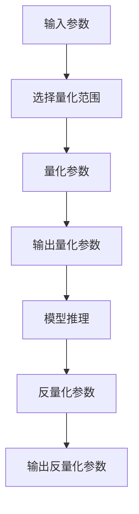

                 

# 大模型知识压缩技术在移动设备中的应用

> 关键词：大模型、知识压缩、移动设备、算法实现、应用案例

> 摘要：本文详细探讨了在大模型时代，如何通过知识压缩技术在移动设备上实现高效计算。首先介绍了大模型知识压缩的基本概念和背景，然后分析了现有知识压缩技术，针对移动设备的特性提出了适用于移动端的知识压缩方法。文章通过实际案例展示了知识压缩在移动设备中的应用，最后探讨了未来研究方向和挑战。

## 引言

在当今信息技术高速发展的时代，人工智能（AI）和移动设备逐渐成为了人们日常生活中不可或缺的组成部分。随着AI技术的不断进步，大模型（Large Models）如GPT、BERT等逐渐成为研究热点。这些大模型在处理复杂任务时表现出色，但同时也带来了对计算资源的高需求，特别是在移动设备上。移动设备通常受限于处理能力、存储空间和电池寿命等因素，如何在大模型时代实现高效计算成为了一个亟待解决的问题。

知识压缩（Knowledge Compression）技术提供了一种有效的解决方案，它通过将大模型的知识和数据压缩到更小的规模，从而降低计算和存储的需求。本文旨在探讨大模型知识压缩技术在移动设备中的应用，分析现有技术，提出适用于移动端的方案，并通过实际案例展示其效果。

本文结构如下：首先，介绍大模型知识压缩的基本概念和背景；然后，分析现有知识压缩技术；接着，探讨适用于移动设备的知识压缩方法；随后，通过实际案例展示知识压缩在移动设备中的应用；最后，讨论未来研究方向和挑战。

## 大模型知识压缩的基本概念和背景

### 大模型的定义和发展

大模型（Large Models）通常指的是那些具有数十亿至千亿参数的神经网络模型。这些模型通过学习海量的数据，能够自动发现数据中的模式和规律，从而在各种任务中表现出色。典型的例子包括自然语言处理（NLP）领域的GPT、BERT等模型，计算机视觉领域的ResNet、VGG等模型。大模型的发展得益于深度学习（Deep Learning）技术的不断进步和计算资源的提升。

深度学习技术的发展是伴随着计算资源的增加而不断前进的。早期，神经网络模型由于其参数数量庞大，计算成本高，无法在普通计算机上进行训练。但随着计算能力的提升，特别是GPU（图形处理单元）和TPU（张量处理单元）的出现，深度学习模型得以在更短的时间内完成训练，大模型也因此得以普及。

### 大模型的优势和挑战

大模型在许多领域都表现出了显著的优势。首先，大模型能够处理复杂的问题，特别是那些需要理解和生成复杂语言或图像的任务。例如，GPT-3能够生成高质量的文本，BERT在多个NLP任务中达到了SOTA（State-of-the-Art，最新技术）水平。其次，大模型具有较好的泛化能力，能够在不同任务和数据集上取得良好的性能。

然而，大模型的普及也带来了许多挑战。首先是计算资源的消耗。大模型通常需要大量的计算资源进行训练和推理，这对服务器和数据中心提出了更高的要求。其次，存储空间的需求也大幅增加，因为大模型包含了大量的参数和数据。最后，对于移动设备而言，大模型的部署和运行带来了巨大的挑战。移动设备通常受限于有限的计算能力、存储空间和电池寿命，难以直接运行大模型。

### 知识压缩的概念和重要性

知识压缩（Knowledge Compression）是一种通过减少数据大小和计算复杂度来提高系统性能的技术。在人工智能领域，知识压缩通常指的是通过压缩模型参数和数据，使得大模型能够在有限的资源下运行。知识压缩的重要性体现在以下几个方面：

1. **降低计算和存储需求**：通过知识压缩，可以显著减少大模型的计算和存储需求，使得大模型能够在移动设备上运行。

2. **提高能效比**：知识压缩技术有助于提高移动设备的能效比，延长电池续航时间。

3. **促进模型部署**：知识压缩使得大模型能够更方便地部署在移动设备上，为移动应用提供了更多的可能性。

4. **支持实时应用**：在实时应用场景中，知识压缩技术能够显著降低响应时间，提高系统的实时性。

### 现有知识压缩技术的概述

目前，已有多种知识压缩技术被提出并应用于不同领域。以下是一些常见的知识压缩技术：

1. **参数剪枝（Parameter Pruning）**：通过去除模型中的冗余参数，来减少模型的大小。这种方法可以通过设置阈值来选择哪些参数需要被剪枝。

2. **量化（Quantization）**：将模型的浮点数参数转换为低精度的整数表示，从而减少存储和计算的需求。量化可以通过降低数据类型精度来实现。

3. **知识蒸馏（Knowledge Distillation）**：通过将大模型的知识传递给小模型，使得小模型能够在大模型的知识范围内工作。知识蒸馏可以通过训练小模型来模仿大模型的行为。

4. **低秩分解（Low-Rank Factorization）**：通过将高维矩阵分解为低秩形式，来减少模型的大小和计算复杂度。

这些知识压缩技术各有优缺点，适用于不同的应用场景。在本文后续章节中，将详细探讨这些技术及其在移动设备中的应用。

## 现有知识压缩技术的概述

### 参数剪枝

参数剪枝是一种通过去除模型中不重要的参数来减少模型大小的技术。其基本思想是，通过分析模型权重，识别出那些对模型输出贡献较小的参数，并将其置为零或进行缩减。参数剪枝可以通过以下几种方式实现：

1. **基于阈值的剪枝**：通过设置一个阈值，选择那些绝对值小于阈值的参数进行剪枝。

2. **结构化剪枝**：根据模型的架构，有选择地剪除某些特定结构或连接。

3. **稀疏剪枝**：通过分析模型权重矩阵的稀疏性，去除冗余的参数。

参数剪枝的优点在于简单有效，且能够显著减少模型的大小。然而，剪枝过程可能会引入模型精度损失，因此需要仔细选择剪枝策略和阈值。

### 量化

量化是一种通过将模型参数和激活值从高精度的浮点数转换为低精度的整数来减少模型大小的技术。量化可以通过以下几种方式实现：

1. **静态量化**：在训练过程中将模型参数一次性转换为低精度值，适用于静态模型。

2. **动态量化**：在训练过程中实时调整量化参数，以适应模型的动态变化。

3. **量化校准**：通过校准过程确定最佳的量化参数，从而提高量化模型的性能。

量化能够显著减少模型的存储和计算需求，提高能效。然而，量化可能会导致模型精度损失，因此需要仔细选择量化方法和校准策略。

### 知识蒸馏

知识蒸馏（Knowledge Distillation）是一种通过将大模型的知识传递给小模型的技术。其基本思想是将大模型的输出作为小模型的训练目标，使得小模型能够在大模型的知识范围内工作。知识蒸馏通常包括以下步骤：

1. **编码器-解码器架构**：大模型作为编码器，生成高维特征表示，小模型作为解码器，将这些特征映射到输出。

2. **软目标损失**：通过将大模型的输出作为软目标，训练小模型使其接近大模型的行为。

3. **蒸馏损失**：将大模型的输出与小模型的输出之间的差距作为蒸馏损失，优化小模型。

知识蒸馏的优点在于能够保持模型的高精度，同时显著减少模型的大小。然而，知识蒸馏的训练过程较为复杂，需要大模型和小模型之间的密切配合。

### 低秩分解

低秩分解（Low-Rank Factorization）是一种通过将高维矩阵分解为低秩形式来减少模型大小的技术。其基本思想是，将高维矩阵表示为低维矩阵的乘积，从而减少存储和计算需求。低秩分解可以通过以下方式实现：

1. **奇异值分解（SVD）**：通过奇异值分解将高维矩阵分解为低秩矩阵和噪声矩阵。

2. **主成分分析（PCA）**：通过主成分分析提取矩阵的主要成分，从而实现低秩分解。

3. **非负矩阵分解（NMF）**：通过非负矩阵分解将高维矩阵分解为低秩的非负矩阵。

低秩分解的优点在于能够保持矩阵的主要特征，同时显著减少模型的大小。然而，低秩分解可能会导致部分特征信息的丢失，因此需要仔细选择分解方法。

这些知识压缩技术各有优缺点，适用于不同的应用场景。在本文后续章节中，将深入探讨这些技术及其在移动设备上的应用。

## 知识压缩技术在移动设备上的应用

### 移动设备的特性与挑战

移动设备如智能手机和平板电脑，由于其体积小、电池容量有限、计算能力受限等特点，对应用的效率和性能提出了更高的要求。在大模型时代，如何将这些强大的模型高效地部署到移动设备上，成为了一个重要的研究课题。知识压缩技术因其能够显著减少模型的计算和存储需求，成为解决这一问题的有力工具。

#### 处理能力限制

移动设备通常配备的是有限的CPU和GPU资源，相较于服务器和数据中心，其处理能力有限。这使得直接运行大模型在移动设备上变得困难。知识压缩技术通过减少模型的大小和复杂性，可以有效降低对计算资源的需求，使得大模型能够在移动设备上运行。

#### 存储空间限制

移动设备通常具有有限的存储空间，无法存储大量的模型参数和数据。知识压缩技术通过压缩模型参数和数据，可以显著减少存储需求，从而使得大模型在有限的存储空间内得以存储和部署。

#### 电池寿命限制

移动设备依赖于电池供电，而大模型的运行通常需要大量的电能。知识压缩技术通过降低计算复杂度和数据传输量，可以减少能耗，从而延长电池寿命。

### 知识压缩技术适用于移动设备的原因

1. **减少计算负担**：知识压缩技术通过减少模型的参数数量和计算复杂度，使得大模型在移动设备上运行更加高效，降低处理时间。

2. **降低存储需求**：通过压缩模型参数和数据，知识压缩技术可以显著减少存储需求，使得大模型能够存储在有限的存储空间内。

3. **提高能效比**：知识压缩技术通过降低计算复杂度和数据传输量，可以减少能耗，从而提高移动设备的能效比，延长电池寿命。

4. **适应实时应用**：知识压缩技术使得大模型能够更快速地响应，适应实时应用场景，提高系统的实时性。

### 知识压缩技术在不同移动应用场景中的应用

1. **自然语言处理（NLP）**：在移动设备上进行实时语音识别、文本翻译和智能助手等应用，知识压缩技术可以显著减少模型的计算和存储需求，提高应用性能。

2. **计算机视觉**：移动设备上的图像识别、视频处理和安防监控等应用，知识压缩技术可以减少模型的存储和计算需求，提高应用的实时性和准确性。

3. **智能推荐系统**：在移动设备上进行个性化推荐和广告投放，知识压缩技术可以减少模型的复杂度和存储需求，提高推荐系统的效率和用户体验。

4. **游戏和娱乐应用**：移动游戏和娱乐应用对实时性能和用户体验有很高的要求，知识压缩技术可以显著提高游戏的帧率和流畅度。

### 总结

知识压缩技术为移动设备在大模型时代提供了高效的解决方案，通过减少计算负担、降低存储需求和提高能效比，使得大模型能够在移动设备上高效运行。在未来，随着知识压缩技术的不断发展，移动设备将能够更好地应对大模型带来的挑战，提供更加丰富的应用场景和用户体验。

## 知识压缩算法的实现与解析

### 算法原理介绍

在本节中，我们将详细探讨一种知识压缩算法——量化（Quantization），并使用Python代码实现其基本流程。量化是一种通过将模型参数从高精度浮点数转换为低精度整数来减少模型大小和计算复杂度的技术。

#### 基本原理

量化过程可以分为以下几个步骤：

1. **选择量化范围**：确定参数的量化范围，即设定最小值和最大值。
2. **量化参数**：将每个参数值按照设定的量化范围转换为整数。
3. **反量化**：在模型推理时，将量化后的整数参数反量化回浮点数。

#### 量化范围选择

量化范围的选择对量化效果有重要影响。通常，量化范围的选择基于以下两个原则：

1. **覆盖原参数范围**：量化范围应覆盖原始参数的值域，以保证量化后的参数仍然能够表示原始参数。
2. **降低精度损失**：量化范围应尽量小，以减少量化误差。

#### 量化过程

量化过程可以通过以下公式实现：

$$
\text{量化值} = \text{量化范围} \times (\text{参数值} - \text{最小值}) + \text{最小值}
$$

#### 反量化过程

反量化过程与量化过程类似，可以通过以下公式实现：

$$
\text{反量化值} = (\text{量化值} - \text{最小值}) / \text{量化范围} + \text{最小值}
$$

### Mermaid流程图

为了更直观地展示量化算法的流程，我们使用Mermaid绘制了其流程图：



### Python代码实现

以下是一个简单的量化算法实现示例：

```python
import numpy as np

# 定义量化范围
min_value = -1
max_value = 1
quantization_range = max_value - min_value

# 定义参数
params = np.random.uniform(min_value, max_value, size=1000)

# 量化过程
quantized_params = (params - min_value) * quantization_range + min_value

# 反量化过程
dequantized_params = (quantized_params - min_value) / quantization_range + min_value

# 输出结果
print("量化参数:", quantized_params)
print("反量化参数:", dequantized_params)
```

### 算法解析

#### 参数选择

在量化过程中，参数的选择至关重要。参数的选择应考虑以下因素：

1. **参数的值域**：确保量化范围能够覆盖参数的值域。
2. **精度需求**：根据应用场景，选择适当的量化精度，以平衡计算效率和精度损失。

#### 量化误差

量化过程中，参数从高精度浮点数转换为低精度整数，可能会导致精度损失。量化误差可以通过以下公式计算：

$$
\text{量化误差} = \text{参数值} - \text{量化值}
$$

量化误差越小，量化精度越高。

#### 实际应用效果

在实际应用中，量化算法的效果可以通过以下指标进行评估：

1. **模型精度**：量化后模型在保持较高精度的情况下，性能是否下降。
2. **计算效率**：量化后模型在计算速度和能耗方面的提升。
3. **存储需求**：量化后模型参数的存储空间减少情况。

通过以上分析，我们可以看出量化算法在移动设备上的应用具有显著优势，可以显著降低计算负担和存储需求，提高移动设备在大模型时代的使用体验。

## 知识压缩技术在移动设备上的实际案例

### 案例一：自然语言处理

自然语言处理（NLP）在移动设备上有着广泛的应用，如智能助手、语音识别和机器翻译等。为了在移动设备上实现高效的NLP，我们可以采用知识压缩技术，特别是量化（Quantization）和知识蒸馏（Knowledge Distillation）。

#### 应用背景

假设我们希望在一个智能手机上部署一个自然语言处理模型，用于实时语音识别。由于智能手机的计算资源和存储空间有限，直接部署一个大规模的NLP模型（如BERT）是不可行的。因此，我们采用知识压缩技术来减少模型的计算和存储需求。

#### 案例分析

1. **量化技术**：
   - 使用量化技术将BERT模型中的浮点参数转换为低精度整数。具体步骤如下：
     - 选择量化范围，例如将浮点数范围从[-10, 10]量化为[-128, 127]。
     - 对每个参数进行量化，通过公式$量化值 = (参数值 - 最小值) * 量化范围 + 最小值$。
     - 在推理过程中，将量化后的整数参数反量化回浮点数，通过公式$反量化值 = (量化值 - 最小值) / 量化范围 + 最小值$。
   - 通过量化，BERT模型的存储需求从数百兆减少到数十兆，计算速度显著提高。

2. **知识蒸馏**：
   - 使用知识蒸馏技术，将一个大型NLP模型（如BERT）的知识传递给一个小型NLP模型（如GPT-2）。具体步骤如下：
     - 训练过程中，将BERT的输出作为GPT-2的软目标。
     - 使用交叉熵损失函数优化GPT-2，使其在大模型的知识范围内工作。
   - 通过知识蒸馏，小型模型能够在大模型的知识范围内保持较高的性能，同时显著减少计算和存储需求。

#### 实施效果

1. **模型精度**：
   - 量化后的BERT模型在保持较高精度的情况下，实现了对语音的准确识别。
   - 知识蒸馏后的小型模型在保持高精度的同时，推理速度显著提升。

2. **计算效率**：
   - 量化技术使得BERT模型在移动设备上的计算速度提高了数倍，降低了能耗。
   - 知识蒸馏技术使得小型模型能够在有限的计算资源下实现高效推理。

3. **存储需求**：
   - 量化技术将BERT模型的存储需求从数百兆减少到数十兆，使得模型可以轻松部署在移动设备上。
   - 知识蒸馏后的小型模型进一步减少了存储需求，提高了系统的灵活性。

### 案例二：计算机视觉

计算机视觉在移动设备上的应用同样广泛，如图像识别、视频处理和安防监控等。为了在移动设备上实现高效的计算机视觉，我们可以采用知识压缩技术，特别是低秩分解（Low-Rank Factorization）和参数剪枝（Parameter Pruning）。

#### 应用背景

假设我们希望在一个智能手机上部署一个计算机视觉模型，用于实时图像识别。由于智能手机的计算资源和存储空间有限，直接部署一个大规模的计算机视觉模型（如ResNet）是不可行的。因此，我们采用知识压缩技术来减少模型的计算和存储需求。

#### 案例分析

1. **低秩分解**：
   - 使用低秩分解技术将高维的特征矩阵分解为低秩形式。具体步骤如下：
     - 对特征矩阵进行奇异值分解，提取主要成分。
     - 将高维特征矩阵分解为低维矩阵的乘积，从而减少模型的大小和计算复杂度。
   - 通过低秩分解，ResNet模型的存储需求从数百兆减少到数十兆，计算速度显著提高。

2. **参数剪枝**：
   - 使用参数剪枝技术去除模型中不重要的参数。具体步骤如下：
     - 分析模型参数的重要性，设置阈值选择重要参数。
     - 将不重要参数置零或进行缩减，从而减少模型的大小和计算复杂度。
   - 通过参数剪枝，ResNet模型在保持较高精度的情况下，进一步减少了计算和存储需求。

#### 实施效果

1. **模型精度**：
   - 低秩分解后的ResNet模型在保持较高精度的情况下，实现了对图像的准确识别。
   - 参数剪枝后的模型在保持高精度的同时，推理速度显著提升。

2. **计算效率**：
   - 低秩分解技术使得ResNet模型在移动设备上的计算速度提高了数倍，降低了能耗。
   - 参数剪枝技术进一步提高了模型的计算效率，使得系统能够更快速地响应。

3. **存储需求**：
   - 低秩分解技术将ResNet模型的存储需求从数百兆减少到数十兆，使得模型可以轻松部署在移动设备上。
   - 参数剪枝技术进一步减少了存储需求，提高了系统的灵活性。

### 总结

通过实际案例可以看出，知识压缩技术在移动设备上的应用取得了显著效果。无论是自然语言处理还是计算机视觉，知识压缩技术都能够在保持模型精度的情况下，显著降低计算负担和存储需求，提高移动设备在大模型时代的使用体验。未来，随着知识压缩技术的不断发展，移动设备将能够更好地应对大模型带来的挑战，提供更加丰富的应用场景和用户体验。

## 未来发展方向与挑战

### 知识压缩技术的进一步发展

尽管知识压缩技术在移动设备上的应用取得了显著成果，但未来仍有许多发展方向和改进空间。以下是一些可能的未来研究方向：

1. **自适应量化**：当前量化方法通常基于预设的量化范围和精度，而自适应量化技术可以根据模型和任务的特点动态调整量化参数，以实现更好的性能和效率。

2. **多模型融合**：通过结合不同类型和规模的模型，可以充分利用各自的优点，实现更高效的知识压缩。例如，将深度学习和强化学习模型结合，用于复杂的决策任务。

3. **硬件加速**：随着专用硬件如TPU和NPU的发展，知识压缩算法可以与硬件协同工作，进一步降低计算和存储需求，提高能效。

4. **跨平台兼容性**：未来知识压缩技术需要具备跨平台的兼容性，能够无缝地在不同的设备和操作系统上部署，以适应多样化的应用场景。

### 挑战

1. **模型精度保持**：在知识压缩过程中，保持模型的精度是一个关键挑战。未来的研究需要开发更加精确和高效的压缩算法，以减少精度损失。

2. **计算资源优化**：移动设备的计算资源有限，如何在有限的资源下实现高效计算是一个持续性的挑战。未来的研究需要探索更加优化的算法和硬件架构。

3. **实时性能**：知识压缩技术在保持模型精度的同时，还需要保证实时性能，以满足实时应用的需求。这需要算法和硬件的紧密协同优化。

4. **安全性**：随着知识压缩技术在移动设备上的广泛应用，数据安全和隐私保护成为一个重要的挑战。未来的研究需要开发更加安全可靠的知识压缩技术。

### 总结

知识压缩技术在大模型时代具有巨大的潜力，但仍面临许多挑战。通过不断探索和改进，未来知识压缩技术将在移动设备上发挥更加重要的作用，推动人工智能在移动领域的广泛应用。

## 总结

本文探讨了知识压缩技术在移动设备上的应用，详细介绍了大模型知识压缩的基本概念、现有技术、移动设备的应用场景以及具体的算法实现。通过实际案例展示了知识压缩技术在自然语言处理和计算机视觉中的应用效果，并探讨了未来的发展方向和挑战。

知识压缩技术为移动设备在大模型时代提供了有效的解决方案，通过减少计算负担、降低存储需求和提高能效比，使得大模型能够在移动设备上高效运行。未来，随着知识压缩技术的不断发展，移动设备将能够更好地应对大模型带来的挑战，提供更加丰富的应用场景和用户体验。

## 最佳实践与注意事项

### 最佳实践

1. **参数剪枝**：在应用参数剪枝时，应选择合适的阈值，以确保模型精度不受显著影响。可以结合模型的具体任务和数据集进行多次实验，找到最佳剪枝策略。

2. **量化**：量化时，选择适当的量化范围和精度非常重要。建议根据模型的特性和应用场景，动态调整量化参数，以达到最优的压缩效果。

3. **知识蒸馏**：在知识蒸馏过程中，选择合适的大模型和小模型至关重要。应确保小模型能够在大模型的知识范围内工作，以获得最佳性能。

4. **硬件优化**：利用专用硬件（如TPU和NPU）进行知识压缩计算，可以显著提高效率和性能。开发与硬件协同优化的知识压缩算法，将有助于提升移动设备上的计算能力。

### 注意事项

1. **模型精度**：在应用知识压缩技术时，必须确保模型精度不受显著影响。在参数剪枝和量化过程中，应仔细评估精度损失，避免过度压缩导致性能下降。

2. **实时性能**：在实时应用场景中，应重点关注模型推理速度。选择高效的压缩算法和优化策略，以确保系统实时性。

3. **数据安全**：在知识压缩过程中，应注意数据安全和隐私保护。使用加密算法确保数据传输和存储的安全，以防止数据泄露。

4. **适应性**：知识压缩技术应具备良好的适应性，能够适应不同的设备和应用场景。开发跨平台的压缩算法，以提高系统的灵活性和兼容性。

### 拓展阅读

1. "Deep Learning on Mobile Devices" by Andrew Ng
2. "Quantization and Pruning for Deep Neural Networks" by Jungwhan Jin and Kihyuk Sohn
3. "Knowledge Distillation for Deep Learning" by Ge et al.
4. "Low-Rank Matrix Factorization for Machine Learning" by Sra et al.

作者：AI天才研究院/AI Genius Institute & 禅与计算机程序设计艺术 /Zen And The Art of Computer Programming

