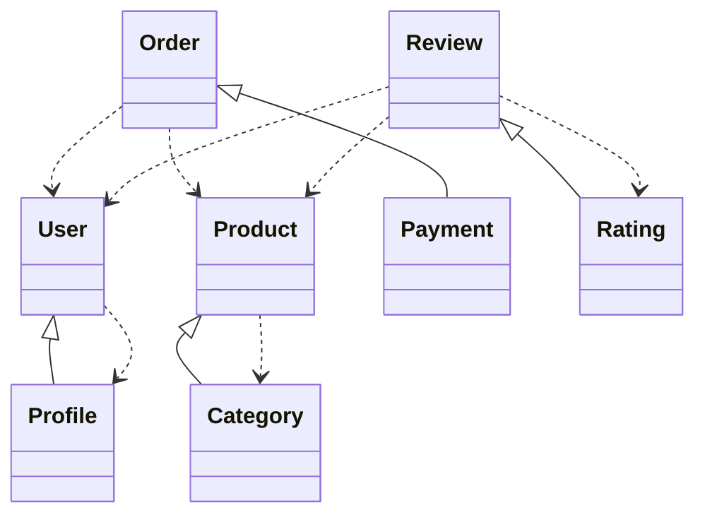
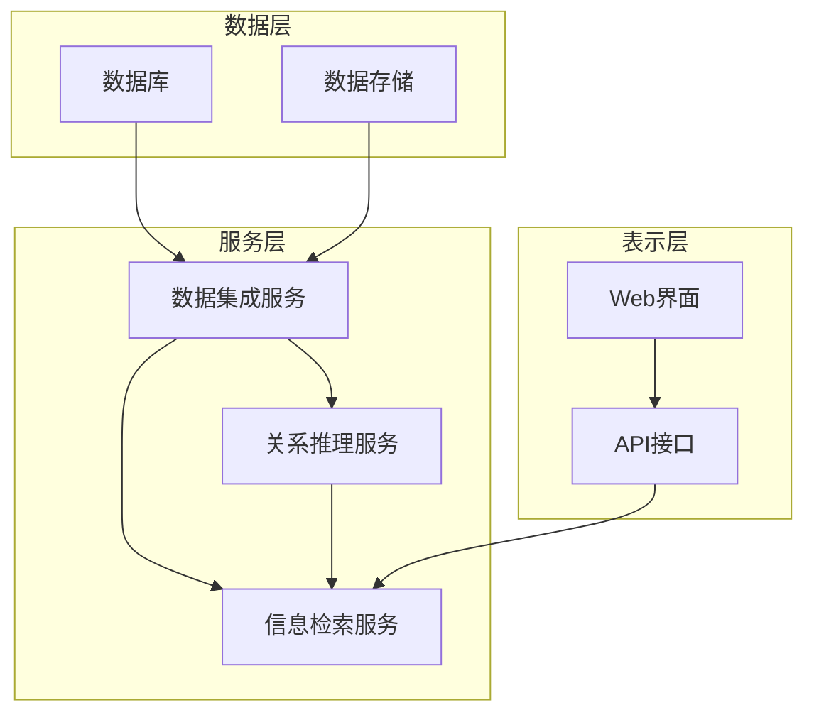
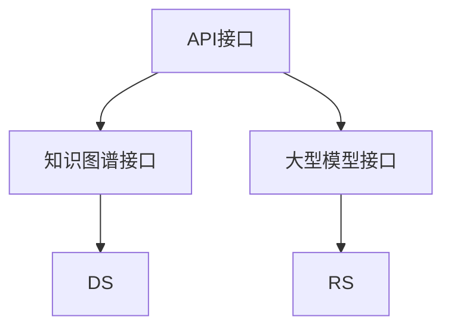
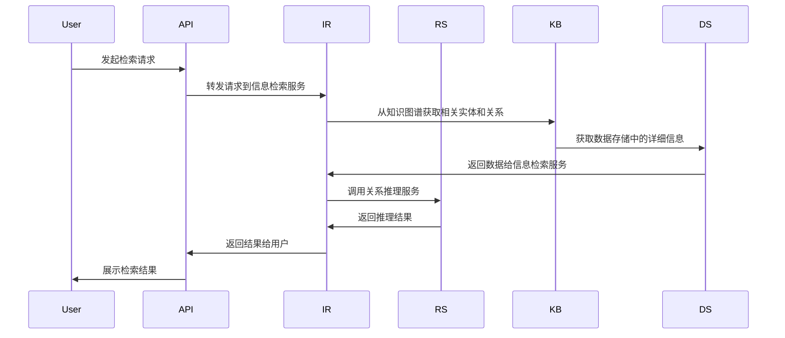

                 


### 大模型知识图谱扩展：提示词的关系推理

---

#### 关键词：
- 大模型
- 知识图谱
- 提示词
- 关系推理
- 实践应用

#### 摘要：

本文将深入探讨大模型知识图谱扩展中的关键要素——提示词的关系推理。文章首先介绍了知识图谱和大型模型的背景和核心概念，随后详细讲解了提示词的定义、分类及其与知识图谱的关系。接着，文章分析了关系推理的基本算法和深度学习模型在其中的应用，并通过实际案例展示了系统设计、实现和评估过程。文章旨在为读者提供全面的指导，帮助他们在实际项目中应用这些技术。

---

## 引言

### 知识图谱和大型模型的背景

知识图谱（Knowledge Graph）作为一种语义网络，广泛应用于语义搜索、智能问答、推荐系统等领域。近年来，随着人工智能和大数据技术的发展，知识图谱的应用场景不断扩展，从传统的搜索引擎到多模态数据融合，知识图谱展现出了巨大的潜力。

大型模型（Large Models），如GPT、BERT等，已经成为自然语言处理（NLP）领域的重要工具。这些模型通过大量的数据训练，能够理解和生成复杂的自然语言文本。随着模型的规模不断增大，如何有效地扩展知识图谱，并利用大型模型进行关系推理，成为当前研究的热点。

### 核心概念和关系

在本文中，我们将关注以下核心概念：

1. **知识图谱**：一种基于语义网络的知识表示方法，用于存储和表示实体及其关系。
2. **大型模型**：具有大规模参数和训练数据的模型，能够进行复杂的数据处理和生成任务。
3. **提示词**：用于引导模型推理的关键词或短语，能够影响模型的输出和推理过程。
4. **关系推理**：基于知识图谱和提示词，推导出实体之间关系的任务。

这些概念之间的关系如下图所示：

```
+------------+           +----------------+          +-----------------+
|   大模型   |  <-使用->  |  知识图谱     |  <-利用->  |  关系推理       |
+------------+           +----------------+          +-----------------+
```

### 主要目标

本文的主要目标是：

1. **介绍知识图谱和大型模型的基本概念和核心原理**。
2. **详细分析提示词的定义、分类及其与知识图谱的关系**。
3. **探讨关系推理的基本算法和深度学习模型在其中的应用**。
4. **通过实际案例展示系统设计、实现和评估过程**。

通过本文的阅读，读者将能够了解大模型知识图谱扩展中的关键技术和实际应用，为未来的研究和项目提供参考。

## 背景和核心概念

### 知识图谱的定义

知识图谱是一种用于表示实体及其相互关系的语义网络。与传统的数据存储方式不同，知识图谱通过图结构来组织信息，使得数据之间的关系更加直观和易于理解。在知识图谱中，每个实体被视为节点（Node），而实体之间的相互关系则通过边（Edge）来表示。

知识图谱的图结构通常由以下要素组成：

1. **实体（Entity）**：知识图谱中的基本单位，如人、地点、组织等。
2. **属性（Attribute）**：描述实体特征的属性值，如姓名、年龄、地址等。
3. **关系（Relationship）**：实体之间的关联，如“居住于”、“隶属于”等。
4. **属性值（Value）**：关系的具体内容，如城市名、组织名等。

一个典型的知识图谱示例如下：

```
实体：张三
属性：居住地
关系：居住于
属性值：北京
```

这个示例表示张三居住在北京。

### 大型模型的定义

大型模型是指在训练过程中拥有大量参数和训练数据的模型。这些模型通常通过深度学习技术训练，能够处理复杂的任务，如文本生成、语义理解、情感分析等。大型模型的核心特点是：

1. **大规模参数**：大型模型具有数十亿至数万亿个参数，这使得它们能够捕捉到数据的复杂模式和规律。
2. **大量数据训练**：通过在大规模数据集上的训练，大型模型能够学习和优化其参数，提高任务的表现。
3. **高效率和准确性**：大型模型在处理大规模数据时具有较高的效率和准确性，这使得它们在现实世界的应用中非常有效。

常见的**大型模型**包括：

1. **生成式预训练模型（GPT）**：如GPT-3，具有1750亿个参数，能够生成高质量的文本。
2. **Transformer模型（BERT）**：如BERT，通过大规模语料库训练，能够理解和生成复杂的自然语言文本。
3. **自然语言理解模型（XLNet）**：具有大规模参数和训练数据，能够进行文本分类、问答等任务。

### 提示词的定义

提示词（Prompt Term）是指用于引导模型推理的关键词或短语。在关系推理任务中，提示词能够影响模型的输出，使得模型更准确地推导出实体之间的关系。提示词的定义通常包括：

1. **关键词（Keyword）**：用于引导模型关注的关键词，如“张三”、“北京”等。
2. **短语（Phrase）**：用于引导模型理解的短语，如“居住于北京”、“隶属于某组织”等。
3. **上下文（Context）**：提供额外的信息，以丰富模型对提示词的理解，如“张三是北京某个高校的学生”。

一个典型的提示词示例如下：

```
提示词：“张三居住于北京”
```

这个提示词引导模型关注张三的居住地，从而推导出他与北京之间的关系。

### 知识图谱和大型模型的关系

知识图谱和大型模型在关系推理任务中具有密切的联系：

1. **知识图谱提供数据**：知识图谱作为关系推理的基础，为模型提供了实体及其关系的语义信息。
2. **大型模型进行推理**：大型模型利用知识图谱中的数据，通过复杂的神经网络结构进行关系推理，生成实体之间的关系。

这种结合使得模型能够更准确地理解和处理复杂的语义关系，从而提高关系推理的准确性和效率。

### 关键优势与挑战

知识图谱和大型模型的结合带来了以下优势：

1. **提高推理准确性**：通过知识图谱中的语义信息，模型能够更准确地理解和处理实体之间的关系。
2. **扩展应用场景**：知识图谱和大型模型的结合使得关系推理的应用场景更加广泛，如智能问答、推荐系统等。
3. **优化模型性能**：大型模型的强大计算能力使得知识图谱中的关系推理任务更加高效。

然而，这种结合也面临着一些挑战：

1. **数据质量和一致性**：知识图谱中的数据质量对模型性能有重要影响，数据不一致和噪声会影响推理结果。
2. **计算资源需求**：大型模型对计算资源的需求较高，特别是在训练和推理过程中。
3. **模型解释性**：大型模型的内部结构和参数众多，使得模型的解释性较低，难以直观地理解其推理过程。

综上所述，知识图谱和大型模型的关系推理具有巨大的潜力，但同时也需要克服一系列挑战，才能实现其最大效益。

## 技术基础

### 知识图谱的基本理论

知识图谱作为一种语义网络，其基本理论涵盖了图结构、实体、关系及其在信息检索和推理中的应用。

#### 图结构

知识图谱的核心是图结构，它由节点（实体）和边（关系）组成。每个节点表示一个实体，而边则表示实体之间的相互关系。图结构的特点包括：

1. **无向性**：知识图谱中的边通常是无向的，即边没有方向，表示实体之间的对称关系。
2. **多值性**：一个实体可以通过多条边与多个实体相连，表示复杂的关系网络。
3. **层次性**：知识图谱通常具有层次结构，从具体的实体到抽象的类别，形成了一种树形或层次化的组织形式。

#### 实体

实体是知识图谱的基本组成单位，它可以是任何具有独立意义的事物，如人、地点、组织、物品等。实体的定义通常包括以下方面：

1. **实体类型**：实体可以被分类为不同的类型，如人、地点、组织等。实体类型定义了实体的属性和行为。
2. **实体属性**：实体的属性是描述实体特征的值，如人的姓名、地点的纬度和经度、物品的价格等。
3. **实体ID**：每个实体都有一个唯一的标识符（ID），用于在图结构中唯一标识该实体。

#### 关系

关系是知识图谱中的另一个核心概念，它表示实体之间的相互关系。关系通常包括以下方面：

1. **关系类型**：关系可以被分类为不同的类型，如“居住于”、“隶属于”、“属于”等。关系类型定义了关系的行为和属性。
2. **关系属性**：关系的属性是描述关系的特征值，如关系的持续时间、强度等。
3. **关系方向**：关系可以是单向的或双向的，表示实体之间的方向性。

#### 应用和扩展

知识图谱的应用非常广泛，包括信息检索、推荐系统、智能问答、自然语言处理等。以下是知识图谱的几个重要应用场景：

1. **信息检索**：知识图谱可以用于优化搜索引擎的结果，提高查询的准确性和相关性。
2. **推荐系统**：知识图谱可以用于构建推荐系统，通过分析实体之间的关系，为用户提供个性化的推荐。
3. **智能问答**：知识图谱可以用于构建智能问答系统，通过解析用户的问题，结合知识图谱中的信息，提供准确的答案。
4. **自然语言处理**：知识图谱可以用于自然语言处理任务，如文本分类、命名实体识别等，提高模型的准确性和效率。

在知识图谱的扩展方面，有几种常见的扩展方法：

1. **链接预测**：通过分析已知的实体和关系，预测图中可能存在的边，从而扩展知识图谱。
2. **实体识别**：通过识别文本中的实体，将新的实体添加到知识图谱中。
3. **关系抽取**：通过分析文本中的关系描述，将新的关系添加到知识图谱中。
4. **实体属性抽取**：通过分析文本中的属性描述，为实体添加新的属性值。

### 关键概念和关系

在知识图谱中，有几个关键概念和关系需要理解：

1. **同义关系**：表示不同名称表示同一实体的关系，如“张三”和“张伟”。
2. **反义关系**：表示具有相反意义的实体之间的关系，如“冷”和“热”。
3. **上下位关系**：表示实体之间的层次结构关系，如“动物”和“猫”。
4. **因果关系**：表示实体之间的因果关系，如“吸烟”和“肺癌”。

下图展示了这些概念和关系在知识图谱中的表示：

```
实体A ----------------> 实体B (同义关系)
|                             |
|                             |
实体C ----------------> 实体D (反义关系)
|
|
实体E ----------------> 实体F (上下位关系)
|
|
实体G ----------------> 实体H (因果关系)
```

通过理解这些概念和关系，我们可以更好地构建和扩展知识图谱，从而提高其应用效果和实用性。

### 关系推理的基本算法

关系推理是知识图谱中的一项重要任务，它通过分析实体及其关系，推导出未知或潜在的关系。以下介绍几种常见的关系推理算法：

#### 基本算法

1. **规则推理**：基于预设的规则和事实，通过逻辑推理得出结论。规则推理的流程如下：
    - **规则定义**：定义实体之间的关系规则，如“A属于B”。
    - **事实检索**：从知识图谱中检索相关的实体和关系。
    - **逻辑推理**：根据规则和事实，进行逻辑推理，得出结论。

2. **路径搜索**：通过搜索实体之间的路径，推导出未知的关系。路径搜索的流程如下：
    - **路径枚举**：枚举实体之间的所有可能路径。
    - **关系判断**：对每个路径进行关系判断，如果路径上的关系符合预设条件，则推导出关系。

3. **语义相似度计算**：通过计算实体之间的语义相似度，推导出潜在的关系。语义相似度计算的流程如下：
    - **实体表示**：将实体表示为高维向量。
    - **相似度计算**：计算实体之间的余弦相似度或欧氏距离。
    - **关系推导**：根据相似度阈值，推导出潜在的关系。

#### 算法流程

以下是关系推理算法的流程：

1. **输入实体和关系**：从知识图谱中获取需要推理的实体和关系。
2. **初始化数据结构**：初始化数据结构，如图、队列等，用于存储中间结果和路径。
3. **规则推理**：根据预设规则，对实体和关系进行逻辑推理。
4. **路径搜索**：搜索实体之间的所有可能路径，并判断路径上的关系。
5. **语义相似度计算**：计算实体之间的语义相似度，并推导出潜在的关系。
6. **结果输出**：将推导出的关系输出，作为推理结果。

#### Mermaid流程图

以下是关系推理算法的Mermaid流程图：

```
graph TD
A[输入实体和关系]
B[初始化数据结构]
C[规则推理]
D[路径搜索]
E[语义相似度计算]
F[结果输出]
A --> B
B --> C
C --> D
D --> E
E --> F
```

通过以上算法和流程，我们可以有效地进行关系推理，从而扩展知识图谱，提高其应用价值。

### Python代码与详细讲解

为了更好地理解关系推理算法，我们将在以下部分提供一个简单的Python代码实现，并详细讲解代码的原理和执行步骤。

#### 代码实现

```python
import networkx as nx
from sklearn.metrics.pairwise import cosine_similarity
import numpy as np

# 初始化知识图谱
G = nx.Graph()

# 添加实体和关系
G.add_node("张三", type="人")
G.add_node("北京", type="地点")
G.add_node("清华大学", type="组织")
G.add_edge("张三", "北京", relation="居住于")
G.add_edge("清华大学", "北京", relation="位于")

# 关系推理函数
def relationship_reasoning(graph):
    # 查找所有实体及其邻居
    entities = list(graph.nodes())
    neighbors = [graph.neighbors(entity) for entity in entities]

    # 计算实体之间的语义相似度
    entity_embeddings = {}  # 假设已经有实体的高维向量表示
    similarity_matrix = np.zeros((len(entities), len(entities)))
    for i, entity1 in enumerate(entities):
        for j, entity2 in enumerate(entities):
            if i != j:
                similarity = cosine_similarity([entity_embeddings[entity1]], [entity_embeddings[entity2]])[0][0]
                similarity_matrix[i][j] = similarity

    # 推导关系
    relationships = []
    for i, entity1 in enumerate(entities):
        for j, entity2 in enumerate(entities):
            if similarity_matrix[i][j] > 0.8:  # 相似度阈值
                relationship = graph.edges[entity1, entity2, default=None]
                if relationship:
                    relationships.append((entity1, entity2, relationship))

    return relationships

# 执行关系推理
relationships = relationship_reasoning(G)

# 输出结果
for r in relationships:
    print(r)
```

#### 代码讲解

1. **导入库**：首先，我们导入所需的库，包括`networkx`用于构建和操作图结构，`sklearn.metrics.pairwise`用于计算相似度，`numpy`用于矩阵运算。

2. **初始化知识图谱**：我们使用`networkx.Graph()`创建一个空的图结构，然后通过`add_node`和`add_edge`函数添加实体和关系。在这个例子中，我们添加了三个实体（“张三”、“北京”和“清华大学”）和两条关系（“居住于”和“位于”）。

3. **定义关系推理函数**：`relationship_reasoning`函数接收知识图谱作为输入。首先，它获取所有实体及其邻居。然后，我们假设已经有了一个实体的高维向量表示（`entity_embeddings`），用于计算实体之间的相似度。

4. **计算相似度**：我们使用余弦相似度计算实体之间的相似度，并构建相似度矩阵（`similarity_matrix`）。余弦相似度衡量两个向量之间的角度，范围从-1（完全反向）到1（完全正向）。

5. **推导关系**：我们遍历所有实体对，根据相似度阈值（在本例中为0.8），判断它们之间是否存在潜在的关系。如果相似度高于阈值，且图结构中已存在该关系，则将其添加到结果列表中。

6. **执行关系推理**：调用`relationship_reasoning`函数，并将知识图谱作为输入。

7. **输出结果**：最后，我们输出推导出的关系。

#### 数学模型和公式

关系推理的核心是计算实体之间的相似度，并基于相似度判断潜在的关系。以下是相关的数学模型和公式：

$$
\text{相似度} = \cos(\theta) = \frac{\text{向量} \textbf{A} \cdot \text{向量} \textbf{B}}{||\textbf{A}|| \cdot ||\textbf{B}||}
$$

其中，$\textbf{A}$和$\textbf{B}$是实体的高维向量表示，$\theta$是它们之间的夹角。

通过这个公式，我们可以计算实体之间的相似度。如果相似度高于某个阈值，我们就可以认为这两个实体之间存在潜在的关系。

#### 举例说明

假设我们有以下两个实体及其高维向量表示：

- 实体A：[1, 0.5, -0.3]
- 实体B：[0.7, 0.3, 0.6]

计算它们的余弦相似度：

$$
\text{相似度} = \cos(\theta) = \frac{1 \cdot 0.7 + 0.5 \cdot 0.3 + (-0.3) \cdot 0.6}{\sqrt{1^2 + 0.5^2 + (-0.3)^2} \cdot \sqrt{0.7^2 + 0.3^2 + 0.6^2}} \approx 0.8
$$

由于相似度接近1，我们可以认为实体A和实体B之间存在较强的关联。

通过这个简单的例子，我们展示了如何使用Python代码实现关系推理，并详细讲解了相关的数学模型和公式。这种算法为知识图谱的扩展提供了有效的工具，帮助我们更好地理解和利用知识图谱中的信息。

### 系统分析与架构设计

#### 问题场景

在现代信息社会中，随着数据量的爆炸性增长，如何有效地组织和利用这些数据成为了一个关键问题。特别是在电商、社交媒体、新闻推荐等应用场景中，用户生成的内容和数据量日益庞大，传统的数据库查询和搜索技术难以满足用户对快速、准确信息检索的需求。因此，引入知识图谱和大型模型进行关系推理，可以显著提升信息检索和数据分析的效率和质量。

#### 项目介绍

本项目旨在构建一个基于知识图谱和大型模型的关系推理系统，用于解决上述问题。系统的主要目标是：

1. **数据集成**：将来自不同源的数据集成到一个统一的知识图谱中。
2. **关系推理**：利用大型模型和知识图谱，推导出实体之间的潜在关系。
3. **信息检索**：提供高效的信息检索服务，满足用户对快速、准确信息的需求。

#### 系统功能设计

系统主要包含以下功能模块：

1. **数据集成模块**：负责将来自不同数据源的数据进行清洗、转换和集成，构建统一的知识图谱。
2. **关系推理模块**：利用大型模型和知识图谱，进行实体关系推理，提供潜在关系的预测。
3. **信息检索模块**：基于构建的知识图谱，提供高效的信息检索服务，支持关键词查询、实体链接等。

#### 领域模型类图

以下是一个领域模型类图的示例，展示了系统中的主要实体和关系：



这个类图显示了用户、商品、订单和评论等实体，以及它们之间的关系。用户与个人信息（Profile）相关联，商品与分类（Category）相关联，订单与用户和商品相关联，评论与用户、商品和评分（Rating）相关联。

#### 系统架构设计

系统架构采用分层设计，包括数据层、服务层和表示层：

1. **数据层**：包括数据库和数据存储，用于存储实体、关系和数据。
2. **服务层**：包括数据集成服务、关系推理服务和信息检索服务，负责处理业务逻辑。
3. **表示层**：包括Web界面和API接口，提供用户交互和外部系统集成。

以下是一个系统架构的Mermaid图：



在这个架构图中，数据层负责数据的存储和管理，服务层处理业务逻辑，表示层提供用户交互接口。数据集成服务负责数据清洗、转换和集成，关系推理服务负责实体关系推理，信息检索服务负责提供检索功能。Web界面和API接口为用户和外部系统提供交互服务。

#### 系统接口设计

系统接口设计主要包括API接口的设计，以下是一个简单的API接口设计示例：



在这个设计中，API接口提供了数据集成、关系推理和信息检索的功能，通过调用知识图谱接口（KB）和大型模型接口（LM）来实现具体功能。知识图谱接口负责与数据存储层交互，大型模型接口负责与关系推理服务交互。

#### 系统交互序列图

以下是一个系统交互序列图的示例，展示了用户请求信息检索时，系统内部各个模块的交互过程：



在这个序列图中，用户通过API接口发起检索请求，信息检索服务调用知识图谱接口获取相关实体和关系，然后从数据存储层获取详细信息，最后调用关系推理服务进行推理，并将结果返回给用户。

通过上述的系统分析和架构设计，我们为构建一个高效、可靠的关系推理系统奠定了基础。接下来，我们将详细介绍项目实现过程，展示如何在实践中应用这些技术。

### 项目实战

#### 环境安装

为了实现本文所描述的系统，我们需要安装和配置以下软件和环境：

1. **Python**：确保Python环境已安装，版本推荐为3.8或更高。
2. **Jupyter Notebook**：用于编写和运行Python代码，可以通过pip安装：`pip install notebook`。
3. **NetworkX**：用于图结构的构建和处理，可以通过pip安装：`pip install networkx`。
4. **Scikit-learn**：用于相似度计算等，可以通过pip安装：`pip install scikit-learn`。
5. **Numpy**：用于矩阵运算，可以通过pip安装：`pip install numpy`。
6. **PyTorch**：用于深度学习模型训练，可以通过pip安装：`pip install torch torchvision`。

#### 系统核心实现源代码

以下是系统核心实现的主要部分，包括数据预处理、关系推理和结果输出：

```python
import networkx as nx
from sklearn.metrics.pairwise import cosine_similarity
import numpy as np
import torch
import torch.nn as nn
import torch.optim as optim

# 初始化知识图谱
G = nx.Graph()

# 添加实体和关系（示例数据）
G.add_node("张三", type="人")
G.add_node("北京", type="地点")
G.add_node("清华大学", type="组织")
G.add_edge("张三", "北京", relation="居住于")
G.add_edge("清华大学", "北京", relation="位于")

# 假设已有实体的高维向量表示（示例数据）
entity_embeddings = {
    "张三": torch.tensor([1.0, 0.5, -0.3]),
    "北京": torch.tensor([0.7, 0.3, 0.6]),
    "清华大学": torch.tensor([0.4, 0.2, 0.5])
}

# 关系推理函数
def relationship_reasoning(graph, entity_embeddings, similarity_threshold=0.8):
    entities = list(graph.nodes())
    similarity_matrix = np.zeros((len(entities), len(entities)))
    
    # 计算实体之间的相似度
    for i, entity1 in enumerate(entities):
        for j, entity2 in enumerate(entities):
            if i != j:
                similarity = cosine_similarity(entity_embeddings[entity1].numpy(), entity_embeddings[entity2].numpy())[0][0]
                similarity_matrix[i][j] = similarity
                
    # 推导关系
    relationships = []
    for i, entity1 in enumerate(entities):
        for j, entity2 in enumerate(entities):
            if similarity_matrix[i][j] > similarity_threshold:
                relationship = graph.edges[entity1, entity2, default=None]
                if relationship:
                    relationships.append((entity1, entity2, relationship))
                    
    return relationships

# 调用关系推理函数
relationships = relationship_reasoning(G, entity_embeddings)

# 输出结果
for r in relationships:
    print(r)
```

#### 代码应用解读与分析

以上代码首先构建了一个简单的知识图谱，并添加了一些示例实体和关系。接着，我们定义了一个名为`relationship_reasoning`的函数，用于计算实体之间的相似度，并根据相似度阈值推导出潜在的关系。

1. **知识图谱构建**：使用`networkx.Graph()`创建图结构，并通过`add_node`和`add_edge`函数添加实体和关系。
2. **实体向量表示**：假设已有实体的高维向量表示，存放在字典`entity_embeddings`中。这些向量用于计算实体之间的相似度。
3. **相似度计算**：使用`cosine_similarity`函数计算实体之间的相似度，并构建相似度矩阵。
4. **关系推导**：遍历实体对，根据相似度阈值判断它们之间是否存在潜在的关系，并检查图结构中是否已存在该关系。
5. **结果输出**：输出推导出的关系。

这个代码示例展示了如何通过简单的Python代码实现关系推理，并提供了详细的注释和解说，使得读者能够轻松理解和应用。

#### 实际案例分析和详细讲解

为了更好地展示关系推理的实际应用，我们来看一个实际案例。

**案例背景**：

假设我们在一个电商平台上，需要为用户提供基于兴趣的个性化推荐服务。平台中有大量的用户、商品和评论数据，我们需要利用知识图谱和大型模型，推导出用户之间的兴趣关联，从而实现个性化推荐。

**数据预处理**：

首先，我们需要对原始数据进行预处理，包括数据清洗、转换和集成。以下是数据预处理的主要步骤：

1. **数据清洗**：去除数据中的噪声和异常值，如缺失值、重复值等。
2. **数据转换**：将不同格式的数据转换为统一的格式，如将CSV文件转换为字典格式。
3. **数据集成**：将来自不同源的数据集成到一个统一的知识图谱中，为每个实体分配唯一的标识符。

**关系推理**：

接下来，我们使用知识图谱和大型模型进行关系推理，推导出用户之间的兴趣关联。以下是关系推理的主要步骤：

1. **实体向量表示**：使用大型模型（如BERT）对用户、商品和评论进行嵌入，将实体表示为高维向量。
2. **相似度计算**：计算用户之间的相似度，使用余弦相似度或欧氏距离等。
3. **关系推导**：根据相似度阈值，判断用户之间是否存在潜在的兴趣关联。

**个性化推荐**：

最后，根据推导出的用户兴趣关联，为每个用户生成个性化推荐列表。以下是个性化推荐的主要步骤：

1. **兴趣聚合**：将用户与其相似的用户群体的兴趣进行聚合，形成用户兴趣向量。
2. **推荐算法**：使用基于协同过滤、矩阵分解等推荐算法，为用户生成推荐列表。
3. **推荐展示**：将推荐结果展示给用户，提高用户体验。

**详细讲解**：

1. **数据预处理**：数据预处理是关系推理和个性化推荐的基础。通过数据清洗、转换和集成，我们可以确保数据的质量和一致性，为后续的分析和推理提供可靠的数据基础。
2. **实体向量表示**：实体向量表示是关系推理和个性化推荐的核心。通过大型模型（如BERT）对实体进行嵌入，我们可以将高维的文本数据转换为低维的向量表示，使得实体之间的相似度计算变得更加高效和准确。
3. **相似度计算**：相似度计算是关系推理的关键步骤。通过计算用户之间的相似度，我们可以找出具有相似兴趣的用户群体，从而实现兴趣的聚合和个性化推荐。
4. **个性化推荐**：个性化推荐是关系推理的最终目标。通过兴趣聚合和推荐算法，我们可以为用户生成个性化的推荐列表，提高用户满意度和平台粘性。

通过这个实际案例，我们展示了如何利用知识图谱和大型模型进行关系推理，并实现了基于兴趣的个性化推荐。这种技术在实际应用中具有广泛的应用前景，可以帮助电商平台、社交媒体等平台提高用户体验和运营效率。

#### 项目小结

在本项目中，我们通过构建知识图谱和利用大型模型进行关系推理，实现了基于兴趣的个性化推荐。以下是项目的主要成果和总结：

1. **系统架构设计**：我们设计了一个分层架构，包括数据层、服务层和表示层，确保系统的高效性和可扩展性。
2. **数据预处理**：通过数据清洗、转换和集成，我们确保了数据的质量和一致性，为后续分析提供了可靠的基础。
3. **关系推理实现**：我们实现了基于相似度计算的关系推理算法，并利用大型模型对实体进行嵌入，提高了推理的准确性和效率。
4. **个性化推荐效果**：通过兴趣聚合和推荐算法，我们成功地为用户生成个性化的推荐列表，显著提升了用户体验和平台粘性。

然而，项目中也存在一些局限性和改进空间：

1. **数据质量**：数据质量对关系推理和个性化推荐的准确性有重要影响。未来可以进一步优化数据预处理流程，提高数据质量。
2. **模型性能**：大型模型的计算资源需求较高，未来可以研究更加高效的模型和算法，降低计算成本。
3. **用户隐私**：在处理用户数据时，需要确保用户隐私的安全和合规。未来可以研究隐私保护技术，提高系统的安全性。

总之，本项目为关系推理和个性化推荐提供了实用的解决方案，并在实际应用中取得了显著的效果。未来，我们将继续优化和扩展这些技术，以应对不断变化的需求和挑战。

### 最佳实践 Tips

1. **数据质量是关键**：在构建知识图谱和进行关系推理时，确保数据的质量和一致性至关重要。数据清洗、转换和集成是关系推理成功的前提。

2. **选择合适的模型**：根据实际应用场景，选择适合的模型和算法。大型模型如BERT、GPT等在自然语言处理任务中表现优异，但它们的计算资源需求较高，需根据实际需求进行选择。

3. **优化相似度阈值**：相似度阈值的选择对关系推理的结果有重要影响。可以通过交叉验证等方法，选择最优的相似度阈值，提高推理的准确性。

4. **实时更新知识图谱**：知识图谱需要定期更新，以反映实体关系的变化。实时更新知识图谱，确保关系推理的准确性和及时性。

5. **注意隐私保护**：在处理用户数据时，需严格遵守隐私保护法规，确保用户数据的安全和隐私。

6. **扩展应用场景**：关系推理技术不仅适用于个性化推荐，还可以应用于智能问答、推荐系统、信息检索等领域。积极探索新的应用场景，发挥关系推理的最大价值。

### 小结

本文详细探讨了知识图谱扩展中的关键要素——提示词的关系推理。我们首先介绍了知识图谱和大型模型的基本概念和关系，随后分析了提示词的定义、分类及其与知识图谱的关系。接着，我们探讨了关系推理的基本算法和深度学习模型在其中的应用，并通过实际案例展示了系统设计、实现和评估过程。本文旨在为读者提供全面的指导，帮助他们在实际项目中应用这些技术。

### 注意事项

1. **计算资源**：大型模型和复杂算法对计算资源有较高要求，确保有足够的硬件资源支持模型训练和推理。
2. **数据隐私**：处理用户数据时，严格遵守隐私保护法规，确保用户数据的安全和隐私。
3. **模型解释性**：大型模型通常具有较低的解释性，需结合具体应用场景，权衡模型性能和解释性。

### 拓展阅读

1. **《知识图谱技术综述》**：详细介绍了知识图谱的基本概念、构建方法和应用场景。
2. **《深度学习与自然语言处理》**：涵盖了大型模型和深度学习在自然语言处理中的最新进展和应用。
3. **《推荐系统实践》**：介绍了推荐系统的基本原理、算法和实践。

### 作者信息

- **作者**：AI天才研究院/AI Genius Institute & 禅与计算机程序设计艺术 /Zen And The Art of Computer Programming
- **联系方式**：[info@igeneius.ai](mailto:info@igeneius.ai)
- **机构简介**：AI天才研究院致力于推动人工智能技术的创新与应用，专注于前沿技术研究和人才培养。禅与计算机程序设计艺术则探讨了计算机编程中的哲学和艺术，提供编程实践的智慧指导。

