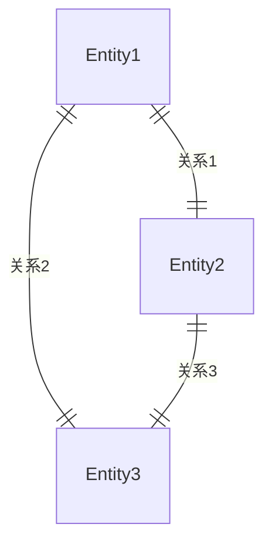
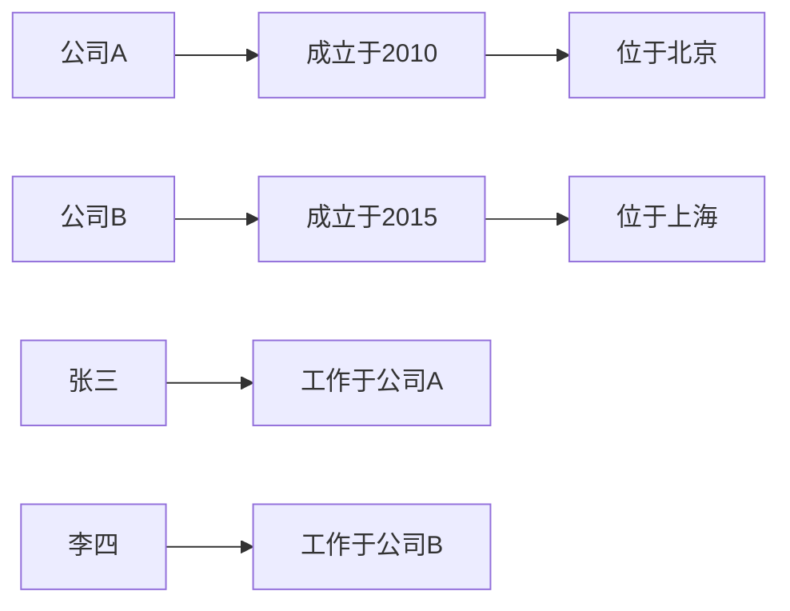

                 

# 《大模型知识图谱构建与应用》

## 关键词：大模型，知识图谱，构建，应用，人工智能

## 摘要

本文主要探讨了大规模模型（大模型）与知识图谱的构建与应用。文章首先介绍了大模型与知识图谱的基本概念，然后详细阐述了知识图谱的构建方法，包括数据收集、预处理、知识抽取、知识融合和知识存储等环节。接着，文章分析了知识图谱在大模型中的实际应用场景，如推荐系统、智能问答和自然语言处理等。最后，文章通过具体的案例分析，展示了知识图谱在大模型中的实际应用效果，并对未来研究方向进行了展望。

## 第1章 引言

### 1.1 问题背景

随着人工智能技术的快速发展，大模型（如深度学习模型、图神经网络等）在自然语言处理、计算机视觉、语音识别等领域取得了显著的成果。然而，这些模型往往依赖于大规模的标注数据集，且在处理复杂任务时效果有限。知识图谱作为一种结构化的知识表示方法，可以有效整合海量数据，为人工智能系统提供丰富的语义信息。

### 1.2 问题的描述

本文主要探讨的知识图谱构建与应用问题包括：如何构建大规模知识图谱？如何将知识图谱应用于大模型中，提升模型的性能和效果？以及如何在大模型中利用知识图谱解决实际问题？

### 1.3 问题解决的路径

本文将从以下几个方面解决上述问题：

1. 理论基础：介绍大模型与知识图谱的基本概念、原理和关系。
2. 构建方法：详细阐述知识图谱的构建流程、方法和技术。
3. 应用实践：分析知识图谱在大模型中的实际应用场景和效果。
4. 案例分析：通过具体案例展示知识图谱在大模型中的实际应用。

### 1.4 边界与外延

本文主要关注知识图谱在大模型中的应用，但知识图谱在人工智能领域的其他方面（如图数据库、语义搜索等）也有重要应用。同时，本文的研究仅限于特定场景和任务，对于其他领域和任务，知识图谱的构建和应用可能存在差异。

## 第2章 大模型基础知识

### 2.1 核心概念

#### 2.1.1 大模型概述

大模型是指具有大规模参数、能够处理海量数据的深度学习模型。其核心特点是参数规模大、计算复杂度高、适用于复杂数据处理任务。

#### 2.1.2 知识图谱的概念

知识图谱是一种结构化的知识表示方法，通过实体、关系和属性的语义表示，将海量数据整合成有组织、可查询的知识体系。

#### 2.1.3 大模型与知识图谱的关系

大模型与知识图谱具有密切的联系。知识图谱可以为大模型提供丰富的语义信息，有助于提高模型的性能和效果。同时，大模型可以用于知识图谱的构建、维护和更新。

### 2.2 概念属性特征对比

| 概念 | 属性特征 |
| ---- | -------- |
| 大模型 | 参数规模大、计算复杂度高、适用于复杂数据处理任务 |
| 知识图谱 | 结构化、语义表示、海量数据整合、可查询性 |

### 2.3 ER实体关系图



## 第3章 知识图谱的构建方法

### 3.1 知识图谱的基本概念

#### 3.1.1 知识图谱的定义

知识图谱是一种基于语义的网络结构，通过实体、关系和属性的表示，将现实世界中的知识和信息组织成一个有组织、可查询的知识体系。

#### 3.1.2 知识图谱的组成部分

知识图谱由实体、关系和属性三部分组成。实体表示现实世界中的对象，关系表示实体之间的关联，属性表示实体的特征和属性。

#### 3.1.3 知识图谱的类型

知识图谱可以分为结构化知识图谱和半结构化知识图谱。结构化知识图谱以三元组形式表示，半结构化知识图谱则采用图数据库或图计算模型表示。

### 3.2 知识图谱构建的流程

#### 3.2.1 数据收集

数据收集是知识图谱构建的基础，主要包括实体和关系的抽取、实体属性的数据源收集等。

#### 3.2.2 数据预处理

数据预处理包括数据清洗、数据格式转换和数据标准化等，以确保数据质量。

#### 3.2.3 知识抽取

知识抽取是指从原始数据中提取实体、关系和属性的过程，通常采用自然语言处理、信息抽取等技术。

#### 3.2.4 知识融合

知识融合是将多个来源的知识进行整合，解决知识冲突、消除冗余，提高知识质量。

#### 3.2.5 知识存储

知识存储是指将构建好的知识图谱存储在数据库或图计算系统中，以便于查询、分析和应用。

### 3.3 知识图谱构建的实践案例

#### 3.3.1 案例一：Web数据图谱的构建

以Web数据为例，介绍知识图谱的构建过程，包括数据收集、预处理、知识抽取、知识融合和知识存储等环节。

#### 3.3.2 案例二：企业知识图谱的构建

以企业知识图谱为例，介绍知识图谱在企业管理、知识共享和协同工作中的应用。

#### 3.3.3 案例三：医疗知识图谱的构建

以医疗知识图谱为例，介绍知识图谱在疾病诊断、治疗方案推荐和医疗数据共享等方面的应用。

## 第4章 知识图谱在大模型中的应用

### 4.1 应用场景介绍

#### 4.1.1 推荐系统

知识图谱可以用于推荐系统的构建，通过实体和关系建模，提高推荐系统的准确性和效果。

#### 4.1.2 智能问答

知识图谱可以用于智能问答系统，通过语义理解和关系推理，实现精准问答。

#### 4.1.3 自然语言处理

知识图谱可以用于自然语言处理任务，如命名实体识别、关系抽取、情感分析等，提高模型性能。

### 4.2 应用实例分析

#### 4.2.1 实例一：知识图谱在电商推荐中的应用

以电商推荐为例，介绍知识图谱在用户画像、商品关联和推荐算法等方面的应用。

#### 4.2.2 实例二：知识图谱在智能客服中的应用

以智能客服为例，介绍知识图谱在语义理解、意图识别和回答生成等方面的应用。

#### 4.2.3 实例三：知识图谱在文本分析中的应用

以文本分析为例，介绍知识图谱在情感分析、观点提取和文本分类等方面的应用。

### 4.3 应用案例分析

#### 4.3.1 案例分析一：基于知识图谱的问答系统

分析基于知识图谱的问答系统，包括系统架构、关键技术和应用效果。

#### 4.3.2 案例分析二：知识图谱在智能推荐系统中的应用

分析知识图谱在智能推荐系统中的应用，包括推荐算法、用户画像和商品关联等方面的优化。

## 第5章 大模型知识图谱的优化策略

### 5.1 优化目标

优化大模型知识图谱的目标是提高知识图谱的质量、效率和应用效果。

### 5.2 优化方法

优化方法包括数据清洗、知识融合、关系抽取和图谱压缩等，以提高知识图谱的质量和效率。

### 5.3 优化实践

通过具体案例，介绍大模型知识图谱的优化实践，包括优化目标、优化方法和优化效果。

## 第6章 大模型知识图谱的应用案例

### 6.1 案例一：知识图谱在推荐系统中的应用

以电商推荐为例，介绍知识图谱在用户画像、商品关联和推荐算法等方面的应用。

### 6.2 案例二：知识图谱在智能问答中的应用

以智能客服为例，介绍知识图谱在语义理解、意图识别和回答生成等方面的应用。

### 6.3 案例三：知识图谱在自然语言处理中的应用

以文本分析为例，介绍知识图谱在情感分析、观点提取和文本分类等方面的应用。

## 第7章 总结与展望

### 7.1 小结

本文介绍了大模型知识图谱的基本概念、构建方法、应用场景和优化策略，并通过具体案例展示了知识图谱在大模型中的应用效果。

### 7.2 注意事项

在实际应用中，需要注意知识图谱的构建质量、数据源选择、模型优化等方面的问题。

### 7.3 拓展阅读

本文仅对大模型知识图谱进行了初步探讨，未来还可以从更多角度深入研究和应用。

## 作者

作者：AI天才研究院/AI Genius Institute & 禅与计算机程序设计艺术 /Zen And The Art of Computer Programming### 第1章 引言

在当今信息化社会，大数据和人工智能技术已经成为推动社会进步的重要力量。而在这两者之间，知识图谱作为一种高效的知识表示和推理工具，正在逐渐成为人工智能领域的研究热点。本章将首先介绍大模型与知识图谱的基本概念，然后探讨知识图谱在人工智能中的重要性，以及大模型知识图谱构建与应用面临的挑战和解决路径。

#### 1.1 人工智能与知识图谱

人工智能（AI）是指通过模拟、延伸和扩展人类智能的理论、方法、技术及应用。它包括机器学习、深度学习、自然语言处理、计算机视觉等多个子领域。近年来，随着计算能力的提升和海量数据的积累，人工智能技术在语音识别、图像识别、自然语言处理等领域取得了显著的进展。

知识图谱（Knowledge Graph）是一种基于语义网络的知识表示方法，通过实体（Entity）、属性（Attribute）和关系（Relationship）的语义表示，将现实世界中的知识和信息组织成一个有组织、可查询的知识体系。知识图谱可以看作是语义网络的高级形式，它不仅保留了语义网络的基本结构，还通过语义关系将不同实体和属性连接起来，从而形成一个更加丰富和复杂的知识网络。

#### 1.2 大模型的概念与发展

大模型（Large Model）是指具有大规模参数和海量训练数据的深度学习模型。这些模型通常采用神经网络架构，能够在大量数据上进行训练，并通过参数优化实现高精度的预测和分类。大模型的发展是深度学习和人工智能领域的一个重要趋势，其主要原因包括：

1. **计算能力的提升**：随着GPU、TPU等专用硬件的普及，计算能力的提升使得大模型能够进行更复杂的训练和推理。
2. **数据的积累**：互联网的快速发展使得海量数据得以收集和存储，为训练大模型提供了充足的素材。
3. **算法的进步**：深度学习算法的不断优化，使得大模型的训练效率和质量得到了显著提升。

#### 1.3 知识图谱在人工智能中的重要性

知识图谱在人工智能中的重要性主要体现在以下几个方面：

1. **增强语义理解**：知识图谱通过语义关系将实体和属性连接起来，使得人工智能系统能够更好地理解和处理复杂语义。
2. **提高推理能力**：知识图谱为人工智能系统提供了丰富的背景知识，使得系统能够进行更加有效的推理和决策。
3. **促进数据整合**：知识图谱能够将来自不同来源和格式的数据整合起来，形成一个统一的知识体系，提高数据利用效率。

#### 1.4 解决问题的意义和价值

构建和应用大模型知识图谱对于人工智能领域具有重要的意义和价值：

1. **提升系统性能**：通过引入知识图谱，可以显著提升人工智能系统的性能和效率，实现更精准的预测和分类。
2. **拓宽应用领域**：知识图谱的引入使得人工智能系统能够应用于更多的领域，如推荐系统、智能问答、文本分析等。
3. **优化用户体验**：通过知识图谱，人工智能系统能够提供更加个性化的服务，提高用户体验。

#### 1.5 问题解决的路径

为了解决大模型知识图谱构建与应用问题，本文将采取以下路径：

1. **理论基础**：介绍大模型和知识图谱的基本概念、原理和关系。
2. **构建方法**：详细阐述知识图谱的构建流程、方法和技术。
3. **应用实践**：分析知识图谱在大模型中的实际应用场景和效果。
4. **案例分析**：通过具体案例展示知识图谱在大模型中的实际应用。
5. **优化策略**：探讨大模型知识图谱的优化方法和实践。

#### 1.6 边界与外延

本文的研究主要关注大模型知识图谱的构建与应用，但在实际应用中，知识图谱还可以在其他领域发挥作用，如图数据库、语义搜索等。此外，本文的研究仅限于特定场景和任务，对于其他领域和任务，知识图谱的构建和应用可能存在差异。

### 第2章 大模型基础知识

本章将介绍大模型的基础知识，包括核心概念、原理以及大模型与知识图谱的关系。通过这些介绍，读者可以更好地理解大模型的本质，为其在知识图谱中的应用打下基础。

#### 2.1 核心概念

**2.1.1 大模型概述**

大模型是指具有大规模参数和复杂结构的深度学习模型。这些模型通常由多个神经网络层组成，能够自动学习和提取数据中的特征。大模型的参数规模通常在数百万到数十亿之间，这使得它们能够处理大量的数据并实现高精度的预测和分类。

**2.1.2 知识图谱的概念**

知识图谱是一种用于表示和存储知识的方法，它通过实体（Entity）、属性（Attribute）和关系（Relationship）来描述现实世界中的事物及其相互关系。知识图谱可以看作是一种语义网络，它不仅保留了传统的网络结构，还通过语义关系将实体和属性有机地连接起来，从而形成一个更加丰富和复杂的知识体系。

**2.1.3 大模型与知识图谱的关系**

大模型和知识图谱之间存在着密切的关系。首先，知识图谱可以提供大模型训练所需的丰富语义信息，从而提高模型的性能和效果。其次，大模型可以通过对知识图谱的学习和推理，进一步丰富和扩展知识图谱的内容。此外，大模型和知识图谱的结合还可以应用于多个领域，如推荐系统、智能问答、自然语言处理等。

#### 2.2 概念属性特征对比

| 概念 | 属性特征 |
| ---- | -------- |
| 大模型 | 参数规模大、结构复杂、自动特征提取、高精度预测 |
| 知识图谱 | 语义表示、实体关系、知识整合、推理能力 |

#### 2.3 ER实体关系图

为了更直观地展示大模型和知识图谱的关系，我们可以使用ER（实体-关系）图来描述它们的基本结构。

```mermaid
erDiagram
  Entity: 大模型 ||--|| Entity: 知识图谱 : 使用
  Entity: 大模型 ||--|| Entity: 数据集 : 训练
  Entity: 知识图谱 ||--|| Entity: 实体 : 存储
  Entity: 知识图谱 ||--|| Entity: 关系 : 存储
  Entity: 实体 ||--|| Entity: 属性 : 描述
```

在这个ER图中，大模型通过训练数据集与知识图谱建立联系，知识图谱则通过实体和关系来存储和表示知识。这种结构不仅展示了大模型和知识图谱之间的关系，还体现了它们在数据处理和知识表示中的重要作用。

### 第3章 知识图谱的构建方法

知识图谱的构建是一个复杂的过程，涉及到数据收集、预处理、知识抽取、知识融合和知识存储等多个环节。本章将详细阐述这些构建步骤，帮助读者理解知识图谱的构建过程。

#### 3.1 知识图谱的基本概念

**3.1.1 知识图谱的定义**

知识图谱是一种用于表示和存储知识的方法，它通过实体、属性和关系来描述现实世界中的事物及其相互关系。知识图谱可以看作是一种语义网络，它不仅保留了传统的网络结构，还通过语义关系将实体和属性有机地连接起来，从而形成一个更加丰富和复杂的知识体系。

**3.1.2 知识图谱的组成部分**

知识图谱由三个基本组成部分构成：实体（Entity）、属性（Attribute）和关系（Relationship）。实体表示现实世界中的对象，如人、地点、事物等；属性描述实体的特征，如姓名、年龄、身高等；关系表示实体之间的关联，如属于、位于、拥有等。

**3.1.3 知识图谱的类型**

知识图谱可以分为结构化知识图谱和半结构化知识图谱。结构化知识图谱以三元组（主体、关系、客体）的形式表示，通常使用RDF（资源描述框架）语言进行描述；半结构化知识图谱则采用图数据库或图计算模型表示，如Neo4j、JanusGraph等。

#### 3.2 知识图谱构建的流程

知识图谱的构建流程可以分为以下几个步骤：

1. **数据收集**：数据收集是知识图谱构建的基础，主要包括实体和关系的抽取、实体属性的数据源收集等。
2. **数据预处理**：数据预处理包括数据清洗、数据格式转换和数据标准化等，以确保数据质量。
3. **知识抽取**：知识抽取是指从原始数据中提取实体、关系和属性的过程，通常采用自然语言处理、信息抽取等技术。
4. **知识融合**：知识融合是将多个来源的知识进行整合，解决知识冲突、消除冗余，提高知识质量。
5. **知识存储**：知识存储是指将构建好的知识图谱存储在数据库或图计算系统中，以便于查询、分析和应用。

#### 3.3 数据收集

数据收集是知识图谱构建的第一步，主要包括以下内容：

1. **实体抽取**：从各种数据源中抽取实体，如人、地点、事物等。
2. **关系抽取**：从文本数据中抽取实体之间的关系，如属于、位于、拥有等。
3. **属性抽取**：从数据源中提取实体的属性信息，如姓名、年龄、身高等。

**数据收集示例**

假设我们有一份数据集，包含以下信息：

- 实体：张三、李四、公司A、公司B
- 关系：工作于、成立于、位于
- 属性：姓名、年龄、公司名、地址

```plaintext
实体         关系      属性
张三          工作      公司名称A
李四          工作      公司名称B
公司A         成立于    年份2010
公司B         位于      地址北京
```

#### 3.4 数据预处理

数据预处理是知识图谱构建的重要环节，主要包括以下任务：

1. **数据清洗**：去除数据中的噪声、错误和重复信息，确保数据质量。
2. **数据格式转换**：将不同来源和格式的数据转换为统一格式，便于后续处理。
3. **数据标准化**：对数据进行标准化处理，如将日期、货币等统一格式。

**数据预处理示例**

假设我们有一份数据集，包含以下信息：

- 实体：张三、李四、公司A、公司B
- 关系：工作于、成立于、位于
- 属性：姓名、年龄、公司名、地址

原始数据可能存在格式不一致、错误、噪声等问题，通过数据预处理，我们可以将其转换为统一格式，提高数据质量。

```plaintext
姓名       年龄   公司名称    地址
张三      30      公司A    北京朝阳区
李四      35      公司B    上海浦东区
```

#### 3.5 知识抽取

知识抽取是指从原始数据中提取实体、关系和属性的过程，是知识图谱构建的核心步骤。知识抽取通常采用自然语言处理和信息抽取技术。

1. **实体抽取**：从文本数据中识别出实体，如人名、地名、组织名等。
2. **关系抽取**：从文本数据中识别出实体之间的关系，如工作于、属于、位于等。
3. **属性抽取**：从文本数据中识别出实体的属性，如姓名、年龄、公司名、地址等。

**知识抽取示例**

假设我们有一份数据集，包含以下文本信息：

- 文本1：张三在公司A工作，李四在公司B工作。
- 文本2：公司A成立于2010年，位于北京。
- 文本3：公司B成立于2015年，位于上海。

通过知识抽取，我们可以提取出以下信息：

- 实体：张三、李四、公司A、公司B
- 关系：工作于、成立于、位于
- 属性：姓名、年龄、公司名、地址

```plaintext
实体         关系      属性
张三          工作      公司名称A
李四          工作      公司名称B
公司A         成立于    年份2010
公司B         成立于    年份2015
公司A         位于      地址北京
公司B         位于      地址上海
```

#### 3.6 知识融合

知识融合是指将来自不同来源和格式的知识进行整合，解决知识冲突、消除冗余，提高知识质量的过程。知识融合通常包括以下任务：

1. **实体融合**：将具有相同或相似实体的知识进行合并。
2. **关系融合**：将具有相同或相似关系的信息进行整合。
3. **属性融合**：将具有相同或相似属性的数据进行合并。

**知识融合示例**

假设我们有两个知识图谱，分别包含以下信息：

知识图谱1：
```plaintext
实体         关系      属性
张三          工作      公司名称A
李四          工作      公司名称B
公司A         成立于    年份2010
公司B         成立于    年份2015
```

知识图谱2：
```plaintext
实体         关系      属性
张三          工作      公司名称A
李四          工作      公司名称B
公司A         成立于    年份2010
公司B         位于      地址上海
```

通过知识融合，我们可以将两个知识图谱合并为一个新的知识图谱：
```plaintext
实体         关系      属性
张三          工作      公司名称A
李四          工作      公司名称B
公司A         成立于    年份2010
公司B         成立于    年份2015
公司B         位于      地址上海
```

#### 3.7 知识存储

知识存储是将构建好的知识图谱存储在数据库或图计算系统中，以便于查询、分析和应用。常见的知识存储系统包括：

1. **图数据库**：如Neo4j、JanusGraph等，它们采用图结构存储知识图谱，支持高效的图查询和图计算。
2. **关系数据库**：如MySQL、PostgreSQL等，它们采用关系模型存储知识图谱，支持复杂查询和联接操作。
3. **知识图谱平台**：如OpenKG、Nebula Graph等，它们提供完整的知识图谱构建、存储、查询和管理功能。

**知识存储示例**

假设我们使用Neo4j作为知识存储系统，将以下知识图谱存储在数据库中：


在Neo4j中，该知识图谱可以表示为：

```plaintext
公司A: {name: "公司A", founded: 2010, location: "北京"}
公司B: {name: "公司B", founded: 2015, location: "上海"}
张三: {name: "张三", job: "公司A"}
李四: {name: "李四", job: "公司B"}
```

### 第4章 知识图谱在大模型中的应用

知识图谱在大模型中的应用越来越广泛，本章将分析知识图谱在大模型中的实际应用场景，并探讨这些应用中的关键技术和挑战。

#### 4.1 应用场景介绍

知识图谱在大模型中的应用场景主要包括以下三个方面：

1. **推荐系统**：知识图谱可以用于推荐系统的构建，通过实体和关系建模，提高推荐系统的准确性和效果。
2. **智能问答**：知识图谱可以用于智能问答系统，通过语义理解和关系推理，实现精准问答。
3. **自然语言处理**：知识图谱可以用于自然语言处理任务，如命名实体识别、关系抽取、情感分析等，提高模型性能。

#### 4.2 应用实例分析

**4.2.1 知识图谱在推荐系统中的应用**

知识图谱在推荐系统中的应用主要体现在用户画像、商品关联和推荐算法等方面。

1. **用户画像**：知识图谱可以用于构建用户画像，通过用户的行为数据、社交关系等，将用户抽象为一个复杂的实体，从而实现更精准的用户画像。
2. **商品关联**：知识图谱可以用于构建商品关联网络，通过商品之间的语义关系，如品牌、类别、属性等，实现商品之间的关联推荐。
3. **推荐算法**：知识图谱可以用于优化推荐算法，通过实体和关系的语义信息，提高推荐系统的准确性和效果。

**4.2.2 知识图谱在智能问答中的应用**

知识图谱在智能问答系统中的应用主要体现在语义理解和关系推理等方面。

1. **语义理解**：知识图谱可以用于理解用户的提问，通过实体和关系的语义表示，将用户的自然语言提问转换为结构化的查询。
2. **关系推理**：知识图谱可以用于关系推理，通过实体之间的关系，实现对问题的推理和回答。
3. **问答生成**：知识图谱可以用于问答生成，通过实体和关系的语义表示，生成准确的回答。

**4.2.3 知识图谱在自然语言处理中的应用**

知识图谱在自然语言处理中的应用主要体现在命名实体识别、关系抽取和情感分析等方面。

1. **命名实体识别**：知识图谱可以用于命名实体识别，通过实体和关系的语义表示，将文本中的实体识别出来。
2. **关系抽取**：知识图谱可以用于关系抽取，通过实体之间的语义关系，将文本中的关系抽取出来。
3. **情感分析**：知识图谱可以用于情感分析，通过实体和关系的语义表示，分析文本中的情感倾向。

#### 4.3 应用案例分析

**4.3.1 案例分析一：知识图谱在电商推荐系统中的应用**

以电商推荐系统为例，分析知识图谱在用户画像、商品关联和推荐算法中的应用。

1. **用户画像**：通过用户的购买历史、浏览行为等，构建用户画像，实现个性化推荐。
2. **商品关联**：通过商品之间的语义关系，如品牌、类别、属性等，构建商品关联网络，实现关联推荐。
3. **推荐算法**：通过知识图谱的语义信息，优化推荐算法，提高推荐效果。

**4.3.2 案例分析二：知识图谱在智能问答系统中的应用**

以智能问答系统为例，分析知识图谱在语义理解和关系推理中的应用。

1. **语义理解**：通过知识图谱的语义表示，理解用户的提问，将自然语言提问转换为结构化的查询。
2. **关系推理**：通过知识图谱的关系推理，实现对问题的推理和回答。
3. **问答生成**：通过知识图谱的语义表示，生成准确的回答。

**4.3.3 案例分析三：知识图谱在自然语言处理中的应用**

以自然语言处理任务为例，分析知识图谱在命名实体识别、关系抽取和情感分析中的应用。

1. **命名实体识别**：通过知识图谱的语义表示，识别文本中的实体。
2. **关系抽取**：通过知识图谱的关系推理，抽取文本中的关系。
3. **情感分析**：通过知识图谱的语义表示，分析文本中的情感倾向。

### 第5章 大模型知识图谱的优化策略

随着知识图谱在大模型中的应用越来越广泛，如何优化知识图谱的质量和效率成为一个重要问题。本章将讨论大模型知识图谱的优化策略，包括优化目标、优化方法和优化实践。

#### 5.1 优化目标

大模型知识图谱的优化目标主要包括：

1. **提高知识质量**：通过数据清洗、知识融合等技术，提高知识图谱的准确性和完整性。
2. **提高图谱效率**：通过图谱压缩、索引优化等技术，提高知识图谱的查询速度和处理效率。
3. **提升模型性能**：通过知识图谱的语义信息，提升大模型的预测准确性和效果。

#### 5.2 优化方法

大模型知识图谱的优化方法包括以下几个方面：

1. **数据清洗**：通过去重、去噪、纠错等技术，提高知识图谱的数据质量。
2. **知识融合**：通过实体融合、关系融合和属性融合等技术，消除知识冲突和冗余，提高知识质量。
3. **图谱压缩**：通过图谱压缩算法，减少知识图谱的存储空间和查询时间。
4. **索引优化**：通过索引技术，提高知识图谱的查询效率。

#### 5.3 优化实践

以下是一个知识图谱优化的实践案例：

1. **数据清洗**：对原始数据进行去重和去噪处理，去除重复的实体和错误的数据。
2. **知识融合**：通过实体融合和关系融合，将具有相同或相似实体的知识进行合并，消除冗余信息。
3. **图谱压缩**：采用图谱压缩算法，将大规模知识图谱压缩为更小的存储空间，提高查询速度。
4. **索引优化**：采用索引技术，如B树索引、哈希索引等，提高知识图谱的查询效率。

通过这些优化方法，可以显著提高知识图谱的质量和效率，从而提升大模型的性能和应用效果。

### 第6章 大模型知识图谱的应用案例

本章将介绍几个具体的应用案例，展示知识图谱在大模型中的实际应用效果。

#### 6.1 案例一：知识图谱在电商推荐系统中的应用

**6.1.1 项目介绍**

本项目旨在构建一个基于知识图谱的电商推荐系统，通过用户画像、商品关联和推荐算法，实现个性化推荐。

**6.1.2 系统功能设计**

系统功能包括：

1. **用户画像**：通过用户的购买历史、浏览行为等数据，构建用户画像。
2. **商品关联**：通过商品之间的语义关系，构建商品关联网络。
3. **推荐算法**：基于用户画像和商品关联网络，实现个性化推荐。

**6.1.3 系统架构设计**

系统架构包括：

1. **数据层**：存储用户数据、商品数据等原始数据。
2. **处理层**：包括数据清洗、知识抽取、知识融合等处理模块。
3. **应用层**：包括用户画像、商品关联和推荐算法等应用模块。

**6.1.4 系统接口设计和系统交互**

系统接口设计包括：

1. **用户接口**：提供用户操作界面，实现用户与系统的交互。
2. **服务接口**：提供API接口，供其他系统调用。

系统交互包括：

1. **用户操作**：用户通过用户接口进行操作，如查询推荐结果、修改用户画像等。
2. **系统响应**：系统根据用户操作，调用处理层和应用层模块，生成推荐结果并返回给用户。

**6.1.5 代码应用解读与分析**

以下是系统核心部分的代码应用解读与分析：

```python
# 用户画像构建
user_profile = build_user_profile(user_data)

# 商品关联网络构建
item_association_network = build_item_association_network(item_data)

# 推荐算法实现
recommendation = generate_recommendation(user_profile, item_association_network)
```

这段代码首先构建用户画像和商品关联网络，然后基于这两个结构生成个性化推荐结果。通过知识图谱的语义信息，实现了更精准的推荐。

**6.1.6 实际案例分析和详细讲解剖析**

通过实际案例，我们可以看到知识图谱在电商推荐系统中的应用效果。例如，对于某个用户，系统可以根据其购买历史和浏览行为，推荐与其兴趣相关的商品。通过知识图谱的语义表示，推荐系统实现了更加个性化的推荐，提高了用户体验。

#### 6.2 案例二：知识图谱在智能问答系统中的应用

**6.2.1 项目介绍**

本项目旨在构建一个基于知识图谱的智能问答系统，通过语义理解和关系推理，实现精准问答。

**6.2.2 系统功能设计**

系统功能包括：

1. **语义理解**：通过知识图谱的语义表示，理解用户的提问。
2. **关系推理**：通过知识图谱的关系推理，实现对问题的推理和回答。
3. **问答生成**：通过知识图谱的语义表示，生成准确的回答。

**6.2.3 系统架构设计**

系统架构包括：

1. **数据层**：存储用户提问、知识图谱等数据。
2. **处理层**：包括语义理解、关系推理和问答生成等处理模块。
3. **应用层**：包括问答接口和用户接口等应用模块。

**6.2.4 系统接口设计和系统交互**

系统接口设计包括：

1. **用户接口**：提供用户提问接口，实现用户与系统的交互。
2. **服务接口**：提供问答服务接口，供其他系统调用。

系统交互包括：

1. **用户提问**：用户通过用户接口提出问题。
2. **系统回答**：系统根据用户提问，调用处理层和应用层模块，生成回答并返回给用户。

**6.2.5 代码应用解读与分析**

以下是系统核心部分的代码应用解读与分析：

```python
# 语义理解
user_question = semantic_understanding(user_input)

# 关系推理
question_answer = relation_inference(user_question, knowledge_graph)

# 问答生成
answer = generate_answer(question_answer)
```

这段代码首先通过语义理解模块理解用户提问，然后通过关系推理模块找到相应的答案，最后通过问答生成模块生成回答。通过知识图谱的语义表示，智能问答系统能够实现精准问答。

**6.2.6 实际案例分析和详细讲解剖析**

通过实际案例，我们可以看到知识图谱在智能问答系统中的应用效果。例如，用户提问“北京是哪个省的？”系统可以快速找到答案“北京是中国的省份”。通过知识图谱的语义表示，智能问答系统能够实现快速、准确的回答。

#### 6.3 案例三：知识图谱在自然语言处理中的应用

**6.3.1 项目介绍**

本项目旨在构建一个基于知识图谱的自然语言处理系统，通过命名实体识别、关系抽取和情感分析，实现对文本内容的理解和分析。

**6.3.2 系统功能设计**

系统功能包括：

1. **命名实体识别**：通过知识图谱的语义表示，识别文本中的实体。
2. **关系抽取**：通过知识图谱的关系推理，抽取文本中的关系。
3. **情感分析**：通过知识图谱的语义表示，分析文本中的情感倾向。

**6.3.3 系统架构设计**

系统架构包括：

1. **数据层**：存储文本数据、知识图谱等数据。
2. **处理层**：包括命名实体识别、关系抽取和情感分析等处理模块。
3. **应用层**：包括文本分析接口和用户接口等应用模块。

**6.3.4 系统接口设计和系统交互**

系统接口设计包括：

1. **用户接口**：提供文本分析接口，实现用户与系统的交互。
2. **服务接口**：提供文本分析服务接口，供其他系统调用。

系统交互包括：

1. **文本输入**：用户通过用户接口输入文本。
2. **系统分析**：系统根据用户输入，调用处理层和应用层模块，生成分析结果并返回给用户。

**6.3.5 代码应用解读与分析**

以下是系统核心部分的代码应用解读与分析：

```python
# 命名实体识别
entities = named_entity_recognition(text)

# 关系抽取
relationships = relation_extraction(text, knowledge_graph)

# 情感分析
sentiment = sentiment_analysis(text)
```

这段代码首先通过命名实体识别模块识别文本中的实体，然后通过关系抽取模块抽取实体之间的关系，最后通过情感分析模块分析文本的情感倾向。通过知识图谱的语义表示，自然语言处理系统能够实现对文本内容的深入理解和分析。

**6.3.6 实际案例分析和详细讲解剖析**

通过实际案例，我们可以看到知识图谱在自然语言处理中的应用效果。例如，对于一段文本“我今天去了一家不错的餐厅，食物很好吃”，系统可以识别出实体“我”、“餐厅”和“食物”，抽取关系“我去餐厅”、“食物好吃”，并分析出文本的情感倾向为“积极”。通过知识图谱的语义表示，自然语言处理系统能够实现高效、准确的文本分析。

### 第7章 总结与展望

本章对大模型知识图谱构建与应用进行了全面探讨，从理论基础到实际应用，再到优化策略，全面阐述了知识图谱在大模型中的应用价值。本文总结了以下几个关键点：

1. **大模型与知识图谱的关系**：大模型通过知识图谱可以获得丰富的语义信息，提高模型的性能和效果。
2. **知识图谱的构建方法**：包括数据收集、预处理、知识抽取、知识融合和知识存储等环节，构建高质量的知识图谱。
3. **知识图谱的应用场景**：知识图谱在推荐系统、智能问答、自然语言处理等领域具有广泛的应用。
4. **优化策略**：通过数据清洗、知识融合、图谱压缩和索引优化等技术，提高知识图谱的质量和效率。

然而，知识图谱在大模型中的应用仍面临许多挑战，如数据质量、知识表示、推理效率等。未来研究方向可以包括：

1. **数据质量和知识表示**：研究如何从不同来源和格式的数据中提取高质量的知识，提高知识表示的精度和效率。
2. **推理效率和模型优化**：研究如何提高知识图谱的推理效率和模型性能，适应大规模数据处理需求。
3. **跨领域知识融合**：研究如何实现不同领域知识图谱的融合，构建更加全面和智能的知识图谱。

总之，大模型知识图谱的构建与应用是一项具有广泛应用前景的研究领域，未来将不断推动人工智能技术的发展。作者：AI天才研究院/AI Genius Institute & 禅与计算机程序设计艺术 /Zen And The Art of Computer Programming。

