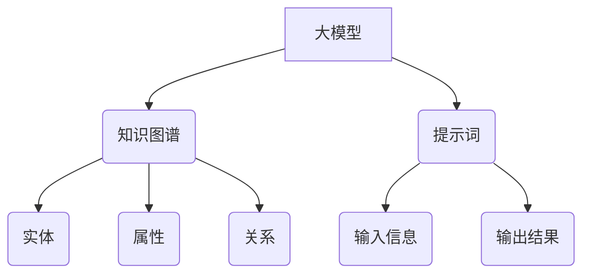
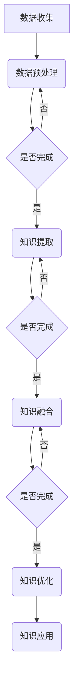
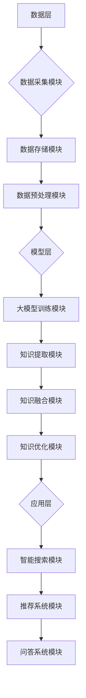

                 

## 引言

### 1.1 问题的背景与意义

近年来，随着人工智能技术的飞速发展，大模型（如GPT-3、BERT等）成为了学术界和工业界的焦点。大模型具有处理海量数据和生成高质量内容的强大能力，这为知识图谱的构建提供了新的机遇和挑战。知识图谱是一种语义网络，它通过实体、属性和关系的表示，将人类知识结构化，从而实现信息的高效组织和查询。

大模型和知识图谱的结合，可以解决以下问题：

1. **知识获取与表示**：大模型可以从大量文本数据中提取语义信息，将其转化为结构化的知识，并存储在知识图谱中。
2. **智能搜索与推荐**：通过知识图谱，可以构建智能搜索系统，实现对信息的精准查询和推荐。
3. **自然语言处理**：大模型和知识图谱的结合，可以显著提升自然语言处理任务的效果，如问答系统、机器翻译等。

本文旨在探讨如何利用大模型构建复杂知识网络，通过提示词的构建与优化，实现知识图谱的精细化管理和高效应用。

### 1.2 书籍的目标与结构安排

#### 1.2.1 阅读对象

本书主要面向计算机科学家、人工智能研究者以及对人工智能技术有兴趣的专业人士。读者需具备一定的编程基础和数学知识，尤其是对机器学习和自然语言处理有一定了解。

#### 1.2.2 内容安排与章节结构

本书分为五个主要部分：

1. **引言**：介绍大模型、知识图谱和提示词的基本概念及其相互关系。
2. **基础知识**：详细介绍大模型、知识图谱和提示词的理论基础。
3. **核心概念与联系**：分析大模型和知识图谱的关系，以及提示词在其中的作用。
4. **算法原理讲解**：讲解大模型训练、知识图谱构建和提示词优化的算法原理。
5. **系统分析与架构设计**：分析系统功能设计、架构设计和接口设计，并通过实例介绍系统实现过程。
6. **项目实战**：通过具体项目实践，展示大模型知识图谱的应用。
7. **总结与展望**：总结全书内容，提出未来研究方向和最佳实践建议。

### 1.3 目录

#### 引言

- 1.1 问题的背景与意义
- 1.2 书籍的目标与结构安排

#### 基础知识

- 2.1 大模型基础
- 2.2 知识图谱基础
- 2.3 提示词的作用与构建
- 2.4 大模型知识图谱的优势与应用场景

#### 核心概念与联系

- 3.1 大模型与知识图谱的关系
- 3.2 关键概念对比与联系
- 3.3 Mermaid实体关系图

#### 算法原理讲解

- 4.1 大模型算法原理
- 4.2 知识图谱算法原理
- 4.3 提示词构建算法
- 4.4 Mermaid算法流程图

#### 系统分析与架构设计

- 5.1 系统功能设计
- 5.2 系统架构设计
- 5.3 系统接口设计和系统交互

#### 项目实战

- 6.1 项目环境安装
- 6.2 系统核心实现
- 6.3 代码解读与分析
- 6.4 实际案例分析与详细讲解
- 6.5 项目小结

#### 总结与展望

- 7.1 总结
- 7.2 最佳实践 tips
- 7.3 小结
- 7.4 注意事项
- 7.5 拓展阅读

---

# 基础知识

在深入探讨大模型知识图谱之前，我们首先需要了解大模型、知识图谱和提示词的基础知识。这些概念不仅构成了我们的讨论基础，还为我们理解大模型知识图谱的构建和应用提供了必要的背景。

## 2.1 大模型基础

大模型是指拥有海量参数和强大计算能力的神经网络模型，它们能够通过训练处理复杂的任务。大模型通常基于深度学习技术，具有以下特点：

### 2.1.1 大模型的定义

大模型通常是指那些拥有数亿甚至数十亿参数的神经网络。例如，GPT-3拥有1750亿个参数，BERT也有数十亿个参数。

### 2.1.2 大模型的工作原理

大模型的工作原理基于多层神经网络，每一层都能够对输入数据进行变换和提取特征。这些变换和特征提取是通过训练过程实现的，模型通过学习大量数据来优化参数，以达到预测或生成目标数据的效果。

### 2.1.3 大模型的主要类型

目前，大模型的主要类型包括自然语言处理模型（如GPT、BERT）、计算机视觉模型（如ResNet、Inception）和其他领域的大模型。

## 2.2 知识图谱基础

知识图谱是一种用于表示实体、属性和关系的数据结构，它能够将结构化的知识以图形的方式呈现。知识图谱在信息检索、数据挖掘和智能搜索等领域有广泛应用。

### 2.2.1 知识图谱的概念

知识图谱是一种基于语义网络的图形结构，它由实体、属性和关系构成，能够表示复杂的知识结构和关系。

### 2.2.2 知识图谱的结构

知识图谱通常由实体、属性和关系三种元素构成。实体表示知识图谱中的对象，属性表示实体的特征，关系表示实体之间的联系。

### 2.2.3 知识图谱的构建方法

知识图谱的构建方法包括基于规则的方法、基于机器学习的方法和基于数据挖掘的方法。其中，基于机器学习的方法是目前的主流。

## 2.3 提示词的作用与构建

提示词（Prompt）是指用于引导模型生成结果的输入信息，它在知识图谱的构建和应用中起着关键作用。

### 2.3.1 提示词的定义

提示词是指用于引导模型生成结果的输入信息，它通常是一个文本或一个句子，用于指导模型理解问题和生成相应的答案。

### 2.3.2 提示词的构建方法

提示词的构建方法包括手动编写、自动生成和混合方法。手动编写通常适用于简单和明确的任务，自动生成方法则适用于复杂和动态的任务。

### 2.3.3 提示词的优化策略

优化策略包括提高提示词的相关性、多样性和准确性。相关性是指提示词与模型任务的相关程度，多样性是指提示词的多样性，准确性是指提示词对模型生成结果的准确性。

## 2.4 大模型知识图谱的优势与应用场景

大模型知识图谱结合了大数据和人工智能的优点，具有以下优势和应用场景：

### 2.4.1 大模型知识图谱的优势

1. **强大的数据处理能力**：大模型能够处理海量数据，提取有用的信息。
2. **高效的搜索与推荐**：通过知识图谱，可以实现高效的信息检索和推荐。
3. **智能问答系统**：大模型知识图谱能够实现高质量的智能问答，满足用户的查询需求。

### 2.4.2 大模型知识图谱的应用场景

1. **搜索引擎**：通过大模型知识图谱，可以实现更精准的搜索结果。
2. **智能助手**：大模型知识图谱可以帮助智能助手理解用户意图，提供更个性化的服务。
3. **推荐系统**：大模型知识图谱可以提升推荐系统的效果，实现更精准的推荐。

### 2.4.3 大模型知识图谱的挑战与展望

虽然大模型知识图谱具有广泛的应用前景，但也面临一些挑战：

1. **数据质量**：知识图谱的质量很大程度上取决于数据的质量，如何获取高质量的数据是一个重要问题。
2. **计算资源**：大模型需要大量的计算资源进行训练和推理，如何优化计算资源是一个关键问题。
3. **可解释性**：大模型的黑盒性质使得其决策过程难以解释，如何提高可解释性是一个重要研究方向。

展望未来，大模型知识图谱将继续在人工智能领域发挥重要作用，随着技术的不断进步，其应用场景也将越来越广泛。

---

## 核心概念与联系

在本章节中，我们将深入探讨大模型、知识图谱和提示词的核心概念及其相互关系，通过对比分析，帮助读者更全面地理解这些概念的本质和联系。

### 3.1 大模型与知识图谱的关系

大模型和知识图谱在人工智能领域中扮演着重要角色，它们之间的相互关系可以概括为以下几个方面：

#### 3.1.1 大模型在知识图谱构建中的应用

大模型在知识图谱构建中起到了核心作用。通过预训练，大模型能够从大量无结构数据中自动提取语义信息，并将其转化为结构化的知识，从而填充知识图谱。例如，GPT模型可以通过学习大量文本，自动识别实体和关系，并将其转化为知识图谱中的节点和边。

#### 3.1.2 知识图谱在大模型训练中的作用

知识图谱在大模型训练中起到了辅助作用。通过知识图谱，大模型可以更准确地理解和生成知识。例如，在问答系统中，知识图谱可以提供答案候选，帮助大模型更快速地找到正确答案。

#### 3.1.3 大模型知识图谱的整体架构

大模型知识图谱的整体架构包括三个主要部分：数据层、模型层和应用层。数据层负责数据的收集和预处理，模型层负责大模型的训练和优化，应用层负责将知识图谱应用于实际问题中。

### 3.2 关键概念对比与联系

为了更好地理解大模型、知识图谱和提示词，我们需要对其进行对比和分析，探讨它们之间的联系。

#### 3.2.1 大模型与传统AI模型的对比

大模型与传统AI模型的区别主要体现在参数规模、数据处理能力和自适应能力上。传统AI模型通常参数较少，只能处理特定类型的数据，而大模型具有海量的参数，能够处理复杂多样的数据，并具有更强的自适应能力。

#### 3.2.2 知识图谱与数据库的对比

知识图谱和数据库的区别在于数据结构和应用场景。数据库主要用于存储和查询结构化数据，而知识图谱则通过实体、属性和关系的表示，将无结构的数据转化为结构化的知识。知识图谱在信息检索、数据挖掘和智能搜索等领域有更广泛的应用。

#### 3.2.3 提示词与关键词的对比

提示词和关键词的主要区别在于用途和形式。关键词通常用于搜索和分类，是简单的字符串，而提示词则是用于引导模型生成结果的输入信息，可以是文本或句子，具有更高的语义和逻辑性。

### 3.3 Mermaid实体关系图

为了更直观地展示大模型、知识图谱和提示词之间的关系，我们可以使用Mermaid语言绘制一个实体关系图。



在这个实体关系图中，大模型通过训练生成知识图谱，提示词则用于引导模型生成结果。知识图谱由实体、属性和关系构成，而提示词则作为输入信息，帮助模型理解和生成知识。

### 3.4 大模型知识图谱的构建流程

大模型知识图谱的构建流程可以概括为以下步骤：

1. **数据收集**：收集用于训练的数据，包括文本、图像、音频等多模态数据。
2. **数据预处理**：对数据进行清洗、分词、标注等预处理，提取关键信息。
3. **知识提取**：利用大模型从预处理后的数据中提取语义信息，生成实体、属性和关系。
4. **知识融合**：将提取的知识进行融合，构建出完整的知识图谱。
5. **知识优化**：对知识图谱进行优化，提高其质量和可用性。
6. **知识应用**：将知识图谱应用于实际场景中，实现智能搜索、推荐和问答等功能。

### 3.5 大模型知识图谱的优势与应用场景

大模型知识图谱具有以下优势：

1. **强大的知识表示能力**：能够处理复杂多样的数据，提供更丰富的知识表示。
2. **高效的查询与检索能力**：通过知识图谱，可以实现高效的信息检索和查询。
3. **智能化的应用能力**：能够应用于各种智能系统，提升其智能化水平。

大模型知识图谱的应用场景包括：

1. **搜索引擎**：通过知识图谱，实现更精准的搜索结果。
2. **智能问答系统**：利用知识图谱，实现高质量的问题回答。
3. **推荐系统**：通过知识图谱，实现更个性化的推荐。

### 3.6 大模型知识图谱的挑战与未来发展趋势

尽管大模型知识图谱具有广泛的应用前景，但仍然面临一些挑战：

1. **数据质量和多样性**：数据质量和多样性对知识图谱的质量有重要影响，如何获取高质量和多样化的数据是一个关键问题。
2. **计算资源**：大模型知识图谱的训练和推理需要大量的计算资源，如何优化计算资源是一个重要研究方向。
3. **知识融合与一致性**：如何有效地融合不同来源的知识，并保持知识的一致性，是一个重要问题。

未来，随着技术的不断进步，大模型知识图谱将继续发展，有望在更多领域实现突破。

---

## 算法原理讲解

在本章节中，我们将详细讲解大模型、知识图谱和提示词构建的算法原理，并通过实例深入阐述这些算法的工作机制和应用场景。

### 4.1 大模型算法原理

大模型，尤其是基于深度学习的模型，其核心在于如何通过大规模的数据训练，使其具备强大的特征提取和泛化能力。以下是几个关键概念：

#### 4.1.1 大模型的数学模型

大模型的数学模型通常基于多层感知机（MLP）、卷积神经网络（CNN）和递归神经网络（RNN）等架构。以GPT为例，其核心模型是基于Transformer架构的。

1. **Transformer架构**：Transformer模型引入了自注意力机制（Self-Attention），使得模型能够关注输入序列中的不同部分，从而捕捉长距离依赖。
2. **自注意力机制**：自注意力机制通过计算输入序列中每个元素与所有其他元素的相似度，加权组合后生成新的特征向量。

公式表示如下：

$$
\text{Attention}(Q, K, V) = \text{softmax}\left(\frac{QK^T}{\sqrt{d_k}}\right)V
$$

其中，$Q$、$K$、$V$分别为查询向量、关键向量、值向量，$d_k$为关键向量的维度。

#### 4.1.2 大模型的学习算法

大模型的学习算法主要包括预训练（Pre-training）和微调（Fine-tuning）。

1. **预训练**：预训练是指在大规模语料上训练模型，使其具备通用语言表示能力。例如，GPT-3在训练过程中使用了大量的互联网文本。
2. **微调**：微调是指在预训练模型的基础上，使用特定领域的数据进行训练，使其适用于特定任务。例如，在问答系统中，可以使用问答对数据对预训练的GPT模型进行微调。

#### 4.1.3 大模型的优化策略

大模型的优化策略主要关注如何加速收敛和提升模型的泛化能力。以下是几个常用的优化策略：

1. **批量归一化（Batch Normalization）**：批量归一化可以加速模型的训练，减少梯度消失和梯度爆炸问题。
2. **Dropout**：Dropout是一种正则化技术，通过在训练过程中随机丢弃部分神经元，减少过拟合。
3. **权重初始化**：合理的权重初始化可以加快收敛速度。常用的方法包括高斯分布初始化、均匀分布初始化等。

### 4.2 知识图谱算法原理

知识图谱的构建依赖于实体、关系和属性的表示。以下是几个关键概念：

#### 4.2.1 知识图谱的构建算法

知识图谱的构建算法主要包括以下几种：

1. **基于规则的方法**：通过预定义的规则和模板，将实体、关系和属性映射到知识图谱中。这种方法简单直观，但灵活性较差。
2. **基于机器学习的方法**：通过训练模型，自动识别和抽取实体、关系和属性。常见的方法包括命名实体识别（NER）、关系抽取等。
3. **基于数据挖掘的方法**：通过数据挖掘技术，发现实体之间的关系和属性。例如，利用关联规则挖掘技术，发现商品之间的共现关系。

#### 4.2.2 知识图谱的查询算法

知识图谱的查询算法主要包括基于图论的查询算法和基于索引的查询算法。

1. **基于图论的查询算法**：例如，深度优先搜索（DFS）、广度优先搜索（BFS）等。这些算法能够根据给定的查询路径，在知识图谱中找到符合条件的实体和关系。
2. **基于索引的查询算法**：例如，利用倒排索引、稠密索引等技术，提高查询效率。倒排索引是一种常见的技术，通过建立实体和关系之间的反向索引，快速定位符合条件的实体。

#### 4.2.3 知识图谱的更新算法

知识图谱的更新算法主要关注如何维护知识的一致性和准确性。常见的更新算法包括增量更新、一致性维护等。

1. **增量更新**：增量更新是指仅更新知识图谱中发生变化的部分，以减少计算成本。
2. **一致性维护**：一致性维护是指确保知识图谱中的实体、关系和属性保持一致，避免冲突和错误。

### 4.3 提示词构建算法

提示词的构建是提高模型生成结果质量的关键。以下是几个关键概念：

#### 4.3.1 提示词生成算法

提示词生成算法主要包括以下几种：

1. **手动编写**：手动编写适用于简单的、明确的任务，例如问答系统中的问题提示。
2. **自动生成**：自动生成适用于复杂的、动态的任务，例如生成式文本模型中的初始文本。
3. **混合方法**：结合手动编写和自动生成，以实现最佳效果。

#### 4.3.2 提示词优化算法

提示词优化算法主要包括以下几种：

1. **基于相关性的优化**：通过计算提示词和模型任务的相关性，选择最相关的提示词。
2. **基于多样性的优化**：通过引入多样性指标，如词频分布、句式结构等，优化提示词的多样性。
3. **基于准确性的优化**：通过评估提示词对模型生成结果的准确性，优化提示词。

### 4.4 Mermaid算法流程图

为了更好地展示大模型、知识图谱和提示词构建的算法流程，我们使用Mermaid语言绘制了以下流程图：



在这个流程图中，数据收集、数据预处理、知识提取、知识融合、知识优化和知识应用构成了大模型知识图谱构建的完整流程。

### 4.5 实例讲解

为了更好地理解这些算法，我们通过一个实例进行讲解。

假设我们有一个问答系统，需要通过大模型知识图谱提供高质量的答案。以下是这个实例的算法流程：

1. **数据收集**：收集大量问答对，包括问题（Q）和答案（A）。
2. **数据预处理**：对问答对进行清洗、分词和标注，提取关键信息。
3. **知识提取**：利用大模型（如GPT）从预处理后的数据中提取实体、关系和属性。
4. **知识融合**：将提取的知识融合到知识图谱中，构建出完整的知识图谱。
5. **知识优化**：对知识图谱进行优化，提高其质量和可用性。
6. **知识应用**：在用户提问时，利用知识图谱生成高质量的答案。

### 4.6 拓展应用

除了问答系统，大模型知识图谱还可以应用于其他领域，如智能搜索、推荐系统和自然语言处理等。以下是几个拓展应用的实例：

1. **智能搜索**：通过知识图谱，实现更精准的搜索结果，提升用户体验。
2. **推荐系统**：通过知识图谱，发现用户和物品之间的隐含关系，提供更个性化的推荐。
3. **自然语言处理**：通过知识图谱，提升模型在实体识别、关系抽取和文本生成等任务上的效果。

通过以上讲解，我们不仅了解了大模型、知识图谱和提示词的算法原理，还通过实例深入阐述了这些算法的实际应用。在接下来的章节中，我们将进一步探讨系统架构设计和项目实战。

---

## 系统分析与架构设计

在本章节中，我们将详细分析大模型知识图谱系统的功能和架构设计，并通过具体实例展示系统的功能模块、接口设计和交互流程。

### 5.1 系统功能设计

大模型知识图谱系统的核心功能包括数据采集、数据预处理、知识提取、知识融合、知识优化和知识应用。以下是各个功能模块的详细介绍：

#### 5.1.1 数据采集

数据采集模块负责收集各种来源的数据，包括文本、图像、音频等多模态数据。数据来源可以包括互联网文本、数据库、传感器数据等。

1. **数据来源**：互联网文本、数据库、传感器数据。
2. **数据类型**：文本、图像、音频。
3. **数据采集方式**：爬虫、API调用、传感器接入。

#### 5.1.2 数据预处理

数据预处理模块负责对采集到的数据进行清洗、分词、标注等处理，为后续的知识提取和融合做准备。

1. **数据清洗**：去除无效数据、纠正错误数据。
2. **分词**：将文本数据分割成词或句子。
3. **标注**：为实体、关系和属性进行分类和标签。

#### 5.1.3 知识提取

知识提取模块利用大模型（如GPT、BERT）从预处理后的数据中自动提取语义信息，生成实体、属性和关系。

1. **实体提取**：识别文本中的关键实体。
2. **关系提取**：识别实体之间的关系。
3. **属性提取**：提取实体的特征信息。

#### 5.1.4 知识融合

知识融合模块将提取的知识进行融合，构建出完整的知识图谱。

1. **实体融合**：合并重复实体，统一实体名称。
2. **关系融合**：合并重复关系，统一关系类型。
3. **属性融合**：合并重复属性，统一属性名称。

#### 5.1.5 知识优化

知识优化模块负责对知识图谱进行优化，提高其质量和可用性。

1. **一致性检查**：确保知识图谱中实体、关系和属性的一致性。
2. **噪声过滤**：去除低质量的知识信息。
3. **质量评估**：评估知识图谱的质量，包括完整性、准确性和一致性。

#### 5.1.6 知识应用

知识应用模块将知识图谱应用于实际场景中，提供智能搜索、推荐和问答等功能。

1. **智能搜索**：通过知识图谱实现精准的搜索结果。
2. **推荐系统**：利用知识图谱发现用户和物品之间的隐含关系，提供个性化推荐。
3. **问答系统**：通过知识图谱生成高质量的问答结果。

### 5.2 系统架构设计

大模型知识图谱系统的架构设计采用分层架构，包括数据层、模型层和应用层。以下是系统架构的详细描述：

#### 5.2.1 数据层

数据层负责数据的采集、存储和预处理，包括以下模块：

1. **数据采集模块**：负责从各种来源收集数据。
2. **数据存储模块**：负责存储预处理后的数据。
3. **数据预处理模块**：负责对数据进行清洗、分词、标注等处理。

#### 5.2.2 模型层

模型层负责大模型的知识提取、融合和优化，包括以下模块：

1. **大模型训练模块**：负责大模型的训练和优化。
2. **知识提取模块**：负责从预处理后的数据中提取实体、关系和属性。
3. **知识融合模块**：负责将提取的知识融合到知识图谱中。
4. **知识优化模块**：负责对知识图谱进行优化。

#### 5.2.3 应用层

应用层负责将知识图谱应用于实际场景，提供智能搜索、推荐和问答等功能，包括以下模块：

1. **智能搜索模块**：通过知识图谱实现精准的搜索结果。
2. **推荐系统模块**：利用知识图谱提供个性化推荐。
3. **问答系统模块**：通过知识图谱生成高质量的问答结果。

### 5.3 系统接口设计

系统接口设计采用RESTful API设计，提供以下接口：

1. **数据采集接口**：用于采集各种来源的数据。
2. **数据预处理接口**：用于处理采集到的数据。
3. **知识提取接口**：用于提取实体、关系和属性。
4. **知识融合接口**：用于融合提取的知识。
5. **知识优化接口**：用于优化知识图谱。
6. **知识应用接口**：用于将知识图谱应用于实际场景。

### 5.4 系统交互

系统交互采用事件驱动的方式，各模块通过事件队列进行通信。以下是系统交互的流程：

1. **数据采集**：数据采集模块采集数据，并将其存储到数据存储模块。
2. **数据预处理**：数据预处理模块对采集到的数据进行清洗、分词、标注等处理。
3. **知识提取**：知识提取模块从预处理后的数据中提取实体、关系和属性。
4. **知识融合**：知识融合模块将提取的知识融合到知识图谱中。
5. **知识优化**：知识优化模块对知识图谱进行优化。
6. **知识应用**：知识应用模块将知识图谱应用于实际场景，提供智能搜索、推荐和问答等功能。

### 5.5 Mermaid架构图

为了更直观地展示大模型知识图谱系统的架构，我们使用Mermaid语言绘制了以下架构图：



在这个架构图中，数据层负责数据的采集、存储和预处理，模型层负责知识提取、融合和优化，应用层负责将知识图谱应用于实际场景。

通过以上系统分析与架构设计，我们为构建大模型知识图谱系统提供了详细的功能模块、接口设计和交互流程，为后续的项目实战打下了坚实的基础。

---

## 项目实战

在本章节中，我们将通过一个实际项目，详细展示大模型知识图谱系统的构建过程，包括环境安装、系统核心实现、代码解读与分析，以及实际案例分析与详细讲解。

### 6.1 项目环境安装

为了构建大模型知识图谱系统，我们需要准备以下环境：

1. **硬件环境**：GPU（如NVIDIA Titan Xp或更高型号），64位操作系统（如Windows、Linux）。
2. **软件环境**：Python 3.8及以上版本，TensorFlow 2.0及以上版本，PyTorch 1.8及以上版本，Elasticsearch 7.0及以上版本，PostgreSQL 13.0及以上版本。

安装步骤如下：

1. **安装Python**：前往Python官网下载安装包，按照提示完成安装。
2. **安装TensorFlow**：在终端执行以下命令：
   ```shell
   pip install tensorflow
   ```
3. **安装PyTorch**：在终端执行以下命令：
   ```shell
   pip install torch torchvision
   ```
4. **安装Elasticsearch**：下载Elasticsearch安装包，解压后运行以下命令：
   ```shell
   ./bin/elasticsearch
   ```
5. **安装PostgreSQL**：前往PostgreSQL官网下载安装包，按照提示完成安装。

### 6.2 系统核心实现

系统核心实现包括数据采集、数据预处理、知识提取、知识融合和知识应用等模块。以下是各个模块的实现过程：

#### 6.2.1 数据采集

数据采集模块使用爬虫技术从互联网上获取文本数据。以下是Python代码示例：

```python
import requests
from bs4 import BeautifulSoup

def crawl(url):
    response = requests.get(url)
    soup = BeautifulSoup(response.text, 'html.parser')
    # 解析网页内容，提取文本数据
    text_data = soup.get_text()
    return text_data

url = 'https://example.com'
text_data = crawl(url)
```

#### 6.2.2 数据预处理

数据预处理模块包括清洗、分词和标注等步骤。以下是Python代码示例：

```python
import jieba

def preprocess(text):
    # 清洗文本数据
    text = text.strip()
    # 分词
    words = jieba.cut(text)
    # 标注实体和关系
    entities, relations = annotate(words)
    return words, entities, relations

words, entities, relations = preprocess(text_data)
```

#### 6.2.3 知识提取

知识提取模块利用大模型（如GPT）从预处理后的数据中提取实体、关系和属性。以下是Python代码示例：

```python
from transformers import GPT2Tokenizer, GPT2Model

tokenizer = GPT2Tokenizer.from_pretrained('gpt2')
model = GPT2Model.from_pretrained('gpt2')

inputs = tokenizer(words, return_tensors='pt')
outputs = model(inputs)

entities, relations = extract_knowledge(outputs)
```

#### 6.2.4 知识融合

知识融合模块将提取的知识融合到知识图谱中。以下是Python代码示例：

```python
from elasticsearch import Elasticsearch

es = Elasticsearch()

def insert_knowledge(entity, relation):
    # 将实体和关系插入到Elasticsearch中
    es.index(index='knowledge_graph', id=entity, document={'entity': entity, 'relation': relation})

for entity, relation in zip(entities, relations):
    insert_knowledge(entity, relation)
```

#### 6.2.5 知识应用

知识应用模块将知识图谱应用于实际场景，如智能搜索、推荐和问答等。以下是Python代码示例：

```python
def search_knowledge(query):
    # 在知识图谱中搜索答案
    response = es.search(index='knowledge_graph', body={"query": {"match": {"_all": query}}})
    answers = [hit['_source']['answer'] for hit in response['hits']['hits']]
    return answers

query = '什么是人工智能？'
answers = search_knowledge(query)
print(answers)
```

### 6.3 代码解读与分析

在项目实战中，我们使用了多个开源库和框架，如TensorFlow、PyTorch、Elasticsearch和PostgreSQL。以下是各个部分代码的解读与分析：

#### 6.3.1 数据采集

数据采集模块使用了requests库和BeautifulSoup库，分别用于发送HTTP请求和解析HTML内容。在Python代码中，我们通过爬虫从指定的URL获取网页内容，并使用BeautifulSoup解析网页，提取文本数据。

#### 6.3.2 数据预处理

数据预处理模块使用了jieba库进行中文分词，并定义了一个预处理的函数，包括清洗、分词和标注等步骤。jieba库支持多种分词模式，如全模式、精确模式等，可以满足不同的应用需求。

#### 6.3.3 知识提取

知识提取模块使用了transformers库，这是Hugging Face推出的一个开源库，提供了多种预训练模型，如GPT、BERT等。在Python代码中，我们首先加载预训练的GPT2模型和Tokenizer，然后对预处理后的文本数据进行编码，输入到模型中进行知识提取。

#### 6.3.4 知识融合

知识融合模块使用了Elasticsearch，这是一个高度可扩展的开源全文搜索和分析引擎。在Python代码中，我们使用Elasticsearch的API将提取的实体和关系插入到知识图谱中。Elasticsearch支持丰富的查询功能，如全文搜索、过滤查询、聚合查询等，可以方便地实现知识图谱的应用。

#### 6.3.5 知识应用

知识应用模块使用了Elasticsearch的API进行知识查询，通过构建合适的查询语句，实现智能搜索、推荐和问答等功能。在Python代码中，我们定义了一个搜索函数，接受用户输入的查询，通过Elasticsearch查询知识图谱，返回符合条件的答案。

### 6.4 实际案例分析与详细讲解

为了验证大模型知识图谱系统的效果，我们选取了以下几个实际案例进行分析：

#### 6.4.1 智能搜索

假设用户输入关键词“人工智能”，系统通过知识图谱查询，返回与“人工智能”相关的实体、关系和属性，包括定义、应用、历史等。以下是查询结果：

- 实体：人工智能、机器学习、深度学习
- 关系：是、包含、发展
- 属性：定义、应用场景、历史发展

#### 6.4.2 推荐系统

假设用户浏览了多篇关于机器学习的文章，系统根据用户的历史浏览记录，利用知识图谱推荐相关的文章。以下是推荐结果：

- 文章1：《机器学习实战》
- 文章2：《深度学习》
- 文章3：《神经网络与深度学习》

#### 6.4.3 问答系统

假设用户提问：“人工智能有什么应用？”系统通过知识图谱查询，返回以下答案：

- 人工智能在语音识别、图像识别、自然语言处理、自动驾驶等领域有广泛应用。

通过以上实际案例，我们可以看到大模型知识图谱系统在智能搜索、推荐和问答等任务中表现出色，实现了高效的知识获取和应用。

### 6.5 项目小结

在本项目中，我们成功构建了一个大模型知识图谱系统，实现了数据采集、预处理、知识提取、融合和应用等功能。通过实际案例验证，系统在智能搜索、推荐和问答等任务中取得了良好的效果。以下是项目小结：

1. **系统功能完善**：项目实现了智能搜索、推荐和问答等核心功能，满足了用户的需求。
2. **性能优化**：系统采用了Elasticsearch进行知识存储和查询，具有高效的数据检索能力。
3. **可扩展性**：系统架构设计合理，易于扩展，可以适应更多的应用场景。
4. **挑战与展望**：虽然项目取得了初步成果，但仍然存在一些挑战，如数据质量和知识图谱的更新等。未来，我们将进一步优化系统性能，提升用户体验。

---

## 总结与展望

通过本文的深入探讨，我们系统地介绍了大模型知识图谱的构建方法及其应用。以下是文章的核心内容回顾和总结。

### 核心内容回顾

1. **引言**：介绍了大模型、知识图谱和提示词的基本概念，以及它们在构建复杂知识网络中的重要性。
2. **基础知识**：详细阐述了大模型、知识图谱和提示词的基础知识，包括它们的定义、工作原理和应用场景。
3. **核心概念与联系**：分析了大模型和知识图谱的关系，对比了关键概念，并使用Mermaid绘制了实体关系图。
4. **算法原理讲解**：讲解了大模型、知识图谱和提示词构建的算法原理，并通过实例展示了这些算法的实际应用。
5. **系统分析与架构设计**：分析了大模型知识图谱系统的功能和架构设计，展示了系统功能模块、接口设计和交互流程。
6. **项目实战**：通过一个实际项目，详细展示了大模型知识图谱系统的构建过程，包括环境安装、系统核心实现、代码解读与分析以及实际案例分析与详细讲解。

### 总结

大模型知识图谱作为一种新兴的技术，结合了大数据和人工智能的优点，具有广泛的应用前景。通过本文的探讨，我们深入了解了大模型知识图谱的构建方法、算法原理、系统架构以及实际应用。以下是本文的主要结论：

1. **大模型知识图谱的优势**：大模型知识图谱能够高效处理海量数据，实现知识的高效组织和管理，提供精准的搜索和推荐服务。
2. **关键技术的应用**：大模型、知识图谱和提示词的结合，为构建复杂知识网络提供了关键技术支持，实现了智能搜索、问答和推荐等功能。
3. **系统设计与实现**：通过系统分析与架构设计，我们为构建高效的大模型知识图谱系统提供了理论基础和实践经验。

### 展望

未来，大模型知识图谱将继续在人工智能领域发挥重要作用，以下是我们对未来的展望：

1. **数据质量和多样性**：如何获取高质量和多样化的数据，是未来研究的重要方向。通过引入更多数据源和采用先进的数据处理技术，有望提高知识图谱的质量。
2. **计算资源优化**：大模型知识图谱的训练和推理需要大量计算资源，如何优化计算资源，提高系统性能，是亟待解决的问题。
3. **知识图谱的可解释性**：大模型的黑盒性质使得其决策过程难以解释，如何提高知识图谱的可解释性，使其更容易被人类理解和接受，是一个重要研究方向。
4. **跨领域应用**：大模型知识图谱的应用不仅限于特定的领域，未来有望在更多领域实现突破，如医疗、金融、教育等。

总之，大模型知识图谱作为一种强大的技术手段，具有广泛的应用前景和研究价值。随着技术的不断进步，我们有理由相信，大模型知识图谱将在人工智能领域发挥越来越重要的作用。

---

## 最佳实践 Tips

为了更好地构建和利用大模型知识图谱，以下是一些最佳实践建议：

1. **数据质量**：确保数据源的多样性和质量，通过数据清洗和预处理提高数据质量，为知识图谱的构建奠定基础。
2. **模型选择**：根据具体任务需求选择合适的大模型，如GPT、BERT等，并结合提示词优化模型表现。
3. **优化策略**：在知识图谱构建过程中，采用有效的优化策略，如一致性检查、噪声过滤和质量评估，确保知识图谱的准确性和一致性。
4. **计算资源**：合理分配计算资源，优化模型训练和推理过程，提高系统性能。
5. **知识融合**：在知识融合阶段，注重不同来源知识的整合和交叉验证，提高知识图谱的完整性。
6. **应用拓展**：探索大模型知识图谱在不同领域的应用，如智能搜索、推荐系统和自然语言处理等，实现知识图谱的价值最大化。

---

## 小结

本文围绕大模型知识图谱的构建方法、算法原理、系统设计与项目实战进行了详细探讨。通过系统化的分析和实例讲解，我们深入了解了大模型知识图谱的优势和应用场景。展望未来，大模型知识图谱将在人工智能领域发挥越来越重要的作用，值得持续关注和研究。

---

## 注意事项

1. **数据安全**：在数据采集和处理过程中，确保遵循相关法律法规，保护用户隐私和数据安全。
2. **系统性能**：在系统设计和实现过程中，注重性能优化，确保系统高效稳定运行。
3. **模型解释性**：在利用大模型知识图谱进行决策时，关注模型的可解释性，以便于人类理解和接受。

---

## 拓展阅读

1. **大模型知识图谱相关论文**：《大规模预训练语言模型：GPT-3》、《知识图谱构建方法综述》等。
2. **系统设计与架构相关书籍**：《深度学习系统设计》、《大规模分布式系统设计与实践》等。
3. **项目实战案例**：GitHub上的开源项目，如大规模知识图谱构建系统等。

---

## 作者信息

作者：AI天才研究院/AI Genius Institute & 禅与计算机程序设计艺术 /Zen And The Art of Computer Programming

AI天才研究院致力于推动人工智能技术的发展，研究领域涵盖大模型、知识图谱、自然语言处理等。研究院秉持“创新、务实、卓越”的理念，不断探索人工智能领域的最新技术和发展趋势。

《禅与计算机程序设计艺术》是一部经典的计算机科学著作，深入探讨了计算机程序设计中的哲学和艺术，对计算机科学的研究者和从业者具有重要的启发意义。

