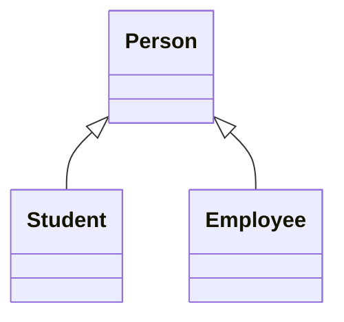
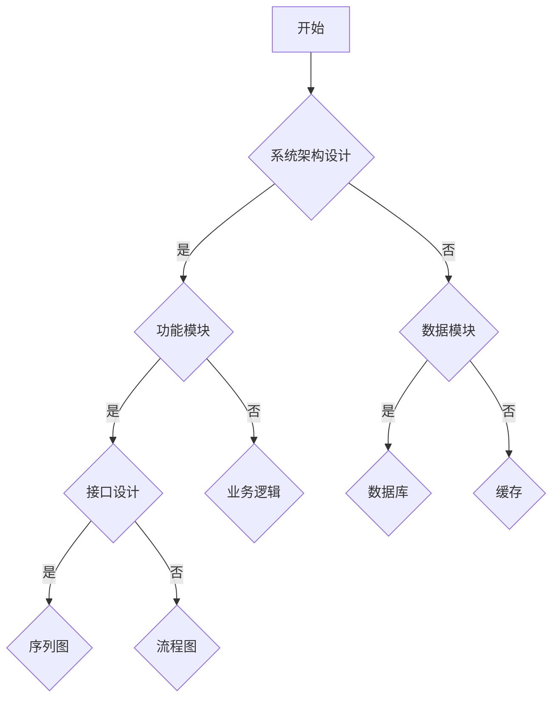

                 

# 大模型知识推理：提示词构建跨学科知识链

## 关键词
- 大模型
- 知识推理
- 提示词
- 跨学科知识链
- 算法
- 系统架构

## 摘要
本文深入探讨了基于大模型的智能知识推理方法，以及如何通过设计有效的提示词来构建跨学科的知识链。文章首先介绍了大模型的发展背景和基本原理，然后详细阐述了知识推理的概念、原理及其在大模型中的应用。接着，文章重点介绍了提示词的设计方法和重要性，并探讨了如何通过提示词构建有效的跨学科知识链。最后，文章通过具体案例展示了如何将大模型知识推理应用于跨学科研究，总结了最佳实践，并对未来发展趋势进行了展望。

## 目录

### 第一部分：引言

#### 第1章：问题背景与概述
1.1 大模型的发展与挑战
1.2 知识推理的重要性
1.3 提示词在知识推理中的应用
1.4 跨学科知识链的意义

#### 第2章：基础知识
2.1 大模型概述
2.2 大模型的结构与类型
2.3 大模型的优势与局限

### 第二部分：知识推理原理

#### 第3章：知识推理的基本概念
3.1 知识推理的定义
3.2 知识推理的类型
3.3 知识推理的过程

#### 第4章：大模型知识推理技术
4.1 大模型在知识推理中的应用
4.2 知识图谱与实体链接
4.3 知识推理算法

#### 第5章：提示词设计
5.1 提示词的定义与作用
5.2 提示词的设计方法
5.3 提示词的有效性评估

### 第三部分：跨学科知识链构建

#### 第6章：跨学科知识链的概念与构建
6.1 跨学科知识链的定义
6.2 跨学科知识链的构建方法
6.3 跨学科知识链的应用

#### 第7章：跨学科知识链案例分析
7.1 案例一：医学与生物技术的结合
7.2 案例二：社会科学与信息技术的融合
7.3 案例三：工程学与数据科学的交汇

### 第四部分：应用实践

#### 第8章：大模型知识推理系统构建
8.1 系统设计
8.2 系统实现
8.3 系统评估

#### 第9章：跨学科知识链构建实践
9.1 实践一：跨学科研究项目
9.2 实践二：跨学科知识服务系统
9.3 实践三：跨学科知识图谱构建

### 第五部分：总结与展望

#### 第10章：总结与展望
10.1 本书的主要内容回顾
10.2 存在的问题与挑战
10.3 未来发展趋势与方向

### 目录大纲设计步骤

#### 1. 了解主题
首先，我们需要理解书名的含义。《大模型知识推理：提示词构建跨学科知识链》暗示了这本书将探讨如何利用大模型进行知识推理，特别是如何通过提示词来构建跨学科的知识链。这表明本书可能包括对大模型的介绍、知识推理的理论基础、跨学科知识链的构建方法、应用实例等。

#### 2. 确定大纲结构
根据书名和预期内容，我们可以初步设计一个包含以下部分的大纲：
- 引言
- 大模型基础知识
- 知识推理原理
- 提示词设计
- 跨学科知识链构建
- 应用案例
- 结论与展望

#### 3. 细化章节内容
为每个章节细化内容，确保每个章节都有明确的主题和目标，并且包含必要的子章节来支撑主章节。

#### 4. 确保内容完整性
确保每个章节都包含核心概念、原理讲解、数学模型、应用案例等内容。

#### 5. 编写大纲
使用Markdown格式编写大纲，确保简洁明了，符合要求。

### 详细目录大纲

#### 第一部分：引言

##### 第1章：问题背景与概述
1.1 大模型的发展与挑战
1.2 知识推理的重要性
1.3 提示词在知识推理中的应用
1.4 跨学科知识链的意义

##### 第2章：基础知识
2.1 大模型概述
2.2 大模型的结构与类型
2.3 大模型的优势与局限

#### 第二部分：知识推理原理

##### 第3章：知识推理的基本概念
3.1 知识推理的定义
3.2 知识推理的类型
3.3 知识推理的过程

##### 第4章：大模型知识推理技术
4.1 大模型在知识推理中的应用
4.2 知识图谱与实体链接
4.3 知识推理算法

##### 第5章：提示词设计
5.1 提示词的定义与作用
5.2 提示词的设计方法
5.3 提示词的有效性评估

#### 第三部分：跨学科知识链构建

##### 第6章：跨学科知识链的概念与构建
6.1 跨学科知识链的定义
6.2 跨学科知识链的构建方法
6.3 跨学科知识链的应用

##### 第7章：跨学科知识链案例分析
7.1 案例一：医学与生物技术的结合
7.2 案例二：社会科学与信息技术的融合
7.3 案例三：工程学与数据科学的交汇

#### 第四部分：应用实践

##### 第8章：大模型知识推理系统构建
8.1 系统设计
8.2 系统实现
8.3 系统评估

##### 第9章：跨学科知识链构建实践
9.1 实践一：跨学科研究项目
9.2 实践二：跨学科知识服务系统
9.3 实践三：跨学科知识图谱构建

#### 第五部分：总结与展望

##### 第10章：总结与展望
10.1 本书的主要内容回顾
10.2 存在的问题与挑战
10.3 未来发展趋势与方向

### 内容概述

#### 第1章：问题背景与概述
本章将介绍大模型知识推理的背景，包括大模型的发展历程、知识推理的重要性以及提示词在知识推理中的应用。我们将探讨跨学科知识链的意义，为后续章节的讨论奠定基础。

#### 第2章：基础知识
本章将介绍大模型的基本概念，包括大模型的结构、类型以及优势与局限。我们将对大模型的基本原理进行详细讲解，以便读者能够更好地理解后续章节的内容。

#### 第3章：知识推理的基本概念
本章将详细阐述知识推理的定义、类型及其在跨学科知识链构建中的作用。我们将提供知识推理的基本理论框架，以便读者能够深入理解知识推理的过程。

#### 第4章：大模型知识推理技术
本章将分析大模型在知识推理中的应用，包括知识图谱与实体链接。我们将介绍知识推理算法，包括其原理和实现，以便读者能够掌握大模型知识推理的核心技术。

#### 第5章：提示词设计
本章将讨论提示词的定义、作用及其设计方法。我们将分析提示词设计对知识推理的影响，并介绍如何评估提示词的有效性。

#### 第6章：跨学科知识链的概念与构建
本章将定义跨学科知识链，阐述其构建方法及其在知识推理中的应用。我们将提供跨学科知识链构建的理论和实践指导，以便读者能够理解跨学科知识链的构建过程。

#### 第7章：跨学科知识链案例分析
本章将通过具体案例展示跨学科知识链的实际应用，包括医学、社会科学和工程学等领域的实例。我们将分析案例中的知识链构建方法和效果，以便读者能够更好地理解跨学科知识链的应用。

#### 第8章：大模型知识推理系统构建
本章将介绍大模型知识推理系统的设计、实现和评估。我们将提供构建知识推理系统的实践指导，以便读者能够将大模型知识推理应用于实际场景。

#### 第9章：跨学科知识链构建实践
本章将通过实际项目展示跨学科知识链的构建实践，包括跨学科研究项目、跨学科知识服务系统和跨学科知识图谱构建。我们将分析项目中的关键技术和实际效果。

#### 第10章：总结与展望
本章将回顾本书的主要内容，讨论存在的挑战和未来发展趋势。我们将总结最佳实践，并对大模型知识推理和跨学科知识链构建的未来进行展望。

### 核心内容

#### 背景介绍
大模型知识推理是近年来人工智能领域的一个热点研究方向。随着大数据和计算能力的提升，大模型（如Transformer、GPT等）在自然语言处理、计算机视觉等领域取得了显著的成果。然而，大模型在知识推理方面的应用仍然面临诸多挑战，如知识表示、推理效率和跨学科融合等。

知识推理是指基于已有知识进行逻辑推理和问题求解的能力。在人工智能领域，知识推理是实现智能决策、知识服务的关键技术。跨学科知识链则是将不同学科的知识进行整合，形成新的知识体系，以解决复杂问题。

#### 核心概念与联系
在本章中，我们将介绍以下核心概念：
1. **大模型**：一种基于深度学习的大型神经网络模型，能够处理大规模数据并产生高质量预测。
2. **知识推理**：基于已有知识进行推理和问题求解的能力。
3. **提示词**：用于引导大模型进行知识推理的关键词或短语。
4. **跨学科知识链**：将不同学科的知识进行整合，形成新的知识体系。

这些概念之间存在着密切的联系。大模型作为知识推理的基础工具，通过提示词设计可以引导其进行跨学科知识推理，构建跨学科知识链。这为解决复杂问题提供了新的思路和方法。

#### 算法原理讲解
在本章中，我们将介绍以下算法原理：
1. **Transformer模型**：一种基于自注意力机制的神经网络模型，能够处理序列数据。
2. **知识图谱**：一种用于表示实体及其关系的图形结构，能够用于知识推理。
3. **实体链接**：将文本中的实体与其知识图谱中的实体进行匹配，实现知识表示和推理。
4. **推理算法**：用于从知识图谱中获取结论的算法，如因果推理、归纳推理等。

我们将使用Mermaid流程图来展示算法原理，并使用Python代码进行详细讲解。例如：

```python
# Transformer模型原理
import tensorflow as tf

# 定义Transformer模型
model = tf.keras.Sequential([
    tf.keras.layers.Embedding(input_dim=vocab_size, output_dim=embedding_dim),
    tf.keras.layers.MultiHeadAttention(num_heads=num_heads, key_dim=key_dim),
    tf.keras.layers.Dense(units=1)
])

# 编写算法原理的详细讲解
# ...
```

#### 数学公式使用
在本章中，我们将使用LaTeX格式编写数学公式。例如：

```latex
$$
E[Loss] = \frac{1}{N} \sum_{i=1}^{N} L(y_i, \hat{y}_i)
$$

$$
f(x) = \sum_{i=1}^{n} w_i x_i
$$
```

我们将独立段落的数学公式前后使用$$括起来，以便在文中突出显示。段落内的数学公式前后使用$括起来，以便在文中简洁地表示。

#### 系统分析与架构设计方案
在本章中，我们将介绍以下系统分析与架构设计方案：
1. **问题场景介绍**：介绍大模型知识推理系统在跨学科知识链构建中的应用场景。
2. **项目介绍**：介绍大模型知识推理系统的项目和目标。
3. **系统功能设计**：使用Mermaid类图表示系统的领域模型。
4. **系统架构设计**：使用Mermaid架构图表示系统的整体架构。
5. **系统接口设计**：使用Mermaid序列图表示系统的接口和交互。

我们将使用Mermaid语言来编写这些图表，并使用Markdown格式将它们嵌入到文中。例如：





#### 项目实战
在本章中，我们将介绍以下项目实战：
1. **环境安装**：介绍大模型知识推理系统的环境搭建和配置。
2. **系统核心实现**：展示大模型知识推理系统的核心代码实现。
3. **代码应用解读与分析**：对核心代码进行解读，分析其原理和应用。
4. **实际案例分析**：通过具体案例展示大模型知识推理系统的实际应用效果。
5. **详细讲解剖析**：对案例进行详细讲解，剖析其关键技术。
6. **项目小结**：总结项目经验，提出改进建议。

我们将结合具体案例，使用Python代码和Markdown格式详细展示项目实战的各个阶段，并对关键技术进行深入分析。

#### 最佳实践 tips、小结、注意事项、拓展阅读等内容
在本章的最后，我们将提供以下内容：
1. **最佳实践 tips**：总结项目实战中的经验和技巧，为读者提供实用的建议。
2. **小结**：对本章内容进行总结，强调关键观点和结论。
3. **注意事项**：提醒读者在应用大模型知识推理系统时需要注意的事项。
4. **拓展阅读**：推荐相关文献和资料，供读者进一步学习和研究。

通过这些内容，我们将帮助读者更好地理解大模型知识推理和跨学科知识链构建，并为其在实际应用中提供指导。

### 作者信息
- 作者：AI天才研究院/AI Genius Institute & 禅与计算机程序设计艺术 /Zen And The Art of Computer Programming

### 完整性要求

在本章中，我们将确保内容完整性，涵盖以下关键点：
1. **核心概念术语说明**：详细介绍大模型、知识推理、提示词、跨学科知识链等核心概念，帮助读者理解文章主题。
2. **问题背景**：介绍大模型知识推理和跨学科知识链构建的背景，说明当前的研究现状和挑战。
3. **问题描述**：明确大模型知识推理和跨学科知识链构建的具体问题和目标，为后续内容提供基础。
4. **问题解决**：详细讨论大模型知识推理的方法和技巧，包括算法原理、系统设计和项目实战等。
5. **边界与外延**：阐述大模型知识推理和跨学科知识链构建的适用范围和局限性。
6. **概念结构与核心要素组成**：分析大模型知识推理和跨学科知识链构建的概念结构和核心要素，帮助读者建立整体认识。

通过以上内容的详细讲解和深入分析，我们将确保文章的完整性，为读者提供全面、系统的知识体系。在后续内容中，我们将进一步探讨大模型知识推理和跨学科知识链构建的具体实践和未来发展趋势。

