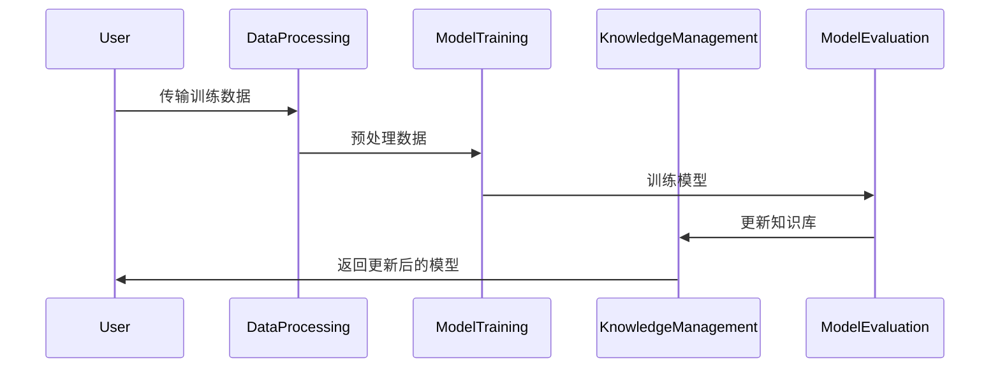

                 


### 文章标题：大模型知识更新：提示词保持模型时效性

### 关键词：
- 大模型
- 知识更新
- 提示词
- 时效性
- 模型维护

### 摘要：
本文将深入探讨大模型领域中的一个关键问题——如何通过提示词保持模型的时效性。随着大模型技术的不断发展，模型的时效性显得尤为重要。本文将从背景介绍、核心概念联系、算法原理讲解、系统架构设计与实现、项目实战和分析等方面，逐步解析这一问题的解决策略。

---

## 引言与背景

### 1.1 问题背景
随着人工智能技术的飞速发展，大模型（如GPT、BERT等）在各个领域的应用日益广泛。然而，这些模型在长时间的使用过程中，知识库的时效性成为一个不可忽视的问题。如何保持大模型的知识更新，使其在处理问题时能够准确、及时地获取相关信息，成为当前研究的重点。

### 1.2 问题描述
大模型的知识库时效性问题主要体现在以下几个方面：
- 新增知识的获取与整合
- 已有知识的更新与修正
- 过时知识的过滤与去除

### 1.3 问题解决
针对上述问题，本文提出了以下解决思路：
- 通过提示词引导模型获取最新信息
- 设计算法实现知识的自动更新与修正
- 建立机制对过时知识进行识别与剔除

### 1.4 边界与外延
在探讨大模型知识更新问题时，需要注意以下边界与外延：
- 模型的训练数据范围
- 知识更新的频率与策略
- 模型的应用场景与需求

---

## 大模型的概念与重要性

### 2.1 大模型定义
大模型是指具有海量参数、能够在多个任务上表现出色的深度学习模型。例如，GPT系列模型、BERT模型等。

### 2.2 大模型特点
- 参数规模庞大
- 训练数据丰富
- 通用性强
- 表现优异

### 2.3 大模型与传统模型的区别
- 训练数据量与参数规模
- 应用场景的多样性
- 适应性

### 2.4 大模型的时代背景
- 数据的爆发式增长
- 计算能力的提升
- 人工智能应用的普及

---

## 提示词保持模型时效性的概念与意义

### 3.1 时效性定义
时效性是指知识库中的信息在某一时间段内的准确性和有效性。

### 3.2 提示词在模型中的作用
提示词是一种引导模型获取特定信息的方法，通过提示词，模型可以更精确地定位到所需的知识点。

### 3.3 时效性对模型的影响
- 影响模型的预测准确性
- 影响模型在特定领域的应用效果
- 决定模型在知识更新中的地位

### 3.4 维护时效性的必要性
- 随着时间推移，知识库中的信息会逐渐过时
- 新兴领域的快速崛起，需要模型不断更新知识
- 满足用户对实时、准确信息的需求

---

## 核心概念联系

### 4.1 大模型核心概念
- 参数规模
- 训练数据
- 适应性
- 表现优异

### 4.2 提示词保持时效性的方法
- 通过提示词引导模型获取最新信息
- 设计算法实现知识的自动更新与修正
- 建立机制对过时知识进行识别与剔除

### 4.3 概念属性特征对比
| 特征       | 大模型              | 提示词保持时效性         |
|------------|---------------------|------------------------|
| 参数规模   | 海量参数            | 引导信息获取            |
| 训练数据   | 丰富训练数据        | 自动更新与修正          |
| 适应性     | 多场景应用          | 实时知识获取            |
| 表现优异   | 高性能表现          | 准确性提升              |

### 4.4 ER实体关系图架构
```mermaid
erDiagram
    Model ||--o{ KnowledgeBase } KnowledgeBase
    Model ||--o{ Prompt } Prompt
    KnowledgeBase ||--o{ Information } Information
    Prompt ||--o{ Question } Question
```

---

## 算法原理讲解

### 5.1 算法原理概述
本文提出的算法旨在通过提示词引导模型获取最新知识，实现知识库的自动更新与修正。

### 5.2 算法流程
#### 5.2.1 数据预处理
对训练数据进行清洗、预处理，提取关键信息。

#### 5.2.2 模型训练
使用预处理后的数据对模型进行训练，使其具备获取最新知识的能力。

#### 5.2.3 模型评估
通过测试集评估模型的表现，确保模型在知识更新方面的有效性。

#### 5.2.4 时效性保持策略
采用提示词引导模型获取最新信息，并设计算法实现知识的自动更新与修正。

### 7.1 Python代码实现
```python
# Example code snippet
```

### 7.2 例子解释
本文将通过一个简单的Python代码示例，展示如何使用提示词引导模型获取最新知识。

---

## 系统架构与实现

### 8.1 系统分析与架构设计
系统架构设计主要包括数据流、系统功能设计和系统架构设计。

### 8.2 系统功能设计
- 数据采集与预处理
- 模型训练与评估
- 知识库管理与更新

### 8.3 系统架构设计


### 8.4 系统接口设计
- 数据接口：提供数据上传、下载和查询功能
- 控制接口：提供模型训练、评估和更新功能
- 用户接口：提供用户操作和交互界面

---

## 系统交互与实现细节

### 9.1 系统交互
系统交互主要涉及数据流和控制流。

### 9.2 实现细节
- 环境安装：Python环境搭建、依赖库安装
- 系统核心实现：模型训练与评估模块、知识库管理模块
- 代码应用解读：代码注释和详细解析

---

## 项目实战与分析

### 10.1 实际案例介绍
本文将介绍一个实际的大模型知识更新项目，包括项目背景、目标、实现过程和效果评估。

### 10.2 核心实现与代码分析
- 代码解读：核心代码功能解析
- 分析与优化：性能优化和问题解决

### 10.3 项目小结
总结项目的成功经验和不足之处，为未来的项目提供参考。

---

## 附录

### 10.1 最佳实践 Tips
- 数据清洗技巧
- 模型调优策略
- 性能优化方法

### 10.2 注意事项
- 数据安全措施
- 法律法规遵守
- 模型可靠性保障

### 10.3 拓展阅读
- 相关研究论文
- 行业动态分析
- 技术趋势探讨

---

作者：AI天才研究院/AI Genius Institute & 禅与计算机程序设计艺术 /Zen And The Art of Computer Programming

