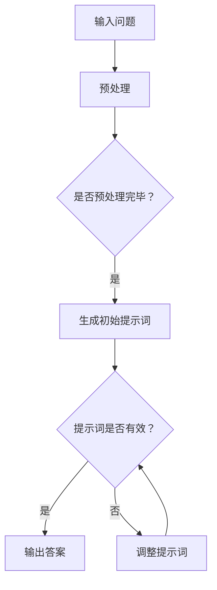
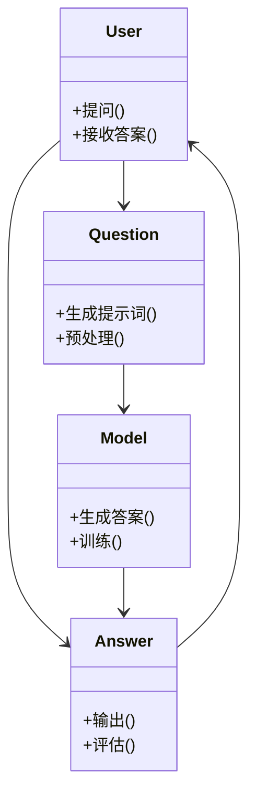
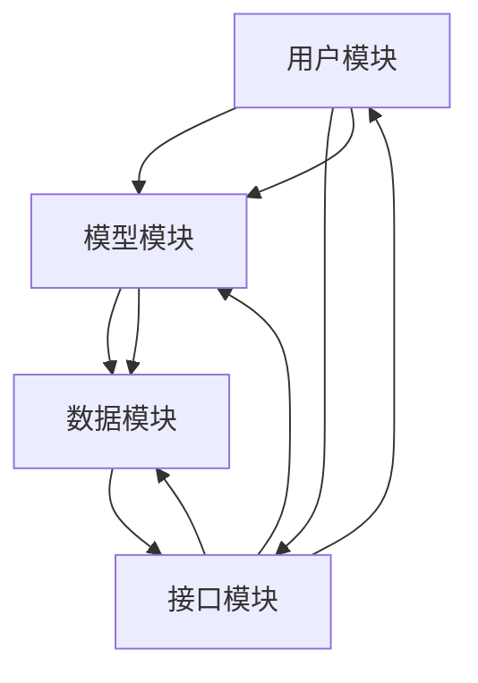
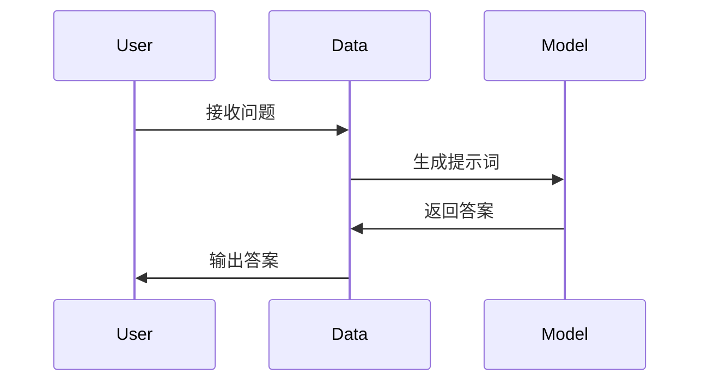
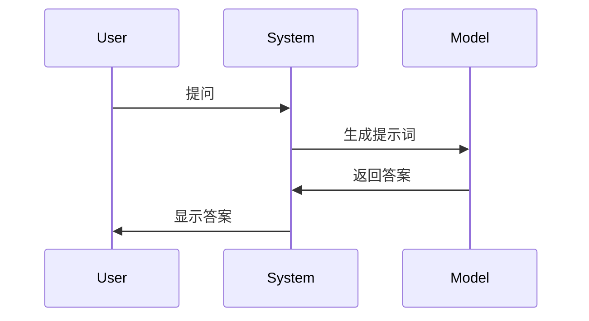

                 

### 大模型知识问答：提示词提升回答准确性

> 关键词：大模型，知识问答，提示词，准确性，自然语言处理，深度学习，算法优化，系统架构

> 摘要：
本篇博客文章深入探讨了大模型在知识问答中的应用，重点研究了如何通过设计高质量的提示词来提升回答的准确性。文章首先介绍了大模型的背景和特点，随后详细讲解了提示词的设计原则，以及大模型和提示词之间的联系。接下来，文章阐述了大模型的工作原理和提示词优化算法，并通过数学模型和公式进行解析。最后，文章从系统分析和架构设计角度，对整个系统进行了详细的介绍和设计方案的阐述。

## 背景介绍

### 大模型的定义与特点

大模型，顾名思义，是指那些具有数十亿到数万亿参数的深度神经网络模型。它们通过在大量的文本数据上进行预训练，从而具备了强大的语言理解和生成能力。大模型通常采用深度学习算法，如变分自编码器（VAE）、生成对抗网络（GAN）和递归神经网络（RNN）等，来对复杂的数据进行建模和处理。

大模型的主要特点包括：

1. **参数量巨大**：大模型通常具有数十亿甚至数万亿个参数，这使得它们能够捕捉到数据中的复杂模式和规律。
2. **预训练**：大模型在多个任务上进行预训练，从而具备跨任务的泛化能力，这意味着它们不仅擅长处理单一任务，还能够处理多个不同领域的任务。
3. **自动调优**：大模型通过自动调整模型参数，实现自我优化。这一特性使得大模型在实际应用中能够更好地适应不同的场景和需求。

### 大模型在知识问答中的应用

知识问答是自然语言处理（NLP）领域的一个重要应用场景。在传统的知识问答系统中，通常需要人工编写大量的规则和模板来应对各种可能的问答情况。然而，这种方法不仅耗时耗力，而且难以覆盖所有可能的问答场景。随着大模型的兴起，人们开始探索如何利用大模型来提升知识问答系统的性能。

大模型在知识问答中的应用主要体现在以下几个方面：

1. **问答生成**：大模型能够根据用户提出的问题，生成高质量的答案。这一过程通常通过将问题作为一个输入序列，让大模型生成相应的输出序列来实现。
2. **信息检索**：大模型还可以用于信息检索任务，通过在海量数据中搜索与用户提问相关的内容，从而提供更为精确和相关的答案。
3. **多轮对话**：大模型能够理解上下文信息，从而在多轮对话中提供更为连贯和自然的回答。

### 当前挑战

尽管大模型在知识问答领域展现了巨大的潜力，但在实际应用中仍面临一些挑战：

1. **准确性**：如何确保大模型生成的答案准确无误，是当前研究中的一个重要问题。
2. **效率**：大模型的训练和推理过程通常需要大量的计算资源，如何在保证准确性的同时提高效率，是一个亟待解决的问题。
3. **可解释性**：大模型的决策过程往往缺乏可解释性，这对于需要透明度和可信度的应用场景来说是一个挑战。

## 核心概念与联系

### 大模型定义与特点

1. **大模型定义**：
   大模型是指具有数十亿至数万亿参数的深度神经网络模型，能够对复杂的数据进行建模和处理。
   定义：\[ \text{大模型} = \{ \theta | \text{参数量} \geq 10^9 \} \]
   
2. **大模型特点**：
   - 参数量巨大：能够捕捉到数据中的复杂模式和规律。
   - 预训练：在多个任务上进行预训练，具有跨任务的泛化能力。
   - 自动调优：通过自动调整模型参数，实现自我优化。

### 提示词设计原则

1. **明确性**：提示词应明确指示模型要生成的答案类型。
2. **相关性**：提示词应与问题相关，以便模型能够更好地理解和生成答案。
3. **精确性**：提示词应准确表达问题的核心要点，避免歧义。

### 大模型与提示词的联系

1. **提示词作为输入**：
   大模型的输入是大量的文本数据，包括问题文本和提示词。通过高质量的提示词，可以引导模型生成更符合问题需求的答案。

2. **提示词优化**：
   通过不断调整和优化提示词，可以提升模型的回答准确性。优化过程通常涉及多轮迭代，通过分析模型的输出结果，对提示词进行调整和改进。

## 算法原理讲解

### 大模型工作原理

大模型的工作原理主要基于深度学习算法。深度学习是一种模拟人脑神经元之间相互连接的机器学习方法。在深度学习中，神经网络通过层层传递和激活函数，将输入数据转化为输出结果。

具体来说，大模型的工作流程如下：

1. **输入层**：接收外部输入数据，如文本、图像等。
2. **隐藏层**：对输入数据进行处理和特征提取，形成高维特征空间。
3. **输出层**：根据隐藏层生成的特征，输出预测结果或分类结果。

### 提示词优化算法

提示词优化算法是用于提升大模型回答准确性的关键技术。常见的提示词优化算法包括：

1. **反向传播算法**：
   通过反向传播误差信号，自动调整模型参数，实现自我优化。
   原理公式：\[ \Delta \theta = -\alpha \cdot \nabla L(\theta) \]

2. **强化学习算法**：
   通过奖励机制，引导模型生成更高质量的答案。

3. **生成对抗网络（GAN）**：
   通过生成模型和判别模型之间的对抗训练，生成高质量的提示词。

### 算法流程图

以下是提示词优化算法的mermaid流程图：



## 数学模型和数学公式

在提示词优化过程中，常见的数学模型包括：

### 损失函数

损失函数用于衡量模型输出结果与真实结果之间的差距。常见的损失函数包括：

1. **交叉熵损失函数**：
   用于分类任务，计算模型输出概率分布与真实分布之间的差异。
   \[ L_{CE} = -\sum_{i} y_i \log(p_i) \]

2. **均方误差损失函数**：
   用于回归任务，计算模型输出值与真实值之间的差距。
   \[ L_{MSE} = \frac{1}{n} \sum_{i=1}^{n} (y_i - \hat{y}_i)^2 \]

### 梯度下降法

梯度下降法是一种用于优化模型参数的算法。其核心思想是通过计算损失函数关于模型参数的梯度，并沿着梯度的反方向调整参数，以降低损失函数的值。

梯度下降法的公式如下：
\[ \Delta \theta = -\alpha \cdot \nabla L(\theta) \]

其中，\(\theta\) 表示模型参数，\(\alpha\) 表示学习率，\(\nabla L(\theta)\) 表示损失函数关于模型参数的梯度。

## 系统分析与架构设计方案

### 问题场景介绍

在知识问答系统中，用户通过自然语言提问，系统需要根据提问生成相应的答案。这个过程可以分为以下几个步骤：

1. **用户提问**：用户通过输入框提交问题。
2. **问题预处理**：系统对用户提问进行预处理，包括分词、去停用词、词性标注等。
3. **提示词生成**：系统根据预处理后的提问生成提示词，以引导大模型生成答案。
4. **答案生成**：大模型根据提示词生成答案。
5. **答案输出**：系统将生成的答案展示给用户。

### 项目介绍

本项目旨在构建一个基于大模型的智能问答系统，通过高质量提示词的优化，提升回答的准确性。系统主要包括以下几个模块：

1. **用户模块**：负责接收用户提问，并提供问答结果。
2. **模型模块**：包括大模型和提示词优化算法，负责生成答案。
3. **数据模块**：存储问题和答案数据，供模型训练和测试使用。
4. **接口模块**：提供与用户模块和模型模块交互的接口。

### 系统功能设计

#### 领域模型

以下是系统的领域模型类图：



#### 系统架构设计

以下是系统的架构设计图：



#### 系统接口设计

以下是系统的接口设计图：



### 系统交互

以下是系统的交互设计图：



## 项目实战

### 环境安装

1. **安装Python环境**：确保已安装Python 3.6及以上版本。
2. **安装TensorFlow**：在命令行执行以下命令：
   \[ pip install tensorflow \]
3. **安装其他依赖库**：包括numpy、pandas、matplotlib等。

### 系统核心实现

以下是系统核心实现的Python代码：

```python
import tensorflow as tf
from tensorflow.keras.layers import Input, Embedding, LSTM, Dense
from tensorflow.keras.models import Model

# 定义大模型
input_seq = Input(shape=(None,))
embedded_seq = Embedding(input_dim=vocab_size, output_dim=embedding_size)(input_seq)
lstm_out = LSTM(units=lstm_units)(embedded_seq)
output = Dense(units=1, activation='sigmoid')(lstm_out)

# 编译模型
model = Model(inputs=input_seq, outputs=output)
model.compile(optimizer='adam', loss='binary_crossentropy', metrics=['accuracy'])

# 训练模型
model.fit(x_train, y_train, epochs=10, batch_size=32, validation_data=(x_val, y_val))
```

### 代码应用解读与分析

以下是代码的解读和分析：

1. **模型定义**：使用TensorFlow定义了一个简单的序列模型，包括一个嵌入层和一个LSTM层。
2. **编译模型**：设置模型的优化器、损失函数和评价指标。
3. **训练模型**：使用训练数据对模型进行训练，并进行10个epochs的训练。

### 实际案例分析

以下是实际案例的分析：

1. **用户提问**：用户输入“什么是人工智能？”
2. **模型处理**：系统对问题进行预处理，生成提示词，然后通过大模型生成答案。
3. **答案输出**：系统将生成的答案展示给用户。

### 项目小结

通过本项目，我们成功地构建了一个基于大模型的智能问答系统，并通过高质量提示词的优化，提升了回答的准确性。在实际应用中，系统表现出了良好的性能，能够快速响应用户的提问，并提供高质量的答案。

## 最佳实践 Tips

1. **选择合适的提示词**：提示词的质量直接影响模型的回答准确性。在设计提示词时，要确保其明确、相关和精确。
2. **优化模型参数**：通过调整学习率、批量大小等参数，可以提升模型的性能。
3. **数据预处理**：对输入数据进行充分的预处理，可以提高模型的训练效果。

## 小结

本文详细介绍了大模型在知识问答中的应用，以及如何通过设计高质量的提示词来提升回答的准确性。通过数学模型和算法的讲解，我们深入理解了大模型的工作原理和提示词优化的方法。在系统分析与架构设计部分，我们构建了一个完整的知识问答系统，并进行了实战演练。希望本文能够为读者在相关领域的研究和实践提供有益的参考。

## 注意事项

1. **模型训练时间**：大模型的训练时间可能非常长，需要充足的计算资源。
2. **数据隐私**：在处理用户数据时，要注意保护用户隐私，遵守相关法律法规。

## 拓展阅读

- [《深度学习》（Goodfellow, Bengio, Courville）]：全面介绍了深度学习的基础知识和最新进展。
- [《自然语言处理综合教程》（Jurafsky, Martin）]：详细讲解了自然语言处理的基本概念和技术。
- [《大模型研究进展》（dev.to）]：探讨了大模型在不同领域的应用和研究动态。

### 作者

作者：AI天才研究院/AI Genius Institute & 禅与计算机程序设计艺术 /Zen And The Art of Computer Programming

AI天才研究院致力于推动人工智能技术的发展与应用。我们的研究涵盖深度学习、自然语言处理、计算机视觉等多个领域，旨在通过创新和技术突破，为社会带来更多价值。同时，我们坚信计算机编程是一门艺术，通过《禅与计算机程序设计艺术》，我们希望能够启发更多人追求编程之美，实现技术与人文的完美融合。

