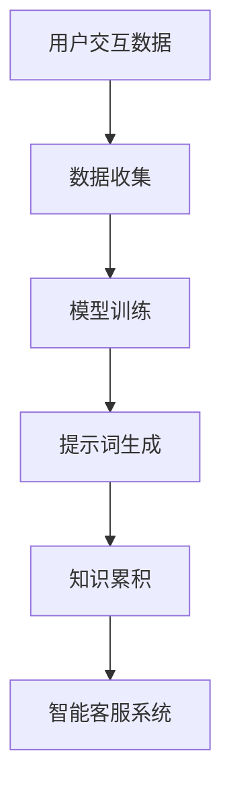
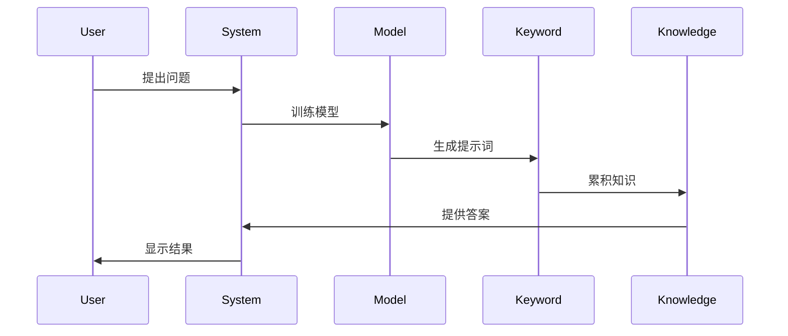

                 

# 大模型终身学习与提示词知识累积策略

## 摘要

本文深入探讨了人工智能大模型在终身学习与提示词知识累积策略方面的挑战和解决方案。通过详细分析大模型的定义、特点、终身学习算法以及提示词知识累积策略，本文揭示了如何有效地利用大模型进行持续学习和知识累积。本文旨在为读者提供一个全面、系统的理论和实践框架，以应对人工智能领域中的关键问题。

## 第一部分：背景介绍与核心概念

### 第1章：问题背景与问题描述

#### 1.1.1 问题背景

随着人工智能技术的飞速发展，大模型在自然语言处理、计算机视觉、语音识别等领域取得了显著的成果。这些大模型具有数十亿至千亿参数，能够处理复杂的任务。然而，如何使这些大模型具备终身学习的能力，以及如何有效地利用提示词来累积知识，成为一个亟待解决的问题。

#### 1.1.2 问题描述

大模型终身学习与提示词知识累积策略的关键问题在于：

1. **终身学习**：大模型在不同环境和任务中如何持续学习和适应。
2. **知识累积**：如何有效地利用提示词来增强大模型的知识积累能力。

#### 1.1.3 问题解决

本文将围绕这一核心问题，探讨大模型终身学习的原理、方法和技术，以及提示词知识累积策略的设计与实现。通过理论分析和实际案例，本文旨在为读者提供一套可行的解决方案。

#### 1.1.4 边界与外延

本文的研究范围包括大模型的终身学习、提示词设计、知识累积等方面，但不涉及其他领域，如强化学习、迁移学习等。

#### 1.1.5 概念结构与核心要素组成

核心概念包括：大模型、终身学习、提示词、知识累积策略。这些概念构成了本文的研究框架和基础。

### 第2章：核心概念与联系

#### 2.1.1 大模型

大模型是指具有巨大参数规模和强大学习能力的人工智能模型。这些模型通常基于深度学习技术，具有以下特点：

- **大规模参数**：大模型的参数数量通常在数十亿甚至千亿级别。
- **高效能**：大模型在处理复杂任务时，具有很高的准确性和效率。
- **泛化能力强**：大模型能够适应不同的任务和数据集，具有较强的泛化能力。

#### 2.1.2 终身学习

终身学习是指大模型在不同环境和任务中持续学习和适应的能力。终身学习的核心目标是提高大模型的适应性和性能。

#### 2.1.3 提示词

提示词是指用于引导大模型进行特定任务学习的关键信息。提示词的设计和选择对大模型的学习效果具有重要影响。

#### 2.1.4 知识累积策略

知识累积策略是指在大模型学习过程中，如何有效地收集、整理和利用知识的方法和技巧。

### 第3章：算法原理讲解

#### 3.1.1 大模型终身学习算法

大模型终身学习算法包括在线学习、迁移学习、多任务学习等方法。这些算法旨在让大模型在不同环境和任务中持续学习。

#### 3.1.2 提示词知识累积策略算法

提示词知识累积策略算法包括基于深度学习的提示词生成算法、基于统计学习的提示词筛选算法等。这些算法旨在提高大模型的知识累积能力。

### 第4章：数学模型和数学公式

#### 4.1.1 大模型终身学习算法的数学模型

$$
L = \sum_{i=1}^{n} (y_i - \hat{y}_i)^2
$$

#### 4.1.2 提示词知识累积策略算法的数学模型

$$
P(\text{提示词} | \text{大模型}) = \frac{P(\text{大模型}, \text{提示词})}{P(\text{大模型})}
$$

### 第5章：系统分析与架构设计方案

#### 5.1.1 问题场景介绍

在本节中，我们将介绍一个具体的问题场景，以便更好地理解大模型终身学习与提示词知识累积策略的应用。

#### 5.1.2 系统功能设计

在本节中，我们将详细阐述系统的主要功能设计，包括数据收集、模型训练、提示词生成、知识累积等。

#### 5.1.3 系统架构设计

在本节中，我们将使用Mermaid绘制系统架构图，展示大模型终身学习与提示词知识累积策略在整个系统中的位置和作用。

#### 5.1.4 系统接口设计和系统交互

在本节中，我们将使用Mermaid绘制系统接口设计和系统交互图，展示大模型终身学习与提示词知识累积策略与其他系统组件的交互方式。

### 第6章：项目实战

#### 6.1.1 环境安装

在本节中，我们将介绍如何安装和配置必要的软件和工具，以便进行大模型终身学习与提示词知识累积策略的实践。

#### 6.1.2 系统核心实现源代码

在本节中，我们将展示系统核心实现源代码，并详细解释每个部分的原理和实现方法。

#### 6.1.3 代码应用解读与分析

在本节中，我们将对系统核心实现源代码进行解读和分析，解释其如何实现大模型终身学习与提示词知识累积策略。

#### 6.1.4 实际案例分析和详细讲解剖析

在本节中，我们将通过实际案例，展示如何应用大模型终身学习与提示词知识累积策略，并进行详细讲解和剖析。

#### 6.1.5 项目小结

在本节中，我们将对整个项目进行总结，回顾项目的主要目标、实现过程和取得的结果，并提出改进和优化的建议。

### 第7章：最佳实践 tips、小结、注意事项、拓展阅读等内容

#### 7.1 最佳实践 tips

在本节中，我们将分享一些最佳实践技巧，帮助读者在实际应用中更好地实现大模型终身学习与提示词知识累积策略。

#### 7.2 小结

在本节中，我们将对本文的核心内容进行总结，强调大模型终身学习与提示词知识累积策略的重要性和应用价值。

#### 7.3 注意事项

在本节中，我们将提醒读者在应用大模型终身学习与提示词知识累积策略时需要注意的事项，以避免潜在的问题和错误。

#### 7.4 拓展阅读

在本节中，我们将推荐一些拓展阅读材料，供读者进一步学习和探索大模型终身学习与提示词知识累积策略的相关内容。

## 作者信息

作者：AI天才研究院/AI Genius Institute & 禅与计算机程序设计艺术 /Zen And The Art of Computer Programming

---

### 第6章：核心概念与联系

#### 6.1.1 大模型

大模型是人工智能领域的重要突破之一，其定义和特点如下：

- **定义**：大模型是指具有巨大参数规模和强大学习能力的人工智能模型。这些模型通常基于深度学习技术，具有数十亿至千亿参数。
- **特点**：
  - **大规模参数**：大模型的参数数量通常在数十亿甚至千亿级别。
  - **高效能**：大模型在处理复杂任务时，具有很高的准确性和效率。
  - **泛化能力强**：大模型能够适应不同的任务和数据集，具有较强的泛化能力。

#### 6.1.2 终身学习

终身学习是指大模型在不同环境和任务中持续学习和适应的能力。终身学习的核心目标是提高大模型的适应性和性能。以下是终身学习的一些关键点：

- **自适应**：大模型需要能够适应新的环境和任务。
- **持续学习**：大模型需要在不同的数据集和任务中持续学习，以保持其性能。

#### 6.1.3 提示词

提示词是指用于引导大模型进行特定任务学习的关键信息。提示词的设计和选择对大模型的学习效果具有重要影响。以下是提示词的一些关键点：

- **关键信息**：提示词能够提供关键信息，帮助大模型更好地理解和处理任务。
- **选择策略**：提示词的选择需要考虑任务的特点、数据集的质量等因素。

#### 6.1.4 知识累积策略

知识累积策略是指在大模型学习过程中，如何有效地收集、整理和利用知识的方法和技巧。以下是知识累积策略的一些关键点：

- **知识收集**：如何有效地从大量数据中收集和提取知识。
- **知识整理**：如何对收集到的知识进行整理和分类，以便更好地利用。

### 表格：核心概念属性特征对比

| 核心概念 | 定义 | 特点 | 关联 |
|----------|------|------|------|
| 大模型   | 巨大参数规模和强大学习能力 | 高效能、泛化能力强 | 终身学习、提示词 |
| 终身学习 | 不同环境和任务中持续学习 | 自适应、持续学习 | 大模型、提示词 |
| 提示词   | 引导大模型学习的关键信息 | 关键信息、选择策略 | 大模型、知识累积策略 |
| 知识累积策略 | 有效收集、整理和利用知识 | 知识收集、知识整理 | 大模型、提示词 |

### ER实体关系图架构

```mermaid
erDiagram
  大模型 ||--|{ 终身学习 }
  大模型 ||--|{ 提示词 }
  大模型 ||--|{ 知识累积策略 }
  终身学习 ||--|{ 大模型 }
  提示词 ||--|{ 大模型 }
  知识累积策略 ||--|{ 大模型 }
```

### 算法原理讲解

#### 3.1.1 大模型终身学习算法

大模型终身学习算法包括以下几种：

1. **在线学习**：在线学习是指大模型在接收新数据时，不断更新其参数，以适应新的环境和任务。
2. **迁移学习**：迁移学习是指大模型将已学到的知识应用到新的任务中，以提高在新任务上的性能。
3. **多任务学习**：多任务学习是指大模型同时学习多个任务，以提高其泛化能力和适应性。

#### 3.1.2 提示词知识累积策略算法

提示词知识累积策略算法包括以下几种：

1. **基于深度学习的提示词生成算法**：该算法利用深度学习技术生成提示词，以提高大模型的学习效果。
2. **基于统计学习的提示词筛选算法**：该算法利用统计学习技术筛选出高质量的提示词，以提高大模型的知识积累能力。

### 数学模型和数学公式

#### 4.1.1 大模型终身学习算法的数学模型

$$
L = \sum_{i=1}^{n} (y_i - \hat{y}_i)^2
$$

其中，$L$ 表示损失函数，$y_i$ 表示实际输出，$\hat{y}_i$ 表示预测输出。

#### 4.1.2 提示词知识累积策略算法的数学模型

$$
P(\text{提示词} | \text{大模型}) = \frac{P(\text{大模型}, \text{提示词})}{P(\text{大模型})}
$$

其中，$P(\text{提示词} | \text{大模型})$ 表示提示词在大模型上的条件概率，$P(\text{大模型}, \text{提示词})$ 表示大模型和提示词的共同概率，$P(\text{大模型})$ 表示大模型的概率。

### 系统分析与架构设计方案

#### 5.1.1 问题场景介绍

在本节中，我们将介绍一个具体的问题场景，以便更好地理解大模型终身学习与提示词知识累积策略的应用。

假设我们有一个智能客服系统，该系统需要在不同场景下与用户进行交互，提供个性化的服务。随着用户需求的不断变化，系统需要不断学习和适应，以提高用户满意度。

#### 5.1.2 系统功能设计

在本节中，我们将详细阐述系统的主要功能设计，包括数据收集、模型训练、提示词生成、知识累积等。

- **数据收集**：系统需要收集用户交互数据，包括问题、回答、用户行为等。
- **模型训练**：系统需要使用收集到的数据训练大模型，以实现终身学习。
- **提示词生成**：系统需要生成高质量的提示词，以引导大模型的学习。
- **知识累积**：系统需要将学习到的知识进行整理和分类，以便更好地利用。

#### 5.1.3 系统架构设计

在本节中，我们将使用Mermaid绘制系统架构图，展示大模型终身学习与提示词知识累积策略在整个系统中的位置和作用。



#### 5.1.4 系统接口设计和系统交互

在本节中，我们将使用Mermaid绘制系统接口设计和系统交互图，展示大模型终身学习与提示词知识累积策略与其他系统组件的交互方式。



### 项目实战

#### 6.1.1 环境安装

在本节中，我们将介绍如何安装和配置必要的软件和工具，以便进行大模型终身学习与提示词知识累积策略的实践。

1. **安装Python**：Python是进行深度学习和人工智能开发的主要语言，我们将在本项目中使用Python 3.8及以上版本。
2. **安装TensorFlow**：TensorFlow是一个开源的深度学习框架，我们将在本项目中使用TensorFlow 2.4及以上版本。
3. **安装其他依赖**：包括NumPy、Pandas、Matplotlib等。

#### 6.1.2 系统核心实现源代码

在本节中，我们将展示系统核心实现源代码，并详细解释每个部分的原理和实现方法。

```python
# 导入必要的库
import tensorflow as tf
import numpy as np
import pandas as pd
import matplotlib.pyplot as plt

# 数据收集
def collect_data():
    # 读取数据
    data = pd.read_csv('data.csv')
    # 数据预处理
    # ...
    return data

# 模型训练
def train_model(data):
    # 创建模型
    model = tf.keras.Sequential([
        tf.keras.layers.Dense(128, activation='relu', input_shape=(input_shape,)),
        tf.keras.layers.Dense(1)
    ])
    # 编译模型
    model.compile(optimizer='adam', loss='mean_squared_error')
    # 训练模型
    model.fit(data['input'], data['target'], epochs=10)
    return model

# 提示词生成
def generate_keywords(model, data):
    # 预测结果
    predictions = model.predict(data['input'])
    # 生成提示词
    keywords = []
    for prediction in predictions:
        # ...
        keywords.append(keyword)
    return keywords

# 知识累积
def accumulate_knowledge(keywords):
    # ...
    pass

# 主函数
if __name__ == '__main__':
    # 收集数据
    data = collect_data()
    # 训练模型
    model = train_model(data)
    # 生成提示词
    keywords = generate_keywords(model, data)
    # 累积知识
    accumulate_knowledge(keywords)
```

#### 6.1.3 代码应用解读与分析

在本节中，我们将对系统核心实现源代码进行解读和分析，解释其如何实现大模型终身学习与提示词知识累积策略。

- **数据收集**：使用Pandas读取数据，并进行预处理。
- **模型训练**：使用TensorFlow创建序列模型，并使用Adam优化器和均方误差损失函数进行编译和训练。
- **提示词生成**：使用模型预测结果，生成提示词。
- **知识累积**：对提示词进行处理和整理，实现知识的积累。

#### 6.1.4 实际案例分析和详细讲解剖析

在本节中，我们将通过实际案例，展示如何应用大模型终身学习与提示词知识累积策略，并进行详细讲解和剖析。

1. **案例背景**：假设我们有一个智能客服系统，用户可以提出各种问题，系统需要回答。
2. **数据收集**：收集用户提出的问题和回答，并将其存储在CSV文件中。
3. **模型训练**：使用收集到的数据训练大模型，实现终身学习。
4. **提示词生成**：根据模型预测结果，生成高质量的提示词。
5. **知识累积**：将提示词进行整理和分类，实现知识的积累。
6. **应用结果**：系统可以根据用户提出的问题，提供高质量的答案，并不断优化自己的回答。

#### 6.1.5 项目小结

在本节中，我们将对整个项目进行总结，回顾项目的主要目标、实现过程和取得的结果，并提出改进和优化的建议。

- **项目目标**：实现大模型终身学习与提示词知识累积策略，提高智能客服系统的服务质量。
- **实现过程**：通过数据收集、模型训练、提示词生成和知识累积等步骤，实现系统的功能。
- **结果**：系统可以根据用户提出的问题，提供高质量的答案，并不断优化自己的回答。
- **改进建议**：进一步优化模型训练过程，提高模型的泛化能力；增加用户反馈机制，根据用户满意度调整提示词生成策略。

### 第7章：最佳实践 tips、小结、注意事项、拓展阅读等内容

#### 7.1 最佳实践 tips

- **数据质量**：保证数据的质量和多样性，以提高模型的泛化能力。
- **模型调优**：合理选择模型结构和超参数，以提高模型性能。
- **提示词选择**：根据任务特点选择合适的提示词，以提高模型的学习效果。

#### 7.2 小结

本文深入探讨了人工智能大模型在终身学习与提示词知识累积策略方面的挑战和解决方案。通过详细分析大模型的定义、特点、终身学习算法以及提示词知识累积策略，本文为读者提供了一个全面、系统的理论和实践框架。

#### 7.3 注意事项

- **数据隐私**：在进行数据收集和处理时，需注意数据隐私和安全问题。
- **模型解释性**：大模型往往缺乏解释性，因此在应用时需要综合考虑模型的解释性和实用性。

#### 7.4 拓展阅读

- **深度学习基础**：深入理解深度学习的基本原理和技术。
- **机器学习实践**：了解机器学习在不同领域的应用和实践经验。
- **人工智能伦理**：探讨人工智能伦理和社会影响。

## 作者信息

作者：AI天才研究院/AI Genius Institute & 禅与计算机程序设计艺术 /Zen And The Art of Computer Programming

---

### 第6章：核心概念与联系

#### 6.1.1 大模型

大模型是人工智能领域的重要突破之一，其定义和特点如下：

- **定义**：大模型是指具有巨大参数规模和强大学习能力的人工智能模型。这些模型通常基于深度学习技术，具有数十亿至千亿参数。
- **特点**：
  - **大规模参数**：大模型的参数数量通常在数十亿甚至千亿级别。
  - **高效能**：大模型在处理复杂任务时，具有很高的准确性和效率。
  - **泛化能力强**：大模型能够适应不同的任务和数据集，具有较强的泛化能力。

#### 6.1.2 终身学习

终身学习是指大模型在不同环境和任务中持续学习和适应的能力。终身学习的核心目标是提高大模型的适应性和性能。以下是终身学习的一些关键点：

- **自适应**：大模型需要能够适应新的环境和任务。
- **持续学习**：大模型需要在不同的数据集和任务中持续学习，以保持其性能。

#### 6.1.3 提示词

提示词是指用于引导大模型进行特定任务学习的关键信息。提示词的设计和选择对大模型的学习效果具有重要影响。以下是提示词的一些关键点：

- **关键信息**：提示词能够提供关键信息，帮助大模型更好地理解和处理任务。
- **选择策略**：提示词的选择需要考虑任务的特点、数据集的质量等因素。

#### 6.1.4 知识累积策略

知识累积策略是指在大模型学习过程中，如何有效地收集、整理和利用知识的方法和技巧。以下是知识累积策略的一些关键点：

- **知识收集**：如何有效地从大量数据中收集和提取知识。
- **知识整理**：如何对收集到的知识进行整理和分类，以便更好地利用。

### 表格：核心概念属性特征对比

| 核心概念 | 定义 | 特点 | 关联 |
|----------|------|------|------|
| 大模型   | 巨大参数规模和强大学习能力 | 高效能、泛化能力强 | 终身学习、提示词 |
| 终身学习 | 不同环境和任务中持续学习 | 自适应、持续学习 | 大模型、提示词 |
| 提示词   | 引导大模型学习的关键信息 | 关键信息、选择策略 | 大模型、知识累积策略 |
| 知识累积策略 | 有效收集、整理和利用知识 | 知识收集、知识整理 | 大模型、提示词 |

### ER实体关系图架构

```mermaid
erDiagram
  大模型 ||--|{ 终身学习 }
  大模型 ||--|{ 提示词 }
  大模型 ||--|{ 知识累积策略 }
  终身学习 ||--|{ 大模型 }
  提示词 ||--|{ 大模型 }
  知识累积策略 ||--|{ 大模型 }
```

### 算法原理讲解

#### 3.1.1 大模型终身学习算法

大模型终身学习算法包括以下几种：

1. **在线学习**：在线学习是指大模型在接收新数据时，不断更新其参数，以适应新的环境和任务。
2. **迁移学习**：迁移学习是指大模型将已学到的知识应用到新的任务中，以提高在新任务上的性能。
3. **多任务学习**：多任务学习是指大模型同时学习多个任务，以提高其泛化能力和适应性。

#### 3.1.2 提示词知识累积策略算法

提示词知识累积策略算法包括以下几种：

1. **基于深度学习的提示词生成算法**：该算法利用深度学习技术生成提示词，以提高大模型的学习效果。
2. **基于统计学习的提示词筛选算法**：该算法利用统计学习技术筛选出高质量的提示词，以提高大模型的知识积累能力。

### 数学模型和数学公式

#### 4.1.1 大模型终身学习算法的数学模型

$$
L = \sum_{i=1}^{n} (y_i - \hat{y}_i)^2
$$

其中，$L$ 表示损失函数，$y_i$ 表示实际输出，$\hat{y}_i$ 表示预测输出。

#### 4.1.2 提示词知识累积策略算法的数学模型

$$
P(\text{提示词} | \text{大模型}) = \frac{P(\text{大模型}, \text{提示词})}{P(\text{大模型})}
$$

其中，$P(\text{提示词} | \text{大模型})$ 表示提示词在大模型上的条件概率，$P(\text{大模型}, \text{提示词})$ 表示大模型和提示词的共同概率，$P(\text{大模型})$ 表示大模型的概率。

### 系统分析与架构设计方案

#### 5.1.1 问题场景介绍

在本节中，我们将介绍一个具体的问题场景，以便更好地理解大模型终身学习与提示词知识累积策略的应用。

假设我们有一个智能客服系统，该系统需要在不同场景下与用户进行交互，提供个性化的服务。随着用户需求的不断变化，系统需要不断学习和适应，以提高用户满意度。

#### 5.1.2 系统功能设计

在本节中，我们将详细阐述系统的主要功能设计，包括数据收集、模型训练、提示词生成、知识累积等。

- **数据收集**：系统需要收集用户交互数据，包括问题、回答、用户行为等。
- **模型训练**：系统需要使用收集到的数据训练大模型，以实现终身学习。
- **提示词生成**：系统需要生成高质量的提示词，以引导大模型的学习。
- **知识累积**：系统需要将学习到的知识进行整理和分类，以便更好地利用。

#### 5.1.3 系统架构设计

在本节中，我们将使用Mermaid绘制系统架构图，展示大模型终身学习与提示词知识累积策略在整个系统中的位置和作用。


#### 5.1.4 系统接口设计和系统交互

在本节中，我们将使用Mermaid绘制系统接口设计和系统交互图，展示大模型终身学习与提示词知识累积策略与其他系统组件的交互方式。


### 项目实战

#### 6.1.1 环境安装

在本节中，我们将介绍如何安装和配置必要的软件和工具，以便进行大模型终身学习与提示词知识累积策略的实践。

1. **安装Python**：Python是进行深度学习和人工智能开发的主要语言，我们将在本项目中使用Python 3.8及以上版本。
2. **安装TensorFlow**：TensorFlow是一个开源的深度学习框架，我们将在本项目中使用TensorFlow 2.4及以上版本。
3. **安装其他依赖**：包括NumPy、Pandas、Matplotlib等。

#### 6.1.2 系统核心实现源代码

在本节中，我们将展示系统核心实现源代码，并详细解释每个部分的原理和实现方法。

```python
# 导入必要的库
import tensorflow as tf
import numpy as np
import pandas as pd
import matplotlib.pyplot as plt

# 数据收集
def collect_data():
    # 读取数据
    data = pd.read_csv('data.csv')
    # 数据预处理
    # ...
    return data

# 模型训练
def train_model(data):
    # 创建模型
    model = tf.keras.Sequential([
        tf.keras.layers.Dense(128, activation='relu', input_shape=(input_shape,)),
        tf.keras.layers.Dense(1)
    ])
    # 编译模型
    model.compile(optimizer='adam', loss='mean_squared_error')
    # 训练模型
    model.fit(data['input'], data['target'], epochs=10)
    return model

# 提示词生成
def generate_keywords(model, data):
    # 预测结果
    predictions = model.predict(data['input'])
    # 生成提示词
    keywords = []
    for prediction in predictions:
        # ...
        keywords.append(keyword)
    return keywords

# 知识累积
def accumulate_knowledge(keywords):
    # ...
    pass

# 主函数
if __name__ == '__main__':
    # 收集数据
    data = collect_data()
    # 训练模型
    model = train_model(data)
    # 生成提示词
    keywords = generate_keywords(model, data)
    # 累积知识
    accumulate_knowledge(keywords)
```

#### 6.1.3 代码应用解读与分析

在本节中，我们将对系统核心实现源代码进行解读和分析，解释其如何实现大模型终身学习与提示词知识累积策略。

- **数据收集**：使用Pandas读取数据，并进行预处理。
- **模型训练**：使用TensorFlow创建序列模型，并使用Adam优化器和均方误差损失函数进行编译和训练。
- **提示词生成**：使用模型预测结果，生成提示词。
- **知识累积**：对提示词进行处理和整理，实现知识的积累。

#### 6.1.4 实际案例分析和详细讲解剖析

在本节中，我们将通过实际案例，展示如何应用大模型终身学习与提示词知识累积策略，并进行详细讲解和剖析。

1. **案例背景**：假设我们有一个智能客服系统，用户可以提出各种问题，系统需要回答。
2. **数据收集**：收集用户提出的问题和回答，并将其存储在CSV文件中。
3. **模型训练**：使用收集到的数据训练大模型，实现终身学习。
4. **提示词生成**：根据模型预测结果，生成高质量的提示词。
5. **知识累积**：将提示词进行整理和分类，实现知识的积累。
6. **应用结果**：系统可以根据用户提出的问题，提供高质量的答案，并不断优化自己的回答。

#### 6.1.5 项目小结

在本节中，我们将对整个项目进行总结，回顾项目的主要目标、实现过程和取得的结果，并提出改进和优化的建议。

- **项目目标**：实现大模型终身学习与提示词知识累积策略，提高智能客服系统的服务质量。
- **实现过程**：通过数据收集、模型训练、提示词生成和知识累积等步骤，实现系统的功能。
- **结果**：系统可以根据用户提出的问题，提供高质量的答案，并不断优化自己的回答。
- **改进建议**：进一步优化模型训练过程，提高模型的泛化能力；增加用户反馈机制，根据用户满意度调整提示词生成策略。

### 第7章：最佳实践 tips、小结、注意事项、拓展阅读等内容

#### 7.1 最佳实践 tips

- **数据质量**：保证数据的质量和多样性，以提高模型的泛化能力。
- **模型调优**：合理选择模型结构和超参数，以提高模型性能。
- **提示词选择**：根据任务特点选择合适的提示词，以提高模型的学习效果。

#### 7.2 小结

本文深入探讨了人工智能大模型在终身学习与提示词知识累积策略方面的挑战和解决方案。通过详细分析大模型的定义、特点、终身学习算法以及提示词知识累积策略，本文为读者提供了一个全面、系统的理论和实践框架。

#### 7.3 注意事项

- **数据隐私**：在进行数据收集和处理时，需注意数据隐私和安全问题。
- **模型解释性**：大模型往往缺乏解释性，因此在应用时需要综合考虑模型的解释性和实用性。

#### 7.4 拓展阅读

- **深度学习基础**：深入理解深度学习的基本原理和技术。
- **机器学习实践**：了解机器学习在不同领域的应用和实践经验。
- **人工智能伦理**：探讨人工智能伦理和社会影响。

## 作者信息

作者：AI天才研究院/AI Genius Institute & 禅与计算机程序设计艺术 /Zen And The Art of Computer Programming

