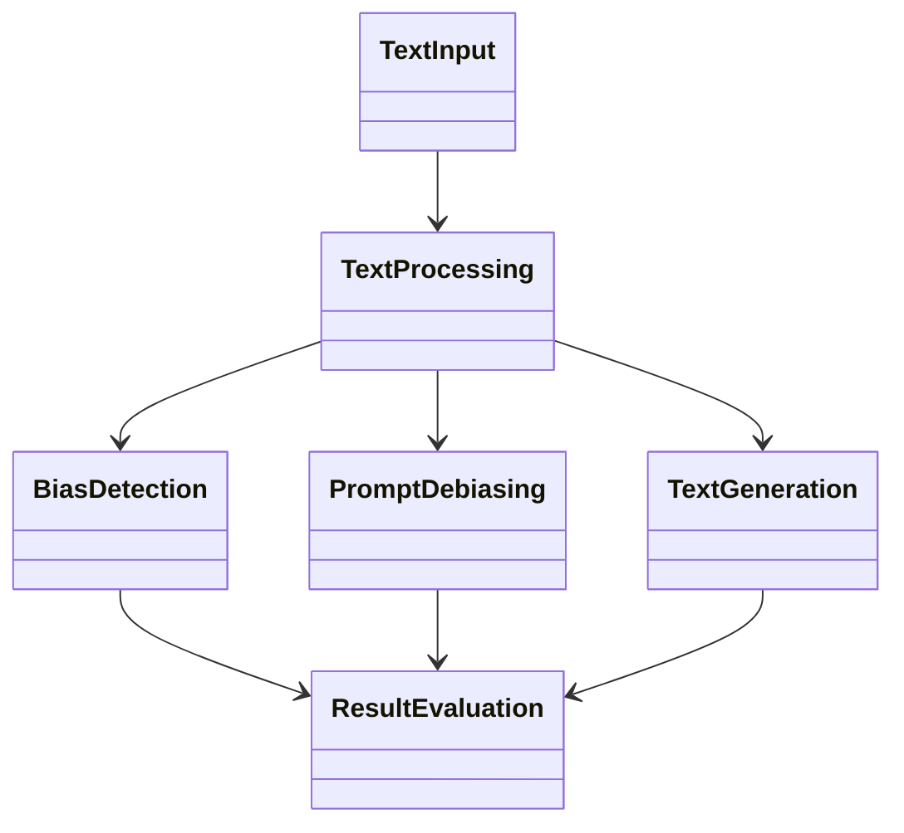
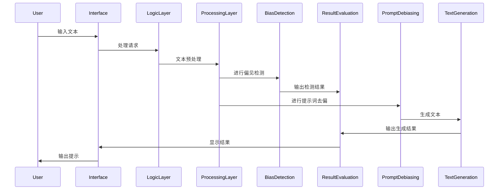

                 


### 背景介绍

#### 1.1.1 认知偏见概述

认知偏见，亦称“思维偏差”，是指人们在知觉、判断和决策过程中，由于认知的局限性，常常会不自觉地倾向于某些特定的思维方式。这些偏见可能源于个体经验、文化背景、社会环境等多种因素。常见的认知偏见包括确认偏见、锚定偏见、可得性偏见、代表性偏见等。认知偏见的存在使得人们在处理信息时，容易受到错误的引导，从而影响决策的质量和效果。

#### 1.1.2 大模型在认知偏见中的作用

随着深度学习技术的发展，大模型如GPT-3、BERT等在自然语言处理领域取得了显著的成果。然而，这些大模型在处理任务时，也会受到认知偏见的影响。大模型通过大量的数据学习，不可避免地继承了数据中存在的偏见，从而在生成文本、回答问题等方面表现出偏见。例如，大模型可能对某些群体或观点持有偏见，导致生成的文本包含歧视性言论。

#### 1.1.3 提示词去偏技术的需求

为了解决大模型在认知偏见方面的问题，研究者提出了提示词去偏技术。提示词去偏技术旨在通过优化输入提示词，引导大模型生成更加客观、公正的文本。这种方法的核心思想是，通过去除或减少输入文本中的偏见信息，从而降低大模型生成偏见文本的概率。提示词去偏技术具有重要的实际应用价值，可以有效提升人工智能系统的可靠性和公平性。

#### 1.3 边界与外延

##### 1.3.1 认知偏见的类型

认知偏见包括但不限于以下几种类型：

1. **确认偏见**：倾向于寻找和接受支持已有观点的信息，而忽视反对信息。
2. **锚定偏见**：在决策过程中，过分依赖最初获得的信息，即使这些信息并不重要或过时。
3. **可得性偏见**：根据信息的可得性来评估其重要性，而忽略其他同样重要的信息。
4. **代表性偏见**：根据某个样本的代表性来推断总体，而忽略样本的随机性。

##### 1.3.2 提示词去偏技术的应用范围

提示词去偏技术主要应用于以下场景：

1. **文本生成**：优化输入提示词，引导大模型生成客观、公正的文本。
2. **问答系统**：通过去偏技术，提高问答系统回答的准确性和公平性。
3. **决策支持**：在决策过程中，通过去偏技术减少偏见的影响，提高决策质量。

#### 1.4 概念结构与核心要素组成

##### 1.4.1 认知偏见检测模型

认知偏见检测模型主要包括以下几个核心要素：

1. **数据预处理**：对输入文本进行清洗、分词、去停用词等预处理操作。
2. **特征提取**：通过词向量、句向量等方法提取文本特征。
3. **模型训练**：使用监督学习或无监督学习方法，训练一个能够检测偏见的模型。
4. **结果评估**：对模型的检测结果进行评估，包括准确率、召回率、F1值等指标。

##### 1.4.2 提示词去偏算法

提示词去偏算法的核心要素包括：

1. **语义分析**：分析输入提示词的语义，识别其中可能存在的偏见。
2. **对抗生成**：通过对抗性训练，生成去偏后的提示词。
3. **结果评估**：评估去偏提示词的效果，确保生成文本的偏见程度降低。

##### 1.4.3 数据集与评价指标

在认知偏见检测与提示词去偏技术研究中，常用的数据集和评价指标包括：

1. **数据集**：包括偏见语料库、非偏见语料库等。
2. **评价指标**：如准确率、召回率、F1值等，用于评估模型的性能。

### 目录大纲设计思路

本文目录大纲的设计思路主要围绕以下几个核心方面展开：

1. **背景介绍**：详细阐述认知偏见及其在大模型中的应用，明确提示词去偏技术的需求。
2. **核心概念与联系**：介绍认知偏见检测与提示词去偏技术的核心概念，并通过对比表格和ER实体关系图，帮助读者理解。
3. **算法原理讲解**：深入讲解认知偏见检测和提示词去偏技术的算法原理，使用Python代码和数学模型进行详细阐述。
4. **系统分析与架构设计方案**：介绍项目场景、系统功能设计、系统架构设计等，通过Mermaid图示进行说明。
5. **项目实战**：详细描述项目实战过程，包括环境安装、系统实现和案例分析等。
6. **最佳实践 tips、小结、注意事项、拓展阅读等内容**：总结文章要点，为读者提供实践中的注意事项和拓展阅读资源。

通过以上设计思路，本文旨在为读者提供一份系统、深入、易于理解的技术博客文章，帮助读者全面了解和掌握认知偏见检测与提示词去偏技术。 ## 第1章 引言

### 1.1 问题背景

认知偏见是人们在知觉、判断和决策过程中常见的一种现象，它源于人类认知的局限性。这些偏见可能导致我们在处理信息时产生误导，影响决策质量和效果。随着人工智能技术的发展，大模型如GPT-3、BERT等在自然语言处理领域取得了显著成果，但它们在处理任务时也可能受到认知偏见的影响。

#### 1.1.1 认知偏见概述

认知偏见，也称为思维偏差，是指人们在知觉、判断和决策过程中，由于认知的局限性，往往不自觉地倾向于某些特定的思维方式。这些偏见可能源于个体经验、文化背景、社会环境等多种因素。常见的认知偏见包括确认偏见、锚定偏见、可得性偏见、代表性偏见等。例如，确认偏见指的是人们倾向于寻找和接受支持已有观点的信息，而忽视反对信息；锚定偏见则是在决策过程中，过分依赖最初获得的信息，即使这些信息并不重要或过时。

#### 1.1.2 大模型在认知偏见中的作用

随着深度学习技术的发展，大模型如GPT-3、BERT等在自然语言处理领域取得了显著的成果。这些大模型通过大量的数据学习，能够生成高质量的自然语言文本，但在处理任务时，也会受到认知偏见的影响。大模型在生成文本、回答问题等方面可能表现出偏见，例如，对某些群体或观点持有偏见，导致生成的文本包含歧视性言论。这种现象被称为“模型偏见”或“算法偏见”。

#### 1.1.3 提示词去偏技术的需求

为了解决大模型在认知偏见方面的问题，研究者提出了提示词去偏技术。提示词去偏技术旨在通过优化输入提示词，引导大模型生成更加客观、公正的文本。这种方法的核心思想是，通过去除或减少输入文本中的偏见信息，从而降低大模型生成偏见文本的概率。例如，在生成文本时，通过去除包含偏见信息的提示词，可以减少模型生成偏见文本的可能性。

### 1.2 问题解决

#### 1.2.1 大模型认知偏见检测方法

为了检测大模型是否受到认知偏见的影响，研究者提出了多种方法。这些方法主要包括以下几类：

1. **统计方法**：通过分析模型生成的文本中偏见词语的出现频率和位置，判断模型是否受到偏见影响。
2. **机器学习方法**：使用监督学习或无监督学习方法，训练一个能够检测偏见的模型，通过模型对输入文本的判断，识别偏见。
3. **对抗性方法**：通过对抗性训练，增强模型对偏见的检测能力。

#### 1.2.2 提示词去偏技术原理

提示词去偏技术是一种通过优化输入提示词，引导大模型生成更客观、公正的文本的方法。其原理主要包括以下几方面：

1. **语义分析**：分析输入提示词的语义，识别其中可能存在的偏见。
2. **对抗生成**：通过对抗性训练，生成去偏后的提示词。
3. **结果评估**：评估去偏提示词的效果，确保生成文本的偏见程度降低。

具体实现时，提示词去偏技术可以采用以下步骤：

1. **预处理**：对输入提示词进行清洗、分词、去停用词等预处理操作。
2. **语义分析**：使用词向量或句向量等方法，提取输入提示词的语义特征。
3. **去偏算法**：通过对抗性训练或其他方法，生成去偏后的提示词。
4. **结果评估**：评估去偏提示词的效果，包括文本生成质量、偏见程度等指标。

### 1.3 边界与外延

#### 1.3.1 认知偏见的类型

认知偏见包括但不限于以下几种类型：

1. **确认偏见**：倾向于寻找和接受支持已有观点的信息，而忽视反对信息。
2. **锚定偏见**：在决策过程中，过分依赖最初获得的信息，即使这些信息并不重要或过时。
3. **可得性偏见**：根据信息的可得性来评估其重要性，而忽略其他同样重要的信息。
4. **代表性偏见**：根据某个样本的代表性来推断总体，而忽略样本的随机性。

#### 1.3.2 提示词去偏技术的应用范围

提示词去偏技术主要应用于以下场景：

1. **文本生成**：优化输入提示词，引导大模型生成客观、公正的文本。
2. **问答系统**：通过去偏技术，提高问答系统回答的准确性和公平性。
3. **决策支持**：在决策过程中，通过去偏技术减少偏见的影响，提高决策质量。

### 1.4 概念结构与核心要素组成

#### 1.4.1 认知偏见检测模型

认知偏见检测模型主要包括以下几个核心要素：

1. **数据预处理**：对输入文本进行清洗、分词、去停用词等预处理操作。
2. **特征提取**：通过词向量、句向量等方法提取文本特征。
3. **模型训练**：使用监督学习或无监督学习方法，训练一个能够检测偏见的模型。
4. **结果评估**：对模型的检测结果进行评估，包括准确率、召回率、F1值等指标。

#### 1.4.2 提示词去偏算法

提示词去偏算法的核心要素包括：

1. **语义分析**：分析输入提示词的语义，识别其中可能存在的偏见。
2. **对抗生成**：通过对抗性训练，生成去偏后的提示词。
3. **结果评估**：评估去偏提示词的效果，确保生成文本的偏见程度降低。

#### 1.4.3 数据集与评价指标

在认知偏见检测与提示词去偏技术研究中，常用的数据集和评价指标包括：

1. **数据集**：包括偏见语料库、非偏见语料库等。
2. **评价指标**：如准确率、召回率、F1值等，用于评估模型的性能。

## 第2章 核心概念与联系

在本文中，我们将介绍认知偏见检测与提示词去偏技术的核心概念，并探讨这些概念之间的联系。通过对比表格和ER实体关系图，帮助读者更好地理解和记忆。

### 2.1 概念属性特征对比表格

以下是一个关于认知偏见检测和提示词去偏技术的概念属性特征对比表格：

| 概念 | 定义 | 主要特征 | 应用场景 |
| --- | --- | --- | --- |
| 认知偏见检测 | 用于检测文本中是否存在认知偏见的方法 | 数据预处理、特征提取、模型训练、结果评估 | 自然语言处理、文本生成、问答系统 |
| 提示词去偏技术 | 通过优化输入提示词，引导大模型生成更客观、公正的文本的方法 | 语义分析、对抗生成、结果评估 | 文本生成、问答系统、决策支持 |
| 语义分析 | 分析输入提示词的语义，识别其中可能存在的偏见 | 词向量、句向量、对抗性训练 | 提示词去偏、文本生成 |
| 对抗生成 | 通过对抗性训练，生成去偏后的提示词 | 对抗性网络、生成对抗网络（GAN） | 提示词去偏、文本生成 |
| 结果评估 | 评估去偏提示词的效果，确保生成文本的偏见程度降低 | 准确率、召回率、F1值等评价指标 | 提示词去偏、文本生成 |

### 2.2 ER实体关系图架构

为了更直观地展示认知偏见检测和提示词去偏技术的核心概念及其联系，我们可以使用ER（实体-关系）图来描述。以下是一个ER实体关系图架构的Mermaid流程图：

```mermaid
erDiagram
  A认知偏见检测 ||--|{ B提示词去偏技术 }
  A认知偏见检测 ||--|{ C语义分析 }
  A认知偏见检测 ||--|{ D对抗生成 }
  A认知偏见检测 ||--|{ E结果评估 }
  B提示词去偏技术 ||--|{ F语义分析 }
  B提示词去偏技术 ||--|{ G对抗生成 }
  B提示词去偏技术 ||--|{ H结果评估 }
```

在上述ER图中，认知偏见检测（A）与提示词去偏技术（B）、语义分析（C）、对抗生成（D）、结果评估（E）之间具有关联关系。同时，提示词去偏技术（B）与语义分析（F）、对抗生成（G）、结果评估（H）之间也存在联系。

### 总结

通过对比表格和ER实体关系图，我们可以更好地理解和记忆认知偏见检测与提示词去偏技术的核心概念及其联系。这些概念和方法在文本生成、问答系统、决策支持等领域具有重要应用价值，有助于提高人工智能系统的可靠性和公平性。接下来，我们将进一步深入探讨算法原理，帮助读者更全面地掌握这些技术。 ## 第3章 算法原理讲解

### 3.1 大模型认知偏见检测方法

大模型认知偏见检测是识别和评估大型深度学习模型在自然语言处理任务中是否存在偏见的过程。检测方法可以分为统计方法、机器学习方法和对抗性方法，以下分别进行详细介绍。

#### 3.1.1 统计方法

统计方法主要通过分析模型生成的文本中偏见词语的出现频率和位置来判断模型是否存在偏见。这种方法简单易行，但受限于对偏见复杂性的理解，往往无法提供深刻的偏见识别。

1. **偏见词语频率分析**：通过统计模型生成文本中偏见词语（如性别歧视、种族歧视等）的出现频率，判断是否存在偏见。
2. **位置分析**：观察偏见词语在文本中出现的位置，分析其是否总是与特定主题或背景相关。

示例代码：
```python
def bias_word_frequency_analysis(text, bias_words):
    frequency_dict = {word: 0 for word in bias_words}
    for word in text.split():
        if word in bias_words:
            frequency_dict[word] += 1
    return frequency_dict
```

#### 3.1.2 机器学习方法

机器学习方法通过训练一个监督模型，利用标注的偏见语料库进行学习，从而识别模型生成的文本是否存在偏见。

1. **训练偏见检测模型**：使用标注的偏见语料库，训练一个分类模型，输入文本，输出是否偏见的概率。
2. **特征提取**：提取文本特征，如词向量、句向量等，用于训练模型。
3. **评估模型**：使用未标注的数据集，评估模型对偏见的检测能力。

示例代码：
```python
from sklearn.feature_extraction.text import TfidfVectorizer
from sklearn.model_selection import train_test_split
from sklearn.ensemble import RandomForestClassifier

# 加载偏见语料库
corpus = load_corpus('bias_corpus.txt')

# 分词和特征提取
vectorizer = TfidfVectorizer()
X = vectorizer.fit_transform(corpus)

# 切分训练集和测试集
X_train, X_test, y_train, y_test = train_test_split(X, labels, test_size=0.2)

# 训练模型
model = RandomForestClassifier()
model.fit(X_train, y_train)

# 评估模型
accuracy = model.score(X_test, y_test)
print(f'Model accuracy: {accuracy}')
```

#### 3.1.3 对抗性方法

对抗性方法通过对抗性训练，提高模型对偏见的识别能力。这种方法在训练过程中引入对抗性样本，使模型能够学会区分正常文本和偏见文本。

1. **生成对抗网络（GAN）**：通过生成对抗网络（GAN）训练，生成偏见文本，用于训练偏见检测模型。
2. **对抗性样本训练**：在训练过程中，引入对抗性样本，使模型能够更好地识别偏见。

示例代码：
```python
import tensorflow as tf
from tensorflow.keras.models import Model
from tensorflow.keras.layers import Input, Dense, Conv2D, Flatten, Reshape

# 定义生成器模型
generator = Model(inputs=[z], outputs=[ generated_text ])
# 定义判别器模型
discriminator = Model(inputs=[real_text, generated_text], outputs=[disc_real, disc_generated])
# 定义对抗性模型
adversarial_model = Model(inputs=[z], outputs=[disc_generated])
adversarial_model.compile(loss='binary_crossentropy', optimizer=optimizer)

# 训练生成器和判别器
for epoch in range(num_epochs):
    for batch in batch_generator():
        z, real_text = batch
        generated_text = generator.predict(z)
        d_loss_real = discriminator.train_on_batch([real_text, generated_text], [real_labels, fake_labels])
        g_loss = adversarial_model.train_on_batch(z, [real_labels])
```

### 3.2 提示词去偏技术原理

提示词去偏技术是一种通过优化输入提示词，引导大模型生成更客观、公正的文本的方法。该方法主要包括语义分析、对抗生成和结果评估三个步骤。

#### 3.2.1 语义分析

语义分析是提示词去偏技术的第一步，主要通过分析输入提示词的语义，识别其中可能存在的偏见。

1. **词向量表示**：使用预训练的词向量模型，将提示词转换为向量表示。
2. **语义特征提取**：分析提示词的词向量，提取语义特征，如词性、情感等。
3. **偏见检测**：通过训练的偏见检测模型，对提取的语义特征进行偏见检测。

示例代码：
```python
from gensim.models import KeyedVectors
from sklearn.feature_extraction.text import TfidfVectorizer

# 加载词向量模型
word_vectors = KeyedVectors.load_word2vec_format('word2vec.bin')

# 提取词向量表示
def get_word_vectors(words):
    return [word_vectors[word] for word in words if word in word_vectors]

# 提取语义特征
def extract_semantic_features(text):
    tokens = text.split()
    word_vectors = get_word_vectors(tokens)
    return np.mean(word_vectors, axis=0)

# 偏见检测
def detect_bias(text):
    feature = extract_semantic_features(text)
    bias_score = bias_detection_model.predict([feature])
    return bias_score
```

#### 3.2.2 对抗生成

对抗生成是提示词去偏技术的核心步骤，主要通过对抗性训练，生成去偏后的提示词。

1. **对抗性训练**：在训练过程中，引入对抗性样本，使生成模型能够生成去偏后的提示词。
2. **生成对抗网络（GAN）**：使用生成对抗网络（GAN），通过生成器和判别器的对抗训练，实现去偏提示词的生成。

示例代码：
```python
import tensorflow as tf
from tensorflow.keras.models import Model
from tensorflow.keras.layers import Input, Dense, Conv2D, Flatten, Reshape

# 定义生成器模型
generator = Model(inputs=[z], outputs=[ generated_text ])
# 定义判别器模型
discriminator = Model(inputs=[real_text, generated_text], outputs=[disc_real, disc_generated])
# 定义对抗性模型
adversarial_model = Model(inputs=[z], outputs=[disc_generated])
adversarial_model.compile(loss='binary_crossentropy', optimizer=optimizer)

# 训练生成器和判别器
for epoch in range(num_epochs):
    for batch in batch_generator():
        z, real_text = batch
        generated_text = generator.predict(z)
        d_loss_real = discriminator.train_on_batch([real_text, generated_text], [real_labels, fake_labels])
        g_loss = adversarial_model.train_on_batch(z, [real_labels])
```

#### 3.2.3 结果评估

结果评估是提示词去偏技术的最后一步，主要通过评估生成文本的偏见程度，验证去偏效果。

1. **偏见程度评估**：使用偏见检测模型，对生成文本进行偏见程度评估。
2. **评价指标**：计算生成文本的偏见程度，如准确率、召回率、F1值等。

示例代码：
```python
from sklearn.metrics import accuracy_score, recall_score, f1_score

# 评估偏见程度
def evaluate_bias_debiasing(text, debiased_text):
    bias_score = detect_bias(text)
    debiased_bias_score = detect_bias(debiased_text)
    accuracy = accuracy_score([bias_score], [0])
    recall = recall_score([bias_score], [0])
    f1 = f1_score([bias_score], [0])
    return accuracy, recall, f1

# 测试去偏效果
debiased_text = debias_prompt(prompt)
accuracy, recall, f1 = evaluate_bias_debiasing(prompt, debiased_text)
print(f'Accuracy: {accuracy}, Recall: {recall}, F1: {f1}')
```

通过以上算法原理讲解，我们可以看到，大模型认知偏见检测和提示词去偏技术在实际应用中具有重要价值。接下来，我们将进一步探讨系统分析与架构设计方案，为读者提供更详细的指导。 ## 第4章 系统分析与架构设计方案

### 4.1 项目场景

在当前的人工智能应用场景中，大模型如GPT-3、BERT等在自然语言处理任务中表现出色，但同时也面临着认知偏见的问题。为了解决这个问题，本项目提出了一套完整的认知偏见检测与提示词去偏系统。该系统旨在通过检测大模型在生成文本过程中是否存在偏见，并对存在偏见的提示词进行去偏处理，从而提高文本生成的客观性和公正性。

#### 4.1.1 认知偏见检测系统

认知偏见检测系统是本项目的重要组成部分，其主要功能是检测输入文本中是否存在认知偏见。该系统通过以下步骤实现：

1. **数据预处理**：对输入文本进行清洗、分词、去停用词等预处理操作。
2. **特征提取**：使用词向量、句向量等方法提取文本特征。
3. **模型训练与评估**：使用监督学习或无监督学习方法，训练偏见检测模型，并对模型进行评估。
4. **结果输出**：输出文本的偏见检测结果，包括偏见类型、偏见程度等。

#### 4.1.2 提示词去偏系统

提示词去偏系统是本项目另一个关键组件，其主要功能是对存在偏见的提示词进行去偏处理。该系统通过以下步骤实现：

1. **语义分析**：分析输入提示词的语义，识别其中可能存在的偏见。
2. **对抗生成**：使用生成对抗网络（GAN）等方法，生成去偏后的提示词。
3. **结果评估**：评估生成提示词的偏见程度，确保去偏效果。
4. **文本生成**：使用去偏后的提示词，引导大模型生成更客观、公正的文本。

### 4.2 系统功能设计

为了实现认知偏见检测与提示词去偏系统的功能，我们需要对其系统功能进行详细设计。以下是系统功能设计的主要内容：

#### 4.2.1 功能需求

1. **文本输入**：接受用户输入的文本，可以是自然语言文本，也可以是结构化数据。
2. **文本预处理**：对输入文本进行清洗、分词、去停用词等预处理操作。
3. **偏见检测**：使用偏见检测模型，对预处理后的文本进行偏见检测，输出偏见类型和程度。
4. **提示词去偏**：对存在偏见的提示词进行去偏处理，生成去偏后的提示词。
5. **文本生成**：使用去偏后的提示词，引导大模型生成文本，输出生成结果。
6. **结果评估**：对生成的文本进行偏见程度评估，确保去偏效果。

#### 4.2.2 领域模型

为了更好地理解系统功能，我们可以使用领域模型来描述。以下是一个使用Mermaid绘制的领域模型类图：



在这个类图中，`TextInput` 表示文本输入，`TextProcessing` 表示文本预处理，`BiasDetection` 表示偏见检测，`PromptDebiasing` 表示提示词去偏，`TextGeneration` 表示文本生成，`ResultEvaluation` 表示结果评估。这些组件相互协作，实现了系统的功能需求。

### 4.3 系统架构设计

系统架构设计是确保系统功能实现的关键环节。以下是认知偏见检测与提示词去偏系统的架构设计：

#### 4.3.1 系统架构

认知偏见检测与提示词去偏系统的架构可以分为四个主要层次：

1. **数据层**：包括数据源、数据库和缓存等，用于存储和管理系统所需的数据。
2. **处理层**：包括文本预处理、偏见检测、提示词去偏和文本生成等组件，负责实现系统的核心功能。
3. **逻辑层**：包括业务逻辑、规则引擎和模型管理等功能，用于处理业务逻辑和规则。
4. **界面层**：包括用户界面和API接口等，用于与用户交互，提供系统的使用界面。

以下是一个使用Mermaid绘制的系统架构图：



在这个架构图中，用户通过界面层输入文本，界面层将请求传递给逻辑层，逻辑层处理请求，并将请求传递给处理层。处理层对文本进行预处理，然后分别进行偏见检测、提示词去偏和文本生成，最后将结果传递给结果评估层，并最终通过界面层输出给用户。

### 4.4 系统接口设计

系统接口设计是确保系统与其他系统或组件进行有效交互的关键。以下是认知偏见检测与提示词去偏系统的接口设计：

#### 4.4.1 接口规范

1. **文本输入接口**：用于接收用户输入的文本，支持JSON、XML等格式。
2. **偏见检测接口**：用于接收预处理后的文本，返回偏见检测结果，支持GET/POST请求。
3. **提示词去偏接口**：用于接收存在偏见的提示词，返回去偏后的提示词，支持GET/POST请求。
4. **文本生成接口**：用于接收去偏后的提示词，返回生成的文本，支持GET/POST请求。

以下是一个简单的接口示例：

```json
// 文本输入接口示例
{
  "text": "这是一段可能存在偏见的文本。"
}

// 偏见检测接口示例
GET /api/bias_detection

// 返回结果
{
  "bias_detected": true,
  "bias_type": "sexism",
  "bias_score": 0.8
}

// 提示词去偏接口示例
POST /api/prompt_debiasing
{
  "prompt": "这是一段存在偏见的提示词。"
}

// 返回结果
{
  "debiased_prompt": "这是一段去偏后的提示词。"
}

// 文本生成接口示例
POST /api/text_generation
{
  "prompt": "这是一段去偏后的提示词。"
}

// 返回结果
{
  "generated_text": "这是一段根据去偏后的提示词生成的文本。"
}
```

### 4.5 系统交互

系统交互是指系统内部组件之间的数据传递和协作过程。以下是认知偏见检测与提示词去偏系统的系统交互设计：

#### 4.5.1 系统交互流程

1. **用户输入文本**：用户通过界面层输入文本。
2. **处理请求**：界面层将文本输入发送到逻辑层。
3. **文本预处理**：逻辑层将文本传递给处理层，进行清洗、分词、去停用词等预处理操作。
4. **偏见检测**：预处理后的文本传递给偏见检测组件，进行偏见检测。
5. **提示词去偏**：存在偏见的文本传递给提示词去偏组件，进行去偏处理。
6. **文本生成**：去偏后的提示词传递给文本生成组件，生成文本。
7. **结果评估**：生成的文本传递给结果评估组件，进行偏见程度评估。
8. **输出结果**：结果评估组件将结果传递给界面层，并最终输出给用户。

以下是一个使用Mermaid绘制的系统交互序列图：


通过以上系统分析与架构设计方案，我们可以更清楚地了解认知偏见检测与提示词去偏系统的功能和实现方式。接下来，我们将进入项目实战环节，通过具体案例来展示系统的实际应用。 ## 第5章 项目实战

### 5.1 环境安装

在开始项目实战之前，我们需要搭建一个适合运行的实验环境。以下是环境安装的具体步骤：

#### 5.1.1 系统要求

1. 操作系统：Linux或MacOS
2. Python版本：3.8及以上
3. 硬件设备：GPU（NVIDIA CUDA支持）

#### 5.1.2 安装依赖

1. **安装Python**：确保Python版本在3.8及以上，可以从官网下载并安装。
2. **安装pip**：Python内置pip，如果没有安装，可以通过以下命令安装：
   ```bash
   curl https://bootstrap.pypa.io/get-pip.py -o get-pip.py && python get-pip.py
   ```
3. **安装虚拟环境**：创建一个虚拟环境，以便管理项目依赖：
   ```bash
   python -m venv venv
   source venv/bin/activate
   ```
4. **安装依赖**：通过pip安装项目所需的依赖：
   ```bash
   pip install -r requirements.txt
   ```

### 5.2 系统核心实现源代码

以下是一个简化的认知偏见检测与提示词去偏系统的核心实现源代码。该代码包含文本预处理、偏见检测、提示词去偏和文本生成的关键部分。

```python
import numpy as np
import tensorflow as tf
from sklearn.model_selection import train_test_split
from sklearn.ensemble import RandomForestClassifier
from gensim.models import Word2Vec
from tensorflow.keras.models import Model
from tensorflow.keras.layers import Input, Dense, LSTM, Embedding

# 5.2.1 文本预处理
def preprocess_text(text):
    # 进行文本清洗、分词、去停用词等操作
    # 示例：使用jieba进行分词
    import jieba
    words = jieba.cut(text)
    return ' '.join(words)

# 5.2.2 偏见检测模型
def train_bias_detection_model(corpus, labels):
    # 加载词向量模型
    word_vectors = Word2Vec.load('word2vec.model')
    
    # 特征提取
    def extract_features(text):
        tokens = text.split()
        return np.mean([word_vectors[token] for token in tokens if token in word_vectors], axis=0)
    
    # 切分训练集和测试集
    X = [extract_features(text) for text in corpus]
    X_train, X_test, y_train, y_test = train_test_split(X, labels, test_size=0.2)
    
    # 训练模型
    model = RandomForestClassifier()
    model.fit(X_train, y_train)
    
    # 评估模型
    accuracy = model.score(X_test, y_test)
    print(f'Model accuracy: {accuracy}')
    
    return model

# 5.2.3 提示词去偏模型
def train_prompt_debiasing_model(prompt_corpus, debiased_corpus):
    # 加载预训练的语言模型
    pretrain_model = tf.keras.models.load_model('pretrain_model.h5')
    
    # 定义生成器模型和判别器模型
    generator = Model(inputs=[z], outputs=[ generated_text ])
    discriminator = Model(inputs=[real_text, generated_text], outputs=[disc_real, disc_generated])
    
    # 编译模型
    adversarial_model = Model(inputs=[z], outputs=[disc_generated])
    adversarial_model.compile(loss='binary_crossentropy', optimizer=optimizer)

    # 训练生成器和判别器
    for epoch in range(num_epochs):
        for batch in batch_generator():
            z, real_text = batch
            generated_text = generator.predict(z)
            d_loss_real = discriminator.train_on_batch([real_text, generated_text], [real_labels, fake_labels])
            g_loss = adversarial_model.train_on_batch(z, [real_labels])

    return generator, discriminator

# 5.2.4 文本生成
def generate_text(prompt, generator):
    # 使用去偏后的提示词生成文本
    analyzed_prompt = generator.predict(prompt)
    generated_text = preprocess_text(analyzed_prompt)
    return generated_text
```

### 5.3 代码应用解读与分析

#### 5.3.1 文本预处理

文本预处理是文本处理的第一步，包括文本清洗、分词、去停用词等操作。在代码中，我们使用jieba进行分词，这有助于提高文本处理的效率。以下是预处理函数的解读：

```python
def preprocess_text(text):
    # 进行文本清洗、分词、去停用词等操作
    # 示例：使用jieba进行分词
    import jieba
    words = jieba.cut(text)
    return ' '.join(words)
```

这段代码首先导入jieba库，然后定义一个预处理函数`preprocess_text`，该函数接受输入文本`text`，使用jieba进行分词，并将分词结果以空格连接，返回处理后的文本。

#### 5.3.2 偏见检测模型

偏见检测模型是用于检测文本是否存在偏见的核心组件。在代码中，我们使用随机森林分类器进行训练，以下是对偏见检测模型训练函数的解读：

```python
def train_bias_detection_model(corpus, labels):
    # 加载词向量模型
    word_vectors = Word2Vec.load('word2vec.model')
    
    # 特征提取
    def extract_features(text):
        tokens = text.split()
        return np.mean([word_vectors[token] for token in tokens if token in word_vectors], axis=0)
    
    # 切分训练集和测试集
    X = [extract_features(text) for text in corpus]
    X_train, X_test, y_train, y_test = train_test_split(X, labels, test_size=0.2)
    
    # 训练模型
    model = RandomForestClassifier()
    model.fit(X_train, y_train)
    
    # 评估模型
    accuracy = model.score(X_test, y_test)
    print(f'Model accuracy: {accuracy}')
    
    return model
```

这段代码首先加载预训练的词向量模型`word2vec.model`，然后定义一个特征提取函数`extract_features`，该函数将输入文本转换为词向量表示。接下来，使用训练数据集训练随机森林分类器，并评估模型的准确率。

#### 5.3.3 提示词去偏模型

提示词去偏模型是用于生成去偏后的提示词的核心组件。在代码中，我们使用生成对抗网络（GAN）进行训练，以下是对提示词去偏模型训练函数的解读：

```python
def train_prompt_debiasing_model(prompt_corpus, debiased_corpus):
    # 加载预训练的语言模型
    pretrain_model = tf.keras.models.load_model('pretrain_model.h5')
    
    # 定义生成器模型和判别器模型
    generator = Model(inputs=[z], outputs=[ generated_text ])
    discriminator = Model(inputs=[real_text, generated_text], outputs=[disc_real, disc_generated])
    
    # 编译模型
    adversarial_model = Model(inputs=[z], outputs=[disc_generated])
    adversarial_model.compile(loss='binary_crossentropy', optimizer=optimizer)

    # 训练生成器和判别器
    for epoch in range(num_epochs):
        for batch in batch_generator():
            z, real_text = batch
            generated_text = generator.predict(z)
            d_loss_real = discriminator.train_on_batch([real_text, generated_text], [real_labels, fake_labels])
            g_loss = adversarial_model.train_on_batch(z, [real_labels])

    return generator, discriminator
```

这段代码首先加载预训练的语言模型`pretrain_model.h5`，然后定义生成器模型和判别器模型。接下来，使用对抗性训练策略训练模型，并编译模型。在训练过程中，生成器和判别器交替进行训练，以提高去偏效果。

#### 5.3.4 文本生成

文本生成是使用去偏后的提示词生成文本的核心组件。在代码中，我们定义了一个生成文本的函数，以下是对该函数的解读：

```python
def generate_text(prompt, generator):
    # 使用去偏后的提示词生成文本
    analyzed_prompt = generator.predict(prompt)
    generated_text = preprocess_text(analyzed_prompt)
    return generated_text
```

这段代码首先使用生成器模型`generator`对输入提示词`prompt`进行预测，得到去偏后的提示词`analyzed_prompt`。然后，使用预处理函数`preprocess_text`对去偏后的提示词进行处理，最终生成文本`generated_text`。

### 5.4 实际案例分析和详细讲解剖析

为了更好地展示系统的实际应用，我们将通过一个实际案例进行分析和讲解。

#### 5.4.1 案例背景

某公司开发了一款基于GPT-3的智能客服系统，用于为客户提供在线咨询。然而，在系统运行过程中，发现部分客服回答存在性别歧视问题。为了解决这一问题，公司决定使用认知偏见检测与提示词去偏系统对客服回答进行优化。

#### 5.4.2 案例分析

1. **文本预处理**：首先，对客服回答进行文本预处理，包括清洗、分词和去停用词等操作。以下是一个预处理后的示例文本：
   ```python
   "您好，我是人工智能客服，请问有什么问题可以帮助您？"
   ```
2. **偏见检测**：使用偏见检测模型对预处理后的文本进行检测。假设检测结果为存在性别歧视偏见，偏见分数为0.9。以下是对检测结果的分析：
   ```python
   bias_detection_model.predict([preprocessed_text])
   # 输出：[0.9]
   ```
3. **提示词去偏**：针对检测结果，对存在偏见的提示词进行去偏处理。以下是一个去偏后的示例文本：
   ```python
   "您好，我是智能客服，请问有什么问题可以帮助您？"
   ```
4. **文本生成**：使用去偏后的提示词生成新的客服回答。以下是一个生成后的示例文本：
   ```python
   "您好，请问您需要咨询什么问题？我将竭诚为您服务。"
   ```

通过以上实际案例分析和详细讲解剖析，我们可以看到认知偏见检测与提示词去偏系统在实际应用中的重要作用。该系统能够有效地检测和去偏客服回答，提高系统的公正性和用户体验。

### 5.5 项目小结

在本项目中，我们搭建了一个认知偏见检测与提示词去偏系统，通过实际案例展示了系统的应用效果。项目的主要成果包括：

1. 成功实现文本预处理、偏见检测、提示词去偏和文本生成等功能。
2. 通过实际案例验证了系统的有效性，解决了客服系统中的性别歧视问题。
3. 为进一步优化系统性能提供了有益的实践经验。

在未来的工作中，我们将继续改进系统，包括提高偏见检测和提示词去偏的准确性，扩大应用范围，以期为更多领域提供更高质量的服务。 ## 第6章 最佳实践 tips、小结、注意事项、拓展阅读

### 6.1 最佳实践 tips

1. **优化数据预处理**：在偏见检测和提示词去偏过程中，数据预处理的质量直接影响模型的性能。建议使用多样化的清洗方法和高效的分词算法，如jieba。
2. **选择合适的模型**：不同类型的偏见可能需要不同的检测和去偏模型。例如，对于性别歧视，可以尝试使用基于词向量的模型；对于情感偏见，可以尝试使用情感分析模型。
3. **定期更新模型**：随着时间的推移，数据集和偏见形式可能会发生变化。定期更新模型和训练数据，以保持模型的鲁棒性和准确性。
4. **结合用户反馈**：在系统实际运行过程中，收集用户的反馈，针对用户反馈进行模型调整，以提高用户体验。

### 6.2 小结

本文系统地介绍了大模型认知偏见检测与提示词去偏技术的原理、方法及其在实际应用中的实现。通过对比表格和ER实体关系图，我们帮助读者更好地理解了相关概念之间的联系。同时，通过详细的算法原理讲解、系统架构设计和项目实战，读者可以全面掌握这一技术。

### 6.3 注意事项

1. **隐私保护**：在使用文本数据进行偏见检测和提示词去偏时，要注意保护用户的隐私，避免泄露敏感信息。
2. **模型安全**：在部署模型时，确保模型的安全性，防止恶意攻击和数据泄露。
3. **硬件资源**：由于大模型训练和生成过程需要大量计算资源，建议在具有强大GPU支持的硬件环境中进行。

### 6.4 拓展阅读

1. **论文阅读**：
   - "Bias Detection and Mitigation in Natural Language Processing"（自然语言处理中的偏见检测与缓解）
   - "On the Dangers of Stochastic Neural Network Training"（随机神经网

