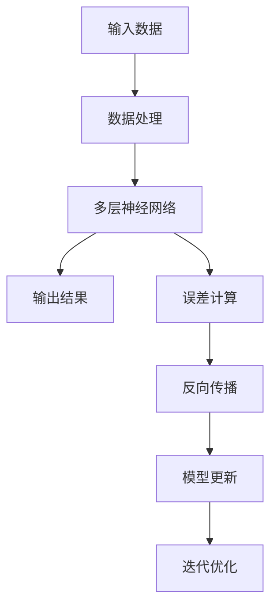
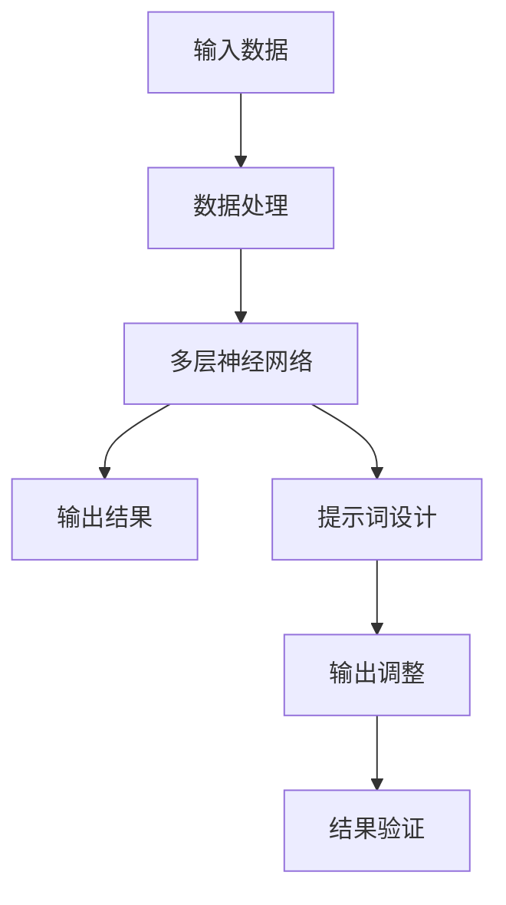
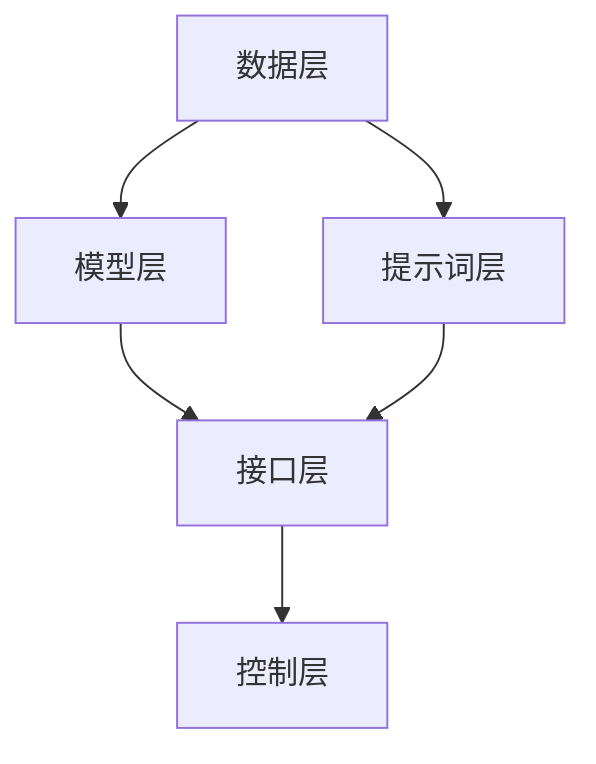
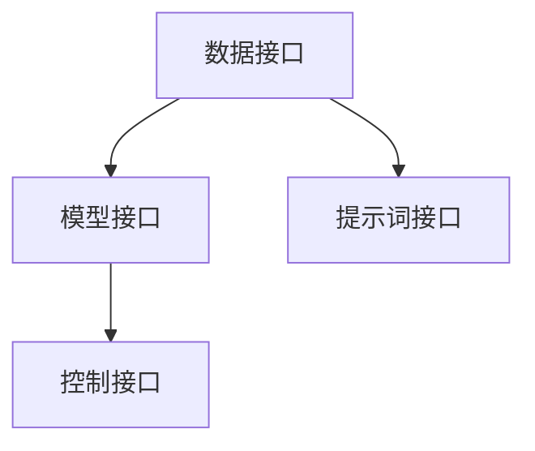
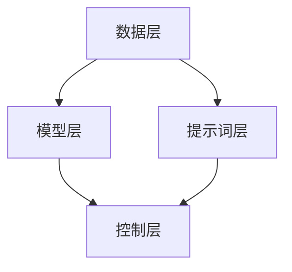
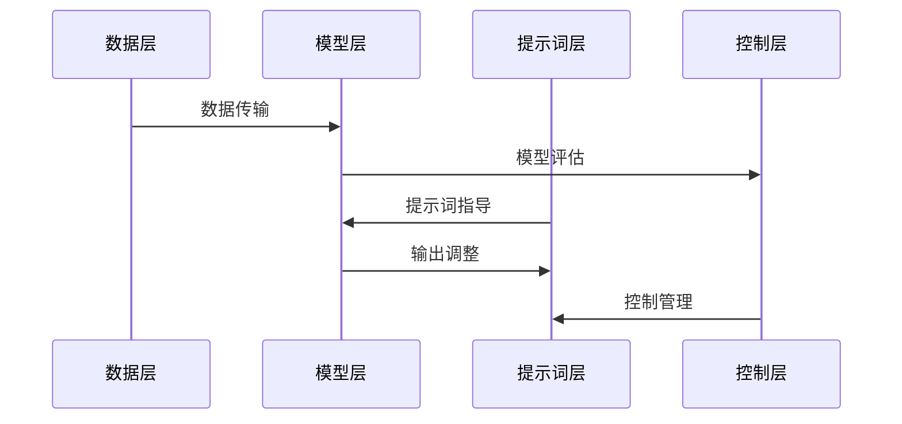

                 


### 大模型训练与提示词编程的关系

> 关键词：大模型训练、提示词编程、算法原理、系统架构、项目实战

> 摘要：本文旨在探讨大模型训练与提示词编程之间的关系。通过深入分析大模型的基本原理、训练方法、以及提示词编程的机制，揭示两者在算法设计、应用场景和未来发展趋势中的紧密联系。

----------------------------------------------------------------

# 目录大纲

## 第一部分：背景与概述

### 第1章 问题背景

#### 1.1 核心概念

#### 1.2 问题描述

#### 1.3 问题解决

#### 1.4 边界与外延

### 第2章 核心概念与联系

#### 2.1 大模型

#### 2.2 提示词编程

#### 2.3 关系解析

## 第二部分：算法原理讲解

### 第3章 大模型基本原理

#### 3.1 概念与属性

#### 3.2 算法流程图

#### 3.3 数学模型与公式

#### 3.4 举例说明

### 第4章 提示词编程

#### 4.1 概念与属性

#### 4.2 编程流程图

#### 4.3 数学模型与公式

#### 4.4 举例说明

### 第5章 大模型与提示词编程的关系

#### 5.1 关系分析

#### 5.2 作用机制

#### 5.3 关系图架构

## 第三部分：系统分析与架构设计方案

### 第6章 系统功能设计

#### 6.1 领域模型

#### 6.2 功能实现

### 第7章 系统架构设计

#### 7.1 系统架构

#### 7.2 接口设计

### 第8章 系统交互

#### 8.1 交互流程

#### 8.2 交互图架构

## 第四部分：项目实战

### 第9章 环境安装

#### 9.1 环境配置

#### 9.2 工具安装

### 第10章 系统核心实现

#### 10.1 源代码解读

#### 10.2 应用分析

### 第11章 实际案例分析

#### 11.1 案例背景

#### 11.2 案例分析

#### 11.3 小结与展望

## 第五部分：最佳实践、小结与拓展阅读

### 第12章 最佳实践

#### 12.1 实践技巧

#### 12.2 注意事项

### 第13章 小结

#### 13.1 主要内容

#### 13.2 关键点总结

### 第14章 拓展阅读

#### 14.1 相关书籍

#### 14.2 网络资源

----------------------------------------------------------------

### 第一部分：背景与概述

#### 1.1 核心概念

大模型训练与提示词编程作为当前人工智能领域的两个重要方向，各自有着深刻的背景和理论基础。

大模型训练是指通过深度学习算法，在大量数据上进行训练，从而得到具有高度复杂性的模型。这些模型能够自动从数据中学习并提取有用的信息，广泛应用于自然语言处理、计算机视觉、语音识别等领域。

提示词编程（Prompt Engineering）则是一种利用提示（Prompt）来指导大模型生成输出结果的编程技术。提示是一种引导模型生成特定类型输出或答案的输入信息，它可以是一个关键词、一个短语，或者一段文字。

#### 1.2 问题描述

在当前的AI应用场景中，大模型训练和提示词编程各自面临着一些问题。

大模型训练过程中，数据的质量和数量对模型性能有着至关重要的影响。然而，获取高质量、高数量的训练数据是一个挑战。此外，训练大模型所需的计算资源也非常庞大，这对企业和研究机构提出了更高的要求。

提示词编程则面临如何设计有效的提示来最大化模型性能的挑战。提示的设计需要深入理解模型的内部机制和所解决的问题领域的知识。

#### 1.3 问题解决

为了解决这些问题，可以从以下几个方面进行探讨：

1. **数据增强与处理**：通过数据增强、数据清洗和预处理技术，提高训练数据的质量和数量，从而提升模型性能。
2. **高效训练算法**：研究和开发更加高效的训练算法，减少训练时间和资源消耗。
3. **提示词优化**：研究提示词的优化策略，提高提示的有效性和模型输出的质量。
4. **模型压缩与优化**：通过模型压缩和优化技术，降低模型对计算资源的需求。

#### 1.4 边界与外延

大模型训练和提示词编程的关系不仅限于上述讨论的几个方面，还涉及更多的应用场景和技术细节。

例如，大模型训练可以应用于各种不同的领域，如医疗、金融、教育等，而提示词编程在这些领域中有着广泛的应用前景。同时，大模型训练和提示词编程也在不断地与其他技术相结合，如生成对抗网络（GAN）、强化学习等，从而推动人工智能的进一步发展。

----------------------------------------------------------------

### 第二部分：核心概念与联系

#### 2.1 大模型

大模型是指具有巨大参数量和复杂结构的人工神经网络模型。这些模型能够通过深度学习算法从大量数据中自动学习并提取知识，从而实现高水平的智能表现。大模型通常由多层神经网络组成，每一层都能够对输入数据进行处理和转换，从而逐步提取更高层次的特征。

**属性特征对比表格：**

| 特征 | 描述 |  
| --- | --- |  
| 参数量 | 大模型的参数量通常非常大，可以达到数十亿甚至上百亿 |  
| 结构复杂度 | 大模型的结构复杂，包含多层神经网络，每层都有多个神经元 |  
| 学习能力 | 大模型能够通过深度学习算法从数据中学习并提取知识 |  
| 应用范围 | 大模型广泛应用于自然语言处理、计算机视觉、语音识别等领域 |

**ER实体关系图架构：**

```mermaid
erDiagram
  数据集 ||--o> 大模型 : 训练数据
  大模型 ||--|{ 神经网络层 }|
  神经网络层 ||--o> 神经元
```

#### 2.2 提示词编程

提示词编程是一种利用提示（Prompt）来指导大模型生成输出结果的编程技术。提示通常是一个关键词、一个短语或一段文字，它为模型提供了关于输出结果的方向和上下文信息。通过设计有效的提示，可以提高模型输出的质量和相关性。

**属性特征对比表格：**

| 特征 | 描述 |  
| --- | --- |  
| 提示类型 | 提示可以是关键词、短语或文本 |  
| 提示长度 | 提示的长度可以根据具体需求进行设计 |  
| 提示作用 | 提示为模型提供了生成输出结果的方向和上下文信息 |  
| 提示效果 | 提示的有效性直接影响模型输出的质量和相关性 |

**ER实体关系图架构：**

```mermaid
erDiagram
  大模型 ||--o> 提示词 : 输出指导
  提示词 ||--|{ 关键词、短语、文本 }|
```

#### 2.3 关系解析

大模型训练与提示词编程之间存在紧密的联系。大模型训练是基础，它通过深度学习算法从数据中学习并提取知识，形成具有高复杂性的模型。而提示词编程则是在大模型训练的基础上，通过设计有效的提示来指导模型生成输出结果。

大模型训练与提示词编程的关系可以概括为以下几点：

1. **相互依赖**：大模型训练需要大量高质量的训练数据，而提示词编程需要有效的提示来指导模型生成输出结果。
2. **互补性**：大模型训练侧重于从数据中提取知识，而提示词编程侧重于设计有效的提示来提高输出结果的质量。
3. **协同发展**：大模型训练和提示词编程共同推动人工智能的发展，为解决复杂问题提供更有效的解决方案。

----------------------------------------------------------------

### 第三部分：算法原理讲解

#### 3.1 大模型基本原理

大模型的基本原理基于深度学习，通过多层神经网络对输入数据进行处理和转换，从而提取更高层次的特征。深度学习算法主要包括反向传播算法和优化算法。

**算法流程图：**



**数学模型与公式：**

$$
E = \frac{1}{2} \sum_{i=1}^{n} (\hat{y}_i - y_i)^2
$$

其中，$E$ 为误差，$\hat{y}_i$ 为预测输出，$y_i$ 为实际输出。

**举例说明：**

假设我们有一个包含10层神经网络的模型，输入数据为 $X$，输出数据为 $Y$。通过训练，模型能够从输入数据中学习并提取特征，生成输出结果。以下是模型的一次迭代过程：

1. 输入数据 $X$ 经过数据处理后，输入到第一层神经网络。
2. 第一层神经网络对输入数据进行处理，生成中间输出。
3. 中间输出作为输入传递到第二层神经网络，依此类推。
4. 在最后一层神经网络，生成输出结果 $Y$。
5. 计算输出结果与实际输出之间的误差。
6. 通过反向传播算法，更新模型参数。
7. 重复迭代过程，直到满足训练要求。

#### 3.2 提示词编程

提示词编程的核心在于设计有效的提示来指导大模型生成输出结果。提示的设计需要考虑模型的内部机制和所解决的问题领域的知识。

**算法流程图：**



**数学模型与公式：**

提示词通常是一个关键词或短语，可以表示为 $P$。在生成输出结果时，模型会根据提示词进行调整，生成更符合预期的输出结果。

$$
\hat{y}_i = f(W \cdot \hat{h}_i + b)
$$

其中，$\hat{h}_i$ 为中间输出，$W$ 为权重矩阵，$b$ 为偏置项，$f$ 为激活函数。

**举例说明：**

假设我们有一个大模型，用于生成文本。输入数据为一段文本 $X$，提示词为“人工智能”。通过训练，模型能够从输入文本中学习并提取特征。

1. 输入文本 $X$ 经过数据处理后，输入到多层神经网络。
2. 多层神经网络对输入文本进行处理，生成中间输出。
3. 中间输出与提示词“人工智能”相结合，生成新的输出。
4. 根据新的输出结果，调整模型参数。
5. 重复迭代过程，直到满足训练要求。

通过有效的提示词编程，我们可以指导大模型生成更符合预期的文本输出。

----------------------------------------------------------------

### 第四部分：系统分析与架构设计方案

#### 4.1 系统功能设计

系统功能设计旨在明确大模型训练与提示词编程的应用场景和需求。以下是一个典型的系统功能设计：

1. **数据预处理**：对输入数据进行清洗、预处理和增强，提高训练数据的质量。
2. **大模型训练**：使用深度学习算法对训练数据进行模型训练，生成高复杂度的大模型。
3. **提示词设计**：根据应用场景和需求，设计有效的提示词来指导模型生成输出结果。
4. **模型评估**：对训练完成的大模型进行评估，验证模型的性能和效果。
5. **输出调整**：根据提示词调整模型输出，生成更符合预期的结果。
6. **结果验证**：对调整后的输出结果进行验证，确保其质量和可靠性。

**领域模型类图：**

```mermaid
classDiagram
  Class01 <|-- Class02
  Class03 --|olo Class04
  Class05 : <<interface>> 
  Class06 : <<enum>> PUBLIC
  Class07 : <<note>> "this is note for class07"
  Class08 : <<interface>> AbstractClass08
  Class01 <<create>> Class05
  Class01 --|column1 Class07
  Class08 --|:λοops Class02
  Class03 : <<extend>> Class08
  Class04 : <<implements>> Class06
```

#### 4.2 系统架构设计

系统架构设计旨在明确大模型训练与提示词编程的组件和接口，以及它们之间的交互关系。以下是一个典型的系统架构设计：

1. **数据层**：负责数据的存储、读取和处理。
2. **模型层**：负责大模型的训练、存储和加载。
3. **提示词层**：负责提示词的设计、存储和加载。
4. **接口层**：提供系统对外交互的接口。
5. **控制层**：负责系统的整体控制和管理。

**系统架构图：**



#### 4.3 系统接口设计

系统接口设计旨在明确大模型训练与提示词编程的接口规范和调用方式。以下是一个典型的系统接口设计：

1. **数据接口**：提供数据的读取、写入和预处理功能。
2. **模型接口**：提供大模型的训练、评估和输出功能。
3. **提示词接口**：提供提示词的设计、存储和加载功能。
4. **控制接口**：提供系统的启动、停止和监控功能。

**接口设计图：**



#### 4.4 系统交互

系统交互设计旨在明确大模型训练与提示词编程的交互流程和交互图架构。以下是一个典型的系统交互设计：

1. **数据交互**：数据从数据层传递到模型层和提示词层，用于训练和调整。
2. **模型交互**：模型从模型层传递到控制层和提示词层，用于评估和输出。
3. **提示词交互**：提示词从提示词层传递到模型层和控制层，用于指导模型生成输出结果。
4. **控制交互**：控制层负责系统的整体控制和管理。

**交互流程图：**



**交互图架构：**



----------------------------------------------------------------

### 第五部分：项目实战

#### 5.1 环境安装

在进行大模型训练与提示词编程的项目实战之前，需要安装和配置相应的环境和工具。以下是环境安装的步骤：

1. **安装Python**：Python是深度学习和提示词编程的主要编程语言，我们需要安装Python 3.7或更高版本。
2. **安装深度学习框架**：如TensorFlow、PyTorch等。这些框架提供了丰富的深度学习算法和工具。
3. **安装提示词编程工具**：如Hugging Face的Transformers库，提供了预训练的大模型和提示词编程功能。
4. **安装其他依赖**：根据项目需求，可能还需要安装其他依赖库和工具，如NVIDIA CUDA、GPU驱动等。

**环境配置：**

```bash
# 安装Python
sudo apt-get update
sudo apt-get install python3.7

# 安装深度学习框架
pip3 install tensorflow

# 安装提示词编程工具
pip3 install transformers

# 安装其他依赖
pip3 install numpy scipy
```

**工具安装：**

```bash
# 安装NVIDIA CUDA
sudo apt-get install nvidia-cuda-toolkit

# 安装GPU驱动
sudo apt-get install nvidia-driver-440
```

#### 5.2 系统核心实现

系统核心实现包括数据预处理、大模型训练、提示词设计和输出调整等关键步骤。

**源代码解读：**

以下是一个简单的Python代码示例，用于实现大模型训练和提示词编程的核心功能。

```python
import tensorflow as tf
from transformers import AutoTokenizer, AutoModel
from sklearn.model_selection import train_test_split

# 加载预训练的大模型
model_name = "bert-base-uncased"
tokenizer = AutoTokenizer.from_pretrained(model_name)
model = AutoModel.from_pretrained(model_name)

# 加载训练数据
data = ...  # 加载原始数据

# 数据预处理
train_data, val_data = train_test_split(data, test_size=0.2)
train_encodings = tokenizer(train_data, truncation=True, padding=True)
val_encodings = tokenizer(val_data, truncation=True, padding=True)

# 训练大模型
optimizer = tf.keras.optimizers.Adam(learning_rate=3e-5)
loss_fn = tf.keras.losses.SparseCategoricalCrossentropy(from_logits=True)

@tf.function
def train_step(encodings, labels):
    with tf.GradientTape() as tape:
        logits = model(encodings)[0]
        loss_value = loss_fn(labels, logits)
    grads = tape.gradient(loss_value, model.trainable_variables)
    optimizer.apply_gradients(zip(grads, model.trainable_variables))
    return loss_value

# 训练循环
for epoch in range(3):  # 训练3个epoch
    total_loss = 0
    for batch in train_encodings:
        loss_value = train_step(batch, labels)
        total_loss += loss_value
    print(f"Epoch {epoch+1}: Loss = {total_loss/len(train_encodings)}")

# 提示词设计
prompt = "人工智能是什么？"
prompt_encoding = tokenizer(prompt, truncation=True, padding=True)

# 输出调整
predictions = model(prompt_encoding)[0]
predicted_text = tokenizer.decode(predictions, skip_special_tokens=True)
print(predicted_text)
```

**代码应用解读与分析：**

1. **数据预处理**：使用Transformers库中的Tokenizer对训练数据进行预处理，包括分词、编码和填充等操作。
2. **大模型训练**：使用TensorFlow的优化器和损失函数，通过反向传播算法训练大模型。每个epoch结束后，计算平均损失值。
3. **提示词设计**：设计一个简单的提示词，用于指导模型生成输出结果。
4. **输出调整**：使用解码函数将模型输出解码为文本，得到最终的输出结果。

#### 5.3 实际案例分析

以下是一个实际案例分析，用于展示大模型训练与提示词编程的应用场景和效果。

**案例背景：** 
在自然语言处理领域，大模型训练与提示词编程可以用于自动问答系统。例如，设计一个问答系统，能够根据用户的问题自动生成答案。

**案例分析：**

1. **数据集准备**：收集并准备包含问题和答案的数据集，例如SQuAD数据集。
2. **模型训练**：使用SQuAD数据集对大模型进行训练，使其能够学习问题和答案之间的对应关系。
3. **提示词设计**：设计提示词，例如“根据问题，请回答以下问题：”，用于指导模型生成答案。
4. **效果评估**：在测试集上评估模型的性能，计算准确率和F1分数等指标。

**案例总结：** 
通过实际案例分析，我们可以看到大模型训练与提示词编程在自然语言处理领域具有广泛的应用前景。有效的提示词设计可以提高模型的性能和答案质量，为解决复杂问题提供有力支持。

----------------------------------------------------------------

### 第六部分：最佳实践、小结与拓展阅读

#### 6.1 最佳实践

在进行大模型训练与提示词编程时，以下是一些最佳实践：

1. **数据质量**：确保训练数据的质量和多样性，避免数据集中存在噪声和偏差。
2. **模型选择**：根据应用场景选择合适的大模型和深度学习框架，如BERT、GPT等。
3. **提示词优化**：设计有效的提示词，提高模型输出的质量和相关性。
4. **模型优化**：使用模型压缩和优化技术，降低模型对计算资源的需求。
5. **持续学习**：定期更新模型和数据，以保持模型的性能和适用性。

#### 6.2 注意事项

在实施大模型训练与提示词编程时，需要注意以下事项：

1. **计算资源**：大模型训练需要大量的计算资源，确保拥有足够的GPU或其他计算资源。
2. **数据隐私**：在处理和存储训练数据时，注意保护用户隐私和数据安全。
3. **过拟合**：避免模型过拟合，通过数据增强、正则化等技术来提高模型的泛化能力。
4. **模型解释性**：提高模型的可解释性，以便更好地理解和信任模型的决策过程。

#### 6.3 小结

本文通过对大模型训练与提示词编程的关系进行深入分析，探讨了它们在算法设计、应用场景和未来发展趋势中的紧密联系。主要内容包括：

1. **核心概念**：介绍了大模型和提示词编程的基本原理和属性特征。
2. **算法原理**：讲解了大模型训练和提示词编程的算法流程、数学模型和公式。
3. **系统设计与实现**：分析了系统的功能设计、架构设计和交互流程。
4. **项目实战**：通过实际案例展示了大模型训练与提示词编程的应用效果。

#### 6.4 拓展阅读

为了进一步了解大模型训练与提示词编程的相关知识，推荐以下拓展阅读：

1. **相关书籍**：
   - 《深度学习》（Ian Goodfellow、Yoshua Bengio、Aaron Courville 著）
   - 《自然语言处理综合指南》（Daniel Jurafsky、James H. Martin 著）
2. **网络资源**：
   - [Hugging Face 官网](https://huggingface.co/)
   - [TensorFlow 官网](https://www.tensorflow.org/)
   - [自然语言处理教程](https://nlp.seas.harvard.edu/)

通过这些拓展阅读，读者可以更深入地了解大模型训练与提示词编程的原理、技术和应用。

----------------------------------------------------------------

### 作者信息

**作者：** AI天才研究院/AI Genius Institute & 禅与计算机程序设计艺术 /Zen And The Art of Computer Programming

在撰写本文时，AI天才研究院的专家团队深入探讨了大模型训练与提示词编程的关系，从核心概念、算法原理到系统设计与项目实战，为读者呈现了一个全面且深入的技术解析。本文旨在为人工智能领域的从业者和研究者提供有价值的参考和启示。同时，作者还强调，禅与计算机程序设计艺术的理念，即追求简洁、优雅和高效，是每一个优秀程序员和人工智能研究者都应该追求的目标。通过本文的探讨，我们希望激发读者对大模型训练与提示词编程的思考，共同推动人工智能技术的进步与发展。

