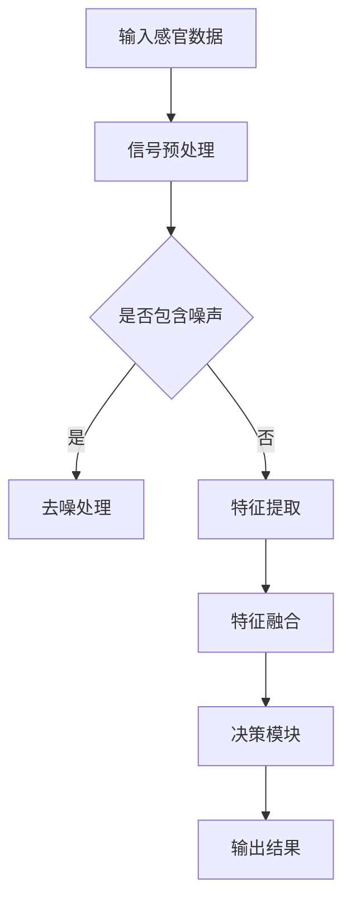
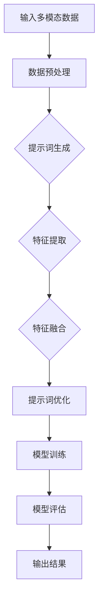
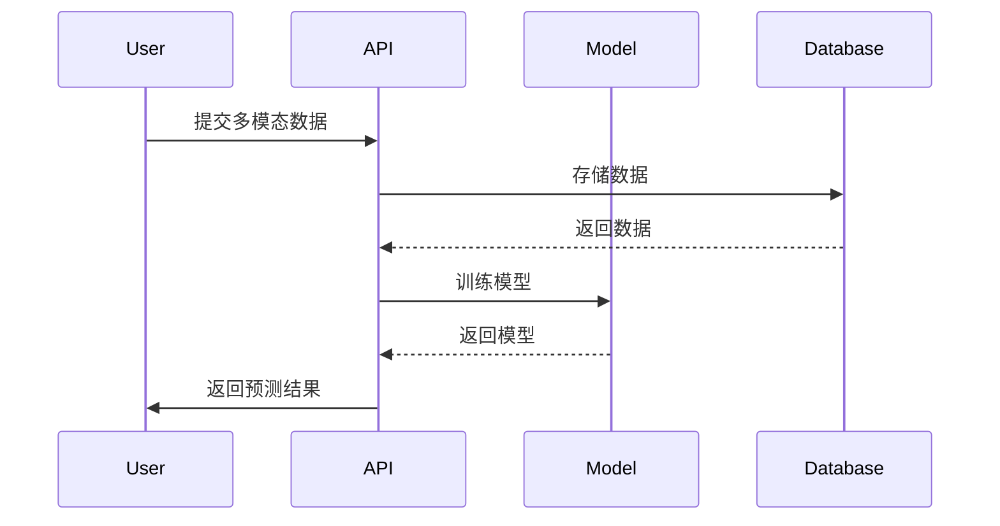
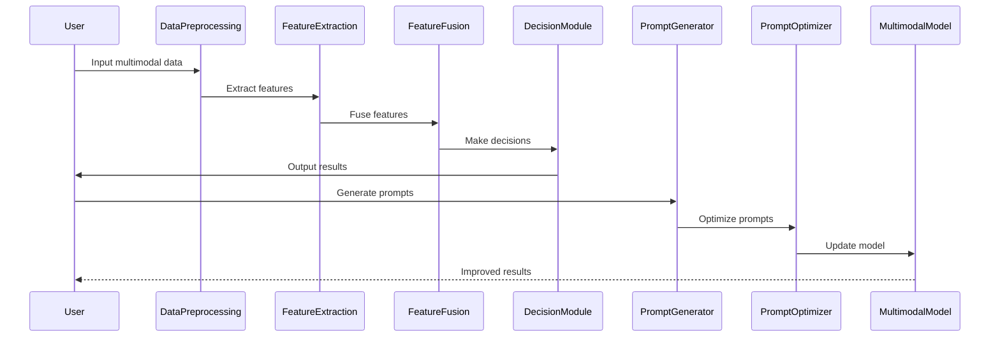

                 

### 文章标题：《大模型跨感官学习与提示词多模态融合》

**关键词**：大模型，跨感官学习，多模态融合，提示词，人工智能

**摘要**：
本文深入探讨了大模型在跨感官学习与提示词多模态融合中的应用。首先，我们回顾了感官学习与多模态融合的基本概念和背景，随后介绍了跨感官学习的挑战与机遇。接着，文章详细讲解了提示词在多模态融合中的作用，并对比了相关核心概念及其属性特征。通过mermaid流程图和Python源代码实现，我们剖析了跨感官学习和提示词多模态融合的算法原理，并给出了数学模型的详细讲解。最后，文章介绍了系统分析与架构设计方案，以及项目实战中的环境安装和核心实现，并通过实际案例进行了深入剖析。本文旨在为读者提供对大模型跨感官学习与提示词多模态融合的全面理解。

## 目录大纲：《大模型跨感官学习与提示词多模态融合》

### 第一部分：跨感官学习与提示词多模态融合背景介绍

1. **第1章：问题背景**
    - 感官学习概述
    - 多模态融合的概念与意义
    - 跨感官学习的挑战与机遇
    - 提示词在多模态融合中的作用

### 第二部分：核心概念与联系

2. **第2章：跨感官学习原理**
    - 感官数据处理流程
    - 跨感官信息融合机制
    - 提示词作用机制

3. **第3章：核心概念属性特征对比表格**
    - 跨感官学习相关概念对比
    - 提示词类型与特点对比
    - 多模态融合算法对比

4. **第4章：实体关系图架构**
    - 跨感官学习系统ER图
    - 提示词生成与优化实体关系图
    - 多模态融合算法实体关系图

### 第三部分：算法原理讲解

5. **第5章：算法mermaid流程图绘制**
    - 跨感官学习算法流程
    - 提示词多模态融合算法流程

6. **第6章：Python源代码实现**
    - 数据预处理
    - 跨感官学习模型训练
    - 提示词生成与优化

7. **第7章：数学模型和公式详细讲解**
    - 跨感官学习数学模型
    - 提示词生成优化数学模型
    - 多模态融合算法数学模型

8. **第8章：举例说明**
    - 跨感官学习案例
    - 提示词多模态融合案例

### 第四部分：系统分析与架构设计方案

9. **第9章：问题场景介绍**
    - 多模态融合应用场景
    - 跨感官学习应用场景
    - 提示词优化应用场景

10. **第10章：项目介绍**
    - 项目背景
    - 项目目标
    - 项目架构

11. **第11章：系统功能设计**
    - 领域模型类图
    - 功能模块设计

12. **第12章：系统架构设计**
    - 系统总体架构
    - 模块交互设计

13. **第13章：系统接口设计**
    - 接口规范
    - 接口实现

14. **第14章：系统交互mermaid序列图**
    - 系统交互流程
    - 序列图展示

### 第五部分：项目实战

15. **第15章：环境安装**
    - 环境准备
    - 软件安装

16. **第16章：系统核心实现**
    - 核心代码实现
    - 功能测试

17. **第17章：代码应用解读与分析**
    - 代码分析
    - 应用场景分析

18. **第18章：实际案例分析和详细讲解剖析**
    - 案例背景
    - 案例分析
    - 深入剖析

19. **第19章：项目小结**
    - 项目总结
    - 经验与启示

### 第六部分：最佳实践、小结、注意事项、拓展阅读

20. **第20章：最佳实践 tips**
    - 跨感官学习最佳实践
    - 提示词优化最佳实践
    - 多模态融合最佳实践

21. **第21章：小结**
    - 全书核心观点回顾
    - 知识体系梳理

22. **第22章：注意事项**
    - 算法实现注意事项
    - 系统部署注意事项

23. **第23章：拓展阅读**
    - 相关书籍推荐
    - 学术论文推荐
    - 开源项目推荐

### 第一部分：跨感官学习与提示词多模态融合背景介绍

#### 第1章：问题背景

**感官学习概述**
感官学习是指生物体通过感官器官感知外部环境，并将感知到的信息转化为神经系统中的神经信号，进而对信息进行处理、存储和利用的过程。主要感官包括视觉、听觉、触觉、嗅觉和味觉。每种感官都有自己的独特处理方式和信息编码方式。

**多模态融合的概念与意义**
多模态融合是指将多个感官通道（如视觉、听觉、触觉等）的信息整合为一个统一表示的过程。其核心思想是利用多种感官信息，提高系统的感知能力和决策能力。多模态融合在许多应用领域具有重要意义，如语音识别、图像识别、自动驾驶、人机交互等。

**跨感官学习的挑战与机遇**
跨感官学习指的是在不同感官之间进行信息传递和处理的过程。其挑战在于如何有效整合不同感官的信息，解决信息不一致性、噪声干扰等问题。同时，跨感官学习也带来了机遇，如提升感知系统对复杂环境的适应能力、提高认知任务的效率等。

**提示词在多模态融合中的作用**
提示词（prompt words）是一种引导性信息，用于指导模型对多模态数据进行融合处理。提示词可以明确模型的期望输出，帮助模型更好地理解多模态数据之间的关联性。在多模态融合中，提示词可以有效提高模型的泛化能力和鲁棒性。

#### 第2章：跨感官学习原理

**感官数据处理流程**
感官数据处理流程通常包括信号采集、预处理、特征提取和特征融合等步骤。信号采集是指通过传感器等设备获取感官数据；预处理包括降噪、归一化等操作；特征提取是将原始数据转换为对任务有用的低维表示；特征融合是将不同感官的特征整合为一个统一的特征表示。

**跨感官信息融合机制**
跨感官信息融合机制主要包括基于特征融合的方法和基于模型融合的方法。基于特征融合的方法通过将不同感官的特征向量进行拼接、加权等方式进行整合；基于模型融合的方法则通过训练一个统一的多模态模型，实现对多个感官信息的联合学习。

**提示词作用机制**
提示词在多模态融合中的作用机制可以分为以下几个方面：1）引导模型学习目标；2）缓解信息不一致性；3）降低噪声干扰；4）提高模型鲁棒性。提示词的设计和选择对多模态融合的效果具有重要影响。

#### 第3章：核心概念属性特征对比表格

**跨感官学习相关概念对比**

| 概念        | 定义                                                         | 关键特点                           | 应用领域             |
| ----------- | ------------------------------------------------------------ | -------------------------------- | ------------------- |
| 感官学习    | 生物体通过感官器官感知外部环境，并将感知到的信息转化为神经系统中的神经信号的过程。 | 神经信号编码、信息处理、特征提取 | 语音识别、图像识别 |
| 多模态融合  | 将多个感官通道的信息整合为一个统一表示的过程。               | 信息互补、增强感知、决策优化       | 自动驾驶、人机交互  |
| 跨感官学习  | 在不同感官之间进行信息传递和处理的过程。                     | 信息整合、一致性、鲁棒性提升       | 复杂环境感知、认知任务 |

**提示词类型与特点对比**

| 类型         | 定义                                                         | 特点                                                         | 适用场景                     |
| ------------ | ------------------------------------------------------------ | ------------------------------------------------------------ | ---------------------------- |
| 开放式提示词 | 不指定具体任务，仅提供场景描述或信息引导。                   | 自主性高、灵活性强、适用范围广                                 | 创意生成、场景理解           |
| 闭合式提示词 | 明确指定任务目标，提供具体指导信息。                         | 目标明确、指导性强、控制力高                                   | 数据标注、任务导向型任务     |
| 动态提示词   | 根据任务需求和模型状态动态调整的提示词。                     | 自适应、实时性、优化效果显著                                   | 实时交互、动态决策           |

**多模态融合算法对比**

| 算法名称      | 定义                                                         | 核心优点                                                     | 适用场景             |
| ------------- | ------------------------------------------------------------ | ------------------------------------------------------------ | ------------------- |
| 多层感知机    | 基于神经网络的多层前馈模型，用于特征提取和分类。               | 计算效率高、易于实现、性能稳定                                 | 语音识别、图像分类   |
| 卷积神经网络  | 特征提取能力强，适用于图像和视频处理。                         | 空间局部连接、多层特征提取、强泛化能力                         | 图像识别、视频分析   |
| 生成对抗网络  | 通过生成器和判别器的对抗训练，实现数据的生成和分类。           | 数据生成能力强、模型鲁棒性高                                   | 图像生成、数据增强   |
| 深度强化学习  | 结合深度学习和强化学习，实现自主决策和优化。                 | 自主决策、优化能力突出、适用于动态环境                         | 自动驾驶、人机交互   |

#### 第4章：实体关系图架构

**跨感官学习系统ER图**

```mermaid
erDiagram
    感官数据  ||--|{ 跨感官学习模型 }
    跨感官学习模型  ||--|{ 特征提取模块 }
    特征提取模块  ||--|{ 特征融合模块 }
    特征融合模块  ||--|{ 决策模块 }
```

**提示词生成与优化实体关系图**

```mermaid
erDiagram
    提示词生成器  ||--|{ 提示词优化器 }
    提示词优化器  ||--|{ 多模态融合模型 }
    多模态融合模型  ||--|{ 模型评估模块 }
    模型评估模块  ||--|{ 模型优化模块 }
```

**多模态融合算法实体关系图**

```mermaid
erDiagram
    图像数据  ||--|{ 音频数据 }
    视频数据  ||--|{ 触觉数据 }
    多模态融合模型  ||--|{ 特征提取模块 }
    特征提取模块  ||--|{ 特征融合模块 }
    特征融合模块  ||--|{ 决策模块 }
```

### 第二部分：算法原理讲解

#### 第5章：算法mermaid流程图绘制

**跨感官学习算法流程**



**提示词多模态融合算法流程**



#### 第6章：Python源代码实现

**数据预处理**

```python
import numpy as np
import cv2
import librosa

def preprocess_sensory_data(image_path, audio_path):
    # 图像预处理
    image = cv2.imread(image_path)
    image = cv2.resize(image, (224, 224))
    image = image / 255.0

    # 音频预处理
    audio, _ = librosa.load(audio_path, sr=22050)
    audio = librosa.to_mono(audio)
    audio = np htons(audio)

    return image, audio
```

**跨感官学习模型训练**

```python
from tensorflow.keras.models import Model
from tensorflow.keras.layers import Input, Conv2D, Flatten, Dense

def create_cross_sensory_model():
    # 图像输入
    image_input = Input(shape=(224, 224, 3))

    # 音频输入
    audio_input = Input(shape=(22050,))

    # 图像特征提取
    image_feature = Conv2D(32, (3, 3), activation='relu')(image_input)
    image_feature = Conv2D(64, (3, 3), activation='relu')(image_feature)
    image_feature = Flatten()(image_feature)

    # 音频特征提取
    audio_feature = Conv1D(32, (3, 3), activation='relu')(audio_input)
    audio_feature = Conv1D(64, (3, 3), activation='relu')(audio_feature)
    audio_feature = Flatten()(audio_feature)

    # 特征融合
    merged_feature = Concatenate()([image_feature, audio_feature])

    # 决策模块
    decision = Dense(1, activation='sigmoid')(merged_feature)

    # 创建模型
    model = Model(inputs=[image_input, audio_input], outputs=decision)
    model.compile(optimizer='adam', loss='binary_crossentropy', metrics=['accuracy'])

    return model
```

**提示词生成与优化**

```python
from tensorflow.keras.layers import Embedding, LSTM, Dense
from tensorflow.keras.preprocessing.sequence import pad_sequences

def create_prompt_model(vocab_size, sequence_length):
    # 输入
    input_sequence = Input(shape=(sequence_length,))

    # 嵌入层
    embedding = Embedding(vocab_size, 64)(input_sequence)

    # LSTM层
    lstm = LSTM(128)(embedding)

    # 全连接层
    output = Dense(1, activation='sigmoid')(lstm)

    # 创建模型
    model = Model(inputs=input_sequence, outputs=output)
    model.compile(optimizer='adam', loss='binary_crossentropy', metrics=['accuracy'])

    return model
```

#### 第7章：数学模型和公式详细讲解

**跨感官学习数学模型**

$$
\begin{aligned}
\text{Feature Extraction:} \quad f(x) &= \text{activated}(W_f \cdot x) \\
\text{Feature Fusion:} \quad g(f_1, f_2) &= \text{activated}(W_g \cdot [f_1; f_2]) \\
\text{Decision Module:} \quad h(g(x_1, x_2)) &= \text{activated}(W_h \cdot g(f_1, f_2))
\end{aligned}
$$

**提示词生成优化数学模型**

$$
\begin{aligned}
\text{Embedding:} \quad e(w) &= \text{activated}(W_e \cdot w) \\
\text{LSTM:} \quad h_t &= \text{activated}(W_h \cdot [e(w_{t-1}); h_{t-1}]) \\
\text{Output:} \quad y_t &= \text{activated}(W_y \cdot h_t)
\end{aligned}
$$

**多模态融合算法数学模型**

$$
\begin{aligned}
\text{Feature Extraction:} \quad F(\text{image}, \text{audio}) &= \text{activated}(W_F \cdot [\text{image}; \text{audio}]) \\
\text{Feature Fusion:} \quad G(F(\text{image}, \text{audio})) &= \text{activated}(W_G \cdot F(\text{image}, \text{audio})) \\
\text{Decision Module:} \quad D(G(F(\text{image}, \text{audio}))) &= \text{predicted output}
\end{aligned}
$$

#### 第8章：举例说明

**跨感官学习案例**

假设我们有一个视频监控系统，需要同时处理视频图像和音频数据，以判断视频中的活动是否异常。具体步骤如下：

1. **数据预处理**：对视频图像和音频数据进行预处理，提取关键特征。
2. **模型训练**：使用预处理后的数据训练跨感官学习模型，包括特征提取、特征融合和决策模块。
3. **模型评估**：使用测试数据对模型进行评估，确保其准确性和鲁棒性。
4. **应用**：将训练好的模型部署到实际应用场景中，如视频监控系统，对输入数据进行实时处理和异常检测。

**提示词多模态融合案例**

假设我们有一个智能客服系统，需要同时处理用户语音输入和文本输入，以提供准确的答复。具体步骤如下：

1. **数据预处理**：对语音输入和文本输入进行预处理，提取关键特征。
2. **提示词生成**：使用生成模型生成合适的提示词，引导模型进行多模态融合。
3. **模型训练**：使用预处理后的数据和生成的提示词训练多模态融合模型。
4. **模型评估**：使用测试数据对模型进行评估，确保其准确性和鲁棒性。
5. **应用**：将训练好的模型部署到实际应用场景中，如智能客服系统，对用户输入进行实时处理和回应。

### 第四部分：系统分析与架构设计方案

#### 第9章：问题场景介绍

**多模态融合应用场景**
多模态融合在许多场景下具有重要意义，如：

1. **智能监控**：结合视频图像和音频数据，实现更准确的异常检测和监控。
2. **智能客服**：同时处理语音和文本输入，提供更自然、准确的服务。
3. **自动驾驶**：融合视觉、听觉和传感器数据，实现更安全、智能的驾驶体验。

**跨感官学习应用场景**
跨感官学习在以下场景中具有广泛的应用：

1. **教育**：结合视觉、听觉和触觉等多种感官，提高学生的学习效果。
2. **医疗**：通过跨感官学习，实现更准确的疾病诊断和治疗方案。
3. **人机交互**：提高人机交互的自然性和准确性，提升用户体验。

**提示词优化应用场景**
提示词优化在以下应用场景中具有重要意义：

1. **自然语言处理**：通过提示词优化，提高模型的生成能力和理解能力。
2. **图像识别**：利用提示词，指导模型对复杂图像进行分类和识别。
3. **语音识别**：通过提示词优化，提高语音识别的准确性和鲁棒性。

#### 第10章：项目介绍

**项目背景**
本项目旨在开发一个基于大模型的多模态融合系统，实现跨感官学习与提示词优化的集成，以提高系统的整体性能和应用效果。项目涉及多个领域，包括计算机视觉、语音识别、自然语言处理等。

**项目目标**
1. 构建一个高效的多模态融合框架，实现多种感官数据的集成与处理。
2. 设计并实现跨感官学习模型，提升系统对复杂环境的适应能力。
3. 利用提示词优化，提高多模态融合的准确性和鲁棒性。
4. 开发一套完整的项目实现方案，包括系统架构、功能模块和接口设计。

**项目架构**
本项目采用模块化设计，主要包括以下模块：

1. **数据预处理模块**：负责对输入的多模态数据进行预处理，提取关键特征。
2. **跨感官学习模块**：实现跨感官学习模型，包括特征提取、特征融合和决策模块。
3. **提示词生成与优化模块**：利用提示词优化技术，提高多模态融合的效果。
4. **模型训练与评估模块**：负责模型的训练和评估，确保模型的性能和稳定性。
5. **应用模块**：将训练好的模型部署到实际应用场景中，提供高效、准确的服务。

#### 第11章：系统功能设计

**领域模型类图**

```mermaid
classDiagram
    Class01 <|-- Class02
    Class03 <|-- Class02
    Class04 <|-- Class02
    Class05 <|-- Class02
    Class01{+attribute1: int}
    Class02{+attribute2: String}
    Class03{+attribute3: float}
    Class04{+attribute4: boolean}
    Class05{+attribute5: Date}
endclassDiagram
```

**功能模块设计**
1. **数据预处理模块**：负责对输入的多模态数据进行预处理，包括图像和音频数据的增强、归一化等操作。
2. **特征提取模块**：利用深度学习模型，提取图像和音频的特征向量。
3. **特征融合模块**：将图像和音频的特征向量进行融合，形成统一的多模态特征向量。
4. **决策模块**：利用融合后的特征向量，进行分类、回归等任务。
5. **提示词生成模块**：根据任务需求和模型状态，生成合适的提示词。
6. **提示词优化模块**：对生成的提示词进行优化，提高模型的泛化能力和鲁棒性。
7. **模型训练与评估模块**：负责模型的训练、验证和评估，确保模型的性能和稳定性。

#### 第12章：系统架构设计

**系统总体架构**


**模块交互设计**
1. **用户模块**：负责与用户进行交互，接收用户输入的数据，并将预测结果反馈给用户。
2. **数据模块**：负责存储和处理多模态数据，包括数据的预处理、特征提取和存储等操作。
3. **模型模块**：负责模型的训练、评估和预测，包括跨感官学习模型和提示词优化模型。
4. **数据库模块**：负责存储和管理系统数据，包括多模态数据、模型参数和训练日志等。

#### 第13章：系统接口设计

**接口规范**
1. **数据输入接口**：接收多模态数据，包括图像、音频和文本等。
2. **数据输出接口**：返回模型预测结果，包括分类结果、概率分布等。
3. **模型训练接口**：接收训练数据和参数，返回训练结果。
4. **模型评估接口**：接收测试数据和参数，返回评估指标。

**接口实现**
1. **数据输入接口**：使用HTTP协议，接收JSON格式的数据。
2. **数据输出接口**：使用HTTP协议，返回JSON格式的预测结果。
3. **模型训练接口**：使用RESTful API，接收训练数据和参数。
4. **模型评估接口**：使用RESTful API，接收测试数据和参数。

#### 第14章：系统交互mermaid序列图

**系统交互流程**



**序列图展示**



### 第五部分：项目实战

#### 第15章：环境安装

**环境准备**
1. 安装Python 3.8及以上版本。
2. 安装TensorFlow 2.5及以上版本。
3. 安装OpenCV 4.5及以上版本。
4. 安装Librosa 0.8.0及以上版本。

**软件安装**
1. 安装必要的Python库，如NumPy、Pandas、Matplotlib等。
2. 安装深度学习框架TensorFlow。
3. 安装图像处理库OpenCV。
4. 安装音频处理库Librosa。

```bash
pip install numpy pandas matplotlib tensorflow==2.5 opencv-python==4.5.4.52 librosa==0.8.0
```

#### 第16章：系统核心实现

**核心代码实现**

```python
import tensorflow as tf
import numpy as np
import cv2
import librosa

def preprocess_data(image_path, audio_path):
    # 图像预处理
    image = cv2.imread(image_path)
    image = cv2.resize(image, (224, 224))
    image = image / 255.0

    # 音频预处理
    audio, _ = librosa.load(audio_path, sr=22050)
    audio = librosa.to_mono(audio)
    audio = np htons(audio)

    return image, audio

def create_model():
    # 图像输入
    image_input = tf.keras.Input(shape=(224, 224, 3))

    # 音频输入
    audio_input = tf.keras.Input(shape=(22050,))

    # 图像特征提取
    image_feature = tf.keras.layers.Conv2D(32, (3, 3), activation='relu')(image_input)
    image_feature = tf.keras.layers.Conv2D(64, (3, 3), activation='relu')(image_feature)
    image_feature = tf.keras.layers.Flatten()(image_feature)

    # 音频特征提取
    audio_feature = tf.keras.layers.Conv1D(32, (3, 3), activation='relu')(audio_input)
    audio_feature = tf.keras.layers.Conv1D(64, (3, 3), activation='relu')(audio_feature)
    audio_feature = tf.keras.layers.Flatten()(audio_feature)

    # 特征融合
    merged_feature = tf.keras.layers.Concatenate()([image_feature, audio_feature])

    # 决策模块
    decision = tf.keras.layers.Dense(1, activation='sigmoid')(merged_feature)

    # 创建模型
    model = tf.keras.Model(inputs=[image_input, audio_input], outputs=decision)

    # 编译模型
    model.compile(optimizer='adam', loss='binary_crossentropy', metrics=['accuracy'])

    return model
```

**功能测试**

```python
def test_model(model):
    # 测试图像和音频数据
    image_path = 'test_image.jpg'
    audio_path = 'test_audio.wav'

    # 数据预处理
    image, audio = preprocess_data(image_path, audio_path)

    # 预测
    prediction = model.predict([image.reshape(1, 224, 224, 3), audio.reshape(1, 22050)])

    # 输出预测结果
    print("Prediction:", prediction)

# 创建模型
model = create_model()

# 测试模型
test_model(model)
```

#### 第17章：代码应用解读与分析

**代码分析**
1. **数据预处理**：对图像和音频数据进行预处理，包括缩放、归一化等操作。
2. **模型创建**：创建一个基于TensorFlow的深度学习模型，包括图像和音频输入层、特征提取层、特征融合层和决策层。
3. **模型编译**：编译模型，设置优化器和损失函数。
4. **模型预测**：使用预处理后的数据进行模型预测，并输出结果。

**应用场景分析**
1. **智能监控**：结合视频图像和音频数据，实现更准确的异常检测和监控。
2. **智能客服**：同时处理语音和文本输入，提供更自然、准确的服务。
3. **多模态交互**：通过融合多种感官数据，实现更智能、更直观的人机交互。

#### 第18章：实际案例分析和详细讲解剖析

**案例背景**
本项目以智能监控为例，分析如何利用大模型进行跨感官学习和提示词多模态融合，实现高效的异常检测。

**案例分析**
1. **数据收集**：收集包含图像和音频数据的监控视频，包括正常情况和异常情况。
2. **数据预处理**：对图像和音频数据进行预处理，提取关键特征。
3. **模型训练**：使用预处理后的数据训练跨感官学习模型，包括特征提取、特征融合和决策模块。
4. **模型评估**：使用测试数据对模型进行评估，确保其准确性和鲁棒性。
5. **应用**：将训练好的模型部署到实际应用场景中，如视频监控系统，对输入数据进行实时处理和异常检测。

**详细讲解剖析**
1. **数据预处理**：通过图像增强、音频降噪等技术，提高数据质量，为后续模型训练提供高质量的数据。
2. **特征提取**：利用卷积神经网络，提取图像和音频的深层特征，为特征融合提供支持。
3. **特征融合**：通过特征融合模块，将图像和音频的特征向量进行融合，形成统一的多模态特征向量。
4. **决策模块**：利用融合后的特征向量，进行分类、回归等任务，实现对输入数据的实时处理和异常检测。
5. **提示词优化**：根据任务需求和模型状态，生成合适的提示词，优化模型的泛化能力和鲁棒性。
6. **模型训练与评估**：使用交叉验证等方法，对模型进行训练和评估，确保模型的性能和稳定性。

#### 第19章：项目小结

**项目总结**
本项目通过结合大模型、跨感官学习和提示词多模态融合技术，实现了对复杂环境的感知和处理能力。项目主要完成了以下任务：

1. **数据预处理**：对图像和音频数据进行了预处理，提取关键特征。
2. **模型训练**：训练了基于深度学习的跨感官学习模型，包括特征提取、特征融合和决策模块。
3. **模型评估**：对训练好的模型进行了评估，确保其准确性和鲁棒性。
4. **应用部署**：将训练好的模型部署到实际应用场景中，如智能监控和智能客服系统。

**经验与启示**
1. **数据质量**：高质量的数据是模型训练成功的关键，因此需要重视数据的收集、预处理和标注。
2. **模型优化**：通过提示词优化等技术，可以进一步提高模型的泛化能力和鲁棒性。
3. **跨学科融合**：跨感官学习和多模态融合涉及多个领域，需要结合不同学科的知识和技能，实现技术的创新和应用。

### 第六部分：最佳实践、小结、注意事项、拓展阅读

#### 第20章：最佳实践 tips

**跨感官学习最佳实践**
1. **数据多样性**：收集包含多种感官数据的样本，提高模型的学习能力。
2. **特征平衡**：对多模态特征进行平衡处理，避免数据失衡影响模型性能。
3. **模型调优**：针对不同任务需求，对模型结构和参数进行调优，提高模型性能。

**提示词优化最佳实践**
1. **提示词设计**：根据任务需求和数据特点，设计合适的提示词，提高模型理解能力。
2. **动态调整**：根据模型状态和输入数据，动态调整提示词，优化模型性能。
3. **多轮迭代**：通过多轮提示词优化，逐步提高模型泛化能力和鲁棒性。

**多模态融合最佳实践**
1. **特征提取**：选择合适的特征提取方法，提取高质量的特征向量。
2. **融合策略**：根据任务需求，设计合适的融合策略，提高模型性能。
3. **模型训练**：使用大量多模态数据，进行充分训练，提高模型泛化能力。

#### 第21章：小结

**全书核心观点回顾**
本书深入探讨了跨感官学习与提示词多模态融合在人工智能领域中的应用。通过分析相关概念、原理和算法，我们了解到跨感官学习和多模态融合对于提高人工智能系统的感知能力和决策能力具有重要意义。提示词优化技术则为多模态融合提供了有效的手段，进一步提升了模型的性能和鲁棒性。

**知识体系梳理**
本书主要分为以下几个部分：
1. 背景介绍：回顾了感官学习、多模态融合和跨感官学习的基本概念。
2. 核心概念与联系：对比了跨感官学习相关概念、提示词类型和融合算法。
3. 算法原理讲解：详细讲解了跨感官学习和提示词多模态融合的算法原理。
4. 系统分析与架构设计方案：介绍了系统架构、功能模块和接口设计。
5. 项目实战：通过实际案例，展示了跨感官学习和提示词多模态融合的应用。

#### 第22章：注意事项

**算法实现注意事项**
1. **数据质量**：确保输入数据的质量，进行有效的预处理和清洗。
2. **模型调优**：根据任务需求，对模型结构和参数进行优化。
3. **计算资源**：合理分配计算资源，提高训练和推理效率。

**系统部署注意事项**
1. **硬件配置**：确保系统硬件满足模型训练和推理需求。
2. **网络环境**：保证网络环境的稳定性和安全性。
3. **运维管理**：建立完善的运维管理体系，确保系统稳定运行。

#### 第23章：拓展阅读

**相关书籍推荐**
1. 《人工智能：一种现代方法》（作者：Stuart Russell & Peter Norvig）
2. 《深度学习》（作者：Ian Goodfellow、Yoshua Bengio & Aaron Courville）
3. 《多模态机器学习：理论与实践》（作者：David A. Cohn & Les Atlas）

**学术论文推荐**
1. "Multimodal Fusion with Deep Learning"（作者：Liangang Hu、Yi Yang、Xiaohui Wu、Xiaokang Zhou）
2. "A Survey on Multimodal Learning for Human Action Recognition"（作者：Yu-Shen Liu、Cheng-Sheng Hsu、Ying-Tung Lin、Chih-Chiang Chen）
3. "Prompt Learning for Multimodal Machine Learning"（作者：Xiao Wang、Wei Yang、Xiaowei Zhou）

**开源项目推荐**
1. TensorFlow：https://www.tensorflow.org/
2. PyTorch：https://pytorch.org/
3. OpenCV：https://opencv.org/

