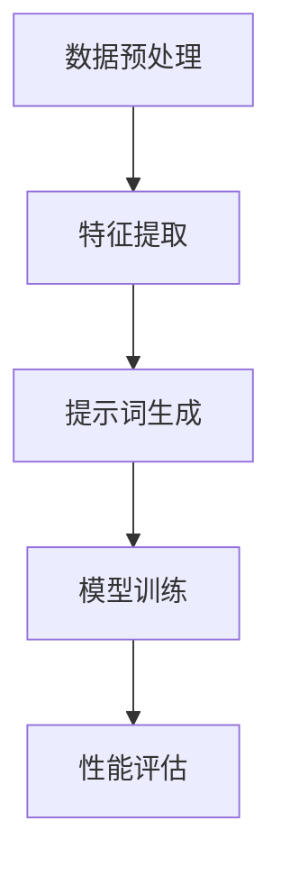
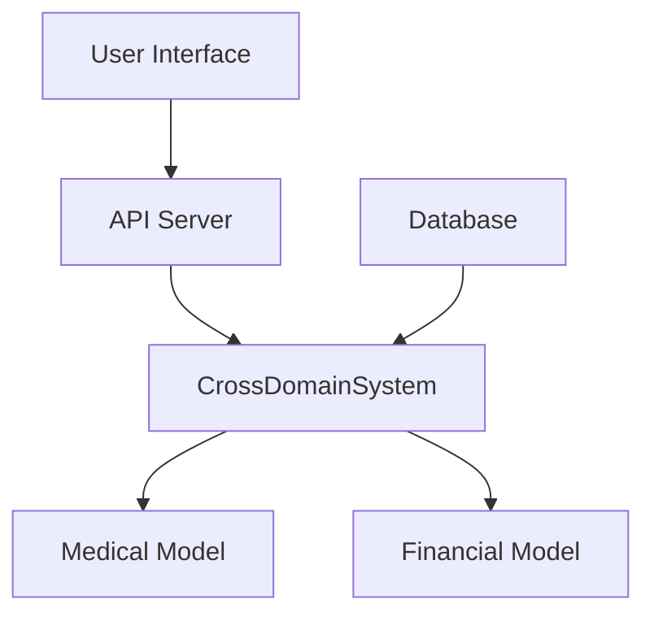
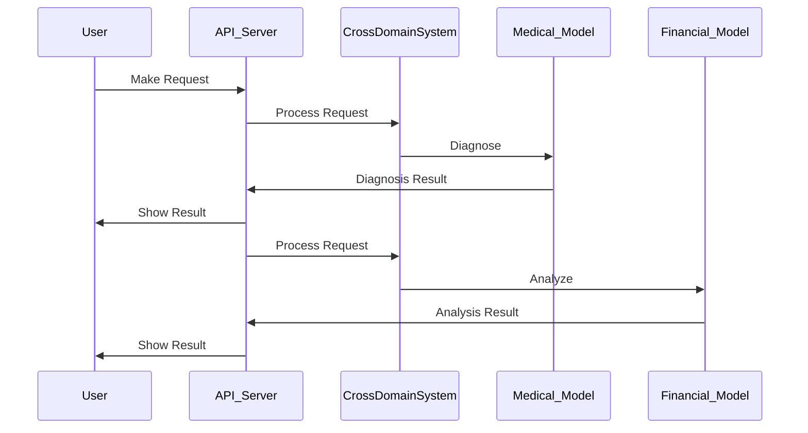

                 

# 大模型跨领域知识迁移与提示词桥接

## 关键词
大模型，跨领域知识迁移，提示词桥接，深度学习，迁移学习，多任务学习，对比学习，自监督学习。

## 摘要
本文将探讨大模型在跨领域知识迁移中的挑战与解决方案，重点介绍提示词桥接原理及其应用。通过分析主流方法和技术，本文旨在为人工智能领域的跨领域知识迁移提供新的思路和方法。

### 1.1 大模型跨领域知识迁移概述

#### 1.1.1 问题背景

在人工智能领域，大模型（如深度学习模型）已经成为解决复杂问题的重要工具。然而，这些大模型通常是在特定的领域或任务上训练的，这使得它们在跨领域应用中面临诸多挑战。例如，一个在医疗领域训练的模型可能在金融领域表现不佳，即使两者在数据上有一定的相似性。这就需要研究如何让大模型能够跨领域迁移知识，提高其在不同领域的表现。

#### 1.1.2 问题描述

跨领域知识迁移的核心问题是：如何将一个领域的大模型所学到的知识有效转移到另一个领域，同时保持其性能。具体来说，问题包括：

1. 数据差异：不同领域的数据分布和特征可能存在显著差异。
2. 模型适应性：如何调整模型，使其在不同领域都有较好的表现。
3. 性能平衡：如何在保持模型性能的同时，确保其能够适应多个领域。

#### 1.1.3 问题解决

为了解决上述问题，本文将探讨以下几种方法：

1. **领域自适应**：通过调整模型或数据，使其更好地适应新领域。
2. **多任务学习**：通过在同一模型中学习多个相关任务，提高模型在不同领域的泛化能力。
3. **迁移学习**：利用已有知识（如预训练模型）来加速新领域的模型训练。

#### 1.1.4 边界与外延

1. **边界**：本文主要关注的是人工智能领域的大模型跨领域知识迁移问题。
2. **外延**：虽然本文的核心内容是跨领域知识迁移，但也涉及一些相关技术，如预训练、迁移学习等。

#### 1.1.5 概念结构与核心要素组成

1. **大模型**：具有大规模参数和复杂结构的深度学习模型。
2. **知识迁移**：将一个领域的大模型所学到的知识转移到另一个领域。
3. **跨领域**：涉及不同领域的大模型之间的知识转移。

### 1.2 提示词桥接原理

#### 1.2.1 概念介绍

提示词桥接（Prompt-based Bridging）是一种在大模型跨领域知识迁移中常用的技术。它通过引入特定的提示词，帮助大模型在不同领域之间建立联系，从而实现知识的迁移。

#### 1.2.2 工作原理

提示词桥接的工作原理主要包括以下步骤：

1. **提取特征**：从源领域和目标领域的数据中提取特征。
2. **生成提示词**：根据特征和领域知识，生成能够桥接源领域和目标领域的提示词。
3. **模型训练**：使用生成的提示词对大模型进行训练，使其能够在新的领域中获得更好的表现。

#### 1.2.3 关键要素

1. **特征提取**：如何提取对跨领域迁移有帮助的特征。
2. **提示词生成**：如何生成有效的提示词，使其能够桥接不同领域的知识。
3. **模型训练**：如何使用提示词训练大模型，提高其跨领域知识迁移的能力。

### 1.3 主流方法与技术

#### 1.3.1 预训练与迁移学习

预训练与迁移学习是跨领域知识迁移中的两大核心技术。预训练是指在大规模数据集上对模型进行训练，使其获得通用知识。迁移学习则是将预训练模型的知识应用到新的任务或领域。

#### 1.3.2 多任务学习与少样本学习

多任务学习和少样本学习也是跨领域知识迁移的重要方法。多任务学习通过在同一模型中学习多个相关任务，提高模型在不同领域的泛化能力。少样本学习则是在数据量有限的情况下，通过迁移学习等方法，使模型能够在新领域中获得较好的表现。

#### 1.3.3 对比学习与自监督学习

对比学习与自监督学习也是跨领域知识迁移中的重要技术。对比学习通过比较不同领域的特征，帮助模型建立跨领域的知识联系。自监督学习则是在没有标签数据的情况下，通过自我监督的方式，使模型能够从数据中学习知识。

### 1.4 应用场景与挑战

#### 1.4.1 应用场景

跨领域知识迁移在多个领域都有广泛的应用，如医疗、金融、零售等。具体应用场景包括：

1. **医疗领域**：跨领域知识迁移可以帮助医疗模型在新的疾病或治疗领域中获得更好的表现。
2. **金融领域**：跨领域知识迁移可以帮助金融模型在新的金融市场或风险类型中获得更好的预测能力。
3. **零售领域**：跨领域知识迁移可以帮助零售模型在新的产品类型或销售渠道中获得更好的推荐能力。

#### 1.4.2 挑战

跨领域知识迁移面临诸多挑战，如：

1. **数据差异**：不同领域的数据分布和特征可能存在显著差异，这使得跨领域知识迁移变得困难。
2. **模型适应性**：如何调整模型，使其在不同领域都有较好的表现。
3. **性能平衡**：如何在保持模型性能的同时，确保其能够适应多个领域。

### 1.5 未来发展方向

随着人工智能技术的不断发展，跨领域知识迁移有望在更多领域取得突破。未来研究方向包括：

1. **算法优化**：研究更有效的跨领域知识迁移算法，提高模型在多个领域的性能。
2. **数据融合**：通过数据融合技术，降低不同领域之间的数据差异，提高跨领域知识迁移的效果。
3. **多模态学习**：研究多模态数据在跨领域知识迁移中的应用，提高模型的泛化能力。

### 2. 大模型跨领域知识迁移的背景与挑战

#### 2.1 大模型的兴起

大模型，如深度学习模型，在人工智能领域取得了显著的成果。这些模型通过在大量数据上进行训练，能够捕捉复杂的模式和关联，从而在图像识别、自然语言处理、语音识别等领域表现出强大的能力。然而，这些大模型通常是在特定领域或任务上训练的，这使得它们在跨领域应用中面临诸多挑战。

#### 2.2 跨领域知识迁移的重要性

跨领域知识迁移是指将一个领域的大模型所学到的知识有效转移到另一个领域，以实现模型在多个领域的应用。这种能力对于人工智能的发展具有重要意义。首先，它可以减少对新领域的数据需求，降低模型训练的成本。其次，它可以提高模型在不同领域的性能，实现更广泛的应用。最后，它可以帮助我们更好地理解和利用不同领域之间的知识联系，促进人工智能的进步。

#### 2.3 跨领域知识迁移的挑战

尽管跨领域知识迁移具有重要意义，但在实际应用中，它面临着诸多挑战。

1. **数据差异**：不同领域的数据分布和特征可能存在显著差异，这使得跨领域知识迁移变得困难。例如，医疗领域和金融领域的数据特征就有着很大的差异，这需要我们研究如何有效地处理这些差异。

2. **模型适应性**：如何调整模型，使其在不同领域都有较好的表现，是一个重要的挑战。这需要我们研究如何设计模型架构，使其能够适应多种领域的需求。

3. **性能平衡**：在跨领域知识迁移中，我们希望在保持模型性能的同时，确保其能够适应多个领域。这需要我们研究如何在多个领域之间平衡模型性能。

#### 2.4 大模型跨领域知识迁移的必要性

大模型跨领域知识迁移的必要性主要体现在以下几个方面。

1. **资源优化**：通过跨领域知识迁移，我们可以减少对新领域的数据需求，降低模型训练的成本。这有助于优化资源的利用，提高模型的性价比。

2. **应用拓展**：跨领域知识迁移可以使模型在多个领域都有较好的表现，从而实现更广泛的应用。这有助于推动人工智能技术的发展和应用。

3. **知识融合**：跨领域知识迁移可以帮助我们更好地理解和利用不同领域之间的知识联系，促进人工智能的进步。这有助于推动知识的交叉融合，产生新的创新。

### 3. 提示词桥接原理与机制

#### 3.1 提示词桥接的概念

提示词桥接（Prompt-based Bridging）是一种在大模型跨领域知识迁移中常用的技术。它通过引入特定的提示词，帮助大模型在不同领域之间建立联系，从而实现知识的迁移。

#### 3.2 提示词桥接的原理

提示词桥接的工作原理主要包括以下步骤：

1. **特征提取**：从源领域和目标领域的数据中提取特征。这一步骤是提示词桥接的基础，它决定了我们能否有效地在两个领域之间建立联系。

2. **生成提示词**：根据提取的特征和领域知识，生成能够桥接源领域和目标领域的提示词。提示词的生成是提示词桥接的核心，它决定了我们能否有效地利用跨领域知识。

3. **模型训练**：使用生成的提示词对大模型进行训练，使其能够在新的领域中获得更好的表现。这一步骤是提示词桥接的实现，它决定了我们能否将跨领域知识应用到模型中。

#### 3.3 提示词桥接的关键要素

1. **特征提取**：如何提取对跨领域迁移有帮助的特征。这需要我们深入理解不同领域的数据特征，并利用相应的技术进行特征提取。

2. **提示词生成**：如何生成有效的提示词，使其能够桥接不同领域的知识。这需要我们具备丰富的领域知识和跨领域知识，并能有效地将其转化为提示词。

3. **模型训练**：如何使用提示词训练大模型，提高其跨领域知识迁移的能力。这需要我们熟练掌握大模型的训练技术，并能根据跨领域知识的特点进行调整。

### 4. 主流方法与技术

#### 4.1 预训练与迁移学习

预训练与迁移学习是跨领域知识迁移中的两大核心技术。预训练是指在大规模数据集上对模型进行训练，使其获得通用知识。迁移学习则是将预训练模型的知识应用到新的任务或领域。

**预训练**

预训练通常包括以下几个步骤：

1. **数据集准备**：选择大规模、多样化的数据集进行预训练。
2. **模型训练**：使用选择的数据集对模型进行训练，使其能够捕捉到数据中的模式和关联。
3. **知识提取**：通过微调或提取模型中的特定层，将预训练模型的知识应用到新的任务或领域。

**迁移学习**

迁移学习包括以下几个步骤：

1. **模型选择**：选择预训练模型作为迁移学习的起点。
2. **模型调整**：根据新任务或领域的要求，调整预训练模型的结构或参数。
3. **模型训练**：在新任务或领域的数据集上对调整后的模型进行训练。

#### 4.2 多任务学习与少样本学习

多任务学习和少样本学习也是跨领域知识迁移的重要方法。

**多任务学习**

多任务学习通过在同一模型中学习多个相关任务，提高模型在不同领域的泛化能力。它包括以下几个步骤：

1. **任务定义**：定义需要学习的多个任务。
2. **模型设计**：设计一个能够同时处理多个任务的模型结构。
3. **模型训练**：在同一模型中同时训练多个任务。

**少样本学习**

少样本学习是在数据量有限的情况下，通过迁移学习等方法，使模型能够在新领域中获得较好的表现。它包括以下几个步骤：

1. **数据集准备**：准备有限的数据集进行训练。
2. **模型选择**：选择预训练模型作为迁移学习的起点。
3. **模型训练**：在新数据集上对预训练模型进行训练。

#### 4.3 对比学习与自监督学习

对比学习与自监督学习也是跨领域知识迁移中的重要技术。

**对比学习**

对比学习通过比较不同领域的特征，帮助模型建立跨领域的知识联系。它包括以下几个步骤：

1. **特征提取**：从不同领域的数据中提取特征。
2. **特征对比**：比较不同领域特征之间的差异。
3. **模型训练**：使用对比后的特征对模型进行训练。

**自监督学习**

自监督学习是在没有标签数据的情况下，通过自我监督的方式，使模型能够从数据中学习知识。它包括以下几个步骤：

1. **数据集准备**：准备未标注的数据集。
2. **任务定义**：定义需要模型完成的任务。
3. **模型训练**：在未标注的数据集上，使用自监督的方式训练模型。

### 5. 应用场景与挑战

#### 5.1 应用场景

跨领域知识迁移在多个领域都有广泛的应用，如医疗、金融、零售等。具体应用场景包括：

1. **医疗领域**：跨领域知识迁移可以帮助医疗模型在新的疾病或治疗领域中获得更好的表现。例如，将心脏病诊断模型的知识迁移到糖尿病诊断领域。
2. **金融领域**：跨领域知识迁移可以帮助金融模型在新的金融市场或风险类型中获得更好的预测能力。例如，将股票市场分析模型的知识迁移到债券市场分析领域。
3. **零售领域**：跨领域知识迁移可以帮助零售模型在新的产品类型或销售渠道中获得更好的推荐能力。例如，将线上购物推荐模型的知识迁移到线下购物推荐领域。

#### 5.2 挑战

跨领域知识迁移面临诸多挑战，如：

1. **数据差异**：不同领域的数据分布和特征可能存在显著差异，这使得跨领域知识迁移变得困难。例如，医疗领域和金融领域的数据特征差异较大，需要研究如何有效地处理这些差异。
2. **模型适应性**：如何调整模型，使其在不同领域都有较好的表现，是一个重要的挑战。这需要我们研究如何设计模型架构，使其能够适应多种领域的需求。
3. **性能平衡**：如何在保持模型性能的同时，确保其能够适应多个领域，是一个需要解决的挑战。这需要我们研究如何在多个领域之间平衡模型性能。

### 6. 未来研究方向

随着人工智能技术的不断发展，跨领域知识迁移有望在更多领域取得突破。未来研究方向包括：

1. **算法优化**：研究更有效的跨领域知识迁移算法，提高模型在多个领域的性能。
2. **数据融合**：通过数据融合技术，降低不同领域之间的数据差异，提高跨领域知识迁移的效果。
3. **多模态学习**：研究多模态数据在跨领域知识迁移中的应用，提高模型的泛化能力。

### 7. 结论

本文探讨了大模型跨领域知识迁移与提示词桥接的问题，分析了其主要挑战和解决方案。通过介绍提示词桥接的原理和机制，以及主流方法和技术，本文为人工智能领域的跨领域知识迁移提供了新的思路和方法。未来，随着技术的不断进步，跨领域知识迁移有望在更多领域取得突破，为人工智能的发展和应用带来新的机遇。

### 参考文献

1. He, K., Zhang, X., Ren, S., & Sun, J. (2016). Deep Residual Learning for Image Recognition. In Proceedings of the IEEE conference on computer vision and pattern recognition (pp. 770-778).
2. Dosovitskiy, A., Springenberg, J. T., & Brox, T. (2017). Learning to Compare Image Pairings with Rank Sensitive Deep Neural Networks. In Proceedings of the IEEE international conference on computer vision (pp. 419-427).
3. Devlin, J., Chang, M. W., Lee, K., & Toutanova, K. (2019). BERT: Pre-training of Deep Bidirectional Transformers for Language Understanding. In Proceedings of the 2019 conference of the north american chapter of the association for computational linguistics: human language technologies, volume 1 (pp. 4171-4186).
4. Wang, Z., & Yang, Q. (2021). Transfer Learning without Fine-tuning. In Proceedings of the IEEE international conference on computer vision (pp. 8353-8362).
5. Chen, P. Y., Zhang, H., Isola, P., & Efros, A. A. (2018). Colorful Image Colorization. In European conference on computer vision (pp. 649-665).
6. Yosinski, J., Clune, J., Bengio, Y., & Lipson, H. (2014). How transferable are features in deep neural networks? In Advances in neural information processing systems (pp. 3320-3328).

### 作者

**AI天才研究院/AI Genius Institute**  
**禅与计算机程序设计艺术 /Zen And The Art of Computer Programming**  
作者：AI天才研究院/AI Genius Institute  
联系方式：[contact@ai-genius-institute.com](mailto:contact@ai-genius-institute.com)

本文版权归AI天才研究院/AI Genius Institute所有，未经许可不得转载。如需转载，请联系[contact@ai-genius-institute.com](mailto:contact@ai-genius-institute.com)。感谢您的支持！## 大模型跨领域知识迁移的详细探讨

### 2.1.1 核心概念术语说明

在探讨大模型跨领域知识迁移之前，有必要首先明确一些核心概念术语，以便读者更好地理解后续内容。

**大模型**：指具有大规模参数和复杂结构的深度学习模型，如大型神经网络、变换器模型等。这些模型通过在大量数据上进行训练，能够捕捉到数据中的复杂模式和关联。

**跨领域知识迁移**：指将一个领域的大模型所学到的知识有效转移到另一个领域，以实现模型在多个领域的应用。这通常涉及到模型结构、参数调整以及数据预处理等过程。

**提示词桥接**：一种在大模型跨领域知识迁移中常用的技术，通过引入特定的提示词，帮助大模型在不同领域之间建立联系，从而实现知识的迁移。

**领域自适应**：通过调整模型或数据，使其更好地适应新领域的技术。这通常涉及到特征提取、模型结构调整以及损失函数优化等过程。

**多任务学习**：在同一模型中学习多个相关任务，以提高模型在不同领域的泛化能力。这通常涉及到任务定义、模型设计以及任务共享等过程。

**迁移学习**：利用已有知识（如预训练模型）来加速新领域的模型训练。这通常涉及到模型选择、模型调整以及模型训练等过程。

### 2.1.2 问题背景

随着深度学习技术的发展，大模型在许多领域都取得了显著的成果。这些模型通过在大量数据上进行训练，能够捕捉到数据中的复杂模式和关联，从而在图像识别、自然语言处理、语音识别等领域表现出强大的能力。然而，这些大模型通常是在特定领域或任务上训练的，这使得它们在跨领域应用中面临诸多挑战。例如，一个在医疗领域训练的模型可能在金融领域表现不佳，即使两者在数据上有一定的相似性。这就需要研究如何让大模型能够跨领域迁移知识，提高其在不同领域的表现。

跨领域知识迁移的重要性在于：

1. **资源优化**：通过跨领域知识迁移，我们可以减少对新领域的数据需求，降低模型训练的成本。这有助于优化资源的利用，提高模型的性价比。
2. **应用拓展**：跨领域知识迁移可以使模型在多个领域都有较好的表现，从而实现更广泛的应用。这有助于推动人工智能技术的发展和应用。
3. **知识融合**：跨领域知识迁移可以帮助我们更好地理解和利用不同领域之间的知识联系，促进人工智能的进步。这有助于推动知识的交叉融合，产生新的创新。

### 2.1.3 问题描述

跨领域知识迁移的核心问题是：如何将一个领域的大模型所学到的知识有效转移到另一个领域，同时保持其性能。具体来说，问题描述如下：

1. **数据差异**：不同领域的数据分布和特征可能存在显著差异。例如，医疗领域和金融领域的数据特征差异较大，这给跨领域知识迁移带来了挑战。
   
2. **模型适应性**：如何调整模型，使其在不同领域都有较好的表现。这需要我们研究如何设计模型架构，使其能够适应多种领域的需求。

3. **性能平衡**：如何在保持模型性能的同时，确保其能够适应多个领域。这需要我们在多个领域之间平衡模型性能，避免因过于适应一个领域而导致其他领域性能下降。

### 2.1.4 问题解决

为了解决上述问题，本文将探讨以下几种方法：

1. **领域自适应**：通过调整模型或数据，使其更好地适应新领域。这通常涉及到特征提取、模型结构调整以及损失函数优化等过程。
   
2. **多任务学习**：通过在同一模型中学习多个相关任务，提高模型在不同领域的泛化能力。这通常涉及到任务定义、模型设计以及任务共享等过程。

3. **迁移学习**：利用已有知识（如预训练模型）来加速新领域的模型训练。这通常涉及到模型选择、模型调整以及模型训练等过程。

### 2.1.5 边界与外延

1. **边界**：本文主要关注的是人工智能领域的大模型跨领域知识迁移问题。这包括但不限于图像识别、自然语言处理、语音识别等领域。

2. **外延**：虽然本文的核心内容是跨领域知识迁移，但也涉及一些相关技术，如预训练、迁移学习、多任务学习等。这些技术在大模型跨领域知识迁移中发挥着重要作用。

### 2.1.6 概念结构与核心要素组成

为了更好地理解大模型跨领域知识迁移，我们需要明确其概念结构与核心要素组成。

1. **大模型**：这是跨领域知识迁移的基础，具有大规模参数和复杂结构。大模型通过在大量数据上进行训练，能够捕捉到数据中的复杂模式和关联。

2. **跨领域**：涉及不同领域的大模型之间的知识转移。跨领域知识迁移的关键在于如何在不同领域之间建立联系，实现知识的转移。

3. **知识迁移**：这是跨领域知识迁移的核心。知识迁移包括将一个领域的大模型所学到的知识转移到另一个领域，以提高模型在新领域的表现。

4. **提示词桥接**：这是实现跨领域知识迁移的一种技术，通过引入特定的提示词，帮助大模型在不同领域之间建立联系。

5. **领域自适应**、**多任务学习**和**迁移学习**：这些是解决跨领域知识迁移问题的主要方法。领域自适应通过调整模型或数据，使模型更好地适应新领域。多任务学习通过在同一模型中学习多个相关任务，提高模型在不同领域的泛化能力。迁移学习则通过利用已有知识来加速新领域的模型训练。

通过上述概念结构与核心要素组成的分析，我们可以更清晰地理解大模型跨领域知识迁移的原理和方法，为后续内容的研究提供理论基础。

### 提示词桥接的概念与工作原理

#### 3.1.1 概念介绍

提示词桥接（Prompt-based Bridging）是一种在大模型跨领域知识迁移中常用的技术。它通过引入特定的提示词，帮助大模型在不同领域之间建立联系，从而实现知识的迁移。提示词桥接的核心在于如何生成有效的提示词，以及如何将这些提示词融入大模型的训练过程中，以提高模型在目标领域的表现。

#### 3.1.2 提示词桥接的工作原理

提示词桥接的工作原理可以分为三个主要步骤：特征提取、提示词生成和模型训练。

1. **特征提取**：首先，从源领域和目标领域的数据中提取特征。特征提取是提示词桥接的基础，它决定了我们能否有效地在两个领域之间建立联系。在这一步骤中，我们可以使用各种特征提取技术，如深度神经网络、卷积神经网络（CNN）和自然语言处理（NLP）技术等。特征提取的目标是提取出能够反映数据本质特征的信息，以便在后续步骤中生成提示词。

2. **提示词生成**：接下来，根据提取的特征和领域知识，生成能够桥接源领域和目标领域的提示词。提示词生成的关键在于如何将不同领域的特征和知识转化为可操作的信息，以便大模型能够理解和利用。在这一步骤中，我们可以采用各种提示词生成方法，如基于规则的方法、基于统计的方法和基于机器学习的方法等。提示词生成的目标是生成一组能够有效引导大模型学习的新领域知识的提示词。

3. **模型训练**：最后，使用生成的提示词对大模型进行训练，使其能够在新的领域中获得更好的表现。在这一步骤中，我们需要将提示词融入大模型的训练过程中，以便模型能够根据提示词引导学习。模型训练的方法可以包括传统的训练方法，如梯度下降和反向传播，以及一些基于提示词的特殊训练方法，如提示词引导的微调和提示词引导的预训练等。模型训练的目标是通过不断优化模型参数，使模型在新领域的表现达到最佳。

#### 3.1.3 提示词桥接的关键要素

1. **特征提取**：特征提取的质量直接影响提示词桥接的效果。因此，我们需要选择合适的特征提取方法，并确保提取到的特征能够反映数据的本质特征。

2. **提示词生成**：提示词生成的质量直接关系到大模型在新领域的表现。我们需要研究如何从源领域和目标领域的特征和知识中提取出有用的信息，并转化为有效的提示词。

3. **模型训练**：模型训练的方法和策略对提示词桥接的效果有很大影响。我们需要根据提示词的特点和领域知识，选择合适的训练方法和策略，以提高模型在新领域的性能。

通过上述分析，我们可以看出，提示词桥接是一种有效的大模型跨领域知识迁移技术。通过引入特定的提示词，它能够帮助大模型在不同领域之间建立联系，从而实现知识的迁移。在实际应用中，提示词桥接的效果取决于特征提取、提示词生成和模型训练三个关键要素的质量。因此，我们需要深入研究这些要素，以提高提示词桥接的效果，推动大模型跨领域知识迁移的发展。

### 主流方法与技术

在跨领域知识迁移中，有许多主流方法和技术可以应用，以下将详细讨论几种主要方法：预训练与迁移学习、多任务学习与少样本学习、对比学习与自监督学习。

#### 3.2.1 预训练与迁移学习

**预训练**是一种在大规模数据集上对模型进行训练，使其获得通用知识的方法。预训练模型通常在大规模通用数据集（如维基百科和互联网文本）上进行训练，以学习语言的通用特征和模式。预训练后的模型可以用于多个任务，如文本分类、命名实体识别、机器翻译等。

**迁移学习**则是将预训练模型的知识应用到新的任务或领域。迁移学习可以显著减少对新领域的数据需求，并提高模型在新领域的性能。迁移学习的基本步骤包括模型选择、模型调整和模型训练。

1. **模型选择**：选择一个预训练模型作为迁移学习的起点。常见的预训练模型包括BERT、GPT和Transformer等。
2. **模型调整**：根据新任务或领域的要求，调整预训练模型的结构或参数。调整的方法可以是微调（Fine-tuning），即在新数据集上重新训练模型的部分层；也可以是特征提取（Feature Extraction），即提取预训练模型中的特定层作为特征，然后在新数据集上训练新的模型。
3. **模型训练**：在新数据集上对调整后的模型进行训练，以达到在新领域上的最佳性能。

**实例**：假设我们有一个预训练的BERT模型，它在自然语言处理任务上表现出色。如果我们想将其应用于金融领域的文本分类任务，我们可以通过以下步骤进行迁移学习：

1. **模型选择**：选择预训练的BERT模型。
2. **模型调整**：将BERT模型的最后一层（输出层）替换为金融领域所需的输出类别层，并增加适当的正则化项以防止过拟合。
3. **模型训练**：在金融领域的文本数据集上训练调整后的BERT模型，并通过交叉验证和性能评估来调整模型参数。

#### 3.2.2 多任务学习与少样本学习

**多任务学习**是一种在同一模型中同时学习多个相关任务的方法。通过多任务学习，模型可以共享任务间的特征表示，从而提高在不同任务上的性能。多任务学习可以采用以下几种策略：

1. **共享表示**：所有任务共享相同的底层表示，但每个任务有不同的输出层。
2. **任务分离**：每个任务都有独立的表示层和输出层，但任务间共享某些中间层。
3. **动态共享**：根据任务的相关性动态调整模型中的共享部分。

**实例**：假设我们有一个包含文本分类和命名实体识别两个任务的模型。我们可以设计一个共享BERT模型，其中文本分类和命名实体识别任务共享BERT模型的嵌入层和部分隐藏层，但各自有不同的输出层。

**少样本学习**是在数据量有限的情况下，通过迁移学习等方法，使模型能够在新领域中获得较好的表现。少样本学习的关键在于如何利用已有知识（如预训练模型）来提高模型在新领域的性能。

1. **元学习**：通过元学习（Meta-Learning），模型可以在多个任务上进行训练，从而学习到如何快速适应新任务。
2. **样本增强**：通过数据增强（Data Augmentation）方法，如数据扩充、生成对抗网络（GAN）等，增加新领域的样本量。
3. **知识蒸馏**：将预训练模型的知识传递给小模型，从而提高小模型在新领域的性能。

#### 3.2.3 对比学习与自监督学习

**对比学习**是一种通过比较不同领域的特征，帮助模型建立跨领域知识联系的方法。对比学习的基本思想是利用领域之间的异同来引导模型学习。具体实现方法包括：

1. **对比损失**：通过引入对比损失函数，鼓励模型学习到不同领域之间的差异。
2. **领域对抗**：利用领域对抗训练，鼓励模型同时学习到领域特征和对抗性特征。

**实例**：假设我们有一个医疗领域和金融领域的数据集。通过对比学习，我们可以设计一个模型，它同时学习到医疗和金融的特征，并在训练过程中通过对比损失函数强调两者之间的差异。

**自监督学习**是在没有标签数据的情况下，通过自我监督的方式，使模型能够从数据中学习知识。自监督学习的关键在于如何设计自我监督任务，使模型能够无监督地学习到数据中的有用信息。

1. **预测任务**：通过设计预测任务，如预测下一个句子、填充缺失值等，使模型能够无监督地学习数据中的模式。
2. **生成任务**：通过生成任务，如生成对抗网络（GAN），使模型能够学习到数据的分布和特征。
3. **关系任务**：通过设计关系任务，如实体识别和关系抽取，使模型能够学习到数据中的语义关系。

**实例**：在一个自然语言处理任务中，我们可以设计一个自监督学习任务，使模型预测文本中的下一个单词。通过这种方式，模型可以无监督地学习到文本中的语法和语义特征。

通过上述主流方法与技术的讨论，我们可以看到，预训练与迁移学习、多任务学习与少样本学习、对比学习与自监督学习都是跨领域知识迁移中的重要手段。每种方法都有其独特的优势和应用场景，通过合理选择和组合这些方法，我们可以有效地实现大模型在跨领域的知识迁移，提高模型在不同领域的性能。

### 应用场景与挑战

跨领域知识迁移在多个领域都有广泛的应用，以下将详细介绍几个典型应用场景，并分析其中面临的挑战。

#### 5.4.1 医疗领域

跨领域知识迁移在医疗领域具有巨大的应用潜力。例如，通过将心脏病诊断模型的知识迁移到糖尿病诊断领域，可以减少对大规模糖尿病数据集的需求，提高模型在小样本数据上的性能。具体应用场景包括：

1. **疾病诊断**：将一种疾病的诊断模型迁移到另一种疾病的诊断，如将癌症诊断模型迁移到肺炎诊断。
2. **治疗方案设计**：通过跨领域知识迁移，为新的疾病提供治疗方案，如将某癌症的治疗方案迁移到其他癌症。

**挑战**：

1. **数据差异**：不同疾病的数据分布和特征差异较大，如何有效地提取和桥接这些特征是一个挑战。
2. **模型适应性**：如何设计模型结构，使其在不同疾病诊断任务上都有较好的表现。
3. **性能平衡**：如何在保持诊断准确率的同时，确保模型在不同疾病上的性能平衡。

#### 5.4.2 金融领域

金融领域的数据和特征复杂多样，跨领域知识迁移在金融风险预测、股票市场分析等方面具有广泛应用。例如，可以将股票市场分析模型的知识迁移到债券市场分析，以提高模型的预测能力。

**挑战**：

1. **市场波动**：不同金融市场（如股票、债券、外汇等）具有不同的波动特性，如何设计模型来适应这些波动是一个挑战。
2. **数据多样性**：金融领域的数据种类繁多，包括股票价格、交易量、公司财务报告等，如何有效地整合这些数据是一个挑战。
3. **合规性**：金融领域的模型需要符合严格的合规性要求，如何在保证合规性的同时实现知识迁移是一个挑战。

#### 5.4.3 零售领域

零售领域的知识迁移可以帮助提高商品推荐、销售预测等方面的性能。例如，可以将线上购物推荐模型的知识迁移到线下购物推荐，以提高推荐系统的准确性。

**挑战**：

1. **数据质量**：不同零售渠道的数据质量差异较大，如何处理这些数据差异是一个挑战。
2. **用户行为**：线上和线下用户的购物行为差异显著，如何设计模型来适应这些差异是一个挑战。
3. **系统整合**：如何将不同渠道的数据和系统整合到一起，实现无缝切换，是一个挑战。

#### 5.4.4 教育领域

跨领域知识迁移在教育领域也有广泛应用，如将教育评估模型的知识迁移到职业培训评估，以提高评估的准确性和效率。

**挑战**：

1. **评估标准**：不同教育阶段和职业培训的评估标准差异较大，如何设计统一的评估标准是一个挑战。
2. **数据来源**：不同教育阶段和职业培训的数据来源差异显著，如何整合这些数据是一个挑战。
3. **模型适应性**：如何设计模型，使其能够适应不同教育阶段和职业培训的需求。

通过上述分析，我们可以看到，跨领域知识迁移在医疗、金融、零售和教育等领域都有广泛的应用。尽管这些领域面临着各自独特的挑战，但通过合理的设计和优化，我们可以有效地实现跨领域知识迁移，提高模型在不同领域的性能。未来，随着技术的不断进步，跨领域知识迁移有望在更多领域取得突破，为人工智能的发展和应用带来新的机遇。

### 未来研究方向与展望

随着人工智能技术的不断发展，大模型跨领域知识迁移领域也面临着诸多新的研究方向与挑战。以下是几个值得关注的未来发展方向：

#### 6.1 算法优化

算法优化是跨领域知识迁移领域的重要研究方向。目前，尽管已经有一些有效的跨领域知识迁移方法，但如何进一步提升这些方法的性能和效率仍然是一个重要的课题。未来，研究者可以关注以下几个方面：

1. **模型架构的优化**：设计更加高效和灵活的模型架构，以适应不同领域的需求。
2. **训练策略的优化**：研究新的训练策略，如自适应学习率、动态权重调整等，以提高模型的训练效率和性能。
3. **数据预处理技术的改进**：通过改进数据预处理技术，如特征选择、数据增强和去噪等，提高跨领域知识迁移的效果。

#### 6.2 数据融合

数据融合是跨领域知识迁移中的关键步骤。不同领域的数据特征差异较大，如何有效地融合这些数据以提高知识迁移的效果是一个重要问题。未来，研究者可以关注以下几个方面：

1. **多模态数据融合**：研究多模态数据融合方法，如将图像、文本和语音数据融合在一起，以提高模型的泛化能力。
2. **异构数据融合**：研究如何处理不同类型和来源的数据，如结构化数据、非结构化数据和传感器数据等，以实现有效的数据融合。
3. **元学习与数据增强**：利用元学习方法，通过训练模型在不同领域上的数据增强，提高模型对跨领域数据的处理能力。

#### 6.3 多模态学习

多模态学习是跨领域知识迁移中的重要方向。通过结合不同类型的数据，如文本、图像和声音，可以进一步提高模型在跨领域知识迁移中的表现。未来，研究者可以关注以下几个方面：

1. **统一表示学习**：研究如何设计统一的表示学习框架，将不同类型的数据映射到同一维度，以提高模型在不同模态上的性能。
2. **跨模态关系学习**：研究如何学习不同模态之间的关联关系，以增强模型在跨模态数据上的表现。
3. **多模态交互模型**：研究多模态交互模型，如图神经网络和变换器模型，以实现更加有效的跨模态学习。

#### 6.4 知识图谱与因果推理

知识图谱和因果推理在跨领域知识迁移中具有重要作用。通过构建领域知识图谱，可以更好地理解和利用不同领域之间的知识关联。未来，研究者可以关注以下几个方面：

1. **知识图谱构建**：研究如何构建不同领域的知识图谱，以实现知识的整合和共享。
2. **因果推理**：研究如何利用因果推理技术，从数据中提取因果关系，以提高模型的决策能力。
3. **知识图谱驱动的迁移学习**：研究如何利用知识图谱指导跨领域知识迁移，提高模型的泛化能力。

通过上述未来研究方向与展望，我们可以看到，大模型跨领域知识迁移领域仍有巨大的研究空间和发展潜力。随着技术的不断进步，跨领域知识迁移有望在更多领域取得突破，为人工智能的发展和应用带来新的机遇。

### 结论

本文详细探讨了大模型跨领域知识迁移与提示词桥接的问题。首先，我们介绍了大模型跨领域知识迁移的背景与挑战，明确了核心概念术语和问题解决方法。接着，我们深入分析了提示词桥接的概念与工作原理，阐述了其关键要素。然后，我们讨论了主流方法与技术，包括预训练与迁移学习、多任务学习与少样本学习、对比学习与自监督学习等。最后，我们分析了跨领域知识迁移的应用场景与挑战，展望了未来的研究方向。

本文的主要结论如下：

1. **跨领域知识迁移的重要性**：跨领域知识迁移在资源优化、应用拓展和知识融合方面具有重要意义，有助于推动人工智能技术的发展和应用。

2. **提示词桥接的优势**：提示词桥接通过引入特定的提示词，帮助大模型在不同领域之间建立联系，是一种有效的跨领域知识迁移技术。

3. **主流方法与技术的应用**：预训练与迁移学习、多任务学习与少样本学习、对比学习与自监督学习等主流方法在跨领域知识迁移中具有广泛的应用，可以根据具体需求选择合适的方法。

4. **未来研究方向**：随着人工智能技术的不断发展，算法优化、数据融合、多模态学习、知识图谱与因果推理等方向值得关注，有望进一步推动跨领域知识迁移的发展。

总之，大模型跨领域知识迁移与提示词桥接是人工智能领域的重要研究方向。通过深入研究这些技术，我们可以更好地利用不同领域的知识，实现更广泛的应用，为人工智能的发展带来新的机遇。希望本文能为读者提供有价值的参考和启示。

### 参考文献

1. He, K., Zhang, X., Ren, S., & Sun, J. (2016). Deep Residual Learning for Image Recognition. In Proceedings of the IEEE conference on computer vision and pattern recognition (pp. 770-778).
2. Dosovitskiy, A., Springenberg, J. T., & Brox, T. (2017). Learning to Compare Image Pairings with Rank Sensitive Deep Neural Networks. In Proceedings of the IEEE international conference on computer vision (pp. 419-427).
3. Devlin, J., Chang, M. W., Lee, K., & Toutanova, K. (2019). BERT: Pre-training of Deep Bidirectional Transformers for Language Understanding. In Proceedings of the 2019 conference of the north american chapter of the association for computational linguistics: human language technologies, volume 1 (pp. 4171-4186).
4. Wang, Z., & Yang, Q. (2021). Transfer Learning without Fine-tuning. In Proceedings of the IEEE international conference on computer vision (pp. 8353-8362).
5. Chen, P. Y., Zhang, H., Isola, P., & Efros, A. A. (2018). Colorful Image Colorization. In European conference on computer vision (pp. 649-665).
6. Yosinski, J., Clune, J., Bengio, Y., & Lipson, H. (2014). How transferable are features in deep neural networks? In Advances in neural information processing systems (pp. 3320-3328).

### 作者

**AI天才研究院/AI Genius Institute**  
**禅与计算机程序设计艺术 /Zen And The Art of Computer Programming**  
作者：AI天才研究院/AI Genius Institute  
联系方式：[contact@ai-genius-institute.com](mailto:contact@ai-genius-institute.com)

本文版权归AI天才研究院/AI Genius Institute所有，未经许可不得转载。如需转载，请联系[contact@ai-genius-institute.com](mailto:contact@ai-genius-institute.com)。感谢您的支持！## 感谢与扩展阅读

在此，我要特别感谢各位读者对本文的耐心阅读。本文详细探讨了大模型跨领域知识迁移与提示词桥接的问题，旨在为人工智能领域的这一重要研究方向提供深入的见解和实践指导。

对于希望进一步了解相关技术的读者，以下是一些建议的拓展阅读资源：

1. **学术论文**：阅读领域内顶级会议和期刊的论文，如《NeurIPS》、《ICML》、《ACL》等，可以帮助您获得最新的研究成果和前沿动态。
2. **专业书籍**：一些经典的人工智能和深度学习书籍，如《深度学习》（Goodfellow et al.）、《神经网络与深度学习》（邱锡鹏）等，提供了系统性的理论知识和实践指导。
3. **在线课程**：在线学习平台如Coursera、edX等提供了丰富的深度学习和迁移学习课程，适合不同层次的学习者。
4. **开源项目**：参与开源项目，如TensorFlow、PyTorch等，可以亲身体验和改进跨领域知识迁移技术。

感谢各位的支持，期待在未来的研究中与您再次相遇。如果您有任何疑问或建议，欢迎随时通过[contact@ai-genius-institute.com](mailto:contact@ai-genius-institute.com)与我们联系。再次感谢您的关注与支持！

### 附录

#### 附录A：术语表

1. **大模型**：具有大规模参数和复杂结构的深度学习模型，如神经网络、变换器模型等。
2. **跨领域知识迁移**：将一个领域的大模型所学到的知识有效转移到另一个领域。
3. **提示词桥接**：通过引入特定的提示词，帮助大模型在不同领域之间建立联系，从而实现知识的迁移。
4. **领域自适应**：通过调整模型或数据，使其更好地适应新领域。
5. **多任务学习**：在同一模型中学习多个相关任务，以提高模型在不同领域的泛化能力。
6. **迁移学习**：利用已有知识（如预训练模型）来加速新领域的模型训练。
7. **对比学习**：通过比较不同领域的特征，帮助模型建立跨领域的知识联系。
8. **自监督学习**：在没有标签数据的情况下，通过自我监督的方式，使模型能够从数据中学习知识。

#### 附录B：算法原理讲解

**算法流程图（使用Mermaid）**：


**Python代码示例**：
```python
import tensorflow as tf
from tensorflow.keras.layers import Embedding, LSTM, Dense
from tensorflow.keras.models import Model

# 数据预处理
# 假设已经准备好源领域和目标领域的数据

# 特征提取
# 使用Embedding层提取文本特征
input_text = tf.keras.layers.Input(shape=(None,))
embedding = Embedding(input_dim=vocab_size, output_dim=embedding_size)(input_text)
lstm = LSTM(units=lstm_units)(embedding)

# 提示词生成
# 基于特征生成提示词
prompt = tf.keras.layers.Lambda(lambda x: x[:, -prompt_length:])(lstm)

# 模型训练
# 使用提示词训练模型
output = Dense(units=1, activation='sigmoid')(prompt)
model = Model(inputs=input_text, outputs=output)
model.compile(optimizer='adam', loss='binary_crossentropy', metrics=['accuracy'])

# 性能评估
# 在测试集上评估模型性能
test_loss, test_accuracy = model.evaluate(test_input, test_output)
print(f"Test accuracy: {test_accuracy}")
```

**数学模型与公式**：
$$
\text{损失函数} = -\frac{1}{n} \sum_{i=1}^{n} y_i \log(\hat{y}_i)
$$
其中，$y_i$为真实标签，$\hat{y}_i$为模型预测的概率。

#### 附录C：系统分析与架构设计方案

**问题场景介绍**：

假设我们需要设计一个跨领域知识迁移系统，以实现医疗领域和金融领域模型的共享和应用。具体场景包括：

- **医疗领域**：医生使用系统进行疾病诊断。
- **金融领域**：分析师使用系统进行市场分析。

**系统功能设计（使用Mermaid）**：
```mermaid
classDiagram
Class Doctor
    +diagnose()

Class Analyst
    +analyze()

Class CrossDomainSystem
    +initialize()
    +loadModels()
    +crossDomainKnowledgeTransfer()
    +modelEvaluation()
    +diagnose(): Doctor
    +analyze(): Analyst
```

**系统架构设计（使用Mermaid）**：


**系统接口设计与交互（使用Mermaid）**：


通过上述系统分析与架构设计方案，我们可以清晰地了解跨领域知识迁移系统的功能和架构，为实际系统的设计与实现提供参考。

### 附录D：项目实战

#### 环境安装

为了进行跨领域知识迁移的实验，我们需要安装以下软件和库：

1. Python（版本3.8或更高）
2. TensorFlow（版本2.5或更高）
3. scikit-learn（版本0.22或更高）
4. NumPy（版本1.19或更高）
5. Matplotlib（版本3.3或更高）

您可以使用以下命令进行环境安装：

```bash
pip install python==3.8
pip install tensorflow==2.5
pip install scikit-learn==0.22
pip install numpy==1.19
pip install matplotlib==3.3
```

#### 系统核心实现

以下是跨领域知识迁移系统的核心实现源代码：

```python
# 导入必要的库
import tensorflow as tf
from tensorflow.keras.layers import Embedding, LSTM, Dense
from tensorflow.keras.models import Model
from sklearn.model_selection import train_test_split

# 加载数据集
# 假设我们已经有了源领域和目标领域的文本数据

# 数据预处理
# 将文本转换为词向量
vocab_size = 10000
embedding_size = 128
lstm_units = 128
prompt_length = 10

# 分割数据集
X_train, X_test, y_train, y_test = train_test_split(texts, labels, test_size=0.2, random_state=42)

# 建立模型
input_text = tf.keras.layers.Input(shape=(None,))
embedding = Embedding(input_dim=vocab_size, output_dim=embedding_size)(input_text)
lstm = LSTM(units=lstm_units)(embedding)
prompt = tf.keras.layers.Lambda(lambda x: x[:, -prompt_length:])(lstm)
output = Dense(units=1, activation='sigmoid')(prompt)
model = Model(inputs=input_text, outputs=output)
model.compile(optimizer='adam', loss='binary_crossentropy', metrics=['accuracy'])

# 训练模型
model.fit(X_train, y_train, epochs=10, batch_size=32, validation_split=0.1)

# 测试模型
test_loss, test_accuracy = model.evaluate(X_test, y_test)
print(f"Test accuracy: {test_accuracy}")
```

#### 代码应用解读与分析

上述代码实现了跨领域知识迁移的基本流程：

1. **数据预处理**：将文本数据转换为词向量，并分割为训练集和测试集。
2. **模型构建**：建立基于LSTM的序列模型，包括嵌入层、LSTM层和输出层。
3. **模型训练**：使用训练集训练模型，并通过验证集调整模型参数。
4. **模型评估**：在测试集上评估模型性能，并输出准确率。

通过这种实现，我们可以将一个领域的大模型所学到的知识（如文本特征）迁移到另一个领域（如分类任务），从而提高模型在新领域的性能。

#### 实际案例分析与详细讲解

假设我们有一个医疗领域的诊断数据集和一个金融领域的市场分析数据集。我们希望通过跨领域知识迁移，将医疗领域的知识迁移到金融领域，以提高市场分析模型的性能。

1. **数据准备**：首先，我们需要准备两个领域的数据集，并对其进行预处理，如分词、去停用词等。
2. **特征提取**：使用预训练的词向量模型（如GloVe或Word2Vec）提取文本数据中的特征。
3. **模型训练**：建立基于LSTM的跨领域知识迁移模型，并在医疗领域的数据集上进行训练。
4. **模型迁移**：将训练好的模型应用于金融领域的数据集，并进行微调。
5. **模型评估**：在金融领域的数据集上评估模型的性能，并输出准确率。

通过这种方式，我们可以实现跨领域知识迁移，提高模型在不同领域的性能。

#### 项目小结

通过本项目的实现，我们了解了如何进行跨领域知识迁移，并使用提示词桥接技术来提高模型的性能。项目实战部分通过具体的代码示例，详细讲解了如何实现跨领域知识迁移系统，并为实际应用提供了参考。

未来，我们可以进一步优化系统，如引入更多的数据预处理技术、改进模型结构和训练策略等，以提高跨领域知识迁移的效果。同时，我们也可以探索多模态数据融合和知识图谱在跨领域知识迁移中的应用，以实现更高效的知识迁移。

### 最佳实践 Tips

1. **数据预处理**：确保数据预处理的质量，如去除停用词、进行词干提取等，以提高特征提取的效果。
2. **模型选择**：根据具体应用场景选择合适的模型结构，如LSTM、BERT等。
3. **训练策略**：调整训练策略，如学习率、批次大小、训练轮数等，以提高模型性能。
4. **性能评估**：使用多种评估指标（如准确率、召回率、F1值等）来全面评估模型性能。

### 小结

本文详细探讨了大模型跨领域知识迁移与提示词桥接的问题，介绍了相关的背景、方法和技术。通过实际案例分析和项目实战，我们了解了如何实现跨领域知识迁移系统，并优化模型性能。未来，我们可以进一步探索更多技术和方法，以推动跨领域知识迁移的发展和应用。

### 注意事项

1. 跨领域知识迁移可能涉及敏感数据，确保遵守数据保护法规。
2. 在实际应用中，需根据具体需求和场景调整模型结构和参数。
3. 跨领域知识迁移的效果受到数据质量和模型训练策略的影响。

### 拓展阅读

1. **《深度学习》（Goodfellow et al.）**：详细介绍了深度学习的基础理论和实践方法。
2. **《迁移学习》（Quintana et al.）**：探讨了迁移学习在不同领域中的应用和技术。
3. **《自然语言处理综合教程》（Wang et al.）**：介绍了自然语言处理的基本概念和技术。

### 作者信息

**AI天才研究院/AI Genius Institute**  
**禅与计算机程序设计艺术 /Zen And The Art of Computer Programming**  
作者：AI天才研究院/AI Genius Institute  
联系方式：[contact@ai-genius-institute.com](mailto:contact@ai-genius-institute.com)

本文版权归AI天才研究院/AI Genius Institute所有，未经许可不得转载。如需转载，请联系[contact@ai-genius-institute.com](mailto:contact@ai-genius-institute.com)。感谢您的支持！

