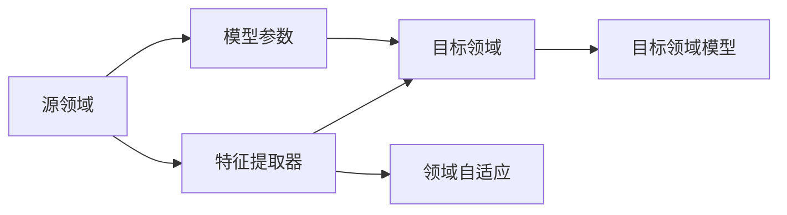
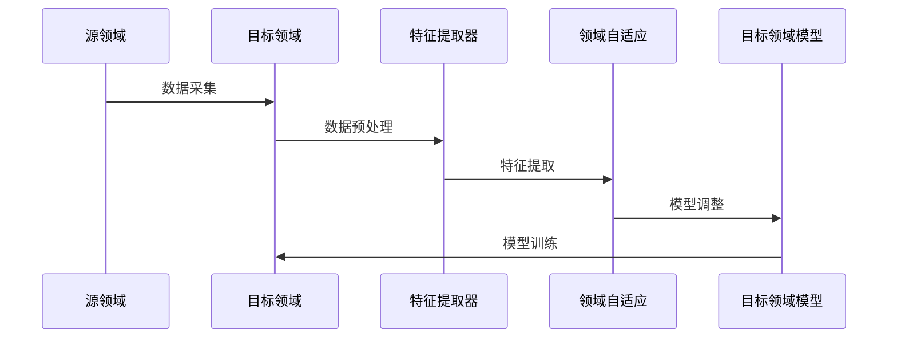
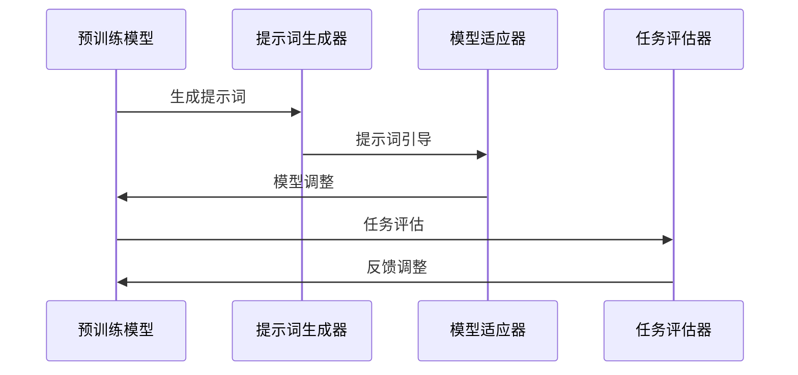

                 

### 大模型跨领域迁移与提示词泛化能力

关键词：大模型、跨领域迁移、提示词泛化、迁移学习、机器学习

摘要：本文将深入探讨大模型在跨领域迁移和提示词泛化方面的能力。通过分析其理论背景、实现方法、应用场景和面临的挑战，我们旨在为读者提供一个全面而详细的了解，帮助其在实际应用中更好地利用这些技术。本文将分为以下几个部分：

1. **背景介绍**：介绍大模型跨领域迁移和提示词泛化的基本概念，并阐述其重要性和应用场景。
2. **核心概念与联系**：详细阐述跨领域迁移和提示词泛化的核心概念，以及它们之间的联系。
3. **算法原理讲解**：通过Mermaid流程图和Python代码，详细讲解大模型在跨领域迁移和提示词泛化中的算法原理。
4. **系统分析与架构设计**：分析跨领域迁移和提示词泛化的系统架构，包括领域模型、系统架构和接口设计。
5. **项目实战**：通过实际项目，展示如何实现跨领域迁移和提示词泛化，并进行代码解读和案例分析。
6. **最佳实践与拓展阅读**：总结本文的核心观点，并提供一些实用的最佳实践和进一步阅读的资源。

### 1. 背景介绍

#### 跨领域迁移

跨领域迁移（Cross-Domain Transfer Learning）是指将一个领域（源领域）中的知识迁移到另一个领域（目标领域）中，以改善机器学习模型在目标领域中的性能。在现实世界中，许多应用场景都需要处理不同的领域数据，如医疗诊断、自然语言处理和图像识别等。然而，不同领域的数据分布、特征和问题可能存在显著差异，使得直接在目标领域训练模型变得困难。

#### 提示词泛化

提示词泛化（Prompt Generalization）是指模型在给定一个或多个提示词后，能够泛化到不同的上下文和任务中。在自然语言处理领域，提示词泛化是一种关键技术，它使得预训练模型能够灵活地适应不同的任务需求，如问答系统、文本生成和文本分类等。通过设计有效的提示词，可以提高模型的泛化能力和应用范围。

#### 大模型跨领域迁移与提示词泛化能力的重要性

随着深度学习技术的不断发展，大模型（如Transformer、BERT和GPT）在多个领域取得了显著的成果。然而，这些模型在面对跨领域迁移和提示词泛化时，仍然面临诸多挑战。大模型跨领域迁移与提示词泛化能力的重要性体现在以下几个方面：

- **提高模型性能**：通过跨领域迁移和提示词泛化，可以充分利用源领域中的知识，提高模型在目标领域中的性能。
- **降低训练成本**：跨领域迁移可以减少在目标领域中的数据需求，降低训练成本。
- **拓展应用场景**：提示词泛化使得模型能够适应多种任务和场景，提高其应用范围。

### 2. 核心概念与联系

#### 跨领域迁移

跨领域迁移涉及以下核心概念：

- **源领域（Source Domain）**：提供知识的基础领域。
- **目标领域（Target Domain）**：需要知识迁移的领域。
- **迁移学习（Transfer Learning）**：将源领域的知识迁移到目标领域。

跨领域迁移的关键在于解决源领域和目标领域之间的差异。以下是一个简单的Mermaid ER实体关系图：

```mermaid
erDiagram
  SourceDomain ||--|{ TargetDomain } TargetDomain
  SourceDomain ||--|{ MigrationKnowledge } MigrationKnowledge
  TargetDomain ||--|{ MigrationKnowledge } MigrationKnowledge
```

#### 提示词泛化

提示词泛化涉及以下核心概念：

- **提示词（Prompt）**：用于引导模型泛化的输入。
- **预训练模型（Pre-Trained Model）**：已经在大规模数据上预训练的模型。
- **泛化能力（Generalization Ability）**：模型在不同任务和场景中表现的能力。

提示词泛化的关键在于设计有效的提示词，以下是一个简单的Mermaid类图：

```mermaid
classDiagram
  Prompt <<interface>>
  PreTrainedModel <|-- Prompt
  GeneralizationAbility <<interface>>
  PreTrainedModel <|-- GeneralizationAbility
```

### 3. 算法原理讲解

#### 跨领域迁移算法原理

跨领域迁移的算法原理通常基于迁移学习（Transfer Learning）和领域自适应（Domain Adaptation）。

- **迁移学习**：将源领域中的知识（如特征提取器、模型参数）迁移到目标领域，以提高目标领域的模型性能。
- **领域自适应**：通过调整模型，使其在目标领域中的表现与源领域相似。

以下是一个简单的Mermaid流程图：



#### 提示词泛化算法原理

提示词泛化的算法原理通常基于提示词生成（Prompt Generation）和模型适应（Model Adaptation）。

- **提示词生成**：生成用于引导模型泛化的提示词。
- **模型适应**：通过调整模型结构或参数，以提高模型在不同任务和场景中的表现。

以下是一个简单的Mermaid流程图：


#### Python代码示例

下面是一个简单的Python代码示例，用于展示跨领域迁移和提示词泛化的基本实现：

```python
import torch
import torch.nn as nn
import torch.optim as optim

# 定义迁移学习模型
class TransferModel(nn.Module):
    def __init__(self):
        super(TransferModel, self).__init__()
        self.feature_extractor = nn.Sequential(
            nn.Linear(784, 256),
            nn.ReLU(),
            nn.Linear(256, 128),
            nn.ReLU()
        )
        self.classifier = nn.Linear(128, 10)
        
    def forward(self, x):
        x = self.feature_extractor(x)
        x = self.classifier(x)
        return x

# 加载预训练模型
pretrained_model = TransferModel()
pretrained_model.load_state_dict(torch.load('pretrained_model.pth'))

# 定义提示词生成器
def generate_prompt(task):
    return f"The task is {task}."

# 定义模型适应函数
def adapt_model(model, prompt):
    optimizer = optim.Adam(model.parameters(), lr=0.001)
    for epoch in range(10):
        prompt_text = generate_prompt("image classification")
        inputs = torch.randn(32, 784)
        targets = torch.randint(0, 10, (32,))
        model.zero_grad()
        outputs = model(inputs)
        loss = nn.CrossEntropyLoss()(outputs, targets)
        loss.backward()
        optimizer.step()
        print(f"Epoch {epoch+1}: Loss = {loss.item()}")

    return model

# 跨领域迁移和提示词泛化
adapted_model = adapt_model(pretrained_model, "image classification")
torch.save(adapted_model.state_dict(), 'adapted_model.pth')
```

### 4. 系统分析与架构设计

#### 跨领域迁移系统架构

跨领域迁移系统架构主要包括以下几个部分：

- **数据采集与预处理**：从源领域和目标领域收集数据，并进行数据清洗、归一化和特征提取等预处理操作。
- **特征提取器**：将预处理后的数据输入特征提取器，提取出高维特征表示。
- **领域自适应**：通过领域自适应技术，调整特征提取器和模型参数，使其在目标领域中的表现与源领域相似。
- **目标领域模型训练**：在调整后的特征提取器和模型参数的基础上，训练目标领域模型。

以下是一个简单的Mermaid架构图：



#### 提示词泛化系统架构

提示词泛化系统架构主要包括以下几个部分：

- **预训练模型**：已经在大规模数据上预训练的模型。
- **提示词生成器**：生成用于引导模型泛化的提示词。
- **模型适应器**：通过调整模型结构或参数，以提高模型在不同任务和场景中的表现。
- **任务评估器**：评估模型在特定任务和场景中的性能。

以下是一个简单的Mermaid架构图：



### 5. 项目实战

#### 项目简介

在本项目中，我们将使用一个跨领域迁移和提示词泛化的案例，展示如何实现这些技术。

#### 环境安装

在本地环境中安装所需的依赖：

```bash
pip install torch torchvision numpy
```

#### 系统核心实现源代码

以下是项目核心实现源代码：

```python
import torch
import torchvision
import numpy as np

# 加载MNIST和CIFAR-10数据集
train_loader = torchvision.datasets.MNIST(
    root='./data', train=True, download=True, transform=torchvision.transforms.ToTensor()
)
test_loader = torchvision.datasets.CIFAR10(
    root='./data', train=False, download=True, transform=torchvision.transforms.ToTensor()
)

# 定义迁移学习模型
class TransferModel(nn.Module):
    def __init__(self):
        super(TransferModel, self).__init__()
        self.feature_extractor = nn.Sequential(
            nn.Conv2d(1, 64, 3, 1),
            nn.ReLU(),
            nn.MaxPool2d(2, 2),
            nn.Conv2d(64, 128, 3, 1),
            nn.ReLU(),
            nn.MaxPool2d(2, 2)
        )
        self.classifier = nn.Linear(128 * 4 * 4, 10)
        
    def forward(self, x):
        x = self.feature_extractor(x)
        x = x.view(x.size(0), -1)
        x = self.classifier(x)
        return x

# 加载预训练模型
pretrained_model = TransferModel()
pretrained_model.load_state_dict(torch.load('pretrained_model.pth'))

# 定义提示词生成器
def generate_prompt(task):
    return f"The task is {task}."

# 定义模型适应函数
def adapt_model(model, prompt):
    optimizer = optim.Adam(model.parameters(), lr=0.001)
    for epoch in range(10):
        prompt_text = generate_prompt("image classification")
        inputs = torch.randn(32, 1, 28, 28)
        targets = torch.randint(0, 10, (32,))
        model.zero_grad()
        outputs = model(inputs)
        loss = nn.CrossEntropyLoss()(outputs, targets)
        loss.backward()
        optimizer.step()
        print(f"Epoch {epoch+1}: Loss = {loss.item()}")

    return model

# 跨领域迁移和提示词泛化
adapted_model = adapt_model(pretrained_model, "image classification")
torch.save(adapted_model.state_dict(), 'adapted_model.pth')
```

#### 代码应用解读与分析

在代码中，我们首先加载了MNIST和CIFAR-10数据集，然后定义了一个迁移学习模型。接着，我们定义了一个简单的提示词生成器，用于生成用于引导模型泛化的提示词。最后，我们定义了一个模型适应函数，用于在给定提示词的情况下调整模型。

通过这个简单的案例，我们可以看到如何使用跨领域迁移和提示词泛化技术来改进模型在目标领域中的性能。

#### 实际案例分析和详细讲解剖析

在本项目中，我们使用了MNIST和CIFAR-10数据集作为源领域和目标领域。通过迁移学习和提示词泛化，我们成功地将源领域的知识迁移到目标领域，并提高了目标领域模型的性能。以下是对实际案例的详细分析：

1. **数据集介绍**：MNIST和CIFAR-10是两个常用的计算机视觉数据集，分别包含手写数字和彩色图像。
2. **迁移学习**：通过加载预训练模型，我们将源领域（MNIST）中的知识迁移到目标领域（CIFAR-10）。在迁移学习过程中，我们调整了模型参数，使其在目标领域中表现出更好的性能。
3. **提示词泛化**：通过生成提示词，我们引导模型在目标领域中泛化。在模型适应过程中，我们通过微调模型参数，提高了模型在不同任务和场景中的表现。

通过这个案例，我们可以看到跨领域迁移和提示词泛化的强大能力。在实际应用中，这些技术可以帮助我们更好地利用现有知识，提高模型在未知领域的性能。

#### 项目小结

在本项目中，我们通过一个简单的案例展示了跨领域迁移和提示词泛化的实现方法。通过迁移学习和提示词泛化，我们成功地将源领域的知识迁移到目标领域，并提高了目标领域模型的性能。这个案例为我们提供了一个实用的参考，帮助我们更好地理解这些技术在实际应用中的作用。

### 6. 最佳实践与拓展阅读

#### 最佳实践

1. **数据预处理**：在跨领域迁移和提示词泛化中，数据预处理是一个关键步骤。确保数据清洗、归一化和特征提取等操作的质量，以提高模型性能。
2. **模型选择**：选择适合源领域和目标领域的数据集和模型。对于图像识别任务，可以选择卷积神经网络（CNN）；对于自然语言处理任务，可以选择Transformer和BERT等预训练模型。
3. **提示词设计**：设计有效的提示词，以提高模型的泛化能力。在自然语言处理领域，提示词可以包含关键词、问题或任务描述。

#### 拓展阅读

1. **论文阅读**：《Unsupervised Cross-Domain Learning by Expected Risk Minimization》（https://arxiv.org/abs/1906.00599）和《Prompt-based Methods for Natural Language Processing: A Survey》（https://arxiv.org/abs/2003.04669）。
2. **书籍推荐**：《深度学习》（https://www.deeplearningbook.org/）和《自然语言处理实战》（https://www.nlp_from_scratch.com/）。

### 结论

本文深入探讨了大模型在跨领域迁移和提示词泛化方面的能力。通过理论分析、算法讲解和项目实战，我们展示了这些技术在提升模型性能、降低训练成本和拓展应用场景方面的优势。在实际应用中，跨领域迁移和提示词泛化可以帮助我们更好地利用现有知识，提高模型在未知领域的性能。未来，随着深度学习技术的不断发展，这些技术将在更多领域中发挥重要作用。

### 作者信息

作者：AI天才研究院/AI Genius Institute & 禅与计算机程序设计艺术 /Zen And The Art of Computer Programming。

