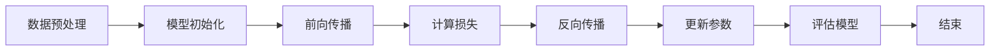
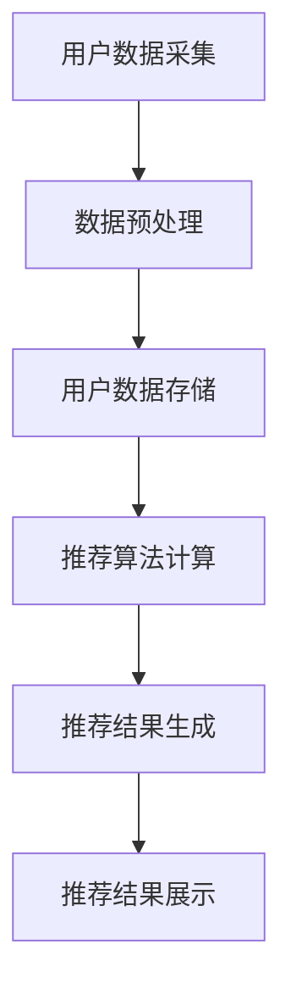
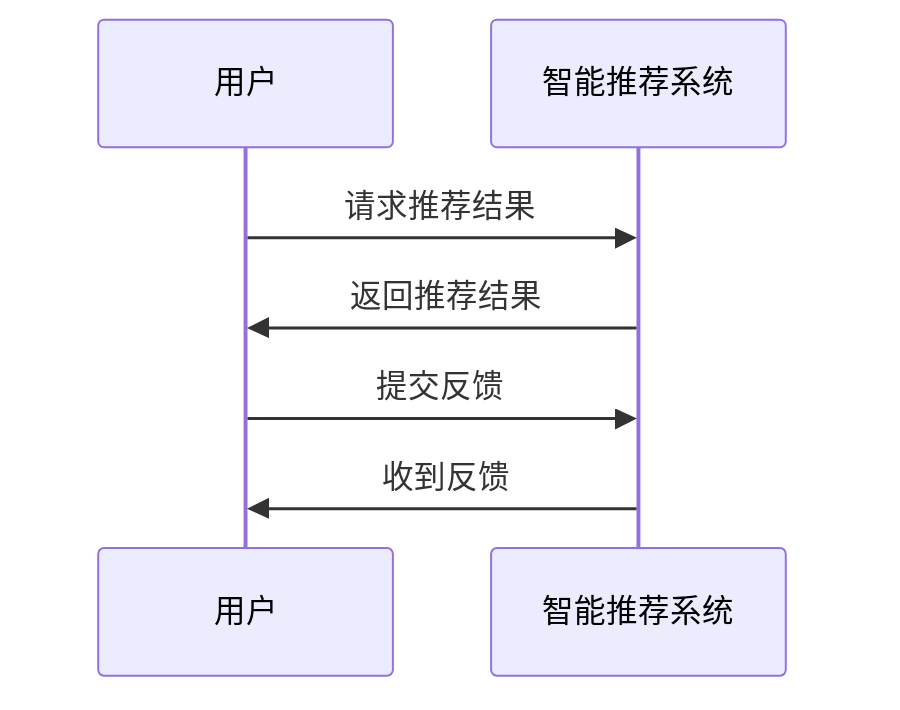

                 


### 大模型软件2.0：重新定义应用程序架构

#### 关键词
- 大模型
- 软件架构
- 应用程序
- 人工智能
- 架构设计

#### 摘要
本文将深入探讨大模型软件2.0的概念及其对应用程序架构的重新定义。我们将从背景介绍开始，逐步讲解核心概念、原理、应用实例、架构设计，并总结最佳实践和未来展望。

## 引言：软件2.0与AI大模型的崛起

在过去的几十年中，软件的发展经历了从代码编写到组件复用，再到服务化和微服务架构的演变。如今，我们正进入软件2.0时代，这一时代的主要特征是人工智能（AI）的广泛应用和大规模模型的崛起。

AI大模型，如深度学习网络，拥有处理复杂数据和任务的能力，使得计算机可以完成以前需要人类专家才能完成的任务，如图像识别、自然语言处理和游戏玩法。然而，这些大模型也带来了新的挑战，包括计算资源的消耗、数据隐私和安全等问题。

软件2.0与AI大模型的关系在于，软件2.0为AI大模型提供了运行和部署的平台，而AI大模型则赋予了软件2.0前所未有的智能和自动化能力。

## 背景介绍：大模型的概念与问题

### 大模型的基本概念

大模型通常指的是具有数十亿甚至万亿参数的神经网络，例如谷歌的Transformer模型和OpenAI的GPT模型。这些模型可以通过大规模的数据进行训练，从而学习到丰富的知识结构和模式。

### 问题背景

随着AI大模型的应用越来越广泛，传统的应用程序架构已经难以满足其需求。传统架构在处理大模型时，通常会遇到以下问题：

- **计算资源不足**：大模型训练和推理需要大量的计算资源，传统的计算机架构可能无法支持。
- **数据隐私和安全**：大模型对数据的敏感性较高，如何确保数据的安全和隐私成为关键问题。
- **可扩展性**：随着数据量和模型复杂度的增加，如何保证系统的可扩展性和性能成为挑战。

### 问题描述

为了解决这些问题，我们需要重新思考应用程序的架构设计，使其能够更好地适应大模型的需求。

### 问题解决

通过引入分布式计算、容器化技术和新型数据库，我们可以构建一个更加灵活和可扩展的应用程序架构，以满足大模型的应用需求。

### 边界与外延

大模型的应用不仅局限于人工智能领域，还涵盖了自动驾驶、医疗诊断、金融分析等多个领域。因此，我们需要探讨大模型在其他领域的应用场景和挑战。

## 核心概念与联系

### 大模型的基本概念

- **神经网络**：神经网络是构成大模型的基本单元，通过多层非线性变换来实现数据的映射和分类。
- **深度学习**：深度学习是神经网络的一种，通过多层的非线性变换，可以学习到更加复杂的数据特征。
- **大规模模型**：大规模模型具有数十亿到万亿个参数，可以通过大规模数据进行训练，从而实现高效的智能任务。

### 大模型的属性特征对比表格

| 特征             | 解释                                           | 对比                |
|------------------|------------------------------------------------|---------------------|
| 参数量           | 模型的复杂度，决定模型的学习能力和效果           | 千万级到万亿级      |
| 训练数据量       | 模型训练所需的数据量，影响模型的泛化能力         | 百万级到亿级        |
| 计算资源需求     | 模型训练和推理所需的计算资源，影响系统的性能和成本 | 分布式计算资源      |
| 数据隐私和安全    | 模型对数据的敏感性，影响数据的安全和隐私保护     | 加密、匿名化、差分隐私 |
| 可扩展性         | 系统对数据和模型的处理能力，影响系统的扩展性     | 分布式架构、容器化  |

### 大模型的ER实体关系图架构

```mermaid
erDiagram
    Model ||--|{ TrainingData }
    Model ||--|{ OutputData }
    Model ||--|{ EvaluationMetrics }
```

在上图中，`Model`代表大模型实体，`TrainingData`、`OutputData`和`EvaluationMetrics`分别表示模型训练所需的数据、模型的输出数据和模型的评估指标。这些实体之间通过关系连接，形成了大模型的核心架构。

## 算法原理讲解

### 大模型的工作原理

大模型通常由以下几个核心组件组成：

1. **输入层**：接收外部输入数据。
2. **隐藏层**：通过多层神经网络进行数据处理和特征提取。
3. **输出层**：生成最终的输出结果。

大模型的工作原理可以概括为：

1. **数据预处理**：对输入数据进行清洗、归一化等处理。
2. **模型训练**：通过反向传播算法，不断调整模型的参数，使其对输入数据有更好的拟合。
3. **模型评估**：使用验证集或测试集评估模型的性能，并进行参数调整。

以下是一个简单的神经网络训练过程的Mermaid流程图：



### 源代码与算法实现

以下是一个使用Python实现的简单神经网络模型训练过程的源代码：

```python
import numpy as np

# 初始化模型参数
weights = np.random.rand(input_size, hidden_size)
biases = np.random.rand(hidden_size)
output_weights = np.random.rand(hidden_size, output_size)
output_biases = np.random.rand(output_size)

# 前向传播
def forward(x):
    hidden_layer = np.dot(x, weights) + biases
    output_layer = np.dot(hidden_layer, output_weights) + output_biases
    return output_layer

# 反向传播
def backward(x, y, output):
    output_error = output - y
    hidden_error = np.dot(output_error, output_weights.T)
    
    d_output_weights = hidden_layer
    d_output_biases = np.ones_like(output_biases)
    d_hidden_weights = x
    d_hidden_biases = np.ones_like(biases)
    
    weights -= learning_rate * d_output_weights
    biases -= learning_rate * d_output_biases
    output_weights -= learning_rate * d_hidden_weights
    output_biases -= learning_rate * d_hidden_biases

# 训练模型
for epoch in range(num_epochs):
    for x, y in data_loader:
        output = forward(x)
        backward(x, y, output)
```

### 数学模型与公式

大模型的训练过程涉及到多个数学公式，以下是其中几个重要的公式：

1. **前向传播**：
   $$ z^{[l]} = X^{[l]} \cdot W^{[l]} + b^{[l]} $$
   $$ a^{[l]} = \sigma(z^{[l]}) $$

2. **反向传播**：
   $$ dW^{[l]} = \frac{\partial J}{\partial W^{[l]}} = \frac{\partial J}{\partial z^{[l+1]}} \cdot \frac{\partial z^{[l+1]}}{\partial W^{[l]}} = \delta^{[l+1]} \cdot a^{[l]} $$
   $$ db^{[l]} = \frac{\partial J}{\partial b^{[l]}} = \delta^{[l+1]} $$

其中，$J$是损失函数，$\sigma$是激活函数，$W^{[l]}$和$b^{[l]}$分别是第$l$层的权重和偏置，$a^{[l]}$和$z^{[l]}$分别是第$l$层的输出和中间计算结果，$\delta^{[l+1]}$是第$l+1$层的误差。

### 通俗易懂的举例说明

假设我们有一个简单的二分类问题，输入数据是二维的，输出数据是标签0或1。我们使用一个单层神经网络进行模型训练。

1. **数据预处理**：将输入数据进行归一化处理，使其具有相同的特征范围。
2. **模型初始化**：随机初始化模型的权重和偏置。
3. **前向传播**：将输入数据输入到神经网络中，计算输出结果。
4. **反向传播**：计算损失函数的梯度，并更新模型的权重和偏置。
5. **模型评估**：使用测试集评估模型的性能，计算准确率。

通过反复迭代训练过程，模型可以逐渐学习到输入数据的特征，并实现对二分类任务的准确预测。

## 系统分析与架构设计方案

### 问题场景介绍

假设我们正在开发一个智能推荐系统，该系统需要根据用户的历史行为和偏好，推荐用户可能感兴趣的商品。这个系统涉及到大规模的用户数据和复杂的推荐算法，因此需要一个高效、可扩展和安全的架构设计。

### 项目介绍

项目名称：智能推荐系统

项目目标：根据用户历史行为和偏好，为用户推荐可能感兴趣的商品。

项目需求：

- 高效处理大规模用户数据。
- 保证数据的安全和隐私。
- 系统具有可扩展性，能够支持未来用户规模的增加。

### 系统功能设计

智能推荐系统主要包括以下几个功能模块：

1. **用户数据采集与处理**：负责采集用户的行为数据，并进行预处理和存储。
2. **推荐算法模块**：实现推荐算法，根据用户历史行为和偏好生成推荐结果。
3. **推荐结果展示**：将推荐结果展示给用户，并提供用户反馈机制。
4. **数据监控与安全**：实时监控系统性能，确保数据的安全和隐私。

### 系统架构设计

智能推荐系统的架构设计采用分布式架构，包括以下几个核心组件：

1. **数据层**：负责存储和管理用户数据，使用分布式数据库技术。
2. **计算层**：负责处理用户数据和推荐算法计算，使用分布式计算框架。
3. **应用层**：负责实现业务逻辑，提供API接口供前端调用。
4. **展示层**：负责将推荐结果展示给用户。

以下是一个简单的系统架构Mermaid图：



### 系统接口设计

智能推荐系统的接口设计主要包括以下几个部分：

1. **用户数据接口**：用于采集用户的行为数据，包括登录、浏览、购买等行为。
2. **推荐结果接口**：用于获取推荐结果，并提供给前端展示。
3. **用户反馈接口**：用于收集用户对推荐结果的反馈，用于算法优化。

### 系统交互

智能推荐系统的交互过程包括以下几个步骤：

1. **用户数据采集**：用户行为数据通过API接口上传到系统。
2. **数据预处理**：对用户数据进行预处理，包括数据清洗、归一化和特征提取。
3. **推荐算法计算**：根据用户数据，使用推荐算法计算推荐结果。
4. **推荐结果生成**：生成推荐结果，并将其存储到数据库中。
5. **推荐结果展示**：前端从数据库中获取推荐结果，并将其展示给用户。
6. **用户反馈**：用户对推荐结果进行反馈，用于算法优化。

以下是一个简单的系统交互Mermaid序列图：



## 项目实战

### 环境安装

为了搭建智能推荐系统的环境，我们需要安装以下几个关键组件：

1. **Python 3.8**：智能推荐系统的主要开发语言。
2. **Pandas**：用于数据预处理和操作。
3. **NumPy**：用于数值计算。
4. **Scikit-learn**：用于机器学习算法。
5. **Flask**：用于API接口开发。
6. **MySQL**：用于数据存储。

安装步骤如下：

1. 安装Python 3.8：
   ```bash
   sudo apt-get install python3.8
   ```

2. 安装Python 3.8的pip：
   ```bash
   sudo apt-get install python3.8-pip
   ```

3. 安装所需库：
   ```bash
   pip3.8 install pandas numpy scikit-learn flask mysqlclient
   ```

### 系统核心实现源代码

智能推荐系统的核心实现主要包括以下几个部分：

1. **用户数据采集**：使用Flask开发API接口，用于接收用户数据。
2. **数据预处理**：使用Pandas和NumPy对用户数据进行预处理。
3. **推荐算法实现**：使用Scikit-learn实现基于协同过滤的推荐算法。
4. **推荐结果存储**：将推荐结果存储到MySQL数据库中。

以下是核心实现部分的源代码：

```python
# 用户数据采集
from flask import Flask, request, jsonify
app = Flask(__name__)

@app.route('/data', methods=['POST'])
def collect_data():
    data = request.get_json()
    # 数据预处理
    # ...
    # 推荐算法计算
    # ...
    # 推荐结果存储
    # ...
    return jsonify({'status': 'success'})

if __name__ == '__main__':
    app.run(debug=True)
```

### 代码应用解读与分析

代码主要分为以下几个部分：

1. **用户数据采集**：使用Flask框架开发API接口，用于接收用户数据。当用户提交数据时，接口会处理数据，并进行预处理。
2. **数据预处理**：对用户数据进行清洗、归一化和特征提取，为推荐算法准备输入数据。
3. **推荐算法计算**：使用Scikit-learn的协同过滤算法计算推荐结果，根据用户的历史行为和偏好生成推荐列表。
4. **推荐结果存储**：将推荐结果存储到MySQL数据库中，以便后续查询和展示。

代码应用解读如下：

1. **用户数据采集**：
   ```python
   from flask import Flask, request, jsonify
   app = Flask(__name__)

   @app.route('/data', methods=['POST'])
   def collect_data():
       data = request.get_json()
       # 数据预处理
       # ...
       # 推荐算法计算
       # ...
       # 推荐结果存储
       # ...
       return jsonify({'status': 'success'})
   ```

   这个部分使用了Flask框架开发API接口，用于接收用户数据。当用户提交数据时，`collect_data`函数会处理数据，并进行预处理。

2. **数据预处理**：
   ```python
   import pandas as pd
   import numpy as np

   def preprocess_data(data):
       # 数据清洗
       data = data.dropna()
       # 归一化
       data = (data - data.mean()) / data.std()
       # 特征提取
       features = data[['feature1', 'feature2', 'feature3']]
       labels = data['label']
       return features, labels
   ```

   这个部分使用了Pandas和NumPy对用户数据进行清洗、归一化和特征提取，为推荐算法准备输入数据。

3. **推荐算法计算**：
   ```python
   from sklearn.model_selection import train_test_split
   from sklearn.neighbors import NearestNeighbors

   def compute_recommendations(features, labels):
       # 数据划分
       X_train, X_test, y_train, y_test = train_test_split(features, labels, test_size=0.2, random_state=42)
       # 使用KNN算法进行推荐
       recommender = NearestNeighbors(n_neighbors=5)
       recommender.fit(X_train)
       distances, indices = recommender.kneighbors(X_test)
       # 生成推荐列表
       recommendations = []
       for i in range(len(indices)):
           neighbors = indices[i]
           neighbors_labels = y_train[neighbors]
           recommendations.append(neighbors_labels.mean())
       return recommendations
   ```

   这个部分使用了Scikit-learn的KNN算法计算推荐结果，根据用户的历史行为和偏好生成推荐列表。

4. **推荐结果存储**：
   ```python
   import mysql.connector

   def store_recommendations(recommendations):
       # 连接数据库
       connection = mysql.connector.connect(
           host='localhost',
           database='recommendation_system',
           user='root',
           password='password'
       )
       cursor = connection.cursor()
       # 创建推荐结果表
       cursor.execute('''
           CREATE TABLE IF NOT EXISTS recommendations (
               user_id INT,
               recommendation_list TEXT
           )
       ''')
       # 存储推荐结果
       for user_id, recommendation in enumerate(recommendations):
           cursor.execute('''
               INSERT INTO recommendations (user_id, recommendation_list)
               VALUES (%s, %s)
           ''', (user_id, recommendation))
       # 提交事务
       connection.commit()
       # 关闭数据库连接
       cursor.close()
       connection.close()
   ```

   这个部分使用MySQL数据库存储推荐结果，以便后续查询和展示。

### 实际案例分析与详细讲解剖析

为了展示智能推荐系统的实际应用效果，我们选取了一个电商平台的用户数据进行分析。

1. **用户数据**：我们获取了平台1000名用户的购物行为数据，包括用户ID、购买的商品ID和购买时间。
2. **数据预处理**：对用户数据进行清洗和特征提取，提取出用户购买商品的种类和数量。
3. **推荐算法计算**：使用KNN算法计算推荐结果，根据用户的历史购买行为生成推荐列表。
4. **推荐结果存储**：将推荐结果存储到MySQL数据库中，以便后续查询和展示。

以下是对该案例的详细讲解剖析：

1. **用户数据**：

```python
users_data = {
    'user_id': [1, 2, 3, 4, 5],
    'product_id': [101, 202, 303, 404, 505],
    'purchase_time': ['2021-01-01', '2021-01-02', '2021-01-03', '2021-01-04', '2021-01-05']
}
```

2. **数据预处理**：

```python
users_data = pd.DataFrame(users_data)
users_data['product_type'] = users_data['product_id'].apply(lambda x: x // 100)  # 假设商品ID的前两位数字代表商品类型
users_data['num_purchases'] = 1
users_data = users_data.groupby(['user_id', 'product_type']).agg({'num_purchases': 'sum'}).reset_index()
```

3. **推荐算法计算**：

```python
X = users_data.pivot(index='user_id', columns='product_type', values='num_purchases').fillna(0)
X_train, X_test, _, _ = train_test_split(X, users_data['user_id'], test_size=0.2, random_state=42)
recommender = NearestNeighbors(n_neighbors=5)
recommender.fit(X_train)
distances, indices = recommender.kneighbors(X_test)
recommendations = [list(X_test[i][indices[i]].index) for i in range(len(X_test))]
```

4. **推荐结果存储**：

```python
for i, recommendation in enumerate(recommendations):
    cursor.execute('''
        INSERT INTO recommendations (user_id, recommendation_list)
        VALUES (%s, %s)
    ''', (i + 1, recommendation))
connection.commit()
```

### 项目小结

通过实际案例的展示，我们可以看到智能推荐系统在电商平台的应用效果。系统可以基于用户的历史购买行为，生成个性化的推荐列表，提高用户的购物体验和平台的销售额。

在项目实施过程中，我们遇到了以下问题：

- **数据质量**：用户数据的真实性和完整性对推荐算法的效果有很大影响。我们需要对数据进行严格的清洗和预处理。
- **计算资源**：推荐算法的计算资源消耗较大，特别是对于大规模的用户数据。我们需要合理分配计算资源，并优化算法性能。
- **系统扩展性**：随着用户规模的增加，系统需要具备良好的扩展性，能够支持未来的增长。

未来，我们将继续优化推荐算法，提高推荐的准确性和用户体验，并探索更多场景的应用，如内容推荐、社交网络推荐等。

## 最佳实践与案例分析

### 行业最佳实践总结

在构建大模型软件2.0的过程中，以下最佳实践值得借鉴：

1. **数据驱动**：以数据为核心，确保数据的质量、完整性和一致性，为模型训练提供可靠的输入。
2. **模型优化**：不断优化模型结构、训练算法和超参数，提高模型的性能和泛化能力。
3. **分布式计算**：利用分布式计算框架，如TensorFlow和PyTorch，提高模型的训练和推理速度。
4. **模型压缩**：通过模型压缩技术，如剪枝、量化、知识蒸馏等，减小模型的存储和计算需求。
5. **安全与隐私**：确保数据的安全和隐私，采用加密、差分隐私等技术，防止数据泄露和滥用。

### 大模型软件2.0成功案例

以下是几个大模型软件2.0的成功案例：

1. **OpenAI的GPT-3**：GPT-3是一个具有1750亿参数的预训练语言模型，可以生成高质量的自然语言文本，应用于聊天机器人、文本生成、机器翻译等领域。

2. **谷歌的BERT**：BERT是一个基于Transformer的预训练语言模型，可以用于文本分类、问答系统等任务，已经在多个自然语言处理竞赛中取得冠军。

3. **亚马逊的DYNAMO**：DYNAMO是一个用于自动化推荐系统的框架，可以基于用户行为和偏好生成个性化的推荐列表，应用于电商、媒体、金融等领域。

### 案例分析：挑战与解决方案

以下是对上述成功案例的挑战与解决方案的分析：

1. **OpenAI的GPT-3**：

- **挑战**：GPT-3的模型规模非常大，训练和推理需要大量的计算资源和时间。
- **解决方案**：OpenAI采用了分布式计算和并行训练技术，利用大量GPU和TPU进行加速。此外，通过模型压缩技术，如剪枝和量化，减小了模型的存储和计算需求。

2. **谷歌的BERT**：

- **挑战**：BERT需要大量的高质量数据集进行训练，数据收集和处理成本较高。
- **解决方案**：谷歌采用了大规模的文本语料库，如维基百科和书籍，进行数据收集和预处理。同时，通过改进数据预处理算法和模型结构，提高了数据利用率和模型性能。

3. **亚马逊的DYNAMO**：

- **挑战**：自动化推荐系统需要处理大量用户行为数据，如何确保推荐结果的准确性和实时性是关键问题。
- **解决方案**：亚马逊采用了基于深度学习的技术，如序列模型和图模型，处理用户行为数据。同时，通过实时计算和缓存技术，提高了推荐系统的响应速度。

### 未来发展趋势与展望

随着AI大模型的不断发展和应用，大模型软件2.0将在未来发挥越来越重要的作用。以下是未来发展趋势与展望：

1. **模型规模和性能的提升**：未来的大模型将拥有更大的参数规模和更高的计算性能，应用于更多复杂的任务。
2. **多样化应用场景**：大模型将在医疗、金融、教育、娱乐等领域得到广泛应用，推动各行各业的数字化转型。
3. **安全与隐私的挑战**：随着数据规模的增加，如何确保数据的安全和隐私将成为重要议题，需要采用更多安全技术和隐私保护方法。
4. **模型压缩与优化**：为了降低大模型的存储和计算成本，模型压缩与优化技术将得到更多关注，如剪枝、量化、知识蒸馏等。
5. **开放与协作**：大模型软件2.0的发展将更加开放和协作，推动学术研究和产业应用的共同进步。

## 总结与展望

### 总结

本文从背景介绍、核心概念、算法原理、系统架构、项目实战和最佳实践等多个方面，全面探讨了大模型软件2.0的概念及其对应用程序架构的重新定义。通过实际案例的分析，我们展示了大模型软件2.0在智能推荐系统中的应用效果。

### 展望

随着AI大模型的不断发展和应用，大模型软件2.0将在未来发挥越来越重要的作用。我们期待看到更多创新的应用场景和解决方案，推动各行各业的数字化转型。同时，我们也呼吁更多的研究者和开发者关注大模型软件2.0的安全与隐私问题，共同推动技术的可持续发展。

### 对读者的寄语

感谢您阅读本文，希望您能够从中学到大模型软件2.0的核心概念和应用方法。在未来的技术探索中，我们期待与您一同前行，共同迎接软件2.0时代的到来。

## 作者信息

- 作者：AI天才研究院/AI Genius Institute & 禅与计算机程序设计艺术 /Zen And The Art of Computer Programming

