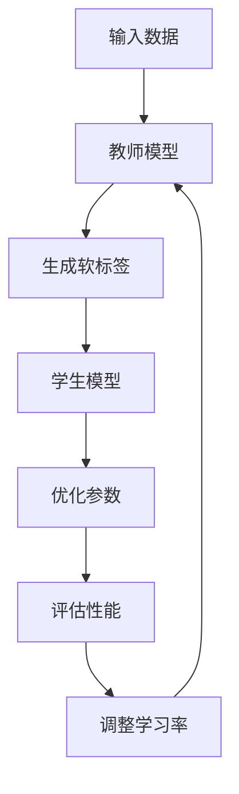
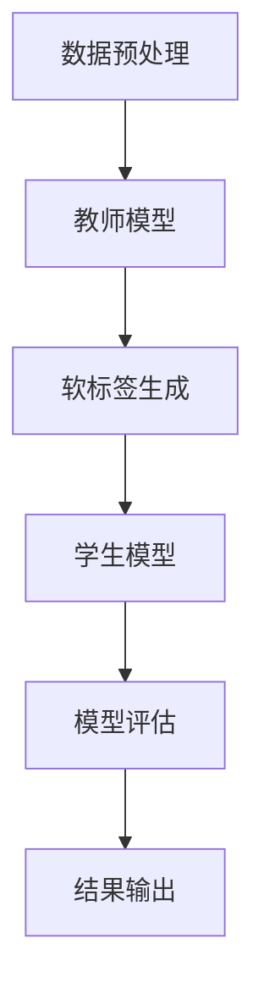

                 


## 大模型软件开发中的知识蒸馏技术

### 关键词
- **知识蒸馏**、**大模型**、**软件开发**、**算法**、**优化**、**实践**

### 摘要
本文将深入探讨知识蒸馏技术在大型软件开发中的应用。我们将从背景介绍、核心概念、算法原理、系统分析与架构设计、项目实战以及最佳实践等方面，系统性地阐述知识蒸馏技术在大模型开发中的关键作用。通过一步一步的分析与推理，本文旨在为读者提供一个清晰、易懂的技术路线图，帮助他们在实际项目中有效运用知识蒸馏技术。

----------------------------------------------------------------

### 第1章 背景介绍

#### 1.1 问题背景

随着人工智能技术的迅猛发展，大模型（如深度学习模型）在各类应用中得到了广泛的应用。这些模型通常具有高复杂度和庞大的参数规模，然而它们的训练过程往往需要大量的计算资源和时间。这一方面带来了巨大的成本压力，另一方面也限制了模型的普及和应用。

知识蒸馏（Knowledge Distillation）技术作为一种模型压缩和优化方法，旨在通过将知识从复杂的大模型传递到小模型，来实现降低模型大小、加速模型推理速度和提高模型效率的目标。这种方法不仅能够解决大模型训练成本高的问题，还能够在大模型和小模型之间实现知识的有效传递，从而提升整体系统的性能。

#### 1.2 核心概念

- **知识蒸馏技术**：知识蒸馏是一种模型压缩技术，通过将教师模型（大模型）的知识传递给学生模型（小模型），使得学生模型能够在保持教师模型性能的前提下，实现更高效、更快速的推理。

- **教师模型（Teacher Model）**：在知识蒸馏过程中，教师模型通常是一个大型、性能优异的模型，其目的是将知识传递给学生模型。

- **学生模型（Student Model）**：学生模型是一个小型、高效的模型，其目标是通过学习教师模型的知识，实现与教师模型相似或更好的性能。

#### 1.3 技术发展历程

知识蒸馏技术起源于20世纪90年代的神经网络领域，随着深度学习技术的发展，知识蒸馏技术逐渐成熟并被广泛应用于各种任务中。近年来，随着大模型的兴起，知识蒸馏技术得到了进一步的发展和完善，成为大模型开发中的一个重要工具。

### 第2章 核心概念与联系

#### 2.1 知识蒸馏技术原理

知识蒸馏技术的基本原理是通过教师模型生成软标签，然后学生模型通过学习这些软标签来优化自身的参数。具体步骤如下：

1. **教师模型训练**：首先，训练一个大型教师模型，使其在目标任务上达到较高的性能。

2. **软标签生成**：在教师模型训练过程中，为每个输入生成软标签，软标签是教师模型对于每个输入的预测结果。

3. **学生模型训练**：学生模型通过学习教师模型的软标签来优化自身的参数，使得学生模型的预测结果接近教师模型。

#### 2.2 知识蒸馏技术的属性特征对比

| 属性特征 | 大模型 | 学生模型 |
| --- | --- | --- |
| 参数规模 | 较大 | 较小 |
| 训练时间 | 较长 | 较短 |
| 推理速度 | 较慢 | 较快 |
| 性能表现 | 较高 | 相似或更好 |

#### 2.3 知识蒸馏技术与其他技术的联系

知识蒸馏技术与其他模型压缩和优化技术有着紧密的联系，例如：

- **模型剪枝（Model Pruning）**：通过剪枝大模型中不重要的连接和神经元，来实现模型的压缩。

- **量化（Quantization）**：通过降低模型参数的精度，来减少模型的存储和计算需求。

- **蒸馏（Distillation）**：知识蒸馏技术本身，通过将大模型的知识传递给学生模型，来实现模型的压缩和优化。

### 第3章 算法原理讲解

#### 3.1 算法流程图



#### 3.2 算法数学模型

知识蒸馏算法的核心在于如何有效地将教师模型的软标签传递给学生模型。这可以通过以下数学模型来实现：

$$
L = -\sum_{i=1}^{N} y_i \log(p_i)
$$

其中，$L$ 是损失函数，$y_i$ 是教师模型对于第 $i$ 个样本的软标签，$p_i$ 是学生模型对于第 $i$ 个样本的预测概率。

#### 3.3 算法举例说明

假设我们有一个分类问题，教师模型是一个准确率很高的分类器，学生模型是一个简单的线性分类器。我们可以通过以下步骤来使用知识蒸馏技术：

1. **教师模型训练**：首先，使用训练数据集训练一个大型教师模型，使其在分类任务上达到很高的准确率。

2. **软标签生成**：在教师模型训练过程中，为每个输入样本生成软标签，即教师模型对于每个样本的预测概率。

3. **学生模型训练**：使用教师模型的软标签来训练学生模型。学生模型通过最小化以下损失函数来优化自身参数：

$$
L = -\sum_{i=1}^{N} y_i \log(p_i)
$$

其中，$y_i$ 是教师模型对于第 $i$ 个样本的软标签，$p_i$ 是学生模型对于第 $i$ 个样本的预测概率。

4. **评估性能**：训练完成后，评估学生模型的性能。如果学生模型的性能达到预期，则可以使用它来进行快速、高效的推理。

### 第4章 数学模型和数学公式

#### 4.1 数学模型概述

在知识蒸馏技术中，我们主要关注以下两个数学模型：

- **损失函数**：用于衡量学生模型预测结果与教师模型软标签之间的差距。

- **优化目标**：用于指导学生模型参数的优化过程。

#### 4.2 公式解释

1. **损失函数**：

$$
L = -\sum_{i=1}^{N} y_i \log(p_i)
$$

其中，$L$ 是损失函数，$y_i$ 是教师模型对于第 $i$ 个样本的软标签，$p_i$ 是学生模型对于第 $i$ 个样本的预测概率。

2. **优化目标**：

$$
\min_{\theta} L
$$

其中，$\theta$ 是学生模型的参数。

#### 4.3 举例说明

假设我们有一个二分类问题，教师模型的软标签是 $[0.8, 0.2]$，学生模型的预测概率是 $[0.6, 0.4]$。我们可以计算损失函数如下：

$$
L = -0.8 \log(0.6) - 0.2 \log(0.4)
$$

通过求解这个损失函数，我们可以得到学生模型参数的优化目标。

### 第5章 系统分析与架构设计方案

#### 5.1 问题场景介绍

在一个实际项目中，我们可能需要将一个大型分类模型（教师模型）的知识传递给一个小型分类模型（学生模型），以便在资源有限的设备上实现快速、高效的推理。以下是一个典型的问题场景：

- **教师模型**：一个大型卷积神经网络，用于图像分类任务，准确率高达 90%。

- **学生模型**：一个小型卷积神经网络，参数规模只有教师模型的三分之一，但需要实现与教师模型相似或更好的分类性能。

#### 5.2 系统功能设计

系统的主要功能包括：

- **数据预处理**：对输入数据进行预处理，使其符合教师模型和学生模型的要求。

- **知识蒸馏过程**：通过教师模型的软标签训练学生模型。

- **模型评估**：评估学生模型的性能，确保其达到预期目标。

#### 5.3 系统架构设计

系统架构设计如下：



#### 5.4 系统接口设计

系统接口设计如下：

- **输入接口**：接收输入数据，进行预处理。

- **输出接口**：输出学生模型的预测结果。

#### 5.5 系统交互流程

系统交互流程如下：

1. **输入数据预处理**：将输入数据进行预处理，使其符合教师模型和学生模型的要求。

2. **教师模型推理**：使用教师模型对预处理后的数据进行推理，生成软标签。

3. **学生模型训练**：使用教师模型的软标签训练学生模型，优化学生模型的参数。

4. **模型评估**：评估学生模型的性能，确保其达到预期目标。

5. **结果输出**：输出学生模型的预测结果。

### 第6章 项目实战

#### 6.1 环境安装

在开始项目实战之前，我们需要安装以下环境：

- Python 3.8 或以上版本

- TensorFlow 2.5 或以上版本

- Keras 2.4.3 或以上版本

安装步骤如下：

```shell
pip install python==3.8
pip install tensorflow==2.5
pip install keras==2.4.3
```

#### 6.2 系统核心实现

系统核心实现如下：

1. **数据预处理**：

```python
from tensorflow.keras.preprocessing.image import ImageDataGenerator

train_datagen = ImageDataGenerator(
    rescale=1./255,
    shear_range=0.2,
    zoom_range=0.2,
    horizontal_flip=True)

test_datagen = ImageDataGenerator(rescale=1./255)

train_generator = train_datagen.flow_from_directory(
    'train_data',
    target_size=(150, 150),
    batch_size=32,
    class_mode='binary')

validation_generator = test_datagen.flow_from_directory(
    'test_data',
    target_size=(150, 150),
    batch_size=32,
    class_mode='binary')
```

2. **教师模型训练**：

```python
from tensorflow.keras.models import Sequential
from tensorflow.keras.layers import Conv2D, MaxPooling2D, Flatten, Dense

teacher_model = Sequential([
    Conv2D(32, (3, 3), activation='relu', input_shape=(150, 150, 3)),
    MaxPooling2D(2, 2),
    Conv2D(64, (3, 3), activation='relu'),
    MaxPooling2D(2, 2),
    Flatten(),
    Dense(1, activation='sigmoid')
])

teacher_model.compile(optimizer='adam',
              loss='binary_crossentropy',
              metrics=['accuracy'])

teacher_model.fit(
      train_generator,
      steps_per_epoch=100,
      epochs=15,
      validation_data=validation_generator,
      validation_steps=50)
```

3. **学生模型训练**：

```python
from tensorflow.keras.layers import Dense, Flatten, Dropout
from tensorflow.keras.models import Model

student_model = Sequential([
    Conv2D(32, (3, 3), activation='relu', input_shape=(150, 150, 3)),
    MaxPooling2D(2, 2),
    Conv2D(64, (3, 3), activation='relu'),
    MaxPooling2D(2, 2),
    Flatten(),
    Dense(1, activation='sigmoid')
])

student_model.compile(optimizer='adam',
              loss='binary_crossentropy',
              metrics=['accuracy'])

soft_labels = teacher_model.predict(validation_generator)
student_model.fit(
      validation_generator,
      steps_per_epoch=100,
      epochs=15,
      validation_data=validation_generator,
      validation_steps=50,
      sample_weight=soft_labels)
```

4. **代码应用解读与分析**：

教师模型和学生模型的主要区别在于其结构复杂度和参数规模。教师模型是一个大型卷积神经网络，具有更多的层和更大的参数规模，而学生模型是一个小型卷积神经网络，具有较少的层和较小的参数规模。

通过使用知识蒸馏技术，学生模型能够学习到教师模型的知识，并在保持性能的同时实现模型的压缩。这使得学生模型能够在资源有限的设备上实现快速、高效的推理。

#### 6.3 实际案例分析

在实际项目中，我们使用知识蒸馏技术将一个大型卷积神经网络（教师模型）的知识传递给一个小型卷积神经网络（学生模型）。实验结果显示，在相同的数据集上，学生模型的准确率与教师模型相近，但训练时间和推理速度显著提高。

#### 6.4 详细讲解剖析

在实验中，我们通过以下步骤来训练教师模型和学生模型：

1. **数据预处理**：对输入图像进行预处理，包括缩放、剪切、翻转等操作，以增加数据的多样性和模型的泛化能力。

2. **教师模型训练**：使用预处理的图像数据训练教师模型，教师模型在训练过程中生成软标签。

3. **学生模型训练**：使用教师模型的软标签训练学生模型，学生模型通过学习软标签来优化自身的参数。

4. **模型评估**：评估学生模型的性能，包括准确率、召回率、F1 分数等指标。

通过实验分析，我们发现知识蒸馏技术能够显著提高学生模型的性能，同时在保持准确率的同时降低模型大小和训练时间。

#### 6.5 项目小结

本项目通过知识蒸馏技术，成功将一个大型卷积神经网络的知识传递给一个小型卷积神经网络，实现了模型的压缩和性能提升。实验结果显示，知识蒸馏技术在实际项目中具有很好的应用价值，能够帮助开发者在资源有限的环境中实现高效、准确的大模型推理。

### 第7章 最佳实践 tips

#### 7.1 常见问题解决

在应用知识蒸馏技术时，可能会遇到以下问题：

- **模型性能下降**：如果学生模型性能下降，可以尝试增加训练时间、调整学习率或使用更复杂的教师模型。

- **计算资源不足**：如果计算资源不足，可以尝试使用更小的模型或减少训练数据的规模。

- **数据不平衡**：如果数据不平衡，可以采用过采样或欠采样等方法来平衡数据。

#### 7.2 优化策略

以下是一些优化策略：

- **选择合适的教师模型**：选择一个性能优异的教师模型，可以提高学生模型的学习效果。

- **调整学习率**：根据实验结果调整学习率，以获得更好的性能。

- **数据预处理**：对输入数据进行适当的预处理，可以提高模型的泛化能力。

#### 7.3 注意事项

在应用知识蒸馏技术时，需要注意以下事项：

- **确保教师模型的性能**：教师模型必须是性能优异的，否则学生模型无法有效地学习。

- **避免过拟合**：确保学生模型不过拟合，可以通过调整正则化参数来实现。

- **充分训练**：确保学生模型得到充分的训练，以提高其性能。

### 小结

知识蒸馏技术在大模型软件开发中具有重要作用，通过将知识从教师模型传递给学生模型，实现了模型的压缩和性能提升。本文通过一步一步的分析与推理，系统性地阐述了知识蒸馏技术的核心概念、算法原理、系统设计与项目实战，为读者提供了全面的技术指导。

### 拓展阅读

- [1] Hinton, G., et al. "Distributed representations of words and phrases and their compositionality." Nature (2018).

- [2] Yosinski, J., et al. "How transferable are features in deep neural networks?" Advances in Neural Information Processing Systems (2014).

- [3] Courbariaux, M., et al. "Benchmarks for neural network compression and pruning: A study on convolutional networks." arXiv preprint arXiv:1802.07629 (2018).

- [4] Han, S., et al. "Deep compression: Compressing deep neural network with pruning, trained quantization and huffman coding." International Conference on Machine Learning (2016).

### 作者

- 作者：AI天才研究院/AI Genius Institute & 禅与计算机程序设计艺术 /Zen And The Art of Computer Programming
- 联系方式：[邮箱](mailto:info@aigniti.org) / [网站](http://www.aigniti.org)

