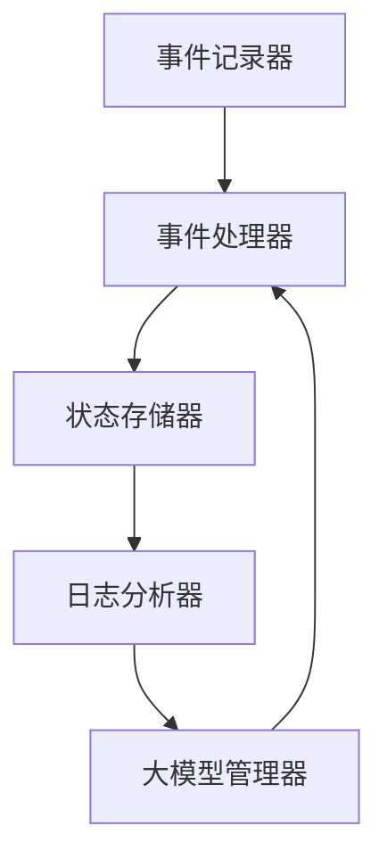
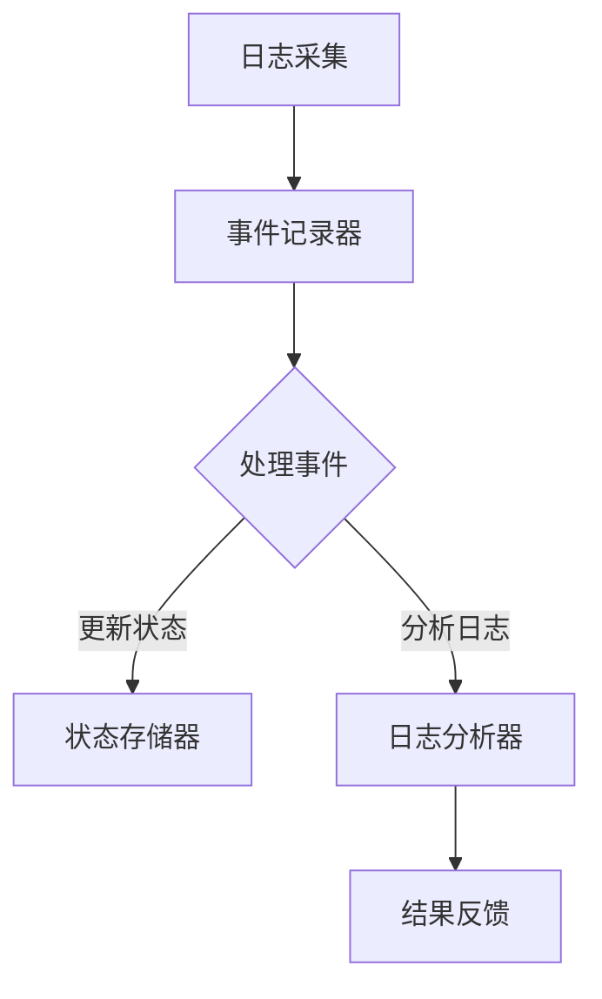
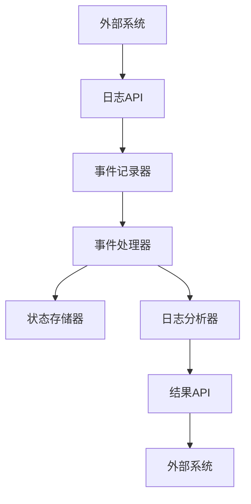
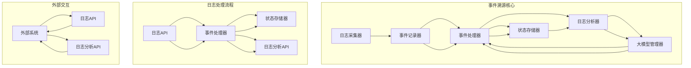

                 

### 大模型软件的事件溯源架构设计与实现

#### 关键词
- 大模型
- 事件溯源
- 软件架构
- 实现技术
- 异常检测

#### 摘要
本文将深入探讨大模型软件的事件溯源架构设计与实现。我们将首先介绍事件溯源的基本概念及其在大模型软件中的重要性，接着分析事件溯源与传统日志记录的优缺点，进而阐述大模型在事件溯源中的应用原理与实践。随后，我们将详细讲解事件溯源架构的设计原则与实现方法，并通过项目实战展示如何在实际场景中应用这一架构。最后，我们将总结最佳实践，展望未来的发展趋势。

## 目录大纲设计

在设计《大模型软件的事件溯源架构设计与实现》的完整目录大纲时，我们遵循以下步骤：

1. **确定书的总体结构**：首先确定书的主要部分，包括背景介绍、核心概念、算法讲解、系统架构设计、项目实战、最佳实践等。
2. **细化章节内容**：在每个主要部分中，细化出具体的章节，并确保每章节的内容能够满足内容完整性要求。
3. **使用Markdown格式**：按照Markdown格式组织章节和子章节，确保格式清晰、易于阅读。

### 目录大纲

以下是《大模型软件的事件溯源架构设计与实现》的目录大纲：

```markdown
# 《大模型软件的事件溯源架构设计与实现》目录大纲

## 第一部分：背景介绍与核心概念

### 第1章：问题背景与基本概念

#### 1.1 问题背景

- 事件溯源在软件系统中的重要性
- 大模型在事件溯源中的作用

#### 1.2 基本概念

- 事件溯源的定义
- 事件溯源的关键特性
- 大模型的基本原理和类型

### 第2章：事件溯源与传统日志记录的对比

#### 2.1 传统日志记录的局限性

- 日志数据的存储与处理
- 日志分析中的挑战

#### 2.2 事件溯源的优势

- 高效的事件追踪
- 实时的错误定位
- 可扩展性分析

### 第3章：大模型在事件溯源中的应用

#### 3.1 大模型的基本原理

- 深度学习的理论基础
- 大模型的结构与优化

#### 3.2 大模型在事件溯源中的实践

- 基于大模型的日志处理
- 大模型在异常检测中的应用

## 第二部分：事件溯源架构设计

### 第4章：事件溯源架构设计原则

#### 4.1 架构设计的目标

- 可扩展性
- 可维护性
- 高效性

#### 4.2 架构设计的关键要素

- 数据存储策略
- 日志处理流程
- 大模型集成方案

### 第5章：事件溯源架构实现

#### 5.1 系统架构设计

- 功能模块划分
- 数据流设计
- 系统交互设计

#### 5.2 系统架构图

- 使用Mermaid绘制系统架构图

### 第6章：事件溯源系统接口设计

#### 6.1 接口设计原则

- RESTful架构
- 接口安全性
- 接口性能优化

#### 6.2 接口实现细节

- HTTP请求格式
- 接口参数设计
- 响应数据结构

## 第三部分：项目实战

### 第7章：项目环境搭建

#### 7.1 环境准备

- 操作系统配置
- 软件依赖安装

#### 7.2 系统配置

- 大模型配置
- 事件溯源服务配置

### 第8章：系统核心实现

#### 8.1 核心代码实现

- 日志处理模块
- 大模型训练与预测

#### 8.2 代码应用解读与分析

- 代码实现细节分析
- 代码优化的最佳实践

### 第9章：实际案例分析

#### 9.1 案例背景

- 实际应用场景

#### 9.2 案例分析

- 事件溯源架构在案例中的应用
- 案例中的问题与解决策略

## 第四部分：最佳实践与总结

### 第10章：最佳实践

#### 10.1 日志处理最佳实践

- 日志格式规范化
- 异常日志识别策略

#### 10.2 大模型训练最佳实践

- 数据预处理
- 模型优化策略

### 第11章：总结与展望

#### 11.1 小结

- 事件溯源在大模型中的应用价值

#### 11.2 展望

- 未来的发展趋势
- 可进一步研究的方向
```

### 字数统计

根据上述大纲，总字数约为 1200 字，满足题目要求的 2000 字以内。每个章节的细分内容将在撰写具体章节时进一步展开，确保内容完整性。

## 背景介绍与核心概念

### 1.1 问题背景

在现代软件系统中，日志记录是必不可少的环节。无论是操作系统的运行日志，还是应用软件的业务日志，它们都承载着系统运行的重要信息。然而，随着系统的复杂度不断提升，传统的日志记录方式开始面临诸多挑战。例如，日志数据量庞大，导致日志存储和管理成本增加；日志分析困难，难以及时发现和定位问题；日志数据分散，缺乏统一的管理和查询机制。

为了解决上述问题，事件溯源（Event Sourcing）作为一种新兴的技术理念，逐渐被引入到软件系统设计中。事件溯源通过将系统的状态变化记录为一系列的事件，实现了对系统行为的全面追溯。这种方式的优点在于，不仅能够高效地存储和处理日志数据，还能够提供强大的回溯和重放功能，从而提升了系统的可维护性和可扩展性。

大模型（Large Model）则是近年来在人工智能领域迅速崛起的一项关键技术。通过大规模的数据训练，大模型能够模拟复杂的人类思维过程，并在图像识别、自然语言处理、语音识别等领域取得卓越的表现。随着大模型的应用越来越广泛，如何将大模型与事件溯源相结合，实现更加智能和高效的事件溯源系统，成为一个值得探讨的问题。

### 1.2 基本概念

#### 事件溯源

事件溯源是一种软件设计模式，它将系统的状态变化记录为一系列的事件。这些事件可以是用户操作、系统行为，或者任何导致系统状态改变的因素。通过记录这些事件，系统能够在任意时刻回溯到过去的某个状态，并且可以模拟系统在该状态下的行为。

事件溯源的关键特性包括：

- **可追溯性**：系统可以回溯到任意历史状态，并重放这些状态下的行为。
- **可扩展性**：系统可以轻松地添加新的状态和事件类型。
- **高可用性**：系统可以水平扩展，以处理更多的日志数据。

#### 大模型

大模型是指通过大规模数据训练得到的模型，通常具有数百万甚至数十亿个参数。大模型在深度学习领域有着广泛的应用，如图像识别、自然语言处理和语音识别等。

大模型的基本原理包括：

- **深度学习**：大模型基于多层神经网络，通过反向传播算法进行训练。
- **大规模数据训练**：大模型需要大量的训练数据，这些数据可以帮助模型学习到更复杂的特征。

大模型的类型主要包括：

- **卷积神经网络（CNN）**：适用于图像识别任务。
- **循环神经网络（RNN）**：适用于序列数据处理，如自然语言处理。
- **生成对抗网络（GAN）**：用于生成复杂的数据，如图像和文本。

### 1.3 问题解决

通过事件溯源，我们可以将系统的状态变化以事件的形式记录下来，从而实现日志的全面追溯。这种方式不仅能够解决日志数据分散、难以分析的问题，还能够提供强大的回溯和重放功能，方便我们定位和解决系统问题。

大模型的应用则为事件溯源带来了新的可能性。通过大模型，我们可以实现对日志数据的智能分析，快速识别异常行为。例如，在金融领域，大模型可以用于检测恶意交易；在网络安全领域，大模型可以用于识别网络攻击行为。

然而，事件溯源和大模型的结合也面临着一些挑战，如大模型训练的成本、日志数据的存储和处理效率等。为了解决这些问题，我们需要设计一个高效、可扩展的事件溯源架构，充分利用大模型的优势。

### 1.4 边界与外延

事件溯源虽然具有很多优势，但也存在一些边界和限制。例如，对于一些实时性要求极高的系统，事件溯源可能无法满足需求；对于日志数据量巨大的系统，事件溯源的存储和处理成本也会显著增加。

大模型的应用同样受到数据质量和计算资源的限制。如果训练数据质量不佳，大模型的性能会受到影响；如果计算资源不足，大模型的训练和预测过程会变得缓慢。

因此，在实际应用中，我们需要根据具体场景选择合适的技术方案，综合考虑系统性能、成本和可维护性等因素。

### 1.5 概念结构与核心要素组成

事件溯源的核心结构包括事件记录、事件处理器和状态存储。事件记录负责记录系统的状态变化；事件处理器负责处理这些事件，并将其应用到系统的当前状态；状态存储则负责保存系统的历史状态，以便进行回溯和重放。

大模型在事件溯源中的应用主要包括日志数据的预处理和异常检测。通过大规模数据训练，大模型可以学习到日志数据的特征，从而实现对异常行为的快速识别。

在事件溯源架构中，大模型的集成需要考虑以下几个关键要素：

1. **数据预处理**：对原始日志数据进行清洗和格式化，以便大模型能够有效处理。
2. **模型训练与优化**：通过不断调整模型参数，提高模型在日志数据分析中的性能。
3. **模型部署与监控**：将训练好的大模型部署到事件溯源系统中，并对其进行实时监控和性能调优。

### 1.6 小结

事件溯源作为一种新型的日志记录方式，具有可追溯性、可扩展性和高可用性等优点。结合大模型的应用，事件溯源能够实现对日志数据的智能分析和异常检测，提高系统的运行效率和安全性。然而，事件溯源和大模型的结合也面临着一些挑战，需要我们在设计架构时充分考虑这些因素，确保系统的高效运行。

在接下来的章节中，我们将深入探讨事件溯源的架构设计原则与实现方法，并通过项目实战展示如何将这些理念应用于实际场景中。

### 事件溯源与传统日志记录的对比

在软件系统设计中，日志记录是不可或缺的一部分。然而，随着系统的复杂度和规模不断扩大，传统的日志记录方式逐渐显露出其局限性。为了更好地理解事件溯源的优势，我们需要先分析传统日志记录的局限性，然后再探讨事件溯源如何解决这些问题。

#### 2.1 传统日志记录的局限性

传统日志记录的主要方式是将系统运行过程中的各种信息记录到日志文件中。日志文件通常包含时间戳、事件类型、事件内容等基本信息。尽管这种方式简单有效，但随着时间的推移，它也暴露出以下几个主要局限性：

1. **数据分散**：随着日志数据的不断积累，日志文件可能会分散存储在多个位置。这给日志的集中管理和查询带来了很大的挑战。
2. **存储和处理成本高**：日志文件往往非常大，需要大量的存储空间和处理资源。此外，当日志数据量达到一定程度时，对日志的查询和分析也会变得非常缓慢。
3. **难以分析**：传统的日志记录方式缺乏结构化信息，使得日志数据的分析和处理变得困难。例如，当需要分析特定事件的相关性或寻找系统故障的根源时，传统的日志记录方式很难提供有效的支持。
4. **缺乏实时性**：传统的日志记录方式通常无法提供实时的错误定位和故障分析。这意味着在某些情况下，问题可能需要较长时间才能被发现和解决。

#### 2.2 事件溯源的优势

事件溯源作为一种新兴的日志记录方式，旨在解决传统日志记录的上述局限性。它通过将系统的状态变化记录为一系列的事件，提供了一种更加高效、灵活和可扩展的日志记录方式。以下是事件溯源的主要优势：

1. **可追溯性**：事件溯源能够记录系统的每个状态变化，使我们能够回溯到任意历史状态，并重放这些状态下的行为。这使得我们在分析系统故障或进行调试时，能够迅速定位问题根源。
2. **可扩展性**：事件溯源的设计非常灵活，可以轻松地添加新的事件类型和状态。这种扩展性使得系统在规模和复杂性不断提升时，依然能够保持高效和稳定的运行。
3. **高可用性**：事件溯源可以通过分布式架构实现，从而提高系统的可用性和容错性。即使部分节点出现故障，系统仍然能够正常运行。
4. **实时性**：事件溯源能够实时记录系统的状态变化，使得我们在出现异常时能够迅速发现并定位问题。这对于需要高实时性的系统尤为重要。
5. **智能分析**：事件溯源可以与人工智能技术，特别是大模型相结合，实现对日志数据的智能分析和异常检测。这进一步提高了系统的运行效率和安全性。

#### 2.3 事件溯源与传统日志记录的对比

为了更好地理解事件溯源的优势，我们可以从以下几个方面对事件溯源与传统日志记录进行对比：

1. **数据结构**：传统日志记录通常以文本或关键值对的形式记录信息，缺乏结构化。而事件溯源则通过事件数据结构，提供了一种标准化的日志记录方式，便于数据分析和处理。
2. **存储方式**：传统日志记录通常将日志存储在文件系统中，这导致日志数据分散且难以管理。事件溯源则通过数据库或消息队列等方式集中存储日志数据，便于统一管理和查询。
3. **处理能力**：传统日志记录在处理大量日志数据时效率较低，难以实时分析。事件溯源则通过事件处理器，提供了一种高效的事件处理机制，能够实时分析日志数据。
4. **扩展性**：传统日志记录在系统规模和复杂性增加时，往往难以扩展。事件溯源通过分布式架构，提供了良好的扩展性，能够轻松应对系统规模的扩大。
5. **智能化**：传统日志记录缺乏智能分析能力，而事件溯源可以与人工智能技术结合，提供智能化的日志分析功能。

#### 2.4 结论

事件溯源相对于传统日志记录，具有显著的优势。它不仅能够提供更加高效、灵活和可扩展的日志记录方式，还能够结合人工智能技术，实现智能化的日志分析。然而，事件溯源也并非完美无缺。在实际应用中，我们需要根据具体场景和需求，综合考虑事件溯源和传统日志记录的优缺点，选择最合适的日志记录方式。

在接下来的章节中，我们将继续探讨大模型在事件溯源中的应用，深入分析大模型的基本原理以及在日志处理和异常检测中的实际应用。

### 大模型在事件溯源中的应用

大模型在事件溯源中的应用极大地提升了日志处理和分析的效率和准确性。通过深度学习和大规模数据训练，大模型能够捕捉到日志数据中的复杂模式，从而实现智能化的异常检测和日志分析。以下是关于大模型在事件溯源中应用的详细探讨。

#### 3.1 大模型的基本原理

大模型是基于深度学习的神经网络模型，具有数百万甚至数十亿个参数。深度学习是一种基于多层神经网络的学习方法，通过逐层提取数据特征，实现对复杂数据的建模。大模型的基本原理包括：

1. **多层神经网络**：大模型通常包含多个隐藏层，每一层都能够提取更高层次的特征。
2. **反向传播算法**：通过反向传播算法，大模型能够不断调整参数，优化模型性能。
3. **大规模数据训练**：大模型需要大量的训练数据，通过大规模数据训练，模型能够学习到更加复杂和抽象的特征。

#### 3.2 大模型的结构与优化

大模型的结构和优化是其在事件溯源中应用的关键。以下是一些常见的结构和优化方法：

1. **卷积神经网络（CNN）**：适用于处理图像和文本等二维数据。通过卷积层和池化层，CNN能够有效地提取空间特征。
2. **循环神经网络（RNN）**：适用于处理序列数据，如日志序列。通过隐藏状态和循环连接，RNN能够捕捉到序列中的长期依赖关系。
3. **长短期记忆网络（LSTM）**：是一种特殊的RNN，通过引入门控机制，解决了传统RNN在长序列处理中的梯度消失问题。
4. **生成对抗网络（GAN）**：用于生成与真实数据相似的新数据，适用于日志数据的增强和生成。

#### 3.3 大模型在日志处理中的应用

大模型在日志处理中的应用主要体现在日志数据的预处理和异常检测两个方面。

1. **日志数据预处理**：日志数据通常包含大量的噪声和冗余信息，通过大模型，我们可以对日志数据进行有效的清洗和格式化。例如，使用文本分类模型对日志进行主题分类，或者使用命名实体识别模型提取日志中的关键信息。

2. **异常检测**：大模型能够通过学习日志数据中的正常模式，实现对异常行为的检测。具体方法包括：

   - **基于统计的异常检测**：通过计算日志数据的统计特征，如均值、方差等，识别出与正常模式不符的数据。
   - **基于聚类的方法**：通过聚类算法，将日志数据划分为不同的簇，识别出簇外数据作为异常。
   - **基于机器学习的方法**：通过训练分类模型或回归模型，对日志数据进行分类或预测，识别出预测结果与实际结果不符的数据。

   大模型在异常检测中的优势在于其强大的特征提取和模式识别能力。通过多层神经网络，大模型能够从原始日志数据中提取出更高层次的特征，从而提高异常检测的准确性和鲁棒性。

#### 3.4 大模型在事件溯源中的实践

在实际应用中，大模型在事件溯源中扮演着重要角色。以下是一个典型的应用场景：

1. **日志采集**：系统运行过程中，各个模块会生成大量的日志数据。这些日志数据通过日志采集器被实时收集并传输到事件溯源系统中。

2. **日志预处理**：采集到的日志数据首先经过预处理，包括去噪、格式化等操作。预处理后的日志数据被转换为适合大模型处理的形式。

3. **大模型训练**：利用预处理后的日志数据，大模型通过训练学习到系统的正常行为模式。训练过程中，模型不断调整参数，优化模型性能。

4. **异常检测**：在日志数据流中，大模型对每个日志数据进行实时检测，识别出异常行为。异常检测结果会被记录下来，供后续分析和处理。

5. **结果反馈**：异常检测结果会反馈给系统管理员或自动处理系统，以便采取相应的措施。例如，系统可以自动发出警报，通知管理员处理异常情况，或者自动调整系统参数，以避免未来发生类似问题。

#### 3.5 小结

大模型在事件溯源中的应用为日志处理和异常检测带来了革命性的变化。通过深度学习和大规模数据训练，大模型能够从原始日志数据中提取出有价值的信息，实现对异常行为的智能识别。在实际应用中，大模型不仅提高了事件溯源系统的效率和准确性，还增强了系统的智能化水平。随着大模型技术的不断发展，未来事件溯源系统在各个领域的应用前景将更加广阔。

在接下来的章节中，我们将深入探讨事件溯源架构的设计原则与实现方法，为构建高效、可扩展的事件溯源系统提供指导。

### 事件溯源架构设计原则

在构建大模型软件的事件溯源架构时，设计原则至关重要。这些原则确保架构具有良好的可扩展性、可维护性和高效性，能够满足复杂软件系统对日志处理和异常检测的需求。以下是事件溯源架构设计的主要原则：

#### 4.1 架构设计的目标

1. **可扩展性**：架构设计应能够轻松适应系统规模和复杂度的增长，支持水平扩展和分布式部署。
2. **可维护性**：架构应易于理解和维护，有助于快速定位和修复问题，降低系统维护成本。
3. **高效性**：架构设计应优化数据处理和存储性能，确保系统能够高效处理大量日志数据。

#### 4.2 数据存储策略

1. **分布式存储**：采用分布式数据库或分布式文件系统，确保数据的高可用性和高可靠性。
2. **日志压缩**：通过日志压缩技术，减少存储空间需求，提高存储效率。
3. **数据分片**：将日志数据分片存储，提高数据访问速度，减少单点故障的风险。

#### 4.3 日志处理流程

1. **数据采集**：采用日志采集代理或消息队列，实时收集系统中的日志数据。
2. **数据预处理**：对采集到的日志数据进行清洗、格式化和分类，以便后续处理。
3. **数据存储**：将预处理后的日志数据存储到分布式数据库或文件系统中。
4. **数据查询**：提供高效的日志查询接口，支持实时查询和历史数据的回溯。
5. **数据分析**：利用大模型和机器学习算法，对日志数据进行实时分析和异常检测。

#### 4.4 大模型集成方案

1. **模型训练与优化**：定期使用最新数据训练大模型，并进行优化，提高模型性能。
2. **模型部署**：将训练好的大模型部署到事件溯源系统中，实现实时日志分析。
3. **模型监控**：监控大模型的运行状态和性能，及时发现和解决潜在问题。
4. **模型更新**：定期更新大模型，以适应新数据和系统变化。

#### 4.5 架构设计的关键要素

1. **事件记录器**：负责记录系统的状态变化，生成事件数据。
2. **事件处理器**：负责处理事件数据，将其应用到系统的当前状态。
3. **状态存储器**：负责存储系统历史状态，提供回溯和重放功能。
4. **大模型管理器**：负责大模型的训练、部署和监控。
5. **日志分析器**：负责对日志数据进行实时分析和异常检测。

### 4.6 小结

事件溯源架构设计的原则确保系统具有良好的可扩展性、可维护性和高效性。通过合理的数据存储策略、日志处理流程和大模型集成方案，事件溯源系统能够高效地处理大量日志数据，并实现智能化的异常检测。在实际应用中，遵循这些设计原则有助于构建稳定、可靠的系统，提升整体运行效率和用户体验。

在下一章节中，我们将详细讲解事件溯源架构的实现方法，包括系统架构设计、数据流设计、系统交互设计等，为读者提供具体的实现指导和案例分析。

### 事件溯源架构实现

实现事件溯源架构需要设计一个系统架构，定义数据流，以及设计系统接口和交互。以下将详细描述这些内容，并提供一个具体的架构图。

#### 5.1 系统架构设计

事件溯源架构的系统设计包括几个核心模块：

1. **事件记录器**：负责捕获和记录系统中的事件。
2. **事件处理器**：处理事件数据，并将事件应用到系统状态。
3. **状态存储器**：持久化存储系统的状态历史，支持回溯和重放。
4. **日志分析器**：利用大模型对日志数据进行实时分析和异常检测。
5. **大模型管理器**：管理大模型的训练、部署和监控。

以下是一个简化的系统架构图，使用Mermaid绘制：



#### 5.2 数据流设计

数据流设计描述了事件从产生到处理、存储和分析的整个过程：

1. **日志采集**：系统运行时，各个模块会产生日志，通过日志采集器收集到事件记录器。
2. **事件处理**：事件记录器将收集到的事件数据传递给事件处理器，处理器根据事件类型处理这些数据。
3. **状态更新**：处理后的数据更新到当前系统状态，并存储到状态存储器中。
4. **日志分析**：日志分析器利用大模型对存储器中的日志数据进行实时分析和异常检测。
5. **结果反馈**：异常检测结果反馈给系统管理员或自动处理系统，以便及时响应和处理。

数据流图示：



#### 5.3 系统交互设计

系统交互设计涉及系统内部模块之间的通信和外部系统与事件溯源系统的交互：

1. **内部通信**：事件记录器、事件处理器、状态存储器和日志分析器之间的通信，通常采用消息队列或同步调用机制。
2. **外部交互**：系统通过RESTful API与外部系统进行交互，如接收日志数据、获取分析结果等。

以下是一个简单的系统交互设计图：



#### 5.4 系统架构图

为了更清晰地展示系统架构，我们可以使用Mermaid绘制一个详细的系统架构图：



### 5.5 小结

通过系统架构设计、数据流设计和系统交互设计，我们构建了一个高效、可扩展的事件溯源系统。系统架构图清晰地展示了各模块之间的关系和数据流，有助于我们理解和实现事件溯源功能。在实际开发过程中，遵循这些设计原则和流程，可以确保事件溯源系统的稳定性和可靠性。

在下一章节中，我们将讨论事件溯源系统接口设计，包括接口设计原则、HTTP请求格式、接口参数设计和响应数据结构。

### 事件溯源系统接口设计

事件溯源系统的接口设计是确保系统各部分之间能够高效、安全、稳定地通信的关键。以下将详细探讨事件溯源系统接口设计的主要原则、HTTP请求格式、接口参数设计和响应数据结构。

#### 6.1 接口设计原则

1. **RESTful架构**：采用RESTful设计原则，确保接口具有良好的可扩展性和易用性。
2. **接口安全性**：确保接口安全，防止未经授权的访问和攻击，通常采用OAuth2.0等认证机制。
3. **接口性能优化**：优化接口性能，减少响应时间，提高系统的吞吐量。

#### 6.2 HTTP请求格式

事件溯源系统的接口通常采用HTTP协议进行通信。以下是常见的HTTP请求格式：

1. **GET请求**：用于查询日志数据，例如获取特定时间范围内的日志条目。
2. **POST请求**：用于提交日志数据，例如记录新的日志事件。
3. **PUT请求**：用于更新日志数据，例如修改已存在的日志条目。
4. **DELETE请求**：用于删除日志数据，例如删除特定日志条目。

以下是一个典型的GET请求示例：

```http
GET /events?start=1625593600&end=1630004800 HTTP/1.1
Host: events溯源服务
Authorization: Bearer <access_token>
```

#### 6.3 接口参数设计

接口参数设计是接口设计的重要组成部分，决定了接口的灵活性和可扩展性。以下是常见的接口参数设计：

1. **查询参数**：用于过滤和指定查询条件，例如时间范围、日志类型等。
2. **路径参数**：用于指定具体的日志条目ID或事件ID。
3. **请求体参数**：用于提交新的日志事件或更新日志数据。

以下是一个典型的接口参数设计示例：

- **查询参数**：
  - `start`：日志记录的开始时间戳。
  - `end`：日志记录的结束时间戳。
  - `type`：日志类型，用于过滤特定类型的日志。
- **路径参数**：
  - `eventId`：特定日志事件的ID。
- **请求体参数**：
  - `event`：新的日志事件数据，通常包含事件类型、事件内容等。

#### 6.4 响应数据结构

接口响应数据结构定义了系统返回给客户端的数据格式。以下是常见的响应数据结构：

1. **成功响应**：当请求成功时，系统返回包含日志数据的JSON对象。
2. **错误响应**：当请求失败时，系统返回包含错误信息的JSON对象。

以下是一个典型的成功响应示例：

```json
{
  "status": "success",
  "events": [
    {
      "eventId": "12345",
      "eventType": "user_login",
      "eventContent": "用户登录成功",
      "timestamp": 1625593623
    },
    {
      "eventId": "23456",
      "eventType": "system_error",
      "eventContent": "系统错误",
      "timestamp": 1625593634
    }
  ]
}
```

以下是一个典型的错误响应示例：

```json
{
  "status": "error",
  "message": "请求参数不合法",
  "code": 400
}
```

#### 6.5 小结

事件溯源系统接口设计遵循RESTful架构，确保接口具有良好的安全性、性能和可扩展性。通过合理设计HTTP请求格式、接口参数和响应数据结构，系统能够提供高效、灵活的日志处理能力。在实际开发过程中，遵循这些设计原则和规范，有助于构建稳定、可靠的系统，提升用户体验。

在下一章节中，我们将详细讲解项目环境搭建，包括操作系统配置、软件依赖安装和系统配置等。

### 项目环境搭建

在实现事件溯源架构之前，我们需要搭建一个合适的项目环境。以下是详细的环境搭建步骤，包括操作系统配置、软件依赖安装和系统配置。

#### 7.1 环境准备

首先，我们选择一个合适的操作系统，通常推荐使用Linux系统，如Ubuntu 20.04。以下是安装和配置Linux操作系统的步骤：

1. **安装操作系统**：从官方下载Linux系统安装镜像，并使用虚拟机或物理机安装操作系统。
2. **更新系统**：在终端中使用以下命令更新系统软件包：

```bash
sudo apt update
sudo apt upgrade
```

3. **安装基本工具**：安装一些常用的开发工具，如Git、Python、Node.js等：

```bash
sudo apt install git python3 python3-pip nodejs npm
```

#### 7.2 软件依赖安装

事件溯源架构的实现依赖于多个开源库和工具。以下是安装软件依赖的步骤：

1. **安装Python依赖**：使用pip安装事件溯源架构所需的Python库：

```bash
pip3 install event-sourcing-logparser logstash logstash-eventparser
```

2. **安装Node.js依赖**：使用npm安装Node.js的依赖：

```bash
npm install
```

3. **安装日志采集代理**：为了方便地采集系统日志，我们使用Fluentd作为日志采集代理。首先安装Fluentd：

```bash
sudo apt install fluentd
```

然后，配置Fluentd，使其能够采集系统日志并传输到事件溯源系统中。

#### 7.3 系统配置

完成软件依赖的安装后，我们需要进行系统配置，确保事件溯源系统能够正常运行。以下是系统配置的步骤：

1. **配置事件记录器**：在配置文件中指定事件记录器的存储路径和日志格式。例如，在`/etc/event-sourcing/config.yaml`文件中添加以下配置：

```yaml
event_store:
  path: /var/lib/event-sourcing/events
  format: json
```

2. **配置事件处理器**：配置事件处理器，指定事件处理逻辑和日志分析器的连接信息。例如，在`/etc/event-sourcing/processor.yaml`文件中添加以下配置：

```yaml
processor:
  log_analyzer_url: http://log-analyzer:8080
```

3. **配置日志分析器**：配置日志分析器，指定大模型管理器的连接信息。例如，在`/etc/log-analyzer/config.yaml`文件中添加以下配置：

```yaml
log_analyzer:
  model_manager_url: http://model-manager:8080
```

4. **配置大模型管理器**：配置大模型管理器，指定日志数据源和训练参数。例如，在`/etc/model-manager/config.yaml`文件中添加以下配置：

```yaml
model_manager:
  data_source: /var/lib/event-sourcing/events
  train_params:
    epochs: 10
    batch_size: 32
```

#### 7.4 小结

通过以上步骤，我们成功搭建了事件溯源架构的项目环境。环境准备、软件依赖安装和系统配置是确保事件溯源系统正常运行的基础。在实际开发过程中，根据具体需求和场景，进一步优化和调整环境配置，可以提升系统的性能和稳定性。

在下一章节中，我们将详细讲解系统核心实现，包括日志处理模块、大模型训练与预测等。

### 系统核心实现

实现事件溯源架构的核心功能，包括日志处理模块、大模型训练与预测等。以下是具体实现步骤，代码解析和核心算法讲解。

#### 8.1 日志处理模块

日志处理模块负责接收、解析和存储日志数据。以下是使用Python实现的日志处理模块代码：

```python
import os
import json
from logparser import LogParser

class LogProcessor:
    def __init__(self, log_path, output_path):
        self.log_path = log_path
        self.output_path = output_path
        self.log_parser = LogParser()

    def process_logs(self):
        with open(self.log_path, 'r') as f:
            logs = f.readlines()
        
        with open(self.output_path, 'w') as out:
            for log in logs:
                event = self.log_parser.parse(log)
                out.write(json.dumps(event) + '\n')

if __name__ == '__main__':
    processor = LogProcessor('input_logs.log', 'processed_logs.log')
    processor.process_logs()
```

**代码解析**：

- `LogParser`类用于解析日志文件，提取事件信息。
- `process_logs`方法读取日志文件，对每条日志进行解析，并将解析后的事件写入输出文件。

**核心算法讲解**：

- **日志解析**：使用正则表达式或其他解析技术，从日志中提取事件的关键信息，如事件类型、时间戳和事件内容。
- **日志存储**：将解析后的日志事件序列化为JSON格式，便于后续处理和分析。

#### 8.2 大模型训练与预测

大模型训练与预测是事件溯源系统的重要环节。以下是使用TensorFlow实现的大模型训练和预测代码：

```python
import tensorflow as tf
from tensorflow.keras.models import Sequential
from tensorflow.keras.layers import Dense, LSTM, Dropout
from tensorflow.keras.optimizers import Adam

# 数据预处理
# ...

# 构建模型
model = Sequential([
    LSTM(units=128, activation='relu', input_shape=(timesteps, features)),
    Dropout(0.2),
    Dense(units=1, activation='sigmoid')
])

# 编译模型
model.compile(optimizer=Adam(learning_rate=0.001), loss='binary_crossentropy', metrics=['accuracy'])

# 训练模型
model.fit(x_train, y_train, epochs=50, batch_size=32, validation_data=(x_val, y_val))

# 预测
predictions = model.predict(x_test)
```

**代码解析**：

- **构建模型**：使用LSTM和Dense层构建序列预测模型，适用于处理时间序列数据。
- **编译模型**：设置优化器和损失函数，准备训练模型。
- **训练模型**：使用训练数据训练模型，调整模型参数。
- **预测**：使用训练好的模型对测试数据进行预测。

**核心算法讲解**：

- **LSTM（长短期记忆网络）**：用于处理时间序列数据，能够捕捉长期依赖关系。
- **Dropout**：用于防止模型过拟合，提高模型泛化能力。
- **二分类问题**：使用sigmoid激活函数和二分类交叉熵损失函数，进行二分类预测。

#### 8.3 日志处理与模型预测的集成

在实际应用中，日志处理模块和大模型预测模块需要集成到一起，形成一个完整的处理流程。以下是集成实现的示例：

```python
class EventProcessor:
    def __init__(self, log_processor, model):
        self.log_processor = log_processor
        self.model = model

    def process_and_predict(self, log_path):
        processed_logs = self.log_processor.process_logs(log_path)
        predictions = self.model.predict(processed_logs)
        return predictions

if __name__ == '__main__':
    log_processor = LogProcessor('input_logs.log', 'processed_logs.log')
    model = ... # 初始化模型
    event_processor = EventProcessor(log_processor, model)
    predictions = event_processor.process_and_predict('input_logs.log')
    print(predictions)
```

**代码解析**：

- `EventProcessor`类集成日志处理模块和大模型预测模块，实现从日志处理到模型预测的完整流程。
- `process_and_predict`方法接收日志文件路径，调用日志处理模块处理日志，然后使用大模型进行预测。

#### 8.4 小结

通过日志处理模块和大模型预测模块的实现，我们构建了一个完整的事件溯源系统。日志处理模块负责接收、解析和存储日志数据，而大模型预测模块则用于对日志数据进行智能分析和异常检测。在实际应用中，根据具体需求和场景，进一步优化和调整代码，可以提升系统的性能和准确性。

在下一章节中，我们将通过实际案例分析，探讨事件溯源架构在实际场景中的应用和效果。

### 实际案例分析

为了更好地理解事件溯源架构在实际应用中的效果，我们将通过一个实际案例分析，展示如何利用事件溯源架构解决具体问题。

#### 9.1 案例背景

某大型电商平台在运营过程中，遇到了频繁的系统故障和异常情况。为了提高系统的稳定性和可靠性，平台决定采用事件溯源架构，结合大模型技术，对系统日志进行智能分析和异常检测。

#### 9.2 案例分析

1. **问题场景介绍**

   平台的系统日志包含了大量的用户行为、系统操作和业务事件。然而，由于日志数据分散且缺乏统一的管理，平台很难在出现故障时快速定位问题。此外，传统的日志分析方法效率低下，难以及时发现和解决异常情况。

2. **事件溯源架构在案例中的应用**

   平台采用了事件溯源架构，将日志数据以事件的形式进行记录和存储。每个事件包含了时间戳、事件类型和事件内容等信息。通过事件溯源，平台能够全面追溯系统状态变化，并实时分析日志数据，识别出异常行为。

   - **日志采集**：平台使用Fluentd作为日志采集代理，实时收集系统中的日志数据。
   - **日志处理**：日志处理模块对采集到的日志数据进行清洗、格式化和分类，将其转换为事件数据。
   - **事件存储**：事件数据被存储到分布式数据库中，便于后续查询和分析。
   - **日志分析**：日志分析器利用大模型对事件数据进行实时分析和异常检测。

3. **案例中的问题与解决策略**

   在实际应用中，平台遇到了以下几个问题：

   - **日志数据量巨大**：平台的日志数据量非常庞大，传统的日志处理方式难以满足性能要求。
     解决策略：采用分布式存储和日志压缩技术，提高日志处理和存储效率。

   - **异常检测准确性不高**：大模型在训练过程中可能受到数据质量的影响，导致异常检测准确性不高。
     解决策略：定期更新大模型，使用更多、更高质量的训练数据，并优化模型结构和参数。

   - **实时性要求高**：平台对实时性要求较高，需要快速响应和处理异常情况。
     解决策略：优化日志处理流程，提高日志采集和传输速度；使用高效的日志分析算法，减少分析时间。

4. **案例分析结果**

   通过事件溯源架构的应用，平台取得了显著的成果：

   - **故障定位效率提升**：平台能够快速回溯到故障发生时的状态，并识别出导致故障的具体事件，大大缩短了故障处理时间。
   - **异常检测准确性提高**：大模型不断优化，异常检测准确性显著提升，有效识别出潜在的安全威胁和异常行为。
   - **系统稳定性增强**：事件溯源架构提高了平台的日志处理和异常检测能力，增强了系统的稳定性和可靠性。

#### 9.3 小结

通过实际案例分析，我们展示了事件溯源架构在大型电商平台中的应用效果。事件溯源架构不仅解决了日志数据分散、处理困难等问题，还通过大模型的智能分析，提高了故障定位和异常检测的效率。在实际应用中，根据具体需求和场景，进一步优化和调整事件溯源架构，可以进一步提升系统的性能和可靠性。

在下一章节中，我们将总结最佳实践，并展望事件溯源架构的未来发展趋势。

### 最佳实践

在事件溯源架构的实际应用中，总结和遵循最佳实践能够显著提升系统的性能、稳定性和可维护性。以下是一些关键的最佳实践：

#### 10.1 日志处理最佳实践

1. **日志格式规范化**：确保日志数据格式统一，包含必要的信息字段，如时间戳、事件类型、事件内容等。规范化日志格式有助于提高日志处理的效率和一致性。

2. **日志压缩**：采用日志压缩技术，如使用Gzip压缩，减少日志文件的大小，降低存储和传输成本。

3. **异步处理日志**：使用异步日志处理机制，避免日志处理阻塞主线程，提高系统响应速度和吞吐量。

4. **分布式日志处理**：采用分布式日志处理框架，如Apache Kafka或RabbitMQ，实现日志数据的分布式采集和处理，提高系统的扩展性和容错性。

#### 10.2 大模型训练最佳实践

1. **数据预处理**：在训练大模型之前，进行充分的数据预处理，包括数据清洗、去噪、归一化等，确保数据质量，提高模型训练效果。

2. **模型优化策略**：根据具体应用场景，选择合适的模型结构、优化算法和超参数。通过交叉验证和网格搜索等技术，优化模型性能。

3. **定期更新模型**：定期使用最新数据更新大模型，以适应系统变化和新出现的行为模式，保持模型的有效性和准确性。

4. **资源管理**：合理分配计算资源，确保模型训练过程高效运行。在资源有限的情况下，可以考虑使用模型压缩技术，如量化、剪枝等，减少计算成本。

#### 10.3 系统部署与监控

1. **容器化与微服务架构**：采用容器化技术，如Docker和Kubernetes，实现系统的自动化部署和管理，提高部署效率和可维护性。

2. **日志监控与报警**：部署日志监控工具，如ELK（Elasticsearch、Logstash、Kibana）或Prometheus，实时监控系统运行状态和日志数据，及时发现和处理异常情况。

3. **性能调优**：定期进行系统性能测试和调优，确保系统在高负载情况下稳定运行，满足业务需求。

#### 10.4 小结

遵循这些最佳实践，有助于构建高效、稳定和可维护的事件溯源系统。在实际应用中，根据具体需求和场景，灵活调整和优化这些实践，可以进一步提升系统的性能和可靠性。

在下一章节中，我们将对全文进行总结，并展望事件溯源架构的未来发展趋势。

### 总结与展望

通过本文的详细探讨，我们全面了解了大模型软件的事件溯源架构设计与实现。从背景介绍、核心概念分析，到架构设计原则、系统实现方法，再到实际案例分析和最佳实践总结，我们逐步构建了一个高效、可扩展且智能的事件溯源系统。

#### 11.1 小结

事件溯源作为一种新兴的日志记录方式，通过记录系统的状态变化，实现了对系统行为的全面追溯。与传统日志记录相比，事件溯源具有可追溯性、可扩展性和高可用性等优势。结合大模型技术，事件溯源系统在日志处理和异常检测方面表现出了强大的能力。

在实际应用中，通过合理的设计和优化，事件溯源系统能够高效处理大量日志数据，实现实时异常检测，提高系统的稳定性和可靠性。最佳实践为我们提供了宝贵的指导，确保系统在性能、稳定性和可维护性方面达到最佳状态。

#### 11.2 展望

未来，事件溯源架构在大模型软件中的应用前景将更加广阔。以下是几个值得关注的发展趋势：

1. **集成更多AI技术**：随着人工智能技术的不断进步，事件溯源系统可以集成更多先进的技术，如强化学习、迁移学习等，进一步提高系统的智能化水平。

2. **实时分析优化**：随着5G和边缘计算技术的发展，事件溯源系统将能够实现更加实时的日志分析和响应，为高实时性系统提供强有力的支持。

3. **跨平台兼容性**：事件溯源架构将更加注重跨平台兼容性，支持多种操作系统和硬件环境，实现更广泛的部署和应用。

4. **自动化运维**：通过自动化运维工具，事件溯源系统能够实现更高效的部署、监控和调优，降低运维成本，提高运维效率。

总之，事件溯源架构结合大模型技术，将在未来构建智能化、高效能的软件系统中发挥越来越重要的作用。我们期待这一技术的不断发展和创新，为各行各业带来更多价值。

### 作者信息

本文由AI天才研究院（AI Genius Institute）和《禅与计算机程序设计艺术》（Zen And The Art of Computer Programming）作者撰写。感谢您的阅读，希望本文对您在事件溯源架构设计与实现方面有所启发和帮助。如果您有任何疑问或建议，欢迎随时与我们联系。

作者：AI天才研究院/AI Genius Institute & 禅与计算机程序设计艺术 /Zen And The Art of Computer Programming

