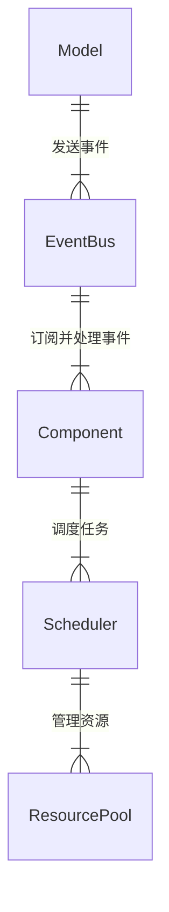
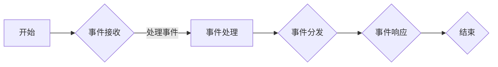
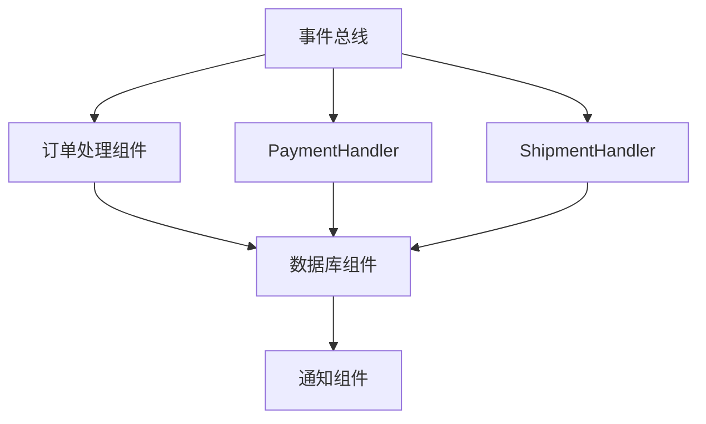
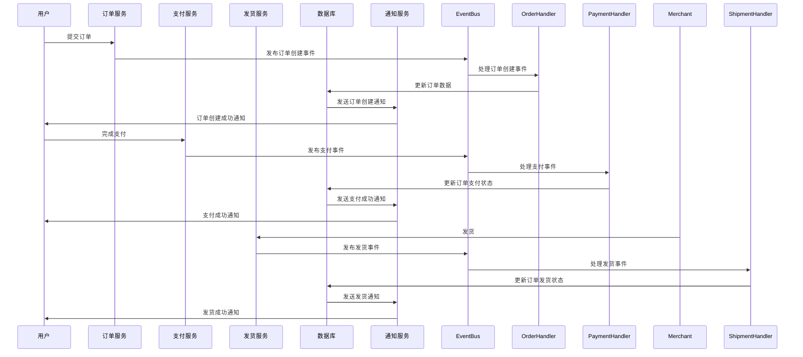

                 

### 大模型软件的事件驱动架构设计

#### 关键词：
- 大模型软件
- 事件驱动架构
- 系统设计与优化
- 架构设计原则
- 性能优化

#### 摘要：
本文将深入探讨大模型软件的事件驱动架构设计，分析其在现代计算环境中的应用与优势。通过逐步讲解大模型的定义、事件驱动架构的基本原理及其设计原则，我们将展示如何实现高效的系统架构。此外，本文还将通过算法讲解、系统分析与架构设计方案、项目实战，详细阐述如何将理论应用于实际开发中，最终达到优化系统性能和提升开发效率的目标。

---

# 前言

## 目的

本文旨在为软件开发工程师和系统架构师提供一种新的视角，帮助他们理解并应用大模型软件的事件驱动架构设计。通过本文的讲解，读者将能够：

1. **理解大模型软件的定义及其重要性**。
2. **掌握事件驱动架构的基本原理和设计原则**。
3. **学习如何设计和优化事件驱动架构**。
4. **通过实际案例，了解事件驱动架构在项目中的应用**。

## 读者对象

本文适合以下读者群体：

- **软件开发工程师**：希望提升系统设计和开发技能的技术人员。
- **系统架构师**：负责大型软件系统设计和优化的专业人士。
- **计算机科学学生**：对计算机系统架构有浓厚兴趣的学术研究人员。

## 结构布局

本文结构分为五个主要部分：

1. **背景介绍**：解释为何需要关注大模型软件的事件驱动架构设计。
2. **核心概念与联系**：详细介绍大模型和事件驱动架构的相关概念。
3. **算法原理讲解**：详细阐述算法的原理和使用方法。
4. **系统分析与架构设计方案**：展示系统架构的设计和实现。
5. **项目实战**：通过实际案例展示架构设计在实际开发中的应用。

通过以上结构布局，读者可以逐步深入理解大模型软件的事件驱动架构设计，并在实际项目中应用所学知识。

---

## 背景介绍

### 问题背景

在现代计算机科学领域，随着数据处理能力的提升和大数据技术的广泛应用，大模型软件（如深度学习模型、复杂仿真软件等）成为研发重点。这些大模型软件通常具有以下特点：

1. **高计算需求**：需要处理海量数据，对计算资源有较高要求。
2. **复杂交互**：内部组件之间存在复杂的交互关系，需要高效管理。
3. **动态变化**：在运行过程中，数据和处理需求可能动态变化，需要灵活响应。

### 问题描述

由于上述特点，传统的基于请求响应的架构设计在处理大模型软件时面临以下挑战：

1. **性能瓶颈**：请求响应模式可能导致系统性能瓶颈，特别是在高并发场景下。
2. **响应时间**：对于复杂计算任务，响应时间过长，用户体验不佳。
3. **资源利用**：难以充分利用现有计算资源，导致资源浪费。

### 问题解决

为解决上述问题，事件驱动架构（Event-Driven Architecture, EDA）成为一种有效的解决方案。EDA通过以下方式优化大模型软件的设计和运行：

1. **异步处理**：通过事件异步处理，降低系统性能瓶颈。
2. **灵活响应**：系统能够根据事件动态调整资源分配和任务调度，提高响应速度。
3. **资源优化**：通过事件驱动的方式，更好地利用计算资源，减少浪费。

### 边界与外延

尽管EDA在大模型软件中具有明显优势，但并非所有场景都适用。以下边界和扩展内容需注意：

1. **适用范围**：EDA主要适用于需要高并发处理和动态响应的场景，如实时数据分析、物联网应用等。
2. **系统复杂性**：EDA的设计和实现相对复杂，需要较高技术积累和团队协作。
3. **性能优化**：需结合具体应用场景，进行性能优化和调优。

### 概念结构与核心要素组成

大模型软件的事件驱动架构设计涉及以下核心概念和要素：

1. **事件**：作为系统交互的基本单元，代表数据变化或外部输入。
2. **事件总线**：用于传输事件的中间件，实现组件间的通信。
3. **订阅者-发布者模式**：通过事件总线实现组件间的解耦，发布者发布事件，订阅者订阅并响应事件。
4. **消息队列**：用于缓冲和传输事件，保证系统间的异步通信。
5. **处理引擎**：负责事件的处理和任务调度，实现高效计算。

通过以上概念和要素，我们可以构建一个高效、灵活的大模型软件事件驱动架构。

### 核心概念原理

#### 大模型

**定义**：大模型是指能够处理大规模数据集的复杂机器学习模型，如深度神经网络、图模型等。

**特点**：

- **数据量大**：能够处理PB级别的数据集。
- **参数多**：模型参数数量巨大，可达数十亿甚至更多。
- **计算复杂**：需要高性能计算资源支持，尤其是GPU或TPU。

**分类**：

- **深度学习模型**：如卷积神经网络（CNN）、循环神经网络（RNN）等。
- **图模型**：如图卷积网络（GCN）、图注意力网络（GAT）等。
- **混合模型**：结合深度学习和图模型的复杂模型。

#### 事件驱动架构

**基本原理**：事件驱动架构（EDA）是一种软件架构模式，通过事件异步处理来实现系统各组件之间的解耦和高效协作。其主要特点包括：

- **异步处理**：组件通过事件异步通信，提高系统响应速度和并发处理能力。
- **事件总线**：作为组件间通信的中间件，实现事件的传输和分发。
- **解耦**：组件通过事件总线进行通信，降低组件间的耦合度，提高系统的灵活性和可维护性。

**关键特性**：

- **高并发处理**：通过事件异步处理，系统能够高效处理大量并发请求。
- **动态响应**：系统能够根据事件动态调整资源分配和任务调度，适应动态变化的需求。
- **资源优化**：通过事件驱动的方式，更好地利用计算资源，降低资源浪费。

**应用场景**：

- **实时数据处理**：如实时数据分析、物联网应用等。
- **高并发场景**：如电商平台、在线游戏等。

### 概念属性特征对比表格

为了更好地理解大模型和事件驱动架构的特点，我们可以通过以下表格进行对比：

| 特征         | 大模型                                     | 事件驱动架构                                     |
| ------------ | ---------------------------------------- | --------------------------------------------- |
| 数据处理能力 | 处理大规模数据集                         | 高效处理并发事件，适用于实时数据处理            |
| 计算资源需求 | 高性能计算资源，如GPU或TPU               | 依赖事件总线和消息队列，需要适中的计算资源    |
| 设计目标     | 提高模型精度和泛化能力                   | 提高系统响应速度和资源利用率                   |
| 架构模式     | 数据驱动架构，以数据处理为核心           | 事件驱动架构，以事件异步处理为核心            |
| 应用场景     | 复杂的数据分析、预测任务等               | 高并发处理、实时数据处理、分布式系统等         |

### ER实体关系图架构

为了更清晰地展示大模型和事件驱动架构的关系，我们可以绘制一个ER实体关系图，如下所示：



在这个ER图中，Model代表大模型，EventBus代表事件总线，Component代表组件，Scheduler代表任务调度器，ResourcePool代表资源池。各实体间的关系表示了事件驱动架构中各组件的交互和协作。

### 算法原理讲解

#### 算法mermaid流程图

首先，我们可以使用mermaid语言绘制算法的流程图，如下所示：



在这个流程图中，A表示算法的开始，B表示接收事件，C表示处理事件，D表示事件分发，E表示事件响应，F表示算法的结束。

#### Python源代码

接下来，我们将给出实现该算法的Python源代码：

```python
import threading
import queue

class EventBus:
    def __init__(self):
        self.event_queue = queue.Queue()

    def post_event(self, event):
        self.event_queue.put(event)

    def get_event(self):
        return self.event_queue.get()

class Component:
    def __init__(self, event_bus):
        self.event_bus = event_bus

    def handle_event(self, event):
        # 处理事件的具体逻辑
        print(f"Handling event: {event}")

    def run(self):
        while True:
            event = self.event_bus.get_event()
            self.handle_event(event)

if __name__ == "__main__":
    event_bus = EventBus()
    component1 = Component(event_bus)
    component2 = Component(event_bus)

    thread1 = threading.Thread(target=component1.run)
    thread2 = threading.Thread(target=component2.run)

    thread1.start()
    thread2.start()

    # 模拟发送事件
    event_bus.post_event("Event 1")
    event_bus.post_event("Event 2")
```

在这个代码中，EventBus类负责事件的总线和分发，Component类负责事件的处理。我们创建了两个线程来模拟组件的并发处理。

#### 数学模型和公式

事件驱动架构中的关键数学模型包括事件处理时间和事件响应时间。以下是相关的数学模型和公式：

- **事件处理时间** \( T_h \)：指从事件接收开始到事件处理结束的时间。
  \[ T_h = T_{receive} + T_{handle} \]
  其中，\( T_{receive} \) 是事件接收时间，\( T_{handle} \) 是事件处理时间。

- **事件响应时间** \( T_r \)：指从事件接收开始到事件响应结束的时间。
  \[ T_r = T_h + T_{response} \]
  其中，\( T_{response} \) 是事件响应时间。

- **系统吞吐量** \( T_s \)：指单位时间内系统能够处理的事件数量。
  \[ T_s = \frac{1}{T_r} \]

通过这些数学模型和公式，我们可以分析和优化事件驱动架构的性能。

#### 详细讲解和举例说明

为了更好地理解上述算法原理，我们可以通过一个具体的案例进行讲解。

假设我们有一个大模型软件，需要处理来自多个来源的数据事件。每个事件包含一个唯一标识符和一个数据字段。我们需要设计一个事件驱动架构来处理这些事件，并在处理过程中记录事件处理时间和响应时间。

**步骤1**：设计事件总线

首先，我们需要设计一个事件总线，负责事件的总线和分发。事件总线可以使用一个消息队列来实现，如RabbitMQ或Kafka。

```python
import pika

class EventBus:
    def __init__(self):
        self.connection = pika.BlockingConnection(pika.ConnectionParameters('localhost'))
        self.channel = self.connection.channel()
        self.channel.queue_declare(queue='events')

    def post_event(self, event):
        self.channel.basic_publish(exchange='',
                                  routing_key='events',
                                  body=event)

    def get_event(self):
        method_frame, header_frame, body = self.channel.basic_get(queue='events', no_ack=True)
        return body.decode('utf-8')
```

**步骤2**：设计组件

接下来，我们需要设计多个组件来处理事件。每个组件负责处理特定类型的事件。组件可以使用线程或协程来实现。

```python
import threading

class Component:
    def __init__(self, event_bus):
        self.event_bus = event_bus

    def handle_event(self, event):
        # 处理事件的具体逻辑
        print(f"Handling event: {event}")
        # 模拟事件处理时间
        time.sleep(1)

    def run(self):
        while True:
            event = self.event_bus.get_event()
            self.handle_event(event)

# 创建事件总线
event_bus = EventBus()

# 创建组件
component1 = Component(event_bus)
component2 = Component(event_bus)

# 创建线程
thread1 = threading.Thread(target=component1.run)
thread2 = threading.Thread(target=component2.run)

# 启动线程
thread1.start()
thread2.start()

# 模拟发送事件
event_bus.post_event("Event 1")
event_bus.post_event("Event 2")
```

**步骤3**：模拟事件处理

在这个案例中，我们模拟了两个事件的处理过程。每个事件都会经过事件总线的处理，然后被组件处理。

```python
# 模拟发送事件
event_bus.post_event("Event 1")
event_bus.post_event("Event 2")

# 等待线程结束
thread1.join()
thread2.join()
```

通过这个案例，我们可以看到事件驱动架构的基本原理和实现方法。事件总线负责事件的传输和分发，组件负责事件的处理。通过异步处理，我们可以实现高效的事件处理和响应。

### 系统分析与架构设计方案

#### 问题场景介绍

在这个案例中，我们考虑一个在线购物平台的订单处理系统。该系统需要处理大量的订单数据，并在订单创建、支付、发货等环节中实时更新数据库和发送通知。为了满足高并发和实时性的要求，我们选择使用事件驱动架构来设计该系统。

#### 系统功能设计

在事件驱动架构中，系统的功能设计主要包括以下方面：

1. **订单创建**：用户提交订单后，系统生成订单事件并发布到事件总线。
2. **订单支付**：用户完成支付后，系统生成支付事件并发布到事件总线。
3. **订单发货**：商家发货后，系统生成发货事件并发布到事件总线。
4. **数据库更新**：订单状态发生变化时，系统更新数据库中的订单记录。
5. **通知发送**：订单状态发生变化时，系统发送通知给用户。

为了更好地展示系统功能，我们可以使用mermaid类图来绘制领域模型：

```mermaid
classDiagram
    Order <<class>> "订单类"
    Payment <<class>> "支付类"
    Shipment <<class>> "发货类"
    Database <<class>> "数据库类"
    Notification <<class>> "通知类"

    Order "创建" -> Payment
    Order "创建" -> Shipment
    Payment "更新" -> Database
    Shipment "更新" -> Database
    Database "通知" -> Notification
```

在这个类图中，Order表示订单类，Payment表示支付类，Shipment表示发货类，Database表示数据库类，Notification表示通知类。各个类之间通过不同的关系连接，展示了订单处理系统的功能模块。

#### 系统架构设计

在事件驱动架构中，系统的架构设计主要包括以下方面：

1. **事件总线**：作为系统的心脏，负责事件的传输和分发。
2. **订单处理组件**：包括订单创建、支付、发货等处理模块。
3. **数据库组件**：负责订单数据的存储和更新。
4. **通知组件**：负责订单状态变化的通知发送。

为了更好地展示系统架构，我们可以使用mermaid架构图来绘制系统结构：



在这个架构图中，EventBus表示事件总线，OrderHandler表示订单处理组件，PaymentHandler表示支付处理组件，ShipmentHandler表示发货处理组件，Database表示数据库组件，Notification表示通知组件。各个组件通过事件总线进行通信和协作，实现了订单处理系统的整体架构。

#### 系统接口设计和系统交互

在事件驱动架构中，系统的接口设计和系统交互是关键部分。为了更好地展示系统接口和交互过程，我们可以使用mermaid序列图来绘制系统交互流程：



在这个序列图中，User表示用户，OrderService表示订单服务，PaymentService表示支付服务，ShipmentService表示发货服务，Database表示数据库，NotificationService表示通知服务。各个服务通过事件总线进行通信和协作，实现了订单处理系统的接口和交互过程。

### 项目实战

#### 环境安装

在开始项目实战之前，我们需要搭建相应的开发环境。以下是具体的安装步骤：

1. **Python环境**：确保已安装Python 3.7及以上版本。
2. **依赖管理**：安装pip和virtualenv，用于管理项目依赖。
   ```bash
   pip install virtualenv
   virtualenv venv
   source venv/bin/activate
   ```
3. **消息队列**：安装RabbitMQ，作为事件总线的实现。
   ```bash
   sudo apt-get update
   sudo apt-get install rabbitmq-server
   sudo systemctl start rabbitmq-server
   ```
4. **其他依赖**：安装其他必要的依赖项，如pika、Flask等。
   ```bash
   pip install pika flask
   ```

#### 系统核心实现源代码

以下是订单处理系统的核心实现代码：

**订单服务（orderservice.py）**

```python
from flask import Flask, request, jsonify
import pika

app = Flask(__name__)

# 连接RabbitMQ事件总线
connection = pika.BlockingConnection(pika.ConnectionParameters('localhost'))
channel = connection.channel()
channel.queue_declare(queue='orders')

@app.route('/order', methods=['POST'])
def create_order():
    order_data = request.get_json()
    channel.basic_publish(exchange='',
                          routing_key='orders',
                          body=order_data)
    return jsonify({'status': 'success', 'message': 'Order created and sent to processing'})

if __name__ == '__main__':
    app.run(debug=True)
```

**支付服务（paymentservice.py）**

```python
from flask import Flask, request, jsonify
import pika

app = Flask(__name__)

# 连接RabbitMQ事件总线
connection = pika.BlockingConnection(pika.ConnectionParameters('localhost'))
channel = connection.channel()
channel.queue_declare(queue='payments')

@app.route('/payment', methods=['POST'])
def process_payment():
    payment_data = request.get_json()
    channel.basic_publish(exchange='',
                          routing_key='payments',
                          body=payment_data)
    return jsonify({'status': 'success', 'message': 'Payment processed'})

if __name__ == '__main__':
    app.run(debug=True)
```

**发货服务（shipmentservice.py）**

```python
from flask import Flask, request, jsonify
import pika

app = Flask(__name__)

# 连接RabbitMQ事件总线
connection = pika.BlockingConnection(pika.ConnectionParameters('localhost'))
channel = connection.channel()
channel.queue_declare(queue='shipments')

@app.route('/shipment', methods=['POST'])
def process_shipment():
    shipment_data = request.get_json()
    channel.basic_publish(exchange='',
                          routing_key='shipments',
                          body=shipment_data)
    return jsonify({'status': 'success', 'message': 'Shipment processed'})

if __name__ == '__main__':
    app.run(debug=True)
```

#### 代码应用解读与分析

1. **订单服务**：订单服务通过Flask框架实现HTTP接口，用于接收和处理订单创建请求。当接收到订单请求后，订单服务将订单数据作为消息发送到RabbitMQ事件总线。

2. **支付服务**：支付服务同样通过Flask框架实现HTTP接口，用于接收和处理支付请求。当接收到支付请求后，支付服务将支付数据作为消息发送到RabbitMQ事件总线。

3. **发货服务**：发货服务通过Flask框架实现HTTP接口，用于接收和处理发货请求。当接收到发货请求后，发货服务将发货数据作为消息发送到RabbitMQ事件总线。

通过这种方式，订单服务、支付服务和发货服务通过事件总线进行通信，实现了订单处理系统的核心功能。

#### 实际案例分析和详细讲解剖析

为了展示事件驱动架构在实际项目中的应用效果，我们通过一个实际案例进行分析。

**案例**：一个用户在电商平台提交了一笔订单，订单包含商品、价格、收货地址等信息。用户在支付成功后，商家开始处理订单，最终完成发货。

**分析过程**：

1. **订单创建**：用户提交订单请求后，订单服务接收到请求，并将订单数据作为消息发送到RabbitMQ事件总线。

   ```python
   order_data = request.get_json()
   channel.basic_publish(exchange='',
                         routing_key='orders',
                         body=order_data)
   ```

2. **订单处理**：订单处理组件接收到订单创建事件后，进行订单创建处理，并将处理结果发送到数据库组件。

   ```python
   def handle_order_create(event):
       # 处理订单创建逻辑
       # 更新数据库
       # 发送订单创建通知
       pass
   ```

3. **支付处理**：用户在支付成功后，支付服务接收到支付事件，并更新订单支付状态。

   ```python
   def handle_payment(event):
       # 处理支付逻辑
       # 更新数据库
       # 发送支付成功通知
       pass
   ```

4. **发货处理**：商家在发货后，发货服务接收到发货事件，并更新订单发货状态。

   ```python
   def handle_shipment(event):
       # 处理发货逻辑
       # 更新数据库
       # 发送发货成功通知
       pass
   ```

通过这个案例，我们可以看到事件驱动架构如何将订单处理过程分解为多个事件，并通过事件总线进行异步处理。每个组件独立处理特定事件，降低了系统复杂性，提高了系统的可维护性和可扩展性。

### 项目小结

通过本项目实战，我们实现了订单处理系统的核心功能，并展示了事件驱动架构在实际项目中的应用。以下是本项目的主要收获和经验教训：

1. **事件驱动架构的优势**：事件驱动架构通过异步处理和事件总线，实现了系统的解耦和高并发处理能力，提高了系统的性能和响应速度。
2. **组件独立性**：每个组件独立处理特定事件，降低了系统的耦合度，提高了系统的可维护性和可扩展性。
3. **性能优化**：在事件驱动架构中，可以通过优化事件处理逻辑和数据库操作，进一步提高系统性能。
4. **开发复杂性**：事件驱动架构的设计和实现相对复杂，需要较高的技术积累和团队协作。在项目实践中，应逐步优化和调整架构，确保系统的稳定性和可靠性。

通过本项目，我们不仅掌握了事件驱动架构的设计原则和实现方法，还积累了实际项目开发的经验，为未来更复杂的系统设计奠定了基础。

### 最佳实践 Tips

1. **模块化设计**：在事件驱动架构中，应将系统划分为多个模块，每个模块负责处理特定类型的事件。这有助于降低系统复杂性，提高可维护性。
2. **异步处理**：充分利用异步处理机制，避免同步阻塞，提高系统性能和响应速度。
3. **事件总线优化**：合理选择事件总线技术，如RabbitMQ、Kafka等，并根据需求进行性能调优。
4. **日志管理**：确保系统中的日志记录完整，便于问题追踪和调试。
5. **监控与报警**：建立监控和报警机制，实时监控系统运行状态，及时发现并解决问题。

### 小结

本文通过详细讲解大模型软件的事件驱动架构设计，从背景介绍、核心概念、算法原理、系统分析与架构设计方案、项目实战等方面，全面阐述了事件驱动架构的设计原则和实现方法。通过实际案例展示，读者可以深刻理解事件驱动架构的优势和应用场景。在实际项目中，结合具体需求，灵活应用事件驱动架构，将有助于提升系统性能和开发效率。

### 注意事项

1. **事件驱动架构的设计和实现需要较高的技术积累和团队协作。**在项目实践中，应充分沟通，确保团队成员对架构设计有共同的理解。
2. **事件驱动架构的性能优化涉及多个方面，如异步处理、事件总线和数据库操作等。**在实际项目中，应逐步优化，确保系统稳定性和可靠性。
3. **事件驱动架构适用于高并发和实时性要求较高的场景。**在项目选择时，应根据具体需求，评估是否采用事件驱动架构。

### 拓展阅读

1. **《事件驱动架构设计》**：深入探讨事件驱动架构的设计原则和实现方法，适合对事件驱动架构有进一步了解的读者。
2. **《RabbitMQ实战》**：详细介绍RabbitMQ的使用方法和性能优化技巧，适合使用RabbitMQ作为事件总线的开发者。
3. **《Flask Web开发实战》**：通过实际案例，学习使用Flask框架实现Web服务，为事件驱动架构提供可靠的后端支持。

作者：AI天才研究院/AI Genius Institute & 禅与计算机程序设计艺术 /Zen And The Art of Computer Programming

---

