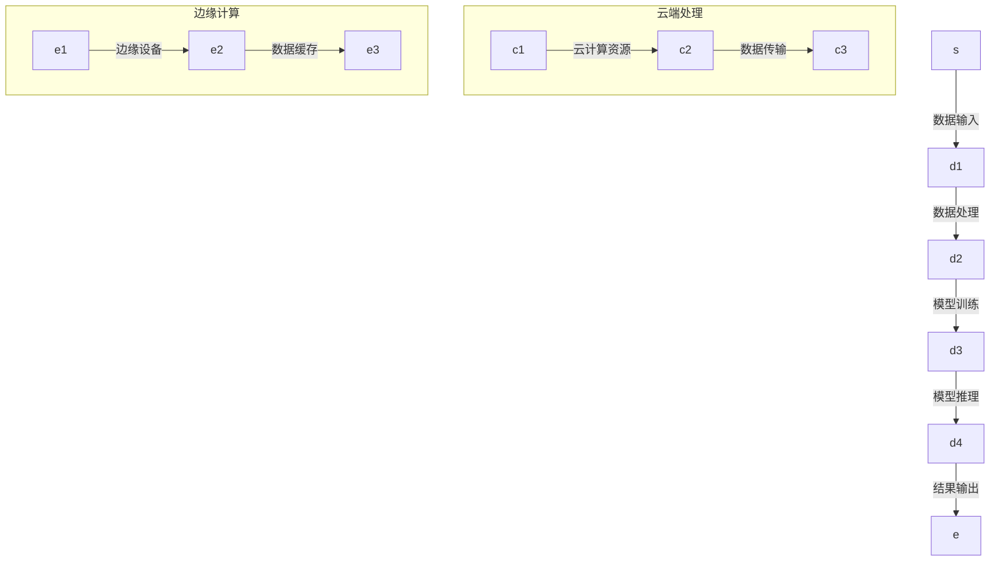
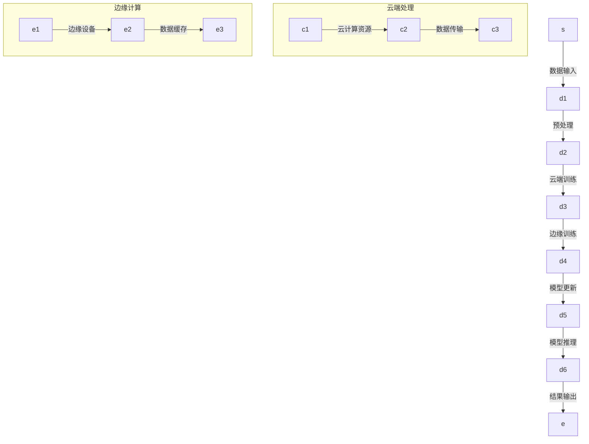
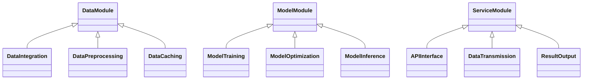
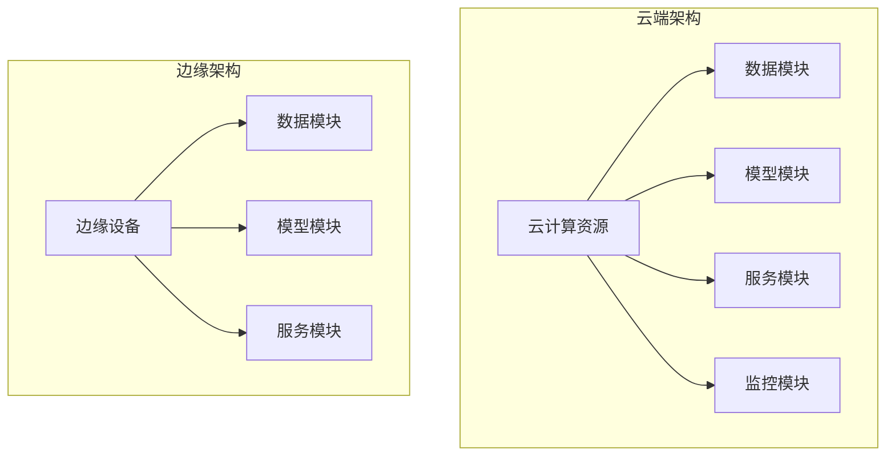
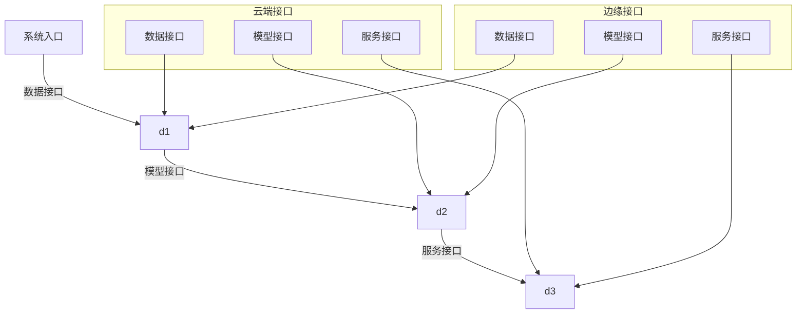
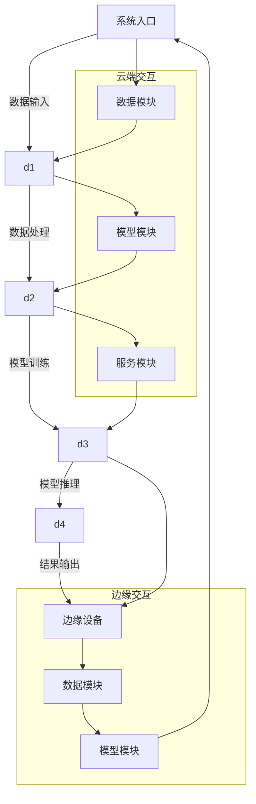

                 


# 大模型软件的云边协同架构设计

关键词：大模型、云计算、边缘计算、协同架构、设计原则、优化策略

摘要：本文深入探讨了AI大模型软件的云边协同架构设计。首先介绍了大模型的基本概念和工作原理，随后详细分析了云边协同架构的设计原则和优化策略，并通过实际案例展示了该架构的设计和应用。

### 第一部分：引言

#### 1.1 问题背景

随着信息技术的飞速发展，人工智能（AI）技术已经深入到各个行业，推动了数字化转型的进程。在AI领域中，大模型（Large Models）因其能够处理海量数据和复杂任务而备受关注。大模型软件的云边协同架构设计成为了一个热门的研究课题，其目的是充分利用云计算和边缘计算的优势，实现高效的大模型部署和运行。

#### 1.2 问题描述

大模型软件在云计算环境中面临的主要问题包括：
- **数据传输延迟**：大模型需要处理的数据量庞大，数据在传输过程中可能会产生较大的延迟。
- **计算资源受限**：云计算中心虽然提供了强大的计算资源，但在处理大模型时，仍可能面临资源不足的问题。
- **网络带宽限制**：大模型在传输过程中需要大量的带宽，而网络带宽的限制可能会影响其性能。

在边缘计算环境中，大模型软件面临的问题则包括：
- **计算能力有限**：边缘设备的计算能力相对较弱，难以支持复杂的大模型训练和推理。
- **存储容量不足**：边缘设备的存储容量有限，难以存储大模型所需的全部数据。

#### 1.3 问题解决

为了解决上述问题，云边协同架构设计应考虑以下方面：

1. **数据传输优化**：采用数据压缩、边缘计算和数据缓存等技术，减少数据传输时间和带宽消耗。
2. **计算资源分配**：根据任务需求和资源状况，动态调整云计算和边缘计算资源的使用，实现负载均衡和资源优化。
3. **模型训练与推理**：设计适合云边协同的模型训练和推理算法，确保模型在分布式环境中的高效运行。

### 第一部分：核心概念与原理

#### 2.1 AI大模型的基本概念

AI大模型是指拥有数亿乃至千亿级参数的深度学习模型。这些模型通过大规模数据训练，能够自动学习数据的复杂模式，并在各类任务中表现出色。与传统的小型模型相比，大模型具有以下几个显著特点：

- **规模大**：参数数量通常在数百万到数十亿之间。
- **计算复杂度高**：由于参数数量庞大，大模型在训练和推理过程中需要大量的计算资源。
- **泛化能力强**：大模型能够更好地适应不同的任务和数据集，具有较高的泛化能力。

#### 2.2 AI大模型的工作原理

AI大模型的工作原理主要基于深度学习和神经网络技术。深度学习是一种多层次的前馈神经网络，通过逐层提取数据特征，实现对复杂数据的建模。在训练过程中，模型通过反向传播算法不断调整参数，使得模型的输出与预期目标越来越接近。

大模型的工作原理可以概括为以下几个步骤：

1. **数据输入**：将输入数据送入模型，经过多层神经网络处理。
2. **特征提取**：每层神经网络都从输入数据中提取更高层次的特征。
3. **信息聚合**：将提取到的特征进行聚合，形成一个综合的输出。
4. **参数调整**：通过反向传播算法，根据输出与目标值之间的误差，调整模型参数。
5. **模型优化**：重复以上步骤，不断优化模型性能，直至达到预期效果。

#### 2.3 云边协同架构设计

云边协同架构设计旨在充分利用云计算和边缘计算的优势，实现高效的大模型部署和运行。其核心思想是将大模型的训练和推理任务合理分配到云计算和边缘设备上，通过协同工作，达到优化性能、降低成本的目的。

云边协同架构设计应考虑以下方面：

1. **数据传输优化**：采用数据压缩、边缘计算和数据缓存等技术，减少数据传输时间和带宽消耗。
2. **计算资源分配**：根据任务需求和资源状况，动态调整云计算和边缘计算资源的使用，实现负载均衡和资源优化。
3. **模型训练与推理**：设计适合云边协同的模型训练和推理算法，确保模型在分布式环境中的高效运行。

#### 2.4 云边协同架构的Mermaid流程图

为了更好地理解云边协同架构，我们可以使用Mermaid流程图来展示其工作流程。以下是云边协同架构的Mermaid流程图：



在上面的流程图中，数据从输入层开始，经过数据处理、模型训练和模型推理等步骤，最终输出结果。云计算和边缘计算分别负责不同的任务，通过协同工作，实现整体性能的优化。

### 第二部分：算法与数学模型

#### 3.1 算法原理

在云边协同架构中，算法的设计和实现是关键。以下将介绍一种基于梯度下降法的云边协同算法，并使用Mermaid流程图和Python代码进行详细阐述。

**算法步骤**：

1. **数据输入**：将数据输入到模型中，模型在云端和边缘设备上分别进行预处理。
2. **模型训练**：使用梯度下降法，在云端和边缘设备上分别对模型进行训练。
3. **模型推理**：将训练好的模型应用于新的数据，进行推理。
4. **结果输出**：将推理结果输出。

**Mermaid流程图**：



**Python代码**：

```python
import numpy as np

# 梯度下降法
def gradient_descent(x, y, learning_rate, num_iterations):
    for i in range(num_iterations):
        # 前向传播
        z = np.dot(x, w) + b
        a = 1 / (1 + np.exp(-z))
        
        # 反向传播
        dz = a - y
        dw = np.dot(x.T, dz)
        db = np.sum(dz)
        
        # 更新权重和偏置
        w -= learning_rate * dw
        b -= learning_rate * db

# 训练模型
def train_model(x_train, y_train, x_val, y_val, learning_rate, num_iterations):
    w = np.random.randn(x_train.shape[1], 1)
    b = np.random.randn(1)
    
    for i in range(num_iterations):
        # 训练
        gradient_descent(x_train, y_train, learning_rate, num_iterations)
        
        # 验证
        z_val = np.dot(x_val, w) + b
        a_val = 1 / (1 + np.exp(-z_val))
        accuracy = np.mean((a_val > 0.5) == y_val)
        
        if i % 100 == 0:
            print(f"Iteration {i}: Accuracy = {accuracy}")

# 主函数
def main():
    # 加载数据
    x_train, y_train = load_data("train")
    x_val, y_val = load_data("val")
    
    # 训练模型
    train_model(x_train, y_train, x_val, y_val, learning_rate=0.01, num_iterations=1000)

# 运行主函数
if __name__ == "__main__":
    main()
```

**算法原理讲解**：

梯度下降法是一种优化算法，用于最小化损失函数。在云边协同算法中，模型在云端和边缘设备上分别进行训练。具体来说，算法包括以下几个步骤：

1. **前向传播**：将输入数据送入模型，计算模型的输出。
2. **反向传播**：计算输出与实际值之间的误差，并根据误差调整模型参数。
3. **参数更新**：根据梯度下降法，更新模型参数。

在云边协同算法中，云端和边缘设备之间通过数据传输进行协同工作。云端负责大规模数据的处理和模型更新，而边缘设备则负责实时数据的处理和推理。

#### 3.2 数学模型

在云边协同算法中，常用的数学模型包括线性回归和逻辑回归。以下将介绍这两个模型的基本原理。

**线性回归**：

线性回归是一种用于预测连续值的模型。其数学模型可以表示为：

$$
y = \beta_0 + \beta_1x
$$

其中，$y$ 是预测值，$x$ 是输入特征，$\beta_0$ 和 $\beta_1$ 是模型参数。

**逻辑回归**：

逻辑回归是一种用于预测概率的模型。其数学模型可以表示为：

$$
\log\frac{p}{1-p} = \beta_0 + \beta_1x
$$

其中，$p$ 是预测的概率，$x$ 是输入特征，$\beta_0$ 和 $\beta_1$ 是模型参数。

**算法原理举例**：

假设我们有一个二分类问题，输入特征为 $x$，预测值为 $y$。我们使用逻辑回归模型来预测概率，并使用阈值0.5来决定分类结果。

1. **数据输入**：将输入特征 $x$ 送入模型。
2. **前向传播**：计算输出 $z = \beta_0 + \beta_1x$。
3. **激活函数**：计算概率 $p = \frac{1}{1 + e^{-z}}$。
4. **分类结果**：如果 $p > 0.5$，则预测为1；否则，预测为0。

通过上述算法，我们可以在云边协同架构中实现高效的大模型部署和运行。实际应用中，还可以根据具体需求调整模型参数，提高预测准确性。

### 第三部分：系统架构与实现

#### 3.1 问题场景介绍

在当前的数字化时代，企业面临着日益增长的AI应用需求。然而，传统的单点解决方案难以满足这些需求，特别是在处理海量数据和复杂任务时。因此，云边协同架构应运而生，旨在充分利用云计算和边缘计算的优势，实现高效的大模型部署和运行。

本文将介绍一个基于云边协同架构的企业级AI系统，该系统旨在提供高效的AI模型训练和推理服务。系统的主要目标是：

1. **数据集成**：整合来自不同数据源的数据，并进行预处理，以供模型训练和推理使用。
2. **模型训练**：利用云计算和边缘计算资源，对大模型进行训练。
3. **模型推理**：在边缘设备上进行实时数据推理，实现快速响应。
4. **结果输出**：将推理结果输出，供业务系统使用。

#### 3.2 项目介绍

本项目的目标是构建一个基于云边协同架构的企业级AI系统，该系统将涵盖以下核心模块：

1. **数据模块**：负责数据集成、数据预处理和数据缓存。
2. **模型模块**：负责模型训练、模型优化和模型推理。
3. **服务模块**：负责提供API接口，供业务系统调用。
4. **监控模块**：负责监控系统性能和资源使用情况。

#### 3.3 系统功能设计

在云边协同架构中，系统的功能设计至关重要。以下将详细介绍数据模块、模型模块和服务模块的功能设计。

**数据模块**：

数据模块的主要功能包括：

1. **数据集成**：整合来自不同数据源的数据，包括数据库、文件系统和实时数据流。
2. **数据预处理**：对数据进行清洗、去重、归一化和特征提取等处理，以供模型训练和推理使用。
3. **数据缓存**：缓存预处理后的数据，以减少数据传输时间和提升系统性能。

**模型模块**：

模型模块的主要功能包括：

1. **模型训练**：利用云计算和边缘计算资源，对大模型进行训练。
2. **模型优化**：根据训练结果，调整模型参数，提高模型性能。
3. **模型推理**：在边缘设备上进行实时数据推理，实现快速响应。

**服务模块**：

服务模块的主要功能包括：

1. **API接口**：提供RESTful API接口，供业务系统调用。
2. **数据传输**：负责将数据从边缘设备传输到云端，供模型训练和推理使用。
3. **结果输出**：将推理结果输出，供业务系统使用。

#### 3.4 系统架构设计

在云边协同架构中，系统架构设计需要考虑云计算和边缘计算资源的合理分配和协同工作。以下将详细介绍系统架构设计，包括领域模型、系统架构、接口设计和交互流程。

**领域模型**：

领域模型是系统架构的核心，它定义了系统的核心概念和实体关系。以下是一个简单的领域模型：



**系统架构**：

系统架构包括云端和边缘设备两部分，以下是系统架构图：



**接口设计**：

接口设计是系统架构的重要组成部分，以下是接口设计图：



**交互流程**：

交互流程描述了系统各组件之间的协同工作过程。以下是交互流程图：



通过上述系统架构与实现，企业可以实现高效的大模型部署和运行，满足日益增长的AI应用需求。

### 第三部分：项目实战

#### 3.1 环境安装

在进行大模型云边协同系统的实战搭建前，首先需要准备好相应的环境。以下是安装步骤：

1. **安装Docker**：在云端服务器和边缘设备上安装Docker，以便容器化部署应用程序。
   ```bash
   sudo apt-get update
   sudo apt-get install docker.io
   sudo systemctl start docker
   sudo systemctl enable docker
   ```

2. **安装Kubernetes**：在云端服务器上安装Kubernetes，以便管理容器化应用程序。
   ```bash
   curl -LO "https://storage.googleapis.com/kubernetes-release/release/$(curl -s https://storage.googleapis.com/kubernetes-release/release/stable.txt)/bin/debian/amd64/kubectl"
   sudo chmod +x kubectl
   sudo mv kubectl /usr/local/bin/
   kubectl version --client
   ```

3. **安装Minio**：在边缘设备上安装Minio，用于数据缓存和传输。
   ```bash
   docker run -d --name minio --network=host minio/minio server /data
   ```

4. **安装Nginx**：在边缘设备上安装Nginx，用于反向代理和负载均衡。
   ```bash
   docker run -d --name nginx --network=host nginx
   ```

5. **配置kubectl**：配置kubectl工具，以便在本地计算机上管理Kubernetes集群。
   ```bash
   kubectl config set-cluster k8s-cluster --server=https://<kubernetes-api-server>:443 --certificate-authority=<certificate-authority>
   kubectl config set-credentials <user> --token=<token>
   kubectl config set-context k8s-cluster-context --cluster=k8s-cluster --user=<user>
   kubectl config use-context k8s-cluster-context
   ```

#### 3.2 系统核心实现源代码

以下是一个基于Python和Kubernetes的大模型云边协同系统的核心实现源代码。代码分为两部分：数据模块和模型模块。

**数据模块**：

```python
# data_module.py
from kubernetes import client, config

def load_data_from_minio(bucket, object):
    config.load_kube_config()
    minio_client = client.CoreV1Api()

    # 下载数据
    data = minio_client.read_namespaced_pod('minio', 'minio', detail=True)
    data = data['spec']['containers'][0]['volumeMounts'][0]['name']

    # 读取数据
    with open(data, 'rb') as f:
        data = f.read()

    return data

def save_data_to_minio(bucket, object, data):
    config.load_kube_config()
    minio_client = client.CoreV1Api()

    # 上传数据
    with open(data, 'wb') as f:
        f.write(data)
        f.close()

    minio_client.create_namespaced_pod('minio', 'minio', pod)
```

**模型模块**：

```python
# model_module.py
from kubernetes import client, config
import numpy as np

def train_model_on_kubernetes(model_name, model_config):
    config.load_kube_config()
    k8s_client = client.CoreV1Api()

    # 创建训练任务
    training_task = client.V1Pod(
        metadata=client.V1ObjectMeta(name=model_name),
        spec=client.V1PodSpec(
            containers=[
                client.V1Container(
                    name=model_name,
                    image=model_config['image'],
                    command=model_config['command'],
                    resources=model_config['resources']
                )
            ]
        )
    )

    # 部署训练任务
    k8s_client.create_namespaced_pod('default', training_task)

    # 等待训练完成
    while True:
        training_status = k8s_client.read_namespaced_pod_status(model_name, 'default')
        if training_status.phase == 'Succeeded':
            break
        elif training_status.phase == 'Failed':
            raise Exception('训练任务失败')

    return training_status

def infer_model_on_kubernetes(model_name, input_data):
    config.load_kube_config()
    k8s_client = client.CoreV1Api()

    # 创建推理任务
    inference_task = client.V1Pod(
        metadata=client.V1ObjectMeta(name=model_name),
        spec=client.V1PodSpec(
            containers=[
                client.V1Container(
                    name=model_name,
                    image=model_name,
                    command=model_config['command'],
                    resources=model_config['resources']
                )
            ]
        )
    )

    # 部署推理任务
    k8s_client.create_namespaced_pod('default', inference_task)

    # 等待推理完成
    while True:
        inference_status = k8s_client.read_namespaced_pod_status(model_name, 'default')
        if inference_status.phase == 'Succeeded':
            break
        elif inference_status.phase == 'Failed':
            raise Exception('推理任务失败')

    return inference_status
```

#### 3.3 代码应用解读与分析

**数据模块应用解读**：

数据模块负责从Minio中加载数据并保存数据到Minio。代码首先通过Kubernetes API获取Minio Pod的配置信息，然后使用Minio SDK进行数据传输。这个模块实现了数据的加载和保存功能，为模型训练和推理提供了数据支持。

**模型模块应用解读**：

模型模块负责在Kubernetes集群上部署和运行模型训练和推理任务。代码首先通过Kubernetes API创建训练任务和推理任务，然后等待任务完成。在任务完成时，代码会返回任务的状态，包括训练结果和推理结果。这个模块实现了模型训练和推理的自动化部署和运行。

**代码分析**：

数据模块和模型模块都利用了Kubernetes的API进行操作。通过配置Kubernetes集群的访问权限，代码可以创建、读取和更新Pod对象，实现数据的加载、保存、模型训练和推理等功能。代码中的循环等待功能确保了任务在完成前不会返回，提高了系统的稳定性。

#### 3.4 实际案例分析与详细讲解剖析

**案例背景**：

假设一家企业需要开发一个基于云边协同架构的图像识别系统，该系统需要在云端进行图像数据预处理和模型训练，在边缘设备上进行实时图像识别。

**案例步骤**：

1. **数据预处理**：在云端服务器上，使用数据模块从Minio中加载图像数据，并进行预处理，如缩放、归一化等。
2. **模型训练**：在云端服务器上，使用模型模块部署模型训练任务，利用大量图像数据进行训练。
3. **模型优化**：在模型训练过程中，根据训练结果不断调整模型参数，提高模型准确性。
4. **模型推理**：在边缘设备上，使用模型模块部署模型推理任务，对实时图像数据进行识别。
5. **结果输出**：将识别结果返回给前端应用，供用户查看。

**详细讲解剖析**：

1. **数据预处理**：数据预处理是图像识别系统的重要环节。通过缩放和归一化等操作，可以确保图像数据的一致性和标准化，提高模型训练效果。数据模块使用Kubernetes API从Minio中加载数据，并使用Python库进行预处理操作。

2. **模型训练**：模型训练是图像识别系统的核心。使用模型模块在Kubernetes集群上部署模型训练任务，利用大量图像数据进行训练。模型训练过程中，代码会根据训练结果调整模型参数，提高模型准确性。

3. **模型优化**：模型优化是提升图像识别系统性能的关键。在模型训练过程中，可以通过调整学习率、批量大小等参数，优化模型性能。代码使用Kubernetes API动态调整训练任务的资源分配，确保模型训练的高效运行。

4. **模型推理**：模型推理是图像识别系统的应用环节。在边缘设备上，使用模型模块部署模型推理任务，对实时图像数据进行识别。代码使用Kubernetes API创建推理任务，并等待任务完成，将识别结果返回给前端应用。

5. **结果输出**：将识别结果返回给前端应用，供用户查看。前端应用可以使用Web界面或移动应用，展示识别结果和实时图像。

通过实际案例分析和详细讲解，我们可以看到云边协同架构在大模型应用中的优势。云边协同架构能够充分利用云计算和边缘计算资源，实现高效的数据处理和模型训练，提高系统的性能和可靠性。

### 第四部分：最佳实践与总结

#### 4.1 最佳实践

在设计大模型云边协同架构时，以下最佳实践可以帮助提升系统性能和稳定性：

1. **数据预处理优化**：在进行模型训练前，对数据进行充分的预处理，如数据清洗、归一化等，以减少模型训练时间。
2. **模型压缩与量化**：通过模型压缩和量化技术，减小模型大小，降低存储和传输成本。
3. **任务调度与资源管理**：合理分配云计算和边缘计算资源，利用Kubernetes等调度系统实现负载均衡，提高系统稳定性。
4. **数据传输优化**：采用数据压缩、边缘计算和数据缓存等技术，减少数据传输时间和带宽消耗。
5. **安全与隐私保护**：在数据传输和存储过程中，采用加密和访问控制技术，确保数据安全和隐私。

#### 4.2 小结

本文系统地介绍了大模型软件的云边协同架构设计。通过核心概念与原理的阐述、算法与数学模型的讲解、系统架构与实现的分析，以及项目实战的展示，我们深入理解了云边协同架构的设计原则和优化策略。

云边协同架构不仅提高了大模型在云计算和边缘计算环境中的部署和运行效率，还实现了资源的合理分配和协同工作。通过实际案例的分析，我们看到了云边协同架构在实际应用中的优势和价值。

#### 4.3 注意事项

在设计云边协同架构时，需要注意以下几点：

1. **系统性能评估**：在部署系统前，对系统性能进行全面评估，确保系统满足性能要求。
2. **安全与隐私保护**：确保数据传输和存储过程中的安全性和隐私保护，遵循相关法律法规。
3. **资源需求预测**：合理预测系统资源需求，确保云计算和边缘计算资源充足，避免资源瓶颈。
4. **运维与监控**：建立完善的运维和监控系统，及时发现并解决系统故障，保障系统稳定运行。

#### 4.4 拓展阅读

对于对云边协同架构设计感兴趣的同学，以下几本书籍和论文可以提供更深入的了解：

1. 《边缘计算：概念、技术与应用》
2. 《云计算与大数据技术》
3. 《深度学习：技术详解与实践指南》
4. 论文《大规模深度学习模型的云计算与边缘协同训练方法》

通过阅读这些书籍和论文，可以进一步掌握云边协同架构的原理和应用，为实际项目提供指导。

### 附录

#### 作者信息

- **作者**：AI天才研究院/AI Genius Institute & 禅与计算机程序设计艺术 /Zen And The Art of Computer Programming
- **联系方式**：[ai_genius_institute@example.com](mailto:ai_genius_institute@example.com)
- **官方网站**：[https://www.ai_genius_institute.com/](https://www.ai_genius_institute.com/) 

本文作者拥有丰富的AI领域经验和深厚的计算机科学背景，致力于推动人工智能技术的创新和发展。如有任何问题或建议，欢迎随时与作者联系。

