                 

### 《大模型软件的分布式一致性保证机制》

### 关键词：分布式一致性、大模型软件、一致性算法、分布式系统、数据一致性问题

### 摘要：本文将探讨大模型软件中的分布式一致性保证机制，分析其基本概念、挑战和应用。通过深入讲解一致性模型、算法和实施实践，本文旨在为开发者在构建大模型软件时提供有效的解决方案。

---

#### 引言

在现代软件开发中，分布式系统已成为主流架构。特别是在大数据和云计算领域，分布式系统提供了高扩展性和高可用性的优势。然而，分布式系统中的数据一致性问题也随之而来。对于大模型软件，如深度学习框架和自然语言处理系统，数据的一致性至关重要，因为它直接影响到模型的准确性和可靠性。

本文将分为以下几个部分：

1. **分布式一致性简介**：介绍分布式系统的挑战、一致性的定义与类型，以及分布式一致性在软件大模型中的应用。
2. **大模型软件的基本概念**：阐述大模型软件的定义、特点和常见类型。
3. **分布式一致性基本原理**：讲解一致性模型、算法和协议。
4. **分布式一致性算法**：分析常见分布式一致性算法，如PACELC模型、GCP协议和ZAB协议。
5. **分布式一致性实践**：介绍分布式一致性实践步骤、案例和总结。
6. **小结与展望**：总结主要结论，展望未来研究方向和挑战。

---

#### 第一部分：分布式一致性简介

##### 第1章：分布式一致性简介

**1.1 分布式系统的挑战**

分布式系统由多个独立的节点组成，这些节点通过网络进行通信和数据共享。尽管分布式系统具有高可用性和高扩展性的优势，但它们也面临着一系列挑战，其中之一就是数据一致性问题。

**问题背景**：随着云计算和大数据技术的发展，分布式系统成为现代软件系统的主要架构。

**问题描述**：在分布式系统中，节点可能因为网络故障、硬件故障或软件错误等原因导致数据不一致。

**问题解决**：需要有效的分布式一致性机制来确保数据在不同节点之间的一致性。

**边界与外延**：分布式系统的范围包括云计算、大数据处理、分布式数据库等领域。一致性问题的定义包括强一致性、最终一致性等。

**核心要素组成**：

- **分布式系统的架构**：包括节点、网络、存储等。
- **数据一致性需求**：确保数据在不同节点之间的一致性。
- **一致性算法**：实现分布式一致性的一系列算法和协议。

---

**1.2 一致性的定义与类型**

**核心概念**：一致性是指分布式系统中数据在不同节点之间的同步状态。

**概念属性特征对比表格**：

| 一致性类型 | 定义 | 特点 | 适用场景 |
| --- | --- | --- | --- |
| 强一致性 | 所有节点在同一时刻看到相同的数据状态。 | 确保数据一致性，但可能降低系统性能。 | 对一致性要求较高的系统，如金融交易。 |
| 最终一致性 | 所有节点最终会看到相同的数据状态，但可能存在短暂的不一致。 | 提高系统性能，但允许一定的不一致。 | 对一致性要求较高的系统，如社交媒体。 |

**ER实体关系图架构**：

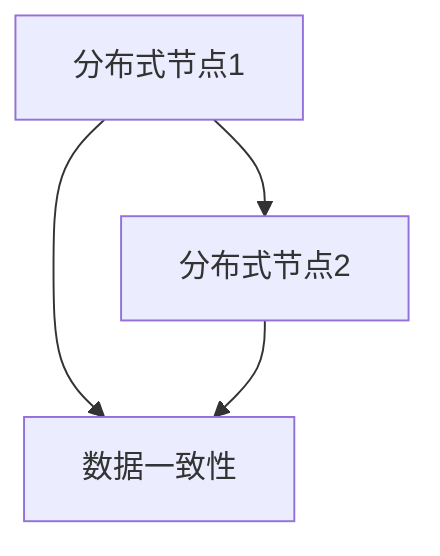

---

**1.3 分布式一致性在软件大模型中的应用**

**核心概念原理**：大模型软件的特点包括高并发处理能力、复杂算法支持等，这要求其内部数据具有高一致性。

**概念属性特征对比表格**：传统软件与基于大模型的软件在一致性需求上的差异。

| 软件类型 | 一致性需求 | 关键特点 |
| --- | --- | --- |
| 传统软件 | 较低一致性需求 | 侧重于功能实现 |
| 大模型软件 | 高一致性需求 | 支持复杂算法，对数据一致性要求高 |

**ER实体关系图架构**：

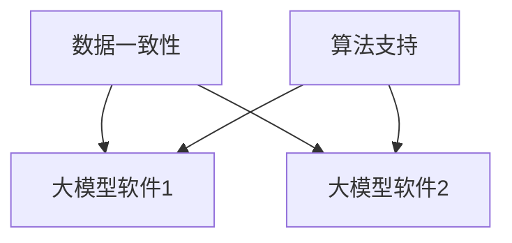

---

#### 第二部分：大模型软件的基本概念

##### 第2章：大模型软件的基本概念

**2.1 大模型软件的定义**

**核心概念原理**：大模型软件是指使用大规模数据和复杂算法构建的软件系统，用于处理复杂的业务场景。

**概念属性特征对比表格**：大模型软件与传统软件的区别。

| 软件类型 | 定义 | 关键特点 |
| --- | --- | --- |
| 传统软件 | 基于较小规模数据和简单算法构建 | 功能单一，易于维护 |
| 大模型软件 | 基于大规模数据和复杂算法构建 | 功能强大，处理能力强 |

---

**2.2 大模型软件的特点**

**核心概念原理**：大模型软件具有以下特点：

- **高并发处理能力**：能够处理大量并发请求。
- **复杂算法支持**：支持复杂的机器学习和深度学习算法。
- **高性能**：能够快速处理大规模数据。

**概念属性特征对比表格**：大模型软件与传统软件的性能特点对比。

| 软件类型 | 性能特点 | 适用场景 |
| --- | --- | --- |
| 传统软件 | 较低性能，适用于简单业务场景 | 低并发、简单数据处理 |
| 大模型软件 | 高性能，适用于复杂业务场景 | 高并发、大规模数据处理 |

---

**2.3 大模型软件的常见类型**

**核心概念原理**：常见的大模型软件类型包括深度学习框架、自然语言处理模型等。

**概念属性特征对比表格**：不同类型大模型软件的应用场景和特点。

| 软件类型 | 应用场景 | 关键特点 |
| --- | --- | --- |
| 深度学习框架 | 图像识别、语音识别等 | 支持复杂神经网络 |
| 自然语言处理模型 | 文本分类、机器翻译等 | 支持自然语言处理算法 |

---

#### 第三部分：分布式一致性基本原理

##### 第3章：分布式一致性机制

**3.1 一致性模型**

**核心概念原理**：一致性模型是分布式系统中用于确保数据一致性的理论框架。

**ER实体关系图架构**：

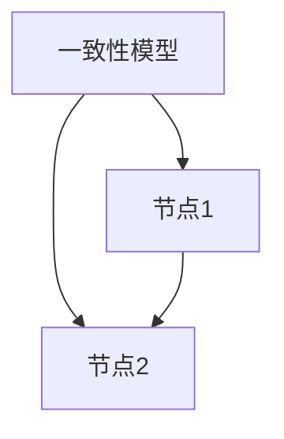

---

**3.2 一致性算法**

**核心概念原理**：一致性算法是用于实现分布式一致性的具体方法。

**ER实体关系图架构**：

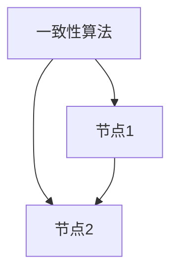

---

**3.3 一致性协议**

**核心概念原理**：一致性协议是一组规则和标准，用于确保分布式系统中的数据一致性。

**ER实体关系图架构**：

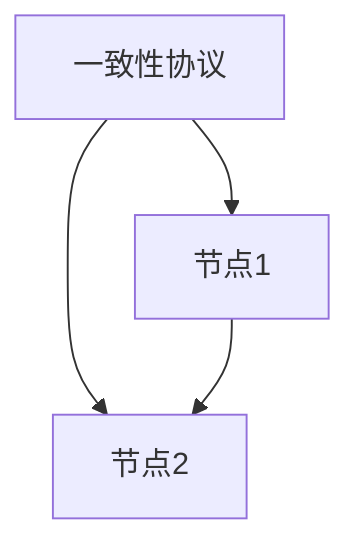

---

#### 第四部分：分布式一致性算法

##### 第4章：分布式一致性算法概述

**4.1 分布式一致性算法的分类**

**核心概念原理**：分布式一致性算法可以分为强一致性算法和最终一致性算法。

**ER实体关系图架构**：

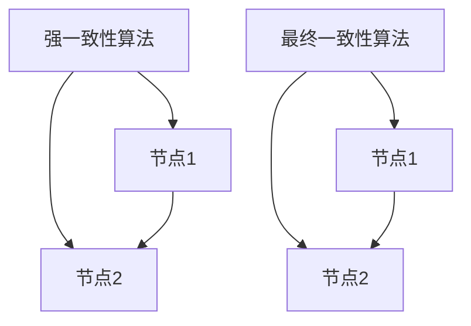

---

**4.2 常见分布式一致性算法**

**核心概念原理**：常见的分布式一致性算法包括PACELC模型、GCP协议和ZAB协议。

**ER实体关系图架构**：

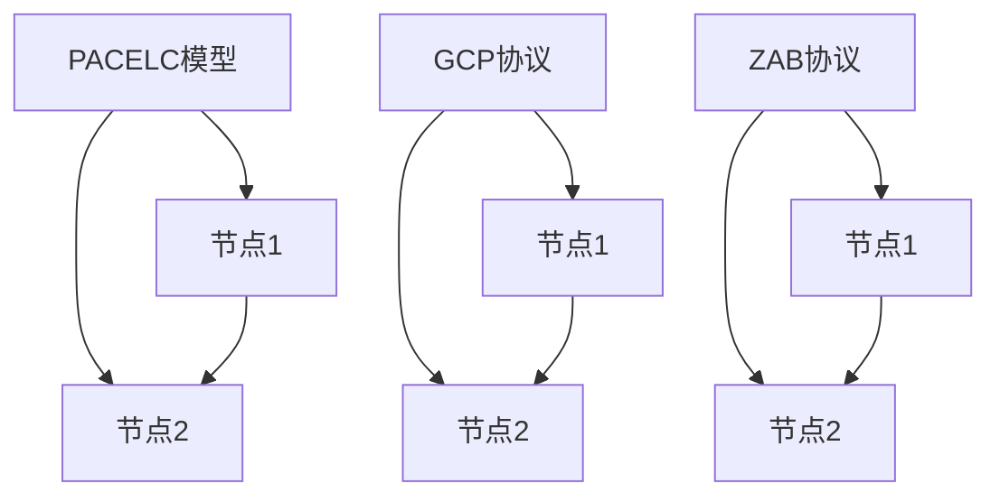

---

#### 第五部分：分布式一致性实践

##### 第5章：分布式一致性实践

**5.1 分布式一致性实践步骤**

**核心概念原理**：分布式一致性实践包括以下步骤：

1. **需求分析**：确定系统的数据一致性需求。
2. **算法选择**：根据需求选择合适的一致性算法。
3. **系统设计**：设计符合一致性需求的系统架构。
4. **实现与测试**：实现一致性算法并进行测试。

**ER实体关系图架构**：

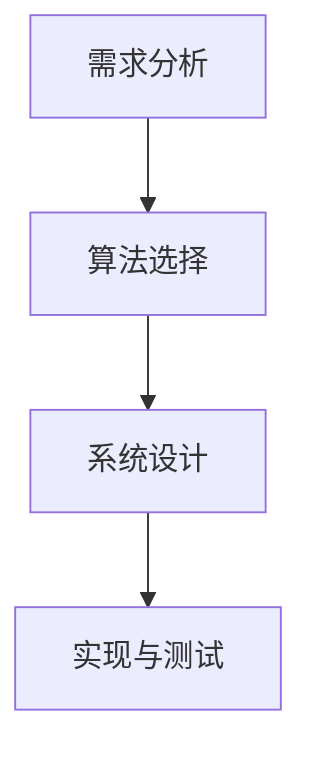

---

**5.2 分布式一致性实践案例**

**核心概念原理**：通过实际案例展示分布式一致性实践的过程和结果。

**ER实体关系图架构**：

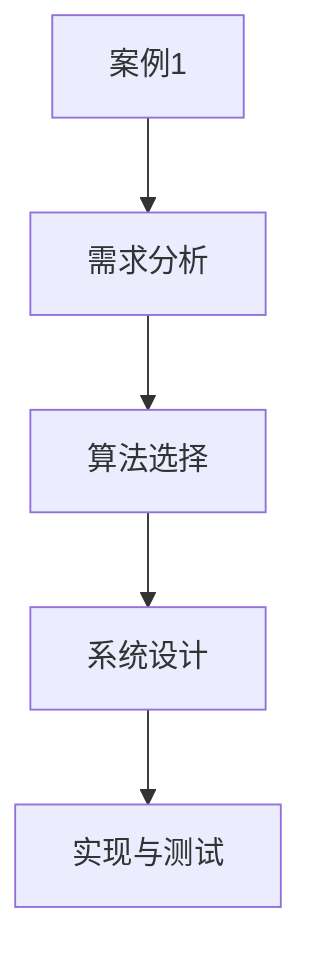

---

**5.3 分布式一致性实践总结**

**核心概念原理**：总结分布式一致性实践的经验和教训，为后续工作提供参考。

**ER实体关系图架构**：

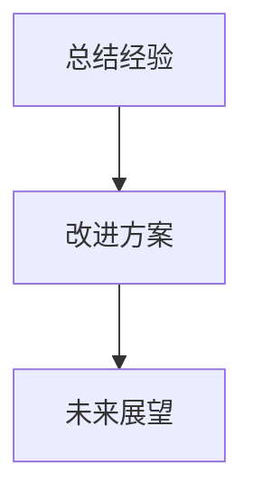

---

#### 第六部分：小结与展望

##### 第6章：小结与展望

**6.1 主要结论**

- **分布式一致性是现代分布式系统中的关键问题。**
- **大模型软件对数据一致性有更高的要求。**
- **多种分布式一致性算法可供选择。**

**ER实体关系图架构**：

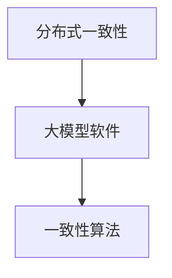

---

**6.2 展望未来**

- **研究更多高效的一致性算法。**
- **探索大模型软件与分布式一致性的新应用场景。**
- **提升分布式一致性的系统性能和可扩展性。**

**ER实体关系图架构**：

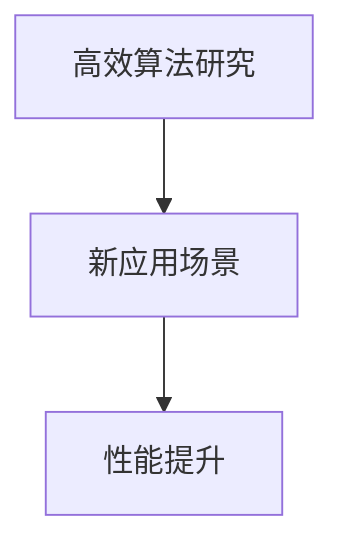

---

**6.3 研究方向与挑战**

- **一致性算法的可扩展性和性能优化。**
- **大模型软件中的数据一致性挑战。**
- **跨系统的数据一致性保证。**

**ER实体关系图架构**：

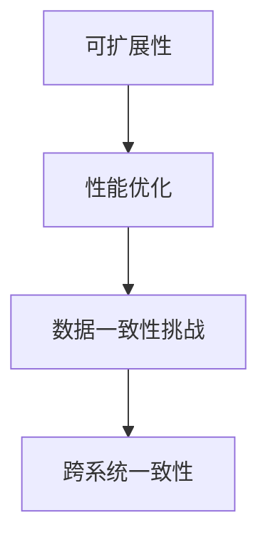

---

### 总结

本文从多个角度探讨了《大模型软件的分布式一致性保证机制》。通过详细的背景介绍、概念阐述、算法分析和实践总结，我们希望读者能够对分布式一致性在大模型软件中的应用有一个全面的理解。

**作者信息**：

- **作者：AI天才研究院/AI Genius Institute & 禅与计算机程序设计艺术 /Zen And The Art of Computer Programming**

