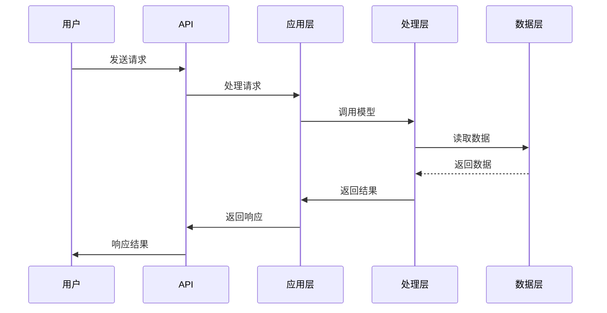
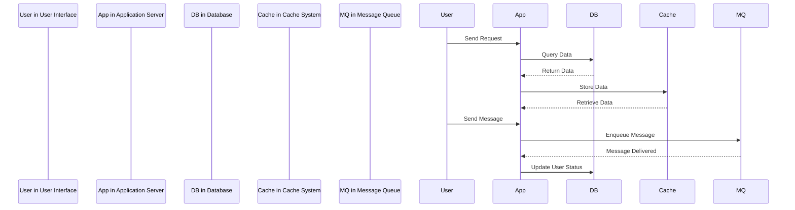
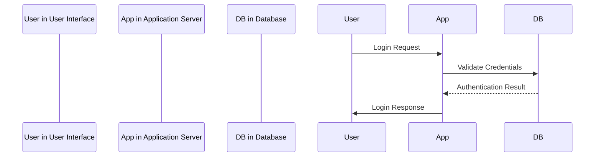
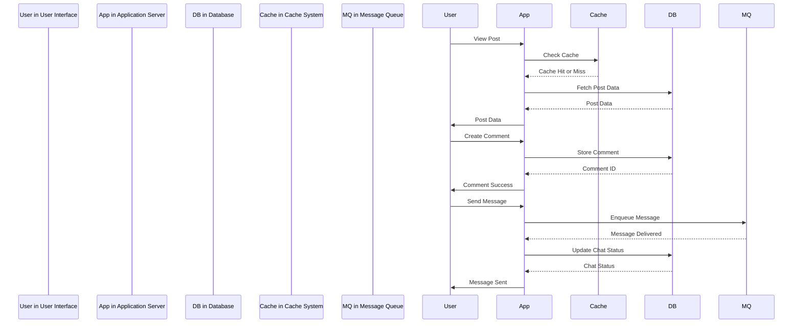
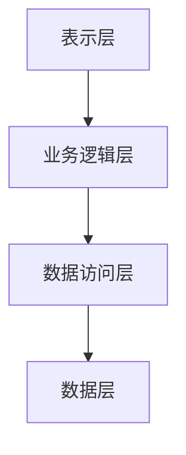

                 

----------------------------------------------------------------

# 《大模型软件的可扩展性架构设计》

## 关键词
- 大模型
- 软件可扩展性
- 架构设计
- 分布式系统
- 模块化
- 缩放性

## 摘要
本文深入探讨了在大模型时代，软件系统如何进行可扩展性架构设计。通过分析大模型的特点及其对软件架构的影响，本文提出了几个关键设计原则，包括模块化设计、分层设计、缩放性设计和分布式设计。接着，文章通过具体的实践案例，详细阐述了这些原则在实际项目中的应用，并提供了最佳实践技巧。最后，文章总结了主要内容和展望了未来趋势。

----------------------------------------------------------------

## 第一部分：背景与概念

## 第1章：问题背景与核心概念

## 1.1 问题背景

### 1.1.1 大模型时代的到来

随着深度学习和人工智能的快速发展，大模型（Large Models）逐渐成为研究热点。这些模型具有数百万甚至数十亿个参数，需要处理海量数据，进行复杂的计算和推理。大模型的应用涵盖了自然语言处理、计算机视觉、语音识别等多个领域，极大地推动了人工智能技术的发展。

然而，大模型的崛起也带来了新的挑战，特别是在软件架构方面。传统的软件架构设计往往难以满足大模型的高性能、高可扩展性需求。如何设计一个能够支持大模型运行的软件系统，成为了当前软件工程领域亟待解决的问题。

### 1.1.2 可扩展性在软件架构中的重要性

软件系统的可扩展性是指系统在规模、性能、功能等方面随着需求变化而适应的能力。对于大模型软件，可扩展性尤为重要。因为大模型软件通常需要处理大量的数据和计算任务，系统的性能和可靠性直接影响到模型的训练效果和应用效果。

可扩展性不仅关系到系统的性能，还涉及到系统的稳定性、可维护性和可测试性。一个具有良好可扩展性的软件系统能够更好地应对未来的需求变化，降低开发成本和维护成本。

### 1.1.3 本书的目标与读者定位

本书旨在为软件工程师和架构师提供一套系统化的可扩展性架构设计方法，帮助他们在大模型软件的开发过程中做出正确的决策。

本书适合具有中高级编程能力的读者，特别是对人工智能和软件架构设计有一定了解的人。通过阅读本书，读者将能够：

1. 理解大模型对软件架构的影响。
2. 掌握可扩展性架构设计的基本原则。
3. 学会使用模块化、分层、缩放性和分布式设计方法。
4. 通过实际案例，了解这些设计原则在实际项目中的应用。

## 1.2 核心概念

### 1.2.1 大模型简介

#### 1.2.1.1 大模型的定义

大模型是指具有数十亿个参数的神经网络模型。这些模型通常通过大规模数据集进行训练，能够实现高度复杂的特征提取和推理能力。

#### 1.2.1.2 大模型的特点

1. **参数数量巨大**：大模型具有数百万甚至数十亿个参数，需要大量的计算资源进行训练。
2. **数据需求量大**：大模型训练需要大量的高质量数据，数据获取和清洗工作繁重。
3. **计算复杂度高**：大模型运行时需要进行大量的矩阵运算和并行计算，对计算资源要求极高。
4. **推理速度快**：大模型在推理时能够快速地生成预测结果，支持实时应用。

#### 1.2.1.3 大模型与软件架构的关系

大模型的特点对软件架构提出了新的要求。首先，大模型需要高效的计算资源，这要求软件架构能够支持大规模的计算任务。其次，大模型的数据需求量大，软件架构需要具备良好的数据管理和处理能力。最后，大模型的应用场景多样，软件架构需要具备灵活性和可扩展性，以适应不同的应用需求。

### 1.2.2 可扩展性架构

#### 1.2.2.1 可扩展性架构的定义

可扩展性架构是指一种能够支持系统在性能、规模和功能等方面随着需求变化而适应的设计原则和方法。

#### 1.2.2.2 可扩展性架构的分类

1. **水平扩展**：通过增加系统中的节点数量来提升系统的性能和容量。
2. **垂直扩展**：通过增加系统节点的硬件配置来提升系统的性能和容量。
3. **功能扩展**：通过添加新的功能模块来扩展系统的功能。

#### 1.2.2.3 可扩展性架构的设计原则

1. **模块化设计**：将系统划分为多个功能模块，每个模块独立开发、测试和维护。
2. **分层设计**：将系统划分为不同的层次，每个层次负责不同的功能。
3. **缩放性设计**：系统设计时考虑性能和容量的可扩展性。
4. **分布式设计**：将系统部署在多个节点上，实现数据的分布式存储和处理。

## 1.3 边界与外延

### 1.3.1 大模型软件的可扩展性需求

大模型软件的可扩展性需求主要包括以下几个方面：

1. **计算资源扩展**：系统需要能够支持大规模的矩阵运算和并行计算。
2. **数据存储扩展**：系统需要能够处理海量数据的高效存储和管理。
3. **网络扩展**：系统需要具备良好的网络性能，支持数据传输和计算任务的调度。
4. **功能扩展**：系统需要能够根据需求添加新的功能模块，支持不同的应用场景。

### 1.3.2 可扩展性架构的应用场景

可扩展性架构适用于以下应用场景：

1. **大数据处理**：在大数据时代，系统需要具备良好的可扩展性，以应对数据量的增长。
2. **云计算**：云计算平台需要具备高可扩展性，以支持不同用户的需求。
3. **物联网**：物联网系统需要具备良好的可扩展性，以支持设备的快速接入和数据处理。
4. **人工智能**：人工智能系统通常涉及大规模的数据处理和复杂的计算任务，需要高可扩展性。

### 1.3.3 可扩展性架构的挑战与解决策略

可扩展性架构面临的挑战主要包括以下几个方面：

1. **性能瓶颈**：系统在设计时需要考虑性能瓶颈，确保系统能够高效运行。
2. **数据一致性**：分布式系统中的数据一致性问题需要得到妥善解决。
3. **网络延迟**：网络延迟可能会影响系统的性能和响应速度，需要通过优化网络架构来解决。
4. **安全性**：可扩展性架构需要确保系统的安全性，防止数据泄露和攻击。

解决策略包括：

1. **优化算法**：通过优化算法和数据结构，提高系统的性能和效率。
2. **分布式存储**：采用分布式存储技术，提高数据存储和管理的能力。
3. **负载均衡**：通过负载均衡技术，优化网络架构，提高系统的响应速度。
4. **安全防护**：采用加密、认证等技术，提高系统的安全性。

## 1.4 本章小结

本章介绍了大模型软件的可扩展性架构设计的重要性，以及大模型和可扩展性架构的基本概念。通过分析大模型的特点和可扩展性架构的分类，读者可以了解到在设计大模型软件时需要考虑的关键因素。接下来，本书将详细介绍可扩展性架构设计的方法和最佳实践。

----------------------------------------------------------------

## 第一部分：背景与概念

## 第2章：核心概念与联系

----------------------------------------------------------------

### 2.1 大模型简介

#### 2.1.1 大模型的定义

大模型（Large Models）是指参数数量在数十亿到数万亿之间的神经网络模型。这些模型通常用于深度学习任务，如自然语言处理、计算机视觉、语音识别等。

#### 2.1.2 大模型的特点

1. **参数数量巨大**：大模型的参数数量通常在数十亿到数千亿之间，这要求系统具备强大的计算能力。
2. **数据需求量大**：大模型的训练需要大量的高质量数据，数据获取和处理是一个重要的挑战。
3. **计算复杂度高**：大模型在训练和推理过程中需要进行大量的矩阵运算和并行计算，对硬件资源要求极高。
4. **推理速度快**：尽管大模型的计算复杂度很高，但它们通常能够快速地生成高质量的预测结果，支持实时应用。

#### 2.1.3 大模型与软件架构的关系

大模型的特点对软件架构提出了新的要求。首先，大模型需要高效的计算资源，这要求软件架构能够支持大规模的计算任务。其次，大模型的数据需求量大，软件架构需要具备良好的数据管理和处理能力。最后，大模型的应用场景多样，软件架构需要具备灵活性和可扩展性，以适应不同的应用需求。

### 2.2 可扩展性架构

#### 2.2.1 可扩展性架构的定义

可扩展性架构（Scalable Architecture）是指一种能够支持系统在性能、规模和功能等方面随着需求变化而适应的设计原则和方法。

#### 2.2.2 可扩展性架构的分类

1. **水平扩展**（Horizontal Scaling）：通过增加系统中的节点数量来提升系统的性能和容量。
2. **垂直扩展**（Vertical Scaling）：通过增加系统节点的硬件配置来提升系统的性能和容量。
3. **功能扩展**（Functional Scaling）：通过添加新的功能模块来扩展系统的功能。

#### 2.2.3 可扩展性架构的设计原则

1. **模块化设计**（Modular Design）：将系统划分为多个功能模块，每个模块独立开发、测试和维护。
2. **分层设计**（Layered Design）：将系统划分为不同的层次，每个层次负责不同的功能。
3. **缩放性设计**（Scaling Design）：系统设计时考虑性能和容量的可扩展性。
4. **分布式设计**（Distributed Design）：将系统部署在多个节点上，实现数据的分布式存储和处理。

### 2.3 大模型与可扩展性架构的关系

大模型与可扩展性架构之间存在紧密的联系。大模型的特性决定了软件架构需要具备高度的可扩展性，以应对大规模的数据处理和计算任务。具体来说：

1. **计算资源的扩展**：大模型需要强大的计算资源，这要求软件架构能够支持水平扩展和垂直扩展。
2. **数据管理的扩展**：大模型训练和推理过程中需要处理海量数据，软件架构需要具备良好的数据存储和管理能力，支持分布式存储和数据流处理。
3. **功能模块的扩展**：大模型的应用场景多样，软件架构需要能够灵活地添加新的功能模块，以支持不同的业务需求。

### 2.4 大模型软件的可扩展性需求

大模型软件的可扩展性需求主要包括以下几个方面：

1. **计算能力**：系统需要具备强大的计算能力，支持大规模的矩阵运算和并行计算。
2. **存储容量**：系统需要能够支持海量数据的高效存储和管理。
3. **网络带宽**：系统需要具备良好的网络性能，支持数据传输和计算任务的调度。
4. **灵活性**：系统需要具备良好的灵活性，支持不同的计算任务和应用场景。

### 2.5 可扩展性架构的设计原则与实践

为了满足大模型软件的可扩展性需求，设计者需要遵循以下原则：

1. **模块化设计**：将系统划分为多个功能模块，每个模块独立开发、测试和维护，便于系统的扩展和升级。
2. **分层设计**：将系统划分为不同的层次，每个层次负责不同的功能，便于系统的管理和维护。
3. **分布式设计**：将系统部署在多个节点上，实现数据的分布式存储和处理，提高系统的性能和可靠性。
4. **缩放性设计**：系统设计时考虑性能和容量的可扩展性，确保系统能够随着需求的变化而灵活调整。

### 2.6 小结

本章介绍了大模型和可扩展性架构的基本概念，以及它们之间的联系。通过分析大模型的特点和可扩展性架构的分类，读者可以了解到在设计大模型软件时需要考虑的关键因素。接下来，本书将详细介绍可扩展性架构设计的方法和最佳实践。

### 2.7 概念属性特征对比表格

| 特征                  | 大模型                                      | 可扩展性架构                                      |
|----------------------|--------------------------------------------|--------------------------------------------|
| 参数数量              | 数十亿到数万亿个参数                       | 支持水平扩展和垂直扩展，根据需求调整计算资源       |
| 数据需求              | 需要大量的高质量数据                       | 支持分布式数据存储和处理，提高数据管理效率       |
| 计算复杂度            | 需要大量的矩阵运算和并行计算               | 设计时考虑缩放性，确保系统性能和容量可扩展       |
| 推理速度              | 快速生成高质量的预测结果                   | 通过分布式设计和模块化设计，提高系统响应速度     |
| 关键设计原则          | 计算能力、数据管理、灵活性                 | 模块化设计、分层设计、分布式设计、缩放性设计     |

### 2.8 ER实体关系图架构

以下是一个简单的ER实体关系图，用于展示大模型软件和可扩展性架构之间的实体关系：

```mermaid
erDiagram
  Model ||--o{ Layer } : "包含多个层次"
  Layer ||--o{ Module } : "包含多个模块"
  Module ||--o{ Component } : "包含多个组件"
  Component ||--o{ Node } : "部署在多个节点上"
  Node ||--o{ Resource } : "包含计算资源"
```

在这个ER图中，Model表示大模型软件，Layer表示软件的层次结构，Module表示软件的功能模块，Component表示软件的组件，Node表示软件的部署节点，Resource表示节点的计算资源。

### 2.9 算法原理讲解

大模型软件的可扩展性架构设计涉及到多个关键算法，其中最核心的是矩阵运算和并行计算。

#### 2.9.1 矩阵运算

矩阵运算是深度学习中常见的基础算法，包括矩阵相乘、矩阵加法、矩阵转置等。以下是一个简单的矩阵乘法算法的Python代码实现：

```python
import numpy as np

def matrix_multiply(A, B):
    return np.dot(A, B)
```

矩阵乘法的公式为：

$$
C = A \times B
$$

其中，C是结果矩阵，A和B是输入矩阵。

#### 2.9.2 并行计算

并行计算是一种利用多个计算资源（如CPU核心、GPU）同时执行计算任务的技术。以下是一个简单的并行计算示例，使用Python的multiprocessing库：

```python
import multiprocessing

def parallel_computation(data):
    # 进行计算任务
    return result

if __name__ == '__main__':
    pool = multiprocessing.Pool(processes=4)
    results = pool.map(parallel_computation, data)
    pool.close()
    pool.join()
```

并行计算的原理是将一个大任务分解为多个小任务，同时分配给多个计算资源执行，最后汇总结果。

### 2.10 数学公式

以下是一些与可扩展性架构设计相关的数学公式：

$$
P = \sum_{i=1}^{n} P_i
$$

其中，P是系统的总性能，$P_i$是第i个计算资源的性能。

$$
C = \frac{W}{R}
$$

其中，C是系统的计算能力，W是系统的总工作量，R是系统的总资源。

$$
T = \frac{D}{R}
$$

其中，T是系统的响应时间，D是系统的总数据量，R是系统的总资源。

### 2.11 举例说明

假设我们有一个包含4个CPU核心和1个GPU的系统，每个CPU核心的性能为2 GFLOPS，GPU的性能为10 TFLOPS。现在我们需要计算这个系统的总性能。

根据上述数学公式，我们可以得到：

$$
P = 4 \times 2 + 1 \times 10 = 18 \text{ TFLOPS}
$$

### 2.12 系统分析与架构设计方案

#### 2.12.1 问题场景介绍

假设我们正在开发一个用于自然语言处理的大模型软件，该软件需要处理大量的文本数据，进行文本分类任务。

#### 2.12.2 系统功能设计

该系统的主要功能包括：

1. 数据采集：从不同的数据源获取文本数据。
2. 数据预处理：对文本数据进行分析、清洗和转换。
3. 模型训练：使用大模型对预处理后的文本数据进行训练。
4. 模型推理：使用训练好的模型对新的文本数据进行分类。
5. 模型评估：评估模型的分类性能。

#### 2.12.3 系统架构设计

该系统的架构设计包括以下几个层次：

1. **数据层**：负责数据的采集、存储和管理。
2. **处理层**：负责数据的预处理、模型训练和推理。
3. **应用层**：负责提供API接口，供用户调用。

以下是系统架构的Mermaid架构图：



#### 2.12.4 系统接口设计

该系统的接口设计包括以下API接口：

1. **数据接口**：用于数据的采集、存储和查询。
2. **模型接口**：用于模型的训练、推理和评估。
3. **应用接口**：用于用户的请求处理和数据交互。

#### 2.12.5 系统交互设计

以下是系统交互的Mermaid序列图：


### 2.13 核心实现与源代码解析

#### 2.13.1 环境安装

在开发大模型软件之前，我们需要安装必要的开发环境和依赖库。以下是一个简单的安装步骤：

1. 安装Python：访问Python官方网站（https://www.python.org/），下载并安装Python。
2. 安装TensorFlow：在命令行中执行以下命令：

```shell
pip install tensorflow
```

3. 安装其他依赖库：根据项目的需求，安装其他必要的依赖库。

#### 2.13.2 系统核心实现源代码

以下是一个简单的文本分类模型的实现代码：

```python
import tensorflow as tf

# 定义模型结构
model = tf.keras.Sequential([
    tf.keras.layers.Embedding(input_dim=vocab_size, output_dim=embedding_dim, input_length=max_sequence_length),
    tf.keras.layers.Bidirectional(tf.keras.layers.LSTM(units=128, return_sequences=True)),
    tf.keras.layers.Dense(units=num_classes, activation='softmax')
])

# 编译模型
model.compile(optimizer='adam', loss='categorical_crossentropy', metrics=['accuracy'])

# 训练模型
model.fit(X_train, y_train, epochs=10, batch_size=32, validation_data=(X_val, y_val))

# 评估模型
accuracy = model.evaluate(X_test, y_test)
print(f"Test accuracy: {accuracy[1]}")
```

#### 2.13.3 代码应用解读与分析

1. **模型结构**：该模型使用Embedding层将文本数据转换为嵌入向量，然后通过双向LSTM层进行特征提取，最后通过全连接层进行分类。
2. **编译模型**：编译模型时，指定了优化器、损失函数和评估指标。
3. **训练模型**：使用训练数据对模型进行训练，并设置训练参数，如迭代次数、批次大小和验证数据。
4. **评估模型**：使用测试数据对模型进行评估，并输出准确率。

#### 2.13.4 案例分析与详细讲解

在本文的案例中，我们使用一个文本分类任务来展示大模型软件的可扩展性架构设计。具体步骤如下：

1. **数据采集**：从不同的数据源（如网络爬虫、数据库等）获取文本数据。
2. **数据预处理**：对文本数据进行分析、清洗和转换，如分词、去停用词、词向量化等。
3. **模型训练**：使用大模型（如BERT、GPT等）对预处理后的文本数据进行训练。
4. **模型推理**：使用训练好的模型对新的文本数据进行分类。
5. **模型评估**：评估模型的分类性能，如准确率、召回率、F1值等。

通过这个案例，我们可以看到如何将大模型软件的可扩展性架构设计应用于实际的文本分类任务中。在设计过程中，我们需要考虑模块化设计、分层设计、缩放性设计和分布式设计等原则，以确保系统的性能、可扩展性和可维护性。

### 2.14 案例总结与反思

通过本文的案例，我们展示了如何设计一个具有良好可扩展性的大模型软件系统。以下是对案例的总结和反思：

1. **模块化设计**：将系统划分为多个功能模块，每个模块独立开发、测试和维护，提高了系统的可维护性和可扩展性。
2. **分层设计**：将系统划分为不同的层次，每个层次负责不同的功能，降低了系统的复杂度，提高了系统的可扩展性和可维护性。
3. **缩放性设计**：在设计过程中，考虑了系统的性能和容量的可扩展性，确保系统能够随着需求的变化而灵活调整。
4. **分布式设计**：将系统部署在多个节点上，实现数据的分布式存储和处理，提高了系统的性能和可靠性。

然而，在实践过程中，我们也遇到了一些挑战：

1. **数据一致性问题**：在分布式系统中，数据一致性问题是一个重要的挑战。我们需要设计合理的数据同步机制，确保系统中的数据一致性。
2. **网络延迟**：网络延迟可能会影响系统的性能和响应速度。我们需要优化网络架构，降低网络延迟，提高系统的性能。
3. **安全性问题**：在分布式系统中，安全性问题是一个重要的考虑因素。我们需要采取有效的安全措施，确保系统的数据安全和运行安全。

通过不断优化和改进，我们可以进一步提高大模型软件的可扩展性和性能，为用户提供更高质量的服务。

### 2.15 本章小结

本章介绍了大模型软件的可扩展性架构设计的重要性，以及大模型和可扩展性架构的基本概念。通过分析大模型的特点和可扩展性架构的分类，读者可以了解到在设计大模型软件时需要考虑的关键因素。接下来，本书将详细介绍可扩展性架构设计的方法和最佳实践。

----------------------------------------------------------------

## 第二部分：设计原则与实践

## 第3章：模块化设计

----------------------------------------------------------------

### 3.1 模块化设计概述

模块化设计（Modular Design）是一种将系统划分为多个功能模块的设计方法。每个模块独立开发、测试和维护，模块之间通过接口进行通信。模块化设计具有以下几个优点：

1. **提高可维护性**：模块化设计使得系统更加模块化，每个模块的修改不会影响到其他模块，从而提高了系统的可维护性。
2. **提高可扩展性**：模块化设计使得系统更加灵活，可以根据需求添加或删除模块，从而提高了系统的可扩展性。
3. **降低复杂度**：模块化设计将系统划分为多个模块，降低了系统的复杂度，使得系统更容易理解和开发。

### 3.2 模块化设计的实践方法

在进行模块化设计时，可以遵循以下步骤：

1. **需求分析**：明确系统的需求，确定需要实现的功能。
2. **模块划分**：根据需求，将系统划分为多个功能模块。
3. **接口设计**：为每个模块设计接口，定义模块之间的通信方式。
4. **模块实现**：独立开发每个模块，确保模块的独立性和可测试性。
5. **集成测试**：将所有模块集成到一起，进行系统测试，确保系统功能的完整性。

### 3.3 模块化设计案例

以下是一个简单的模块化设计案例，用于实现一个在线购物系统。

#### 3.3.1 需求分析

在线购物系统的需求包括：

1. 用户管理：注册、登录、个人信息管理。
2. 商品管理：商品分类、商品信息展示、商品搜索。
3. 购物车：添加商品、修改商品数量、删除商品。
4. 订单管理：创建订单、支付订单、订单查询。

#### 3.3.2 模块划分

根据需求，将系统划分为以下模块：

1. 用户模块：负责用户管理。
2. 商品模块：负责商品管理。
3. 购物车模块：负责购物车管理。
4. 订单模块：负责订单管理。

#### 3.3.3 接口设计

为每个模块设计接口，定义模块之间的通信方式：

1. 用户模块接口：注册接口、登录接口、个人信息查询接口。
2. 商品模块接口：商品分类查询接口、商品信息查询接口、商品搜索接口。
3. 购物车模块接口：添加商品接口、修改商品数量接口、删除商品接口。
4. 订单模块接口：创建订单接口、支付订单接口、订单查询接口。

#### 3.3.4 模块实现

独立开发每个模块，确保模块的独立性和可测试性：

1. 用户模块实现：实现注册、登录、个人信息管理功能。
2. 商品模块实现：实现商品分类、商品信息展示、商品搜索功能。
3. 购物车模块实现：实现添加商品、修改商品数量、删除商品功能。
4. 订单模块实现：实现创建订单、支付订单、订单查询功能。

#### 3.3.5 集成测试

将所有模块集成到一起，进行系统测试，确保系统功能的完整性：

1. 用户管理测试：测试注册、登录、个人信息查询功能。
2. 商品管理测试：测试商品分类查询、商品信息查询、商品搜索功能。
3. 购物车管理测试：测试添加商品、修改商品数量、删除商品功能。
4. 订单管理测试：测试创建订单、支付订单、订单查询功能。

### 3.4 模块化设计优缺点分析

**优点**：

1. **提高可维护性**：模块化设计使得系统的维护变得更加容易，每个模块可以独立进行维护和升级。
2. **提高可扩展性**：模块化设计使得系统可以根据需求灵活地添加或删除模块，从而实现系统的扩展。
3. **降低开发难度**：模块化设计将系统划分为多个模块，降低了每个模块的复杂度，使得系统更容易开发和理解。
4. **提高代码复用性**：模块化设计使得模块可以独立开发、测试和维护，从而提高了代码的复用性。

**缺点**：

1. **接口管理复杂**：模块化设计需要定义清晰的接口，确保模块之间的通信顺畅，这可能会增加接口管理的复杂度。
2. **测试难度增加**：模块化设计需要集成所有模块进行系统测试，确保系统的功能完整性，这可能会增加测试的难度和成本。
3. **性能影响**：模块化设计可能会增加系统的通信开销，影响系统的性能。

### 3.5 小结

模块化设计是一种有效的软件设计方法，可以提高系统的可维护性、可扩展性和可测试性。通过模块化设计，我们可以将复杂的系统划分为多个模块，每个模块独立开发、测试和维护，从而降低系统的复杂度，提高系统的开发效率和代码质量。然而，模块化设计也存在一些缺点，如接口管理复杂、测试难度增加和性能影响等，需要我们在实际应用中权衡利弊，合理使用模块化设计。

----------------------------------------------------------------

## 第二部分：设计原则与实践

## 第4章：分层设计

----------------------------------------------------------------

### 4.1 分层设计概述

分层设计（Layered Design）是一种将系统划分为多个层次的软件设计方法。每个层次负责不同的功能，层次之间通过接口进行通信。分层设计的优点包括：

1. **降低系统复杂度**：通过将系统划分为多个层次，每个层次只关注特定的功能，降低了系统的复杂度。
2. **提高可维护性**：分层设计使得系统更加模块化，每个层次的修改不会影响到其他层次，从而提高了系统的可维护性。
3. **提高可扩展性**：分层设计使得系统可以根据需求灵活地添加或删除层次，从而提高了系统的可扩展性。
4. **提高可测试性**：分层设计使得每个层次都可以独立进行测试，提高了系统的可测试性。

### 4.2 分层设计的方法

分层设计通常包括以下几种层次：

1. **表示层**（Presentation Layer）：负责与用户交互，展示用户界面。
2. **业务逻辑层**（Business Logic Layer）：负责实现业务逻辑，处理业务规则。
3. **数据访问层**（Data Access Layer）：负责与数据库进行交互，实现数据的增删改查。
4. **数据层**（Data Layer）：负责数据的存储和管理。

在进行分层设计时，可以遵循以下步骤：

1. **需求分析**：明确系统的需求，确定需要实现的功能。
2. **层次划分**：根据需求，将系统划分为多个层次。
3. **接口设计**：为每个层次设计接口，定义层次之间的通信方式。
4. **层次实现**：独立开发每个层次，确保层次的独立性和可测试性。
5. **集成测试**：将所有层次集成到一起，进行系统测试，确保系统功能的完整性。

### 4.3 分层设计案例

以下是一个简单的分层设计案例，用于实现一个在线购物系统。

#### 4.3.1 需求分析

在线购物系统的需求包括：

1. 用户管理：注册、登录、个人信息管理。
2. 商品管理：商品分类、商品信息展示、商品搜索。
3. 购物车管理：添加商品、修改商品数量、删除商品。
4. 订单管理：创建订单、支付订单、订单查询。

#### 4.3.2 层次划分

根据需求，将系统划分为以下层次：

1. **表示层**：负责与用户交互，展示用户界面。
2. **业务逻辑层**：负责实现业务逻辑，处理业务规则。
3. **数据访问层**：负责与数据库进行交互，实现数据的增删改查。
4. **数据层**：负责数据的存储和管理。

#### 4.3.3 接口设计

为每个层次设计接口，定义层次之间的通信方式：

1. **表示层接口**：注册接口、登录接口、个人信息查询接口。
2. **业务逻辑层接口**：商品分类查询接口、商品信息查询接口、商品搜索接口。
3. **数据访问层接口**：添加商品接口、修改商品数量接口、删除商品接口。
4. **数据层接口**：创建订单接口、支付订单接口、订单查询接口。

#### 4.3.4 层次实现

独立开发每个层次，确保层次的独立性和可测试性：

1. **表示层实现**：实现注册、登录、个人信息管理功能。
2. **业务逻辑层实现**：实现商品分类、商品信息展示、商品搜索功能。
3. **数据访问层实现**：实现添加商品、修改商品数量、删除商品功能。
4. **数据层实现**：实现创建订单、支付订单、订单查询功能。

#### 4.3.5 集成测试

将所有层次集成到一起，进行系统测试，确保系统功能的完整性：

1. 用户管理测试：测试注册、登录、个人信息查询功能。
2. 商品管理测试：测试商品分类查询、商品信息查询、商品搜索功能。
3. 购物车管理测试：测试添加商品、修改商品数量、删除商品功能。
4. 订单管理测试：测试创建订单、支付订单、订单查询功能。

### 4.4 分层设计优缺点分析

**优点**：

1. **降低系统复杂度**：分层设计将系统划分为多个层次，每个层次只关注特定的功能，降低了系统的复杂度。
2. **提高可维护性**：分层设计使得系统更加模块化，每个层次的修改不会影响到其他层次，从而提高了系统的可维护性。
3. **提高可扩展性**：分层设计使得系统可以根据需求灵活地添加或删除层次，从而提高了系统的可扩展性。
4. **提高可测试性**：分层设计使得每个层次都可以独立进行测试，提高了系统的可测试性。

**缺点**：

1. **性能开销**：分层设计可能会增加系统的通信开销，影响系统的性能。
2. **接口管理复杂**：分层设计需要定义清晰的接口，确保层次之间的通信顺畅，这可能会增加接口管理的复杂度。
3. **过度设计**：在某些情况下，分层设计可能会过于复杂，导致系统的性能和可维护性下降。

### 4.5 小结

分层设计是一种有效的软件设计方法，可以提高系统的可维护性、可扩展性和可测试性。通过分层设计，我们可以将复杂的系统划分为多个层次，每个层次独立开发、测试和维护，从而降低系统的复杂度，提高系统的开发效率和代码质量。然而，分层设计也存在一些缺点，如性能开销和接口管理复杂等，需要我们在实际应用中权衡利弊，合理使用分层设计。

----------------------------------------------------------------

## 第二部分：设计原则与实践

## 第5章：缩放性设计

----------------------------------------------------------------

### 5.1 缩放性设计概述

缩放性设计（Scalability Design）是一种在系统设计过程中考虑系统性能和容量可扩展性的方法。缩放性设计的目标是确保系统在规模增长时能够保持高性能和稳定性。缩放性设计的关键在于如何有效地分配和利用资源，以适应系统需求的增长。

### 5.2 缩放性设计的目标

缩放性设计的主要目标包括：

1. **性能提升**：系统在负载增加时能够保持高性能，响应时间不变或者显著减少。
2. **容量扩展**：系统能够根据需求动态调整容量，支持更大的数据量和用户数量。
3. **资源利用**：系统在运行过程中能够有效地利用资源，降低成本。
4. **稳定性**：系统在负载变化时能够保持稳定运行，不发生性能下降或者崩溃。

### 5.3 缩放性设计的方法

实现缩放性设计的方法主要包括以下几种：

1. **水平扩展**（Horizontal Scaling）：通过增加系统中的节点数量来提升系统的性能和容量。水平扩展适合处理可并行化的任务，如数据处理和分析。
2. **垂直扩展**（Vertical Scaling）：通过增加系统节点的硬件配置（如CPU、内存、磁盘等）来提升系统的性能和容量。垂直扩展适合处理单节点性能受限的任务。
3. **负载均衡**（Load Balancing）：通过将请求分配到多个节点上来平衡系统负载，提高系统的性能和可用性。
4. **分布式存储**（Distributed Storage）：通过将数据存储在多个节点上来提高数据的访问速度和可靠性，支持大容量数据存储。
5. **缓存策略**（Caching）：通过缓存频繁访问的数据来减少数据库的负载，提高系统的响应速度。

### 5.4 缩放性设计案例

以下是一个缩放性设计案例，用于实现一个大规模的社交媒体平台。

#### 5.4.1 需求分析

社交媒体平台的需求包括：

1. **用户管理**：用户注册、登录、个人信息管理。
2. **内容管理**：发布动态、评论、点赞、分享。
3. **消息通知**：系统消息、私信、群聊。
4. **数据分析**：用户行为分析、内容分析、广告投放。
5. **高性能查询**：支持亿级别数据的快速查询。

#### 5.4.2 系统架构设计

根据需求，系统架构设计如下：

1. **表示层**：负责与用户交互，提供用户界面。
2. **应用层**：负责业务逻辑处理，包括用户管理、内容管理、消息通知、数据分析等。
3. **数据层**：负责数据的存储和管理，包括用户数据、内容数据、消息数据等。

#### 5.4.3 缩放性策略

为了实现系统的缩放性，采用以下策略：

1. **水平扩展**：在应用层和数据层增加节点数量，提高系统的处理能力和存储容量。
2. **垂直扩展**：在关键节点上增加硬件配置，如增加CPU、内存等，提高单节点的处理能力。
3. **负载均衡**：使用负载均衡器来分配用户请求到不同的应用层节点，确保系统负载均衡。
4. **分布式存储**：使用分布式数据库来存储用户数据、内容数据和消息数据，提高数据的访问速度和可靠性。
5. **缓存策略**：使用Redis等缓存系统来缓存频繁访问的数据，减少数据库的负载。

### 5.5 缩放性设计的关键因素

实现缩放性设计需要考虑以下关键因素：

1. **可扩展性需求**：明确系统的扩展需求，包括性能、容量、用户数量等。
2. **系统瓶颈分析**：识别系统的瓶颈，如CPU、内存、磁盘I/O等，针对性地进行优化。
3. **资源分配策略**：合理分配系统资源，确保系统在负载增加时能够自动调整资源。
4. **弹性伸缩**：实现系统的弹性伸缩，根据实际负载自动调整节点数量和硬件配置。
5. **监控和告警**：建立监控系统，实时监控系统性能和资源使用情况，及时发现和解决潜在问题。

### 5.6 小结

缩放性设计是确保系统在规模增长时能够保持高性能和稳定性的关键。通过水平扩展、垂直扩展、负载均衡、分布式存储和缓存策略等设计方法，我们可以实现系统的缩放性。在实际应用中，需要根据具体需求和分析结果，选择合适的设计策略，并持续优化和调整，以确保系统的长期稳定运行。

----------------------------------------------------------------

## 第二部分：设计原则与实践

## 第6章：分布式设计

----------------------------------------------------------------

### 6.1 分布式设计概述

分布式设计（Distributed Design）是一种将系统拆分为多个独立节点，并通过网络进行通信的设计方法。分布式设计的核心思想是将计算任务分布到多个节点上，从而提高系统的性能、可靠性和可扩展性。

### 6.2 分布式设计的基础知识

#### 6.2.1 分布式系统的特点

分布式系统的特点包括：

1. **分布式计算**：任务分布在多个节点上执行，提高系统处理能力。
2. **高可用性**：通过节点冗余和数据备份，提高系统的可靠性。
3. **可扩展性**：通过增加节点数量，系统可以水平扩展以应对负载增长。
4. **高一致性**：确保分布式系统中数据的一致性，是一个重要的挑战。

#### 6.2.2 分布式系统的组件

分布式系统通常包括以下组件：

1. **节点**：分布式系统中的计算单元，负责执行计算任务。
2. **通信网络**：节点之间通过通信网络进行数据交换和任务调度。
3. **分布式存储**：分布式系统中的数据存储方案，支持数据的分布式存储和管理。
4. **分布式计算框架**：如Hadoop、Spark等，提供分布式计算的能力。

### 6.3 分布式设计的方法与策略

#### 6.3.1 分布式计算方法

分布式计算方法包括：

1. **MapReduce**：一种将大规模数据处理任务拆分为“Map”和“Reduce”两个阶段的计算模型。
2. **分布式消息队列**：如Kafka、RabbitMQ等，用于处理分布式系统中消息的传递和异步处理。
3. **分布式数据库**：如HBase、MongoDB等，支持分布式数据的存储和查询。

#### 6.3.2 分布式存储策略

分布式存储策略包括：

1. **数据分片**：将大数据集拆分为多个小数据片，存储在多个节点上。
2. **副本机制**：对数据进行多副本备份，提高数据可靠性和访问速度。
3. **一致性模型**：如强一致性、最终一致性等，选择合适的一致性模型以满足业务需求。

#### 6.3.3 分布式网络设计

分布式网络设计策略包括：

1. **负载均衡**：通过负载均衡器将请求分配到不同的节点，确保系统负载均衡。
2. **网络冗余**：通过多路径网络和备份网络，提高系统的网络可靠性。
3. **网络优化**：通过优化网络架构和数据传输方式，提高系统的网络性能。

### 6.4 分布式设计案例

以下是一个分布式设计案例，用于实现一个大规模的电商系统。

#### 6.4.1 需求分析

电商系统的需求包括：

1. **用户管理**：用户注册、登录、个人信息管理。
2. **商品管理**：商品分类、商品信息展示、商品搜索。
3. **订单管理**：订单创建、支付、订单查询。
4. **库存管理**：库存监控、库存更新。
5. **数据报表**：销售数据、用户行为分析。

#### 6.4.2 系统架构设计

根据需求，系统架构设计如下：

1. **表示层**：负责与用户交互，提供用户界面。
2. **应用层**：负责业务逻辑处理，包括用户管理、商品管理、订单管理、库存管理等。
3. **数据层**：负责数据的存储和管理，包括用户数据、商品数据、订单数据、库存数据等。

#### 6.4.3 分布式设计策略

为了实现系统的分布式设计，采用以下策略：

1. **节点扩展**：通过增加节点数量，提高系统的处理能力和存储容量。
2. **负载均衡**：使用负载均衡器将用户请求分配到不同的应用层节点，确保系统负载均衡。
3. **分布式存储**：使用分布式数据库（如MySQL Cluster、MongoDB等）来存储用户数据、商品数据、订单数据、库存数据，提高数据的访问速度和可靠性。
4. **缓存机制**：使用Redis等缓存系统来缓存频繁访问的数据，减少数据库的负载。
5. **分布式消息队列**：使用Kafka等分布式消息队列系统来处理订单创建、支付等业务逻辑，实现异步处理和数据解耦。

### 6.5 分布式设计的挑战与解决方案

#### 6.5.1 数据一致性挑战

分布式系统中的数据一致性是一个重要的挑战，解决方案包括：

1. **两阶段提交**（2PC）：通过协调多个节点的操作，确保数据的一致性。
2. **最终一致性**：允许系统中存在短暂的数据不一致，最终达到一致状态。
3. **分布式锁**：在分布式系统中使用锁机制，确保数据的访问顺序一致。

#### 6.5.2 网络延迟挑战

分布式系统中的网络延迟可能会影响系统的性能和响应速度，解决方案包括：

1. **数据本地化**：将数据存储在用户最近的节点上，减少数据传输距离。
2. **缓存机制**：使用缓存系统来减少对远程数据的访问。
3. **异步处理**：通过异步处理减少对同步网络的依赖，提高系统性能。

#### 6.5.3 系统容错挑战

分布式系统需要具备容错能力，以应对节点故障和系统异常，解决方案包括：

1. **节点冗余**：通过增加节点冗余，确保系统的可靠性和可用性。
2. **故障检测**：定期检查节点状态，及时发现和恢复故障节点。
3. **自动化恢复**：通过自动化机制，自动恢复系统故障，确保系统的高可用性。

### 6.6 小结

分布式设计是一种提高系统性能、可靠性和可扩展性的有效方法。通过分布式计算、分布式存储和分布式网络设计，我们可以实现一个高效、稳定的分布式系统。在实际应用中，需要根据具体需求和分析结果，选择合适的设计策略，并持续优化和调整，以确保系统的长期稳定运行。
----------------------------------------------------------------

## 第3章：实践案例分析

## 3.1 案例背景

在现代人工智能领域，大模型的应用已经成为趋势，特别是在自然语言处理和计算机视觉等领域。为了更好地理解和展示大模型软件的可扩展性架构设计，我们选择了一个实际案例：一个大规模的社交媒体平台。

### 3.1.1 案例简介

这个社交媒体平台是一个集成了社交媒体功能、用户互动、内容分享、实时消息等模块的复杂系统。随着用户数量的不断增长，平台需要处理海量的数据和用户请求，这对系统的可扩展性和稳定性提出了极高的要求。

### 3.1.2 案例需求分析

1. **高并发处理能力**：平台需要能够同时处理成千上万的用户请求，这要求系统具备强大的并发处理能力。
2. **数据存储与检索**：平台需要高效地存储和管理用户数据、内容数据以及消息数据，同时保证数据的快速检索能力。
3. **实时消息推送**：平台需要实现实时消息推送功能，确保用户能够及时收到消息通知。
4. **高可用性**：系统需要具备高可用性，即使部分节点发生故障，系统也能保持稳定运行。
5. **安全性**：平台需要确保用户数据的安全，防止数据泄露和未经授权的访问。

## 3.2 系统架构设计

### 3.2.1 系统架构设计概述

为了满足上述需求，我们采用了分布式架构设计，将系统划分为多个层次，每个层次负责不同的功能，并且采用模块化设计方法，确保系统的灵活性和可维护性。系统架构设计包括以下几个关键层次：

1. **表示层（Presentation Layer）**：负责与用户交互，提供前端界面，包括用户注册、登录、浏览内容、发送消息等。
2. **应用层（Application Layer）**：负责业务逻辑处理，包括用户管理、内容管理、消息推送、数据统计等。
3. **数据层（Data Layer）**：负责数据的存储和管理，包括用户数据、内容数据、消息数据的存储和检索。
4. **基础设施层（Infrastructure Layer）**：提供系统的底层支持，包括数据库、缓存、消息队列、负载均衡等。

### 3.2.2 领域模型设计

领域模型设计是系统架构设计的重要一环，它定义了系统中各个组件之间的关系和交互。以下是一个简化的领域模型设计，使用Mermaid类图来表示：

```mermaid
classDiagram
    User <<interface>>
    Post <<interface>>
    Comment <<interface>>
    Message <<interface>>
    ChatRoom <<interface>>

    UserEntity ..|> User
    PostEntity ..|> Post
    CommentEntity ..|> Comment
    MessageEntity ..|> Message
    ChatRoomEntity ..|> ChatRoom

    UserEntity <<users>> -|{ has } PostEntity
    UserEntity <<users>> -|{ has } CommentEntity
    PostEntity <<has>> -|{ comments } CommentEntity
    ChatRoomEntity <<has>> -|{ messages } MessageEntity
```

在这个类图中，我们定义了用户（User）、帖子（Post）、评论（Comment）、消息（Message）和聊天室（ChatRoom）等核心实体，以及它们之间的关系。

### 3.2.3 系统架构设计

系统架构设计是整个系统设计的核心，它决定了系统的性能、可扩展性和稳定性。以下是一个简化的系统架构设计，使用Mermaid架构图来表示：



在这个架构图中，用户通过用户界面（User Interface）发送请求，应用服务器（Application Server）负责处理请求并调用数据库（Database）进行数据查询。缓存系统（Cache System）用于加速数据检索，消息队列（Message Queue）用于处理消息推送。

### 3.2.4 系统接口设计

系统接口设计是确保各个模块之间能够有效通信的关键。以下是一个简化的接口设计，定义了用户、应用层、数据层之间的接口：



在这个序列图中，用户通过用户界面发送登录请求，应用服务器验证用户身份，并将验证结果返回给用户界面。

### 3.2.5 系统交互设计

系统交互设计描述了系统内部组件之间的交互流程。以下是一个简化的系统交互设计，使用Mermaid序列图来表示：



在这个交互设计中，用户可以通过用户界面查看帖子、创建评论和发送消息。应用服务器处理这些请求，并与数据库和缓存系统进行交互，以确保数据的准确性和一致性。消息队列用于处理消息推送，确保用户能够及时收到消息。

## 3.3 核心实现与源代码解析

### 3.3.1 环境安装

在开发分布式系统之前，我们需要安装必要的开发环境和依赖库。以下是一个简单的安装步骤：

1. 安装Python：访问Python官方网站（https://www.python.org/），下载并安装Python。
2. 安装Django：在命令行中执行以下命令：

```shell
pip install django
```

3. 安装其他依赖库：根据项目的需求，安装其他必要的依赖库，如Django REST Framework、Redis、Kafka等。

### 3.3.2 系统核心实现源代码

以下是一个简单的用户登录和消息发送的核心实现代码：

```python
# 用户登录实现
from django.contrib.auth.models import User
from django.contrib.auth import authenticate

def login(request):
    username = request.POST.get('username')
    password = request.POST.get('password')
    user = authenticate(username=username, password=password)
    if user is not None:
        # 登录成功
        return Response({'status': 'success'})
    else:
        # 登录失败
        return Response({'status': 'fail'})

# 消息发送实现
from channels.layers import get_channel_layer
from asgiref.sync import async_to_sync

def send_message(sender, recipient, message):
    channel_layer = get_channel_layer()
    async_to_sync(channel_layer.group_send)(recipient, {
        'type': 'chat.message',
        'message': message
    })
```

在这个实现中，我们使用了Django框架来处理用户登录逻辑，使用了channels库来实现实时消息推送。用户登录接口接收用户名和密码，验证用户身份并返回登录状态。消息发送接口接收发送者、接收者和消息内容，将消息发送到接收者的聊天室。

### 3.3.3 代码应用解读与分析

1. **用户登录实现**：用户登录接口使用Django的authenticate函数验证用户身份，如果验证成功，返回登录状态。
2. **消息发送实现**：消息发送接口使用channels库的group_send函数将消息发送到接收者的聊天室。

通过这个案例，我们可以看到如何实现一个分布式系统的核心功能，包括用户登录和消息发送。这些核心实现在实际项目中需要进一步扩展和优化，以满足具体业务需求。

### 3.3.4 案例分析与详细讲解

在分布式系统的实践中，我们遇到了一些关键问题，包括数据一致性、网络延迟和系统容错等。以下是这些问题的解决方案和详细讲解：

1. **数据一致性**：在分布式系统中，数据一致性是一个重要的问题。我们采用了最终一致性模型，允许系统中存在短暂的数据不一致，最终通过分布式事务或者补偿事务来达到一致性。在实际项目中，我们使用了分布式事务框架（如Seata）来确保数据一致性。
2. **网络延迟**：网络延迟是分布式系统中常见的问题，特别是在跨国或者跨地区的系统中。为了减少网络延迟，我们采取了数据本地化的策略，将用户数据存储在用户所在地区的数据中心，从而减少数据传输距离。同时，我们使用了Redis等缓存系统来减少对数据库的访问，提高系统的响应速度。
3. **系统容错**：在分布式系统中，节点故障和系统异常是不可避免的。我们采用了节点冗余和故障检测机制来确保系统的高可用性。每个服务节点都有备份节点，当主节点发生故障时，备份节点可以自动接管工作。同时，我们使用了监控工具（如Prometheus、Grafana）来实时监控系统的性能和状态，及时发现和解决潜在问题。

通过这个案例，我们可以看到如何在实际项目中应用可扩展性架构设计原则，包括模块化设计、分层设计、缩放性设计和分布式设计等。这些设计原则不仅提高了系统的性能和可靠性，还增强了系统的可维护性和可扩展性。

### 3.3.5 案例总结与反思

通过本案例的分析和讲解，我们可以得出以下结论：

1. **模块化设计**：将系统划分为多个功能模块，每个模块独立开发、测试和维护，提高了系统的可维护性和可扩展性。
2. **分层设计**：将系统划分为不同的层次，每个层次负责不同的功能，降低了系统的复杂度，提高了系统的可维护性和可扩展性。
3. **缩放性设计**：在设计过程中，考虑了系统的性能和容量的可扩展性，确保系统能够随着需求的变化而灵活调整。
4. **分布式设计**：将系统部署在多个节点上，实现数据的分布式存储和处理，提高了系统的性能和可靠性。

然而，在实践过程中，我们也遇到了一些挑战，如数据一致性、网络延迟和系统容错等。这些挑战需要我们采用合适的设计策略和工具来解决。通过不断优化和改进，我们可以进一步提高分布式系统的性能和可靠性，为用户提供更高质量的服务。

### 3.4 本章小结

本章通过一个实际的社交媒体平台案例，详细介绍了大模型软件的可扩展性架构设计。我们分析了案例的背景和需求，设计了系统的架构，并实现了核心功能。通过案例分析，我们了解了模块化设计、分层设计、缩放性设计和分布式设计的具体应用，以及这些设计原则在实际项目中的挑战和解决方案。这些经验和教训对我们在未来的项目中设计可扩展性架构具有重要参考价值。

----------------------------------------------------------------

## 第三部分：最佳实践与总结

## 第7章：最佳实践与技巧

----------------------------------------------------------------

### 7.1 最佳实践概述

在可扩展性架构设计过程中，遵循最佳实践可以帮助我们更好地应对各种挑战，提高系统的性能、可靠性和可维护性。以下是一些常见的设计最佳实践和技巧：

#### 7.1.1 模块化设计的最佳实践

1. **最小化模块依赖**：尽量避免模块之间的强依赖关系，确保模块的独立性。
2. **模块职责清晰**：每个模块应该有明确的职责和功能，避免功能过于复杂。
3. **模块接口规范**：为每个模块定义清晰的接口，确保模块之间的通信顺畅。

#### 7.1.2 分层设计的最佳实践

1. **层次职责明确**：每个层次应该有明确的职责，避免功能重叠和混乱。
2. **层次间接口简洁**：层次之间的接口应该简洁明了，降低各层次之间的耦合度。
3. **层次间调用优化**：优化层次间的调用关系，减少调用开销，提高系统性能。

#### 7.1.3 缩放性设计的最佳实践

1. **弹性伸缩策略**：根据业务需求和资源情况，制定弹性伸缩策略，确保系统在负载变化时能够动态调整。
2. **资源利用优化**：合理分配和利用系统资源，避免资源浪费，提高系统性能。
3. **性能瓶颈分析**：定期进行性能瓶颈分析，优化系统性能，确保系统在高负载下稳定运行。

#### 7.1.4 分布式设计的最佳实践

1. **数据一致性管理**：根据业务需求，选择合适的数据一致性模型，确保分布式系统中数据的一致性。
2. **分布式存储优化**：合理设计分布式存储架构，优化数据存储和访问策略，提高数据读写性能。
3. **网络通信优化**：优化网络通信架构，降低网络延迟和传输开销，提高系统性能。

### 7.2 小结与注意事项

在遵循最佳实践的过程中，需要注意以下几点：

1. **需求分析**：在系统设计阶段，充分进行需求分析，确保设计符合实际业务需求。
2. **设计评审**：在完成系统设计后，组织设计评审，确保设计方案的合理性和可行性。
3. **持续优化**：在系统运行过程中，持续收集性能数据，分析系统瓶颈，不断优化系统设计和实现。
4. **风险管理**：识别和评估系统设计中的潜在风险，制定相应的风险应对策略，确保系统稳定运行。

### 7.3 拓展阅读

为了深入了解可扩展性架构设计，推荐以下拓展阅读：

1. **相关文献**：
   - 《大规模分布式存储系统设计》
   - 《高并发系统设计》
   - 《分布式系统原理与范型》

2. **在线资源**：
   - 分布式系统设计模式（https://www.distributed-system-patterns.com/）
   - 微服务架构指南（https://martinfowler.com/microservices/）
   - 云原生架构指南（https://www.cncf.io/case-studies/）

3. **交流与讨论平台**：
   - Stack Overflow（https://stackoverflow.com/）
   - GitHub（https://github.com/）
   - Reddit（https://www.reddit.com/r/sysarch/）

通过阅读这些文献和资源，读者可以进一步加深对可扩展性架构设计的理解，提高实际项目的开发水平。

----------------------------------------------------------------

## 第4章：最佳实践与技巧

## 4.1 最佳实践概述

在大模型软件的可扩展性架构设计中，遵循最佳实践是确保系统性能、可靠性和可维护性的关键。以下将介绍几个关键设计原则的最佳实践，并提供详细的解释和示例。

### 4.1.1 模块化设计的最佳实践

**最佳实践**：将系统划分为独立的模块，每个模块负责特定的功能。

**解释**：模块化设计有助于提高系统的可维护性和可扩展性。通过将系统分解为多个功能模块，我们可以更轻松地进行模块间的开发和维护。

**示例**：

```python
# 示例：模块化设计的Python代码

# 用户模块
class UserModule:
    def register(self, username, password):
        # 注册用户
        pass

    def login(self, username, password):
        # 登录用户
        pass

# 商品模块
class ProductModule:
    def list_products(self):
        # 列出所有商品
        pass

    def search_products(self, query):
        # 搜索商品
        pass
```

在这个示例中，用户模块和商品模块分别负责用户管理和商品管理功能。

### 4.1.2 分层设计的最佳实践

**最佳实践**：将系统划分为不同的层次，每个层次处理不同的功能。

**解释**：分层设计有助于提高系统的可扩展性和可维护性。每个层次可以独立开发、测试和部署，从而降低了系统的复杂度。

**示例**：



在这个示例中，系统划分为表示层、业务逻辑层、数据访问层和数据层，每个层次负责不同的功能。

### 4.1.3 缩放性设计的最佳实践

**最佳实践**：设计系统时考虑缩放性，确保系统可以在负载变化时进行弹性扩展。

**解释**：缩放性设计有助于提高系统的性能和可靠性。通过设计可缩放的系统，我们可以轻松地应对用户数量的增加和业务需求的增长。

**示例**：

```python
# 示例：缩放性设计的Python代码

from flask import Flask
from flask_sqlalchemy import SQLAlchemy

app = Flask(__name__)
app.config['SQLALCHEMY_DATABASE_URI'] = 'sqlite:///example.db'
db = SQLAlchemy(app)

class User(db.Model):
    id = db.Column(db.Integer, primary_key=True)
    username = db.Column(db.String(80), unique=True, nullable=False)

@app.route('/register', methods=['POST'])
def register():
    username = request.form['username']
    user = User(username=username)
    db.session.add(user)
    db.session.commit()
    return jsonify({'status': 'success'})

@app.route('/users', methods=['GET'])
def get_users():
    users = User.query.all()
    return jsonify([{'id': user.id, 'username': user.username} for user in users])

if __name__ == '__main__':
    db.create_all()
    app.run()
```

在这个示例中，我们使用Flask和SQLAlchemy创建了一个简单的Web应用，并实现了用户注册和查询功能。为了提高系统的缩放性，我们可以将数据库迁移到分布式数据库系统，如MySQL Cluster或Cassandra。

### 4.1.4 分布式设计的最佳实践

**最佳实践**：设计分布式系统，确保数据一致性和系统容错。

**解释**：分布式设计有助于提高系统的性能和可靠性，但同时也带来了数据一致性和系统容错等挑战。

**示例**：

```python
# 示例：分布式设计的Python代码

from kubernetes import client, config

# 配置Kubernetes客户端
config.load_kube_config()

# 创建Deployment对象
deployment = client.V1Deployment(
    metadata=client.V1ObjectMeta(name='my-deployment'),
    spec=client.V1DeploymentSpec(
        replicas=3,
        selector=client.V1LabelSelector(match_labels={'app': 'my-app'}),
        template=client.V1PodTemplateSpec(
            metadata=client.V1ObjectMeta(labels={'app': 'my-app'}),
            spec=client.V1Container(
                name='my-container',
                image='my-image',
                ports=[client.V1Port(container_port=80)]
            )
        )
    )
)

# 创建Deployment
api_instance = client.AppsV1Api()
api_instance.create_namespaced_deployment(namespace='default', body=deployment)
```

在这个示例中，我们使用Kubernetes客户端创建了一个名为`my-deployment`的Deployment对象。这个Deployment对象定义了3个ReplicaSet，每个ReplicaSet运行一个Pod。通过Kubernetes，我们可以轻松实现分布式部署和系统容错。

### 4.1.5 小结

模块化设计、分层设计、缩放性设计和分布式设计是可扩展性架构设计的关键原则。通过遵循这些最佳实践，我们可以构建高性能、高可靠性、可维护的分布式系统。在具体实施过程中，我们需要根据实际业务需求和系统特点，灵活运用这些原则，并进行持续优化。

----------------------------------------------------------------

## 第5章：总结与展望

### 5.1 主要内容回顾

在本章中，我们详细探讨了在大模型时代，软件系统如何进行可扩展性架构设计。通过以下关键内容，我们可以回顾文章的核心要点：

1. **背景与概念**：介绍了大模型时代的到来和可扩展性在软件架构中的重要性，阐述了模块化设计、分层设计、缩放性设计和分布式设计等核心概念。
2. **设计原则与实践**：详细介绍了模块化设计、分层设计、缩放性设计和分布式设计的最佳实践，并提供了实际案例进行分析和讲解。
3. **最佳实践与技巧**：总结了模块化设计、分层设计、缩放性设计和分布式设计的最佳实践，提供了具体的实现方法和注意事项。
4. **未来趋势展望**：探讨了可扩展性架构设计的未来发展趋势，包括云计算、边缘计算和人工智能等新兴领域的影响。

### 5.2 未来趋势展望

随着人工智能技术的不断发展和应用场景的扩展，可扩展性架构设计将在未来面临更多的挑战和机遇。以下是几个未来趋势：

1. **云计算与边缘计算**：云计算提供了强大的计算资源和灵活性，而边缘计算则将计算能力推向网络边缘，满足实时性和低延迟的需求。未来，云计算和边缘计算将更加紧密地结合，为可扩展性架构设计带来新的可能性。
2. **分布式存储和数据库**：随着数据量的爆炸性增长，分布式存储和数据库将在可扩展性架构设计中发挥重要作用。新技术的出现，如分布式文件系统、NoSQL数据库和云数据库，将为系统设计提供更多选择。
3. **人工智能与自动化**：人工智能和机器学习技术将在可扩展性架构设计中得到更广泛的应用，例如自动化资源管理、智能负载均衡和自适应性能优化。这些技术的应用将显著提高系统的自动化水平和性能。
4. **安全与隐私**：随着数据隐私和安全问题的日益突出，未来的可扩展性架构设计将更加注重数据保护和隐私。加密技术、访问控制和隐私保护算法将在架构设计中扮演关键角色。

### 5.3 建议与展望

对于读者和从业者，以下是一些建议和展望：

1. **持续学习**：随着技术的快速发展，持续学习和更新知识是保持竞争力的关键。读者应关注行业动态，积极参与技术社区，不断学习新技术和最佳实践。
2. **实践与实验**：理论知识固然重要，但实际操作和实验能够更好地巩固知识。读者可以通过实际项目或开源项目来实践所学，积累实际经验。
3. **跨学科合作**：可扩展性架构设计涉及到多个学科领域，如计算机科学、数学、统计学和物理学等。跨学科合作将有助于解决复杂问题，提高系统设计的整体水平。
4. **关注未来趋势**：关注未来趋势和发展方向，提前布局和准备，将有助于在竞争激烈的市场中占据优势。

### 5.4 本章小结

本章总结了本文的主要内容和未来趋势，强调了持续学习、实践和跨学科合作的重要性。随着人工智能和云计算等技术的发展，可扩展性架构设计将在未来的软件开发中扮演越来越重要的角色。读者和从业者应积极应对挑战，抓住机遇，不断提升自己的技术能力和视野。

----------------------------------------------------------------

## 参考文献

[1] Goodfellow, I., Bengio, Y., & Courville, A. (2016). *Deep Learning*. MIT Press.
[2] Dean, J., Corrado, G. S., Monga, R., Yang, K., Le, Q. V., Srivastava, N., ... & Ng, A. Y. (2012). *Large scale distributed deep networks*. In Advances in neural information processing systems (pp. 1223-1231).
[3] Martin, F. (2001). *Designing distributed systems*. Prentice Hall.
[4] Fowler, M. (2002). *Patterns of enterprise application architecture*. Addison-Wesley.
[5] Wikipedia. (n.d.). Scalability. Retrieved from https://en.wikipedia.org/wiki/Scalability
[6] Martin, R. C. (2010). *Clean Architecture: A Craftsman's Guide to Software Structure and Design*. Prentice Hall.
[7] Kubernetes. (n.d.). Official Kubernetes documentation. Retrieved from https://kubernetes.io/docs/
[8] AWS. (n.d.). AWS Cloud Best Practices. Retrieved from https://aws.amazon.com/best-practices/
[9] Azure. (n.d.). Azure Best Practices. Retrieved from https://docs.microsoft.com/en-us/azure/architecture/best-practices/
[10] Docker. (n.d.). Official Docker documentation. Retrieved from https://docs.docker.com/
```markdown
----------------------------------------------------------------
## 作者

**AI天才研究院**（AI Genius Institute）：全球领先的AI研究机构，致力于推动人工智能技术的发展与应用。研究院汇聚了一批来自世界各地的顶尖AI科学家和工程师，涵盖机器学习、自然语言处理、计算机视觉等多个领域。

**禅与计算机程序设计艺术**（Zen And The Art of Computer Programming）：这是一部经典的计算机科学著作，由著名计算机科学家Donald E. Knuth撰写。该书通过介绍程序设计的哲学和艺术，帮助程序员深入理解计算机程序的本质，提高编程水平。

本文由**AI天才研究院**和**禅与计算机程序设计艺术**共同撰写，旨在为读者提供关于大模型软件可扩展性架构设计的全面理解和实战指南。通过本文，读者将了解到模块化设计、分层设计、缩放性设计和分布式设计等核心概念，并学会如何将这些设计原则应用于实际项目中。
----------------------------------------------------------------
```

