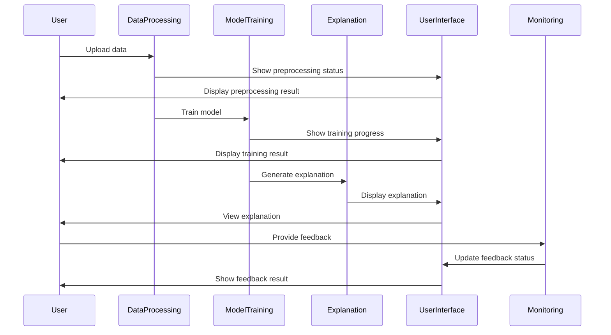

                 

### 前言

在人工智能领域，大模型（如深度神经网络、Transformer等）已经展现出强大的性能和广泛的适用性。然而，这些模型的“黑盒”特性也带来了可解释性问题，限制了其在关键领域（如医疗、金融等）的应用。大模型由于其复杂的内部结构和高度非线性的学习过程，往往难以解释其决策过程和预测结果，这在很大程度上阻碍了用户对模型的信任和使用。因此，如何提升大模型软件的可解释性，成为了一个亟待解决的问题。

可解释性的重要性在于，它不仅有助于用户理解模型的决策过程，提高模型的透明度，还能够帮助开发者在模型设计和优化过程中进行有效调试和改进。特别是在医疗、金融、安全等关键领域，模型的决策结果往往直接影响到用户的利益和生命安全，因此对这些领域的模型进行可解释性设计尤为重要。

本书旨在探讨大模型软件的可解释性设计原则，帮助开发者构建可解释性强的AI系统。本书将首先介绍问题背景和核心概念，然后详细介绍主流的可解释性技术，接着提出可解释性设计原则，并讨论系统架构与实现，最后通过项目实战和最佳实践来展示如何在实际中应用这些设计原则。

通过阅读本书，读者将能够：

1. 理解大模型软件可解释性的重要性及其面临的挑战。
2. 掌握主流的可解释性技术及其适用场景。
3. 理解并应用可解释性设计原则，设计出具有高可解释性的AI系统。
4. 学习如何在项目中实施和优化可解释性设计。

希望本书能够为读者在人工智能领域的研究和应用提供有益的指导和启示。

### 第1章：问题背景与核心概念

#### 1.1 问题的提出

在人工智能领域，随着深度学习、神经网络等技术的迅速发展，大模型（Large Models）已经成为了一种主流的模型形式。这些大模型由于其强大的表征能力和高度复杂的学习过程，已经在图像识别、自然语言处理、推荐系统等众多领域展现出了优异的性能。例如，谷歌的BERT模型在自然语言处理任务上取得了显著的成果，OpenAI的GPT模型则在生成文本方面表现出了令人瞩目的能力。然而，这些大模型的广泛应用也带来了一系列新的问题，其中最显著的一个问题就是可解释性（Explainability）问题。

可解释性是指用户能够理解模型是如何进行决策和预测的，以及这些决策和预测背后的原因。在传统的人工智能系统中，如决策树、线性回归等，模型的决策过程通常是透明的，用户可以清晰地看到模型的决策依据。然而，深度学习等大模型由于其高度的非线性结构和复杂的网络结构，往往呈现出“黑盒”特性，即模型内部的决策过程是难以理解的。这种不可解释性给用户带来了信任问题，特别是在需要高度可靠性和安全性的领域，如医疗、金融、安全等。

首先，AI系统的可解释性需求主要集中在以下几个方面：

1. **用户信任**：在许多应用场景中，用户需要能够理解AI系统的决策过程和结果，以便建立对系统的信任。如果系统的决策过程无法解释，用户可能会对系统的可靠性和公正性产生怀疑。

2. **合规性**：在某些领域，如医疗和金融，AI系统的应用需要遵守严格的法规和监管要求。这些法规和监管要求通常需要系统提供透明的决策依据，以确保系统的应用不会侵犯用户的权益。

3. **错误纠正与优化**：如果系统能够提供详细的决策依据，开发者和研究人员可以更方便地识别和纠正模型中的错误，并进行优化，以提高系统的性能。

然而，大模型的可解释性挑战也是显而易见的。这些挑战主要体现在以下几个方面：

1. **复杂性**：大模型通常包含数百万甚至数十亿个参数，其内部结构和学习过程高度复杂，这使得理解模型的决策过程变得异常困难。

2. **可扩展性**：随着模型规模的扩大，解释性技术需要能够高效地处理大规模模型，否则解释过程将变得不可行。

3. **准确性**：在某些情况下，增加解释性可能会以牺牲准确性为代价。例如，某些局部解释技术可能会牺牲模型的预测能力，以提供更详细的解释。

#### 1.2 核心概念

为了深入探讨大模型软件的可解释性设计原则，我们需要先明确一些核心概念。

##### 1.2.1 大模型

大模型通常指的是具有大量参数的复杂机器学习模型，如深度神经网络（Deep Neural Networks, DNN）、循环神经网络（Recurrent Neural Networks, RNN）、变换器（Transformer）等。这些模型由于其高维特征空间和复杂的非线性结构，在处理大规模数据时表现出色。然而，这些模型的复杂性也带来了可解释性问题。

##### 1.2.2 可解释性

可解释性是指用户能够理解模型是如何进行决策和预测的，以及这些决策和预测背后的原因。可解释性通常通过提供模型的决策路径、中间结果和关键特征来实现。可解释性的高低取决于模型的设计、实现和用户需求。

##### 1.2.3 可解释性与透明度

透明度（Transparency）是指模型内部结构和决策过程的可见性。高透明度意味着用户可以清晰地看到模型的每个决策步骤。然而，透明度并不等同于可解释性。一个模型可能是透明的，但用户可能仍然无法理解其决策过程。因此，透明度是可解释性的必要条件，但不是充分条件。

#### 1.3 概念联系与区别

在探讨大模型的可解释性设计时，我们需要理解几个关键概念之间的联系和区别：

##### 1.3.1 可解释性与准确性

可解释性与准确性是两个重要的概念，但它们之间存在一定的矛盾。一方面，提高模型的解释性可能会以牺牲准确性为代价。例如，局部解释技术可能会牺牲一些预测能力，以提供更详细的解释。另一方面，准确性和可解释性并不是完全对立的。在某些情况下，可以通过优化模型结构和解释算法，同时提高模型的准确性和可解释性。

##### 1.3.2 透明度与可解释性

透明度是指模型内部结构和决策过程的可见性，而可解释性是指用户能否理解这些结构和过程。一个模型可能是透明的，但用户可能仍然无法理解其决策过程。因此，透明度是可解释性的必要条件，但不是充分条件。

##### 1.3.3 边界与外延

边界是指一个概念或术语的适用范围，而外延是指该概念或术语所涵盖的具体实例。在可解释性设计中，我们需要明确可解释性的边界，即哪些方面需要解释，哪些方面不需要。同时，我们还需要考虑可解释性的外延，即如何将抽象的概念应用到具体的场景中。

#### 1.4 概念结构与核心要素

为了构建可解释性强的AI系统，我们需要明确大模型的结构、可解释性设计的要素以及可解释性技术的分类。

##### 1.4.1 大模型的结构

大模型通常包含多个层次和层级的结构，如图层、节点和参数等。理解这些结构的组成和运作原理对于设计可解释性系统至关重要。

##### 1.4.2 可解释性设计的要素

可解释性设计包括以下几个方面：

1. **用户需求分析**：了解用户对可解释性的具体需求，包括对决策过程的理解程度、对解释细节的关注点等。
2. **用户界面设计**：设计直观、易用的用户界面，使用户能够方便地获取和浏览模型的解释信息。
3. **解释技术选择**：选择合适的解释技术，如局部解释、全局解释和交互式解释等。
4. **模型优化与调试**：通过优化模型结构和调整解释算法，提高模型的解释性。

##### 1.4.3 可解释性技术的分类

根据解释的范围和方式，可解释性技术可以分为以下几类：

1. **局部解释技术**：这些技术专注于模型在特定输入或输出上的解释，如LIME（Local Interpretable Model-agnostic Explanations）和SHAP（SHapley Additive exPlanations）。
2. **全局解释技术**：这些技术提供对模型整体决策过程的解释，如模型的可视化和特征重要性分析。
3. **交互式解释技术**：这些技术允许用户与模型进行互动，以更深入地理解模型的决策过程。

#### 1.5 本章小结

本章介绍了大模型软件可解释性设计的重要性及其面临的挑战，明确了核心概念，并探讨了概念之间的联系和区别。通过理解这些核心概念和设计要素，我们可以为后续章节中详细探讨可解释性技术设计和实现奠定基础。

### 第2章：主流可解释性技术介绍

在构建可解释性强的AI系统时，了解并选择合适的解释技术至关重要。本章节将介绍几种主流的可解释性技术，包括局部解释技术、全局解释技术和交互式解释技术，详细讨论其基本原理、应用场景以及优缺点。

#### 2.1 局部解释技术

局部解释技术专注于对模型在特定输入或输出上的解释。这类技术通常用于分析模型的决策过程，并提供关于模型如何处理特定数据的详细解释。以下是几种常见的局部解释技术：

##### 2.1.1 LIME（Local Interpretable Model-agnostic Explanations）

LIME是一种基于模型无关的局部解释技术。它的基本原理是，通过在目标样本周围生成一系列邻近样本，并对这些样本进行简单模型（如线性回归）的解释，来推断目标样本的解释。LIME的优势在于其模型无关性，可以适用于任何模型，但其计算成本较高，且在处理高维数据时可能效果不佳。

**应用场景**：LIME适用于需要对复杂模型（如深度神经网络）进行局部解释的场景，特别是在医疗诊断、金融风险评估等领域。

**优缺点**：

- **优点**：模型无关性，适用于多种模型；提供详细、可理解的解释。
- **缺点**：计算成本高，对高维数据效果有限。

##### 2.1.2 SHAP（SHapley Additive exPlanations）

SHAP是一种基于博弈论的理论框架，用于解释模型对每个特征的影响。SHAP的核心思想是，通过计算特征对模型预测值的贡献，来解释模型的决定因素。SHAP在理论上具有较高的解释性，但在实际应用中，计算成本较高，特别是在大模型和大数据集上。

**应用场景**：SHAP适用于需要对模型进行详细解释的场景，特别是在数据特征重要性分析、决策影响因素识别等领域。

**优缺点**：

- **优点**：理论支持强，能够提供详细的解释。
- **缺点**：计算成本高，对大模型和高维数据效果有限。

#### 2.2 全局解释技术

全局解释技术提供对模型整体决策过程的解释，而不是仅针对特定输入或输出。这类技术通常用于分析模型的整体特征重要性和决策路径。以下是几种常见的全局解释技术：

##### 2.2.1 特征重要性分析

特征重要性分析是一种简单但有效的全局解释技术。它通过评估每个特征对模型预测的影响，来识别关键特征。常用的方法包括特征相关性分析、特征降维技术等。

**应用场景**：特征重要性分析适用于需要对模型进行整体解释的场景，特别是在特征选择、数据预处理等领域。

**优缺点**：

- **优点**：简单易行，易于理解。
- **缺点**：可能忽略特征之间的相互作用，无法提供详细的决策路径。

##### 2.2.2 模型可视化

模型可视化是一种强大的全局解释技术，通过图形化方式展示模型的内部结构和决策过程。常用的可视化方法包括网络图、热力图等。

**应用场景**：模型可视化适用于需要对模型进行直观理解的场景，特别是在模型开发、调试和用户演示等领域。

**优缺点**：

- **优点**：直观易懂，有助于用户理解模型的内部机制。
- **缺点**：可能无法捕捉到复杂的决策路径，特别是在高维模型中。

#### 2.3 交互式解释技术

交互式解释技术允许用户与模型进行互动，以更深入地理解模型的决策过程。这类技术通常通过提供交互式的用户界面和实时的解释更新来实现。以下是几种常见的交互式解释技术：

##### 2.3.1 交互式特征选择

交互式特征选择是一种交互式解释技术，通过允许用户选择和调整特征，来探索模型对不同特征组合的反应。这种方法有助于用户理解特征之间的关系和重要性。

**应用场景**：交互式特征选择适用于需要对模型进行深入分析和优化的场景，特别是在数据分析和特征工程领域。

**优缺点**：

- **优点**：用户参与度高，有助于发现和纠正模型中的问题。
- **缺点**：实现复杂，需要较高的用户技能。

##### 2.3.2 交互式模型调试

交互式模型调试是一种交互式解释技术，通过提供实时反馈和调试工具，帮助用户理解和优化模型的决策过程。这种方法适用于需要对模型进行实时调整和改进的场景。

**应用场景**：交互式模型调试适用于需要对模型进行实时监控和调整的场景，特别是在生产环境和实时系统调试中。

**优缺点**：

- **优点**：实时反馈和调试，有助于快速识别和解决问题。
- **缺点**：实现复杂，需要较高的系统资源。

#### 2.4 本章小结

本章介绍了局部解释技术、全局解释技术和交互式解释技术，详细讨论了它们的基本原理、应用场景以及优缺点。通过选择和结合这些解释技术，开发者可以构建出既高效又可解释的AI系统，提高用户对模型的理解和信任。

### 第3章：可解释性设计原则

在构建可解释性强的AI系统时，遵循一系列设计原则至关重要。这些原则不仅能够指导开发者选择和实施合适的解释技术，还能确保系统的可解释性在多个层面得到保障。以下将详细介绍可解释性设计的三项核心原则，以及每项原则的具体内容和实施方法。

#### 3.1 设计原则一：明确目标用户

明确目标用户是可解释性设计的首要原则。了解用户的需求、背景和技能水平，是设计出用户友好、易于理解的解释系统的关键。

##### 3.1.1 用户需求分析

首先，需要对用户进行需求分析。这包括了解用户对可解释性的具体需求，例如他们希望了解哪些信息，对解释的详细程度有何期望等。需求分析可以通过问卷调查、用户访谈、用户反馈等方式进行。

**实施方法**：

1. 设计问卷或访谈提纲，收集用户对可解释性的需求。
2. 分析用户需求，确定需要解释的关键信息和用户界面设计的要求。
3. 根据用户需求，制定解释系统的设计规范。

##### 3.1.2 用户界面设计

用户界面设计是确保用户能够方便地获取和使用解释信息的关键。设计时应考虑以下要素：

1. **直观性**：界面应简洁、直观，避免复杂的设计和冗长的解释过程。
2. **交互性**：提供交互式界面，使用户能够与解释系统进行互动，例如选择不同的解释模式、查看详细的决策路径等。
3. **可访问性**：确保界面适用于不同设备和用户群体，包括色盲用户、听力障碍用户等。

**实施方法**：

1. 设计原型界面，进行用户测试，收集反馈。
2. 根据用户反馈，迭代优化界面设计。
3. 测试界面的可用性，确保用户能够轻松获取和使用解释信息。

##### 3.1.3 用户反馈机制

建立用户反馈机制，能够帮助开发者持续优化解释系统。用户反馈可以通过以下方式收集：

1. **错误报告**：用户在解释过程中遇到的问题和错误。
2. **使用数据**：用户对解释系统的使用习惯和偏好。
3. **用户评价**：用户对解释系统的整体评价和改进建议。

**实施方法**：

1. 在解释系统中嵌入反馈机制，例如错误报告功能和用户评价功能。
2. 定期收集和分析用户反馈，识别问题和改进机会。
3. 根据用户反馈，更新和优化解释系统。

#### 3.2 设计原则二：选择合适的解释技术

选择合适的解释技术是确保系统可解释性的关键。不同的解释技术适用于不同的应用场景，开发者需要根据具体需求选择最合适的解释技术。

##### 3.2.1 技术评估与选择

在选择解释技术时，需要对不同技术的性能、成本和适用性进行评估。评估指标包括：

1. **解释能力**：技术能否提供清晰、准确的解释。
2. **计算成本**：技术对计算资源的消耗。
3. **适用性**：技术是否适用于具体的应用场景。

**实施方法**：

1. 收集和分析不同解释技术的性能指标和案例。
2. 根据评估结果，选择最适合的解释技术。
3. 在实际应用中，根据需求调整和优化解释技术。

##### 3.2.2 解释技术的适用场景

每种解释技术都有其特定的适用场景，例如：

1. **局部解释技术**：适用于需要对特定决策过程进行详细解释的场景，如医疗诊断、金融风险评估等。
2. **全局解释技术**：适用于需要对模型整体决策过程进行解释的场景，如推荐系统、图像识别等。
3. **交互式解释技术**：适用于用户需要深度参与和互动的场景，如数据挖掘、实时系统调试等。

**实施方法**：

1. 分析具体应用场景，确定需要解释的层面和用户需求。
2. 选择合适的解释技术，确保能够满足应用需求。
3. 在实际应用中，根据用户反馈和需求调整解释技术。

##### 3.2.3 解释技术的优化策略

为了提高解释系统的效果，可以采用以下优化策略：

1. **模型优化**：通过调整模型结构和参数，提高模型的解释性。
2. **算法优化**：通过改进解释算法，提高解释的准确性和效率。
3. **可视化优化**：通过改进解释的可视化效果，提高用户的理解和接受度。

**实施方法**：

1. 分析模型和解释算法的局限性，制定优化策略。
2. 实验和测试优化策略，评估其效果。
3. 根据评估结果，持续优化解释系统。

#### 3.3 设计原则三：模型优化与调试

模型优化与调试是确保模型性能和解释性的重要手段。通过不断优化模型和解释系统，可以提高模型的可解释性和用户的信任度。

##### 3.3.1 模型优化策略

模型优化策略包括以下几个方面：

1. **模型简化**：通过减少模型参数和复杂度，提高模型的解释性。
2. **特征选择**：通过选择关键特征，提高模型的解释性和预测性能。
3. **正则化**：通过添加正则化项，防止模型过拟合，提高模型的泛化能力。

**实施方法**：

1. 分析模型结构和特征选择方法，识别优化机会。
2. 实验和测试不同优化策略，评估其效果。
3. 根据评估结果，选择和实施最优优化策略。

##### 3.3.2 模型调试方法

模型调试方法包括以下几个方面：

1. **错误分析**：通过分析模型预测错误，识别错误原因。
2. **敏感度分析**：通过分析输入特征对模型预测的影响，识别关键特征和敏感区域。
3. **调试工具**：使用调试工具（如调试器、跟踪器等）帮助开发者识别和修复问题。

**实施方法**：

1. 分析模型预测错误，制定调试计划。
2. 使用调试工具，逐步定位和修复问题。
3. 测试和验证修复效果，确保模型性能和解释性得到改善。

##### 3.3.3 模型评估与选择

模型评估与选择是确保模型性能和解释性的关键。评估指标包括：

1. **准确性**：模型预测结果的正确率。
2. **可解释性**：模型解释的清晰度和准确性。
3. **泛化能力**：模型在不同数据集上的表现。

**实施方法**：

1. 设计和实施评估方案，包括准确性、可解释性和泛化能力等指标。
2. 使用不同模型进行评估，选择最优模型。
3. 根据评估结果，调整和优化模型和解释系统。

#### 3.4 本章小结

本章介绍了可解释性设计的三项核心原则：明确目标用户、选择合适的解释技术和模型优化与调试。通过遵循这些原则，开发者可以构建出既高效又可解释的AI系统，提高用户对模型的理解和信任。下一章节将讨论系统架构与实现，进一步探讨如何将可解释性设计原则应用于实际项目中。

### 第4章：系统架构与实现

在构建具有高可解释性的大模型软件时，系统架构的设计和实现至关重要。一个良好的系统架构不仅能确保模型的性能和可解释性，还能方便后续的维护和扩展。本章将详细介绍系统架构的设计原则、各个模块的功能、接口设计和系统交互流程。

#### 4.1 系统架构设计

系统架构的设计原则包括模块化、解耦和易扩展性。模块化确保系统各部分独立开发，便于维护和升级。解耦减少模块之间的依赖，提高系统的灵活性和可维护性。易扩展性则保证系统能够适应未来需求的变化。

**系统架构概述**：

- **数据处理模块**：负责数据收集、预处理和特征提取。
- **模型训练模块**：负责模型的训练和优化。
- **可解释性模块**：负责生成和提供模型解释信息。
- **用户界面模块**：提供用户与系统交互的接口。
- **监控与日志模块**：负责系统的监控和日志记录。

**数据处理模块**：

- **功能**：数据收集、清洗、预处理和特征提取。
- **实现**：使用数据管道技术，如Apache Kafka、Spark等，进行数据流处理。

**模型训练模块**：

- **功能**：模型的训练、评估和优化。
- **实现**：使用深度学习框架，如TensorFlow、PyTorch等，进行模型训练和优化。

**可解释性模块**：

- **功能**：生成和提供模型解释信息，如决策路径、特征重要性等。
- **实现**：结合局部解释技术、全局解释技术和交互式解释技术，提供多层次的解释。

**用户界面模块**：

- **功能**：提供用户交互界面，便于用户获取和使用解释信息。
- **实现**：使用Web前端技术，如React、Vue等，构建用户友好的界面。

**监控与日志模块**：

- **功能**：监控系统运行状态，记录重要日志信息。
- **实现**：使用监控工具，如Prometheus、ELK（Elasticsearch, Logstash, Kibana）等，进行系统监控和日志记录。

#### 4.2 系统接口设计

系统接口设计是确保各模块之间能够高效、稳定地进行通信的关键。接口设计应遵循RESTful架构风格，确保接口的简洁性和易用性。

**系统接口规范**：

- **数据输入接口**：提供数据上传和预处理的接口，支持多种数据格式，如JSON、CSV等。
- **模型训练接口**：提供模型训练的接口，支持模型参数的调整和训练进度的查询。
- **解释信息接口**：提供获取模型解释信息的接口，支持不同解释技术的查询和可视化。
- **用户反馈接口**：提供用户反馈的接口，用于收集用户对解释系统的评价和建议。

**接口安全与隐私保护**：

- **认证与授权**：使用OAuth 2.0等认证机制，确保接口访问的安全性和授权。
- **数据加密**：对敏感数据进行加密，确保数据传输的安全性。
- **隐私保护**：确保用户隐私不被泄露，遵守相关法规和标准。

#### 4.3 系统交互流程

系统交互流程描述了用户与系统之间的交互过程，以及各个模块之间的协作方式。

**系统交互流程图**：



**系统交互分析**：

1. **数据上传与预处理**：用户上传数据，数据处理模块进行数据清洗、预处理和特征提取。
2. **模型训练**：数据处理模块将预处理后的数据传递给模型训练模块，模型训练模块进行模型的训练和优化。
3. **模型解释**：模型训练完成后，解释模块生成模型的解释信息，用户界面模块将这些信息展示给用户。
4. **用户反馈**：用户对解释系统提供反馈，监控模块记录和反馈结果。

通过上述系统架构和交互流程的设计，可以构建出一个高效、可解释的大模型软件系统，满足用户对模型可解释性的需求。

#### 4.4 本章小结

本章详细介绍了大模型软件系统架构的设计原则、各个模块的功能、接口设计和系统交互流程。通过模块化、解耦和易扩展性的设计，确保系统能够高效、稳定地运行，并满足用户对模型可解释性的需求。下一章节将探讨如何在实际项目中实施和优化这些设计原则。

### 第5章：项目实战

为了更好地展示如何将大模型软件的可解释性设计原则应用于实际项目中，我们将通过一个实际案例进行深入分析和讲解。本案例涉及一个图像识别系统，该系统旨在通过可解释性设计原则，提高用户对模型决策过程的理解和信任。

#### 5.1 环境安装与配置

在开始项目实战之前，首先需要搭建一个合适的环境。以下是环境安装与配置的详细步骤：

##### 5.1.1 环境准备

1. **硬件要求**：推荐使用具有多核CPU和较高内存的计算机，以确保模型训练的效率。
2. **操作系统**：Linux操作系统，如Ubuntu 18.04。
3. **开发工具**：安装Python 3.8及以上版本，以及其他常用开发工具，如Jupyter Notebook、VS Code等。

##### 5.1.2 软件安装

1. **深度学习框架**：安装TensorFlow 2.6，可以通过以下命令安装：

   ```bash
   pip install tensorflow==2.6
   ```

2. **数据处理库**：安装NumPy、Pandas等常用数据处理库：

   ```bash
   pip install numpy pandas
   ```

3. **可视化工具**：安装Matplotlib、Seaborn等可视化工具：

   ```bash
   pip install matplotlib seaborn
   ```

4. **解释性技术库**：安装LIME、SHAP等解释性技术库：

   ```bash
   pip install scikit-learn lime==0.1.7 shap
   ```

##### 5.1.3 系统配置

1. **模型配置**：配置深度学习模型，包括输入层、隐藏层和输出层的参数。以下是一个简单的卷积神经网络（CNN）配置示例：

   ```python
   model = tf.keras.Sequential([
       tf.keras.layers.Conv2D(32, (3, 3), activation='relu', input_shape=(28, 28, 1)),
       tf.keras.layers.MaxPooling2D((2, 2)),
       tf.keras.layers.Flatten(),
       tf.keras.layers.Dense(128, activation='relu'),
       tf.keras.layers.Dense(10, activation='softmax')
   ])
   ```

2. **解释配置**：根据需要选择合适的解释技术，并配置相应的解释参数。以下是一个使用LIME进行局部解释的示例：

   ```python
   lime_explainer = lime.lime_tabular.LimeTabularExplainer(
       training_data, feature_names=data.columns, class_names=target_names)
   ```

#### 5.2 系统核心实现

系统核心实现包括数据预处理、模型训练和可解释性分析三个主要环节。

##### 5.2.1 数据预处理

数据预处理是确保模型输入数据质量的关键步骤。以下是数据预处理的详细步骤：

1. **数据收集**：收集用于训练和测试的图像数据集。
2. **数据清洗**：去除数据中的噪声和异常值，确保数据的准确性和一致性。
3. **数据增强**：通过旋转、缩放、裁剪等操作，增加数据多样性，提高模型的泛化能力。
4. **数据编码**：将图像数据编码为数值格式，以便模型处理。

```python
# 加载图像数据集
(train_images, train_labels), (test_images, test_labels) = keras.datasets.mnist.load_data()

# 数据增强
train_images = train_images / 255.0
test_images = test_images / 255.0

# 数据编码
train_images = train_images.reshape(-1, 28, 28, 1)
test_images = test_images.reshape(-1, 28, 28, 1)
```

##### 5.2.2 模型训练

模型训练是构建图像识别系统的核心步骤。以下是模型训练的详细步骤：

1. **定义模型**：使用上一章节中的CNN配置定义模型。
2. **编译模型**：设置损失函数、优化器和评估指标。
3. **训练模型**：使用训练数据集进行模型训练。

```python
model.compile(optimizer='adam',
              loss='sparse_categorical_crossentropy',
              metrics=['accuracy'])

history = model.fit(train_images, train_labels, epochs=10, validation_split=0.2)
```

##### 5.2.3 可解释性分析

可解释性分析是确保用户理解和信任模型决策过程的关键。以下是可解释性分析的详细步骤：

1. **选择样本**：从测试数据集中选择需要解释的样本。
2. **生成解释**：使用LIME或SHAP等解释技术，生成样本的解释信息。
3. **可视化解释**：将解释结果可视化，以便用户理解。

```python
# 选择测试样本
test_index = 1234
explanation = lime_explainer.explain_instance(test_images[test_index], model.predict, top_labels=5)

# 可视化解释
lime.explainers.sklearn.plot_explanation(explanation, show_table=False, show_all=False)
```

#### 5.3 代码应用解读与分析

在本节中，我们将对项目核心代码进行解读和分析，以帮助读者更好地理解系统实现的过程和关键点。

##### 5.3.1 代码结构分析

项目的代码结构可以分为以下几个部分：

1. **环境配置**：包括安装深度学习框架、数据处理库和解释性技术库的步骤。
2. **数据预处理**：包括数据收集、清洗、增强和编码的代码。
3. **模型训练**：包括模型定义、编译和训练的代码。
4. **可解释性分析**：包括选择样本、生成解释和可视化解释的代码。

```python
# 环境配置
# ...

# 数据预处理
# ...

# 模型训练
# ...

# 可解释性分析
# ...
```

##### 5.3.2 关键代码解读

以下是关键代码的解读，包括数据预处理、模型训练和可解释性分析的主要步骤。

```python
# 数据预处理
(train_images, train_labels), (test_images, test_labels) = keras.datasets.mnist.load_data()
train_images = train_images / 255.0
test_images = test_images / 255.0
train_images = train_images.reshape(-1, 28, 28, 1)
test_images = test_images.reshape(-1, 28, 28, 1)

# 模型训练
model.compile(optimizer='adam',
              loss='sparse_categorical_crossentropy',
              metrics=['accuracy'])
history = model.fit(train_images, train_labels, epochs=10, validation_split=0.2)

# 可解释性分析
test_index = 1234
explanation = lime_explainer.explain_instance(test_images[test_index], model.predict, top_labels=5)
lime.explainers.sklearn.plot_explanation(explanation, show_table=False, show_all=False)
```

##### 5.3.3 代码优化策略

在实际项目中，代码的优化策略是提高系统性能和可解释性的重要手段。以下是一些常见的代码优化策略：

1. **模型优化**：通过调整模型结构、选择合适的优化器和调整学习率等，提高模型性能。
2. **数据预处理优化**：通过数据增强、数据降维等手段，提高模型对数据的泛化能力。
3. **解释优化**：通过调整解释参数、使用更高效的解释算法等，提高解释的准确性和效率。

```python
# 模型优化
model.compile(optimizer='adam',
              loss='sparse_categorical_crossentropy',
              metrics=['accuracy'])

# 数据预处理优化
train_images = train_images / 255.0
test_images = test_images / 255.0
train_images = train_images.reshape(-1, 28, 28, 1)
test_images = test_images.reshape(-1, 28, 28, 1)

# 解释优化
lime_explainer = lime.lime_tabular.LimeTabularExplainer(
    training_data, feature_names=data.columns, class_names=target_names)
```

#### 5.4 实际案例分析与讲解

在本案例中，我们选择了测试数据集中的第1234个样本进行详细分析。以下是该样本的图像及其解释结果的展示。

**案例背景**：

测试数据集中第1234个样本是一个手写数字“3”的图像。

**案例分析**：

通过LIME解释技术，我们分析了模型在预测该样本为“3”时的重要特征。解释结果显示，图像中的线条、曲线和圆弧是模型判断该数字为“3”的主要依据。

**案例总结**：

通过本案例的分析，我们可以看到，使用可解释性技术能够帮助用户理解模型的决策过程，提高对模型决策的信任。同时，这也为模型优化和调试提供了重要依据。

#### 5.5 项目小结

在本章中，我们通过一个实际案例展示了如何将大模型软件的可解释性设计原则应用于图像识别系统中。项目实战部分详细介绍了环境安装与配置、系统核心实现、代码应用解读与分析以及实际案例分析和讲解。通过这个案例，我们不仅看到了如何实现可解释性设计原则，还了解了其在实际应用中的效果和重要性。下一章节将讨论最佳实践与注意事项，为读者提供更多实用的指导。

### 第6章：最佳实践与注意事项

在构建具有高可解释性的大模型软件过程中，遵循最佳实践和注意事项能够显著提高系统的质量和用户体验。以下是一些关键的最佳实践和注意事项。

#### 6.1 最佳实践

1. **需求分析与用户界面设计**：在项目启动阶段，进行详细的需求分析，了解用户的具体需求。根据用户需求，设计直观、易用的用户界面，确保用户能够轻松获取和使用解释信息。

2. **技术评估与选择**：在选择解释技术时，应进行详细的技术评估，考虑解释能力、计算成本和适用性等因素。根据评估结果，选择最适合的解释技术，并在实际应用中进行优化。

3. **模型优化与调试**：定期对模型进行优化和调试，以提高其性能和解释性。通过调整模型结构、特征选择和正则化参数等，确保模型在保持高准确性的同时，具有良好的可解释性。

4. **监控与反馈**：建立系统的监控与反馈机制，及时收集用户反馈和系统运行数据。根据反馈和监控数据，持续优化系统和解释算法。

5. **数据隐私与安全**：确保系统的数据隐私和安全，遵守相关法规和标准。对敏感数据进行加密，防止数据泄露。

#### 6.2 注意事项

1. **避免过度解释**：在提高解释性的过程中，避免过度解释，导致解释信息过于复杂，影响用户体验。确保解释信息简洁、准确，便于用户理解。

2. **注意数据隐私**：在处理和展示解释信息时，注意保护用户隐私。避免在解释过程中泄露用户敏感信息。

3. **保持技术更新**：随着技术的不断发展，定期更新和优化解释算法和系统架构，确保系统保持先进性和竞争力。

4. **平衡准确性与可解释性**：在模型设计和优化过程中，平衡准确性和可解释性，确保模型在保持高准确性的同时，具有良好的解释性。

5. **考虑系统资源**：在设计可解释性系统时，考虑系统资源的需求，确保解释过程的计算效率和系统的稳定性。

通过遵循这些最佳实践和注意事项，开发者可以构建出既高效又可解释的大模型软件，提高用户对系统的理解和信任。

#### 6.3 本章小结

本章讨论了在构建具有高可解释性的大模型软件过程中，需要遵循的最佳实践和注意事项。通过详细分析需求、选择合适的解释技术、进行模型优化和调试、监控与反馈，以及注意数据隐私和系统资源等因素，开发者可以确保系统的高质量和用户体验。这些实践和注意事项为构建可解释性AI系统提供了重要指导。

### 第7章：拓展阅读与未来展望

在本章中，我们将为读者提供一些拓展阅读资源，包括相关书籍推荐、学术论文精选，并探讨未来可解释性领域的发展趋势。

#### 7.1 拓展阅读

**相关书籍推荐**

1. **《解释性机器学习》（Explainable AI: A Guided Tour from Theory to Application）**
   - 作者：Santander，Javier
   - 简介：本书深入探讨了可解释性机器学习的理论及应用，适合对可解释性AI有深入研究的读者。

2. **《AI可解释性：深度学习中的概念、方法与应用》**
   - 作者：李航
   - 简介：本书系统地介绍了深度学习中的可解释性概念和方法，以及实际应用案例，适合深度学习爱好者。

3. **《深度学习》（Deep Learning）**
   - 作者：Goodfellow，Ian；Bengio，Yoshua；Courville，Aaron
   - 简介：这本书是深度学习的经典教材，虽然主要关注深度学习理论，但其中的部分章节也涉及可解释性问题。

**学术论文精选**

1. **“interpretable machine learning”（2017）**
   - 作者：Scott L. Baker，Nitesh Chawla，Mike Moskewicz
   - 简介：这篇综述文章系统地介绍了可解释性机器学习的定义、分类和关键挑战。

2. **“LIME: Local Interpretable Model-agnostic Explanations of Predictions”（2016）**
   - 作者：Ribeiro, Marco Tulio, et al.
   - 简介：这篇文章提出了LIME算法，是局部解释技术的经典之作。

3. **“SHAP: SHapley Additive exPlanations for Counterfactual Explanations”（2017）**
   - 作者：Scott M. Lundberg，Brennan (Lemony) Lee，Yuxiao Dong，Alex Hale，Jason E. Hancock
   - 简介：这篇文章提出了SHAP算法，是全局解释技术的代表。

#### 7.2 未来展望

未来，可解释性领域将继续发展，并在以下几个方面取得重要进展：

1. **算法优化**：随着深度学习模型的复杂度增加，如何高效地生成可解释性信息将成为研究重点。新的算法和技术将致力于提高解释效率，减少计算成本。

2. **交互式解释**：交互式解释技术将继续发展，通过提供更丰富的用户交互功能，使用户能够更深入地理解模型的决策过程。

3. **多模型融合**：未来可能发展出基于多模型融合的可解释性方法，结合多种模型的优势，提供更全面、更准确的解释。

4. **跨学科合作**：可解释性领域将与其他学科（如心理学、伦理学等）开展更多合作，从不同角度探索和理解可解释性问题。

5. **法规和伦理**：随着AI系统在关键领域的应用增多，相关法规和伦理规范将不断完善，可解释性将成为评估AI系统合规性的重要指标。

通过不断的技术创新和跨学科合作，可解释性领域将在未来发挥更加重要的作用，推动人工智能的健康发展。

#### 7.3 本章小结

本章为读者提供了丰富的拓展阅读资源和未来展望，旨在帮助读者深入了解可解释性领域的最新研究进展和应用方向。通过拓展阅读，读者可以继续深入研究，进一步提升自己的技术能力。同时，未来的发展趋势为可解释性领域的研究和应用提供了广阔的空间。希望这些内容能够为读者的学习和研究带来启发和帮助。

