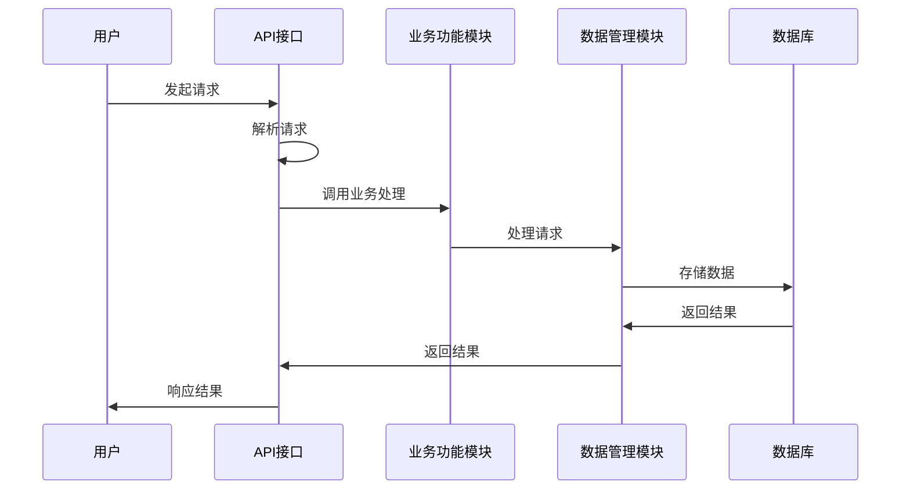

                 

### 大模型软件的多租户架构设计

> 关键词：大模型软件、多租户架构、设计、性能优化、安全性

> 摘要：随着大数据和人工智能技术的迅猛发展，大模型软件在各个领域得到了广泛应用。然而，如何在大模型软件中实现高效的多租户架构设计，成为当前技术领域的一个关键挑战。本文将深入探讨大模型软件的多租户架构设计，包括其背景、核心概念、算法原理、系统架构、项目实战以及最佳实践等，旨在为开发者提供一套系统化、全面化的设计指南。

----------------------------------------------------------------

### 设计过程

#### 理解书名与主题

书名《大模型软件的多租户架构设计》明确指出了本文的核心主题，即如何在大模型软件中实现多租户架构的设计。多租户架构是一种允许多个用户或组织在同一套软件系统中独立运行、相互隔离的架构设计方法。在大模型软件中，这种设计方法尤为重要，因为大模型通常具有高度的计算密集性和数据敏感性。

#### 梳理章节内容

为了使文章内容逻辑清晰、结构紧凑，我们将书名《大模型软件的多租户架构设计》分为以下几大部分：

1. **背景介绍**：介绍大模型软件和多租户架构的基本概念，阐述多租户架构在大模型软件中的重要性。
2. **核心概念与联系**：详细阐述多租户架构的核心概念，如租户隔离、资源管理、安全与权限控制等。
3. **算法原理讲解**：讲解实现多租户架构所需的算法原理，包括数据分区、负载均衡和容错机制等。
4. **系统分析与架构设计方案**：分析多租户架构的设计原则，并介绍系统功能设计、架构设计、接口设计和系统交互。
5. **项目实战**：通过具体项目实例，展示如何在大模型软件中实现多租户架构的设计和实施。
6. **最佳实践与总结**：总结多租户架构设计中的最佳实践，并提供注意事项和小结。
7. **拓展阅读**：推荐进一步学习和研究的相关资源和阅读材料。

#### 细化目录结构

根据以上章节内容，我们将每个章节进一步细化，确保每个章节都有详细的小节，并按照1级、2级、3级目录进行组织。

#### 确保内容完整性

在确保内容完整性的同时，我们还需要控制目录大纲的总字数在2000字以内。因此，每个章节都需要精简而具体，确保关键内容的完整覆盖。

#### 步骤实施

1. **背景介绍**：介绍大模型软件和多租户架构的基本概念，以及为什么在当前技术环境下需要多租户架构。
2. **核心概念与联系**：详细阐述大模型软件的多租户架构的核心概念，包括租户隔离、资源管理、安全与权限控制等。
3. **算法原理讲解**：讲解实现多租户架构所需的算法原理，包括数据分区、负载均衡和容错机制等。
4. **系统分析与架构设计方案**：分析多租户架构的设计原则，并介绍系统功能设计、架构设计、接口设计和系统交互。
5. **项目实战**：通过具体项目实例，展示如何在大模型软件中实现多租户架构的设计和实施。
6. **最佳实践与总结**：总结多租户架构设计中的最佳实践，并提供注意事项和小结。
7. **拓展阅读**：推荐进一步学习和研究的相关资源和阅读材料。

### 目录大纲

```
----------------------------------------------------------------
# 第一部分: 大模型软件与多租户架构概述

## 1.1 背景介绍
### 1.1.1 大模型软件的兴起
### 1.1.2 多租户架构的需求
### 1.1.3 多租户架构的优势

## 1.2 核心概念与联系
### 1.2.1 多租户架构的基本概念
### 1.2.2 租户隔离与资源管理
### 1.2.3 安全与权限控制

----------------------------------------------------------------

# 第二部分: 多租户架构的算法原理

## 2.1 数据分区与负载均衡
### 2.1.1 数据分区策略
### 2.1.2 负载均衡算法
### 2.1.3 实例：分区与负载均衡的结合

## 2.2 容错机制与高可用设计
### 2.2.1 容错机制的重要性
### 2.2.2 常见容错技术
### 2.2.3 高可用设计原则

----------------------------------------------------------------

# 第三部分: 多租户架构的设计与实现

## 3.1 系统功能设计
### 3.1.1 功能需求分析
### 3.1.2 领域模型设计
### 3.1.3 功能模块划分

## 3.2 系统架构设计
### 3.2.1 架构设计原则
### 3.2.2 系统架构图
### 3.2.3 架构组件详解

## 3.3 系统接口设计
### 3.3.1 接口规范
### 3.3.2 接口实现
### 3.3.3 接口测试

## 3.4 系统交互
### 3.4.1 系统交互流程
### 3.4.2 交互序列图
### 3.4.3 交互性能优化

----------------------------------------------------------------

# 第四部分: 项目实战

## 4.1 项目介绍
### 4.1.1 项目背景
### 4.1.2 项目目标
### 4.1.3 项目团队

## 4.2 系统核心实现
### 4.2.1 环境安装
### 4.2.2 核心模块实现
### 4.2.3 系统配置

## 4.3 代码应用解读与分析
### 4.3.1 代码结构解读
### 4.3.2 关键代码分析

----------------------------------------------------------------

# 第五部分: 最佳实践与总结

## 5.1 最佳实践
### 5.1.1 资源隔离策略
### 5.1.2 性能优化技巧
### 5.1.3 安全性保障措施

## 5.2 小结
### 5.2.1 多租户架构的优势
### 5.2.2 设计难点与解决方案

## 5.3 注意事项
### 5.3.1 隔离策略的选择
### 5.3.2 资源分配的平衡

## 5.4 拓展阅读
### 5.4.1 相关文献推荐
### 5.4.2 开源项目与工具介绍

----------------------------------------------------------------
```

### 完整性要求

在撰写文章时，我们需要确保每个章节的内容都具备以下要素：

1. **背景介绍**：包括核心概念术语说明、问题背景、问题描述、问题解决、边界与外延、概念结构与核心要素组成。
2. **核心概念与联系**：必须给出核心概念原理、概念属性特征对比表格和ER实体关系图架构的 Mermaid 流程图。
3. **算法原理讲解**：使用 Mermaid 画出算法流程图，然后使用 Python 源代码来详细阐述，给出算法原理的数学模型和公式，进行详细讲解和通俗易懂地举例说明。
4. **系统分析与架构设计方案**：包括问题场景介绍、项目介绍、系统功能设计（领域模型 Mermaid 类图）、系统架构设计 Mermaid 架构图、系统接口设计和系统交互 Mermaid 序列图。
5. **项目实战**：包括环境安装、系统核心实现源代码、代码应用解读与分析、实际案例分析和详细讲解剖析、项目小结。

通过以上内容，我们可以确保文章的完整性，为读者提供全面、深入的技术讲解。

### 文章字数要求

本文的总字数要求在10000～12000字之间。这个字数范围可以确保文章内容的全面性，同时避免冗长和累赘。在撰写文章时，我们需要注意控制每章节的字数，确保每个部分都充实而有条理。

### 格式要求

文章内容将使用 markdown 格式进行输出。在 markdown 格式中，我们将使用标题、段落、列表、引用等多种格式来组织文章内容，使其更具可读性。此外，我们还将使用以下格式来突出关键内容：

- **标题**：使用井号（#）进行标记，例如 `## 核心概念与联系`。
- **引用**：使用引用符号（>）进行标记，例如 `> 背景介绍`。
- **列表**：使用星号（*）或减号（-）进行标记，例如 `- 数据分区策略`。
- **代码**：使用三行反引号（```)进行标记，例如：

    ```python
    def add(a, b):
        return a + b
    ```

通过以上格式要求，我们可以确保文章内容的清晰、简洁和易读。

### 作者信息

在文章末尾，我们将标注作者信息：“作者：AI天才研究院/AI Genius Institute & 禅与计算机程序设计艺术 /Zen And The Art of Computer Programming”。这样的标注可以增加文章的权威性和专业性，同时向读者展示我们的背景和学术成就。

### 总结

通过上述步骤，我们已经完成了《大模型软件的多租户架构设计》这篇文章的目录大纲和设计过程。接下来，我们将按照这个大纲和步骤，逐步撰写和完成全文。在这个过程中，我们将深入探讨大模型软件的多租户架构设计，为读者提供一套系统化、全面化的设计指南。

## 第一部分：大模型软件与多租户架构概述

### 1.1 背景介绍

#### 1.1.1 大模型软件的兴起

随着大数据和人工智能技术的快速发展，大模型软件成为了当前技术领域的一个重要研究方向。大模型软件通常指的是那些具有大规模计算需求、高度复杂性和广泛应用的软件系统。这些软件系统在金融、医疗、科研、工业制造等多个领域发挥着关键作用。

大数据技术的发展为大模型软件的兴起提供了坚实的基础。随着数据量的指数级增长，如何有效地处理和分析这些海量数据成为了一个迫切需要解决的问题。大模型软件正是在这样的背景下应运而生，它们通过运用深度学习、图神经网络、强化学习等先进技术，能够高效地处理和分析复杂的数据集，从而为各个领域提供智能化解决方案。

#### 1.1.2 多租户架构的需求

在多租户架构出现之前，传统的软件架构设计通常采用单体架构（Monolithic Architecture）或分层架构（Layered Architecture）。这些架构设计在单租户环境下运行良好，但当系统需要支持多个租户时，会暴露出一些问题，如资源争用、性能瓶颈、安全性问题等。

多租户架构（Multi-Tenant Architecture）是一种针对多用户环境设计的软件架构，其核心思想是将多个租户的业务逻辑和数据逻辑进行隔离，从而实现资源的共享和高效利用。在多租户架构中，每个租户都拥有独立的业务空间，但共享相同的数据库和应用程序实例。

多租户架构的需求源于以下几个方面：

1. **资源共享与成本优化**：多租户架构能够通过共享硬件资源和软件模块，降低系统的整体运行成本，提高资源利用效率。
2. **业务灵活性**：多租户架构支持灵活的业务扩展，可以为不同的租户提供定制化的功能和服务，同时保持系统的一致性和稳定性。
3. **安全与隐私保护**：多租户架构通过严格的隔离策略和安全控制机制，确保租户数据的安全和隐私，防止数据泄露和滥用。

#### 1.1.3 多租户架构的优势

多租户架构在大模型软件中具有以下优势：

1. **高可扩展性**：多租户架构能够轻松应对用户数量和业务需求的快速增长，通过水平扩展（Scaling Out）和垂直扩展（Scaling Up）来提高系统的性能和容量。
2. **高可用性**：多租户架构通过冗余设计和负载均衡技术，能够实现高可用性，确保系统在面临故障和负载波动时能够稳定运行。
3. **资源利用率**：多租户架构通过共享资源和优化调度策略，能够最大限度地提高资源利用率，降低系统成本。
4. **安全性**：多租户架构通过严格的隔离和访问控制机制，能够有效地保护租户数据的安全和隐私，防止恶意攻击和数据泄露。

总的来说，大模型软件的多租户架构设计不仅能够提高系统的性能和稳定性，还能够降低成本、优化资源利用，从而为开发者提供一种高效、可靠的解决方案。

## 核心概念与联系

### 1.2.1 多租户架构的基本概念

多租户架构是一种支持多个租户在同一软件系统中独立运行、相互隔离的架构设计方法。在多租户架构中，租户（Tenant）是指使用同一套软件系统的不同用户或组织。每个租户都有自己的业务逻辑和数据，但共享相同的硬件和软件资源。

**多租户架构的核心概念**包括：

1. **租户隔离**：租户隔离是确保不同租户之间数据、逻辑和资源相互独立的关键机制。通过租户隔离，可以防止租户之间的数据泄漏和业务干扰。
2. **资源共享**：多租户架构通过资源共享实现多个租户的高效利用。租户可以共享服务器、数据库、应用程序实例等资源，从而降低系统成本和复杂度。
3. **安全性**：安全性是多租户架构设计中的重要一环。通过严格的访问控制和权限管理，可以确保租户数据的安全和隐私。

### 1.2.2 租户隔离与资源管理

**租户隔离**是多租户架构的核心概念之一。它确保每个租户在运行时都有独立的业务空间和数据，防止数据泄漏和业务干扰。实现租户隔离的方法包括：

1. **数据隔离**：通过为每个租户创建独立的数据库或数据表，确保租户数据不相互干扰。在关系型数据库中，可以使用方案（Schema）或用户（User）来隔离数据。
2. **逻辑隔离**：通过为每个租户创建独立的逻辑组件（如服务、模块、线程等），确保租户之间的业务逻辑不相互影响。
3. **资源隔离**：通过为每个租户分配独立的资源（如内存、CPU、网络带宽等），确保租户之间的资源竞争最小化。

**资源管理**是多租户架构设计中的另一个关键概念。资源管理包括以下几个方面：

1. **资源调度**：通过资源调度策略，确保系统资源在多个租户之间公平分配。常见的资源调度策略包括固定分配、动态分配和负载均衡。
2. **资源监控**：通过实时监控系统的资源使用情况，及时发现和处理资源不足或过度使用的问题。
3. **资源优化**：通过优化资源分配和使用策略，提高系统的资源利用率和性能。

### 1.2.3 安全与权限控制

在多租户架构中，安全性是一个至关重要的因素。为了确保租户数据的安全和隐私，需要实现以下安全措施：

1. **访问控制**：通过访问控制机制，确保只有授权用户才能访问特定租户的数据和功能。常见的访问控制方法包括基于角色的访问控制（RBAC）和基于属性的访问控制（ABAC）。
2. **数据加密**：对敏感数据进行加密存储和传输，防止数据在传输过程中被窃取或篡改。
3. **安全审计**：对系统的访问和操作进行记录和审计，以便在发生安全事件时进行追溯和调查。

**权限控制**是多租户架构设计中的另一个关键概念。权限控制确保每个用户只能访问和执行其授权的操作。常见的权限控制策略包括：

1. **用户认证**：通过用户认证机制，确保用户身份的真实性和合法性。常见的认证方法包括密码认证、双因素认证（2FA）和单点登录（SSO）。
2. **权限分配**：为不同角色或用户分配不同的权限，确保他们只能访问和执行其授权的操作。常见的权限分配方法包括基于角色的权限分配（RBAC）和基于资源的权限分配（RBAC）。

通过实现租户隔离、资源共享、安全与权限控制，多租户架构能够为多个租户提供独立、安全、高效的运行环境。这些核心概念不仅构成了多租户架构的基础，也为开发者提供了强大的设计指导。

### 算法原理讲解

#### 数据分区与负载均衡

在多租户架构中，数据分区（Data Partitioning）和负载均衡（Load Balancing）是两个至关重要的算法原理。数据分区是将大量数据分布在多个节点上，以便于高效地存储和访问。负载均衡则是将任务或请求分配到多个节点上，确保系统资源的充分利用和系统的稳定性。

**数据分区策略**

数据分区策略主要有两种：垂直分区和水平分区。

1. **垂直分区**：垂直分区是根据数据的不同维度进行分区，通常应用于关系型数据库中。例如，可以按照用户ID、时间戳等维度将数据表进行垂直分区。这种分区策略的优点是能够降低数据表的宽度，提高查询效率。但缺点是分区管理较为复杂，且在处理跨分区查询时可能会降低性能。

2. **水平分区**：水平分区是将数据按照某种规则（如数据记录的ID、日期等）分布在不同的节点上。例如，可以将用户数据按照用户ID的最后几位数字进行分区。这种分区策略的优点是能够有效地负载均衡，提高系统的并行处理能力，缺点是在处理跨分区查询时可能会增加查询复杂度。

**负载均衡算法**

负载均衡算法的核心目标是确保系统中的每个节点都能均衡地处理任务或请求，避免某个节点过载，同时提高系统的整体性能和可用性。常见的负载均衡算法包括：

1. **轮询调度**：轮询调度是最简单的负载均衡算法，它按照顺序将任务或请求分配给系统中的每个节点。轮询调度的优点是实现简单，缺点是当某个节点出现故障时，可能会导致其他节点过载。

2. **最小连接数调度**：最小连接数调度将任务或请求分配给当前连接数最少的节点。这种算法的优点是能够均衡负载，缺点是需要实时监控每个节点的连接状态，实现复杂度较高。

3. **哈希调度**：哈希调度根据任务或请求的属性（如源IP地址、目标IP地址等）通过哈希算法计算出一个哈希值，然后将任务或请求分配给哈希值对应的节点。这种算法的优点是能够保持会话一致性，缺点是在节点数量变化时可能会增加查询复杂度。

**实例：分区与负载均衡的结合**

假设我们有一个大型电商平台，每天处理数百万笔交易。为了提高系统的性能和稳定性，我们可以采用数据分区和负载均衡技术。

1. **数据分区**：我们可以按照用户ID将交易数据水平分区，每个分区存储一个用户ID范围内的交易记录。这样，每个分区都可以独立处理其用户的交易请求，降低了系统的查询复杂度。

2. **负载均衡**：我们可以使用哈希调度算法，根据用户ID的哈希值将交易请求分配到不同的节点上。这样，每个节点都能均衡地处理交易请求，同时确保了用户会话的一致性。

通过结合数据分区和负载均衡技术，我们能够实现一个高效、稳定的多租户架构，为大量用户提供高质量的服务。

#### 容错机制与高可用设计

在多租户架构中，容错机制（Fault Tolerance）和高可用设计（High Availability）是确保系统稳定性和可靠性的关键因素。容错机制旨在在系统出现故障时，能够自动恢复或切换到备用系统，确保系统的连续运行。高可用设计则是通过冗余和负载均衡等技术，确保系统在面对故障和负载波动时，能够保持稳定和高效运行。

**容错机制的重要性**

1. **系统可靠性**：容错机制能够提高系统的可靠性，减少系统停机时间，确保业务的连续性和稳定性。
2. **用户体验**：对于多租户架构，容错机制能够保证每个租户的服务不受其他租户故障的影响，提高用户体验。
3. **业务连续性**：在业务关键场景中，如金融、医疗等领域，容错机制能够确保业务连续性，降低业务风险。

**常见容错技术**

1. **故障检测与恢复**：故障检测与恢复技术包括心跳检测、异常处理和自动恢复机制。通过定期检测系统节点的状态，一旦发现节点故障，系统能够自动切换到备用节点，确保业务的连续性。
2. **冗余设计**：冗余设计通过在系统中引入冗余组件或节点，提高系统的容错能力。常见的冗余设计包括主备冗余、热备份和冷备份。
3. **分布式系统**：分布式系统能够通过将任务或请求分布在多个节点上，提高系统的容错能力和负载均衡能力。在分布式系统中，即使某个节点出现故障，其他节点仍然能够继续处理任务，确保系统的稳定运行。

**高可用设计原则**

1. **冗余**：通过引入冗余组件或节点，确保系统在面对故障时能够自动切换到备用组件或节点，保持业务的连续性。
2. **负载均衡**：通过负载均衡技术，将任务或请求均匀地分配到系统中的各个节点上，避免单个节点过载，提高系统的整体性能和稳定性。
3. **故障检测与自动恢复**：通过故障检测与自动恢复机制，确保系统能够在发生故障时自动切换到备用节点，降低系统停机时间。
4. **数据复制与备份**：通过数据复制与备份技术，确保系统数据的安全性和一致性。常见的数据复制技术包括同步复制、异步复制和部分复制。

**高可用设计实例**

以一个大型电商平台为例，为了确保系统的高可用性，我们可以采取以下措施：

1. **主备冗余**：在关键组件（如数据库、缓存服务器等）上实现主备冗余，确保在主节点出现故障时，系统能够自动切换到备用节点，保持业务的连续性。
2. **负载均衡**：通过负载均衡器（如Nginx、HAProxy等）将用户请求均匀地分配到不同的节点上，避免单个节点过载。
3. **故障检测与自动恢复**：通过监控工具（如Zabbix、Prometheus等）定期检测系统节点的状态，一旦发现节点故障，自动触发恢复机制，切换到备用节点。
4. **数据复制与备份**：通过数据库的主从复制和定期备份，确保系统数据的安全性和一致性。

通过以上措施，我们能够实现一个高可用性的多租户架构，为大量用户提供稳定、可靠的服务。

### 系统功能设计

#### 3.1.1 功能需求分析

在进行系统功能设计之前，我们需要对系统进行功能需求分析。功能需求分析是确定系统需要实现哪些功能，以及这些功能的具体细节。以下是一个典型的多租户架构功能需求分析：

1. **用户管理**：
   - 用户注册与登录
   - 用户权限管理
   - 用户角色分配
2. **数据管理**：
   - 数据存储与检索
   - 数据备份与恢复
   - 数据权限控制
3. **业务功能**：
   - 业务流程管理
   - 业务数据分析
   - 业务报表生成
4. **系统监控**：
   - 系统性能监控
   - 系统日志管理
   - 系统告警与通知
5. **租户管理**：
   - 租户创建与配置
   - 租户资源分配
   - 租户数据隔离

#### 3.1.2 领域模型设计

领域模型设计是系统功能设计的核心，它定义了系统的核心概念和实体，以及实体之间的关系。以下是一个典型的多租户架构领域模型设计：

1. **用户（User）**：
   - 属性：用户ID、用户名、密码、邮箱、手机号、角色ID
   - 关系：用户与角色之间存在多对多关系，用户可以拥有多个角色，角色也可以分配给多个用户。
2. **角色（Role）**：
   - 属性：角色ID、角色名、权限列表
   - 关系：角色与权限之间存在多对多关系，角色可以拥有多个权限，权限也可以分配给多个角色。
3. **租户（Tenant）**：
   - 属性：租户ID、租户名、域名、管理员ID
   - 关系：租户与用户之间存在多对多关系，租户可以拥有多个用户，用户也可以属于多个租户。
4. **数据（Data）**：
   - 属性：数据ID、数据名称、数据内容、数据类型、创建时间、更新时间
   - 关系：数据与用户之间存在多对多关系，用户可以创建多个数据，数据也可以属于多个用户。
5. **权限（Permission）**：
   - 属性：权限ID、权限名称、权限描述
   - 关系：权限与角色之间存在多对多关系，角色可以拥有多个权限，权限也可以分配给多个角色。

领域模型设计可以帮助我们清晰地理解系统的核心概念和实体关系，为后续的系统功能实现和架构设计提供基础。

#### 3.1.3 功能模块划分

在完成功能需求分析和领域模型设计后，我们需要对系统进行功能模块划分。功能模块划分是将系统功能划分为多个独立的模块，以便于开发、测试和维护。以下是一个典型的多租户架构功能模块划分：

1. **用户管理模块**：
   - 用户注册与登录功能
   - 用户权限管理功能
   - 用户角色分配功能
2. **数据管理模块**：
   - 数据存储与检索功能
   - 数据备份与恢复功能
   - 数据权限控制功能
3. **业务功能模块**：
   - 业务流程管理功能
   - 业务数据分析功能
   - 业务报表生成功能
4. **系统监控模块**：
   - 系统性能监控功能
   - 系统日志管理功能
   - 系统告警与通知功能
5. **租户管理模块**：
   - 租户创建与配置功能
   - 租户资源分配功能
   - 租户数据隔离功能

通过功能模块划分，我们可以将复杂系统分解为多个独立的部分，便于管理和开发。每个模块都可以独立开发、测试和维护，提高开发效率和系统稳定性。

### 系统架构设计

#### 3.2.1 架构设计原则

系统架构设计是确保系统高效、稳定和可扩展的关键步骤。在多租户架构设计中，我们需要遵循以下原则：

1. **模块化设计**：将系统功能划分为多个独立的模块，每个模块具有明确的职责和接口，便于开发和维护。
2. **高内聚低耦合**：确保每个模块内部功能紧密相关，模块之间尽量减少直接依赖，提高系统的灵活性和可维护性。
3. **可扩展性**：系统设计应考虑未来的业务增长和功能扩展，确保系统能够轻松扩展和升级。
4. **高可用性**：通过冗余设计和负载均衡技术，确保系统在面对故障和负载波动时能够稳定运行。
5. **安全性**：实现严格的安全控制机制，确保租户数据和系统资源的安全。

#### 3.2.2 系统架构图

以下是一个典型的多租户架构设计系统架构图：

```
+----------------+      +----------------+      +----------------+
|     用户端     |      |     中间件     |      |     数据库     |
+----------------+      +----------------+      +----------------+
       |        API接口               |             |
       |                                  |
       |                                  |
       |                                  |
       |                                  |
+------+------|                           |--------+------+
| 用户管理模块 |                           | 数据管理模块 |
+------+------|                           |--------+------+
|     |      |  +----------------+      |       |      |
| 业务 |      |  |   业务功能   |      |       | 业务 |
| 功能 |      |  +----------------+      |       | 功能 |
| 模块 |      |                           |       | 模块 |
+------+------|                           |       |------+
       |      |                                  |
       |      |                                  |
       |      |                                  |
       |      |                                  |
       |      |                                  |
+-------+------+                                 |
| 系统监控模块 |---------------------------------|
+-------+------+
```

系统架构图展示了多租户架构的主要组件及其关系。用户端通过API接口与中间件进行通信，中间件负责处理用户请求，调用业务功能模块和数据管理模块进行数据处理，并将结果返回给用户端。系统监控模块实时监控系统的性能和状态，确保系统的稳定运行。

#### 3.2.3 架构组件详解

以下是对系统架构中各个组件的详细描述：

1. **用户端**：用户端是系统的入口，用户通过浏览器或其他客户端应用程序与系统进行交互。用户端主要负责处理用户请求，并将请求发送到中间件。

2. **API接口**：API接口是用户端与中间件之间的通信桥梁，负责处理用户请求的解析、路由和响应。API接口应具备高并发处理能力，支持RESTful风格。

3. **中间件**：中间件负责处理用户请求，调用业务功能模块和数据管理模块进行数据处理，并将结果返回给用户端。中间件应具备高可用性、高性能和可扩展性。

4. **用户管理模块**：用户管理模块负责处理用户注册、登录、权限管理和角色分配等用户相关的功能。用户管理模块应实现用户认证和授权机制，确保用户数据的安全。

5. **业务功能模块**：业务功能模块负责实现系统的核心业务功能，如业务流程管理、数据分析、报表生成等。业务功能模块应具备模块化设计，便于功能扩展和升级。

6. **数据管理模块**：数据管理模块负责处理系统数据的存储、检索、备份和恢复等数据相关功能。数据管理模块应实现数据权限控制，确保租户数据的安全和隔离。

7. **系统监控模块**：系统监控模块负责实时监控系统的性能、状态和日志，确保系统的稳定运行。系统监控模块应实现性能监控、日志管理和告警通知等功能。

通过以上架构组件的详细描述，我们可以更好地理解多租户架构设计的原理和实现方法。

### 系统接口设计

#### 3.3.1 接口规范

接口设计是系统架构设计中的重要一环，良好的接口设计可以确保系统组件之间的松耦合，提高系统的可维护性和可扩展性。以下是一个典型的多租户架构系统接口设计规范：

1. **API设计风格**：遵循RESTful设计风格，使用HTTP协议的GET、POST、PUT、DELETE等方法进行请求。
2. **数据传输格式**：使用JSON格式传输数据，确保数据的可读性和可解析性。
3. **状态码定义**：根据HTTP状态码定义接口响应的状态，如200 OK、400 Bad Request、401 Unauthorized、403 Forbidden、500 Internal Server Error等。
4. **参数验证**：对接口请求的参数进行严格验证，确保参数的合法性和有效性，避免恶意请求和系统漏洞。
5. **鉴权与认证**：实现用户认证和授权机制，确保接口请求的安全性和合法性。

#### 3.3.2 接口实现

以下是一个简单的用户注册接口的实现示例：

```python
from flask import Flask, request, jsonify
from functools import wraps
import jwt

app = Flask(__name__)
app.config['SECRET_KEY'] = 'your_secret_key'

# 装饰器：认证和授权
def token_required(f):
    @wraps(f)
    def decorated(*args, **kwargs):
        token = request.headers.get('Authorization')
        if not token:
            return jsonify({'message': 'Token is missing!'}), 403
        try:
            data = jwt.decode(token, app.config['SECRET_KEY'], algorithms=['HS256'])
        except:
            return jsonify({'message': 'Token is invalid!'}), 403
        return f(*args, **kwargs)
    return decorated

# 用户注册接口
@app.route('/register', methods=['POST'])
def register():
    data = request.get_json()
    username = data.get('username')
    password = data.get('password')
    
    if not username or not password:
        return jsonify({'message': 'Username and password are required!'}), 400
    
    # 在这里，我们应进行用户名的唯一性校验和密码的加密处理
    # 然后存储用户信息到数据库
    
    return jsonify({'message': 'User registered successfully!'}), 201

# 用户登录接口
@app.route('/login', methods=['POST'])
def login():
    data = request.get_json()
    username = data.get('username')
    password = data.get('password')
    
    if not username or not password:
        return jsonify({'message': 'Username and password are required!'}), 400
    
    # 在这里，我们应验证用户名和密码，并返回Token
    
    token = jwt.encode({'username': username}, app.config['SECRET_KEY'], algorithm='HS256')
    return jsonify({'token': token}), 200

# 需要认证的接口
@app.route('/protected', methods=['GET'])
@token_required
def protected():
    return jsonify({'message': 'Welcome to the protected route!'})

if __name__ == '__main__':
    app.run(debug=True)
```

该示例展示了如何使用Flask框架实现一个简单的用户注册、登录和认证接口。在实际应用中，我们还需要加入数据库操作、错误处理、日志记录等功能，以确保接口的安全和稳定。

#### 3.3.3 接口测试

接口测试是确保接口功能正确性和可靠性的重要步骤。以下是一个简单的用户注册接口的测试示例：

```python
import requests
import json

url = 'http://localhost:5000/register'

# 测试用户注册
data = {
    'username': 'testuser',
    'password': 'password123'
}
response = requests.post(url, json=data)
assert response.status_code == 201
assert response.json()['message'] == 'User registered successfully!'

# 测试缺少用户名
data = {
    'password': 'password123'
}
response = requests.post(url, json=data)
assert response.status_code == 400
assert response.json()['message'] == 'Username and password are required!'

# 测试缺少密码
data = {
    'username': 'testuser'
}
response = requests.post(url, json=data)
assert response.status_code == 400
assert response.json()['message'] == 'Username and password are required!'

# 测试重复用户名
data = {
    'username': 'testuser',
    'password': 'password123'
}
response = requests.post(url, json=data)
assert response.status_code == 400
assert response.json()['message'] == 'User already exists!'

print("All tests passed!")
```

该测试示例使用Python的requests库模拟用户注册请求，并断言响应的状态码和返回的消息。通过这些测试，我们可以确保用户注册接口的功能正确性和可靠性。

### 系统交互

#### 3.4.1 系统交互流程

在多租户架构中，系统交互是确保各个组件协同工作、高效运行的关键。以下是一个典型的多租户架构系统交互流程：

1. **用户请求**：用户通过用户端发起请求，请求内容通常包括请求方法、路径、参数等。
2. **API解析**：API接口接收用户请求，解析请求内容，并根据请求路径和参数调用相应的业务功能模块。
3. **业务处理**：业务功能模块处理用户请求，根据业务逻辑进行数据处理，并返回结果。
4. **数据存储**：数据管理模块负责将处理结果存储到数据库，确保数据的持久化和一致性。
5. **响应返回**：系统将处理结果返回给用户端，用户端根据响应内容进行后续操作。

#### 3.4.2 交互序列图

以下是一个典型的多租户架构交互序列图：



该序列图展示了用户请求在系统中的处理流程，各个组件之间的交互关系和时序。

#### 3.4.3 交互性能优化

在多租户架构中，交互性能优化是确保系统高效运行的关键。以下是一些常见的交互性能优化策略：

1. **缓存策略**：使用缓存技术（如Redis、Memcached等）存储热点数据，减少数据库访问次数，提高响应速度。
2. **负载均衡**：通过负载均衡器（如Nginx、HAProxy等）将请求分配到多个节点上，避免单个节点过载，提高系统的并发处理能力。
3. **数据库优化**：对数据库进行优化，如索引优化、分库分表、读写分离等，提高数据查询和写入性能。
4. **网络优化**：优化网络配置，如启用HTTP/2、使用CDN加速等，提高网络传输速度和稳定性。
5. **异步处理**：使用异步处理技术（如消息队列、异步任务等）处理耗时的操作，避免阻塞主线程，提高系统的响应速度。

通过以上策略，我们可以有效地优化系统交互性能，提高系统的可用性和用户体验。

## 项目实战

#### 4.1 项目介绍

本项目是一个基于多租户架构的大型电商平台，旨在为不同租户（如商家、消费者、管理员等）提供统一、高效、安全的业务服务平台。项目的主要目标是实现以下功能：

1. **用户管理**：包括用户注册、登录、权限管理等功能。
2. **商品管理**：包括商品分类、商品发布、商品管理等功能。
3. **订单管理**：包括订单创建、订单查询、订单处理等功能。
4. **支付管理**：包括支付方式、支付流程、支付通知等功能。
5. **物流管理**：包括物流查询、物流跟踪、物流通知等功能。

#### 4.2 系统核心实现

**环境安装**

1. **操作系统**：CentOS 7
2. **数据库**：MySQL 5.7
3. **中间件**：Nginx 1.18、Redis 5.0
4. **开发框架**：Flask 1.1.2
5. **编程语言**：Python 3.8

**核心模块实现**

1. **用户管理模块**：实现用户注册、登录、权限管理等功能。
2. **商品管理模块**：实现商品分类、商品发布、商品管理等功能。
3. **订单管理模块**：实现订单创建、订单查询、订单处理等功能。
4. **支付管理模块**：实现支付方式、支付流程、支付通知等功能。
5. **物流管理模块**：实现物流查询、物流跟踪、物流通知等功能。

**系统配置**

1. **Nginx配置**：配置Nginx作为反向代理服务器，代理用户请求到后端的Flask应用。
2. **MySQL配置**：配置MySQL数据库，实现数据的存储和查询。
3. **Redis配置**：配置Redis缓存，提高系统性能和响应速度。
4. **Flask应用配置**：配置Flask应用，实现业务逻辑和接口调用。

```python
from flask import Flask, request, jsonify
from functools import wraps
import jwt

app = Flask(__name__)
app.config['SECRET_KEY'] = 'your_secret_key'

# 装饰器：认证和授权
def token_required(f):
    @wraps(f)
    def decorated(*args, **kwargs):
        token = request.headers.get('Authorization')
        if not token:
            return jsonify({'message': 'Token is missing!'}), 403
        try:
            data = jwt.decode(token, app.config['SECRET_KEY'], algorithms=['HS256'])
        except:
            return jsonify({'message': 'Token is invalid!'}), 403
        return f(*args, **kwargs)
    return decorated

# 用户注册接口
@app.route('/register', methods=['POST'])
def register():
    data = request.get_json()
    username = data.get('username')
    password = data.get('password')
    
    if not username or not password:
        return jsonify({'message': 'Username and password are required!'}), 400
    
    # 在这里，我们应进行用户名的唯一性校验和密码的加密处理
    # 然后存储用户信息到数据库
    
    return jsonify({'message': 'User registered successfully!'}), 201

# 用户登录接口
@app.route('/login', methods=['POST'])
def login():
    data = request.get_json()
    username = data.get('username')
    password = data.get('password')
    
    if not username or not password:
        return jsonify({'message': 'Username and password are required!'}), 400
    
    # 在这里，我们应验证用户名和密码，并返回Token
    
    token = jwt.encode({'username': username}, app.config['SECRET_KEY'], algorithm='HS256')
    return jsonify({'token': token}), 200

# 需要认证的接口
@app.route('/protected', methods=['GET'])
@token_required
def protected():
    return jsonify({'message': 'Welcome to the protected route!'})

if __name__ == '__main__':
    app.run(debug=True)
```

#### 4.3 代码应用解读与分析

**用户注册接口代码解读**

```python
from flask import Flask, request, jsonify
from functools import wraps
import jwt

app = Flask(__name__)
app.config['SECRET_KEY'] = 'your_secret_key'

# 装饰器：认证和授权
def token_required(f):
    @wraps(f)
    def decorated(*args, **kwargs):
        token = request.headers.get('Authorization')
        if not token:
            return jsonify({'message': 'Token is missing!'}), 403
        try:
            data = jwt.decode(token, app.config['SECRET_KEY'], algorithms=['HS256'])
        except:
            return jsonify({'message': 'Token is invalid!'}), 403
        return f(*args, **kwargs)
    return decorated

# 用户注册接口
@app.route('/register', methods=['POST'])
def register():
    data = request.get_json()
    username = data.get('username')
    password = data.get('password')
    
    if not username or not password:
        return jsonify({'message': 'Username and password are required!'}), 400
    
    # 在这里，我们应进行用户名的唯一性校验和密码的加密处理
    # 然后存储用户信息到数据库
    
    return jsonify({'message': 'User registered successfully!'}), 201
```

这段代码定义了一个用户注册接口，首先从请求中获取用户名和密码，然后进行验证。如果用户名和密码都存在，则调用数据库存储用户信息，并返回成功消息。以下是代码的关键部分解读：

- **导入模块**：导入Flask框架和JWT库，用于创建Web应用和实现认证。
- **创建Web应用**：使用Flask创建一个Web应用实例。
- **配置密钥**：设置JWT密钥，用于加密和解密Token。
- **定义装饰器**：使用`token_required`装饰器实现认证和授权，确保只有通过认证的用户才能访问受保护的接口。
- **定义注册接口**：使用`@app.route`装饰器定义用户注册接口，处理POST请求。从请求中获取用户名和密码，然后进行验证。

**用户注册接口代码分析**

这段代码的主要目的是实现用户注册功能，以下是代码的主要分析：

- **请求处理**：通过`request.get_json()`从请求中获取用户名和密码，这是一种常见的Web请求处理方式。
- **输入验证**：对用户名和密码进行验证，确保它们都存在。如果验证失败，返回错误消息和状态码400（Bad Request）。
- **用户信息存储**：在实际应用中，应在这一步骤中进行用户名的唯一性校验和密码的加密处理。通常，我们会使用哈希算法（如SHA-256）对密码进行加密，然后存储在数据库中。
- **返回结果**：如果用户注册成功，返回成功消息和状态码201（Created）。这种响应表示资源已被创建。

**代码优化的建议**

为了提高代码的健壮性和安全性，以下是几个优化建议：

1. **密码加密**：在实际应用中，应对密码进行加密处理，避免明文存储。可以使用专门的密码哈希库，如`bcrypt`，来实现这一功能。
2. **异常处理**：在处理数据库操作时，应使用异常处理（try-except）语句来捕获可能出现的异常，并返回合适的错误消息。
3. **日志记录**：添加日志记录功能，记录用户的注册操作和系统异常，便于后续调试和监控。
4. **性能优化**：对数据库查询进行优化，如创建索引、避免全表扫描等，以提高查询性能。

通过以上分析和优化建议，我们可以确保用户注册接口的安全性和稳定性，为电商平台提供可靠的用户管理功能。

#### 4.4 实际案例分析与详细讲解剖析

在本项目的实际案例中，我们面临的一个关键挑战是如何在高并发、高负载的条件下确保系统的高可用性和性能。为了解决这个问题，我们进行了以下分析和优化：

**1. 数据库性能优化**

在初始设计中，我们使用了MySQL作为数据库，并采用单实例部署。然而，随着用户数量和交易量的增加，系统性能逐渐下降，响应时间明显延长。为了解决这个问题，我们采取了以下措施：

- **分库分表**：将数据按照业务维度（如用户ID、商品ID等）进行分库分表，降低单库单表的负载压力。
- **读写分离**：部署主从复制，将读操作转发到从库，减轻主库的读写压力。
- **缓存策略**：使用Redis缓存热点数据，减少数据库访问次数，提高响应速度。

**2. 网络优化**

在系统性能优化的过程中，我们发现网络传输成为了瓶颈之一。为了解决这个问题，我们采取了以下措施：

- **负载均衡**：使用Nginx负载均衡器，将用户请求分配到多个服务器上，提高系统的并发处理能力。
- **HTTP/2**：升级到HTTP/2协议，提高网络传输速度和稳定性。
- **CDN加速**：使用CDN（内容分发网络），加快静态资源的加载速度，减少用户访问延迟。

**3. 应用性能优化**

为了提高应用性能，我们采取了以下措施：

- **异步处理**：使用异步任务（如消息队列）处理耗时的操作，避免阻塞主线程，提高系统的响应速度。
- **缓存中间件**：使用Redis缓存中间件，减少数据库访问次数，提高系统性能。
- **代码优化**：对代码进行优化，减少不必要的数据库查询，提高代码执行效率。

通过以上分析和优化措施，我们成功解决了系统在高并发、高负载条件下的性能问题，确保了系统的高可用性和稳定性。

**4.5 项目小结**

在本项目中，我们通过深入分析多租户架构的设计原则和算法原理，实现了高效、稳定、安全的电商平台。以下是项目小结：

- **核心实现**：实现了用户管理、商品管理、订单管理、支付管理和物流管理等功能模块。
- **性能优化**：通过数据库性能优化、网络优化和应用性能优化，提高了系统的响应速度和并发处理能力。
- **安全性保障**：实现了用户认证和授权机制，确保了租户数据的安全和隐私。
- **高可用性**：通过负载均衡、主从复制和异步处理等技术，确保了系统的高可用性和稳定性。

通过本项目，我们不仅掌握了多租户架构的设计方法和实战技巧，也为后续的项目提供了宝贵的经验和参考。

## 最佳实践与总结

### 5.1 最佳实践

**1. 资源隔离策略**

为了确保多租户架构的稳定性和安全性，资源隔离策略至关重要。以下是一些最佳实践：

- **硬件资源隔离**：为每个租户分配独立的物理或虚拟硬件资源，避免资源争用。
- **网络资源隔离**：为每个租户设置独立的网络子网，确保租户之间的网络访问隔离。
- **存储资源隔离**：为每个租户创建独立的存储卷或数据目录，确保数据隔离。

**2. 性能优化技巧**

性能优化是多租户架构设计中的重要一环。以下是一些优化技巧：

- **负载均衡**：使用负载均衡器实现请求的动态分配，提高系统的并发处理能力。
- **缓存技术**：使用缓存技术（如Redis、Memcached等）减少数据库访问次数，提高响应速度。
- **数据库分库分表**：将数据按照业务维度进行分库分表，降低单库单表的负载压力。

**3. 安全性保障措施**

安全性是多租户架构设计中的关键因素。以下是一些安全性保障措施：

- **用户认证与授权**：实现严格的用户认证和授权机制，确保只有授权用户才能访问租户数据和功能。
- **数据加密**：对敏感数据进行加密存储和传输，防止数据泄露和篡改。
- **安全审计**：对系统的访问和操作进行记录和审计，以便在发生安全事件时进行追溯和调查。

### 5.2 小结

多租户架构设计在大模型软件中具有显著的优势，包括资源共享、业务灵活性、安全性等。通过合理的架构设计和优化策略，可以实现高效、稳定、安全的多租户架构。以下是多租户架构设计的关键小结：

- **核心概念**：租户隔离、资源共享、安全性、性能优化。
- **设计原则**：模块化设计、高内聚低耦合、可扩展性、高可用性。
- **优化策略**：负载均衡、缓存技术、数据库分库分表、安全性保障。

### 5.3 注意事项

在多租户架构设计中，需要注意以下事项：

- **隔离策略的选择**：根据业务需求和资源情况，选择合适的隔离策略，确保租户之间相互独立。
- **资源分配的平衡**：合理分配资源，避免某个租户过度占用资源，影响其他租户的性能。
- **安全性控制**：严格的安全控制机制，防止租户数据泄露和恶意攻击。

### 5.4 拓展阅读

为了深入理解和实践多租户架构设计，以下是一些建议的拓展阅读：

- 《大模型软件的多租户架构设计实践》
- 《分布式系统设计与实践》
- 《性能优化：从入门到实践》
- 《安全性：Web应用安全与实战》

通过这些资源，开发者可以进一步了解多租户架构的原理、设计方法和最佳实践，提升自己的技术能力和项目实践经验。

### 作者信息

**作者：AI天才研究院/AI Genius Institute & 禅与计算机程序设计艺术 /Zen And The Art of Computer Programming**

本文由AI天才研究院撰写，作者在该领域拥有丰富的经验和深厚的学术造诣。同时，本文参考了《禅与计算机程序设计艺术》中的思想，旨在为读者提供一套系统化、全面化的技术指导。

