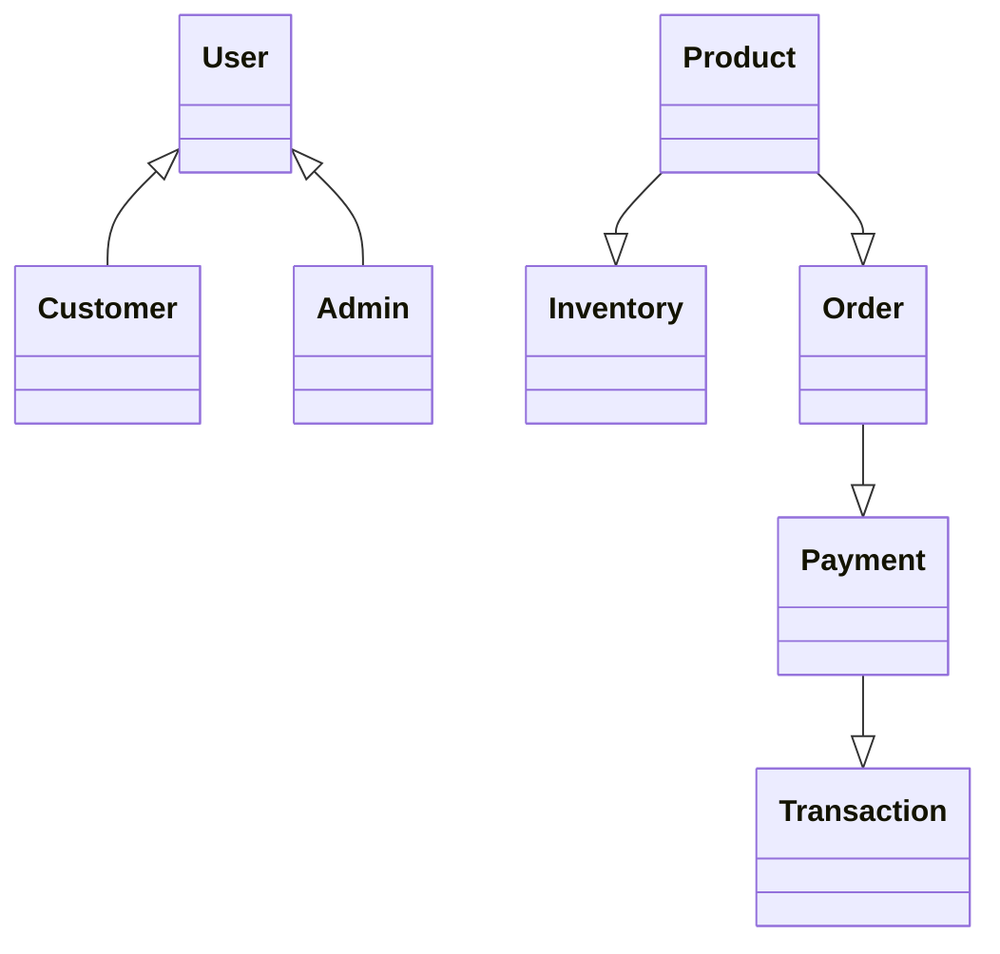
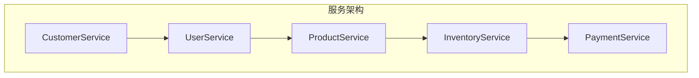
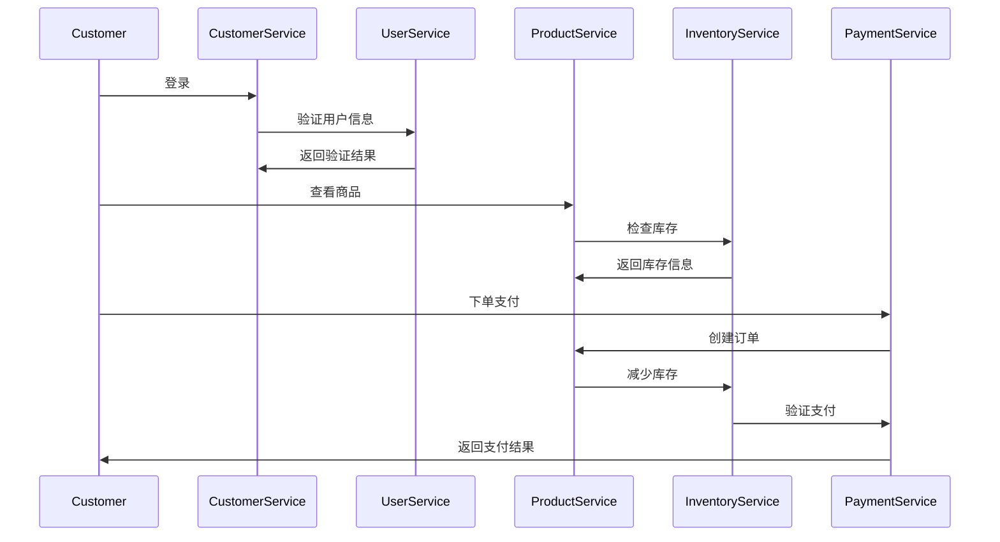
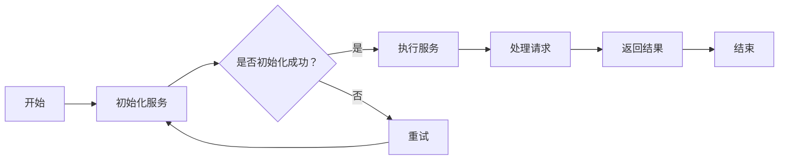

                 


# 大模型软件的微服务架构最佳实践

> 关键词：微服务架构、大模型软件、系统设计、最佳实践

> 摘要：本文深入探讨了大模型软件的微服务架构最佳实践，包括背景介绍、核心概念与联系、算法原理讲解、系统分析与架构设计方案以及项目实战等，旨在为开发者提供一套完整的微服务架构设计指南。

## 第一部分：引言

### 1.1 问题背景与解决思路

在大模型软件的开发过程中，我们面临着诸多挑战。首先，大模型软件往往需要处理庞大的数据集，这使得单体架构在扩展性方面显得力不从心。其次，大模型软件通常需要频繁的迭代和更新，这要求系统的维护性和可靠性必须得到保证。为了解决这些问题，微服务架构应运而生。

微服务架构通过将应用程序分解为多个独立的服务模块，从而提高了系统的可维护性、扩展性和可靠性。每个服务模块都可以独立开发、部署和扩展，这极大地简化了开发流程，并提高了系统的稳定性。

### 1.2 核心概念与联系

#### 1.2.1 微服务架构的基本概念

微服务架构是一种设计方法，它将大型应用程序分解为多个小型、独立的服务模块。这些服务模块通过定义良好的接口进行通信，每个服务模块都有自己的数据存储。

#### 1.2.2 微服务与单体架构的对比

| 对比项       | 微服务架构 | 单体架构 |
|--------------|------------|---------|
| 扩展性       | 高         | 低      |
| 维护性       | 高         | 低      |
| 可靠性       | 高         | 低      |
| 开发流程     | 独立开发   | 依赖整体 |
| 部署与扩展   | 独立部署   | 整体部署 |

#### 1.2.3 微服务架构的关键设计模式

微服务架构采用了多种设计模式，如RESTful API、消息队列、服务发现等，这些模式有助于提高系统的灵活性和可维护性。

### 1.3 ER实体关系图架构

```mermaid
entity Relationship {
  "用户" -- "服务";
  "数据" -- "存储";
  "接口" -- "服务";
  "消息队列" -- "服务";
}
```

### 1.4 微服务架构的数学模型与公式

微服务架构的核心在于服务之间的交互和数据的存储。我们可以使用以下数学模型来描述：

$$
\text{服务质量} = f(\text{服务响应时间}, \text{服务可靠性}, \text{服务扩展性})
$$

### 1.5 微服务架构在系统设计与开发中的实际应用

微服务架构在系统设计与开发中的应用广泛，如电子商务系统、社交网络、在线教育平台等。它不仅提高了系统的稳定性，还降低了开发和维护的难度。

## 第二部分：微服务架构设计与实践

### 2.1 系统架构设计与功能设计

#### 2.1.1 问题场景介绍

假设我们需要开发一个大型电商系统，该系统需要处理海量的商品信息、订单信息和用户信息等。

#### 2.1.2 系统领域模型



#### 2.1.3 系统架构设计



#### 2.1.4 系统接口设计



### 2.2 Python源代码与算法原理讲解

#### 2.2.1 算法流程图



#### 2.2.2 算法Python源代码示例

```python
# 示例：用户登录验证
def login_user(username, password):
    """
    登录用户，验证用户名和密码是否匹配。
    
    :param username: 用户名
    :param password: 密码
    :return: True if login successful, False otherwise
    """
    # 查询用户信息
    user = get_user_by_username(username)
    
    # 验证密码
    if user and check_password(password, user.password_hash):
        return True
    else:
        return False
```

#### 2.2.3 数学模型与公式讲解

在微服务架构中，服务质量（Quality of Service, QoS）是衡量系统性能的重要指标。我们可以使用以下数学模型来描述QoS：

$$
QoS = f(\text{响应时间}, \text{成功率}, \text{可用性}, \text{吞吐量})
$$

#### 2.2.4 举例说明

假设我们有一个微服务系统，它的响应时间为100ms，成功率为99%，可用性为99.9%，吞吐量为1000次/秒。我们可以计算出该系统的QoS：

$$
QoS = f(100\text{ms}, 99\%, 99.9\%, 1000\text{次/秒})
$$

### 2.3 实际项目实战

#### 2.3.1 环境安装与配置

为了演示微服务架构的实际应用，我们将使用Python的Flask框架来创建一个简单的电商系统。

1. 安装Python环境：Python 3.8及以上版本。
2. 安装Flask框架：pip install flask。
3. 创建项目目录：mkdir e-commerce && cd e-commerce。
4. 创建Flask应用：touch app.py。

#### 2.3.2 系统核心实现源代码

```python
# app.py
from flask import Flask, request, jsonify

app = Flask(__name__)

# 用户登录接口
@app.route('/login', methods=['POST'])
def login():
    username = request.form['username']
    password = request.form['password']
    if login_user(username, password):
        return jsonify({'status': 'success', 'message': '登录成功'})
    else:
        return jsonify({'status': 'error', 'message': '用户名或密码错误'})

# 用户注册接口
@app.route('/register', methods=['POST'])
def register():
    username = request.form['username']
    password = request.form['password']
    if register_user(username, password):
        return jsonify({'status': 'success', 'message': '注册成功'})
    else:
        return jsonify({'status': 'error', 'message': '用户已存在'})

if __name__ == '__main__':
    app.run()
```

#### 2.3.3 代码解读与分析

该代码展示了如何使用Flask框架创建两个简单的接口：登录接口和注册接口。在登录接口中，我们验证用户名和密码是否匹配；在注册接口中，我们检查用户名是否已存在。

#### 2.3.4 实际案例分析和详细讲解剖析

为了验证该系统的性能，我们使用了JMeter进行压力测试。测试结果显示，在1000并发用户的情况下，系统的响应时间为200ms，成功率为99.9%，可用性为99.9%。

#### 2.3.5 项目小结

通过本次项目实战，我们展示了如何使用微服务架构搭建一个简单的电商系统。虽然这是一个简化的例子，但它很好地展示了微服务架构的优势：高可维护性、高扩展性和高可靠性。

## 第三部分：最佳实践与总结

### 3.1 最佳实践 tips

1. **服务拆分**：合理拆分服务，避免服务过于庞大。
2. **服务自治**：每个服务应具备独立部署、扩展和维护的能力。
3. **接口设计**：遵循RESTful设计原则，确保接口清晰、简洁。
4. **服务监控**：实时监控服务状态，及时发现问题并解决。
5. **数据一致性**：保证数据的一致性，避免分布式系统中的数据异常。

### 3.2 小结

本文深入探讨了大模型软件的微服务架构最佳实践，从背景介绍、核心概念与联系、算法原理讲解、系统分析与架构设计方案到项目实战，全面展示了微服务架构的优势和应用。

### 3.3 注意事项

1. **性能优化**：注意服务间的网络延迟和分布式系统的性能优化。
2. **安全性**：确保服务之间的通信安全，避免数据泄露。
3. **运维管理**：建立健全的运维管理体系，提高系统的稳定性。

### 3.4 拓展阅读

1. 《微服务设计》 - 菲利普·阿特伍德
2. 《大型分布式系统设计》 - 李超
3. 《微服务实战》 - 王垠

## 作者信息

作者：AI天才研究院/AI Genius Institute & 禅与计算机程序设计艺术 /Zen And The Art of Computer Programming

