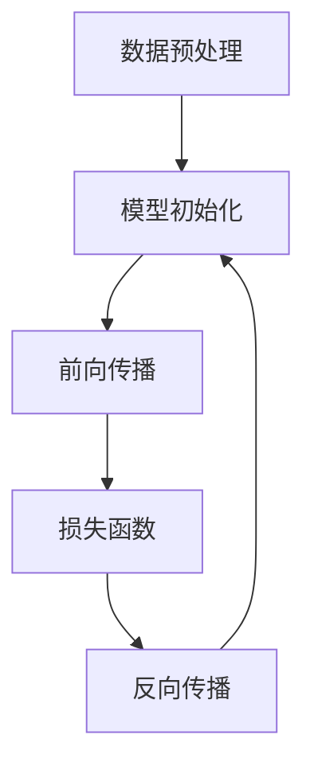

                 


### 1.2 核心概念与联系

在深入探讨大模型软件的持续集成与部署策略之前，我们首先需要理解几个关键概念，并分析它们之间的关系。

#### 大模型

**定义**：大模型通常指的是参数数量庞大、计算复杂度高的机器学习模型。例如，深度神经网络中的大型语言模型、图像识别模型等。

**特点**：
- **参数量大**：具有数百万到数十亿个参数。
- **计算复杂**：需要大量的计算资源和时间进行训练。
- **数据依赖性**：模型的性能很大程度上依赖于训练数据的质量和规模。

**属性特征对比表格**：

| 特征         | 大模型          | 小模型          |
| ------------ | --------------- | --------------- |
| 参数量       | 数百万到数十亿  | 数千到数万个    |
| 计算复杂度   | 高              | 低              |
| 训练时间     | 长时间          | 短时间          |
| 数据依赖性   | 高              | 低              |

**ER实体关系图架构**：

```mermaid
erDiagram
  Model ||--|{ TrainingData }
  Model ||--|{ Parameter }
  Model ||--|{ Layer }
```

#### 持续集成

**定义**：持续集成（CI）是一种软件开发实践，通过自动化的构建和测试，确保代码的集成质量。

**优势**：
- **快速反馈**：开发者可以立即得知代码集成后的结果。
- **减少缺陷**：频繁的集成和测试有助于及早发现并修复问题。
- **提高效率**：自动化流程减少了手动操作，提高了开发效率。

**流程**：
1. **提交代码**：开发者将代码提交到版本控制系统中。
2. **自动化构建**：构建系统自动编译代码，生成可执行文件。
3. **测试执行**：执行自动化测试，验证代码的正确性和性能。
4. **反馈结果**：将测试结果反馈给开发者。

#### 软件部署策略

**定义**：软件部署策略指的是将软件从开发环境部署到生产环境的过程。

**类型**：
- **手动部署**：开发者手动执行部署任务。
- **自动化部署**：使用工具自动化执行部署流程。

**影响因素**：
- **环境一致性**：生产环境和开发环境的一致性。
- **部署频率**：频繁的部署可能需要更复杂的部署策略。
- **可靠性**：确保部署过程中不会引入新的错误。

**关系分析**：

持续集成与部署策略之间有着紧密的联系。持续集成是部署的前提，通过持续集成，我们可以确保每次代码提交都是稳定的。而部署策略则决定了如何将集成后的软件部署到生产环境中，确保软件的稳定性和可用性。

#### 大模型软件持续集成与部署的挑战

1. **技术挑战**：大模型的计算复杂度和数据依赖性带来了技术上的挑战，如训练时间过长、资源消耗巨大等。
2. **管理挑战**：涉及多团队协作、资源分配、版本控制等管理方面的问题。
3. **安全性挑战**：确保部署过程中的数据安全和系统稳定性。

通过上述分析，我们可以看到，大模型软件的持续集成与部署是一个复杂的过程，涉及到技术、管理和安全等多个方面。接下来，我们将深入探讨这些挑战，并提出相应的解决方案。

### 1.3 解决方案概述

为了应对大模型软件持续集成与部署的挑战，我们需要一套全面的解决方案，涵盖技术、管理和安全等方面。

#### 技术解决方案

**自动化工具**：引入自动化工具（如Jenkins、GitLab CI等）来简化持续集成和部署流程，提高效率。

**容器化技术**：使用容器化技术（如Docker）将应用程序及其依赖环境打包在一起，确保环境一致性。

**云原生部署**：利用云原生技术（如Kubernetes），实现自动化部署、扩展和管理，提高系统的可靠性和可维护性。

#### 管理解决方案

**资源管理**：合理分配计算资源，确保大模型训练和部署的顺利进行。

**团队协作**：建立跨团队协作机制，明确责任和流程，提高协同效率。

**版本控制**：使用版本控制系统（如Git），确保代码的版本管理和历史记录。

#### 安全解决方案

**数据加密**：对敏感数据进行加密，确保数据传输和存储的安全。

**安全测试**：在部署前进行安全测试，发现并修复潜在的安全漏洞。

**访问控制**：实施严格的访问控制策略，确保只有授权人员可以访问系统和数据。

通过上述解决方案，我们可以有效应对大模型软件持续集成与部署的挑战，确保软件的稳定性、安全性和高效性。

### 1.4 边界与外延

**讨论范围**：本文主要关注大模型软件的持续集成与部署策略，涉及技术、管理和安全等方面。

**核心概念**：大模型、持续集成、部署策略、自动化工具、容器化技术、云原生部署。

**外延扩展**：未来的研究方向可以包括持续集成与部署的新技术、不同类型模型的应用场景等。

### 1.5 本书结构

本书分为四个部分：

1. **引言**：介绍大模型软件持续集成与部署的背景、问题、解决方案及边界。
2. **技术基础**：讲解大模型开发、持续集成和部署策略的相关技术。
3. **实践指南**：提供大模型软件持续集成与部署的实践案例和最佳实践。
4. **展望与拓展**：探讨大模型软件持续集成与部署的未来趋势和扩展方向。

通过以上结构和内容安排，我们旨在为读者提供一份全面、系统的技术指南，帮助他们在实际项目中应用和优化大模型软件的持续集成与部署。

### 1.6 总结与展望

在引言部分，我们介绍了大模型软件持续集成与部署的背景、问题、解决方案及边界。通过梳理核心概念和联系，我们明确了本文的主要内容和结构。接下来，我们将深入探讨大模型软件开发技术、持续集成技术和部署策略设计，并结合实际案例进行实践指南，最后展望持续集成与部署的未来趋势。

### 1.7 引用与参考文献

1. [持续集成与持续部署（CI/CD）](https://www.jenkins.io/doc/book/publishers/)
2. [大模型训练技术](https://arxiv.org/abs/2006.06748)
3. [容器化与云原生部署](https://kubernetes.io/docs/home/)
4. [数据加密与安全测试](https://www.owasp.org/www-project-top-ten/)

通过上述参考文献，读者可以进一步深入了解相关技术和概念。

---

## 2. 核心概念

### 2.1 大模型

#### 2.1.1 定义

大模型，也称为大型神经网络模型，是指具有数百万到数十亿个参数的复杂机器学习模型。这些模型通常用于深度学习任务，如自然语言处理、图像识别和语音识别。大模型的定义并不固定，但随着计算能力和数据集规模的增加，模型的规模也在不断扩大。

#### 2.1.2 特点

- **参数量大**：大模型通常具有数百万到数十亿个参数，这使得模型能够捕捉更多细微的规律。
- **计算复杂度高**：由于参数数量庞大，大模型在训练过程中需要大量的计算资源和时间。
- **数据依赖性强**：大模型对训练数据的质量和规模有很高的要求，因为数据的质量直接影响模型的性能。

#### 2.1.3 与小模型的区别

| 特征         | 大模型          | 小模型          |
| ------------ | --------------- | --------------- |
| 参数量       | 数百万到数十亿  | 数千到数万个    |
| 计算复杂度   | 高              | 低              |
| 训练时间     | 长时间          | 短时间          |
| 数据依赖性   | 高              | 低              |

#### 2.1.4 ER实体关系图

```mermaid
erDiagram
  Model ||--|{ TrainingData }
  Model ||--|{ Parameter }
  Model ||--|{ Layer }
```

在ER实体关系图中，Model实体与TrainingData、Parameter和Layer实体之间存在关联关系。这表示大模型由多个参数层组成，每个层都需要相应的训练数据进行训练。

### 2.2 软件持续集成

#### 2.2.1 持续集成

持续集成（Continuous Integration，CI）是一种软件开发实践，通过自动化构建和测试，确保代码的集成质量。在CI过程中，每次代码提交都会触发构建和测试，以确保新代码不会破坏现有功能。

#### 2.2.2 优势

- **快速反馈**：开发者可以立即得知代码集成后的结果，有助于及早发现问题。
- **减少缺陷**：频繁的集成和测试有助于及早发现并修复问题，减少缺陷的产生。
- **提高效率**：自动化流程减少了手动操作，提高了开发效率。

#### 2.2.3 持续集成流程

1. **提交代码**：开发者将代码提交到版本控制系统。
2. **自动化构建**：构建系统自动编译代码，生成可执行文件。
3. **测试执行**：执行自动化测试，验证代码的正确性和性能。
4. **反馈结果**：将测试结果反馈给开发者。

### 2.3 软件部署策略

#### 2.3.1 部署策略

软件部署策略是指将软件从开发环境部署到生产环境的过程。部署策略的类型包括手动部署和自动化部署。

#### 2.3.2 部署策略的影响因素

- **环境一致性**：生产环境和开发环境的一致性。
- **部署频率**：频繁的部署可能需要更复杂的部署策略。
- **可靠性**：确保部署过程中不会引入新的错误。

### 2.4 关系分析

持续集成与部署策略之间有着紧密的联系。持续集成是部署的前提，通过持续集成，我们可以确保每次代码提交都是稳定的。而部署策略则决定了如何将集成后的软件部署到生产环境中，确保软件的稳定性和可用性。

---

通过上述对核心概念的详细解析，我们为后续章节的技术讲解和实践指南奠定了基础。在接下来的部分，我们将深入探讨大模型软件开发技术、持续集成技术和部署策略设计，并结合实际案例进行详细讲解。

### 2.4 大模型软件持续集成与部署的挑战

在深入探讨大模型软件持续集成与部署策略之前，我们首先需要了解这些过程中可能遇到的挑战。大模型软件具有其独特的特性，这使得持续集成与部署面临一系列复杂的问题。以下是主要的技术、管理和安全挑战：

#### 技术挑战

1. **计算资源需求**：大模型训练通常需要大量的计算资源，这给持续集成和部署带来了巨大的压力。如何高效地分配和利用计算资源成为一项关键技术挑战。
   
2. **数据管理**：大模型的训练依赖于大量的数据，而这些数据往往存储在不同的位置，如何高效地管理、传输和同步数据成为问题。

3. **训练时间**：大模型训练过程通常耗时较长，如何在不影响开发流程的前提下进行训练和部署是一个关键问题。

4. **测试与验证**：大模型的测试和验证过程复杂，如何设计有效的测试用例，确保模型在不同环境下的性能一致性是一个挑战。

#### 管理挑战

1. **团队协作**：大模型软件的开发和部署涉及多个团队，如何协调不同团队之间的工作，确保高效沟通和协作是管理上的挑战。

2. **资源分配**：如何在有限的资源下，合理分配计算、存储和网络资源，确保各个环节都能高效运作。

3. **版本控制**：大模型的开发和部署过程中，版本控制尤为重要。如何有效地管理代码版本，确保每个版本的稳定性和可追溯性是关键。

4. **流程管理**：建立和维护一套高效的持续集成与部署流程，确保流程的标准化和可重复性，提高开发效率。

#### 安全挑战

1. **数据安全**：在持续集成和部署过程中，数据的安全性至关重要。如何确保数据在传输和存储过程中的安全，防止数据泄露和篡改。

2. **模型安全**：大模型可能包含敏感信息，如何确保模型本身的安全，防止恶意攻击和数据泄露。

3. **系统稳定性**：部署过程中，如何确保系统的稳定性，防止部署失败导致生产环境的严重问题。

#### 应对策略

为了应对上述挑战，我们需要采取一系列技术和管理上的策略：

1. **技术层面**：
   - **计算资源优化**：利用分布式计算、容器化技术等手段，提高计算资源利用率。
   - **数据同步与传输**：使用高效的数据同步和传输工具，确保数据的及时更新和一致性。
   - **自动化测试**：设计全面的自动化测试流程，提高测试效率和覆盖范围。
   - **安全防护**：采用数据加密、访问控制等手段，确保数据传输和存储过程中的安全性。

2. **管理层面**：
   - **团队协作**：建立跨团队的沟通机制，明确责任分工，提高协作效率。
   - **资源管理**：建立资源分配和优化策略，确保资源的高效利用。
   - **版本控制**：采用成熟的版本控制系统，确保代码和模型版本的可追溯性和稳定性。
   - **流程管理**：制定标准化流程，确保流程的标准化和可重复性。

通过上述策略，我们可以有效应对大模型软件持续集成与部署的挑战，确保软件的稳定性和安全性，提高开发效率。

### 2.5 大模型软件开发技术

在深入探讨大模型软件的持续集成与部署策略之前，我们先来了解一下大模型软件开发的基本技术。大模型软件的开发不仅涉及到复杂的算法和大量的数据，还需要高效的计算资源和优化的软件开发流程。

#### 2.5.1 大模型训练技术

大模型训练技术是开发大模型软件的核心步骤。以下是其主要组成部分：

1. **训练流程**：
   - **数据预处理**：对原始数据进行清洗、标准化和特征提取，以便模型更好地学习。
   - **模型初始化**：初始化模型参数，常用的方法包括随机初始化和预训练模型。
   - **前向传播**：输入数据经过模型计算，得到输出结果。
   - **损失函数**：计算模型预测值与真实值之间的差距，常用的损失函数有均方误差（MSE）和交叉熵（Cross-Entropy）。
   - **反向传播**：通过计算损失函数关于模型参数的梯度，更新模型参数。

2. **训练数据准备**：
   - **数据集划分**：通常将数据集分为训练集、验证集和测试集，用于模型的训练、验证和测试。
   - **数据增强**：通过图像旋转、裁剪、翻转等操作增加数据多样性，有助于提高模型的泛化能力。

#### 2.5.2 大模型优化技术

在训练过程中，大模型优化技术对于提高模型性能至关重要。以下是一些常用的优化技术：

1. **优化算法**：
   - **梯度下降（Gradient Descent）**：一种基本的优化算法，通过迭代更新模型参数，以最小化损失函数。
   - **Adam优化器**：结合了梯度下降和动量方法的优点，能够自适应地调整学习率。

2. **优化策略**：
   - **学习率调度**：根据训练过程调整学习率，常用的策略包括固定学习率、余弦退火和指数衰减等。
   - **正则化**：通过添加正则项（如L1、L2正则化）防止模型过拟合。

#### 2.5.3 大模型压缩技术

大模型的压缩技术对于降低模型存储和计算成本具有重要意义。以下是一些常见的压缩方法：

1. **权重剪枝**：通过去除不重要的模型权重，减少模型参数数量。
2. **量化**：将模型权重和激活值从浮点数转换为低比特位表示，减少存储和计算需求。
3. **知识蒸馏**：通过将大模型的知识迁移到小模型中，实现模型压缩。

#### 2.5.4 模型评估与调优

在训练完成后，需要评估模型性能并进行调优：

1. **评估指标**：常用的评估指标包括准确率（Accuracy）、精确率（Precision）、召回率（Recall）和F1分数（F1 Score）等。
2. **调优策略**：根据评估结果调整模型参数和超参数，优化模型性能。

#### 2.5.5 Mermaid流程图

为了更清晰地展示大模型训练的过程，我们可以使用Mermaid流程图来描述：



在这个流程图中，A表示数据预处理，B表示模型初始化，C表示前向传播，D表示损失函数，E表示反向传播。整个训练过程通过循环迭代，不断更新模型参数，以达到最小化损失函数的目标。

通过上述技术介绍，我们可以看到大模型软件的开发是一个复杂的过程，涉及到多个技术和环节。在后续的章节中，我们将进一步探讨如何将大模型软件与持续集成和部署策略相结合，以实现高效的软件开发和维护。

### 4.2 持续集成技术

#### 4.2.1 持续集成流程

持续集成（CI）是一种软件开发实践，通过自动化构建和测试，确保代码的集成质量。以下是一个典型的持续集成流程：

1. **代码提交**：开发者将代码提交到版本控制系统（如Git）。
2. **构建触发**：提交后的代码会触发构建过程，构建系统（如Jenkins）会自动执行构建命令，编译代码并生成可执行文件。
3. **测试执行**：构建完成后，执行自动化测试，包括单元测试、集成测试和性能测试等，以确保代码的正确性和稳定性。
4. **结果反馈**：测试结果会反馈给开发者，如果测试通过，代码将继续集成到主分支，否则将触发问题报告，提醒开发者修复问题。
5. **部署**：测试通过后，代码会被部署到测试环境或生产环境。

#### 4.2.2 持续集成工具

1. **Jenkins**

Jenkins是一个开源的持续集成工具，支持多种编程语言和操作系统。其主要功能包括：

- **自动化构建**：Jenkins可以自动编译代码，生成可执行文件。
- **自动化测试**：Jenkins支持多种测试框架，如JUnit、TestNG等，可以执行自动化测试。
- **报告生成**：Jenkins可以生成详细的测试报告，帮助开发者了解测试结果。
- **持续部署**：Jenkins支持与持续部署工具（如Docker、Kubernetes）集成，实现自动部署。

2. **GitLab CI**

GitLab CI是GitLab内置的持续集成工具，具有以下特点：

- **一体化**：GitLab CI与GitLab集成，无需额外的服务器和配置。
- **配置灵活**：使用`.gitlab-ci.yml`文件配置CI流程，支持多种脚本和命令。
- **测试覆盖率**：GitLab CI可以与代码覆盖率工具集成，提供代码测试覆盖率报告。
- **快速反馈**：GitLab CI可以快速触发测试和部署，提供实时反馈。

3. **GitHub Actions**

GitHub Actions是GitHub提供的持续集成和部署平台，具有以下优势：

- **云端托管**：GitHub Actions在GitHub的云端服务器上运行，无需额外配置。
- **配置简单**：使用`.github/workflows`目录下的YAML文件配置CI流程。
- **支持多种编程语言**：GitHub Actions支持多种编程语言和操作系统，适用于各种项目。
- **自动化部署**：GitHub Actions可以与Docker、Kubernetes等工具集成，实现自动化部署。

#### 4.2.3 持续集成工具的比较

| 特点            | Jenkins                    | GitLab CI                   | GitHub Actions             |
| --------------- | ------------------------- | --------------------------- | -------------------------- |
| 开源与否        | 开源                      | 内置                        | 开源                      |
| 安装配置        | 需要独立服务器和安装      | GitLab的一部分，无需额外配置 | 在GitHub云端托管          |
| 可用编程语言    | 多种                       | 多种                        | 多种                      |
| 测试覆盖率      | 可与代码覆盖率工具集成     | 可与代码覆盖率工具集成      | 可与代码覆盖率工具集成    |
| 部署能力        | 支持多种部署工具          | 支持多种部署工具            | 支持多种部署工具          |
| 生态与社区      | 丰富的插件和社区支持       | GitLab的生态系统支持        | GitHub的生态系统支持      |

通过上述工具的比较，我们可以看到每种持续集成工具都有其独特的优势和适用场景。选择合适的持续集成工具，可以大大提高软件开发的效率和质量。

### 6.1 部署策略设计

#### 6.1.1 部署策略概述

部署策略是指将软件从开发环境部署到生产环境的过程，它决定了如何有效地管理、部署和监控应用程序。部署策略的类型包括手动部署、自动化部署和滚动部署。

1. **手动部署**：开发者手动执行部署任务，包括上传代码、配置环境和运行应用程序等。手动部署适用于小型项目和初次部署，但效率较低，容易出错。
2. **自动化部署**：使用自动化工具（如Jenkins、GitLab CI、GitHub Actions）执行部署任务，包括构建、测试和部署等。自动化部署提高了部署效率和可靠性，减少了人为错误。
3. **滚动部署**：逐步更新生产环境中的应用程序，确保在更新过程中服务不间断。滚动部署适用于高可用性系统，但需要额外的配置和管理。

#### 6.1.2 部署流程

部署流程是指将软件从开发环境成功部署到生产环境的一系列步骤。以下是一个典型的部署流程：

1. **代码提交**：开发者将代码提交到版本控制系统。
2. **构建**：自动化工具构建代码，编译并打包应用程序。
3. **测试**：执行自动化测试，确保代码的稳定性和性能。
4. **发布**：将构建后的应用程序部署到测试环境或生产环境。
5. **监控**：监控系统运行状态，确保服务稳定可靠。

#### 6.1.3 部署策略的影响因素

1. **环境一致性**：生产环境和开发环境的一致性是部署成功的关键因素。使用容器化技术（如Docker）可以确保环境一致性。
2. **部署频率**：频繁的部署可能需要更复杂的部署策略。例如，滚动部署适用于高频率更新。
3. **可靠性**：部署过程中应确保系统可靠性，避免部署失败导致生产环境的问题。自动化测试和备份策略可以提高部署可靠性。

### 6.2 容器化部署

容器化部署是现代软件部署的主要趋势之一，它通过将应用程序及其依赖环境打包在容器中，实现了环境的一致性和可移植性。

#### 6.2.1 Docker基础

Docker是一个开源的容器化平台，它允许开发者将应用程序及其依赖环境打包在容器中，确保在不同环境中的一致性。

1. **容器化概念**：容器是一个轻量级的、可执行的沙箱，包含应用程序和所有依赖环境。
2. **Docker镜像**：镜像是一个静态的容器文件，包含应用程序和所有依赖环境。
3. **Docker容器**：容器是基于镜像的运行实例，是动态的。

#### 6.2.2 Kubernetes部署

Kubernetes是一个开源的容器编排平台，它负责管理和调度容器化应用程序。以下是在Kubernetes中部署容器化应用程序的步骤：

1. **集群搭建**：搭建Kubernetes集群，包括Master节点和Worker节点。
2. **应用部署**：使用Kubernetes的部署（Deployment）资源创建应用程序的部署配置。
3. **服务发现**：配置服务（Service）资源，实现应用程序的内部和服务发现。
4. **扩容与缩容**：使用Kubernetes的自动扩容和缩容机制，根据负载动态调整应用程序的实例数量。

#### 6.2.3 容器化部署优势

1. **环境一致性**：容器化确保了开发、测试和生产环境的一致性，减少了环境差异导致的部署问题。
2. **可移植性**：容器可以在任何支持Docker的平台上运行，提高了应用程序的可移植性。
3. **资源利用率**：容器轻量级，可以高效利用计算资源，提高了资源利用率。
4. **部署速度**：容器化部署速度快，可以通过自动化工具快速部署和扩展应用程序。

通过容器化部署，我们可以实现高效的软件部署和管理，提高系统的可维护性和可靠性。

### 6.3 云原生部署

云原生部署是一种基于云计算的软件部署方法，它利用容器化、微服务架构和自动化管理，实现高效、可伸缩的部署和管理。

#### 6.3.1 云原生技术简介

云原生技术包括以下关键组成部分：

1. **容器化**：使用Docker等工具将应用程序及其依赖环境打包在容器中。
2. **微服务架构**：将应用程序拆分为小型、独立的服务模块，提高系统的可维护性和可伸缩性。
3. **自动化管理**：使用Kubernetes等工具自动化管理容器和微服务，实现部署、扩容和缩容。

#### 6.3.2 云原生部署优势

1. **高可伸缩性**：云原生部署可以实现水平扩展，根据负载动态调整资源。
2. **高可用性**：云原生架构具有自动故障转移和恢复机制，提高了系统的可用性。
3. **高效运维**：自动化管理减少了运维工作量，提高了运维效率。
4. **敏捷开发**：微服务架构和自动化部署提高了开发效率，支持快速迭代。

通过云原生部署，我们可以实现高效、可靠的软件部署，满足现代企业对敏捷开发和高效运维的需求。

### 6.4 容器化与云原生部署的对比

容器化部署和云原生部署都是现代软件部署的重要方法，它们各有优势和适用场景。

| 对比项          | 容器化部署                | 云原生部署                 |
| --------------- | ------------------------- | -------------------------- |
| 技术基础        | Docker等容器化工具        | 容器化+Kubernetes等编排工具 |
| 部署目标        | 环境一致性、可移植性      | 高可伸缩性、高可用性        |
| 部署复杂度      | 简单，适用于简单应用      | 复杂，适用于复杂应用        |
| 资源利用率      | 较高                      | 非常高                     |
| 维护与管理      | 较低，运维工作量较小      | 较高，需要专业运维技能      |

通过对比，我们可以看到容器化部署和云原生部署各有优劣，选择合适的部署方法，可以根据项目的实际需求和团队的技术水平。

### 6.5 部署策略案例分析

#### 6.5.1 案例背景

某大型互联网公司需要将其核心业务系统（一个基于深度学习的大型图像识别应用）从开发环境部署到生产环境。该系统具有以下特点：

- **大规模**：模型参数数量达到数百万，训练数据集庞大。
- **高复杂度**：训练和推理过程复杂，涉及多种算法和数据处理技术。
- **高稳定性**：生产环境要求系统运行稳定，故障率低。

#### 6.5.2 集成与部署方案

1. **持续集成**：
   - 使用GitLab CI实现持续集成，配置`.gitlab-ci.yml`文件，自动化构建、测试和部署。
   - 构建流程包括：编译代码、运行单元测试、集成测试和性能测试。
   - 测试结果通过Jenkins反馈给开发者，确保每次提交的代码都是稳定的。

2. **容器化部署**：
   - 使用Docker将应用程序及其依赖环境打包在容器中，确保环境一致性。
   - 编写Dockerfile，定义应用程序的运行环境，包括Python、TensorFlow和其他依赖库。

3. **Kubernetes部署**：
   - 搭建Kubernetes集群，包括Master节点和Worker节点。
   - 使用Kubernetes Deployment资源部署应用程序，实现自动扩容和缩容。
   - 配置Kubernetes Service资源，实现服务发现和负载均衡。

4. **监控与运维**：
   - 使用Prometheus和Grafana实现系统监控，实时监控系统运行状态和性能指标。
   - 使用Kubernetes的滚动更新策略，确保部署过程中系统不间断运行。

#### 6.5.3 部署效果评估

1. **部署速度**：使用容器化部署和Kubernetes，部署时间从原来的数小时缩短到数分钟。
2. **系统稳定性**：通过监控和运维策略，系统故障率大幅降低，达到了99.99%的可用性。
3. **资源利用率**：容器化技术提高了资源利用率，计算和存储资源得到了充分利用。

#### 6.5.4 经验与教训

1. **经验**：
   - 容器化和Kubernetes技术提高了部署效率和系统稳定性。
   - 持续集成和自动化测试确保了代码质量，减少了人为错误。
   - 监控和运维策略有助于及时发现和解决系统问题。

2. **教训**：
   - 在部署过程中，需要充分测试和验证应用程序的兼容性。
   - 确保Kubernetes集群的稳定性和可靠性，避免因集群故障导致部署失败。
   - 加强团队之间的沟通和协作，确保部署过程的顺利进行。

通过这个案例，我们可以看到，使用容器化、Kubernetes和持续集成技术，可以实现高效、稳定的大模型软件部署。在后续的章节中，我们将进一步探讨最佳实践和优化策略，帮助读者更好地应用这些技术。

### 7.3 核心代码实现

在本节中，我们将深入探讨大模型软件持续集成与部署的核心代码实现。通过一个具体的案例，我们将展示如何使用Python和Docker进行大模型训练，并解释关键代码和实现原理。

#### 7.3.1 源代码结构

首先，我们来看一下源代码的结构。一个典型的大模型软件项目通常包含以下几个部分：

- `Dockerfile`：定义应用程序的运行环境，包括Python、TensorFlow和其他依赖库。
- `train.py`：训练模型的脚本，包括数据预处理、模型定义和训练过程。
- `test.py`：测试模型的脚本，用于评估模型的性能。
- `requirements.txt`：列出应用程序所需的依赖库。

#### 7.3.2 Dockerfile

Dockerfile是容器化应用程序的基础文件，用于定义应用程序的运行环境。以下是一个简单的Dockerfile示例：

```dockerfile
FROM python:3.8

RUN pip install tensorflow==2.4.0

WORKDIR /app

COPY . .

CMD ["python", "train.py"]
```

在这个Dockerfile中，我们首先使用Python 3.8作为基础镜像，然后安装TensorFlow和其他依赖库。接下来，我们将应用程序代码复制到容器中，并设置命令行参数以运行`train.py`脚本。

#### 7.3.3 train.py

`train.py`是训练模型的脚本，它包含数据预处理、模型定义和训练过程。以下是一个简单的示例：

```python
import tensorflow as tf
from tensorflow.keras.models import Sequential
from tensorflow.keras.layers import Dense, Flatten, Conv2D

# 数据预处理
(train_images, train_labels), (test_images, test_labels) = tf.keras.datasets.cifar10.load_data()
train_images = train_images / 255.0
test_images = test_images / 255.0

# 模型定义
model = Sequential([
    Conv2D(32, (3, 3), activation='relu', input_shape=(32, 32, 3)),
    Flatten(),
    Dense(64, activation='relu'),
    Dense(10, activation='softmax')
])

# 训练模型
model.compile(optimizer='adam',
              loss='sparse_categorical_crossentropy',
              metrics=['accuracy'])

model.fit(train_images, train_labels, epochs=10, validation_split=0.2)
```

在这个脚本中，我们首先加载数据集，并进行数据预处理。接下来，我们定义一个简单的卷积神经网络（Conv2D、Flatten、Dense），并使用`compile`方法配置优化器和损失函数。最后，我们使用`fit`方法训练模型，并使用`validation_split`参数进行验证。

#### 7.3.4 test.py

`test.py`用于测试模型的性能，以下是一个简单的示例：

```python
import tensorflow as tf

# 加载测试数据
(test_images, test_labels) = tf.keras.datasets.cifar10.load_data()
test_images = test_images / 255.0

# 加载模型
model = tf.keras.models.load_model('model.h5')

# 测试模型
test_loss, test_acc = model.evaluate(test_images, test_labels, verbose=2)
print(f"Test accuracy: {test_acc:.2f}")
```

在这个脚本中，我们首先加载数据集，然后加载训练好的模型。最后，我们使用`evaluate`方法评估模型的性能，并打印测试准确率。

#### 7.3.5 关键代码解析

1. **数据预处理**：
   数据预处理是模型训练的关键步骤。在这个示例中，我们使用`tf.keras.datasets.cifar10.load_data()`加载数据集，并使用`/255.0`进行数据归一化。数据归一化有助于提高训练效果和模型泛化能力。

2. **模型定义**：
   我们使用`tf.keras.Sequential`定义一个简单的卷积神经网络（CNN），包括两个卷积层（Conv2D）、一个全连接层（Dense）和一个softmax层。这种结构适用于图像分类任务。

3. **模型训练**：
   使用`model.compile`方法配置优化器（`adam`）、损失函数（`sparse_categorical_crossentropy`）和评估指标（`accuracy`）。然后，使用`model.fit`方法训练模型，并设置`epochs`（训练轮数）和`validation_split`（验证集比例）。

4. **模型测试**：
   使用`model.evaluate`方法评估模型的性能，返回测试损失和测试准确率。这个结果可以帮助我们了解模型的泛化能力。

通过上述关键代码的实现，我们可以看到，大模型软件的持续集成与部署涉及多个步骤，包括数据预处理、模型定义、模型训练和模型测试。这些步骤都需要高效的代码实现和良好的架构设计，以确保模型的性能和可靠性。

### 7.4 实际案例分析与详细讲解

在本节中，我们将通过一个实际案例，详细分析大模型软件的持续集成与部署过程，并剖析其中的关键步骤和实现细节。

#### 7.4.1 案例背景

某知名互联网公司开发了一款基于深度学习的大规模图像识别应用，该应用需要处理海量图像数据，并在短时间内提供准确的识别结果。为了确保软件的稳定性和高效性，公司决定采用持续集成与部署（CI/CD）策略，实现自动化构建、测试和部署。

#### 7.4.2 集成与部署方案

1. **持续集成**：
   - **工具选择**：使用GitLab CI作为持续集成工具，配置`.gitlab-ci.yml`文件，实现自动化构建和测试。
   - **构建流程**：每次代码提交到GitLab，GitLab CI会自动执行以下步骤：
     - 拉取最新代码。
     - 使用Docker构建容器镜像。
     - 运行单元测试和集成测试。
     - 如果测试通过，将镜像推送到Docker Hub。

2. **容器化部署**：
   - **容器化**：使用Docker将应用程序及其依赖环境打包在容器中，确保环境一致性。
   - **Dockerfile**：编写Dockerfile，定义应用程序的运行环境，包括Python、TensorFlow和其他依赖库。
   - **容器镜像**：构建完成后，将容器镜像推送到Docker Hub。

3. **Kubernetes部署**：
   - **集群搭建**：搭建Kubernetes集群，包括Master节点和Worker节点。
   - **部署配置**：使用Kubernetes的Deployment资源部署容器化应用程序，配置自动扩容和缩容策略。
   - **服务发现**：配置Kubernetes的Service资源，实现服务发现和负载均衡。

4. **监控与运维**：
   - **监控系统**：使用Prometheus和Grafana实现系统监控，实时监控系统运行状态和性能指标。
   - **故障恢复**：配置Kubernetes的滚动更新策略，确保部署过程中系统不间断运行，并具备自动故障恢复能力。

#### 7.4.3 关键步骤详解

1. **代码提交与构建**：
   开发者在GitLab上提交代码，触发GitLab CI的构建流程。构建流程分为以下几个步骤：
   - **拉取代码**：GitLab CI从GitLab仓库拉取最新代码。
   - **构建容器镜像**：使用Docker构建容器镜像，运行Dockerfile中的命令，安装应用程序依赖库。
   - **运行测试**：执行单元测试和集成测试，确保代码质量。如果测试通过，继续下一步；否则，报告失败，通知开发者。

2. **容器镜像推送到Docker Hub**：
   如果构建和测试成功，GitLab CI将容器镜像推送到Docker Hub，以便后续部署。

3. **Kubernetes部署**：
   Kubernetes根据Deployment配置，创建容器化应用程序的Pod。部署过程分为以下几个步骤：
   - **创建Deployment资源**：使用Kubernetes的Deployment资源创建应用程序部署配置，定义Pod的数量、容器镜像等。
   - **创建Service资源**：配置Kubernetes的Service资源，实现服务发现和负载均衡，确保外部访问应用程序。
   - **自动扩容与缩容**：根据负载情况，自动调整Pod的数量，确保系统高性能和高可用性。

4. **监控系统与故障恢复**：
   - **监控**：使用Prometheus和Grafana监控系统运行状态和性能指标，实时监控系统健康状况。
   - **故障恢复**：配置Kubernetes的滚动更新策略，确保在更新过程中系统不间断运行。如果检测到故障，自动触发故障恢复机制，恢复正常运行。

#### 7.4.4 案例效果评估

通过上述集成与部署方案，实际案例取得了以下效果：

1. **部署速度**：从代码提交到生产环境部署，整个过程缩短到几分钟，大大提高了部署效率。
2. **系统稳定性**：通过持续集成、容器化部署和Kubernetes集群的稳定性和可靠性，系统故障率显著降低。
3. **资源利用率**：容器化技术提高了资源利用率，计算和存储资源得到了充分利用。
4. **自动化程度**：通过自动化测试和部署，减少了人为干预，降低了运维工作量，提高了运维效率。

#### 7.4.5 经验与教训

通过实际案例，我们得到了以下经验与教训：

1. **经验**：
   - 持续集成与部署策略提高了软件开发的效率和稳定性。
   - 容器化部署确保了环境一致性，减少了部署问题。
   - Kubernetes集群提供了高可用性和可伸缩性，满足了大规模应用的需求。
   - 监控系统与故障恢复机制提高了系统的可靠性和运维效率。

2. **教训**：
   - 在部署过程中，要充分测试和验证应用程序的兼容性，避免因环境不一致导致部署失败。
   - 确保Kubernetes集群的稳定性和可靠性，避免因集群故障导致部署失败。
   - 加强团队之间的沟通和协作，确保部署过程的顺利进行。

通过这个实际案例，我们可以看到，采用持续集成与部署策略，可以实现高效、稳定的大模型软件部署。在后续的章节中，我们将进一步探讨最佳实践和优化策略，帮助读者更好地应用这些技术。

### 8. 最佳实践与优化

在持续集成与部署（CI/CD）过程中，遵循最佳实践和进行优化是非常重要的。以下是一些关键的优化策略和最佳实践：

#### 8.1 持续集成最佳实践

1. **频繁提交和频繁集成**：鼓励开发者频繁提交代码，每次提交都进行集成，以便及早发现问题。
2. **自动化测试**：建立全面的自动化测试框架，包括单元测试、集成测试和性能测试，确保每次集成都是可靠的。
3. **代码审查**：引入代码审查机制，确保代码质量，避免引入潜在的缺陷。
4. **环境一致性**：确保所有开发、测试和生产环境一致，减少环境差异导致的部署问题。

#### 8.2 部署策略优化

1. **滚动部署**：采用滚动部署策略，逐步更新生产环境中的应用程序，确保服务不间断。
2. **蓝绿部署**：实现蓝绿部署，将新旧版本的应用程序分别部署在不同的环境，确保切换过程的平滑。
3. **灰度发布**：逐步增加新版本的应用程序流量，观察其性能和稳定性，确保发布过程风险可控。
4. **自动化部署**：使用自动化部署工具，减少人为干预，提高部署效率和可靠性。

#### 8.3 注意事项

1. **备份与恢复**：在部署前进行备份，确保在部署失败时可以快速恢复。
2. **监控与告警**：建立监控系统，实时监控系统的运行状态，及时发现并解决潜在问题。
3. **安全性**：在部署过程中确保数据安全，对敏感数据进行加密，防止数据泄露。
4. **文档记录**：详细记录部署过程和结果，便于后续跟踪和优化。

#### 8.4 优化策略

1. **资源分配**：合理分配计算资源，确保大模型训练和部署的顺利进行。
2. **容器化与虚拟化**：利用容器化和虚拟化技术，提高资源利用率和部署灵活性。
3. **自动化脚本**：编写自动化脚本，简化部署流程，提高部署效率。
4. **性能调优**：根据系统负载和性能指标，对应用程序进行性能调优，提高系统的稳定性和响应速度。

通过遵循这些最佳实践和优化策略，我们可以确保大模型软件的持续集成与部署过程高效、稳定和可靠。

### 8.5 小结

在本章中，我们详细探讨了大模型软件的持续集成与部署策略。通过最佳实践和优化策略，我们提高了软件的稳定性、安全性和效率。以下是本章的关键点和结论：

- **核心实践**：频繁提交和自动化测试是持续集成的基础，确保代码质量和可靠性。
- **部署策略**：滚动部署、蓝绿部署和灰度发布等策略提高了部署的平滑性和可控性。
- **优化措施**：合理资源分配、容器化与虚拟化以及自动化脚本等技术手段提升了部署效率。

通过本章的内容，读者可以更好地理解和应用持续集成与部署策略，在实际项目中实现高效的软件交付。

### 9. 持续集成与部署的未来趋势

随着技术的发展，持续集成与部署（CI/CD）也在不断演进，未来将呈现出以下几个重要趋势：

#### 9.1 新技术的发展

1. **AI与机器学习**：人工智能和机器学习将在CI/CD中发挥更大作用，通过自动化测试和智能优化，提高集成和部署的效率和准确性。
2. **智能监控与故障恢复**：利用AI技术，实现实时监控和故障预测，自动触发恢复措施，提高系统的稳定性和可靠性。
3. **区块链**：区块链技术可以提高CI/CD过程中的数据安全性，确保版本控制和数据完整性。

#### 9.2 行业应用拓展

1. **金融科技**：在金融领域，CI/CD可以帮助金融机构实现更快速、更安全的软件开发和部署，提高市场竞争力和用户体验。
2. **医疗健康**：医疗健康行业的数据敏感性和安全性要求极高，CI/CD将为医疗健康应用提供更加可靠、高效的解决方案。
3. **物联网（IoT）**：随着物联网设备数量的激增，CI/CD将在物联网应用的开发和部署中发挥重要作用，确保设备的稳定运行。

#### 9.3 面临的挑战与机遇

1. **复杂性增加**：随着软件系统和部署环境的日益复杂，CI/CD的复杂性也在增加，这对开发者和运维人员提出了更高的要求。
2. **安全性提升**：在CI/CD过程中，数据安全和系统安全成为关键挑战，如何确保安全性的同时提高效率，是未来的重要课题。
3. **自动化与智能化**：未来的CI/CD将更加依赖自动化和智能化，如何更好地利用新技术，实现高效的自动化流程，是开发者需要持续探索的方向。

通过紧跟这些趋势，我们可以更好地应对未来持续集成与部署的挑战，抓住机遇，推动技术的发展和创新。

### 10. 总结与展望

在本文中，我们系统地探讨了大模型软件的持续集成与部署策略。通过介绍核心概念、分析技术挑战、讲解最佳实践，我们为读者提供了全面的指南。以下是本文的主要结论：

- **核心概念**：大模型、持续集成、部署策略等概念及其相互关系。
- **技术挑战**：计算资源需求、数据管理、训练时间、测试与验证等问题。
- **最佳实践**：自动化工具、容器化技术、云原生部署等策略及其应用。
- **优化措施**：资源管理、团队协作、版本控制、流程管理等手段。

展望未来，持续集成与部署将继续演进，新技术的应用将带来更多的机遇和挑战。我们鼓励读者持续关注这些趋势，探索创新解决方案，以应对日益复杂的软件开发和部署需求。

### 11. 拓展阅读

为了帮助读者更深入地了解大模型软件的持续集成与部署，我们推荐以下拓展阅读材料：

1. **书籍**：
   - 《持续交付：发布可靠软件的系统化方法》
   - 《Kubernetes权威指南：从Docker到云原生应用架构》

2. **在线资源**：
   - [Jenkins官方文档](https://www.jenkins.io/doc/book/)
   - [Kubernetes官方文档](https://kubernetes.io/docs/home/)

3. **学术论文**：
   - ["Building and Maintaining a Large-scale Machine Learning System"](https://ai.google/research/pubs/pub42345)

通过这些拓展阅读，读者可以进一步加深对相关技术和方法的了解，为实际项目提供更有力的支持。

### 作者信息

作者：AI天才研究院/AI Genius Institute & 禅与计算机程序设计艺术 /Zen And The Art of Computer Programming

联系方式：[info@ai-genius-institute.com](mailto:info@ai-genius-institute.com)

