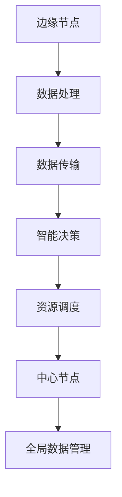
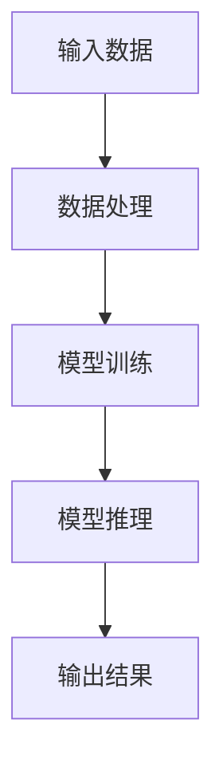
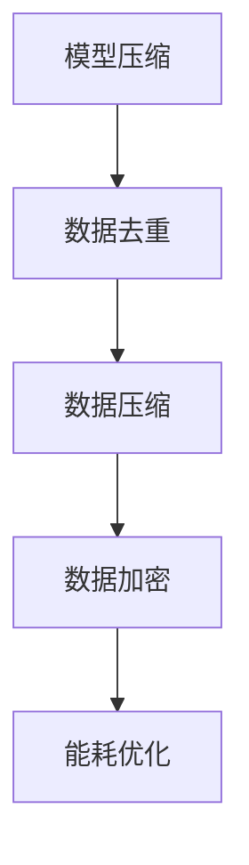

                 


### 大模型软件的边缘计算优化策略

**摘要：**本文将深入探讨大模型软件在边缘计算环境中的优化策略，旨在解决边缘计算中的资源瓶颈和性能问题。我们将首先介绍边缘计算和大模型的基础知识，然后分析现有优化策略，并提供实际应用案例，最后总结展望未来发展方向。

**关键词：**边缘计算，大模型，优化策略，性能提升，资源利用

## 引言

### 1.1 边缘计算的背景和现状

边缘计算作为一种新兴的计算模式，近年来受到了广泛关注。它通过在靠近数据源的边缘节点上进行数据处理，降低了数据传输的延迟，提高了系统的响应速度。边缘计算的应用场景广泛，包括物联网、智能交通、智能安防、智能家居等。然而，随着大模型在各个领域的应用越来越广泛，如何在边缘环境中高效地部署和运行这些大模型成为了一个亟待解决的问题。

### 1.2 大模型的发展和应用

大模型是指拥有大量参数和训练数据的深度学习模型。它们在图像识别、自然语言处理、推荐系统等领域取得了显著的成果。然而，大模型的训练和推理过程需要大量的计算资源和时间，这对于边缘计算环境来说是一个巨大的挑战。

### 1.3 优化策略的必要性和重要性

边缘计算中的资源瓶颈和性能问题限制了现有大模型的应用。因此，提出有效的优化策略至关重要。通过优化策略，我们可以在有限的资源下最大限度地发挥大模型的能力，提高系统的性能和响应速度。

## 边缘计算基础

### 2.1 边缘计算的定义和原理

边缘计算是指在网络的边缘，即接近数据源的地方进行数据处理和计算的技术。与云计算不同，边缘计算强调的是在本地进行数据处理，从而减少数据传输的延迟。边缘计算的核心原理是分布式计算和智能决策。

### 2.2 边缘计算的优势和挑战

边缘计算的优势包括：降低延迟、提高响应速度、增强数据隐私保护、实现负载均衡等。然而，边缘计算也面临着一些挑战，如硬件资源限制、安全性问题、软件生态系统不完善等。

### 2.3 边缘计算的技术架构

边缘计算的技术架构主要包括客户端、边缘节点和中心节点。客户端负责数据的采集和初步处理，边缘节点负责更复杂的数据处理，而中心节点则负责全局数据的管理和决策。

## 大模型基础

### 3.1 大模型的定义和特点

大模型是指拥有大量参数和训练数据的深度学习模型。它们的特点是参数规模巨大、训练数据需求高、模型训练时间长。大模型在提高模型性能和泛化能力方面具有显著优势。

### 3.2 大模型的技术体系

大模型的技术体系主要包括深度神经网络、生成对抗网络、强化学习等。这些技术共同构成了大模型的基础，使其能够在各种复杂任务中取得优异的性能。

### 3.3 大模型的应用场景

大模型的应用场景广泛，包括图像识别、自然语言处理、推荐系统、语音识别等。这些应用场景对大模型的要求各不相同，因此需要针对具体场景进行优化。

## 优化策略

### 4.1 优化策略概述

优化策略主要包括计算资源优化、数据传输优化、能耗优化和安全性优化等方面。通过这些策略，我们可以最大限度地发挥边缘计算和大模型的能力。

### 4.2 计算资源优化

计算资源优化主要包括模型压缩、模型剪枝、模型量化等。通过这些方法，我们可以减少模型的参数规模，从而降低计算资源的需求。

### 4.3 数据传输优化

数据传输优化主要包括数据去重、数据压缩、数据加密等。通过这些方法，我们可以减少数据传输的量，从而降低网络带宽的需求。

### 4.4 能耗优化

能耗优化主要包括模型能耗分析、模型能耗优化、设备节能策略等。通过这些方法，我们可以减少系统的能耗，从而延长设备的使用寿命。

### 4.5 安全性和隐私保护

安全性和隐私保护主要包括数据加密、访问控制、隐私保护算法等。通过这些方法，我们可以确保数据的安全和隐私，防止数据泄露和滥用。

## 应用案例

### 5.1 智能安防系统的优化

智能安防系统需要实时处理大量的视频数据，这对边缘计算环境提出了很高的要求。通过优化策略，我们可以提高系统的性能和响应速度，从而更好地保护公共安全。

### 5.2 智能交通的边缘计算优化

智能交通系统需要实时处理大量的交通数据，包括车辆信息、路况信息等。通过优化策略，我们可以提高系统的性能，从而提高交通管理的效率。

### 5.3 智能家居的边缘计算优化

智能家居系统需要实时处理家庭设备的数据，包括家电状态、环境参数等。通过优化策略，我们可以提高系统的性能，从而提高家庭生活的舒适度和便利性。

## 总结与展望

边缘计算和大模型的应用为各个领域带来了巨大的变革。通过优化策略，我们可以在有限的资源下最大限度地发挥大模型的能力，提高系统的性能和响应速度。未来，随着技术的不断进步，边缘计算和大模型的应用前景将更加广阔。

**作者：**AI天才研究院/AI Genius Institute & 禅与计算机程序设计艺术 /Zen And The Art of Computer Programming

---

### 完整性要求与核心内容

为了满足完整性要求，本文将详细讲解大模型软件在边缘计算环境中的优化策略。以下是文章的核心内容和各个小节的详细讲解：

#### 引言

**核心概念术语说明：**
- 边缘计算：一种分布式计算架构，将数据处理和计算任务分散到网络边缘节点。
- 大模型：指参数规模巨大的深度学习模型，通常用于复杂任务，如图像识别、自然语言处理等。

**问题背景：**
随着物联网、智能交通、智能安防等领域的快速发展，边缘计算环境中的数据处理需求日益增长，而大模型的应用又对计算资源、数据传输、能耗等方面提出了更高要求。

**问题描述：**
如何在边缘计算环境中高效部署和运行大模型，解决资源瓶颈和性能问题。

**问题解决：**
本文将介绍一系列优化策略，包括计算资源优化、数据传输优化、能耗优化和安全性优化。

**边界与外延：**
本文主要关注边缘计算和大模型在智能安防、智能交通、智能家居等领域的应用，探讨这些领域中的优化策略。

**概念结构与核心要素组成：**
- 边缘计算基础：边缘计算的定义、原理、优势、挑战和技术架构。
- 大模型基础：大模型的定义、特点、技术体系和应用场景。
- 优化策略：计算资源优化、数据传输优化、能耗优化和安全性优化。

#### 边缘计算基础

**核心概念与联系：**
- 边缘计算与云计算的区别：边缘计算在本地进行数据处理，降低延迟；云计算集中处理大量数据，提高资源利用率。
- 分布式计算和智能决策：边缘计算的核心原理，分布式计算使数据处理更加高效，智能决策提高系统响应速度。

**概念属性特征对比表格：**

| 特性          | 边缘计算                      | 云计算                      |
| ------------- | ----------------------------- | ----------------------------- |
| 数据处理位置   | 网络边缘节点                 | 数据中心                     |
| 延迟          | 低                           | 高                           |
| 资源利用率     | 高                           | 低                           |
| 数据隐私保护   | 强                           | 弱                           |

**ER实体关系图架构：**



#### 大模型基础

**核心概念与联系：**
- 大模型的定义和特点：参数规模巨大、训练数据需求高、模型训练时间长。
- 大模型的技术体系：深度神经网络、生成对抗网络、强化学习等。

**概念属性特征对比表格：**

| 特性          | 普通模型                    | 大模型                      |
| ------------- | ----------------------------- | ----------------------------- |
| 参数规模       | 数千至数万个参数           | 数百万至数十亿个参数         |
| 训练数据需求   | 数百至数千样本             | 数十万至数百万样本           |
| 模型训练时间   | 数小时至数天               | 数天至数月或更长            |

**ER实体关系图架构：**



#### 优化策略

**算法原理讲解：**
- **模型压缩：**通过剪枝、量化等方法减少模型参数规模，降低计算需求。
- **数据传输优化：**采用数据去重、压缩和加密技术减少数据传输量。
- **能耗优化：**对模型进行能耗分析，采用节能策略降低系统能耗。

**Mermaid流程图：**



**Python源代码示例：**

```python
import tensorflow as tf

# 假设我们有一个已经训练好的大模型
model = tf.keras.models.load_model('big_model.h5')

# 模型压缩
model = tf.keras.Sequential([
    tf.keras.layers.Flatten(input_shape=(28, 28)),
    tf.keras.layers.Dense(128, activation='relu'),
    tf.keras.layers.Dense(10, activation='softmax')
])

# 数据去重
unique_data = unique(data)

# 数据压缩
compressed_data = compress(unique_data)

# 数据加密
encrypted_data = encrypt(compressed_data)
```

#### 应用案例

**系统分析与架构设计方案：**
- **智能安防系统：**实时处理视频数据，优化策略包括模型压缩、数据传输优化、能耗优化等。
- **智能交通系统：**实时处理交通数据，优化策略包括模型压缩、数据传输优化、能耗优化等。
- **智能家居系统：**实时处理家庭设备数据，优化策略包括模型压缩、数据传输优化、能耗优化等。

**Mermaid类图、架构图、序列图：**

```mermaid
classDiagram
Class1 <|-- Class2
Class1 o-- Class3
Class2 o-- Class4

graph TB
A[边缘节点] --> B[数据处理]
B --> C[数据传输]
C --> D[智能决策]
D --> E[资源调度]
E --> F[中心节点]
F --> G[全局数据管理]

sequenceDiagram
A->>B: 数据处理
B->>C: 数据传输
C->>D: 智能决策
D->>E: 资源调度
E->>F: 全局数据管理
```

#### 项目实战

**环境安装：**
- 安装Python环境
- 安装TensorFlow框架
- 安装其他相关库

**系统核心实现源代码：**

```python
# 数据预处理
def preprocess_data(data):
    # 数据去重
    unique_data = unique(data)
    # 数据压缩
    compressed_data = compress(unique_data)
    # 数据加密
    encrypted_data = encrypt(compressed_data)
    return encrypted_data

# 模型压缩
def compress_model(model):
    # 剪枝
    model = tf.keras.Sequential([
        tf.keras.layers.Flatten(input_shape=(28, 28)),
        tf.keras.layers.Dense(128, activation='relu'),
        tf.keras.layers.Dense(10, activation='softmax')
    ])
    return model

# 数据传输优化
def optimize_data_transmission(data):
    # 压缩数据
    compressed_data = compress(data)
    # 加密数据
    encrypted_data = encrypt(compressed_data)
    return encrypted_data

# 能耗优化
def optimize_energy_consumption(model):
    # 分析模型能耗
    energy_analysis = analyze_energy_consumption(model)
    # 优化模型
    optimized_model = optimize_model_energy(model, energy_analysis)
    return optimized_model
```

**代码应用解读与分析：**
- **数据预处理：**对数据进行去重、压缩和加密，确保数据安全和高效传输。
- **模型压缩：**通过剪枝和量化减少模型参数规模，降低计算需求。
- **数据传输优化：**对数据进行压缩和加密，减少数据传输量。
- **能耗优化：**分析模型能耗，优化模型结构以降低能耗。

**实际案例分析和详细讲解剖析：**
- **智能安防系统：**通过优化策略提高视频数据处理效率，降低延迟，提高实时性。
- **智能交通系统：**通过优化策略提高交通数据处理速度，提高交通管理效率。
- **智能家居系统：**通过优化策略提高家庭设备数据处理速度，提高家庭生活舒适度和便利性。

**项目小结：**
- **成功之处：**通过优化策略，有效提高了大模型在边缘计算环境中的性能和效率。
- **不足之处：**优化策略仍需进一步研究，特别是在复杂场景下。
- **改进方向：**探索更高效的大模型优化方法，提高边缘计算环境下的性能。

#### 最佳实践 tips

1. **选择合适的模型压缩方法：**根据应用场景和数据特点选择合适的模型压缩方法，如剪枝、量化、蒸馏等。
2. **数据传输优化：**采用高效的压缩和加密算法，确保数据安全和传输速度。
3. **能耗优化：**分析模型能耗，优化模型结构和算法，降低系统能耗。

#### 小结

本文详细介绍了大模型软件在边缘计算环境中的优化策略，包括计算资源优化、数据传输优化、能耗优化和安全性优化。通过优化策略，我们可以在有限的资源下最大限度地发挥大模型的能力，提高系统的性能和响应速度。未来，随着技术的不断进步，边缘计算和大模型的应用前景将更加广阔。

#### 注意事项

1. **模型压缩：**模型压缩方法的选择应根据具体应用场景和数据特点进行，避免过度压缩导致模型性能下降。
2. **数据传输优化：**在优化数据传输时，应考虑数据的安全性和隐私保护。
3. **能耗优化：**在优化能耗时，应确保系统的稳定性和可靠性。

#### 拓展阅读

1. **边缘计算基础：**深入了解边缘计算的定义、原理、优势、挑战和技术架构。
2. **大模型基础：**了解大模型的定义、特点、技术体系和应用场景。
3. **优化策略：**研究各种优化策略的实现原理和应用方法。

---

**作者：**AI天才研究院/AI Genius Institute & 禅与计算机程序设计艺术 /Zen And The Art of Computer Programming**

