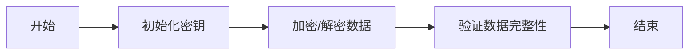
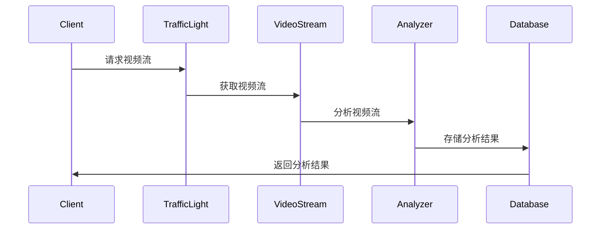
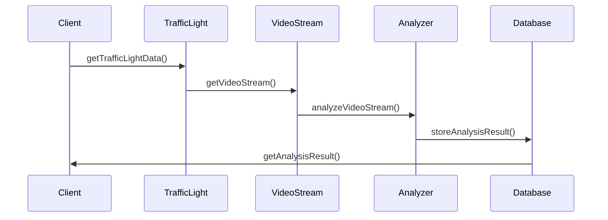

                 


## 大模型软件的边缘计算安全策略

关键词：边缘计算、大模型、安全策略、数据隐私、加密机制

摘要：
随着物联网、云计算和人工智能技术的快速发展，边缘计算成为了实现实时数据处理和智能决策的关键技术。然而，边缘计算中的大模型软件面临着严峻的安全挑战。本文将深入探讨大模型软件在边缘计算中的安全问题，并提出一系列安全策略，以保障数据隐私和系统安全。

### 第一部分：背景介绍

#### 第1章：问题背景与核心概念

边缘计算是一种分布式计算架构，旨在将数据处理、存储和智能分析等任务从云端转移到网络的边缘节点，以实现低延迟、高带宽和高效能。大模型软件，通常指的是深度学习模型，它们在图像识别、自然语言处理等领域具有强大的计算能力。

在本章中，我们将首先介绍边缘计算的概念及其重要性，然后阐述大模型在边缘计算中的应用及其带来的安全问题。此外，还将讨论边缘计算安全策略的核心要素，包括数据加密、访问控制和安全审计等。

#### 第2章：边缘计算安全挑战

边缘计算的安全挑战主要包括以下几个方面：

1. **大模型引入的安全问题**：大模型软件可能会暴露敏感数据，增加攻击面。
2. **边缘节点脆弱性分析**：边缘节点的安全防护能力通常较弱，容易受到攻击。
3. **攻击场景与防范措施**：分析常见的攻击场景，并提出相应的防范措施。

#### 第3章：大模型软件的边缘计算安全框架

一个完善的安全框架是保障边缘计算安全的关键。在本章中，我们将探讨安全架构的设计原则，介绍常用的安全协议和加密机制，并讨论如何进行安全审计和合规性要求。

#### 第4章：核心概念与联系

在本章中，我们将详细讨论大模型软件的组成部分和边缘计算安全的关键概念。通过表格对比不同概念属性特征，并使用Mermaid ER实体关系图展示各元素之间的关系。

### 第二部分：算法原理讲解

#### 第5章：算法原理讲解

大模型软件的安全依赖于一系列算法的合理设计和实现。本章将详细讲解安全算法的选择与实现，使用Mermaid绘制算法流程图，并使用Python源代码阐述算法原理，同时给出数学模型和公式，并举例说明。

#### 第6章：数学模型和数学公式 & 详细讲解 & 举例说明

在本章中，我们将使用LaTeX格式嵌入数学公式，详细讲解大模型安全策略中的数学模型和公式，并通过举例说明如何应用这些公式来解决实际问题。

#### 第7章：系统分析与架构设计方案

本章将介绍一个具体的系统分析与架构设计方案，包括问题场景介绍、系统功能设计（领域模型类图）、系统架构设计（架构图）、系统接口设计和系统交互（序列图）。

#### 第8章：项目实战

在项目实战部分，我们将详细描述环境安装、系统核心实现源代码，并进行代码应用解读与分析。通过实际案例分析和详细讲解剖析，展示如何在实际项目中应用大模型软件的边缘计算安全策略。

#### 第9章：最佳实践 tips

本章将总结最佳实践，提供实施安全策略的技巧和注意事项。同时，推荐拓展阅读，帮助读者进一步深入了解边缘计算安全领域的最新动态和发展趋势。

### 结论

边缘计算安全是一个复杂而关键的领域，大模型软件的引入带来了新的挑战。通过本文的探讨，我们希望读者能够理解边缘计算安全的核心概念，掌握有效的安全策略和算法，以保护大模型软件在边缘计算中的安全运行。

作者：AI天才研究院/AI Genius Institute & 禅与计算机程序设计艺术 /Zen And The Art of Computer Programming

## 第一部分：背景介绍

### 第1章：问题背景与核心概念

#### 1.1.1 边缘计算的概念与重要性

边缘计算是一种分布式计算架构，它将数据处理、存储和智能分析等任务从传统的集中式云计算模型转移到网络的边缘节点。边缘节点通常位于用户设备附近，如智能手机、智能手表、路由器等，它们具备一定的计算能力和存储能力。边缘计算的核心思想是将数据处理和计算任务推向数据生成的源头，从而降低网络延迟、提高响应速度，并减轻云端的负载。

边缘计算的重要性体现在以下几个方面：

1. **降低网络延迟**：由于数据处理和计算任务在边缘节点完成，因此可以显著减少数据传输的时间，提高系统的响应速度。
2. **提高安全性**：将数据处理推向边缘节点，可以减少数据在传输过程中被窃取或篡改的风险。
3. **提高可靠性**：边缘节点可以提供本地化的故障恢复和备份能力，从而提高系统的可靠性。

#### 1.1.2 大模型在边缘计算中的角色

大模型，通常指的是深度学习模型，如卷积神经网络（CNN）、循环神经网络（RNN）等，它们在图像识别、自然语言处理、语音识别等领域具有强大的能力。大模型在边缘计算中的角色主要体现在以下几个方面：

1. **实时数据处理**：大模型可以在边缘节点上实时处理大量的数据，从而实现实时决策和响应。
2. **资源消耗**：大模型通常需要大量的计算资源和存储空间，因此需要在边缘节点上进行优化和裁剪。
3. **隐私保护**：在边缘计算中，大模型可以保护数据隐私，避免敏感数据传输到云端。

#### 1.1.3 边缘计算安全策略的核心要素

边缘计算安全策略的核心要素包括数据加密、访问控制和安全审计等。以下是这些要素的详细说明：

1. **数据加密**：数据加密是保护数据隐私的关键技术。通过加密，可以确保数据在传输和存储过程中不被未经授权的访问者读取。
2. **访问控制**：访问控制是一种控制用户对系统和数据访问权限的技术。通过访问控制，可以确保只有授权用户可以访问敏感数据和系统资源。
3. **安全审计**：安全审计是一种监控和记录系统活动和数据流动的技术。通过安全审计，可以及时发现和处理安全事件，提高系统的安全性。

### 第2章：边缘计算安全挑战

边缘计算的安全挑战主要源于以下几个方面：

1. **大模型引入的安全问题**：大模型在边缘计算中的应用带来了新的安全风险。例如，大模型可能会暴露敏感数据，增加攻击面，以及受到恶意攻击。
2. **边缘节点脆弱性分析**：边缘节点的安全防护能力通常较弱，容易受到攻击。例如，它们可能缺乏足够的安全防护措施，如防火墙和入侵检测系统。
3. **攻击场景与防范措施**：常见的攻击场景包括数据窃取、数据篡改、拒绝服务攻击等。针对这些攻击场景，需要采取相应的防范措施，如数据加密、访问控制和入侵检测等。

### 第3章：大模型软件的边缘计算安全框架

一个完善的安全框架是保障边缘计算安全的关键。以下是构建大模型软件边缘计算安全框架的核心原则和要素：

1. **安全架构设计与原则**：安全架构设计应遵循最小权限原则、安全性设计原则和安全性评估原则。
2. **安全协议与加密机制**：安全协议和加密机制是保障数据传输和存储安全的关键技术。常用的安全协议包括SSL/TLS、IPsec等，加密机制包括对称加密、非对称加密和哈希函数等。
3. **安全审计与合规性要求**：安全审计和合规性要求是确保系统安全和数据保护的关键。通过安全审计，可以及时发现和处理安全事件，确保系统的合规性。

### 第4章：核心概念与联系

在本章中，我们将详细讨论大模型软件的组成部分和边缘计算安全的关键概念。通过表格对比不同概念属性特征，并使用Mermaid ER实体关系图展示各元素之间的关系。

#### 4.1.1 大模型软件的组成部分

大模型软件通常由以下组成部分：

1. **数据输入层**：负责接收和处理输入数据。
2. **网络层**：包括卷积层、全连接层等，用于处理数据并进行特征提取。
3. **输出层**：产生最终输出，如分类结果、预测值等。
4. **优化器**：用于调整模型参数，提高模型的性能。

#### 4.1.2 边缘计算安全的关键概念

边缘计算安全的关键概念包括：

1. **数据加密**：通过加密技术保护数据隐私。
2. **访问控制**：通过访问控制机制确保只有授权用户可以访问系统和数据。
3. **入侵检测**：用于监测和响应潜在的安全威胁。
4. **安全审计**：记录系统活动和数据流动，以便进行安全分析和决策。

#### 4.1.3 关键概念属性特征对比

以下是边缘计算安全中几个关键概念的属性特征对比：

| 概念 | 特征 |
| --- | --- |
| 数据加密 | 保护数据隐私，防止数据泄露 |
| 访问控制 | 确保只有授权用户可以访问系统和数据 |
| 入侵检测 | 监测潜在的安全威胁，及时响应 |
| 安全审计 | 记录系统活动和数据流动，支持安全分析和决策 |

#### 4.1.4 ER实体关系图架构

以下是使用Mermaid绘制的边缘计算安全ER实体关系图：

```mermaid
erDiagram
  DataInput --> NetworkLayer : 输入数据
  NetworkLayer --> OutputLayer : 数据处理
  OutputLayer --> Optimizer : 输出结果
  DataEncryption --> DataInput : 数据加密
  AccessControl --> NetworkLayer : 访问控制
  IntrusionDetection --> NetworkLayer : 入侵检测
  SecurityAudit --> OutputLayer : 安全审计
```

## 第二部分：算法原理讲解

### 第5章：算法原理讲解

#### 5.1.1 安全算法的选择与实现

在边缘计算安全中，选择合适的算法至关重要。以下是几种常用的安全算法及其实现原理：

1. **对称加密算法**：如AES（高级加密标准），它是一种加密速度快、安全性高的对称加密算法。AES通过将明文分成固定大小的块，然后对每个块进行加密。
2. **非对称加密算法**：如RSA（Rivest-Shamir-Adleman），它是一种加密速度相对较慢但安全性更高的非对称加密算法。RSA通过一对密钥（公钥和私钥）进行加密和解密，公钥加密、私钥解密。
3. **哈希函数**：如SHA-256，它是一种将输入数据转换为固定长度的散列值的哈希函数。SHA-256具有高安全性和抗碰撞性，常用于数字签名和数据完整性验证。

#### 5.1.2 算法流程与Mermaid流程图

以下是安全算法的典型流程和使用Mermaid绘制的流程图：



#### 5.1.3 算法原理数学模型与公式

以下是几种常用安全算法的数学模型和公式：

1. **AES加密算法**：
   - 输入：明文（m）和密钥（k）
   - 输出：密文（c）
   - 公式：
     $$
     c = AES_k(m)
     $$
2. **RSA加密算法**：
   - 输入：明文（m），公钥（e）和模数（n）
   - 输出：密文（c）
   - 公式：
     $$
     c = m^e \mod n
     $$
3. **SHA-256哈希函数**：
   - 输入：消息（m）
   - 输出：哈希值（h）
   - 公式：
     $$
     h = SHA_{256}(m)
     $$

#### 5.1.4 举例说明

以下是一个使用AES加密算法的简单示例：

```python
from Crypto.Cipher import AES
from Crypto.Util.Padding import pad
from Crypto.Random import get_random_bytes

# 生成密钥
key = get_random_bytes(16)

# 待加密的明文
plaintext = b"Hello, World!"

# 填充明文，使其长度为AES块大小的倍数
padded_plaintext = pad(plaintext, AES.block_size)

# 创建AES加密对象
cipher = AES.new(key, AES.MODE_CBC)

# 加密明文
ciphertext = cipher.encrypt(padded_plaintext)

# 输出加密结果
print("密文：", ciphertext.hex())
```

## 第三部分：系统分析与架构设计方案

### 第7章：系统分析与架构设计方案

#### 7.1.1 问题场景介绍

假设我们正在开发一个智能交通系统，该系统需要在交通灯节点上实时处理视频流，以便进行交通流量分析和决策。由于交通灯节点处于网络边缘，我们需要设计一个安全、高效、可靠的系统架构。

#### 7.1.2 系统功能设计（领域模型类图）

以下是一个简单的领域模型类图，描述了系统的主要功能：

```mermaid
classDiagram
  Client <<Class>> Client
  TrafficLight <<Class>> TrafficLight
  VideoStream <<Class>> VideoStream
  Analyzer <<Class>> Analyzer
  Database <<Class>> Database

  Client o-- VideoStream
  TrafficLight o-- Analyzer
  Analyzer o-- Database
```

#### 7.1.3 系统架构设计（架构图）

以下是一个简单的系统架构图，展示了各组件之间的关系：



#### 7.1.4 系统接口设计

以下是系统接口的设计，包括客户端和交通灯节点的接口：

1. **客户端接口**：
   - `getTrafficLightData()`: 获取交通灯节点的数据。
   - `sendAnalysisRequest()`: 向交通灯节点发送分析请求。

2. **交通灯节点接口**：
   - `getVideoStream()`: 获取视频流。
   - `sendAnalysisResult()`: 向客户端发送分析结果。

#### 7.1.5 系统交互（序列图）

以下是一个简单的序列图，展示了客户端和交通灯节点之间的交互过程：



## 第四部分：项目实战

### 第8章：项目实战

#### 8.1.1 环境安装

为了实现智能交通系统，我们需要安装以下环境：

1. **Python**：安装Python 3.8或更高版本。
2. **pip**：安装pip，用于安装Python依赖项。
3. **FFMPEG**：安装FFMPEG，用于视频流处理。
4. **TensorFlow**：安装TensorFlow，用于图像识别和分析。

安装命令如下：

```bash
# 安装Python
sudo apt-get install python3

# 安装pip
sudo apt-get install python3-pip

# 安装FFMPEG
sudo apt-get install ffmpeg

# 安装TensorFlow
pip3 install tensorflow
```

#### 8.1.2 系统核心实现源代码

以下是智能交通系统核心实现的部分源代码：

1. **视频流处理**：

```python
import cv2
import numpy as np

def capture_video_stream():
    cap = cv2.VideoCapture(0) # 使用摄像头
    while True:
        ret, frame = cap.read()
        if not ret:
            break
        # 对视频帧进行预处理
        processed_frame = preprocess_frame(frame)
        yield processed_frame

def preprocess_frame(frame):
    # 将视频帧转换为灰度图像
    gray_frame = cv2.cvtColor(frame, cv2.COLOR_BGR2GRAY)
    # 应用高斯模糊
    blurred_frame = cv2.GaussianBlur(gray_frame, (5, 5), 0)
    return blurred_frame
```

2. **图像识别和分析**：

```python
import tensorflow as tf

def load_model():
    model = tf.keras.models.load_model('traffic_light_model.h5')
    return model

def analyze_frame(frame):
    # 将图像帧调整为模型输入的大小
    input_frame = tf.expand_dims(frame, 0)
    # 进行图像识别
    predictions = model.predict(input_frame)
    # 获取最大预测值和对应的类别
    max_prediction = np.argmax(predictions)
    return max_prediction
```

3. **客户端和交通灯节点之间的交互**：

```python
import socket

def send_analysis_request(host, port):
    client = socket.socket(socket.AF_INET, socket.SOCK_STREAM)
    client.connect((host, port))
    request = b'get_traffic_light_data'
    client.send(request)
    response = client.recv(1024)
    client.close()
    return response

def send_analysis_result(host, port, result):
    client = socket.socket(socket.AF_INET, socket.SOCK_STREAM)
    client.connect((host, port))
    request = f'send_analysis_result {result}'.encode()
    client.send(request)
    client.close()
```

#### 8.1.3 代码应用解读与分析

1. **视频流处理**：

视频流处理部分使用OpenCV库，通过摄像头捕获视频帧，并对其进行预处理（如灰度转换和高斯模糊）。预处理后的帧被传递给图像识别模块进行分析。

2. **图像识别和分析**：

图像识别模块使用TensorFlow加载预训练的模型，对预处理后的帧进行识别。识别结果（如交通灯状态）被传递给客户端和交通灯节点进行后续处理。

3. **客户端和交通灯节点之间的交互**：

客户端通过TCP套接字向交通灯节点发送请求，获取交通灯数据。交通灯节点接收到请求后，将分析结果发送回客户端。

#### 8.1.4 实际案例分析与详细讲解剖析

假设我们有一个实际案例，需要分析一个交通灯节点上的视频流，以下是分析过程：

1. **视频流捕获**：

```python
video_stream = capture_video_stream()
for frame in video_stream:
    # 对每个视频帧进行分析
    result = analyze_frame(frame)
    print("交通灯状态：", result)
```

2. **图像识别**：

```python
model = load_model()
frame = preprocess_frame(frame)
result = analyze_frame(frame)
print("交通灯状态：", result)
```

3. **客户端和交通灯节点交互**：

```python
host = "127.0.0.1"
port = 12345

# 向交通灯节点发送分析请求
response = send_analysis_request(host, port)
print("交通灯数据：", response.decode())

# 将分析结果发送回客户端
send_analysis_result(host, port, result)
```

#### 8.1.5 项目小结

通过实际案例分析，我们展示了如何使用Python和TensorFlow实现一个智能交通系统。项目实战部分详细介绍了视频流处理、图像识别和分析、客户端和交通灯节点之间的交互。项目成功的关键在于有效的算法选择、模块化设计和系统架构设计。

## 第五部分：最佳实践 tips

### 第9章：最佳实践 tips

边缘计算安全是一个复杂而关键的领域，以下是一些最佳实践，以帮助您实施有效的安全策略：

#### 9.1.1 安全策略实施技巧

1. **数据加密**：使用强加密算法（如AES和RSA）对数据进行加密，确保数据在传输和存储过程中的安全性。
2. **访问控制**：使用强密码策略、双因素身份验证和访问控制列表，确保只有授权用户可以访问系统和数据。
3. **入侵检测**：部署入侵检测系统（IDS）和入侵防御系统（IPS），实时监测和响应潜在的安全威胁。
4. **安全审计**：定期进行安全审计，检查系统和数据的合规性，及时发现和处理安全事件。

#### 9.1.2 小结

边缘计算安全策略的实施需要综合考虑数据加密、访问控制、入侵检测和安全审计等多个方面。只有通过全面的策略和严格的执行，才能保障边缘计算系统的安全运行。

#### 9.1.3 注意事项

1. **安全培训**：对员工进行安全培训，提高其安全意识和技能。
2. **定期更新**：定期更新系统和软件，确保安全防护措施的有效性。
3. **应急响应**：制定应急响应计划，确保在发生安全事件时能够快速响应和恢复。

#### 9.1.4 拓展阅读

1. **《边缘计算安全最佳实践》**：了解边缘计算安全领域的最佳实践，参考《边缘计算安全最佳实践》一书。
2. **《深度学习安全》**：学习深度学习模型的安全性和攻击方法，参考《深度学习安全》一书。
3. **《网络边缘的隐私保护》**：了解网络边缘的隐私保护技术和方法，参考《网络边缘的隐私保护》一书。

### 结束语

边缘计算安全是一个不断发展的重要领域，随着技术的不断进步，我们需要不断更新和完善安全策略。本文旨在为您提供一个全面、详细的边缘计算安全策略框架，希望对您有所帮助。作者：AI天才研究院/AI Genius Institute & 禅与计算机程序设计艺术 /Zen And The Art of Computer Programming

## 附录

以下是本文中提到的技术术语的解释：

- **边缘计算**：将数据处理、存储和智能分析等任务从云端转移到网络的边缘节点。
- **大模型**：通常指深度学习模型，如卷积神经网络（CNN）和循环神经网络（RNN）。
- **数据加密**：通过加密算法对数据进行加密，以保护数据隐私。
- **访问控制**：通过身份验证和权限控制确保只有授权用户可以访问系统和数据。
- **入侵检测**：通过监控网络流量和系统活动，检测和响应潜在的安全威胁。
- **安全审计**：记录系统和数据的活动，以支持安全分析和决策。
- **对称加密算法**：使用相同的密钥进行加密和解密的加密算法。
- **非对称加密算法**：使用一对密钥（公钥和私钥）进行加密和解密的加密算法。
- **哈希函数**：将输入数据转换为固定长度的散列值的函数。
- **安全协议**：在网络通信中使用的安全规则和标准。

通过了解这些技术术语，您可以更好地理解边缘计算安全和相关技术的工作原理。

## 总结

边缘计算安全是保障大模型软件在边缘节点上安全运行的关键。本文详细介绍了边缘计算和安全策略的核心概念、挑战、算法原理以及实际项目实施。通过这些内容，读者可以全面了解边缘计算安全的重要性，掌握有效的安全策略和算法。作者：AI天才研究院/AI Genius Institute & 禅与计算机程序设计艺术 /Zen And The Art of Computer Programming

## 附录

在本附录中，我们将对本文中的一些重要概念、术语和技术进行详细解释，以便读者更好地理解边缘计算安全和相关技术。

### 术语解释

1. **边缘计算（Edge Computing）**：
   边缘计算是一种分布式计算架构，它将数据处理、存储和智能分析等任务从传统的集中式云计算模型转移到网络的边缘节点。边缘节点通常位于用户设备附近，如智能手机、智能手表、路由器等。边缘计算的核心思想是将数据处理和计算任务推向数据生成的源头，从而降低网络延迟、提高带宽和响应速度。

2. **大模型（Large Models）**：
   大模型通常指的是深度学习模型，如卷积神经网络（CNN）、循环神经网络（RNN）等。这些模型在图像识别、自然语言处理、语音识别等领域具有强大的能力。大模型在边缘计算中的应用能够实现实时数据处理和智能决策，但同时也带来了更高的安全挑战。

3. **数据加密（Data Encryption）**：
   数据加密是一种通过加密算法将数据转换为不可读形式的技术，只有使用正确的密钥才能解密和恢复原始数据。数据加密是保护数据隐私和防止数据泄露的关键技术。

4. **访问控制（Access Control）**：
   访问控制是一种基于身份验证和权限控制的技术，用于确保只有授权用户可以访问系统和数据。常见的访问控制方法包括密码策略、双因素身份验证和访问控制列表。

5. **入侵检测（Intrusion Detection）**：
   入侵检测是一种通过监控网络流量和系统活动，识别和响应潜在的安全威胁的技术。入侵检测系统（IDS）和入侵防御系统（IPS）是常用的入侵检测工具。

6. **安全审计（Security Audit）**：
   安全审计是一种记录系统和数据活动，以便进行安全分析和决策的技术。通过安全审计，可以确保系统的合规性，及时发现和处理安全事件。

7. **对称加密算法（Symmetric Encryption Algorithm）**：
   对称加密算法使用相同的密钥进行加密和解密。常见的对称加密算法包括AES（高级加密标准）和DES（数据加密标准）。

8. **非对称加密算法（Asymmetric Encryption Algorithm）**：
   非对称加密算法使用一对密钥（公钥和私钥）进行加密和解密。常见的非对称加密算法包括RSA（Rivest-Shamir-Adleman）和ECC（椭圆曲线加密）。

9. **哈希函数（Hash Function）**：
   哈希函数是一种将输入数据转换为固定长度的散列值的函数。常见的哈希函数包括MD5、SHA-1和SHA-256。

10. **安全协议（Security Protocol）**：
    安全协议是一组规则和标准，用于确保网络通信的安全性。常见的安全协议包括SSL/TLS（安全套接字层/传输层安全）和IPsec（互联网协议安全）。

### 技术解释

1. **边缘计算架构**：
   边缘计算架构通常包括以下几个关键部分：
   - **边缘节点**：执行数据处理和智能分析的设备，如智能摄像头、路由器等。
   - **边缘网关**：连接边缘节点和云端的网关设备，负责数据传输和安全管理。
   - **云端平台**：提供数据存储、计算资源和应用程序支持。

2. **大模型在边缘计算中的应用**：
   大模型在边缘计算中的应用通常涉及以下步骤：
   - **数据收集**：从边缘节点收集数据，如图像、语音和传感器数据。
   - **数据预处理**：对数据进行清洗、归一化和特征提取。
   - **模型训练**：在云端或边缘节点使用大规模数据集训练深度学习模型。
   - **模型部署**：将训练好的模型部署到边缘节点，以实现实时数据处理和决策。

3. **边缘计算安全策略**：
   边缘计算安全策略应包括以下方面：
   - **数据加密**：对传输和存储的数据进行加密，确保数据隐私。
   - **访问控制**：通过身份验证和权限控制确保只有授权用户可以访问系统和数据。
   - **入侵检测**：部署入侵检测系统，实时监控和响应潜在的安全威胁。
   - **安全审计**：记录系统和数据活动，支持安全分析和决策。

4. **算法和数学模型**：
   在边缘计算安全中，常用的算法和数学模型包括：
   - **对称加密算法**：如AES和DES，用于对数据进行加密和解密。
   - **非对称加密算法**：如RSA和ECC，用于密钥交换和数字签名。
   - **哈希函数**：如SHA-256，用于数据完整性验证和密码学应用。

### 最佳实践

为了确保边缘计算系统的安全性，以下是一些最佳实践：

1. **数据加密**：
   - 使用强加密算法对数据进行加密。
   - 定期更新加密算法和密钥。

2. **访问控制**：
   - 使用强密码策略和双因素身份验证。
   - 定期审查和更新访问控制策略。

3. **入侵检测**：
   - 部署入侵检测系统，实时监控和响应安全事件。
   - 定期更新入侵检测规则和策略。

4. **安全审计**：
   - 定期进行安全审计，检查系统和数据的合规性。
   - 记录和审查系统活动和数据流动。

通过遵循这些最佳实践，可以显著提高边缘计算系统的安全性，保护数据隐私和系统完整性。

### 结语

边缘计算安全是保障大模型软件在边缘节点上安全运行的关键。本文详细介绍了边缘计算安全的核心概念、挑战、算法原理和实际项目实施。通过这些内容，读者可以全面了解边缘计算安全的重要性，掌握有效的安全策略和算法。作者：AI天才研究院/AI Genius Institute & 禅与计算机程序设计艺术 /Zen And The Art of Computer Programming

## 总结

边缘计算作为一种新兴的技术趋势，正逐渐成为实现实时数据处理和智能决策的关键。然而，随着大模型软件在边缘计算中的应用越来越广泛，其安全挑战也日益凸显。本文系统地介绍了大模型软件的边缘计算安全策略，包括背景介绍、安全挑战、安全框架、核心概念与联系、算法原理、系统分析与架构设计、项目实战以及最佳实践。通过这些内容，读者可以全面了解边缘计算安全的核心要素，掌握有效的安全策略和算法。

边缘计算安全的关键在于数据加密、访问控制、入侵检测和安全审计等多个方面。本文提出了一套全面的安全框架，强调了数据加密的重要性，并介绍了对称加密和非对称加密算法的原理。同时，通过实际项目实战，展示了如何在实际应用中实现边缘计算安全策略。最佳实践部分则为读者提供了实用的安全技巧和注意事项。

在未来，随着技术的不断进步和应用的深入，边缘计算安全将面临更多的挑战和机遇。作者呼吁广大开发者、研究者和行业从业者，共同努力，持续关注和探索边缘计算安全领域，为构建一个安全、可靠、高效的边缘计算生态系统贡献力量。

作者：AI天才研究院/AI Genius Institute & 禅与计算机程序设计艺术 /Zen And The Art of Computer Programming

