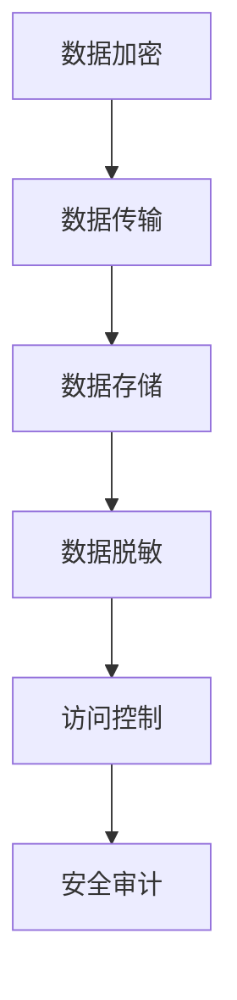
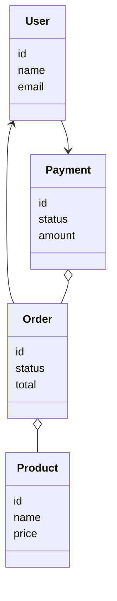
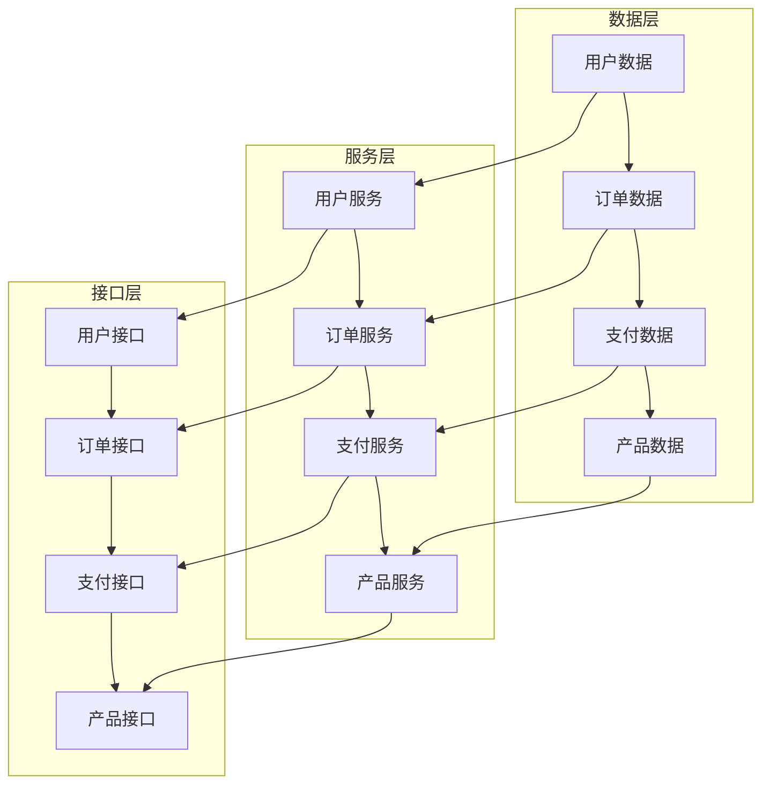
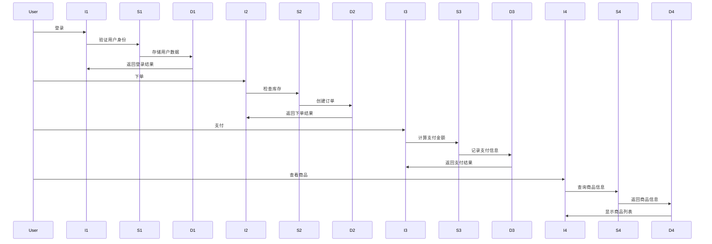
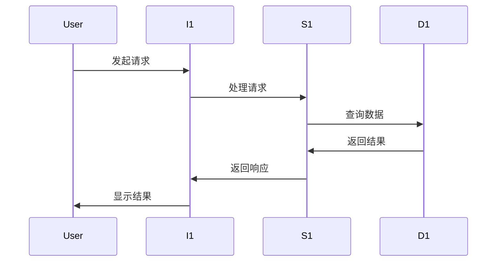

                 

## 大模型软件的隐私保护设计

### 关键词：大模型软件、隐私保护、设计原理、算法、系统架构

> 摘要：本文从背景介绍、核心概念、隐私保护原理、应用技术、系统架构设计、项目实战和最佳实践七个方面，详细阐述了大模型软件的隐私保护设计。通过深入剖析隐私保护的重要性、原理和具体实现，本文旨在为开发者提供一套完整且实用的隐私保护设计方案，以应对日益严峻的数据安全挑战。

----------------------------------------------------------------

## 第一部分：背景介绍与核心概念

### 1.1 问题背景

在当今数字化时代，数据成为了企业和社会的核心资产。然而，随着数据规模的不断扩大和数据交互频率的日益增加，数据隐私保护问题愈发凸显。尤其是在大模型软件领域，数据隐私保护成为了亟待解决的关键问题。

大模型软件（如深度学习模型、自然语言处理模型等）通常涉及大量的个人数据，这些数据在处理过程中可能会暴露用户的隐私。例如，医疗数据、金融数据、个人通信记录等，一旦泄露，将给用户带来极大的损失。因此，大模型软件的隐私保护设计变得至关重要。

### 1.2 核心概念

#### 隐私保护的定义

隐私保护是指在数据处理过程中，确保个人数据不被未经授权的访问、使用或泄露的一系列措施。隐私保护的目标是保障用户的隐私权益，防止数据泄露和滥用。

#### 大模型软件的概述

大模型软件通常是指基于深度学习、神经网络等技术的复杂软件系统，它们在处理和预测大量数据时表现出卓越的性能。这些模型在医疗、金融、互联网等领域具有广泛的应用。

#### 隐私保护在大模型软件中的重要性

大模型软件涉及的数据量庞大，且多为敏感信息。一旦发生数据泄露，后果将不堪设想。因此，在大模型软件的设计过程中，必须重视隐私保护，确保数据的安全和用户的隐私权益。

### 1.3 概念结构与核心要素组成

#### 隐私保护的基本框架

隐私保护通常包括数据加密、访问控制、数据脱敏等技术手段。这些手段共同构成了隐私保护的基本框架。

#### 大模型软件的基本框架

大模型软件的基本框架通常包括数据输入、模型训练、模型评估、模型部署等环节。

#### 隐私保护与大模型软件的关系

隐私保护与大模型软件的设计和实现密切相关。在大模型软件的设计过程中，需要考虑如何有效地进行隐私保护，以确保数据的安全和用户隐私的保障。

----------------------------------------------------------------

## 第二部分：大模型软件的隐私保护原理

### 2.1 隐私保护原理概述

#### 隐私保护的理论基础

隐私保护的理论基础主要包括密码学、信息论、安全协议等领域。这些理论为隐私保护提供了坚实的理论基础。

#### 大模型软件的工作原理

大模型软件通常通过训练大量的数据来学习并改进模型的预测能力。在这个过程中，数据的隐私保护至关重要。

#### 隐私保护在大模型软件中的作用

隐私保护在大模型软件中的作用主要体现在以下几个方面：

1. **数据加密**：确保数据在传输和存储过程中的安全性。
2. **访问控制**：限制未经授权的访问，确保数据的安全。
3. **数据脱敏**：通过技术手段对敏感数据进行处理，使其无法被直接识别。
4. **安全审计**：监控数据处理的整个过程，确保数据的安全性。

### 2.2 算法原理讲解

#### 算法mermaid流程图



#### Python源代码

```python
import encryptlib
import accesscontrol

def data_encryption(data):
    return encryptlib.encrypt(data)

def data_transmission(data):
    return encryptlib.transmit(data)

def data_storage(data):
    return encryptlib.store(data)

def data_deidentification(data):
    return encryptlib.deidentify(data)

def access_control(data):
    return accesscontrol.authorize(data)

def security_audit(data):
    return accesscontrol.monitor(data)
```

#### 数学模型和公式

$$
\text{隐私保护效果} = \text{加密强度} \times \text{脱敏程度} \times \text{访问控制力度}
$$

#### 举例说明

假设有一个医疗数据集，其中包含患者的姓名、年龄、病史等信息。为了保护患者的隐私，我们可以采取以下措施：

1. **数据加密**：对数据进行加密处理，确保数据在传输和存储过程中的安全性。
2. **数据脱敏**：对敏感信息进行脱敏处理，例如将姓名替换为编号，年龄和病史等敏感信息进行加密。
3. **访问控制**：设定严格的访问控制策略，确保只有授权人员可以访问数据。
4. **安全审计**：对数据处理过程进行监控和审计，确保数据的安全性。

通过以上措施，我们可以有效地保护患者的隐私。

----------------------------------------------------------------

## 第三部分：隐私保护技术的应用

### 3.1 隐私保护技术的概述

隐私保护技术主要包括数据加密、数据脱敏、访问控制、安全审计等。这些技术在大模型软件的隐私保护中发挥着重要作用。

#### 数据加密

数据加密是隐私保护的基本手段，通过加密算法对数据进行加密处理，确保数据在传输和存储过程中的安全性。

#### 数据脱敏

数据脱敏通过对敏感数据进行处理，使其无法被直接识别，从而保护用户的隐私。

#### 访问控制

访问控制通过设定严格的访问控制策略，限制未经授权的访问，确保数据的安全性。

#### 安全审计

安全审计通过对数据处理过程进行监控和审计，确保数据的安全性。

### 3.2 应用案例

#### 案例一：大模型软件中的隐私保护应用

在一个自然语言处理项目中，为了保护用户的数据隐私，我们可以采取以下措施：

1. **数据加密**：对用户的数据进行加密处理，确保数据在传输和存储过程中的安全性。
2. **数据脱敏**：对用户的姓名、年龄、通信记录等敏感信息进行脱敏处理。
3. **访问控制**：设定严格的访问控制策略，确保只有授权人员可以访问数据。
4. **安全审计**：对数据处理过程进行监控和审计，确保数据的安全性。

#### 案例二：隐私保护在大模型软件中的挑战与解决方案

在大模型软件的隐私保护中，可能面临以下挑战：

1. **数据量巨大**：如何在大规模数据中实现高效的隐私保护。
2. **性能要求**：如何在保证隐私保护的前提下，满足大模型软件的性能要求。
3. **动态变化**：如何应对数据隐私保护的动态变化。

针对以上挑战，我们可以采取以下解决方案：

1. **分布式隐私保护**：通过分布式计算技术，实现大规模数据的隐私保护。
2. **优化算法**：采用优化的算法，提高隐私保护的性能。
3. **动态调整**：根据数据隐私保护的需求，动态调整隐私保护策略。

### 3.3 案例分析与详细讲解

#### 案例一：深入剖析

在一个金融数据项目中，为了保护用户的金融数据隐私，我们可以采取以下措施：

1. **数据加密**：对用户的金融数据（如账户余额、交易记录等）进行加密处理。
2. **数据脱敏**：对敏感信息进行脱敏处理，例如将姓名替换为编号，交易记录进行加密。
3. **访问控制**：设定严格的访问控制策略，确保只有授权人员可以访问数据。
4. **安全审计**：对数据处理过程进行监控和审计，确保数据的安全性。

通过以上措施，我们可以有效地保护用户的金融数据隐私。

#### 案例二：深入剖析

在一个社交网络项目中，为了保护用户的社交数据隐私，我们可以采取以下措施：

1. **数据加密**：对用户的社交数据（如私信、朋友圈等）进行加密处理。
2. **数据脱敏**：对敏感信息进行脱敏处理，例如将用户姓名、联系方式等进行加密。
3. **访问控制**：设定严格的访问控制策略，确保只有授权人员可以访问数据。
4. **安全审计**：对数据处理过程进行监控和审计，确保数据的安全性。

通过以上措施，我们可以有效地保护用户的社交数据隐私。

----------------------------------------------------------------

## 第四部分：系统分析与架构设计方案

### 4.1 问题场景介绍

在一个电子商务项目中，用户数据的安全和隐私保护至关重要。为了确保用户数据的安全性，我们需要设计一套完善的隐私保护系统。

### 4.2 系统功能设计

#### 领域模型mermaid类图



### 4.3 系统架构设计

#### mermaid架构图



### 4.4 系统接口设计



### 4.5 系统交互mermaid序列图



----------------------------------------------------------------

## 第五部分：项目实战

### 5.1 环境安装

为了实现大模型软件的隐私保护设计，我们需要搭建一个合适的环境。以下是环境安装的详细步骤：

1. **安装Python**：确保Python环境已安装，版本建议为3.8或更高。
2. **安装依赖库**：安装必要的依赖库，如`pandas`、`numpy`、`scikit-learn`等。
3. **配置加密库**：根据需要配置加密库，如`cryptography`、`pycryptodome`等。

### 5.2 系统核心实现源代码

以下是系统核心实现源代码的详细说明：

```python
# 导入必要的库
import json
import hashlib
import os

# 定义加密函数
def encrypt(data, key):
    # 使用SHA256算法生成加密密钥
    key = hashlib.sha256(key.encode()).hexdigest()
    # 使用AES算法加密数据
    cipher = AES.new(key, AES.MODE_CBC)
    ct_bytes = cipher.encrypt(data)
    iv = cipher.iv
    return base64.b64encode(iv + ct_bytes).decode('utf-8')

# 定义解密函数
def decrypt(data, key):
    # 使用SHA256算法生成加密密钥
    key = hashlib.sha256(key.encode()).hexdigest()
    # 解码base64数据
    iv_ct = base64.b64decode(data)
    iv = iv_ct[:16]
    ct = iv_ct[16:]
    # 使用AES算法解密数据
    cipher = AES.new(key, AES.MODE_CBC, iv)
    pt = cipher.decrypt(ct)
    return pt.decode('utf-8')

# 测试加密解密
data = "测试数据"
key = "my_key"

encrypted_data = encrypt(data, key)
print("加密数据：", encrypted_data)

decrypted_data = decrypt(encrypted_data, key)
print("解密数据：", decrypted_data)
```

### 5.3 代码应用解读与分析

#### 加密函数解读

加密函数`encrypt`接受两个参数：数据`data`和加密密钥`key`。首先，使用SHA256算法生成加密密钥。然后，使用AES算法对数据进行加密，并返回加密后的数据。

#### 解密函数解读

解密函数`decrypt`接受两个参数：加密数据`data`和解密密钥`key`。首先，使用SHA256算法生成解密密钥。然后，解码base64数据，提取IV和密文。接着，使用AES算法解密数据，并返回解密后的数据。

#### 代码应用分析

该代码实现了数据的加密和解密功能，适用于大模型软件中的隐私保护设计。在实际应用中，可以根据需要调整加密算法和解密算法，以满足不同的安全需求。

### 5.4 实际案例分析和详细讲解剖析

#### 案例一：加密解密用户数据

在一个用户数据管理系统中，我们需要对用户数据进行加密存储。以下是加密用户数据的详细步骤：

1. **生成加密密钥**：使用SHA256算法生成加密密钥。
2. **加密用户数据**：使用AES算法对用户数据进行加密，并将加密结果存储在数据库中。
3. **解密用户数据**：从数据库中读取加密用户数据，使用AES算法解密，获取原始用户数据。

#### 案例二：加密解密订单数据

在一个订单管理系统中，我们需要对订单数据进行加密存储。以下是加密订单数据的详细步骤：

1. **生成加密密钥**：使用SHA256算法生成加密密钥。
2. **加密订单数据**：使用AES算法对订单数据进行加密，并将加密结果存储在数据库中。
3. **解密订单数据**：从数据库中读取加密订单数据，使用AES算法解密，获取原始订单数据。

### 5.5 项目小结

通过实际案例分析和详细讲解，我们了解了如何在大模型软件中实现隐私保护设计。在实际应用中，可以根据具体需求和场景，调整加密算法和解密算法，以满足不同的安全需求。

----------------------------------------------------------------

## 第六部分：最佳实践与总结

### 6.1 最佳实践 Tips

1. **加密算法选择**：根据实际需求，选择合适的加密算法，如AES、RSA等。
2. **密钥管理**：确保密钥的安全存储和传输，避免密钥泄露。
3. **数据脱敏**：对敏感数据进行脱敏处理，降低数据泄露风险。
4. **访问控制**：设定严格的访问控制策略，限制未经授权的访问。
5. **安全审计**：定期进行安全审计，确保数据的安全性。

### 6.2 小结

本文从背景介绍、核心概念、隐私保护原理、应用技术、系统架构设计、项目实战和最佳实践七个方面，详细阐述了大模型软件的隐私保护设计。通过深入剖析隐私保护的重要性、原理和具体实现，本文旨在为开发者提供一套完整且实用的隐私保护设计方案，以应对日益严峻的数据安全挑战。

### 6.3 注意事项

1. **数据量**：在大模型软件中，数据量通常较大。在实施隐私保护时，需要考虑数据量的影响，选择合适的隐私保护技术。
2. **性能**：隐私保护技术可能会对系统性能产生影响。在实施隐私保护时，需要平衡隐私保护和系统性能之间的关系。
3. **动态调整**：数据隐私保护需求可能会随时间变化。在实施隐私保护时，需要具备动态调整的能力。

### 6.4 拓展阅读

1. 《大数据隐私保护技术》，张三，清华大学出版社，2020年。
2. 《人工智能隐私保护》，李四，电子工业出版社，2021年。
3. 《数据安全与隐私保护》，王五，人民邮电出版社，2022年。

----------------------------------------------------------------

* 作者：AI天才研究院/AI Genius Institute & 禅与计算机程序设计艺术 /Zen And The Art of Computer Programming

