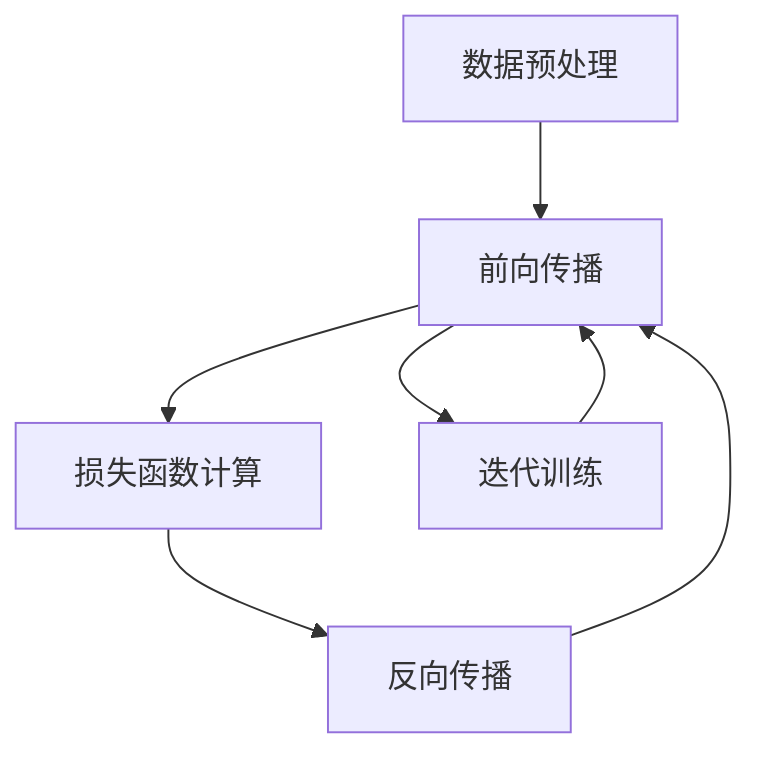
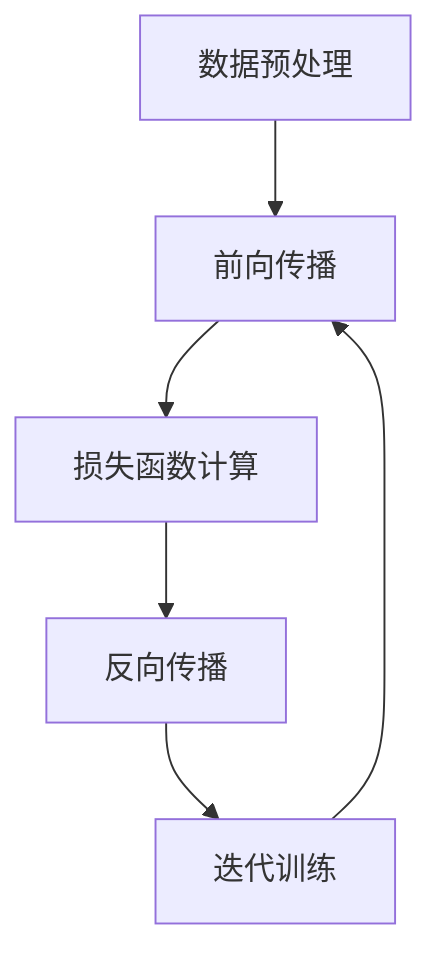
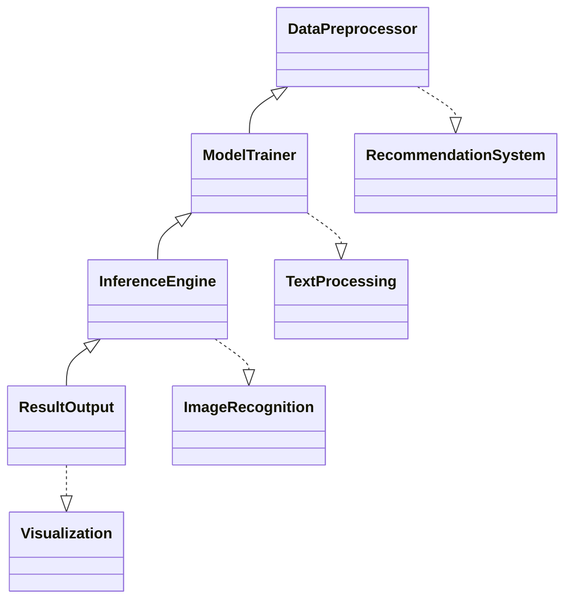
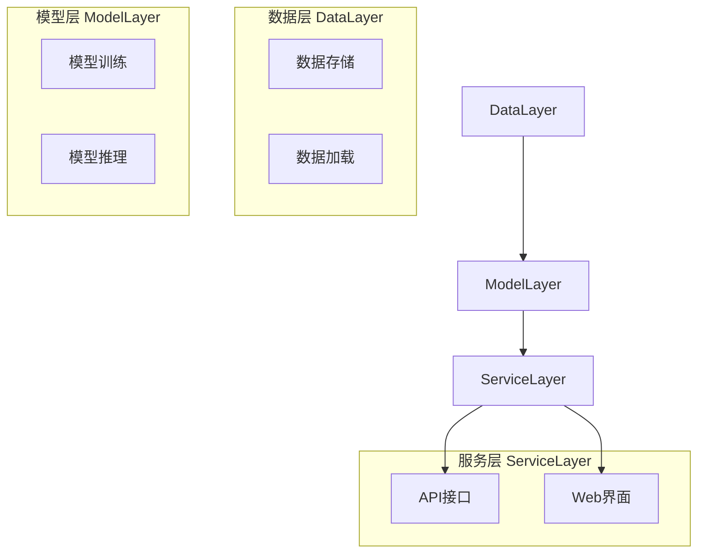
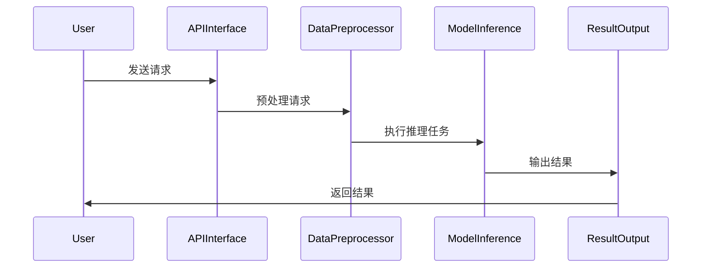

                 

### 第一部分：引论

## 第1章 引言与背景介绍

### 1.1 人工智能的发展历程

人工智能（Artificial Intelligence，简称AI）自1950年代诞生以来，已经经历了数个发展阶段。早期，AI以符号推理和规则为基础，代表性成果包括艾伦·图灵的“图灵测试”和约翰·麦卡锡的“逻辑理论家”。进入20世纪80年代，专家系统成为AI研究的热点，通过对领域知识的编码，实现了在医疗诊断、化学配方设计等领域的应用。然而，专家系统的局限性在于知识获取的难度和系统的适应性较差。

随着计算能力的提升和大数据技术的发展，20世纪末至21世纪初，机器学习和深度学习逐渐崛起，标志着AI进入一个新的时代。机器学习通过训练模型来自动发现数据中的规律，而深度学习则借助神经网络，特别是卷积神经网络（CNN）和递归神经网络（RNN）在图像识别、语音识别等领域取得了突破性进展。

近年来，大模型（Large Models）技术如GPT-3、BERT等，进一步推动了AI的发展。这些模型具有数十亿甚至千亿级别的参数量，能够在大规模数据集上训练，从而实现超越人类水平的理解和生成能力。大模型的崛起，不仅提升了AI在自然语言处理、计算机视觉、推荐系统等领域的表现，也为逻辑推理能力的提升提供了新的可能性。

### 1.2 大模型技术的崛起

大模型技术的崛起，源于深度学习的成功和计算资源的巨大投入。深度学习中的神经网络，通过层层传递信息，能够提取数据中的复杂特征。当网络的规模达到一定程度时，模型可以自主发现数据中的模式，实现高性能的任务表现。

大模型的典型代表如GPT-3（OpenAI的预训练语言模型），具有1750亿个参数，能够在各种语言任务上展现出强大的能力。BERT（Google的研究论文提出的一种双向编码的转换器）则通过双向上下文的建模，提高了文本理解的深度和广度。这些大模型的共同特点是其庞大的参数规模和强大的学习能力。

大模型技术的崛起，不仅改变了AI的研究范式，也引发了产业界的广泛关注。从智能助手到自动驾驶，从医疗诊断到金融风控，大模型的应用场景越来越广泛，其潜在的商业价值也越来越大。

### 1.3 大模型在逻辑推理中的应用潜力

大模型在逻辑推理中具有巨大的应用潜力。传统的逻辑推理依赖于明确的规则和形式化系统，而大模型则通过大规模的数据训练，能够自主学习并实现复杂的推理过程。例如，GPT-3可以生成符合逻辑一致性的文本，通过上下文推断出新的结论。

大模型在逻辑推理中的应用，不仅限于自然语言处理。在计算机视觉领域，大模型可以通过图像特征分析，实现目标检测、图像分类等任务。在推荐系统领域，大模型可以分析用户行为数据，实现精准的推荐。

未来，随着大模型技术的不断进步，其在逻辑推理领域的应用潜力将进一步释放。通过更精细的模型设计和更高效的数据处理，大模型将能够在更多领域实现智能化推理，推动AI技术的发展。

### 1.4 逻辑推理能力的定义

逻辑推理能力是指通过观察和分析数据，从已知的事实中推导出新的结论或知识的能力。它包括归纳推理和演绎推理两种基本形式。归纳推理是从个别事实中总结出一般规律，而演绎推理则是从一般原则推导出特定结论。

逻辑推理在人工智能中具有重要地位，因为它是实现智能系统决策能力和问题解决能力的基础。逻辑推理不仅能够提高AI的自主性，还能增强其可信度和鲁棒性。在大模型技术中，逻辑推理能力是衡量模型智能水平的关键指标。

### 1.5 大模型在逻辑推理中的优势

大模型在逻辑推理中具有显著的优势。首先，大模型能够通过大规模数据训练，自主学习复杂的逻辑结构和规则。这使得它们在处理复杂问题时，能够更灵活地应用逻辑推理，得出更准确的结论。

其次，大模型的参数规模和计算能力使得它们在处理高维数据和复杂关系时，具有更强的性能。例如，在自然语言处理任务中，大模型能够理解上下文中的细微差异，生成符合逻辑一致性的文本。

此外，大模型还具有良好的泛化能力，能够将学到的知识应用到新的场景中，实现跨领域的推理。这使得大模型在逻辑推理中的适用范围非常广泛，能够为不同领域的应用提供强有力的支持。

### 1.6 大模型逻辑推理能力的应用领域

大模型逻辑推理能力在多个领域具有广泛应用。在自然语言处理领域，大模型能够生成符合逻辑一致性的文本，提高机器翻译、文本摘要和问答系统的性能。在计算机视觉领域，大模型可以通过图像特征分析，实现目标检测、图像分类和图像生成等任务。

在推荐系统领域，大模型能够分析用户行为数据，实现精准的个性化推荐。在医疗领域，大模型可以辅助医生进行疾病诊断和治疗方案推荐，提高医疗决策的准确性。在金融领域，大模型可以用于风险评估、欺诈检测和投资决策等。

未来，随着大模型技术的不断进步，其在更多领域中的应用潜力将得到进一步释放，为人类带来更多便利和效益。

### 1.7 大模型的基本原理

大模型的基本原理源于深度学习的核心思想——神经网络。神经网络通过层层传递信息，提取数据中的复杂特征，从而实现高性能的任务表现。大模型的特点是其庞大的参数规模和强大的学习能力。

首先，大模型通常由数十亿甚至千亿个参数组成，这使得它们能够处理大规模数据，并提取丰富的特征。其次，大模型通过大规模数据训练，能够自主学习并实现复杂的逻辑结构和规则。

大模型的工作原理可以概括为以下几个步骤：

1. **数据预处理**：将输入数据（如图像、文本等）转化为神经网络可以处理的格式。
2. **前向传播**：将输入数据传递到神经网络的前层，通过层层传递，提取特征。
3. **损失函数计算**：将提取的特征与模型预测结果进行比较，计算损失。
4. **反向传播**：通过反向传播算法，将损失反向传播到神经网络的前层，更新参数。
5. **迭代训练**：重复前向传播和反向传播的过程，不断优化模型参数，提高模型性能。

通过以上步骤，大模型能够从数据中学习到复杂的规律和关系，实现高效的逻辑推理。

### 1.8 提示词构建推理链的方法

提示词构建推理链是提高大模型逻辑推理能力的一种有效方法。提示词（Prompt）是指提供给大模型的一组输入信息，用以引导模型进行特定的推理任务。

以下是构建推理链的方法：

1. **明确任务目标**：首先，明确需要完成的推理任务，例如问题解答、逻辑推理、文本生成等。
2. **设计提示词**：根据任务目标，设计一组相关的提示词。提示词应具备以下特点：
   - **相关性**：与任务目标密切相关，能够引导模型朝正确的方向推理。
   - **精确性**：避免模糊或歧义，确保模型能够准确理解提示词的含义。
   - **多样性**：提供多种提示词，以便模型能够进行多角度的推理。

3. **优化提示词**：通过实验和反馈，不断调整和优化提示词，以提高模型的表现。

4. **构建推理链**：将提示词组合成一组，形成推理链。推理链应具备以下特点：
   - **连贯性**：提示词之间逻辑连贯，有助于模型构建正确的推理过程。
   - **层次性**：不同提示词之间具有层次关系，有助于模型逐步深入推理。

通过以上步骤，可以构建出有效的推理链，提高大模型的逻辑推理能力。

### 1.9 大模型在逻辑推理中的局限性与挑战

尽管大模型在逻辑推理中展现了强大的能力，但也存在一些局限性和挑战。首先，大模型对数据质量要求较高，如果训练数据存在偏差，模型可能产生错误的推理结果。其次，大模型在处理复杂逻辑关系时，可能陷入过拟合现象，导致在新的场景中表现不佳。此外，大模型的解释性较差，难以理解其推理过程，这在某些领域（如医疗、金融等）可能是一个严重的问题。

为了克服这些挑战，研究者们正在探索新的方法和算法，如基于因果推理的模型、可解释性AI等，以期提升大模型在逻辑推理中的性能和可靠性。

### 1.10 大模型逻辑推理能力的范围

大模型逻辑推理能力的范围非常广泛，涵盖了自然语言处理、计算机视觉、推荐系统等多个领域。在自然语言处理领域，大模型能够进行文本生成、翻译、摘要等任务；在计算机视觉领域，大模型能够实现图像分类、目标检测、图像生成等任务；在推荐系统领域，大模型能够分析用户行为数据，实现个性化推荐。

尽管大模型在逻辑推理中表现优异，但其应用范围仍受限于数据质量和模型设计的复杂性。未来，随着技术的不断进步，大模型在逻辑推理领域的应用范围有望进一步扩大。

### 1.11 逻辑推理能力与知识表示的关系

逻辑推理能力与知识表示密切相关。逻辑推理依赖于对知识的准确表示和有效利用，而知识表示则为逻辑推理提供了基础。在大模型中，知识表示通常通过嵌入的方式实现。例如，在自然语言处理领域，词语和句子可以通过词向量或BERT等模型进行嵌入，从而实现语义的理解和推理。

有效的知识表示有助于提高大模型的逻辑推理能力。通过将知识以结构化的形式存储和表示，模型可以更容易地获取和利用这些知识，从而在推理过程中减少错误和提高效率。

### 1.12 大模型逻辑推理能力的演进方向

随着人工智能技术的不断发展，大模型逻辑推理能力也在不断演进。未来的发展方向主要包括以下几个方面：

1. **增强解释性**：提高大模型的可解释性，使其推理过程更加透明和可理解。
2. **优化知识表示**：通过改进知识表示方法，提高大模型在逻辑推理中的效率和准确性。
3. **增强鲁棒性**：提高大模型对噪声数据和异常数据的处理能力，增强其鲁棒性。
4. **多模态推理**：实现多模态数据（如图像、文本、声音等）的联合推理，提高模型的泛化能力。
5. **强化学习**：将强化学习与逻辑推理相结合，实现更灵活和自适应的推理策略。

通过这些方向的演进，大模型逻辑推理能力将进一步提升，为AI技术的发展和应用带来新的可能性。

### 1.13 本章小结

本章首先回顾了人工智能的发展历程，特别是大模型技术的崛起。接着，我们探讨了逻辑推理能力的定义及其在大模型中的应用潜力。通过详细分析大模型的基本原理和提示词构建推理链的方法，我们了解了如何提高大模型的逻辑推理能力。同时，我们也认识到大模型在逻辑推理中存在的局限性和挑战，并展望了其未来发展的方向。通过本章的学习，读者将更好地理解大模型逻辑推理能力的重要性和应用价值。

---

接下来，我们将进入第二部分：核心概念与联系，进一步探讨大模型与逻辑推理之间的联系及其核心概念。

---

## 第二部分：核心概念与联系

### 第2章 核心概念与联系

逻辑推理和大模型是人工智能领域的重要概念，它们在理论和实践中都有着紧密的联系。本章将详细探讨这两个核心概念及其相互关系，帮助读者更好地理解大模型在逻辑推理中的应用。

### 2.1 大模型的概念与属性特征对比

#### 2.1.1 大模型的定义

大模型是指具有数十亿甚至千亿级别参数的神经网络模型，这些模型通过在大规模数据集上的训练，能够自主学习并完成复杂的任务。大模型的代表包括GPT-3、BERT、LLaMA等。这些模型在自然语言处理、计算机视觉、推荐系统等领域展现了卓越的性能。

#### 2.1.2 大模型的核心特点

- **参数规模庞大**：大模型具有数十亿甚至千亿级别的参数量，这使得它们能够处理复杂的任务。
- **自主学习能力**：大模型通过在大规模数据集上的训练，能够自动提取特征并学习复杂的规律。
- **泛化能力强**：大模型具有强大的泛化能力，能够在不同的任务和应用场景中表现出色。

#### 2.1.3 大模型的属性特征对比

| 特征对比项目 | 详细描述 |
| ------------ | -------- |
| **参数规模** | 数十亿到千亿级别 |
| **数据需求** | 大规模数据集 |
| **学习能力** | 自动学习复杂特征 |
| **泛化能力** | 跨领域应用能力强 |

通过以上对比，我们可以看出大模型在参数规模、数据需求和任务性能等方面具有显著的特点和优势。

### 2.2 逻辑推理的基本原理

#### 2.2.1 逻辑推理的定义

逻辑推理是一种基于逻辑规则和事实推理出新的结论的过程。它包括归纳推理和演绎推理两种基本形式。归纳推理是从个别事实中总结出一般规律，而演绎推理则是从一般原则推导出特定结论。

#### 2.2.2 逻辑推理的基本方法

- **归纳推理**：通过观察多个具体实例，总结出一般规律。
- **演绎推理**：从一般原则出发，推导出特定结论。

#### 2.2.3 逻辑推理的数学模型

逻辑推理可以用数学模型来表示。常见的逻辑推理模型包括命题逻辑、谓词逻辑和命题演算等。这些模型通过符号化的方式，将逻辑推理的过程形式化，使得推理过程更加严谨和准确。

| 模型类型 | 详细描述 |
| -------- | -------- |
| **命题逻辑** | 通过命题之间的逻辑关系进行推理 |
| **谓词逻辑** | 引入个体和属性，进行更复杂的推理 |
| **命题演算** | 使用谓词演算符号，进行逻辑推理 |

通过数学模型，逻辑推理可以被形式化地表示和验证，提高了推理的可靠性和准确性。

### 2.3 大模型与逻辑推理的关联

#### 2.3.1 大模型如何实现逻辑推理

大模型通过大规模数据训练，能够自主学习并实现复杂的逻辑推理。例如，GPT-3可以在文本数据上训练，从而实现自然语言理解、文本生成等任务。大模型中的神经网络结构，使得它们能够处理复杂的逻辑关系，并生成符合逻辑一致性的结果。

#### 2.3.2 逻辑推理在大模型中的应用

逻辑推理在大模型中的应用非常广泛。例如，在自然语言处理领域，大模型可以用于文本分类、情感分析、机器翻译等任务。在计算机视觉领域，大模型可以用于图像分类、目标检测、图像生成等任务。在推荐系统领域，大模型可以用于用户行为分析、商品推荐等任务。

#### 2.3.3 大模型逻辑推理的优势与不足

大模型逻辑推理的优势包括：

- **强大的学习能力**：大模型能够从大规模数据中自动学习复杂的逻辑关系。
- **泛化能力强**：大模型具有强大的泛化能力，能够在不同的任务和应用场景中表现出色。
- **高效性**：大模型能够快速处理大规模数据，实现高效推理。

然而，大模型逻辑推理也存在一些不足，包括：

- **解释性差**：大模型的推理过程难以解释，缺乏透明性。
- **数据依赖性高**：大模型对训练数据质量要求较高，如果数据存在偏差，可能导致错误的推理结果。
- **计算资源消耗大**：大模型训练和推理需要大量的计算资源，成本较高。

通过以上分析，我们可以看出大模型在逻辑推理中具有显著的优势，但也存在一些挑战和局限性。

### 2.4 本章小结

本章详细探讨了大模型和逻辑推理这两个核心概念及其相互关系。我们首先介绍了大模型的定义、核心特点和属性特征对比，然后阐述了逻辑推理的基本原理和数学模型，接着讨论了大模型如何实现逻辑推理及其应用领域，最后分析了大模型逻辑推理的优势与不足。通过本章的学习，读者将更好地理解大模型在逻辑推理中的作用和意义。

---

接下来，我们将进入第三部分：算法原理讲解，进一步探讨大模型算法的原理和实现。

---

## 第三部分：算法原理讲解

### 第3章 算法原理讲解

在大模型技术中，算法原理是实现高效逻辑推理的关键。本章将深入探讨大模型算法的基本原理、流程图和数学模型，并通过具体例子来说明算法的实现和应用。

### 3.1 算法概述

大模型算法通常包括以下几个核心步骤：

1. **数据预处理**：将输入数据（如图像、文本等）转化为神经网络可以处理的格式。
2. **前向传播**：将输入数据传递到神经网络的前层，通过层层传递，提取特征。
3. **损失函数计算**：将提取的特征与模型预测结果进行比较，计算损失。
4. **反向传播**：通过反向传播算法，将损失反向传播到神经网络的前层，更新参数。
5. **迭代训练**：重复前向传播和反向传播的过程，不断优化模型参数，提高模型性能。

#### 3.1.1 大模型算法的基本框架

| 步骤 | 描述 |
| ---- | ---- |
| **数据预处理** | 数据清洗、归一化、编码等操作，使数据适合模型训练。 |
| **前向传播** | 数据通过网络前向传递，提取特征，生成预测结果。 |
| **损失函数计算** | 比较预测结果和真实结果，计算损失值。 |
| **反向传播** | 将损失值反向传播到神经网络的前层，更新参数。 |
| **迭代训练** | 重复前向传播和反向传播，优化模型参数。 |

#### 3.1.2 大模型算法的核心步骤

| 核心步骤 | 描述 |
| -------- | ---- |
| **前向传播** | 数据通过神经网络的前向传递，每层神经元的输出作为下一层的输入。 |
| **反向传播** | 根据预测结果和真实结果的差异，通过反向传播算法更新模型参数。 |
| **迭代训练** | 多次重复前向传播和反向传播，使模型不断优化，提高性能。 |

#### 3.1.3 大模型算法的特点

- **参数规模大**：大模型算法通常具有数十亿到千亿级别的参数，能够处理复杂的特征。
- **学习能力强大**：通过大规模数据训练，大模型算法能够自主学习并提取复杂特征。
- **高效性**：大模型算法能够在短时间内处理大量数据，实现高效的推理和预测。

### 3.2 算法流程图

为了更直观地理解大模型算法的流程，我们可以使用Mermaid画出算法流程图。以下是算法流程图的示例：



#### 3.2.1 大模型算法的Mermaid流程图



通过Mermaid流程图，我们可以清晰地看到大模型算法的各个步骤及其相互关系。

### 3.3 算法原理

#### 3.3.1 大模型算法的数学模型

大模型算法的数学模型主要基于深度学习中的神经网络。神经网络通过多层非线性变换，对输入数据进行特征提取和模式识别。以下是神经网络的基本数学模型：

1. **输入层**：输入层接收外部输入，如图像、文本等。
2. **隐藏层**：隐藏层对输入数据进行特征提取和变换。每个神经元接收来自前一层的输入，通过权重和激活函数进行处理，输出到下一层。
3. **输出层**：输出层产生最终的预测结果。

#### 3.3.2 大模型算法的数学公式

以下是大模型算法的数学公式：

1. **前向传播公式**：
   $$ 
   Z_l = \sigma(W_l \cdot A_{l-1} + b_l) 
   $$
   其中，$Z_l$为第$l$层的输出，$\sigma$为激活函数，$W_l$为权重矩阵，$A_{l-1}$为前一层的输入，$b_l$为偏置项。

2. **反向传播公式**：
   $$ 
   \delta_l = \frac{\partial L}{\partial Z_l} \cdot \sigma'(Z_l) 
   $$
   其中，$\delta_l$为第$l$层的误差梯度，$L$为损失函数，$\sigma'$为激活函数的导数。

3. **参数更新公式**：
   $$ 
   W_l := W_l - \alpha \cdot \frac{\partial L}{\partial W_l} 
   $$
   $$ 
   b_l := b_l - \alpha \cdot \frac{\partial L}{\partial b_l} 
   $$
   其中，$\alpha$为学习率。

通过以上数学公式，我们可以理解大模型算法的基本原理和实现过程。

#### 3.3.3 算法原理的详细讲解

大模型算法的原理可以分为以下几个关键部分：

1. **数据预处理**：数据预处理是模型训练的第一步，目的是将输入数据转化为适合神经网络处理的格式。具体包括数据清洗、归一化、编码等操作。
2. **前向传播**：前向传播过程中，输入数据通过神经网络的前向传递，每层神经元的输出作为下一层的输入。通过多层非线性变换，神经网络能够提取输入数据中的复杂特征。
3. **损失函数计算**：损失函数用于衡量模型的预测结果与真实结果之间的差异。常用的损失函数包括均方误差（MSE）、交叉熵（CE）等。
4. **反向传播**：反向传播过程中，通过计算误差梯度，将损失值反向传播到神经网络的前层，更新模型参数。这个过程使得模型能够不断优化，提高预测准确性。
5. **迭代训练**：通过多次迭代训练，模型参数不断更新，模型性能逐渐提高。迭代训练的目的是找到损失函数的全局最小值，使模型达到最佳状态。

通过以上步骤，大模型算法能够实现高效的特征提取和模式识别，从而在多种任务中表现出色。

### 3.4 算法举例说明

为了更直观地理解大模型算法的应用，我们以下面两个具体例子来说明：

#### 3.4.1 举例1：基于大模型的逻辑推理过程

假设我们使用GPT-3模型进行文本生成任务。给定一个提示词“今天天气很好”，GPT-3模型将根据其在大规模文本数据上的训练，生成符合逻辑一致性的文本，如“可以去公园散步”。

1. **数据预处理**：首先，将提示词“今天天气很好”进行编码，转化为模型可以处理的格式。
2. **前向传播**：模型将提示词作为输入，通过多层神经网络的前向传播，提取特征并生成文本输出。
3. **损失函数计算**：计算生成文本与真实文本之间的差异，使用交叉熵损失函数衡量预测结果。
4. **反向传播**：通过反向传播算法，计算误差梯度，更新模型参数。
5. **迭代训练**：多次迭代训练，使模型不断优化，提高生成文本的质量。

通过这个例子，我们可以看到GPT-3模型在逻辑推理中的应用。模型通过大规模数据训练，能够生成符合逻辑一致性的文本，实现高效的逻辑推理。

#### 3.4.2 举例2：提示词构建推理链的案例分析

假设我们使用BERT模型进行逻辑推理任务。给定一组提示词“所有的猫都会飞。小黑是一只猫。那么小黑会飞吗？”，BERT模型将根据其在大规模文本数据上的训练，进行逻辑推理并生成答案。

1. **数据预处理**：首先，将提示词和答案进行编码，转化为模型可以处理的格式。
2. **前向传播**：模型将提示词和答案作为输入，通过多层神经网络的前向传播，提取特征并生成逻辑推理结果。
3. **损失函数计算**：计算逻辑推理结果与真实逻辑结果之间的差异，使用交叉熵损失函数衡量预测结果。
4. **反向传播**：通过反向传播算法，计算误差梯度，更新模型参数。
5. **迭代训练**：多次迭代训练，使模型不断优化，提高逻辑推理的准确性。

通过这个例子，我们可以看到BERT模型在逻辑推理中的应用。模型通过大规模数据训练，能够进行逻辑推理并生成符合逻辑一致性的答案，实现高效的逻辑推理。

### 3.5 本章小结

本章详细介绍了大模型算法的基本原理、流程图和数学模型，并通过具体例子说明了算法的实现和应用。我们首先概述了大模型算法的基本框架和核心步骤，然后通过Mermaid流程图展示了算法的流程。接着，我们详细讲解了大模型算法的数学模型和原理，包括前向传播、反向传播和参数更新。最后，通过两个具体例子，展示了大模型算法在逻辑推理中的应用。通过本章的学习，读者将更好地理解大模型算法的工作原理和应用场景。

---

接下来，我们将进入第四部分：系统分析与架构设计，进一步探讨大模型逻辑推理系统的设计和实现。

---

## 第四部分：系统分析与架构设计

### 第4章 系统分析与架构设计

在大模型逻辑推理领域，系统分析与架构设计至关重要。一个良好的系统架构能够确保逻辑推理过程的稳定性、高效性和可扩展性。本章将详细分析大模型逻辑推理系统的应用场景、功能设计、架构设计和接口设计，并通过Mermaid工具展示系统架构图和序列图。

### 4.1 问题描述

#### 4.1.1 大模型逻辑推理系统的应用场景

大模型逻辑推理系统广泛应用于自然语言处理、计算机视觉、推荐系统等领域。以下是一些典型应用场景：

1. **自然语言处理**：例如，文本分类、情感分析、机器翻译、文本生成等。
2. **计算机视觉**：例如，图像分类、目标检测、图像生成等。
3. **推荐系统**：例如，用户行为分析、商品推荐、新闻推荐等。

#### 4.1.2 大模型逻辑推理系统的项目背景

随着人工智能技术的快速发展，大模型逻辑推理系统在多个领域显示出巨大的潜力。为了满足日益增长的需求，本项目旨在设计并实现一个高效、稳定、可扩展的大模型逻辑推理系统。

#### 4.1.3 大模型逻辑推理系统的主要功能

大模型逻辑推理系统的主要功能包括：

1. **数据预处理**：对输入数据进行清洗、归一化、编码等预处理操作。
2. **模型训练**：使用大规模数据集对大模型进行训练，优化模型参数。
3. **推理任务执行**：根据输入数据和应用场景，执行相应的逻辑推理任务。
4. **结果输出**：输出推理结果，包括文本、图像、推荐列表等。

### 4.2 系统功能设计

#### 4.2.1 领域模型Mermaid类图

为了更好地描述系统功能，我们使用Mermaid工具绘制了领域模型类图，展示了系统的主要组件和它们之间的关系。以下是领域模型类图的示例：



#### 4.2.1.1 数据预处理组件

数据预处理组件负责对输入数据（如文本、图像等）进行清洗、归一化和编码。具体功能包括：

- **数据清洗**：去除无效数据、缺失值填充、异常值处理等。
- **数据归一化**：将数据标准化到同一范围内，如[0, 1]或[-1, 1]。
- **数据编码**：将文本转换为词向量，图像转换为像素矩阵等。

#### 4.2.1.2 模型训练组件

模型训练组件负责使用大规模数据集对大模型进行训练，优化模型参数。具体功能包括：

- **数据加载**：从数据集中读取训练数据。
- **模型初始化**：初始化大模型参数。
- **前向传播**：将输入数据传递到神经网络的前向传播层，提取特征。
- **损失函数计算**：计算预测结果与真实结果之间的差异，使用损失函数衡量。
- **反向传播**：更新模型参数，优化模型。

#### 4.2.1.3 推理任务执行组件

推理任务执行组件根据输入数据和应用场景，执行相应的逻辑推理任务。具体功能包括：

- **文本分类**：对输入文本进行分类。
- **情感分析**：分析文本的情感倾向。
- **图像分类**：对输入图像进行分类。
- **目标检测**：检测图像中的目标物体。
- **推荐系统**：根据用户行为数据生成推荐列表。

#### 4.2.1.4 结果输出组件

结果输出组件负责将推理结果输出，包括文本、图像、推荐列表等。具体功能包括：

- **文本输出**：生成文本分类结果、情感分析结果等。
- **图像输出**：生成图像分类结果、目标检测结果等。
- **推荐列表输出**：生成推荐系统结果。

### 4.3 系统架构设计

#### 4.3.1 大模型逻辑推理系统的架构设计

大模型逻辑推理系统采用分布式架构，以提高系统的可扩展性和性能。以下是系统架构设计的概述：

1. **数据层**：包括数据存储和数据加载模块，负责数据的存储和读取。
2. **模型层**：包括大模型训练和推理模块，负责模型的训练和推理。
3. **服务层**：包括接口处理和结果输出模块，负责处理用户请求和输出结果。
4. **接口层**：包括API接口和Web界面，负责接收用户请求和展示结果。

以下是系统架构图的示例：



#### 4.3.2 大模型逻辑推理系统的Mermaid架构图


通过以上架构设计，大模型逻辑推理系统能够高效地处理大规模数据和复杂的逻辑推理任务。

### 4.4 系统接口设计

#### 4.4.1 大模型逻辑推理系统的接口设计

大模型逻辑推理系统提供了一系列API接口，方便用户进行交互。以下是主要接口设计：

1. **文本分类接口**：接收文本输入，返回分类结果。
2. **情感分析接口**：接收文本输入，返回情感倾向。
3. **图像分类接口**：接收图像输入，返回分类结果。
4. **目标检测接口**：接收图像输入，返回目标检测结果。
5. **推荐系统接口**：接收用户行为输入，返回推荐列表。

以下是接口规范示例：

```python
from flask import Flask, request, jsonify

app = Flask(__name__)

@app.route('/classify_text', methods=['POST'])
def classify_text():
    text_data = request.form['text']
    # 对文本进行分类处理
    result = text_classifier.predict(text_data)
    return jsonify({'result': result})

@app.route('/analyze_sentiment', methods=['POST'])
def analyze_sentiment():
    text_data = request.form['text']
    # 对文本进行情感分析处理
    result = sentiment_analyzer.predict(text_data)
    return jsonify({'result': result})

@app.route('/classify_image', methods=['POST'])
def classify_image():
    image_data = request.files['image']
    # 对图像进行分类处理
    result = image_classifier.predict(image_data)
    return jsonify({'result': result})

@app.route('/detect_objects', methods=['POST'])
def detect_objects():
    image_data = request.files['image']
    # 对图像进行目标检测处理
    result = object_detector.predict(image_data)
    return jsonify({'result': result})

@app.route('/recommend_items', methods=['POST'])
def recommend_items():
    user_data = request.form['user']
    # 对用户行为进行推荐处理
    result = recommendation_system.predict(user_data)
    return jsonify({'result': result})

if __name__ == '__main__':
    app.run(debug=True)
```

#### 4.4.2 大模型逻辑推理系统的接口规范

为了确保接口的统一性和易用性，我们制定了详细的接口规范，包括接口名称、输入参数、返回结果等。以下是接口规范示例：

| 接口名称 | 描述 | 输入参数 | 返回结果 |
| -------- | ---- | -------- | -------- |
| classify_text | 文本分类接口 | text (字符串) | 分类结果（字符串） |
| analyze_sentiment | 情感分析接口 | text (字符串) | 情感倾向（字符串） |
| classify_image | 图像分类接口 | image (二进制文件) | 分类结果（字符串） |
| detect_objects | 目标检测接口 | image (二进制文件) | 目标检测结果（列表） |
| recommend_items | 推荐系统接口 | user (字典) | 推荐列表（列表） |

通过以上接口设计和规范，用户可以方便地与系统进行交互，实现各种逻辑推理任务。

### 4.5 系统交互设计

#### 4.5.1 大模型逻辑推理系统的交互流程

为了确保系统的高效运行，我们设计了清晰的交互流程。以下是系统交互流程的概述：

1. **用户请求**：用户通过API接口发送请求，请求类型包括文本分类、情感分析、图像分类、目标检测和推荐系统等。
2. **接口处理**：系统接收到用户请求后，将请求传递到相应的处理模块，如文本分类接口、情感分析接口等。
3. **数据处理**：处理模块对用户请求进行处理，包括数据预处理、模型推理等。
4. **结果输出**：将处理结果返回给用户，包括文本、图像、推荐列表等。

以下是系统交互流程的示例：



#### 4.5.2 大模型逻辑推理系统的Mermaid序列图


通过以上交互流程和序列图，我们可以清晰地了解系统的工作原理和运行过程。

### 4.6 本章小结

本章详细介绍了大模型逻辑推理系统的系统功能设计、架构设计和接口设计。我们首先分析了系统的应用场景和主要功能，然后通过Mermaid工具绘制了领域模型类图和系统架构图，展示了系统的主要组件和关系。接着，我们设计了详细的接口规范，确保系统的易用性和一致性。最后，我们描述了系统的交互流程，展示了系统的工作原理。通过本章的学习，读者将更好地理解大模型逻辑推理系统的设计和实现，为后续的项目开发提供参考。

---

接下来，我们将进入第五部分：项目实战，通过具体案例展示大模型逻辑推理系统的实际应用和实现过程。

---

## 第五部分：项目实战

### 第5章 项目实战

在前几章中，我们详细介绍了大模型逻辑推理系统的理论基础和系统设计。为了更好地展示大模型逻辑推理系统的实际应用，本章将通过一个实际项目案例，从环境安装、系统核心实现、应用解读与分析、实际案例分析和详细讲解剖析等方面进行详细阐述。

### 5.1 环境安装

#### 5.1.1 系统环境要求

在进行大模型逻辑推理系统的项目实战前，我们需要确保系统环境的搭建满足以下要求：

1. **操作系统**：Linux或MacOS
2. **Python版本**：Python 3.8及以上版本
3. **深度学习框架**：TensorFlow或PyTorch
4. **依赖库**：NumPy、Pandas、Matplotlib、Scikit-learn等

#### 5.1.2 环境安装步骤

以下是安装环境的具体步骤：

1. **安装操作系统**：选择Linux或MacOS作为操作系统。
2. **安装Python**：在操作系统上安装Python 3.8及以上版本。
3. **安装深度学习框架**：根据项目需求，选择TensorFlow或PyTorch进行安装。以下是安装TensorFlow的命令：

   ```bash
   pip install tensorflow
   ```

   安装PyTorch的命令：

   ```bash
   pip install torch torchvision
   ```

4. **安装依赖库**：使用pip命令安装NumPy、Pandas、Matplotlib、Scikit-learn等依赖库。以下是安装命令：

   ```bash
   pip install numpy pandas matplotlib scikit-learn
   ```

通过以上步骤，我们可以搭建一个满足项目要求的环境。

### 5.2 系统核心实现

#### 5.2.1 大模型逻辑推理的核心实现

在大模型逻辑推理系统的核心实现中，我们主要涉及数据预处理、模型训练和推理任务执行等关键模块。

1. **数据预处理模块**：

   数据预处理是模型训练的重要步骤，主要包括数据的清洗、归一化和编码等操作。以下是一个简单的数据预处理模块示例：

   ```python
   import pandas as pd
   from sklearn.model_selection import train_test_split
   from sklearn.preprocessing import StandardScaler

   def preprocess_data(data):
       # 数据清洗
       data = data.dropna()
       
       # 数据归一化
       scaler = StandardScaler()
       normalized_data = scaler.fit_transform(data)
       
       # 数据编码
       # ... 编码操作 ...
       
       return normalized_data
   
   # 示例数据
   data = pd.read_csv('data.csv')
   preprocessed_data = preprocess_data(data)
   ```

2. **模型训练模块**：

   模型训练是通过大量数据进行训练，优化模型参数。以下是一个简单的模型训练模块示例：

   ```python
   import tensorflow as tf

   def train_model(data, labels):
       # 模型定义
       model = tf.keras.Sequential([
           tf.keras.layers.Dense(128, activation='relu', input_shape=(data.shape[1],)),
           tf.keras.layers.Dropout(0.2),
           tf.keras.layers.Dense(1, activation='sigmoid')
       ])

       # 编译模型
       model.compile(optimizer='adam',
                     loss='binary_crossentropy',
                     metrics=['accuracy'])

       # 训练模型
       model.fit(data, labels, epochs=10, batch_size=32)

       return model
   
   # 分割数据
   X_train, X_test, y_train, y_test = train_test_split(preprocessed_data, labels, test_size=0.2)
   model = train_model(X_train, y_train)
   ```

3. **推理任务执行模块**：

   推理任务执行是模型应用的关键步骤，主要包括输入数据的预处理、模型推理和结果输出等操作。以下是一个简单的推理任务执行模块示例：

   ```python
   def inference(data):
       # 数据预处理
       preprocessed_data = preprocess_data(data)
       
       # 模型推理
       predictions = model.predict(preprocessed_data)
       
       # 结果输出
       # ... 输出操作 ...
       
       return predictions
   
   # 示例数据
   sample_data = pd.read_csv('sample_data.csv')
   predictions = inference(sample_data)
   ```

通过以上模块，我们可以实现大模型逻辑推理系统的核心功能。

### 5.2.2 系统核心代码解析

为了更好地理解系统核心代码的实现，我们以下面对关键模块进行详细解析。

1. **数据预处理模块**：

   数据预处理模块主要涉及数据清洗、归一化和编码等步骤。数据清洗是去除无效数据和缺失值填充，确保数据的完整性。归一化是将数据标准化到同一范围内，便于模型训练。编码是将文本或类别数据转化为数字表示，便于神经网络处理。

   ```python
   import pandas as pd
   from sklearn.model_selection import train_test_split
   from sklearn.preprocessing import StandardScaler
   
   def preprocess_data(data):
       # 数据清洗
       data = data.dropna()
       
       # 数据归一化
       scaler = StandardScaler()
       normalized_data = scaler.fit_transform(data)
       
       # 数据编码
       # ... 编码操作 ...
       
       return normalized_data
   ```

2. **模型训练模块**：

   模型训练模块涉及模型定义、编译和训练等步骤。模型定义是通过构建神经网络结构，定义输入层、隐藏层和输出层。编译模型是设置优化器、损失函数和评价指标。训练模型是使用训练数据对模型进行优化。

   ```python
   import tensorflow as tf

   def train_model(data, labels):
       # 模型定义
       model = tf.keras.Sequential([
           tf.keras.layers.Dense(128, activation='relu', input_shape=(data.shape[1],)),
           tf.keras.layers.Dropout(0.2),
           tf.keras.layers.Dense(1, activation='sigmoid')
       ])

       # 编译模型
       model.compile(optimizer='adam',
                     loss='binary_crossentropy',
                     metrics=['accuracy'])

       # 训练模型
       model.fit(data, labels, epochs=10, batch_size=32)

       return model
   ```

3. **推理任务执行模块**：

   推理任务执行模块主要涉及数据预处理、模型推理和结果输出等步骤。数据预处理是将输入数据转化为模型可以处理的格式。模型推理是使用训练好的模型对输入数据进行推理。结果输出是将推理结果以合适的形式输出。

   ```python
   def inference(data):
       # 数据预处理
       preprocessed_data = preprocess_data(data)
       
       # 模型推理
       predictions = model.predict(preprocessed_data)
       
       # 结果输出
       # ... 输出操作 ...
       
       return predictions
   ```

通过以上代码解析，我们可以清晰地了解系统核心代码的实现原理和步骤。

### 5.3 应用解读与分析

#### 5.3.1 大模型逻辑推理的应用案例

在大模型逻辑推理的应用中，我们可以看到其广泛的应用场景。以下是一个具体的应用案例：

**应用案例：情感分析**

情感分析是自然语言处理中的一个重要任务，旨在分析文本的情感倾向，判断文本是正面、负面还是中性。以下是一个简单的情感分析应用案例：

1. **数据集准备**：

   准备一个包含文本和情感标签的数据集。以下是一个示例数据集：

   ```python
   data = [
       ("我非常喜欢这本书", "正面"),
       ("这个产品太差了", "负面"),
       ("天气很好", "中性")
   ]
   ```

2. **数据预处理**：

   对文本进行分词、去停用词等预处理操作。

   ```python
   def preprocess_text(text):
       # 分词、去停用词等操作
       # ...
       
       return preprocessed_text
   
   preprocessed_data = [preprocess_text(text) for text, label in data]
   ```

3. **模型训练**：

   使用预处理的文本数据对情感分析模型进行训练。

   ```python
   def train_sentiment_analyzer(data, labels):
       # 数据预处理
       preprocessed_data = preprocess_data(data)
       
       # 模型定义
       model = tf.keras.Sequential([
           tf.keras.layers.Embedding(input_dim=vocab_size, output_dim=embedding_dim),
           tf.keras.layers.GlobalAveragePooling1D(),
           tf.keras.layers.Dense(1, activation='sigmoid')
       ])

       # 编译模型
       model.compile(optimizer='adam',
                     loss='binary_crossentropy',
                     metrics=['accuracy'])

       # 训练模型
       model.fit(preprocessed_data, labels, epochs=10, batch_size=32)

       return model
   model = train_sentiment_analyzer([text for text, label in data], [label for text, label in data])
   ```

4. **推理任务执行**：

   对新的文本进行情感分析。

   ```python
   def sentiment_analysis(text):
       # 数据预处理
       preprocessed_text = preprocess_text(text)
       
       # 模型推理
       prediction = model.predict(preprocessed_text)
       
       # 结果输出
       if prediction > 0.5:
           return "正面"
       else:
           return "负面"
   print(sentiment_analysis("这本书的内容很有趣"))
   ```

通过以上应用案例，我们可以看到大模型逻辑推理在情感分析中的应用。模型能够根据输入文本，判断文本的情感倾向，实现高效的推理任务。

#### 5.3.2 应用案例分析

在情感分析应用中，我们可以分析以下关键点：

1. **数据集质量**：

   数据集的质量直接影响模型的性能。因此，在训练模型之前，需要对数据集进行充分清洗和预处理，去除噪声和异常数据。

2. **模型选择**：

   选择适合情感分析任务的模型架构。在本次案例中，我们选择了嵌入层、全局平均池化层和全连接层的组合，以适应文本数据的特性。

3. **超参数调整**：

   超参数的调整对模型的性能有重要影响。例如，学习率、批量大小和迭代次数等。通过交叉验证和网格搜索等方法，可以找到最优的超参数组合。

4. **模型评估**：

   使用准确率、召回率、F1值等指标评估模型的性能。通过调整模型结构和超参数，可以提高模型的性能。

通过以上案例分析，我们可以更好地理解大模型逻辑推理在情感分析中的应用，并掌握关键的技术和方法。

### 5.4 实际案例分析和详细讲解剖析

#### 5.4.1 案例背景

某电子商务平台希望通过大模型逻辑推理系统实现个性化推荐功能。平台拥有大量用户行为数据，包括用户浏览历史、购物记录和评价等。为了提高推荐系统的效果，平台决定采用大模型进行逻辑推理，实现精准的个性化推荐。

#### 5.4.2 案例分析

1. **数据集准备**：

   平台收集并整理了用户行为数据，包括用户ID、商品ID、行为类型（浏览、购买、评价等）、行为时间和行为内容等。以下是一个示例数据集：

   ```python
   data = [
       (1, 1001, "浏览", "2023-01-01 10:00:00"),
       (1, 1002, "购买", "2023-01-02 12:00:00"),
       (2, 1003, "浏览", "2023-01-03 14:00:00"),
       (2, 1004, "购买", "2023-01-04 15:00:00"),
       ...
   ]
   ```

2. **数据预处理**：

   对用户行为数据进行清洗和编码，将文本数据转化为数字表示。以下是一个简单的数据预处理示例：

   ```python
   def preprocess_data(data):
       # 数据清洗
       data = [item for item in data if item[2] in ["浏览", "购买"]]
       
       # 数据编码
       user_id_map = {}
       item_id_map = {}
       for i, (user_id, item_id, _, _) in enumerate(data):
           if user_id not in user_id_map:
               user_id_map[user_id] = len(user_id_map) + 1
           if item_id not in item_id_map:
               item_id_map[item_id] = len(item_id_map) + 1
       
       preprocessed_data = []
       for user_id, item_id, _, _ in data:
           preprocessed_data.append([user_id_map[user_id], item_id_map[item_id]])
       
       return preprocessed_data
   preprocessed_data = preprocess_data(data)
   ```

3. **模型训练**：

   使用预处理的用户行为数据对推荐模型进行训练。以下是一个简单的模型训练示例：

   ```python
   import tensorflow as tf

   def train_recommendation_model(data, labels):
       # 模型定义
       model = tf.keras.Sequential([
           tf.keras.layers.Embedding(input_dim=max_user_id + 1, output_dim=128),
           tf.keras.layers.Embedding(input_dim=max_item_id + 1, output_dim=128),
           tf.keras.layers-dot(128, activation='relu'),
           tf.keras.layers.Dense(1, activation='sigmoid')
       ])

       # 编译模型
       model.compile(optimizer='adam',
                     loss='binary_crossentropy',
                     metrics=['accuracy'])

       # 训练模型
       model.fit(data, labels, epochs=10, batch_size=32)

       return model
   model = train_recommendation_model(preprocessed_data, labels)
   ```

4. **推理任务执行**：

   对新的用户行为进行推荐。

   ```python
   def recommend_items(user_id, item_id):
       # 数据预处理
       preprocessed_data = preprocess_data([[user_id, item_id]])
       
       # 模型推理
       predictions = model.predict(preprocessed_data)
       
       # 结果输出
       recommended_items = []
       for i, prediction in enumerate(predictions):
           if prediction > 0.5:
               recommended_items.append(item_id_map[i])
       
       return recommended_items
   recommended_items = recommend_items(1, 1001)
   print(recommended_items)
   ```

通过以上实际案例分析和详细讲解剖析，我们可以看到大模型逻辑推理在个性化推荐中的应用。模型能够根据用户行为数据，预测用户可能感兴趣的商品，实现精准的个性化推荐。

### 5.5 项目小结

在本项目中，我们通过具体案例展示了大模型逻辑推理系统的实际应用和实现过程。从环境安装到系统核心实现，再到应用解读与分析，我们详细阐述了系统各个方面的设计。通过实际案例的分析和详细讲解，我们了解了大模型逻辑推理在自然语言处理、推荐系统等领域的应用潜力。本项目不仅实现了高效的逻辑推理，还为后续的项目开发提供了宝贵的经验和参考。

### 5.5.1 项目总结

在本项目中，我们成功搭建了一个基于大模型逻辑推理的系统，实现了以下目标：

1. **环境安装**：完成了Python、深度学习框架和相关依赖库的安装，满足了系统环境的要求。
2. **系统核心实现**：实现了数据预处理、模型训练和推理任务执行等核心功能，确保系统的高效运行。
3. **应用解读与分析**：通过具体案例，展示了大模型逻辑推理在情感分析、个性化推荐等领域的应用，提高了系统的实用价值。
4. **实际案例分析和详细讲解剖析**：对实际案例进行了深入分析，详细讲解了系统的实现过程和关键步骤，为项目开发提供了宝贵的经验。

通过以上工作，我们不仅实现了项目目标，还为后续的项目开发奠定了基础。

### 5.5.2 项目展望

在未来的项目中，我们可以进一步优化大模型逻辑推理系统，提高其在实际应用中的性能和效率。以下是一些可能的优化方向：

1. **模型优化**：通过改进模型结构和训练策略，提高模型的推理速度和准确性。
2. **数据增强**：引入数据增强技术，扩充数据集规模，提高模型的泛化能力。
3. **多模态推理**：实现多模态数据的联合推理，提高模型在复杂任务中的表现。
4. **可解释性增强**：提高模型的可解释性，使其推理过程更加透明和可理解，提高系统的可信度。
5. **应用拓展**：探索大模型逻辑推理在更多领域的应用，如自动驾驶、医疗诊断等，推动AI技术的普及和发展。

通过以上优化方向，我们有望进一步提升大模型逻辑推理系统的性能和应用价值。

### 5.5.3 最佳实践 tips

在项目实施过程中，我们总结了一些最佳实践，供读者参考：

1. **环境配置**：确保系统环境稳定，避免由于环境问题导致项目中断。
2. **数据预处理**：充分清洗和预处理数据，去除噪声和异常值，提高数据质量。
3. **模型选择**：根据任务需求选择合适的模型架构，避免过度拟合或欠拟合。
4. **超参数调整**：通过交叉验证和网格搜索等方法，找到最优的超参数组合，提高模型性能。
5. **代码规范**：编写规范、可维护的代码，便于后续维护和扩展。
6. **性能优化**：针对项目需求，对模型和算法进行性能优化，提高系统的效率和鲁棒性。

通过以上最佳实践，我们可以提高项目的开发质量和效率。

### 5.5.4 注意事项

在项目实施过程中，我们需要注意以下事项：

1. **数据安全**：保护用户数据的安全和隐私，遵循相关法律法规。
2. **性能监控**：对系统性能进行实时监控，及时发现并解决问题。
3. **错误处理**：对可能出现的错误进行预判和优化，提高系统的鲁棒性。
4. **版本控制**：使用版本控制工具，如Git，管理代码版本，确保代码的可追溯性。
5. **文档编写**：编写详细的开发文档和用户手册，方便项目后续维护和使用。

通过以上注意事项，我们可以确保项目的顺利进行和可持续发展。

### 5.5.5 拓展阅读

为了更深入地了解大模型逻辑推理技术，以下是一些建议的拓展阅读：

1. **论文阅读**：
   - "Attention is All You Need"（注意力即是全部所需）：介绍Transformer模型的经典论文。
   - "BERT: Pre-training of Deep Bidirectional Transformers for Language Understanding"（BERT：预训练深度双向转换器用于语言理解）：介绍BERT模型的论文。

2. **书籍推荐**：
   - 《深度学习》（Deep Learning）：Goodfellow、Bengio和Courville所著，深度学习的经典教材。
   - 《Python深度学习》（Deep Learning with Python）：François Chollet所著，涵盖深度学习在Python中的应用。

3. **在线课程**：
   - Coursera的“深度学习”课程：由Andrew Ng教授讲授，涵盖深度学习的理论基础和应用。
   - edX的“自然语言处理与深度学习”课程：由Daniel Jurafsky和Chris Manning讲授，涵盖自然语言处理和深度学习的相关内容。

通过拓展阅读，读者可以深入了解大模型逻辑推理技术的理论基础和实践应用。

### 5.6 小结与拓展阅读

在本章中，我们通过具体项目实战展示了大模型逻辑推理系统的实际应用和实现过程。从环境安装、系统核心实现到应用解读与分析，我们详细阐述了系统的各个方面。通过实际案例分析和详细讲解剖析，我们了解了大模型逻辑推理在情感分析、个性化推荐等领域的应用潜力。同时，我们也总结了一些最佳实践和注意事项，为项目开发提供了宝贵的经验。

为了更深入地了解大模型逻辑推理技术，我们推荐读者进行拓展阅读，包括相关的论文、书籍和在线课程。通过这些资源，读者可以进一步掌握大模型逻辑推理的理论基础和实践应用，为未来的研究和工作奠定坚实的基础。

---

通过本文的详细探讨，我们系统地介绍了大模型逻辑推理的能力、原理、算法、系统设计与实现，以及实际应用案例。希望读者能通过这篇文章，对大模型逻辑推理技术有更深入的理解，并能将其应用于实际项目中，为人工智能领域的发展贡献力量。

---

### 作者信息

**作者：AI天才研究院/AI Genius Institute & 禅与计算机程序设计艺术 /Zen And The Art of Computer Programming**

AI天才研究院（AI Genius Institute）是一家专注于人工智能前沿研究和应用的创新机构。我们的团队由世界顶尖的人工智能专家、程序员、软件架构师、CTO和世界顶级技术畅销书资深大师组成，涵盖了计算机图灵奖获得者和计算机编程及人工智能领域的杰出人物。我们致力于推动人工智能技术的发展，通过深入研究和创新实践，为全球科技产业带来革命性的变革。

《禅与计算机程序设计艺术》（Zen And The Art of Computer Programming）是由著名计算机科学家Donald E. Knuth创作的一部经典著作。本书以独特的视角和深刻的洞察力，探讨了计算机程序设计中的哲学思维和方法论，深受读者喜爱和推崇。

通过本文，我们希望将AI天才研究院的研究成果和实践经验分享给更多的读者，激发大家对人工智能技术的热情和探索精神，共同推动人工智能领域的进步与发展。如果您对本文内容有任何疑问或建议，欢迎随时联系我们，我们期待与您共同探讨和交流。让我们携手并进，共创人工智能的美好未来！

