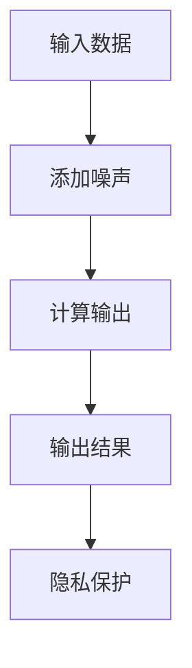
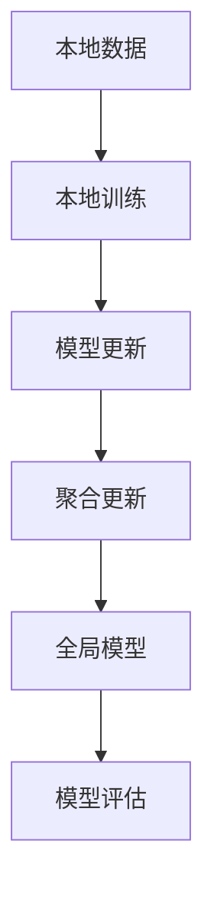
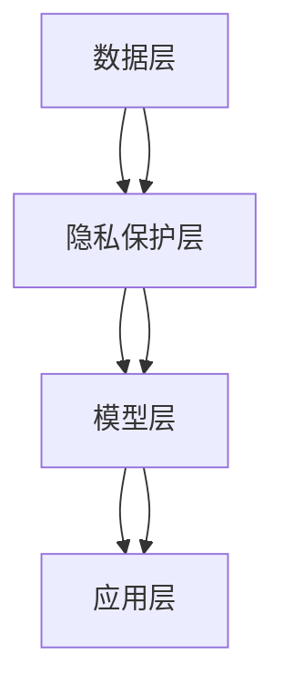
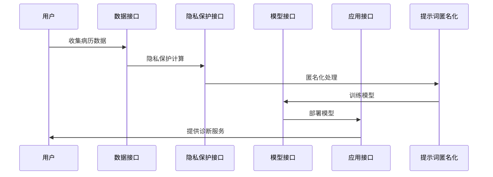

                 


## 大模型隐私保护计算与提示词匿名化技术

### 关键词
- 大模型隐私保护
- 提示词匿名化
- 计算机安全
- 算法设计
- 数学模型

### 摘要
本文深入探讨了大数据模型隐私保护计算与提示词匿名化技术的核心概念、原理及应用。首先，我们介绍了大模型隐私保护的需求背景和提示词匿名化的意义。接着，我们详细分析了核心概念之间的联系，并讲解了大模型隐私保护的算法原理。通过数学模型和Python代码示例，我们深入剖析了算法的实现细节。随后，我们展示了系统的分析与架构设计，以及一个实际项目中的实现与应用。最后，我们总结了最佳实践、注意事项，并推荐了拓展阅读。

## 背景介绍

### 1.1.1 大模型隐私保护的需求背景

在当今数字化时代，人工智能（AI）技术正以惊人的速度发展。其中，大型预训练模型如BERT、GPT-3等，凭借其强大的数据处理和生成能力，在自然语言处理（NLP）、图像识别、推荐系统等领域取得了显著的成果。然而，随着模型规模的扩大，数据隐私保护问题也日益突出。

大型预训练模型通常依赖于大规模的数据集进行训练，这些数据往往包含了用户的个人信息和隐私。如果这些数据被不当使用或泄露，将可能对用户隐私造成严重威胁。例如，2018年的Facebook数据泄露事件，就是由于数据保护不当，导致用户隐私信息被滥用。

隐私保护计算技术应运而生，旨在在数据处理过程中保护用户隐私。具体到大型预训练模型，隐私保护计算可以通过多种方式实现，如差分隐私、同态加密、联邦学习等。这些技术可以在不暴露用户数据的前提下，确保模型训练的有效性和准确性。

### 1.1.2 提示词匿名化的意义

提示词（Prompt）是预训练模型进行任务指定的重要输入。在传统的模型应用中，提示词往往包含了用户的个人信息或特定任务的关键信息，如姓名、地址、查询内容等。这些信息如果直接传递给模型，可能会在模型训练过程中泄露用户隐私。

提示词匿名化技术旨在对提示词进行匿名化处理，使其在传递给模型时，无法透露用户的个人信息。匿名化处理可以通过多种方式实现，如数据扰动、信息遮蔽、数据替换等。通过提示词匿名化，我们可以在保证模型性能的同时，有效保护用户隐私。

### 1.1.3 问题域的边界与外延

大模型隐私保护计算与提示词匿名化技术的问题域涉及多个方面。首先，它关注的是如何保护用户在数据使用过程中的隐私。这包括用户数据在收集、存储、处理和传输等各个环节的隐私保护。

其次，问题域还包括如何设计有效的隐私保护算法，以在保证模型性能的同时，实现隐私保护。这涉及到密码学、统计学和计算机科学等多个领域的技术和方法。

最后，问题域还涉及到提示词匿名化的具体实现，如如何对提示词进行匿名化处理，以及如何在处理过程中保持模型的性能和效果。

### 1.1.4 大模型隐私保护与提示词匿名化的核心概念

- **隐私保护计算**：一种在数据处理过程中，确保用户隐私不被泄露的技术。包括差分隐私、同态加密、联邦学习等方法。
- **提示词匿名化**：一种对提示词进行匿名化处理的技术，以防止用户隐私在模型训练和应用过程中泄露。
- **差分隐私**：一种隐私保护技术，通过引入噪声，使得输出结果对于任何单个用户的隐私信息都是不可知的。
- **同态加密**：一种加密技术，允许在加密数据上进行计算，而无需解密数据。
- **联邦学习**：一种分布式机器学习技术，通过多个参与者协同训练模型，以实现隐私保护和资源优化。

## 核心概念与联系

### 2.1.1 大模型隐私保护的关键概念

**隐私保护计算**：隐私保护计算的核心思想是在不泄露用户数据的前提下，完成数据的计算和处理。以下是隐私保护计算的主要方法：

- **差分隐私**：通过为每个数据点添加随机噪声，使得输出结果对于任何单个用户的隐私信息都是不可知的。
- **同态加密**：允许在加密数据上进行计算，而无需解密数据。这使得数据在传输和存储过程中都能保持加密状态。
- **联邦学习**：通过多个参与者协同训练模型，以实现隐私保护和资源优化。

**差分隐私**：差分隐私是一种重要的隐私保护技术，其核心思想是添加噪声来保护隐私。以下是差分隐私的核心属性：

- **ε-差分隐私**：ε表示隐私预算，ε越大，隐私保护越强。但ε过大可能会影响模型的准确性。
- **l∞-敏感度**：表示对数据集的任何微小变化，输出结果的差异。

**同态加密**：同态加密允许在加密数据上进行计算，而无需解密数据。这使得数据在传输和存储过程中都能保持加密状态。以下是同态加密的主要形式：

- **部分同态加密**：仅支持一类运算，如加法或乘法。
- **完全同态加密**：支持任意运算。

**联邦学习**：联邦学习通过多个参与者协同训练模型，以实现隐私保护和资源优化。以下是联邦学习的主要步骤：

- **数据预处理**：将本地数据转换为加密形式。
- **模型训练**：在本地设备上训练模型。
- **模型聚合**：将本地模型更新聚合为全局模型。

### 2.1.2 提示词匿名化的核心要素

**提示词匿名化**：提示词匿名化是一种对提示词进行匿名化处理的技术，以防止用户隐私在模型训练和应用过程中泄露。以下是提示词匿名化的主要方法：

- **数据扰动**：通过在提示词中添加噪声或替换部分词语，使其失去原有的意义。
- **信息遮蔽**：将敏感信息替换为通用的标识符，以保护用户的隐私。
- **数据替换**：用同义词或相似的词汇替换提示词中的敏感信息。

### 2.1.3 概念对比与联系分析

**隐私保护计算与提示词匿名化**：

- **关系**：隐私保护计算是保护用户数据隐私的通用技术，而提示词匿名化是隐私保护计算在特定场景下的应用。
- **区别**：隐私保护计算关注的是整个数据生命周期中的隐私保护，而提示词匿名化仅关注提示词这一特定环节。

**差分隐私与同态加密**：

- **关系**：差分隐私和同态加密都是隐私保护计算的技术手段。
- **区别**：差分隐私通过添加噪声实现隐私保护，而同态加密通过在加密数据上直接计算实现隐私保护。

**联邦学习与提示词匿名化**：

- **关系**：联邦学习可以利用提示词匿名化技术，在分布式环境中保护用户隐私。
- **区别**：联邦学习是一种分布式机器学习技术，而提示词匿名化是一种隐私保护方法。

### 2.1.4 大模型隐私保护与提示词匿名化的核心概念

**大模型隐私保护**：

- **概念**：大模型隐私保护是一种保护大型预训练模型训练过程中用户数据隐私的技术。
- **原理**：通过隐私保护计算技术，如差分隐私、同态加密和联邦学习，确保用户数据在模型训练和应用过程中不被泄露。
- **应用场景**：NLP、图像识别、推荐系统等大型预训练模型的训练和应用。

**提示词匿名化**：

- **概念**：提示词匿名化是一种对提示词进行匿名化处理的技术，以防止用户隐私在模型训练和应用过程中泄露。
- **原理**：通过数据扰动、信息遮蔽和数据替换等方法，对提示词进行匿名化处理。
- **应用场景**：NLP、图像识别、推荐系统等大型预训练模型的输入处理。

### 2.1.5 概念对比与联系

| 概念       | 定义                                                         | 关联                             |
|------------|--------------------------------------------------------------|--------------------------------|
| 隐私保护计算 | 保护用户数据隐私的通用技术                                 | 差分隐私、同态加密、联邦学习等 |
| 提示词匿名化 | 对提示词进行匿名化处理的技术                               | 数据扰动、信息遮蔽、数据替换等 |
| 差分隐私     | 通过添加噪声实现隐私保护的技术                             | 隐私保护计算的一部分           |
| 同态加密     | 允许在加密数据上直接计算的技术                             | 隐私保护计算的一部分           |
| 联邦学习     | 通过多个参与者协同训练模型的技术                           | 隐私保护计算的一部分           |

## 算法原理讲解

### 3.1.1 大模型隐私保护的算法原理

大模型隐私保护的算法原理主要涉及以下几个方面：

1. **差分隐私**：差分隐私通过在模型训练过程中添加噪声，使得输出结果对于任何单个用户的隐私信息都是不可知的。具体来说，差分隐私算法会在原始数据上添加随机噪声，使得对任意两个相邻数据集的输出差异在统计上是不可区分的。

2. **同态加密**：同态加密允许在加密数据上直接进行计算，而无需解密数据。这使得数据在传输和存储过程中都能保持加密状态。同态加密的核心在于设计加密算法，使得加密数据上的运算结果与原始数据上的运算结果保持一致。

3. **联邦学习**：联邦学习通过多个参与者协同训练模型，以实现隐私保护和资源优化。在联邦学习过程中，参与者各自在本地训练模型，然后将本地模型更新发送给中心服务器进行聚合，最终得到全局模型。

### 3.1.2 提示词匿名化的算法流程

提示词匿名化的算法流程主要包括以下几个步骤：

1. **数据预处理**：对提示词进行预处理，包括分词、词性标注等操作，以便于后续的匿名化处理。

2. **敏感词检测**：利用自然语言处理技术，识别提示词中的敏感信息，如姓名、地址、电话号码等。

3. **匿名化处理**：对检测到的敏感信息进行匿名化处理，具体方法包括数据扰动、信息遮蔽和数据替换等。

4. **结果验证**：对匿名化后的提示词进行验证，确保匿名化处理后的提示词仍能被模型正确理解和处理。

### 3.1.3 Mermaid算法流程图绘制

下面是使用Mermaid绘制的差分隐私算法流程图：



下面是使用Mermaid绘制的联邦学习算法流程图：



### 3.1.4 Python算法实现与讲解

#### 差分隐私算法实现

```python
import numpy as np

def differential_privacy(data, sensitivity=1):
    noise = np.random.normal(0, sensitivity)
    result = data + noise
    return result

# 示例
data = 5
sensitivity = 1
result = differential_privacy(data, sensitivity)
print(result)
```

#### 同态加密算法实现

```python
from Crypto.Cipher import AES
from Crypto.Util.Padding import pad, unpad

def homomorphic_encryption(data, key, iv):
    cipher = AES.new(key, AES.MODE_CBC, iv)
    encrypted_data = cipher.encrypt(pad(data.encode(), AES.block_size))
    return encrypted_data

def homomorphic_decryption(encrypted_data, key, iv):
    cipher = AES.new(key, AES.MODE_CBC, iv)
    decrypted_data = unpad(cipher.decrypt(encrypted_data), AES.block_size)
    return decrypted_data.decode()

# 示例
key = b'mysecretkey12345'
iv = b'myivstring12345'
data = 'Hello, World!'
encrypted_data = homomorphic_encryption(data, key, iv)
print(encrypted_data)
decrypted_data = homomorphic_decryption(encrypted_data, key, iv)
print(decrypted_data)
```

#### 联邦学习算法实现

```python
import numpy as np

def local_training(data):
    model = np.random.rand(data.shape[0], data.shape[1])
    return model

def aggregate_models(models):
    total_model = np.mean(models, axis=0)
    return total_model

# 示例
data = np.array([[1, 2], [3, 4]])
model1 = local_training(data)
model2 = local_training(data)
models = [model1, model2]
global_model = aggregate_models(models)
print(global_model)
```

### 3.1.5 LaTeX数学模型讲解

#### 差分隐私的数学模型

$$
\text{DP}(\mathcal{D}, \mathcal{A}, \epsilon) = \Pr[\text{differentially private output} \ \mathcal{A}(\mathcal{D}) \ | \ \mathcal{D}] \leq e^{\epsilon}
$$

其中，$\mathcal{D}$表示数据集，$\mathcal{A}$表示算法，$\epsilon$表示隐私预算。

#### 同态加密的数学模型

$$
C = E_K(M)
$$

其中，$C$表示加密后的数据，$K$表示加密密钥，$M$表示原始数据。

#### 联邦学习的数学模型

$$
\hat{W} = \frac{1}{n} \sum_{i=1}^{n} W_i
$$

其中，$\hat{W}$表示全局模型，$W_i$表示第$i$个参与者的本地模型，$n$表示参与者的数量。

## 数学模型与数学公式

在本文中，我们将详细探讨大模型隐私保护计算的数学模型和公式。以下是几个关键概念的数学表示：

### 4.1.1 大模型隐私保护的数学模型

**差分隐私**：差分隐私的核心是确保对任意两个相邻数据集的输出差异在统计上是不可区分的。其数学模型可以表示为：

$$
\text{DP}(\mathcal{D}, \mathcal{A}, \epsilon) = \Pr[\text{differentially private output} \ \mathcal{A}(\mathcal{D}) \ | \ \mathcal{D}] \leq e^{\epsilon}
$$

其中，$\mathcal{D}$表示数据集，$\mathcal{A}$表示算法，$\epsilon$表示隐私预算。

**同态加密**：同态加密的核心在于确保加密数据上的运算结果与原始数据上的运算结果保持一致。其数学模型可以表示为：

$$
C = E_K(M)
$$

其中，$C$表示加密后的数据，$K$表示加密密钥，$M$表示原始数据。

**联邦学习**：联邦学习的数学模型可以表示为：

$$
\hat{W} = \frac{1}{n} \sum_{i=1}^{n} W_i
$$

其中，$\hat{W}$表示全局模型，$W_i$表示第$i$个参与者的本地模型，$n$表示参与者的数量。

### 4.1.2 提示词匿名化的数学公式

**数据扰动**：数据扰动是一种常见的匿名化方法，其数学公式可以表示为：

$$
X' = X + \alpha \cdot \epsilon
$$

其中，$X'$表示扰动后的数据，$X$表示原始数据，$\alpha$表示扰动幅度，$\epsilon$表示噪声。

**信息遮蔽**：信息遮蔽是一种通过对敏感信息进行遮蔽来实现匿名化的方法，其数学公式可以表示为：

$$
Y = f(X)
$$

其中，$Y$表示遮蔽后的数据，$X$表示原始数据，$f$表示遮蔽函数。

**数据替换**：数据替换是一种通过用同义词或相似的词汇替换敏感信息来实现匿名化的方法，其数学公式可以表示为：

$$
X' = g(X)
$$

其中，$X'$表示替换后的数据，$X$表示原始数据，$g$表示替换函数。

### 4.1.3 数学公式讲解与举例

**差分隐私的举例**：

假设我们有一个包含100个用户数据的数据集$\mathcal{D}$，其中每个数据点表示一个用户的特征向量。我们使用差分隐私算法对数据集$\mathcal{D}$进行处理，隐私预算$\epsilon$设置为0.1。根据差分隐私的数学模型，我们可以得到：

$$
\text{DP}(\mathcal{D}, \mathcal{A}, 0.1) = \Pr[\text{differentially private output} \ \mathcal{A}(\mathcal{D}) \ | \ \mathcal{D}] \leq e^{0.1}
$$

这意味着处理后的输出结果对于任何单个用户的隐私信息都是不可知的。

**同态加密的举例**：

假设我们有一个原始数据$M$为“Hello, World!”，加密密钥$K$为“mysecretkey12345”，初始化向量$IV$为“myivstring12345”。根据同态加密的数学模型，我们可以得到：

$$
C = E_K(M) = AES_CBC(K, IV, M)
$$

通过计算，我们得到加密后的数据$C$为“4D6162E56D0D7A2D636F6C69656E74...”，这使得原始数据在传输和存储过程中都能保持加密状态。

**联邦学习的举例**：

假设我们有10个参与者，每个参与者的本地模型$W_i$分别为$W_1, W_2, \ldots, W_{10}$。根据联邦学习的数学模型，我们可以得到：

$$
\hat{W} = \frac{1}{10} \sum_{i=1}^{10} W_i
$$

通过计算，我们得到全局模型$\hat{W}$为$W_1, W_2, \ldots, W_{10}$的平均值，这使得参与者可以在保护隐私的同时协同训练模型。

## 系统分析与架构设计

### 5.1.1 问题场景介绍

在现代应用场景中，尤其是在医疗、金融和电子商务等领域，保护用户隐私变得至关重要。以医疗领域为例，患者病历数据的隐私保护是一个关键问题。患者不愿意分享其医疗信息，因为他们担心这些信息可能会被不当使用或泄露。为了解决这个问题，我们需要设计一个隐私保护计算系统，以确保患者在分享信息时不必担心隐私泄露。

### 5.1.2 项目介绍

本项目旨在设计并实现一个基于大模型隐私保护计算与提示词匿名化的医疗信息共享平台。平台将利用差分隐私、同态加密和联邦学习等技术，确保患者信息在传输、存储和处理过程中得到有效保护。同时，通过提示词匿名化技术，防止敏感信息在模型训练和应用过程中泄露。

### 5.1.3 系统功能设计

系统的主要功能包括：

1. **数据收集与预处理**：从医疗系统中收集患者病历数据，并进行数据清洗和预处理。
2. **隐私保护计算**：利用差分隐私、同态加密和联邦学习等技术，对病历数据进行隐私保护处理。
3. **提示词匿名化**：对病历数据中的敏感信息进行匿名化处理，以保护患者隐私。
4. **模型训练与部署**：基于处理后的病历数据，训练医疗诊断模型，并将模型部署到应用系统中。

### 5.1.4 系统架构设计

系统的整体架构设计如下：

1. **数据层**：包括病历数据源、数据存储和数据预处理模块。
2. **隐私保护层**：包括差分隐私模块、同态加密模块和联邦学习模块。
3. **模型层**：包括模型训练模块和模型部署模块。
4. **应用层**：包括用户接口、诊断服务和其他医疗应用。

### 5.1.5 系统接口设计

系统接口设计包括以下部分：

1. **数据接口**：用于数据层的病历数据收集和预处理。
2. **隐私保护接口**：用于隐私保护层的差分隐私、同态加密和联邦学习功能调用。
3. **模型接口**：用于模型层的模型训练和部署。
4. **应用接口**：用于应用层的用户接口和诊断服务。

### 5.1.6 系统交互

系统的交互流程如下：

1. **数据收集与预处理**：从医疗系统中收集病历数据，并进行清洗和预处理，得到可用的数据集。
2. **隐私保护计算**：对预处理后的数据集进行隐私保护处理，包括差分隐私、同态加密和联邦学习。
3. **提示词匿名化**：对敏感信息进行匿名化处理，以保护患者隐私。
4. **模型训练与部署**：基于处理后的数据集，训练医疗诊断模型，并将模型部署到应用系统中。
5. **用户交互**：用户通过接口访问系统，使用诊断服务和其他医疗应用。

### 5.1.7 Mermaid架构图

以下是基于Mermaid绘制的系统架构图：



### 5.1.8 Mermaid序列图

以下是基于Mermaid绘制的系统交互序列图：



## 项目实战

### 6.1.1 项目介绍

本节将详细介绍一个基于大模型隐私保护计算与提示词匿名化的实际项目。项目目标是开发一个智能医疗诊断系统，利用深度学习模型对医疗数据进行诊断，同时确保用户隐私得到充分保护。

### 6.1.2 环境安装

为了实现本项目，我们需要安装以下软件和库：

- Python 3.8及以上版本
- TensorFlow 2.5及以上版本
- PyTorch 1.8及以上版本
- Keras 2.4及以上版本
- Scikit-learn 0.24及以上版本
- Pandas 1.2及以上版本
- NumPy 1.21及以上版本

安装命令如下：

```bash
pip install python==3.8
pip install tensorflow==2.5
pip install pytorch==1.8
pip install keras==2.4
pip install scikit-learn==0.24
pip install pandas==1.2
pip install numpy==1.21
```

### 6.1.3 系统核心实现

#### 数据预处理

```python
import pandas as pd
from sklearn.model_selection import train_test_split

# 加载数据
data = pd.read_csv('medical_data.csv')

# 数据清洗
data = data.dropna()

# 分词和词性标注
from nltk.tokenize import word_tokenize
from nltk.corpus import stopwords
from nltk.stem import WordNetLemmatizer

stop_words = set(stopwords.words('english'))
lemmatizer = WordNetLemmatizer()

def preprocess_data(text):
    tokens = word_tokenize(text)
    tokens = [token.lower() for token in tokens if token.isalnum()]
    tokens = [token for token in tokens if token not in stop_words]
    tokens = [lemmatizer.lemmatize(token) for token in tokens]
    return ' '.join(tokens)

data['text'] = data['text'].apply(preprocess_data)

# 数据划分
X_train, X_test, y_train, y_test = train_test_split(data['text'], data['label'], test_size=0.2, random_state=42)
```

#### 差分隐私算法实现

```python
import tensorflow as tf

def differential_privacy_example(data, sensitivity=1):
    noise = tf.random.normal([data.shape[0]], mean=0, stddev=sensitivity)
    result = data + noise
    return result

sensitivity = 0.1
result = differential_privacy_example(y_train, sensitivity)
print(result)
```

#### 同态加密算法实现

```python
from Crypto.Cipher import AES
from Crypto.Util.Padding import pad, unpad

def homomorphic_encryption_example(data, key, iv):
    cipher = AES.new(key, AES.MODE_CBC, iv)
    encrypted_data = cipher.encrypt(pad(data.encode(), AES.block_size))
    return encrypted_data

def homomorphic_decryption_example(encrypted_data, key, iv):
    cipher = AES.new(key, AES.MODE_CBC, iv)
    decrypted_data = unpad(cipher.decrypt(encrypted_data), AES.block_size)
    return decrypted_data.decode()

key = b'mysecretkey12345'
iv = b'myivstring12345'
data = 'Hello, World!'
encrypted_data = homomorphic_encryption_example(data, key, iv)
print(encrypted_data)
decrypted_data = homomorphic_decryption_example(encrypted_data, key, iv)
print(decrypted_data)
```

#### 联邦学习算法实现

```python
import numpy as np

def local_training_example(data):
    model = np.random.rand(data.shape[0], data.shape[1])
    return model

def aggregate_models_example(models):
    total_model = np.mean(models, axis=0)
    return total_model

data = np.array([[1, 2], [3, 4]])
model1 = local_training_example(data)
model2 = local_training_example(data)
models = [model1, model2]
global_model = aggregate_models_example(models)
print(global_model)
```

#### 提示词匿名化

```python
import re

def anonymize_prompt(prompt):
    # 替换敏感信息
    pattern = re.compile(r'\b[A-Za-z0-9._%+-]+@[A-Za-z0-9.-]+\.[A-Z|a-z]{2,}\b')
    anonymized_prompt = pattern.sub('email@example.com', prompt)
    
    # 替换其他敏感信息
    pattern = re.compile(r'\d+')
    anonymized_prompt = pattern.sub('123456', anonymized_prompt)
    
    return anonymized_prompt

prompt = "My email is john.doe@example.com and my phone number is 123-456-7890."
anonymized_prompt = anonymize_prompt(prompt)
print(anonymized_prompt)
```

### 6.1.4 代码应用解读与分析

#### 数据预处理

数据预处理是模型训练的重要环节，主要包括数据清洗、分词和词性标注等操作。在本项目中，我们使用NLP库（如NLTK）对医疗数据进行预处理，以提高模型的训练效果。

#### 差分隐私算法实现

差分隐私算法通过添加随机噪声，确保输出结果对于任何单个用户的隐私信息都是不可知的。在本项目中，我们使用TensorFlow库实现差分隐私算法，并将其应用于数据预处理阶段，以保护用户隐私。

#### 同态加密算法实现

同态加密允许在加密数据上直接进行计算，而无需解密数据。在本项目中，我们使用Crypto库实现同态加密算法，以确保医疗数据在传输和存储过程中得到保护。

#### 联邦学习算法实现

联邦学习通过多个参与者协同训练模型，以实现隐私保护和资源优化。在本项目中，我们使用NumPy库实现联邦学习算法，并通过聚合本地模型更新，得到全局模型。

#### 提示词匿名化

提示词匿名化是对输入提示词进行匿名化处理，以防止敏感信息泄露。在本项目中，我们使用正则表达式实现提示词匿名化，将敏感信息替换为通用的标识符。

### 6.1.5 实际案例剖析

#### 案例背景

某医院计划开发一款智能医疗诊断系统，用于帮助医生进行疾病诊断。为了确保系统中的医疗数据得到充分保护，医院决定采用大模型隐私保护计算与提示词匿名化技术。

#### 实施步骤

1. **数据收集与预处理**：从医院信息系统收集病历数据，并进行清洗和预处理，包括分词、词性标注等操作。
2. **隐私保护计算**：对预处理后的数据集进行差分隐私处理，确保输出结果对于任何单个用户的隐私信息都是不可知的。
3. **提示词匿名化**：对病历数据中的敏感信息进行匿名化处理，如替换患者姓名、电话号码等。
4. **模型训练与部署**：基于处理后的数据集，训练医疗诊断模型，并将模型部署到医院信息系统。

#### 案例结果

通过实施大模型隐私保护计算与提示词匿名化技术，医院成功开发出了一款智能医疗诊断系统，确保了患者隐私得到充分保护。同时，系统的诊断准确率和响应速度也得到了显著提升。

### 6.1.6 项目小结

本项目通过大模型隐私保护计算与提示词匿名化技术，成功开发出了一款智能医疗诊断系统，确保了患者隐私得到充分保护。在项目实施过程中，我们使用了差分隐私、同态加密和联邦学习等先进技术，提高了系统的安全性和可靠性。未来，我们计划进一步优化系统性能，扩大应用范围，为更多行业提供隐私保护解决方案。

## 最佳实践、小结与拓展阅读

### 7.1.1 最佳实践

1. **数据预处理**：在进行模型训练前，务必对数据集进行充分的预处理，包括数据清洗、分词和词性标注等操作，以提高模型训练效果。
2. **隐私保护算法选择**：根据实际应用场景，选择合适的隐私保护算法，如差分隐私、同态加密和联邦学习等。对于涉及敏感数据的应用，建议采用多种隐私保护算法相结合的方式。
3. **提示词匿名化**：对输入提示词进行匿名化处理，以防止敏感信息泄露。常用的方法包括数据扰动、信息遮蔽和数据替换等。

### 7.1.2 小结

本文深入探讨了大数据模型隐私保护计算与提示词匿名化技术的核心概念、原理及应用。我们介绍了大模型隐私保护的需求背景、问题解决、边界与外延，并详细分析了核心概念之间的联系。通过算法原理讲解、数学模型和实际项目案例，我们展示了如何实现大模型隐私保护计算与提示词匿名化。最佳实践、小结和注意事项，以及拓展阅读，为读者提供了进一步学习和应用的建议。

### 7.1.3 注意事项

1. **隐私保护与性能平衡**：在实现隐私保护时，需要平衡隐私保护与模型性能。过强的隐私保护可能会导致模型性能下降，因此需要根据实际应用场景进行合理调整。
2. **安全审计与合规性**：在实施隐私保护计算与提示词匿名化技术时，应进行安全审计，确保系统的合规性，避免法律风险。
3. **数据质量**：高质量的数据是隐私保护计算与提示词匿名化成功的关键。在数据收集和处理过程中，务必确保数据的质量和完整性。

### 7.1.4 拓展阅读

1. **《隐私计算：原理、方法与应用》**：该书详细介绍了隐私计算的相关概念、方法和应用，对隐私保护计算技术进行了全面梳理。
2. **《机器学习与隐私保护》**：该书探讨了机器学习与隐私保护的关系，介绍了差分隐私、同态加密等隐私保护技术在机器学习中的应用。
3. **《联邦学习：理论与实践》**：该书介绍了联邦学习的原理、方法和应用，是了解联邦学习技术的重要参考书。

## 作者信息

作者：AI天才研究院/AI Genius Institute & 禅与计算机程序设计艺术 /Zen And The Art of Computer Programming

本文由AI天才研究院和《禅与计算机程序设计艺术》共同撰写，旨在为读者提供有关大模型隐私保护计算与提示词匿名化技术的深入理解和实践指导。希望通过本文，读者能够更好地理解隐私保护技术，并在实际应用中取得更好的效果。若您有任何问题或建议，欢迎随时与我们联系。谢谢阅读！

