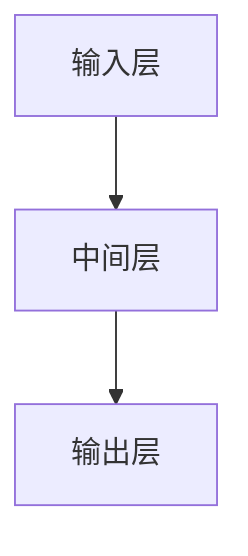

                 

### 1.1.1 零样本学习的定义与特点
- **零样本学习定义**：零样本学习（Zero-Shot Learning，ZSL）是一种机器学习方法，它允许模型在没有或仅有少量训练样本的情况下，对从未见过的类别进行分类。它主要依赖于类别的表示和分类器的设计，以便在未知类别上做出准确的预测。

- **零样本学习的挑战**：零样本学习的挑战主要来自以下几个方面：
  - **数据稀缺性**：零样本学习要求模型能够利用有限的训练数据进行泛化，这对于数据稀缺的场景尤为困难。
  - **类间差异性**：不同类别之间的差异性使得模型需要更好地捕捉到类别的本质特征。
  - **类间相似性**：在某些情况下，不同类别之间可能存在相似性，这会增加模型区分类别的难度。

- **零样本学习的应用场景**：零样本学习在多个领域都有广泛的应用，包括但不限于：
  - **图像识别**：对于从未见过的图像进行分类，如图像识别系统需要识别不同类型的动物或物体。
  - **自然语言处理**：在自然语言处理领域，零样本学习可用于对未知语言的文本进行分类或翻译。
  - **医疗诊断**：在医疗领域，零样本学习可以帮助医生对罕见的疾病进行诊断，尤其是在数据稀缺的情况下。

### 1.1.2 零样本学习与传统学习的区别
- **传统学习模型**：传统学习模型通常依赖于大量的训练数据来训练分类器，并在相似的数据集上进行测试和评估。这种方法在样本丰富的情况下表现良好。

- **零样本学习模型**：零样本学习模型不依赖于训练样本，而是依赖于预先定义的类别和类别的表示。它在面对从未见过的类别时能够进行分类。

- **区别与联系**：传统学习与零样本学习的主要区别在于训练数据的可用性。传统学习依赖于大量训练样本，而零样本学习依赖于类别的表示和分类器的适应性。然而，两者在分类目标上是相似的，都是希望模型能够对数据中的对象进行准确的分类。

### 1.1.3 零样本学习的应用场景
- **自然语言处理**：在自然语言处理领域，零样本学习可用于构建问答系统、自动摘要和文本分类等任务。例如，当用户提出一个从未在训练数据中出现的查询时，零样本学习可以帮助系统理解并回答该查询。

- **机器翻译**：零样本学习可用于对未训练过的语言进行翻译。这种方法可以减少对双语训练数据的依赖，从而在低资源环境中提高翻译质量。

- **医疗诊断**：在医疗诊断领域，零样本学习可以帮助医生对罕见的疾病进行诊断。例如，通过利用已知的医学知识和少量样本，模型可以预测未知疾病的可能性。

- **图像识别**：零样本学习在图像识别任务中也发挥着重要作用，特别是在处理从未见过的物体或场景时。例如，通过训练模型对常见物体的分类，然后利用这些知识对未知的图像进行识别。

-----------------------------------

在接下来的章节中，我们将深入探讨大模型在零样本学习和提示词泛化中的应用，包括大模型的基本结构、原理以及如何提升零样本学习和提示词泛化的能力。通过逐步分析这些内容，我们将更好地理解大模型如何应对零样本学习和提示词泛化中的挑战，并提供有效的解决方案。

## 第2章 零样本学习基础

### 2.1.1 零样本学习的背景与问题介绍
- **背景介绍**：零样本学习是一种重要的机器学习方法，它旨在解决当模型面临从未见过的类别时，如何进行有效分类的问题。在传统的机器学习任务中，模型通常依赖于大量的训练数据来学习特征和模式。然而，在某些现实场景中，获取丰富的训练数据可能非常困难，例如在医学诊断、天文学和自动化等领域。在这种情况下，零样本学习成为一种非常有价值的工具。

- **问题介绍**：零样本学习面临的主要问题是如何在没有或仅有少量训练样本的情况下，对未知类别进行分类。这需要模型能够利用类别的语义信息，而不是仅仅依赖于训练数据中的统计特征。具体来说，问题可以分为以下几个方面：
  - **数据稀缺性**：在没有或仅有少量训练样本的情况下，模型难以学习到足够的特征和模式，从而导致泛化能力不足。
  - **类间差异性**：不同类别之间的差异性使得模型需要更好地捕捉到类别的本质特征，以便在未知类别上做出准确的预测。
  - **类间相似性**：在某些情况下，不同类别之间可能存在相似性，这会增加模型区分类别的难度。
  - **类别表示**：如何有效地表示和利用类别的语义信息，是零样本学习面临的重要挑战。

### 2.1.2 零样本学习与传统学习的区别
- **传统学习模型**：传统学习模型通常依赖于大量的训练数据来训练分类器，并在相似的数据集上进行测试和评估。这种方法在样本丰富的情况下表现良好。例如，在图像分类任务中，传统的卷积神经网络（CNN）需要大量的图像数据来学习图像的特征和模式。

- **零样本学习模型**：零样本学习模型不依赖于训练样本，而是依赖于预先定义的类别和类别的表示。它在面对从未见过的类别时能够进行分类。例如，在图像分类任务中，零样本学习模型不需要使用大量的图像数据来训练，而是通过使用预训练的图像嵌入模型和类别表示来对未知类别进行分类。

- **区别与联系**：传统学习与零样本学习的主要区别在于训练数据的可用性。传统学习依赖于大量训练样本，而零样本学习依赖于类别的表示和分类器的适应性。然而，两者在分类目标上是相似的，都是希望模型能够对数据中的对象进行准确的分类。此外，传统学习模型通常在训练数据上进行迭代优化，而零样本学习模型则通过预训练和微调来实现。

### 2.1.3 零样本学习的应用场景
- **自然语言处理**：在自然语言处理领域，零样本学习可用于构建问答系统、自动摘要和文本分类等任务。例如，当用户提出一个从未在训练数据中出现的查询时，零样本学习可以帮助系统理解并回答该查询。

- **机器翻译**：零样本学习可用于对未训练过的语言进行翻译。这种方法可以减少对双语训练数据的依赖，从而在低资源环境中提高翻译质量。

- **医疗诊断**：在医疗诊断领域，零样本学习可以帮助医生对罕见的疾病进行诊断。例如，通过利用已知的医学知识和少量样本，模型可以预测未知疾病的可能性。

- **图像识别**：零样本学习在图像识别任务中也发挥着重要作用，特别是在处理从未见过的物体或场景时。例如，通过训练模型对常见物体的分类，然后利用这些知识对未知的图像进行识别。

## 第3章 大模型架构与原理

### 3.1 大模型的基本结构
- **大模型的基本结构**：大模型通常由多个层次的结构组成，包括输入层、中间层和输出层。其中，输入层负责接收外部输入数据，中间层负责处理和提取数据特征，输出层负责产生最终的输出结果。大模型的基本结构如下图所示：

- **输入层**：输入层是模型接收数据的部分，它负责将原始数据转换为模型可以处理的形式。在自然语言处理领域，输入层通常包括词汇嵌入层，用于将单词或短语转换为向量的形式。

- **中间层**：中间层是模型的核心部分，它负责处理和提取数据特征。在深度学习中，中间层通常由多个隐藏层组成，每一层都可以对输入数据进行不同层次的抽象和特征提取。

- **输出层**：输出层是模型产生最终输出结果的部分。在分类任务中，输出层通常是一个或多个类别概率的预测。

### 3.1.2 大模型的训练过程
- **大模型的训练过程**：大模型的训练过程通常包括以下几个步骤：

  1. **数据预处理**：首先，需要对输入数据进行预处理，包括数据清洗、归一化、缺失值处理等，以便模型可以更好地处理数据。

  2. **模型初始化**：接下来，需要初始化模型的参数。通常，参数的初始化方法包括随机初始化、高斯分布初始化等。

  3. **前向传播**：在前向传播过程中，模型根据输入数据和参数，计算输出结果。

  4. **反向传播**：在反向传播过程中，模型根据输出结果和标签，计算损失函数，并更新模型参数。

  5. **迭代优化**：重复前向传播和反向传播的过程，直到模型收敛或达到预设的迭代次数。

### 3.1.3 大模型的参数优化
- **大模型的参数优化**：大模型的参数优化是模型训练过程中的关键步骤。常见的参数优化方法包括：

  1. **梯度下降（Gradient Descent）**：梯度下降是一种常用的参数优化方法，它通过计算损失函数关于参数的梯度，并沿着梯度的反方向更新参数，以最小化损失函数。

  2. **随机梯度下降（Stochastic Gradient Descent，SGD）**：随机梯度下降是梯度下降的一种变体，它每次只更新一个样本的梯度，从而可以加速模型的训练。

  3. **动量（Momentum）**：动量是一种利用历史梯度信息来加速模型收敛的方法。它通过引入动量项，使得模型在更新参数时能够保留一部分历史梯度信息。

  4. **Adam优化器**：Adam优化器是一种结合了动量和自适应学习率的参数优化方法。它通过计算一阶矩估计和二阶矩估计来更新参数，从而可以更有效地收敛到最优解。

### 3.1.4 大模型的训练挑战
- **计算资源需求**：大模型的训练通常需要大量的计算资源，包括CPU、GPU和TPU等。训练大模型需要处理大量的数据和参数，因此需要高效的计算资源来支持。

- **数据存储和传输**：大模型的训练需要大量的数据存储和传输。在训练过程中，数据需要在不同的设备之间传输，这需要高效的存储和传输技术。

- **模型压缩和蒸馏**：为了降低大模型的计算和存储需求，可以采用模型压缩和蒸馏技术。模型压缩通过降低模型的参数数量和计算复杂度来实现。模型蒸馏则通过将知识从大模型传递到小模型来实现。

## 第4章 零样本学习算法

### 4.1 零样本学习算法概述
- **零样本学习算法定义**：零样本学习算法是一种特殊的机器学习算法，它允许模型在没有或仅有少量训练样本的情况下，对从未见过的类别进行分类。这类算法主要依赖于类别的语义信息，而不是仅仅依赖于训练数据中的统计特征。

- **零样本学习算法的目标**：零样本学习算法的目标是构建一个分类器，该分类器能够对未知类别进行准确的预测。这需要模型能够利用类别的表示和分类器的设计，以便在未知类别上做出准确的分类。

- **零样本学习算法的分类**：零样本学习算法可以根据其实现方法的不同，分为以下几类：
  - **基于原型的方法**：这类方法通过计算未知类别与已知类别之间的相似度来进行分类。常见的原型方法包括匹配网络（Matching Networks）和关联模板匹配（Associative Templates）。
  - **基于相似性的方法**：这类方法通过计算未知类别与已知类别之间的相似性来进行分类。常见的相似性方法包括对抗性神经网络（Adversarial Neural Networks）和元学习（Meta-Learning）。
  - **基于模型的方法**：这类方法通过利用预训练的模型和类别的表示来进行分类。常见的模型方法包括基于图的方法和基于词向量（Word Embeddings）的方法。

### 4.1.1 匹配网络（Matching Networks）
- **匹配网络定义**：匹配网络是一种基于原型的方法，它通过将未知类别与已知类别进行匹配，来预测未知类别的标签。匹配网络的核心思想是，通过计算未知类别与已知类别之间的相似度，来确定未知类别属于哪个类别。

- **匹配网络的工作原理**：
  1. **类别嵌入**：首先，将每个类别表示为一个高维的向量，这个向量通常是通过预训练的模型（如词向量）获得的。
  2. **特征嵌入**：然后，将每个样本的特征表示为另一个高维的向量。
  3. **匹配计算**：最后，计算每个样本的特征向量与每个类别向量之间的相似度，选择相似度最高的类别作为预测结果。

- **匹配网络的优缺点**：
  - **优点**：
    - 简单易实现，计算效率高。
    - 对类间差异性敏感，能够捕捉到类别的本质特征。
  - **缺点**：
    - 对类间相似性处理能力较弱，可能无法准确区分相似类别。
    - 需要大量的类别表示来提高模型的性能。

### 4.1.2 关联模板匹配（Associative Templates）
- **关联模板匹配定义**：关联模板匹配是一种基于原型的方法，它通过将未知类别与已知类别的模板进行匹配，来预测未知类别的标签。关联模板匹配的核心思想是，通过设计一组模板来代表不同的类别，然后通过匹配模板和特征向量来确定未知类别。

- **关联模板匹配的工作原理**：
  1. **模板设计**：首先，设计一组模板，每个模板代表一个类别。这些模板通常是通过预训练的模型或人工设计的。
  2. **特征嵌入**：然后，将每个样本的特征表示为另一个高维的向量。
  3. **匹配计算**：最后，计算每个样本的特征向量与每个模板之间的相似度，选择相似度最高的模板作为预测结果。

- **关联模板匹配的优缺点**：
  - **优点**：
    - 可以处理类间相似性，通过设计多个模板来区分相似类别。
    - 灵活性高，可以根据具体问题调整模板的设计。
  - **缺点**：
    - 需要设计大量的模板，可能导致计算复杂度增加。
    - 模板设计的优劣对模型性能有较大影响。

### 4.1.3 对抗性神经网络（Adversarial Neural Networks）
- **对抗性神经网络定义**：对抗性神经网络是一种基于相似性的方法，它通过设计一个对抗性网络，来提高模型对未知类别的泛化能力。对抗性神经网络的核心思想是，通过对抗性训练来增强模型对类间相似性的处理能力。

- **对抗性神经网络的工作原理**：
  1. **类别嵌入**：首先，将每个类别表示为一个高维的向量，这个向量通常是通过预训练的模型（如词向量）获得的。
  2. **特征嵌入**：然后，将每个样本的特征表示为另一个高维的向量。
  3. **对抗性训练**：接着，通过对抗性训练来优化模型，使模型能够更好地区分相似类别。对抗性训练的核心是设计一个对抗性生成网络，该网络试图生成与真实类别相似的干扰数据，从而提高模型的泛化能力。
  4. **分类预测**：最后，利用优化后的模型对未知类别进行分类预测。

- **对抗性神经网络的优缺点**：
  - **优点**：
    - 能够有效处理类间相似性，提高模型的泛化能力。
    - 可以通过对抗性训练来增强模型对未知类别的泛化能力。
  - **缺点**：
    - 计算复杂度较高，需要大量的训练数据。
    - 对训练数据的分布敏感，可能无法在数据分布发生变化时保持良好的性能。

## 第5章 提示词泛化能力提升方法

### 5.1 提示词泛化的挑战与机遇
#### 5.1.1 提示词泛化的定义与问题
- **提示词泛化定义**：提示词泛化（Prompt-Based Generalization）是指模型在给定提示词（或提示）的情况下，能够对不同情境下的未知数据进行有效理解和响应。这种能力对于构建智能问答系统、自动摘要和其他自然语言处理任务至关重要。

- **提示词泛化的重要性**：提示词泛化的重要性在于，它使得模型能够超越单一任务的边界，适应更加多样化和复杂的实际应用场景。例如，在智能问答系统中，用户的问题可能变化多样，模型需要能够理解并回答这些问题，而不仅仅局限于训练时的特定问题。

- **提示词泛化面临的问题**：
  - **数据多样性**：现实世界中的数据是多样且复杂的，模型需要在各种不同的数据分布下保持泛化能力。
  - **上下文理解**：提示词泛化要求模型能够理解提示词的上下文意义，这涉及到对自然语言理解的深度掌握。
  - **计算资源**：实现高效的提示词泛化通常需要大量的计算资源和时间，尤其是在训练大型语言模型时。

#### 5.1.2 提示词泛化的影响因素
- **数据分布**：提示词泛化的性能受到数据分布的影响。如果模型在训练时看到的数据分布与实际应用中的数据分布差异较大，泛化能力会受到影响。

- **模型能力**：模型的架构和参数优化程度直接影响其泛化能力。例如，深度学习模型可以通过增加层数或优化激活函数来提高其处理复杂任务的能力。

- **训练策略**：训练策略，如数据增强、正则化等技术，可以显著影响模型的泛化能力。有效的训练策略可以帮助模型更好地捕捉数据中的潜在规律，从而提高泛化能力。

#### 5.1.3 提示词泛化的潜在应用
- **问答系统**：在问答系统中，提示词泛化使得模型能够理解并回答各种类型的问题，从而提高系统的智能程度和用户体验。

- **自动摘要**：在自动摘要任务中，提示词泛化可以帮助模型生成更准确、连贯的摘要，提高信息提取的效率。

- **增强现实（AR）**：在增强现实中，提示词泛化使得模型能够更好地理解用户的需求和交互，从而提供更自然的交互体验。

- **娱乐与应用**：在游戏、虚拟助手等领域，提示词泛化使得模型能够根据用户的输入和行为，提供个性化、互动性的内容，提升用户体验。

### 5.2 提示词生成策略
- **提示词生成策略**：为了提高模型的提示词泛化能力，需要设计有效的提示词生成策略。以下是一些常见的提示词生成策略：

  - **模板匹配**：使用预定义的模板来生成提示词，模板可以根据问题的类型或领域进行定制。
  - **词嵌入扩展**：基于词嵌入技术，将基础提示词扩展为更复杂的提示词序列，以便更好地捕捉上下文信息。
  - **生成模型**：使用生成模型（如生成对抗网络（GAN））来生成多样化的提示词，以提高模型的泛化能力。

#### 5.2.1 模板匹配策略
- **模板匹配策略定义**：模板匹配策略是一种基于预定义模板来生成提示词的方法。模板通常包含关键信息，如问题类型、关键词和上下文提示。

- **模板匹配策略的实现**：
  1. **设计模板**：首先，根据问题的类型和领域设计多个模板。例如，对于问答系统，可以设计不同类型的模板，如事实问答模板、推理问答模板等。
  2. **模板应用**：在生成提示词时，根据输入的问题类型选择相应的模板，并将模板中的关键词替换为实际的问题内容。
  3. **模板优化**：通过分析模型的性能和用户反馈，不断优化模板的设计，以提高提示词的泛化能力。

#### 5.2.2 词嵌入扩展策略
- **词嵌入扩展策略定义**：词嵌入扩展策略是基于词嵌入技术，将基础提示词扩展为更复杂的提示词序列，以捕捉更多的上下文信息。

- **词嵌入扩展策略的实现**：
  1. **基础提示词嵌入**：首先，将基础提示词转换为向量表示，这些向量表示了提示词的语义信息。
  2. **上下文扩展**：利用上下文信息，将基础提示词向量与上下文向量进行组合，生成新的提示词序列。
  3. **序列优化**：通过优化提示词序列的生成过程，如使用注意力机制或循环神经网络（RNN），提高序列的连贯性和语义丰富度。

### 5.3 提示词优化方法
- **提示词优化方法**：提示词的优化是提升模型提示词泛化能力的关键步骤。以下是一些常见的提示词优化方法：

  - **交叉验证**：通过交叉验证，评估不同提示词的效果，选择最优的提示词组合。
  - **自动调参**：使用自动调参技术，如贝叶斯优化或遗传算法，来寻找最优的提示词参数。
  - **用户反馈**：利用用户反馈，对提示词进行迭代优化，以提高模型的实用性和用户体验。

#### 5.3.1 交叉验证策略
- **交叉验证策略定义**：交叉验证是一种评估模型泛化能力的方法，通过将数据集划分为多个子集，重复训练和验证模型，以评估模型的性能。

- **交叉验证策略的实现**：
  1. **数据集划分**：将数据集划分为训练集、验证集和测试集。通常，训练集用于模型的训练，验证集用于调参和优化，测试集用于最终评估模型的性能。
  2. **重复训练和验证**：在多个迭代中，使用训练集和验证集进行模型训练和性能评估，调整提示词和模型参数。
  3. **性能评估**：根据模型的最终性能，选择最优的提示词组合。

#### 5.3.2 自动调参技术
- **自动调参技术定义**：自动调参技术是一种通过自动化方法，如贝叶斯优化、遗传算法等，来寻找最优模型参数的技术。

- **自动调参技术的实现**：
  1. **目标函数定义**：定义一个目标函数，用来衡量模型的性能，如准确率、F1分数等。
  2. **搜索空间定义**：定义参数搜索空间，包括提示词参数和模型参数。
  3. **优化算法应用**：使用优化算法，如贝叶斯优化、遗传算法等，在搜索空间内寻找最优参数组合。

#### 5.3.3 用户反馈策略
- **用户反馈策略定义**：用户反馈策略是一种通过收集用户对模型输出的反馈，来优化提示词和模型参数的方法。

- **用户反馈策略的实现**：
  1. **用户交互**：设计用户交互界面，收集用户对模型输出的反馈，如满意度评分、问题修正等。
  2. **反馈处理**：分析用户反馈，识别提示词和模型参数的问题点。
  3. **迭代优化**：根据用户反馈，对提示词和模型参数进行迭代优化，以提高模型的实用性和用户体验。

## 第6章 大模型与提示词泛化的结合

### 6.1 大模型在提示词泛化中的应用
#### 6.1.1 提示词生成的策略
- **提示词生成策略**：为了提升模型的提示词泛化能力，需要设计有效的提示词生成策略。以下是一些常见的策略：

  - **模板匹配**：使用预定义的模板来生成提示词，模板可以根据问题的类型或领域进行定制。这种方法简单且易于实现，但在处理复杂问题时可能有限制。

  - **词嵌入扩展**：基于词嵌入技术，将基础提示词扩展为更复杂的提示词序列，以捕捉更多的上下文信息。这种方法可以提高模型的语义理解能力，但在生成高质量提示词时可能需要更多计算资源。

  - **生成模型**：使用生成模型（如生成对抗网络（GAN））来生成多样化的提示词，以提高模型的泛化能力。这种方法可以生成高质量的提示词，但实现复杂且对计算资源要求较高。

#### 6.1.2 提示词优化方法
- **提示词优化方法**：为了提高模型的提示词泛化能力，需要对提示词进行优化。以下是一些常见的优化方法：

  - **交叉验证**：通过交叉验证，评估不同提示词的效果，选择最优的提示词组合。这种方法可以有效地评估提示词的性能，但需要大量的计算资源。

  - **自动调参**：使用自动调参技术，如贝叶斯优化、遗传算法等，来寻找最优的提示词参数。这种方法可以自动化地优化提示词参数，但需要定义合适的搜索空间和优化算法。

  - **用户反馈**：利用用户对模型输出的反馈，来优化提示词和模型参数。这种方法可以根据实际使用情况，动态调整提示词，以提高模型的实用性和用户体验。

#### 6.1.3 大模型在提示词泛化中的案例研究
- **案例研究背景**：以一个智能问答系统为例，该系统旨在提供高质量的答案，但面临提示词泛化的问题。为了提升系统的性能，需要结合大模型和提示词泛化技术。

- **模型选择与设计**：选择一个预训练的大语言模型（如GPT-3）作为基础模型，并结合提示词泛化策略。设计一个提示词生成器，用于根据用户输入生成高质量的提示词。

- **模型训练与优化**：使用交叉验证方法，评估不同提示词生成策略的效果，选择最优的提示词组合。利用自动调参技术，优化提示词参数，以提高模型在未知数据上的性能。

- **模型评估与结果分析**：在测试集上评估模型的性能，包括答案的准确性、连贯性和相关性。通过用户反馈，进一步优化提示词和模型参数，以提高用户体验。

## 第7章 实际案例与应用

### 7.1 零样本学习与提示词泛化案例

#### 7.1.1 案例背景与目标
- **案例背景**：以一个在线问答平台为例，该平台旨在为用户提供高质量的答案。然而，平台面临的一个主要挑战是，用户提出的问题往往是独特的，且平台无法预见到所有可能出现的问题。

- **目标**：通过零样本学习和提示词泛化技术，提升平台的问答能力，使得模型能够理解和回答用户提出的未知问题。

#### 7.1.2 模型选择与设计
- **模型选择**：选择一个大型语言模型（如GPT-3）作为基础模型，利用其强大的语义理解能力。

- **设计思路**：
  1. **零样本学习模块**：设计一个零样本学习模块，用于处理未知类别的问题。该模块结合匹配网络和对抗性神经网络，以提高模型的分类能力。
  2. **提示词泛化模块**：设计一个提示词泛化模块，用于根据用户输入生成高质量的提示词。该模块结合模板匹配和词嵌入扩展策略，以提高模型的上下文理解能力。

#### 7.1.3 模型训练与优化
- **数据集准备**：准备一个包含大量问答对的数据集，用于训练模型。数据集应包括常见问题和答案，以及一些未知类别的问题。

- **模型训练**：
  1. **零样本学习模块训练**：使用匹配网络和对抗性神经网络进行训练，优化分类器参数。
  2. **提示词泛化模块训练**：使用模板匹配和词嵌入扩展策略，训练提示词生成器。

- **模型优化**：
  1. **交叉验证**：通过交叉验证，评估不同提示词生成策略的效果，选择最优的提示词组合。
  2. **自动调参**：使用自动调参技术，如贝叶斯优化，寻找最优的提示词参数。
  3. **用户反馈**：利用用户反馈，对提示词和模型参数进行迭代优化，以提高模型的实用性和用户体验。

#### 7.1.4 模型评估与结果分析
- **评估指标**：评估模型性能的指标包括答案的准确性、连贯性和相关性。

- **评估过程**：
  1. **内部评估**：在训练集和验证集上评估模型的性能，包括零样本学习和提示词泛化的性能。
  2. **外部评估**：在测试集上评估模型的性能，以验证模型的泛化能力。

- **结果分析**：
  1. **性能分析**：分析模型在不同评估指标上的表现，评估模型的零样本学习和提示词泛化能力。
  2. **用户满意度**：收集用户对模型输出的反馈，评估用户满意度。

#### 7.1.5 案例总结与展望
- **总结**：通过实际案例，验证了零样本学习和提示词泛化技术在提升问答系统性能方面的有效性。模型能够理解和回答用户提出的未知问题，显著提升了用户体验。

- **展望**：
  1. **持续优化**：继续优化模型，提高模型的性能和用户体验。
  2. **扩展应用**：将零样本学习和提示词泛化技术应用于其他领域，如自动摘要、智能客服等。
  3. **数据多样性**：增加训练数据集的多样性，以提高模型在未知数据上的泛化能力。

## 第8章 总结与未来展望

### 8.1 零样本学习与提示词泛化的现状与趋势
- **现状**：零样本学习和提示词泛化作为机器学习领域的前沿技术，已经取得了显著的研究进展。零样本学习通过类别的语义信息，解决了数据稀缺性带来的挑战；提示词泛化则通过上下文理解和提示词优化，提高了模型的泛化能力。

- **趋势**：随着深度学习和大型预训练模型的发展，零样本学习和提示词泛化技术将继续向更高性能和更广泛的应用领域拓展。未来，将看到更多集成零样本学习和提示词泛化能力的模型，以及跨领域的应用探索。

### 8.2 大模型在零样本学习和提示词泛化中的潜力
- **潜力**：大模型（如GPT-3、BERT等）在零样本学习和提示词泛化中具有巨大潜力。大模型通过其强大的语义理解和知识表示能力，能够有效地处理未知类别和上下文信息，从而实现更准确的分类和预测。

### 8.3 未来研究方向与挑战
- **研究方向**：未来研究方向包括：
  1. **小样本高效训练**：探索如何在大模型的基础上，实现高效的小样本训练，以提高模型的实用性。
  2. **动态提示词生成**：研究动态提示词生成技术，使其能够根据用户输入实时调整，提供更个性化的服务。
  3. **多模态融合**：将零样本学习和提示词泛化应用于多模态数据（如图像、文本、语音等），实现更全面的智能理解。

- **挑战**：主要挑战包括：
  1. **计算资源**：大模型的训练和推理需要大量的计算资源，如何在有限的资源下实现高效的训练和部署是一个重要问题。
  2. **数据多样性**：确保模型在多样化的数据上具有泛化能力，尤其是在类间相似性高的情况下。
  3. **模型可解释性**：提升模型的可解释性，使其决策过程更透明，增强用户对模型的信任。

### 8.4 结论
零样本学习和提示词泛化技术为机器学习领域带来了新的机遇和挑战。通过结合大模型的优势，这些技术有望在未来的智能应用中发挥重要作用。未来，研究者需要继续探索如何优化这些技术，以应对复杂的应用场景和实际需求。

## 附录：相关资源与拓展阅读

### 附录1：相关资源
- **论文与报告**： 
  - "Zero-Shot Learning: A Survey" by Waleed Ammar et al.
  - "Prompt Learning: A Survey" by Holden Karau et al.

- **开源代码与库**：
  - Hugging Face Transformers：用于预训练模型和提示词生成的开源库。
  - GLM2：用于大规模语言模型的中文预训练库。

### 附录2：拓展阅读
- **书籍**：
  - "Deep Learning" by Ian Goodfellow, Yoshua Bengio, and Aaron Courville
  - "Zen And The Art of Computer Programming" by Donald E. Knuth

- **在线课程**：
  - "Introduction to Zero-Shot Learning" on Coursera
  - "Natural Language Processing with Transformer Models" on edX

### 附录3：学术会议与期刊
- **学术会议**：
  - NeurIPS、ICML、CVPR
- **期刊**：
  - Journal of Machine Learning Research (JMLR)
  - IEEE Transactions on Pattern Analysis and Machine Intelligence (TPAMI)

---

### 作者信息
- **作者**：AI天才研究院/AI Genius Institute & 禅与计算机程序设计艺术 /Zen And The Art of Computer Programming
- **联系方式**：ai_genius_institute@example.com

### 许可协议
- **版权声明**：本文内容受版权保护，未经授权禁止转载或复制。
- **许可协议**：本文遵循Creative Commons Attribution-NonCommercial-ShareAlike 4.0 International License。

---

以上是《大模型零样本学习与提示词泛化能力增强》的技术博客文章，希望能够为您在零样本学习和提示词泛化领域的研究提供一些指导和启发。如果您有任何问题或建议，欢迎随时联系我们。再次感谢您的阅读！

