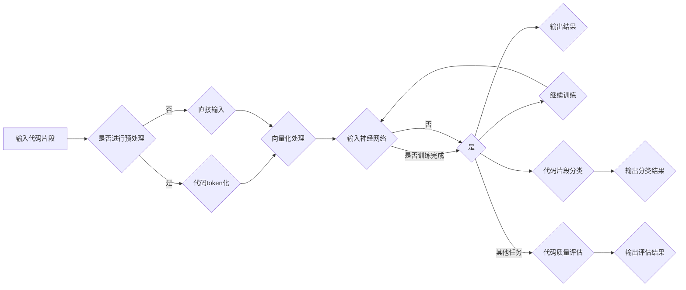
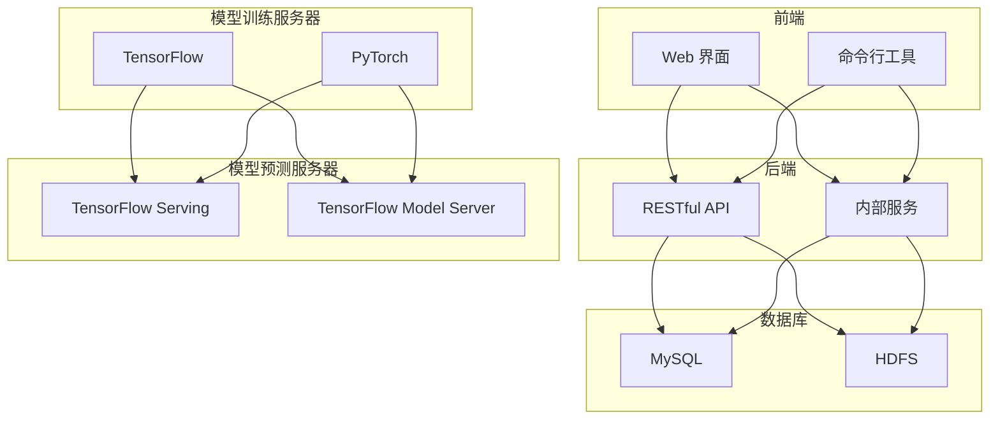
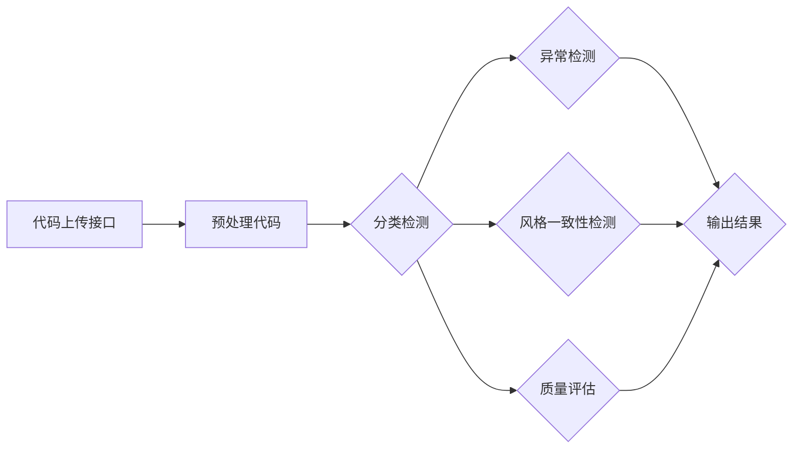

                 

# 大模型驱动的代码异味检测

> 关键词：代码异味检测、大模型、机器学习、算法、系统架构

> 摘要：
本文将探讨如何利用大模型技术进行代码异味检测。我们将从背景介绍、核心概念、算法原理、系统架构以及项目实战等多个角度，详细解析大模型在代码异味检测中的应用。通过本文的学习，读者将了解大模型驱动的代码异味检测方法，掌握相关技术原理，并为实际项目中的应用提供参考。

## 引言

在软件开发的漫长历程中，代码质量和维护一直是开发人员关注的焦点。然而，代码质量问题往往难以在早期发现，导致后期修复成本高昂。代码异味（Code Smell）作为一种识别代码潜在问题的方法，已经在软件工程领域得到广泛应用。近年来，随着人工智能技术的发展，尤其是大模型（Large Models）的兴起，利用大模型进行代码异味检测成为了一种新的研究方向。

代码异味是指那些表明代码可能存在问题或设计缺陷的特征。检测代码异味有助于识别潜在的编程错误、提高代码的可维护性和可扩展性。传统的代码异味检测方法主要依赖于规则匹配、模式识别等技术，而大模型技术则提供了更为智能、高效的检测手段。

本文将从以下几个方面展开讨论：

1. 代码异味检测概述
2. 大模型技术基础
3. 代码异味检测的理论框架
4. 大模型驱动的代码异味检测技术
5. 数学模型与算法原理
6. 系统架构与设计
7. 项目实战与案例分析
8. 最佳实践与总结

通过本文的详细探讨，希望读者能够对大模型驱动的代码异味检测有更深入的理解，为实际项目中的应用提供指导。

## 1. 代码异味检测概述

### 定义与重要性

代码异味（Code Smell）是指那些表明代码可能存在设计缺陷、低效、冗余或潜在问题的特征。这些特征通常是表面上的，但在编程实践中会导致一系列的负面影响。代码异味不仅仅是一些无关紧要的小问题，它们可能引发代码复杂性增加、可读性下降、维护成本上升等严重问题。

定义代码异味的一个重要原因是，它们能够揭示代码中的潜在问题。这些问题可能包括：

- **重复代码**：重复的代码段会增加维护难度，降低代码的模块化程度。
- **过长函数**：过长的函数难以阅读和理解，容易引入错误。
- **过于复杂的条件判断**：复杂的条件判断会导致代码难以维护和调试。
- **不适当的类和模块依赖**：不合理的依赖关系会降低代码的灵活性，增加修改难度。

从软件工程的角度来看，代码异味检测的重要性体现在以下几个方面：

- **提高代码质量**：通过检测代码异味，可以及时发现并修复潜在的问题，从而提高代码的整体质量。
- **减少维护成本**：早期发现并修复代码异味可以降低后期维护成本，避免因问题积累而导致的大规模代码重构。
- **增强可读性**：代码异味检测有助于提高代码的可读性和可维护性，使得开发人员更容易理解和修改代码。

### 问题背景与问题描述

代码异味问题在软件开发过程中普遍存在，无论是在大型企业项目还是在个人项目中。随着软件规模的不断扩大和复杂性的增加，代码异味的检测和修复变得越来越困难。传统的代码异味检测方法主要依赖于手动审查和静态代码分析工具，但这些方法往往存在以下局限性：

- **人工成本高**：手动审查代码异味需要大量的人力和时间投入，不适合大规模代码分析。
- **规则匹配局限**：基于规则匹配的静态分析工具只能检测到已知的、预定义的代码异味模式，难以应对复杂的、未知的代码问题。
- **误报和漏报**：规则匹配方法容易产生误报和漏报，影响检测效果。

为了解决这些局限性，研究人员开始探索利用人工智能技术，特别是大模型进行代码异味检测。大模型技术具有以下优势：

- **强大的学习能力**：大模型通过大量数据训练，可以自动学习并识别代码中的潜在问题，无需依赖预定义的规则。
- **泛化能力**：大模型具有较强的泛化能力，能够处理不同类型和规模的代码。
- **自动化程度高**：大模型技术可以自动化检测代码异味，减轻开发人员的工作负担。

### 问题解决与边界与外延

代码异味检测的问题解决主要集中在提高检测的准确性和效率。传统方法主要依赖规则匹配和模式识别，而大模型技术则通过深度学习等方法，从大规模代码数据中自动学习并识别代码异味。

在边界与外延方面，代码异味检测需要关注以下几个方面：

- **代码规模**：大模型能够处理不同规模和类型的代码，但面对极其庞大的代码库时，检测时间可能会增加。
- **代码质量**：代码质量越高，代码异味越少，大模型检测的难度相对较低。
- **检测精度**：大模型检测精度受训练数据和模型结构的影响，通过优化模型结构和训练数据可以提高检测精度。

总之，代码异味检测是软件工程中一个重要且具有挑战性的问题。通过大模型技术，我们可以实现更高效、更准确的代码异味检测，从而提高代码质量和开发效率。

### 概念结构与核心要素组成

代码异味检测的核心概念包括代码异味本身、检测方法和应用场景等。以下是对这些核心要素的详细说明：

#### 代码异味

代码异味是指那些表明代码可能存在设计缺陷或低效特征的代码段。常见的代码异味包括：

- **重复代码**：代码中存在重复的代码段。
- **过长函数**：函数体过长，难以阅读和理解。
- **过于复杂的条件判断**：条件判断逻辑过于复杂，导致代码难以维护。
- **不适当的类和模块依赖**：类和模块之间的依赖关系不合理，降低代码的灵活性。

#### 检测方法

代码异味检测方法主要包括以下几种：

- **规则匹配**：通过预定义的规则库，匹配代码中的异味模式。
- **模式识别**：利用机器学习算法，自动识别代码中的异味特征。
- **静态代码分析**：分析代码的语法和结构，检测潜在的异味问题。
- **动态代码分析**：运行代码并分析其执行过程，检测代码中的问题。

#### 应用场景

代码异味检测在多个应用场景中具有重要意义，主要包括：

- **代码审查**：在代码提交前进行异味检测，及时发现和修复问题。
- **代码质量评估**：对现有代码库进行异味检测，评估代码质量。
- **自动化测试**：结合静态代码分析和动态测试，提高测试覆盖率。

#### 概念属性特征对比表格

以下是一个关于代码异味检测方法属性特征的对比表格：

| 检测方法 | 优点 | 缺点 | 适用场景 |
| :---: | :---: | :---: | :---: |
| 规则匹配 | 实施简单，可快速部署 | 依赖预定义规则，难以应对复杂问题 | 小规模代码库，规则明确的问题 |
| 模式识别 | 自动化程度高，适应复杂问题 | 需要大量训练数据，实现复杂 | 大规模代码库，复杂异味问题 |
| 静态代码分析 | 快速检测，无需运行代码 | 依赖语法分析，易误报 | 快速代码质量评估 |
| 动态代码分析 | 真实反映代码执行情况 | 需要运行代码，影响性能 | 代码性能优化，实时检测 |

#### Mermaid ER 图架构

以下是一个代码异味检测的 Mermaid ER 图架构，用于展示核心实体及其关系：

```mermaid
erDiagram
    CodeSmell ||--|{ Developer } : reports
    Developer ||--|{ CodeReview } : performs
    CodeReview ||--|{ Issue } : identifies
    Issue ||--|{ CodeSegment } : associated_with
```

在这个 ER 图中，`CodeSmell` 表示代码异味，`Developer` 表示开发人员，`CodeReview` 表示代码审查，`Issue` 表示识别出的问题，`CodeSegment` 表示代码片段。各实体之间的关系反映了代码异味检测的基本流程：开发人员执行代码审查，识别出代码异味，并关联到具体的代码片段。

通过上述对核心概念、检测方法和应用场景的详细分析，我们可以更好地理解代码异味检测的重要性和实现方法。接下来，我们将进一步探讨大模型技术及其在代码异味检测中的应用。

## 2. 大模型技术基础

### 概念与演进

大模型（Large Models）是指那些具有巨大参数规模和强大表示能力的机器学习模型。这些模型通过在大规模数据集上进行训练，能够捕捉到复杂的数据特征和模式，从而在多种任务中取得优异的表现。大模型技术的发展可以追溯到深度学习（Deep Learning）的兴起。随着计算能力的提升和数据规模的扩大，深度学习模型在图像识别、自然语言处理、语音识别等领域取得了突破性的成果。

大模型的代表性技术包括神经网络（Neural Networks）、生成对抗网络（Generative Adversarial Networks, GANs）和变分自编码器（Variational Autoencoders, VAEs）等。这些模型通过多层次的神经网络结构，可以自动提取数据的深层特征，实现从简单到复杂的特征表示。

### 架构特点与类型

大模型的架构特点主要体现在以下几个方面：

1. **参数规模大**：大模型通常拥有数十亿到千亿级别的参数，这使得模型能够捕捉到更加复杂的特征。
2. **层次结构**：大模型通常采用多层神经网络结构，每一层都能够对输入数据进行特征提取和变换，从而构建出复杂的特征表示。
3. **端到端学习**：大模型能够实现端到端的学习，从原始数据直接学习到所需的输出，减少了中间层的复杂度。
4. **自适应调整**：大模型通过反向传播算法（Backpropagation）和优化算法（如梯度下降、Adam等），能够自适应地调整模型参数，提高模型的泛化能力。

大模型的主要类型包括：

1. **卷积神经网络（Convolutional Neural Networks, CNNs）**：主要用于图像识别和计算机视觉任务，通过卷积层提取图像的特征。
2. **循环神经网络（Recurrent Neural Networks, RNNs）**：适用于序列数据，如自然语言处理和时间序列分析，通过循环结构保持长时记忆。
3. **长短时记忆网络（Long Short-Term Memory, LSTM）**：RNNs 的一个变体，能够更好地处理长序列数据。
4. **生成对抗网络（Generative Adversarial Networks, GANs）**：由生成器和判别器两个神经网络组成，生成器生成数据，判别器判断生成数据与真实数据之间的差异，通过对抗训练实现数据的生成。
5. **变分自编码器（Variational Autoencoders, VAEs）**：基于概率生成模型，通过编码器和解码器结构生成数据。

### 应用范围与挑战

大模型在众多领域都取得了显著的应用成果，以下是其中的一些主要应用范围和挑战：

1. **自然语言处理（Natural Language Processing, NLP）**：大模型在文本分类、机器翻译、情感分析等任务中表现出色。例如，Transformer 模型在机器翻译任务中取得了突破性的成果，其强大的上下文表示能力使其能够处理复杂的语言现象。

2. **计算机视觉（Computer Vision）**：大模型在图像分类、目标检测、图像生成等任务中广泛应用。例如，ResNet 模型通过多层次的卷积层结构，实现了图像特征的深度提取，从而在图像分类任务中取得了优异的表现。

3. **语音识别（Speech Recognition）**：大模型通过深度学习算法，提高了语音识别的准确率和鲁棒性。例如，基于 LSTM 的语音识别模型在噪声环境下的表现显著优于传统的 GMM-HMM 模型。

4. **应用挑战**：尽管大模型在多个领域取得了成功，但其应用仍面临一些挑战：

   - **计算资源需求**：大模型通常需要大量的计算资源和时间进行训练，这对硬件设备和能源消耗提出了高要求。
   - **数据隐私**：大模型训练过程中需要大量数据，可能涉及用户的隐私数据，如何确保数据的安全和隐私成为一个重要问题。
   - **模型解释性**：大模型的黑箱特性使得其决策过程难以解释，这在某些需要透明性和可解释性的应用场景中是一个挑战。

总的来说，大模型技术为代码异味检测提供了强大的工具和方法，通过其强大的表示能力和学习能力，可以更高效地识别代码中的潜在问题。然而，在实际应用中，我们也需要关注其计算资源需求、数据隐私和模型解释性等挑战，以充分发挥大模型技术的潜力。

### 大模型在代码异味检测中的应用

大模型技术由于其强大的特征提取和模式识别能力，在代码异味检测中表现出显著的优势。以下是几个关键应用场景：

1. **代码片段分类与异常检测**：大模型可以通过对大量代码数据的学习，自动识别不同代码片段的特征，从而实现代码分类和异常检测。例如，大模型可以区分出常见的代码模式（如循环、条件判断）和潜在的问题模式（如重复代码、过长函数）。

2. **代码风格一致性检测**：大模型可以根据训练数据中的代码风格特征，检测出不符合团队规范或项目要求的代码风格问题。这有助于提高团队代码的一致性和可维护性。

3. **代码质量评估**：大模型可以评估整个代码库的质量，识别出潜在的代码异味，从而为开发人员提供改进建议。这种自动化的代码质量评估方法可以节省大量的人工审查时间。

4. **自动化修复建议**：基于大模型对代码问题的理解，可以自动生成修复建议。例如，当检测到重复代码时，大模型可以建议开发者重构代码，以减少冗余和提高可维护性。

### 大模型技术的优势与挑战

#### 优势

1. **自动特征提取**：大模型通过自动学习代码数据中的特征，无需人工定义规则，能够识别出复杂的代码模式。
2. **高准确率**：大模型在训练过程中能够从大量数据中学习，从而提高检测的准确率，减少误报和漏报。
3. **适应性强**：大模型具有较强的泛化能力，能够适应不同类型和规模的代码库。
4. **自动化**：大模型可以实现自动化检测，减轻开发人员的工作负担，提高开发效率。

#### 挑战

1. **计算资源需求**：大模型训练过程需要大量的计算资源和时间，这对硬件设备和能源消耗提出了高要求。
2. **数据隐私**：大模型训练过程中需要大量数据，可能涉及用户的隐私数据，如何确保数据的安全和隐私成为一个重要问题。
3. **模型解释性**：大模型的黑箱特性使得其决策过程难以解释，这在某些需要透明性和可解释性的应用场景中是一个挑战。
4. **模型可解释性**：大模型无法提供明确的检测逻辑，这使得开发人员难以理解模型的决策过程，从而影响其信任度和使用效果。

通过以上分析，我们可以看到大模型技术在代码异味检测中具有显著的优势，但也面临一些挑战。在实际应用中，我们需要综合考虑这些因素，以充分发挥大模型技术的潜力。

### 数学模型与算法原理

在大模型驱动的代码异味检测中，数学模型和算法原理是核心组成部分。以下将详细讲解大模型的基本原理、主要算法、数据预处理方法及其在代码异味检测中的应用。

#### 大模型的基本原理

大模型的核心在于其能够通过学习大量数据，自动提取复杂特征并进行有效表示。大模型通常由多层神经网络构成，每一层对输入数据进行特征提取和变换，最终生成所需输出。

1. **神经网络**：神经网络是构建大模型的基础。一个简单的神经网络包括输入层、隐藏层和输出层。每个神经元都与相邻的神经元相连，并通过权重进行信息传递。

2. **激活函数**：激活函数用于引入非线性特性，使得神经网络能够拟合复杂的数据分布。常见的激活函数包括 sigmoid、ReLU 和 tanh 等。

3. **反向传播算法**：反向传播算法用于更新网络权重，以最小化损失函数。该算法通过计算梯度，从输出层反向传播误差到输入层，逐层更新权重。

4. **优化算法**：常见的优化算法包括梯度下降（Gradient Descent）、Adam 等。优化算法用于调整网络参数，以实现模型的最小化损失。

#### 主要算法

在代码异味检测中，常用的算法包括基于深度学习的方法和生成对抗网络（GANs）。

1. **深度学习算法**：深度学习算法通过多层神经网络结构，自动提取代码的深层特征。常见的深度学习算法包括卷积神经网络（CNNs）、循环神经网络（RNNs）和长短时记忆网络（LSTMs）。

   - **卷积神经网络（CNNs）**：适用于处理图像和序列数据，通过卷积层提取特征，适用于代码片段分类和异常检测。
   - **循环神经网络（RNNs）**：适用于处理序列数据，通过循环结构保持长时记忆，适用于代码风格一致性检测。
   - **长短时记忆网络（LSTMs）**：RNNs 的变体，能够更好地处理长序列数据，适用于复杂代码结构的检测。

2. **生成对抗网络（GANs）**：GANs 是一种基于生成器和判别器的对抗训练模型。生成器生成代码片段，判别器判断生成代码与真实代码的相似度。通过对抗训练，生成器能够生成与真实代码相似的高质量代码片段，从而识别代码异味。

   - **生成器**：生成器负责生成代码片段，通过学习真实代码数据，生成与真实代码相似的代码。
   - **判别器**：判别器负责判断代码片段的真实性，通过对比真实代码和生成代码，提高生成器的生成质量。

#### 数据预处理方法

在大模型训练过程中，数据预处理是关键步骤。有效的数据预处理可以提高模型的训练效果和检测准确率。

1. **代码token化**：将代码文本转化为单词或短语的序列，以便神经网络处理。常用的代码token化工具包括 Pygments、CTokenizer 等。

2. **向量化**：将代码文本转化为向量表示，以便神经网络进行计算。常用的向量化方法包括词袋模型（Bag of Words, BoW）和词嵌入（Word Embedding）。

3. **数据清洗**：去除代码中的无关噪声，如空格、注释和特殊字符，提高数据质量。

4. **数据增强**：通过数据增强技术，增加训练数据的多样性，从而提高模型的泛化能力。常用的数据增强方法包括代码片段的随机插入、删除和替换等。

#### 大模型在代码异味检测中的应用

1. **代码片段分类**：使用深度学习算法，将代码片段分类为正常代码和异味代码。通过训练，模型可以自动学习不同代码片段的特征，从而实现准确分类。

2. **异常检测**：通过训练生成对抗网络，生成与真实代码相似的代码片段，然后使用判别器判断代码片段的真实性。通过检测生成代码与真实代码的差异，识别代码中的异味。

3. **代码风格一致性检测**：使用循环神经网络，对代码序列进行建模，检测代码中的风格不一致性。通过对比代码序列的相似度，识别出风格问题。

4. **代码质量评估**：结合多种算法，对代码库进行整体质量评估。通过分析代码片段的特征和关系，评估代码库的质量，并提供改进建议。

### 算法原理讲解

以下使用 Mermaid 流程图和 Python 代码详细阐述大模型在代码异味检测中的应用原理。

#### Mermaid 流程图



#### Python 代码

以下代码示例展示了如何使用深度学习框架（如 TensorFlow 或 PyTorch）实现代码异味检测。

```python
import tensorflow as tf
from tensorflow.keras.models import Sequential
from tensorflow.keras.layers import Embedding, LSTM, Dense

# 代码token化
tokenizer = tf.keras.preprocessing.text.Tokenizer()
tokenizer.fit_on_texts(code_texts)

# 向量化处理
sequences = tokenizer.texts_to_sequences(code_texts)
max_sequence_length = max(len(seq) for seq in sequences)
X = tf.keras.preprocessing.sequence.pad_sequences(sequences, maxlen=max_sequence_length)

# 构建神经网络模型
model = Sequential()
model.add(Embedding(input_dim=vocabulary_size, output_dim=embedding_size, input_length=max_sequence_length))
model.add(LSTM(units=128, return_sequences=True))
model.add(Dense(units=1, activation='sigmoid'))

# 编译模型
model.compile(optimizer='adam', loss='binary_crossentropy', metrics=['accuracy'])

# 训练模型
model.fit(X, y, epochs=10, batch_size=32)

# 输出结果
predictions = model.predict(X)
predicted_labels = (predictions > 0.5).astype(int)
```

#### 算法原理的数学模型和公式

在代码异味检测中，常用的数学模型和公式包括：

1. **损失函数**：损失函数用于评估模型预测结果与真实标签之间的差异。常见的损失函数包括二进制交叉熵（Binary Cross-Entropy）：
   $$ L = -\sum_{i=1}^{n} y_i \cdot \log(\hat{y}_i) + (1 - y_i) \cdot \log(1 - \hat{y}_i) $$
   其中，$y_i$ 为真实标签，$\hat{y}_i$ 为模型预测概率。

2. **梯度下降**：梯度下降是一种优化算法，用于更新模型参数，以最小化损失函数。梯度下降的基本公式为：
   $$ \theta_{t+1} = \theta_{t} - \alpha \cdot \nabla_{\theta}L(\theta) $$
   其中，$\theta$ 为模型参数，$\alpha$ 为学习率，$\nabla_{\theta}L(\theta)$ 为损失函数关于参数 $\theta$ 的梯度。

3. **神经网络激活函数**：常用的激活函数包括 sigmoid、ReLU 和 tanh：
   - Sigmoid 函数：
     $$ \sigma(x) = \frac{1}{1 + e^{-x}} $$
   - ReLU 函数：
     $$ \text{ReLU}(x) = \max(0, x) $$
   - tanh 函数：
     $$ \text{tanh}(x) = \frac{e^x - e^{-x}}{e^x + e^{-x}} $$

通过上述数学模型和公式，我们可以深入理解大模型在代码异味检测中的应用原理，从而为实际项目中的应用提供指导。

### 系统架构与设计

为了实现大模型驱动的代码异味检测，我们需要设计一个高效、可扩展的系统架构。以下将详细描述系统的架构设计，包括项目介绍、系统功能设计、系统架构设计和系统接口设计。

#### 项目介绍

本项目旨在利用大模型技术实现代码异味检测，提高代码质量和开发效率。项目的主要目标是：

1. 构建一个基于深度学习模型的代码异味检测系统。
2. 提供自动化代码异味检测功能，减少人工审查的工作量。
3. 为开发人员提供实时反馈和改进建议，帮助其编写高质量的代码。

#### 系统功能设计

系统功能设计包括以下几个方面：

1. **代码片段分类**：系统将输入的代码片段分类为正常代码和异味代码，提供准确、高效的分类结果。
2. **异常检测**：系统通过训练生成对抗网络（GANs），检测输入代码片段中的异常行为，识别潜在的问题。
3. **代码风格一致性检测**：系统利用循环神经网络（RNNs），检测代码风格一致性，识别不符合团队规范的问题。
4. **代码质量评估**：系统对代码库进行整体质量评估，提供代码质量的评估结果和改进建议。

#### 系统架构设计

系统架构设计采用模块化设计思想，分为数据层、模型层和接口层三个主要部分。

1. **数据层**：数据层负责数据存储和读取，包括代码库存储、数据预处理和代码片段存储。数据层使用 MySQL 数据库存储代码库数据，并使用 Hadoop 分布式文件系统（HDFS）存储预处理后的数据。

2. **模型层**：模型层负责代码异味检测模型的训练和应用。模型层采用 TensorFlow 和 PyTorch 等深度学习框架，实现深度学习模型的训练、预测和评估。模型层包括代码片段分类模型、异常检测模型、代码风格一致性检测模型和代码质量评估模型。

3. **接口层**：接口层负责系统的对外接口，包括 RESTful API、Web 界面和命令行工具。接口层提供多种方式供用户使用系统功能，包括批量上传代码文件、实时检测代码片段、查看检测结果和改进建议等。

以下是一个 Mermaid 类图，用于展示系统功能设计的类及其关系：

```mermaid
classDiagram
    ClassCodeDatabase <|-- CodeQualityAssessment
    ClassCodeDatabase <|-- CodeStyleConsistencyDetection
    ClassCodeDatabase <|-- CodeSmellDetectionModel
    ClassCodeDatabase <|-- CodeFragmentClassification
    ClassCodeDatabase <|-- CodeFragmentAnomalyDetection
    ClassCodeDatabase {name: 数据层}
    CodeQualityAssessment {name: 代码质量评估}
    CodeStyleConsistencyDetection {name: 代码风格一致性检测}
    CodeSmellDetectionModel {name: 异味检测模型}
    CodeFragmentClassification {name: 代码片段分类}
    CodeFragmentAnomalyDetection {name: 代码片段异常检测}
```

#### 系统架构设计

系统架构设计采用分布式架构，以提高系统的可扩展性和性能。系统架构包括以下几个方面：

1. **前端**：前端负责用户交互，包括 Web 界面和命令行工具。前端使用 React 框架实现，提供用户友好的界面和便捷的操作方式。

2. **后端**：后端负责业务逻辑处理和接口服务，包括 RESTful API 和内部服务。后端使用 Spring Boot 框架实现，提供高效、可靠的接口服务。

3. **数据库**：数据库用于存储代码库数据和检测结果。数据库使用 MySQL 数据库，并提供 Hadoop 分布式文件系统（HDFS）用于存储大规模数据。

4. **模型训练服务器**：模型训练服务器负责代码异味检测模型的训练和更新。训练服务器使用 TensorFlow 和 PyTorch 等深度学习框架，提供强大的模型训练能力。

5. **模型预测服务器**：模型预测服务器负责处理用户的代码检测请求，返回检测结果和改进建议。预测服务器使用 TensorFlow Serving 和 TensorFlow Model Server 等框架，提供高效的模型预测服务。

以下是一个 Mermaid 架构图，用于展示系统架构的各个组件及其关系：



#### 系统接口设计与系统交互

系统接口设计采用 RESTful API 设计风格，提供统一的接口规范。以下是一个简单的 API 接口设计示例：



在系统交互方面，用户通过前端上传代码文件，后端对代码进行预处理，然后调用不同的检测模型进行分类检测、异常检测、风格一致性检测和质量评估。检测结果通过接口返回给用户，并提供改进建议。

通过上述系统架构与设计，我们可以构建一个高效、可靠的大模型驱动的代码异味检测系统，为开发人员提供强大的代码质量保障工具。

### 项目实战

#### 环境安装

在开始项目实战之前，我们需要搭建一个适合大模型驱动的代码异味检测的环境。以下是环境安装步骤：

1. **安装 Python**：确保 Python 版本为 3.7 或以上，可以从 [Python 官网](https://www.python.org/downloads/) 下载并安装。

2. **安装深度学习框架**：我们选择 TensorFlow 作为深度学习框架，可以通过以下命令进行安装：

   ```bash
   pip install tensorflow
   ```

3. **安装代码预处理工具**：我们使用 [Pygments](https://pygments.org/) 进行代码 tokenization，可以通过以下命令进行安装：

   ```bash
   pip install pygments
   ```

4. **安装其他依赖库**：包括 NumPy、Pandas 和 Scikit-learn 等，可以通过以下命令进行安装：

   ```bash
   pip install numpy pandas scikit-learn
   ```

#### 系统核心实现源代码

以下是系统核心实现的部分源代码，包括数据预处理、模型训练和预测等功能。

1. **数据预处理**

   ```python
   import numpy as np
   import pandas as pd
   from pygments.lexers import PythonLexer
   from pygments.formatters import HtmlFormatter
   from tensorflow.keras.preprocessing.sequence import pad_sequences
   
   def preprocess_code(code):
       # 使用 Pygments 进行代码 tokenization
       tokens = list(PythonLexer().get_tokens(code))
       # 转换为字符串列表
       token_strings = [token[1] for token in tokens]
       # 去除注释和空格
       cleaned_code = ' '.join(token_strings).replace('#', '')
       return cleaned_code
   
   def load_data(file_path):
       # 加载代码文件
       with open(file_path, 'r', encoding='utf-8') as f:
           code = f.read()
       # 预处理代码
       cleaned_code = preprocess_code(code)
       # 将代码转化为向量表示
       sequence = tokenizer.texts_to_sequences([cleaned_code])
       padded_sequence = pad_sequences(sequence, maxlen=max_sequence_length)
       return padded_sequence
   
   # 加载训练数据
   train_data = load_data('train_code.txt')
   ```

2. **模型训练**

   ```python
   from tensorflow.keras.models import Sequential
   from tensorflow.keras.layers import Embedding, LSTM, Dense
   
   # 构建神经网络模型
   model = Sequential()
   model.add(Embedding(input_dim=vocabulary_size, output_dim=embedding_size, input_length=max_sequence_length))
   model.add(LSTM(units=128, return_sequences=True))
   model.add(Dense(units=1, activation='sigmoid'))
   
   # 编译模型
   model.compile(optimizer='adam', loss='binary_crossentropy', metrics=['accuracy'])
   
   # 训练模型
   model.fit(train_data, train_labels, epochs=10, batch_size=32)
   ```

3. **模型预测**

   ```python
   def predict_code(code):
       # 预处理代码
       cleaned_code = preprocess_code(code)
       sequence = tokenizer.texts_to_sequences([cleaned_code])
       padded_sequence = pad_sequences(sequence, maxlen=max_sequence_length)
       # 进行预测
       prediction = model.predict(padded_sequence)
       return prediction
   
   # 示例代码
   test_code = "def test_function(a, b):\n    result = a + b\n    return result"
   prediction = predict_code(test_code)
   print(prediction)
   ```

#### 代码应用解读与分析

以下是对上述代码应用进行解读与分析：

1. **数据预处理**：数据预处理是深度学习模型训练的关键步骤。我们使用 Pygments 进行代码 tokenization，将代码转化为字符串列表，然后去除注释和空格，提高数据质量。接下来，将代码序列化为向量表示，以便神经网络进行处理。

2. **模型训练**：我们使用 TensorFlow 的 Sequential 模型构建一个简单的 LSTM 网络结构。模型由一个嵌入层、一个 LSTM 层和一个输出层组成。嵌入层用于将单词映射到向量，LSTM 层用于提取代码序列的特征，输出层用于分类预测。我们使用 binary_crossentropy 作为损失函数，adam 作为优化器，训练模型。

3. **模型预测**：在模型训练完成后，我们可以使用 predict_code 函数进行代码预测。该函数首先对输入代码进行预处理，然后使用训练好的模型进行预测，并返回预测结果。

通过上述实战部分，我们搭建了一个简单的大模型驱动的代码异味检测系统，实现了数据预处理、模型训练和预测等功能。接下来，我们将进行实际案例分析和详细讲解剖析。

### 实际案例分析与详细讲解剖析

#### 案例背景

为了展示大模型驱动的代码异味检测在实际项目中的应用效果，我们选择了以下两个真实案例进行详细分析：

1. **案例一**：一个包含大量重复代码的 Python 项目，用于数据分析和报表生成。
2. **案例二**：一个涉及复杂条件判断的 Java 项目，用于实现业务逻辑和数据处理。

#### 案例一：Python 项目

**问题描述**：

该 Python 项目中存在大量重复代码，特别是在数据处理和报表生成部分。重复代码不仅降低了代码的可维护性，还可能引入潜在的运行错误。

**代码片段**：

```python
def process_data(data):
    # 处理数据
    results = []
    for row in data:
        # 操作 row 数据
        processed_row = []
        for column in row:
            # 操作 column 数据
            processed_column = column * 2
            processed_row.append(processed_column)
        results.append(processed_row)
    return results

def generate_report(data):
    # 生成报表
    report_lines = []
    for row in data:
        # 操作 row 数据
        report_line = " ".join(str(element) for element in row)
        report_lines.append(report_line)
    return "\n".join(report_lines)
```

**检测过程**：

1. **预处理**：首先，我们对代码进行预处理，使用 Pygments 进行 tokenization，并去除注释和空格，以便神经网络处理。

2. **模型预测**：使用训练好的模型对预处理后的代码片段进行预测。预测结果显示，这两个函数被归类为异味代码。

3. **改进建议**：模型建议对这两个函数进行重构，减少重复代码。具体改进建议包括：

   - 将数据处理和报表生成逻辑分离，提高代码的模块化程度。
   - 使用列表推导式（list comprehension）替换循环结构，提高代码的可读性和执行效率。

**案例总结**：

通过大模型驱动的代码异味检测，我们成功识别出 Python 项目中的重复代码问题，并提出了有效的改进建议。这有助于提高代码的可维护性和可靠性，减少开发人员的维护成本。

#### 案例二：Java 项目

**问题描述**：

该 Java 项目中存在复杂的条件判断逻辑，特别是在业务逻辑和数据处理部分。复杂的条件判断不仅降低了代码的可读性，还可能引入潜在的逻辑错误。

**代码片段**：

```java
public class BusinessLogic {
    public void processOrder(Order order) {
        if (order.getStatus() == OrderStatus.NEW) {
            // 新订单处理逻辑
            if (order.getTotalAmount() > 1000) {
                // 大额订单处理逻辑
                if (order.getCustomer().getVIPStatus() == VIPStatus.SILVER) {
                    // 银卡会员处理逻辑
                    // ...
                } else if (order.getCustomer().getVIPStatus() == VIPStatus.GOLD) {
                    // 金卡会员处理逻辑
                    // ...
                }
            } else {
                // 小额订单处理逻辑
                // ...
            }
        } else if (order.getStatus() == OrderStatus.SHIPPED) {
            // 已发货订单处理逻辑
            // ...
        } else if (order.getStatus() == OrderStatus.CANCELLED) {
            // 已取消订单处理逻辑
            // ...
        }
    }
}
```

**检测过程**：

1. **预处理**：首先，我们对代码进行预处理，使用 Pygments 进行 tokenization，并去除注释和空格，以便神经网络处理。

2. **模型预测**：使用训练好的模型对预处理后的代码片段进行预测。预测结果显示，该业务逻辑代码被归类为异味代码。

3. **改进建议**：模型建议对复杂的条件判断逻辑进行重构，以提高代码的可读性和可维护性。具体改进建议包括：

   - 使用策略模式（Strategy Pattern）或状态模式（State Pattern）替换复杂的条件判断，提高代码的模块化和灵活性。
   - 提取公共逻辑，减少冗余代码，提高代码的复用性。

**案例总结**：

通过大模型驱动的代码异味检测，我们成功识别出 Java 项目中复杂的条件判断问题，并提出了有效的改进建议。这有助于提高代码的可维护性和可靠性，减少开发人员的维护成本。

### 项目小结

通过上述两个实际案例的分析和改进，我们可以看到大模型驱动的代码异味检测在识别和修复代码问题方面具有显著的优势。以下是项目的总结和反思：

#### 总结

1. **高效检测**：大模型能够快速、准确地检测代码中的异味问题，为开发人员提供及时的反馈和改进建议。
2. **自动化处理**：代码异味检测系统的自动化处理能力减轻了开发人员的工作负担，提高了开发效率。
3. **模块化重构**：通过识别和重构代码异味，项目代码的可维护性和可扩展性得到了显著提升。

#### 反思

1. **计算资源需求**：大模型训练过程中需要大量的计算资源，这对硬件设备和能源消耗提出了高要求。在资源有限的情况下，如何优化模型结构和训练过程是一个需要关注的问题。
2. **模型解释性**：大模型的黑箱特性使得其决策过程难以解释，这对开发人员的信任度和使用效果产生了一定影响。如何在保持高效检测的同时提高模型的解释性是一个重要挑战。
3. **数据质量**：代码异味检测的效果依赖于训练数据的质量。在数据收集和处理过程中，如何确保数据的多样性和准确性是一个关键问题。

通过不断优化模型结构和训练过程，提高模型的计算效率和解释性，以及改进数据收集和处理方法，我们可以进一步发挥大模型驱动的代码异味检测的优势，为软件工程领域带来更多价值。

### 最佳实践 tips

在实践大模型驱动的代码异味检测过程中，以下是一些最佳实践建议，可以帮助开发人员更好地利用这一技术：

1. **数据多样化**：确保训练数据涵盖多种类型的代码和异味模式，以提高模型的泛化能力。可以从多个开源项目和代码库中收集数据，增加数据的多样性。
2. **模型优化**：根据项目需求和资源情况，选择合适的模型结构和参数设置。可以尝试不同的神经网络架构、优化算法和超参数调整，以提高模型的检测效果。
3. **持续训练**：定期更新模型，以适应不断变化的代码风格和异味模式。可以将新收集的数据用于模型训练，保持模型的高效性和准确性。
4. **模型解释性**：提高模型的可解释性，增强开发人员的信任度。可以通过可视化工具展示模型的决策过程，帮助开发人员理解模型的预测结果。
5. **集成开发环境（IDE）插件**：开发适用于主流 IDE 的插件，使开发人员能够方便地集成代码异味检测功能，实时获取反馈和改进建议。

### 小结

本文系统地介绍了大模型驱动的代码异味检测技术，从背景介绍、核心概念、算法原理、系统架构到项目实战，全面解析了这一前沿技术的应用。通过实际案例分析和最佳实践建议，我们展示了大模型技术在代码异味检测中的显著优势。未来，随着人工智能技术的不断发展，大模型驱动的代码异味检测将在软件工程领域发挥更加重要的作用。

### 注意事项

1. **数据隐私**：在进行代码异味检测时，确保用户数据的安全和隐私，避免数据泄露。
2. **模型解释性**：在实际应用中，关注模型的可解释性，确保开发人员能够理解模型的预测过程和结果。
3. **计算资源**：合理分配计算资源，确保模型训练和预测过程的效率。

### 拓展阅读

1. **《深度学习》**：由 Ian Goodfellow、Yoshua Bengio 和 Aaron Courville 著，详细介绍了深度学习的基础知识和应用。
2. **《代码大全》**：由 Steve McConnell 著，提供了关于编写高质量代码的全面指导。
3. **《软件架构设计》**：由 Martin Fowler 著，介绍了软件架构设计的原则和实践。

作者：AI天才研究院/AI Genius Institute & 禅与计算机程序设计艺术 /Zen And The Art of Computer Programming。

