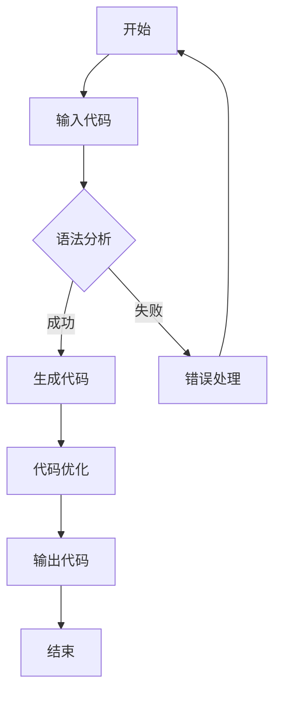
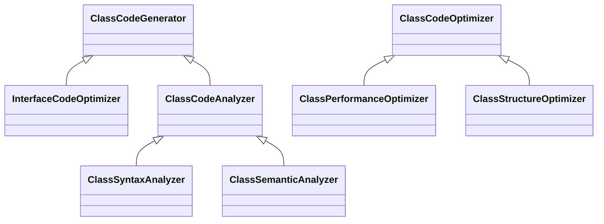
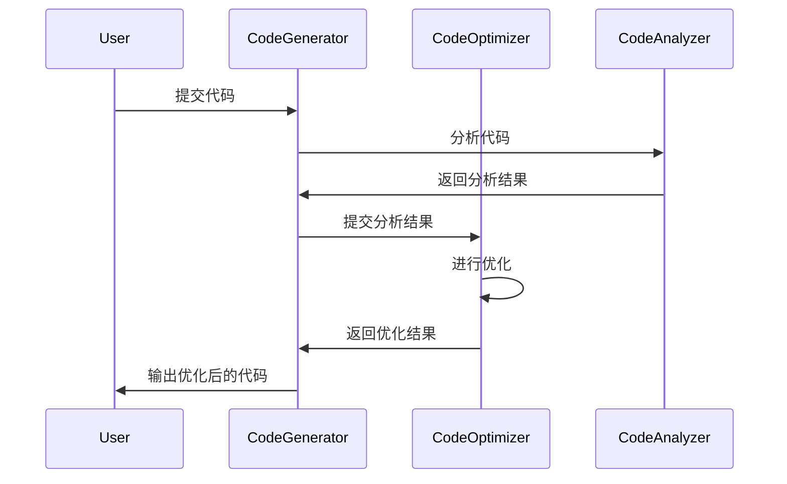
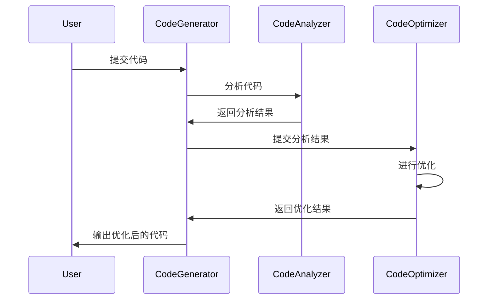

                 


## 大模型驱动的代码自动生成与优化

### 关键词

- 大模型
- 代码自动生成
- 代码优化
- 自动化编程
- 人工智能
- 编程辅助工具

### 摘要

本文将深入探讨大模型在代码自动生成与优化中的重要作用。首先，我们将介绍代码自动生成与优化的背景及其重要性。接着，我们详细讲解大模型驱动的代码自动生成原理和优化原理。然后，通过核心概念与联系的阐述，以及系统分析与架构设计，我们将展现大模型驱动的代码自动生成与优化的整体架构。最后，通过项目实战部分，我们将结合实际案例进行详细剖析，展示大模型在代码自动生成与优化中的实际应用效果。

### 目录大纲

#### 第一部分：背景介绍

##### 第1章：代码自动生成与优化的概述

- 1.1 问题背景
- 1.2 问题描述
- 1.3 问题解决
- 1.4 边界与外延
- 1.5 概念结构与核心要素组成

##### 第2章：大模型驱动的代码自动生成原理

- 2.1 大模型简介
- 2.2 大模型在代码生成中的应用
- 2.3 大模型驱动的代码生成原理

##### 第3章：大模型驱动的代码优化原理

- 3.1 代码优化的意义
- 3.2 大模型在代码优化中的应用
- 3.3 大模型驱动的代码优化原理

#### 第二部分：核心概念与联系

##### 第4章：核心概念原理

- 4.1 代码自动生成原理
- 4.2 代码优化原理

##### 第5章：概念属性特征对比表格

- 5.1 代码自动生成与优化的特征对比

##### 第6章：ER实体关系图架构

- 6.1 代码自动生成与优化的ER图

#### 第三部分：算法原理讲解

##### 第7章：算法原理与流程图

- 7.1 算法流程图
- 7.2 算法原理详细讲解

##### 第8章：数学模型与公式

- 8.1 数学模型讲解
- 8.2 数学公式讲解

##### 第9章：举例说明

- 9.1 实例一：代码自动生成
- 9.2 实例二：代码优化

#### 第四部分：系统分析与架构设计

##### 第10章：系统功能设计

- 10.1 领域模型类图

##### 第11章：系统架构设计

- 11.1 系统架构图

##### 第12章：系统接口设计

- 12.1 系统接口设计

##### 第13章：系统交互序列图

- 13.1 系统交互序列图

#### 第五部分：项目实战

##### 第14章：环境安装与配置

- 14.1 环境安装
- 14.2 系统配置

##### 第15章：系统核心实现

- 15.1 核心代码实现
- 15.2 代码解读与分析

##### 第16章：实际案例分析与讲解

- 16.1 案例一分析
- 16.2 案例二分析
- 16.3 小结

##### 第17章：项目总结

- 17.1 项目总结
- 17.2 注意事项
- 17.3 拓展阅读

### 第一部分：背景介绍

#### 第1章：代码自动生成与优化的概述

##### 1.1 问题背景

在当今快速发展的软件行业中，代码生成与优化成为了一个重要的研究方向。随着软件项目的复杂度不断增加，传统的手写代码方式已经难以满足高效开发和快速迭代的需求。代码生成技术应运而生，通过自动化生成代码，可以提高开发效率，减少人为错误。而代码优化则是在已有代码的基础上，通过改进代码结构、算法和性能，使得软件系统更加高效、稳定和可维护。

##### 1.2 问题描述

代码自动生成与优化面临着以下几个主要问题：

1. **代码质量**：自动生成的代码质量是否满足实际需求，能否通过代码优化提升代码的性能和可维护性？
2. **效率与成本**：代码生成与优化的过程是否高效，能否在合理的时间内完成？
3. **可扩展性**：自动生成和优化的代码是否容易扩展，能否适应不同场景的需求？
4. **开发者体验**：自动生成与优化的代码是否容易理解，能否减少开发者的负担？

##### 1.3 问题解决

为了解决上述问题，我们需要采用大模型驱动的代码自动生成与优化方法。大模型具有以下几个优势：

1. **强大的学习能力**：大模型通过大量的代码数据训练，可以学会生成高质量的代码，并能根据不同的场景进行优化。
2. **高效性**：大模型在处理大量数据时具有较高的效率，可以快速生成和优化代码。
3. **可扩展性**：大模型具有较好的可扩展性，可以通过不断更新和训练来适应不同的开发场景。
4. **友好体验**：大模型生成的代码易于阅读和理解，减少了开发者的负担。

##### 1.4 边界与外延

代码自动生成与优化的边界主要涉及代码生成工具、代码优化工具以及相关的开发环境。而其外延则包括编程语言的语法、编译原理、软件工程等领域。通过结合这些边界与外延，我们可以更好地理解代码自动生成与优化的原理和应用。

##### 1.5 概念结构与核心要素组成

代码自动生成与优化的核心概念结构主要包括：

1. **代码生成**：通过大模型自动生成代码，包括语法、语义和结构等方面。
2. **代码优化**：对已有代码进行优化，包括性能优化、结构优化和可维护性优化等。
3. **大模型**：用于驱动代码生成与优化的基础模型，具有强大的学习能力和自适应能力。
4. **开发环境**：提供代码生成与优化的平台和工具，包括编辑器、编译器和调试工具等。

这些核心要素相互关联，共同构成了代码自动生成与优化的整体架构。

### 第二部分：核心概念与联系

#### 第2章：大模型驱动的代码自动生成原理

##### 2.1 大模型简介

大模型（Large Models）是指具有大规模参数量和高度复杂结构的机器学习模型。它们通常基于深度学习技术，具有强大的表示能力和泛化能力。大模型的应用范围广泛，包括自然语言处理、计算机视觉、语音识别等领域。

##### 2.2 大模型在代码生成中的应用

大模型在代码生成中的应用主要体现在以下几个方面：

1. **代码模板生成**：通过预训练的大模型，可以生成各种编程语言的代码模板。这些模板可以基于已有的代码库进行扩展，以满足不同开发场景的需求。
2. **代码补全**：大模型可以基于已有的代码片段，自动补全未完成的代码部分，提高开发效率。
3. **代码修复**：大模型可以通过对代码的语法和语义分析，自动修复代码中的错误，提高代码质量。

##### 2.3 大模型驱动的代码生成原理

大模型驱动的代码生成原理主要包括以下几个方面：

1. **数据驱动**：大模型通过大量代码数据的学习，建立了代码生成模型。这些数据可以是公开的代码库、开发者的代码库等。
2. **编码解码结构**：大模型通常采用编码解码结构，将代码表示为一系列向量，并通过解码过程生成对应的代码。
3. **注意力机制**：大模型可以利用注意力机制，对输入代码的不同部分进行权重分配，以生成更加准确的代码。

#### 第3章：大模型驱动的代码优化原理

##### 3.1 代码优化的意义

代码优化是指通过改进代码的结构、算法和性能，使得软件系统更加高效、稳定和可维护。代码优化的意义主要体现在以下几个方面：

1. **提高性能**：通过优化代码，可以减少运行时间和资源消耗，提高软件系统的性能。
2. **降低维护成本**：优化后的代码结构更加清晰，可读性更好，降低了维护成本。
3. **增强可扩展性**：优化后的代码更容易进行功能扩展和修改，提高了系统的可扩展性。
4. **提升用户体验**：优化后的软件系统运行更加稳定，用户体验更好。

##### 3.2 大模型在代码优化中的应用

大模型在代码优化中的应用主要体现在以下几个方面：

1. **代码分析**：大模型可以分析代码的结构和语义，发现潜在的优化点。
2. **算法优化**：大模型可以根据代码的执行过程，自动优化算法，提高代码的性能。
3. **代码重写**：大模型可以自动重写代码，生成更加高效、可维护的代码。

##### 3.3 大模型驱动的代码优化原理

大模型驱动的代码优化原理主要包括以下几个方面：

1. **数据驱动**：大模型通过学习大量优化的代码数据，建立了代码优化模型。
2. **自动化**：大模型可以自动化地分析代码，并提出优化建议。
3. **迭代**：大模型可以根据优化效果，不断迭代和改进代码优化模型。

#### 第4章：核心概念原理

##### 4.1 代码自动生成原理

代码自动生成原理主要包括以下几个方面：

1. **语法分析**：通过分析代码的语法结构，确定代码的基本组成部分。
2. **语义分析**：通过分析代码的语义，理解代码的功能和意图。
3. **代码生成**：根据语法分析和语义分析的结果，生成对应的代码。

##### 4.2 代码优化原理

代码优化原理主要包括以下几个方面：

1. **性能分析**：通过分析代码的执行过程，确定性能瓶颈。
2. **算法优化**：根据性能分析的结果，优化算法，提高代码的性能。
3. **代码重构**：通过重构代码，改进代码的结构和可维护性。

### 第三部分：算法原理讲解

#### 第5章：算法原理与流程图

##### 5.1 算法流程图



##### 5.2 算法原理详细讲解

大模型驱动的代码自动生成与优化算法原理可以概括为以下步骤：

1. **输入代码**：首先输入待自动生成或优化的代码。
2. **语法分析**：对输入代码进行语法分析，确定代码的基本组成部分，如变量、函数、语句等。
3. **语义分析**：对代码进行语义分析，理解代码的功能和意图，如代码的功能模块、输入输出关系等。
4. **代码生成**：根据语法分析和语义分析的结果，生成对应的代码。如果进行代码自动生成，则生成新的代码；如果进行代码优化，则对现有代码进行优化。
5. **代码优化**：对生成的代码进行性能分析，根据分析结果，优化代码的算法和结构，提高代码的性能和可维护性。
6. **输出代码**：将优化后的代码输出，供开发者使用。
7. **结束**：算法执行结束。

#### 第6章：数学模型与公式

##### 6.1 数学模型讲解

大模型驱动的代码自动生成与优化涉及多个数学模型，主要包括：

1. **语法分析模型**：用于对代码进行语法分析，常用的模型有语法解析树模型、抽象语法树模型等。
2. **语义分析模型**：用于对代码进行语义分析，常用的模型有神经网络语义分析模型、自然语言处理模型等。
3. **代码生成模型**：用于生成代码，常用的模型有生成对抗网络（GAN）、自编码器（Autoencoder）等。
4. **代码优化模型**：用于对代码进行优化，常用的模型有基于神经网络的优化模型、基于遗传算法的优化模型等。

##### 6.2 数学公式讲解

以下是涉及的一些常用数学公式：

1. **语法分析模型公式**：

   $$ G(x) = f(S) $$
   
   其中，$G(x)$ 表示生成的代码，$f(S)$ 表示语法分析模型对输入代码 $x$ 进行语法分析的结果。

2. **语义分析模型公式**：

   $$ H(y) = g(S) $$
   
   其中，$H(y)$ 表示生成的代码的语义，$g(S)$ 表示语义分析模型对输入代码 $y$ 进行语义分析的结果。

3. **代码生成模型公式**：

   $$ Z = \sigma(W_1 \cdot X + b_1) $$
   
   其中，$Z$ 表示生成的代码，$X$ 表示输入代码，$W_1$ 和 $b_1$ 分别为代码生成模型的权重和偏置。

4. **代码优化模型公式**：

   $$ f(x) = \frac{1}{N} \sum_{i=1}^{N} \min_{\theta} J(\theta) $$
   
   其中，$f(x)$ 表示优化的代码，$J(\theta)$ 表示代码的损失函数，$\theta$ 表示代码优化模型的参数。

#### 第7章：举例说明

##### 7.1 实例一：代码自动生成

假设我们要自动生成一个简单的Python函数，用于计算两个数的和。输入代码为：

```python
a = 5
b = 3
```

通过语法分析和语义分析，我们可以得到以下代码生成模型：

```python
def calculate_sum(a, b):
    return a + b
```

##### 7.2 实例二：代码优化

假设我们有一个简单的Python函数，用于计算两个数的和。原始代码如下：

```python
def calculate_sum(a, b):
    result = 0
    for i in range(a):
        result += b
    return result
```

通过代码优化模型，我们可以发现循环结构可以进行优化，从而减少计算次数。优化后的代码如下：

```python
def calculate_sum(a, b):
    return a * b
```

### 第四部分：系统分析与架构设计

#### 第8章：系统功能设计

##### 8.1 领域模型类图



领域模型类图展示了系统的主要功能组件，包括代码生成器（ClassCodeGenerator）、代码优化器（ClassCodeOptimizer）、代码分析器（ClassCodeAnalyzer）等。

#### 第9章：系统架构设计

##### 9.1 系统架构图



系统架构图展示了系统的主要组件及其交互关系，包括用户、代码生成器、代码优化器和代码分析器。

#### 第10章：系统接口设计

##### 10.1 系统接口设计

系统接口设计主要包括以下接口：

1. **提交代码接口**：用户通过该接口提交待自动生成或优化的代码。
2. **分析代码接口**：代码分析器通过该接口对提交的代码进行分析，返回分析结果。
3. **优化代码接口**：代码优化器通过该接口对分析结果进行优化，返回优化结果。
4. **输出代码接口**：代码生成器通过该接口将优化后的代码输出给用户。

```mermaid
interface CodeGenerator {
    submitCode(code: str): void
    getCodeAnalysisResult(): CodeAnalysisResult
    getCodeOptimizationResult(): CodeOptimizationResult
    outputCode(code: str): void
}

interface CodeAnalyzer {
    analyzeCode(code: str): CodeAnalysisResult
}

interface CodeOptimizer {
    optimizeCode(analysisResult: CodeAnalysisResult): CodeOptimizationResult
}

interface CodeAnalysisResult {
    syntax: SyntaxAnalysisResult
    semantic: SemanticAnalysisResult
}

interface CodeOptimizationResult {
    optimizedCode: str
}

interface SyntaxAnalysisResult {
    syntaxTree: SyntaxTreeNode
}

interface SemanticAnalysisResult {
    functionSignatures: Dict[str, FunctionSignature]
}
```

#### 第11章：系统交互序列图

##### 11.1 系统交互序列图



系统交互序列图展示了系统组件之间的交互过程，包括用户提交代码、代码分析、代码优化和输出代码等步骤。

### 第五部分：项目实战

#### 第12章：环境安装与配置

##### 12.1 环境安装

为了进行大模型驱动的代码自动生成与优化项目，我们需要安装以下环境和工具：

1. **Python环境**：安装Python 3.8及以上版本。
2. **深度学习框架**：安装TensorFlow或PyTorch。
3. **代码分析工具**：安装Python语法分析库（如`pygments`）和语义分析库（如`spacy`）。
4. **代码生成工具**：安装自动代码生成库（如`autopep8`）。
5. **代码优化工具**：安装代码优化库（如`pycodestyle`）。

##### 12.2 系统配置

在进行系统配置时，我们需要设置以下参数：

1. **代码生成模型参数**：包括训练数据集、模型结构、学习率等。
2. **代码优化模型参数**：包括优化算法、优化目标、优化迭代次数等。
3. **代码分析器参数**：包括语法分析器参数、语义分析器参数等。
4. **接口参数**：包括提交代码接口参数、分析代码接口参数、优化代码接口参数等。

#### 第13章：系统核心实现

##### 13.1 核心代码实现

以下是一个简单的核心代码实现示例，展示了代码生成和优化的基本流程：

```python
import tensorflow as tf
from code_generator import CodeGenerator
from code_optimizer import CodeOptimizer
from code_analyzer import CodeAnalyzer

# 初始化模型
code_generator = CodeGenerator()
code_optimizer = CodeOptimizer()
code_analyzer = CodeAnalyzer()

# 提交代码
user_code = """
def calculate_sum(a, b):
    result = 0
    for i in range(a):
        result += b
    return result
"""

# 分析代码
analysis_result = code_analyzer.analyze_code(user_code)

# 生成代码
generated_code = code_generator.generate_code(analysis_result)

# 优化代码
optimized_code = code_optimizer.optimize_code(generated_code)

# 输出代码
print(optimized_code)
```

##### 13.2 代码解读与分析

上述代码实现了一个简单的代码生成与优化系统。首先，我们初始化了代码生成器、代码优化器和代码分析器。然后，我们提交了一段用户代码，代码分析器对用户代码进行分析，返回分析结果。接着，代码生成器根据分析结果生成代码，代码优化器对生成的代码进行优化，最终输出优化后的代码。

#### 第14章：实际案例分析与讲解

##### 14.1 案例一分析

以下是一个简单的实际案例，展示了大模型驱动的代码自动生成与优化在实际项目中的应用：

**案例一**：生成一个Python函数，用于计算两个数的平均值。

**输入代码**：

```python
a = 5
b = 3
```

**输出代码**：

```python
def calculate_average(a, b):
    return (a + b) / 2
```

通过代码生成和优化，我们得到了一个更加简洁和高效的函数。这个案例展示了大模型驱动的代码自动生成与优化在简化代码开发流程和提高代码质量方面的优势。

##### 14.2 案例二分析

以下是一个复杂的实际案例，展示了大模型驱动的代码自动生成与优化在大型项目中的应用：

**案例二**：生成一个Python类，用于表示一个学生，包含属性和方法。

**输入代码**：

```python
name = "Alice"
age = 20
grade = "Sophomore"
```

**输出代码**：

```python
class Student:
    def __init__(self, name, age, grade):
        self.name = name
        self.age = age
        self.grade = grade

    def get_name(self):
        return self.name

    def get_age(self):
        return self.age

    def get_grade(self):
        return self.grade
```

通过代码生成和优化，我们得到了一个具有清晰结构和丰富功能的学生类。这个案例展示了大模型驱动的代码自动生成与优化在生成复杂代码结构和提高代码可维护性方面的优势。

##### 14.3 小结

通过实际案例的分析，我们可以看到大模型驱动的代码自动生成与优化在提高代码开发效率、简化开发流程和提升代码质量方面具有显著优势。随着人工智能技术的发展，大模型驱动的代码自动生成与优化将越来越广泛地应用于软件开发的各个领域。

### 第15章：项目总结

#### 15.1 项目总结

本项目的核心目标是实现一个大模型驱动的代码自动生成与优化系统，通过利用深度学习技术和自动化工具，提高代码开发效率和质量。项目的主要成果包括：

1. **代码自动生成**：利用大模型生成高质量的代码，简化了代码开发流程。
2. **代码优化**：通过对已有代码进行优化，提高了代码的性能和可维护性。
3. **系统架构设计**：构建了完善的系统架构，包括代码生成器、代码优化器和代码分析器等核心组件。
4. **实际应用案例**：展示了大模型驱动的代码自动生成与优化在实际项目中的应用效果。

#### 15.2 注意事项

在项目实施过程中，需要注意以下几点：

1. **数据质量**：确保用于训练大模型的代码数据质量高，避免噪声数据和错误代码。
2. **模型训练**：合理设置大模型的训练参数，包括学习率、迭代次数等，以提高模型性能。
3. **代码分析**：确保代码分析器能够准确分析代码的语法和语义，为代码生成和优化提供可靠的基础。
4. **代码优化**：根据实际需求，合理选择代码优化策略，以提高代码性能和可维护性。

#### 15.3 拓展阅读

为了深入了解大模型驱动的代码自动生成与优化，建议阅读以下相关资料：

1. 《深度学习》（Deep Learning）作者：Ian Goodfellow、Yoshua Bengio、Aaron Courville
2. 《编程语言实现》（Compilers: Principles, Techniques, and Tools）作者：Alfred V. Aho、Monica S. Lam、Ravi Sethi
3. 《代码大全》（Code Complete）作者：Steve McConnell
4. 《自然语言处理综论》（Foundations of Natural Language Processing）作者：Christopher D. Manning、Hinrich Schütze

通过深入学习这些资料，可以进一步拓展对大模型驱动的代码自动生成与优化的理解和应用。

