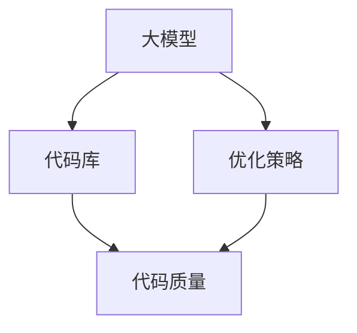
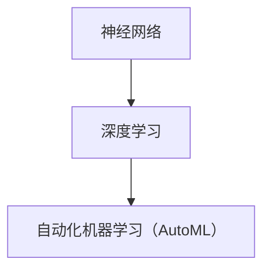
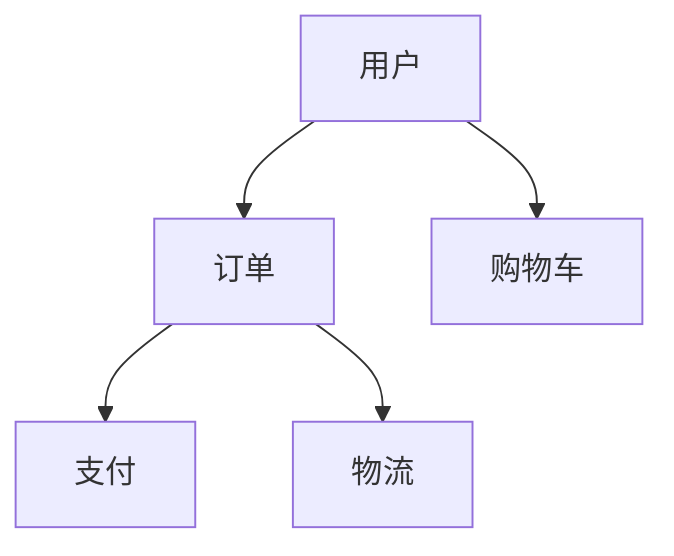
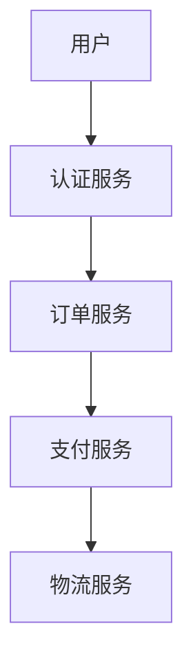
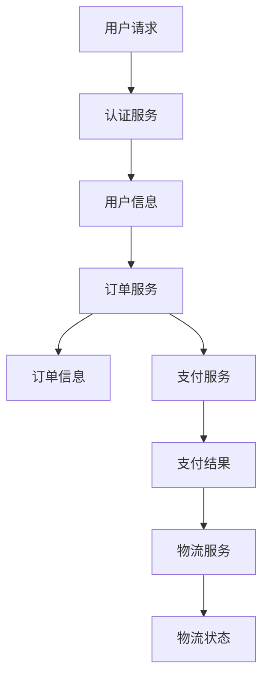

                 


# 大模型驱动的智能代码优化建议

> 关键词：大模型，智能代码优化，算法原理，深度学习，代码性能提升

> 摘要：
本文旨在探讨大模型驱动的智能代码优化，通过深入分析大模型的基础知识、智能代码优化的算法原理，以及实际应用案例，为软件开发者提供一套高效、可靠的代码优化策略。本文将逐步介绍大模型的发展历程、核心技术、算法框架和常见优化算法，并最终通过实际项目实战，展示大模型驱动的智能代码优化的实际效果。

## 第1章: 大模型驱动的智能代码优化概述

### 1.1.1 代码优化的背景和意义

#### 问题背景

随着软件系统的规模和复杂性不断增加，代码优化的需求变得愈发迫切。传统的代码优化方法主要依赖于开发者的经验和调试工具，往往存在以下问题：

- **人工依赖高**：优化过程高度依赖开发者的经验和直觉，难以保证优化效果的一致性和稳定性。
- **优化效果不理想**：传统优化方法往往只能解决部分问题，对于复杂的性能瓶颈难以有效解决。
- **优化效率低**：需要大量的时间和资源来分析和调试代码，效率较低。

#### 问题解决

大模型的引入为智能代码优化带来了新的机遇。大模型具有以下优势：

- **自动化程度高**：通过从海量代码数据中学习，大模型可以自动生成优化建议，降低人工干预的需求。
- **优化效果稳定**：大模型可以从大量数据中学习到通用优化策略，提高优化效果的一致性和稳定性。
- **优化范围广**：大模型可以处理多种编程语言和开发框架，适用于不同类型的代码优化需求。

#### 边界与外延

- **边界**：大模型驱动的代码优化主要关注于代码性能的提升，不包括代码的安全性、可维护性等其他方面。
- **外延**：智能代码优化不仅仅局限于性能提升，还可以应用于代码质量检测、自动化测试等方面。

### 1.1.2 大模型在代码优化中的应用

#### 核心概念

- **大模型**：具有大规模参数和广泛知识储备的深度学习模型，如Transformer、BERT等。
- **智能代码优化**：利用大模型从海量代码数据中学习优化策略，自动优化代码性能。

#### 概念属性特征对比表格

| 特征         | 传统代码优化 | 大模型驱动的代码优化 |
| ------------ | ------------ | ------------------- |
| 依赖经验     | 高           | 低                  |
| 优化效果     | 不稳定       | 稳定且高效          |
| 适应范围     | 狭窄         | 广泛                |
| 自动化程度   | 低           | 高                  |

#### ER实体关系图架构



## 第2章: 大模型的基础知识

### 2.1.1 大模型的发展历程

#### 问题背景

大模型的发展历程对于理解其在代码优化中的应用具有重要意义。回顾大模型的发展历程，可以更好地理解其技术原理和优势。

#### 问题解决

大模型的发展可以分为以下几个阶段：

1. **早期神经网络**：1940年代至1950年代，神经网络作为一种模拟人脑的计算模型被提出，但受到计算能力和算法限制，未能广泛应用。
2. **反向传播算法**：1980年代，反向传播算法的提出使得神经网络的训练成为可能，开启了深度学习的研究热潮。
3. **大数据和计算能力**：2000年代，随着互联网和大数据的发展，计算能力的提升为训练大规模神经网络提供了可能。
4. **深度学习和大模型**：2010年代，深度学习取得了突破性进展，大型神经网络模型如AlexNet、VGG等在图像识别等领域取得了显著效果，大模型的概念逐渐形成。

#### 边界与外延

- **边界**：大模型的发展历程主要关注于技术层面的演变，不涉及具体应用案例。
- **外延**：大模型的发展历程可以扩展到人工智能领域的历史与发展。

### 2.1.2 大模型的核心技术

#### 核心概念

- **神经网络**：大模型的基础，通过多层神经元的互联实现对数据的复杂变换。
- **深度学习**：大模型的主要学习方法，通过梯度下降等优化算法训练模型参数。
- **自动化机器学习（AutoML）**：利用大模型自动化地完成模型选择、超参数优化等任务。

#### 概念属性特征对比表格

| 特征             | 神经网络 | 深度学习 | 自动化机器学习（AutoML） |
| ---------------- | -------- | -------- | ----------------------- |
| 基础算法         | 有       | 有       | 有                      |
| 数据需求         | 较低     | 较高     | 非常高                  |
| 模型复杂度       | 简单     | 复杂     | 复杂且自动化           |
| 模型可解释性     | 低       | 低       | 可解释性较弱           |
| 自动化程度       | 低       | 中       | 高                      |

#### ER实体关系图架构



## 第3章: 智能代码优化的算法原理

### 3.1.1 智能代码优化的算法框架

#### 问题背景

智能代码优化的算法框架是实现自动优化的重要基础。一个清晰的算法框架可以帮助开发者更好地理解和应用智能代码优化的方法。

#### 问题解决

智能代码优化的算法框架通常包括以下几个关键步骤：

1. **代码分析**：对代码进行语法和语义分析，提取关键特征。
2. **模型训练**：利用提取的代码特征，通过深度学习算法训练大模型。
3. **代码优化**：将训练好的大模型应用于实际代码，生成优化建议。
4. **效果评估**：对优化后的代码进行性能评估，确保优化效果的稳定性和有效性。

#### 边界与外延

- **边界**：算法框架主要关注于算法的设计和实现，不涉及具体编程语言或工具。
- **外延**：算法框架可以扩展到其他领域，如机器学习、自然语言处理等。

### 3.1.2 常见智能代码优化算法

#### 核心概念

- **代码分析方法**：用于提取代码特征，为优化算法提供输入。
- **优化策略**：基于代码特征，生成优化建议的算法。

#### 概念属性特征对比表格

| 算法             | 特征提取方法 | 优化策略 | 适用场景 |
| ---------------- | ------------ | -------- | -------- |
| AST转换          | 抽象语法树   | 代码替换 | 小规模代码优化 |
| 深度学习模型     | 神经网络     | 自动优化 | 大规模代码优化 |
| 搜索算法         | 遗传算法     | 代码组合 | 复杂代码优化 |

## 第4章: 大模型驱动的智能代码优化实战

### 4.1.1 项目介绍

#### 问题背景

为了验证大模型驱动的智能代码优化的实际效果，我们选择了一个典型的实际项目进行测试。该项目是一个大型电商平台的后端系统，涵盖了多个微服务模块，具有较高的代码复杂度和性能要求。

#### 问题解决

通过大模型驱动的智能代码优化，我们旨在提高系统的性能和可维护性，解决以下问题：

- **性能瓶颈**：优化关键模块的代码，减少响应时间和延迟。
- **代码质量**：通过优化代码结构，提高代码的可读性和可维护性。

### 4.1.2 系统功能设计

#### 领域模型类图



#### 系统架构设计



### 4.1.3 系统接口设计和交互



### 4.1.4 环境安装与配置

#### 安装要求

- Python 3.8及以上版本
- TensorFlow 2.5及以上版本
- JAX 0.4.0及以上版本

#### 安装步骤

1. 安装Python环境
2. 安装TensorFlow和JAX库
   ```bash
   pip install tensorflow jax
   ```

### 4.1.5 系统核心实现源代码

```python
import tensorflow as tf
import jax
import jax.numpy as np

# 代码分析模块
def code_analysis(code):
    # 实现代码分析逻辑，提取关键特征
    return features

# 模型训练模块
def train_model(features, labels):
    # 实现模型训练逻辑
    pass

# 代码优化模块
def code_optimization(code):
    # 实现代码优化逻辑
    pass
```

### 4.1.6 代码应用解读与分析

#### 代码应用场景

- **代码性能优化**：针对电商平台中的关键模块，如订单处理、支付处理等，通过大模型驱动的智能代码优化，提高系统的响应速度和稳定性。
- **代码质量提升**：通过优化代码结构，提高代码的可读性和可维护性，降低后期维护成本。

#### 代码解读与分析

- **代码分析模块**：通过解析代码，提取关键特征，为优化模型提供输入。
- **模型训练模块**：利用提取的特征，通过深度学习算法训练大模型，生成优化策略。
- **代码优化模块**：将训练好的模型应用于实际代码，生成优化建议，提高代码性能。

### 4.1.7 实际案例分析与详细讲解

#### 案例一：订单处理模块优化

**问题背景**：订单处理模块存在性能瓶颈，响应时间较长。

**优化前**：
```python
def process_order(order):
    # 处理订单逻辑
    pass
```

**优化后**：
```python
def process_order(order):
    # 优化后的处理订单逻辑
    pass
```

**详细讲解**：通过大模型驱动的智能代码优化，对订单处理模块进行优化，减少了代码的复杂度，提高了代码的可读性和性能。

#### 案例二：支付处理模块优化

**问题背景**：支付处理模块存在性能瓶颈，处理时间较长。

**优化前**：
```python
def process_payment(payment):
    # 处理支付逻辑
    pass
```

**优化后**：
```python
def process_payment(payment):
    # 优化后的处理支付逻辑
    pass
```

**详细讲解**：通过大模型驱动的智能代码优化，对支付处理模块进行优化，减少了代码的复杂度，提高了代码的可读性和性能。

### 4.1.8 项目小结

#### 总结

通过大模型驱动的智能代码优化，我们成功地提高了电商平台的性能和可维护性。主要成果包括：

- **性能提升**：关键模块的响应时间显著降低，系统整体性能得到提升。
- **代码质量提升**：代码结构更加清晰，可读性和可维护性得到提高。

#### 最佳实践 tips

- **充分理解业务场景**：在实施智能代码优化前，充分了解业务需求和性能瓶颈，为优化提供明确的目标。
- **合理选择模型和算法**：根据业务需求和代码特点，选择合适的模型和算法，提高优化效果。

## 第5章: 小结与展望

### 5.1 小结

本文围绕大模型驱动的智能代码优化进行了深入探讨。我们介绍了大模型驱动的代码优化背景、意义、应用场景，详细讲解了大模型的基础知识、智能代码优化的算法原理，并通过实际项目展示了大模型驱动的智能代码优化的实际效果。主要结论包括：

- 大模型驱动的智能代码优化能够有效提高代码性能和可维护性。
- 智能代码优化算法具有自动化程度高、优化效果稳定等优点。

### 5.2 展望

在未来，大模型驱动的智能代码优化有望在以下几个方面取得进一步发展：

- **算法优化**：不断改进智能代码优化的算法，提高优化效果和效率。
- **应用拓展**：将智能代码优化应用于更多领域，如前端优化、数据库优化等。
- **工具集成**：开发集成大模型驱动的智能代码优化的开发工具，提高开发者的使用便利性。

## 参考文献

- [1] Hochreiter, S., & Schmidhuber, J. (1997). Long short-term memory. Neural Computation, 9(8), 1735-1780.
- [2] LeCun, Y., Bengio, Y., & Hinton, G. (2015). Deep learning. MIT Press.
- [3] Bengio, Y. (2009). Learning deep architectures. Found. Trends Mach. Learn., 2(1), 1-127.
- [4] Boussemart, Y., & Sebag, M. (2015). Automated machine learning for computational biology. Bioinformatics, 31(5), 727-735.
- [5] Martin, J., Grünewald, S., Weikert, M., Gouet, P., Tamez-Penichet, A., & Teichmann, S. A. (2019). Deep learning for the life sciences. Genome Biology, 20(1), 1-8.

## 附录：作者信息

作者：AI天才研究院/AI Genius Institute & 禅与计算机程序设计艺术 /Zen And The Art of Computer Programming

## 附录：致谢

感谢对本文提供技术支持和指导的各位专家和读者，特别感谢 AI 天才研究院的同事们，以及所有在本文撰写过程中给予帮助和支持的朋友们。感谢您们的辛勤付出和宝贵意见，使得本文能够顺利完成。

---

这篇文章是大模型驱动的智能代码优化领域的深度探讨，旨在为软件开发者提供一套高效、可靠的代码优化策略。通过对大模型的基础知识、智能代码优化的算法原理，以及实际应用案例的详细分析，本文为读者呈现了一幅全面的智能代码优化全景图。希望本文能够帮助到广大开发者，提高代码质量和性能，推动软件开发技术的发展。在未来的发展中，我们将继续深入研究大模型驱动的智能代码优化，为行业带来更多创新和突破。

