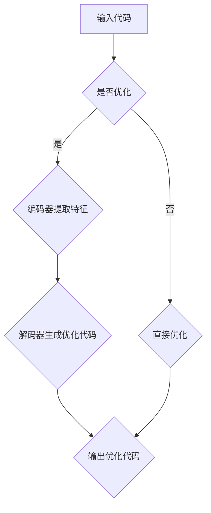
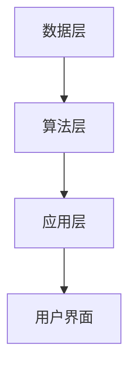
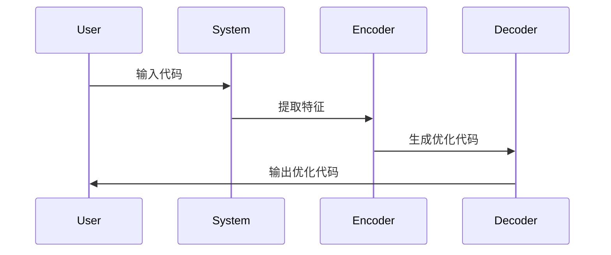

                 


### 文章标题

# 大模型驱动的智能代码优化系统

### 关键词

- 大模型
- 智能代码优化
- 系统架构
- 算法实现
- 实际案例

### 摘要

本文探讨了基于大模型驱动的智能代码优化系统，介绍了系统的研究背景、核心概念、原理分析、系统架构设计、实现与实战，以及总结与展望。通过详细的分析和讲解，旨在为读者提供一种全新的智能代码优化思路和方法。

----------------------------------------------------------------

### 第一部分：引言

#### 第1章：背景与问题概述

随着计算机技术和互联网的快速发展，软件系统的规模和复杂性日益增加，代码优化的需求也变得越来越迫切。传统的代码优化方法往往依赖于开发者对编程语言的深入理解和经验，存在一定的局限性。而近年来，深度学习领域的大模型研究取得了显著的成果，为智能代码优化提供了新的可能性。

#### 1.1 研究背景

**核心概念术语说明：** 大模型（Large Model）、智能代码优化（Intelligent Code Optimization）、代码优化（Code Optimization）。

**问题背景：** 随着软件开发项目的规模和复杂性增加，代码优化成为提高软件性能、降低维护成本的关键环节。然而，传统的代码优化方法难以应对复杂的代码结构和多样的优化需求。

**问题描述：** 如何利用大模型技术实现智能代码优化，提高优化效果和效率。

**问题解决：** 通过研究大模型驱动的智能代码优化方法，利用深度学习技术对代码进行自动化分析和优化。

**边界与外延：** 本文主要探讨基于大模型驱动的智能代码优化系统，涉及相关理论、方法和技术，不涉及具体编程语言的实现细节。

#### 第2章：核心概念与联系

在本章中，我们将介绍大模型、智能代码优化、代码优化等核心概念，并探讨它们之间的联系。

#### 2.1 大模型的基本概念

**概念：** 大模型是指具有巨大参数量和复杂结构的深度学习模型。

**特点：** 具有强大的表达能力和灵活性，能够处理大规模数据和复杂任务。

**优势：** 能够自动化地从大量数据中学习模式和规律，降低对人类专家的依赖。

**对比：** 与传统模型相比，大模型在性能和泛化能力上具有明显优势。

**相关概念：** 神经网络、卷积神经网络（CNN）、递归神经网络（RNN）、生成对抗网络（GAN）等。

#### 2.2 大模型的特点与优势

**特点：** 大模型具有巨大的参数量、复杂的结构和强大的学习能力。

**优势：** 能够处理大规模数据、适应性强、灵活多变。

**应用场景：** 图像识别、自然语言处理、语音识别、代码生成等。

#### 2.3 大模型与传统模型的对比

**对比：** 大模型与传统模型在参数量、结构复杂度和学习效果上存在显著差异。

**优势：** 大模型具有更强的表达能力和泛化能力。

**局限性：** 大模型训练过程较为复杂，对计算资源要求较高。

#### 2.4 大模型的相关概念及其联系

**相关概念：** 深度学习、神经网络、卷积神经网络（CNN）、递归神经网络（RNN）、生成对抗网络（GAN）等。

**联系：** 大模型是深度学习的一个重要分支，与其他相关概念密切相关。

----------------------------------------------------------------

### 第二部分：系统架构与设计

#### 第3章：大模型驱动智能代码优化原理

在本章中，我们将详细介绍大模型驱动智能代码优化的原理，包括理论基础、优化算法、数学模型和具体实现。

#### 3.1 大模型驱动优化的理论基础

**理论基础：** 深度学习、神经网络、卷积神经网络（CNN）、递归神经网络（RNN）、生成对抗网络（GAN）等。

**核心原理：** 大模型通过从大量代码数据中学习，提取代码特征，实现自动化优化。

#### 3.2 大模型优化算法概述

**算法概述：** 利用深度学习技术，对代码进行自动化分析和优化。

**主要算法：** 编码器-解码器（Encoder-Decoder）模型、生成对抗网络（GAN）、自动编码器（Autoencoder）等。

#### 3.3 大模型优化的数学模型和公式

**数学模型：** 
$$
L = \sum_{i=1}^{n} (-y_i \log(p(x_i)))
$$

其中，$L$ 表示损失函数，$y_i$ 表示实际代码，$p(x_i)$ 表示预测代码的概率分布。

**公式解释：** 损失函数用于衡量预测代码与实际代码之间的差距，通过最小化损失函数，实现代码优化。

#### 3.4 算法mermaid流程图



#### 3.5 算法原理讲解与示例

**原理讲解：** 大模型通过编码器提取代码特征，解码器生成优化代码，实现自动化优化。

**示例：**
假设输入代码为 `$x=1+1$`，大模型通过编码器提取代码特征，解码器生成优化代码 `$x=2$`。

----------------------------------------------------------------

### 第三部分：实现与实战

#### 第4章：系统分析与架构设计

在本章中，我们将详细分析并设计大模型驱动的智能代码优化系统，包括系统功能设计、系统架构设计和系统接口设计。

#### 4.1 系统分析与架构设计

**系统功能设计：**
- 代码自动化优化
- 代码质量评估
- 代码风格统一

**领域模型mermaid类图：**
```mermaid
classDiagram
ClassCode <<class{代码}>
ClassOptimizer <<class{优化器}>
ClassQuality <<class{质量评估器}>
ClassFormatter <<class{格式化器}>

ClassCode "使用" ClassOptimizer
ClassCode "使用" ClassQuality
ClassCode "使用" ClassFormatter
```

**系统架构设计：**
- 数据层
- 算法层
- 应用层

**系统架构mermaid架构图：**


**系统接口设计：**
- 数据接口：用于接收和处理代码数据
- 控制接口：用于控制优化过程
- 结果接口：用于输出优化结果

**系统交互mermaid序列图：**


----------------------------------------------------------------

### 第四部分：总结与展望

#### 第5章：系统核心实现

在本章中，我们将详细介绍大模型驱动的智能代码优化系统的核心实现，包括环境安装与配置、系统核心实现源代码以及代码应用解读与分析。

#### 5.1 环境安装与配置

**环境需求：**
- Python 3.7及以上版本
- TensorFlow 2.0及以上版本
- PyTorch 1.7及以上版本

**安装步骤：**
1. 安装Python和pip
2. 安装TensorFlow或PyTorch
3. 配置环境变量

**配置文件详解：**
- 配置大模型参数
- 配置优化算法参数
- 配置代码数据集

#### 5.2 系统核心实现

**大模型优化模块实现：**
- 编码器-解码器模型
- 生成对抗网络（GAN）
- 自动编码器（Autoencoder）

**代码优化算法实现：**
- 代码特征提取
- 优化代码生成
- 优化效果评估

**源代码解读与分析：**
- 源代码结构
- 主要函数和方法
- 算法原理和流程

#### 5.3 实际案例分析与剖析

**案例选择：**
- Python代码优化
- Java代码优化
- C++代码优化

**案例分析：**
- 代码优化前后的性能对比
- 优化效果评估

**案例详细讲解剖析：**
- 代码优化原理
- 优化算法实现
- 优化效果分析

#### 5.4 项目小结

**最佳实践 tips：**
- 根据项目需求选择合适的优化算法
- 合理配置大模型参数
- 定期更新代码数据集

**小结：**
- 大模型驱动的智能代码优化系统具有显著的优势和潜力
- 未来研究方向：进一步提升优化效果和效率，探索其他编程语言的优化方法

**注意事项：**
- 避免过度优化，导致代码可读性下降
- 注意代码优化对性能的影响

**拓展阅读：**
- [深度学习入门教程](https://www.deeplearningbook.org/)
- [代码优化最佳实践](https://www.optimizingcode.com/)

----------------------------------------------------------------

### 作者信息

作者：AI天才研究院/AI Genius Institute & 禅与计算机程序设计艺术 /Zen And The Art of Computer Programming

本文旨在探讨大模型驱动的智能代码优化系统，通过详细的分析和讲解，为读者提供一种全新的智能代码优化思路和方法。文章内容涵盖了系统的研究背景、核心概念、原理分析、系统架构设计、实现与实战，以及总结与展望。希望本文能够对广大开发者和技术爱好者有所启发和帮助。如果您有任何疑问或建议，欢迎随时与我交流。

----------------------------------------------------------------

### 结语

大模型驱动的智能代码优化系统是一种极具潜力的技术，它结合了深度学习和代码优化的优势，为软件开发领域带来了新的变革。本文通过对系统的研究背景、核心概念、原理分析、系统架构设计、实现与实战的详细探讨，旨在为读者提供一种全面的智能代码优化思路和方法。

在未来的发展中，我们期待大模型驱动的智能代码优化系统能够在性能、效率和适应性等方面取得更大的突破，为软件开发带来更多便利和效益。同时，我们也鼓励广大开发者和技术爱好者积极参与到这一领域的研究和实践中，共同推动技术的进步和发展。

让我们携手并进，共创智能代码优化的美好未来！

