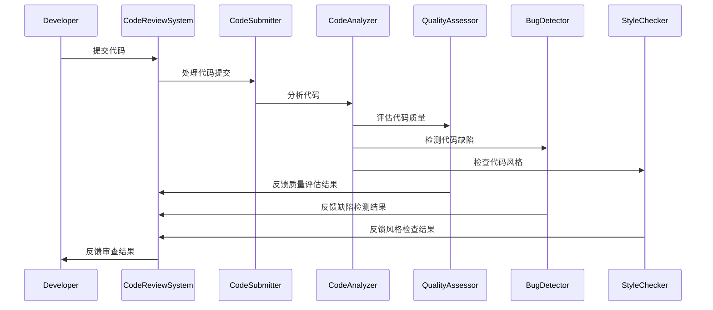

                 


## 大模型驱动的智能代码审查系统

### 关键词
- 智能代码审查
- 大模型
- 代码质量
- 自动化
- 代码缺陷检测

### 摘要
本文将探讨大模型技术在智能代码审查系统中的应用，分析其如何提升代码审查的效率和准确性。我们将一步步深入讨论大模型的核心概念、算法原理、系统架构及项目实战，以期为读者提供全面的了解和实用的指导。

---

### 目录大纲设计思路

**设计《大模型驱动的智能代码审查系统》一书的目录大纲，需要遵循以下步骤，确保大纲既完整又逻辑清晰：**

1. **背景介绍**：
   - 在第一部分，首先介绍智能代码审查的背景，包括代码审查的意义、现状以及存在的问题。
   - 简要阐述大模型技术的基本概念和其在智能代码审查中的应用潜力。

2. **核心概念与联系**：
   - 详细解析大模型的核心概念，如神经网络、深度学习、自然语言处理等。
   - 利用表格和ER实体关系图，对比不同大模型的特点和应用领域。
   - 绘制ER实体关系图，展示智能代码审查系统中的主要实体及其关系。

3. **算法原理讲解**：
   - 选择几种常见的大模型算法，如GPT、BERT，详细讲解其原理。
   - 使用Mermaid流程图展示算法流程。
   - 使用Python代码示例说明算法的实现和应用。

4. **数学模型和数学公式**：
   - 在讲解算法原理时，嵌入相关的数学模型和公式，使用LaTeX格式表示。
   - 对重要的公式进行详细解释，确保读者理解其含义和应用。

5. **系统分析与架构设计**：
   - 介绍智能代码审查系统的整体架构，包括前端、后端和数据存储等。
   - 使用Mermaid类图和架构图，展示系统的结构。
   - 描述系统接口设计和系统交互流程。

6. **项目实战**：
   - 详细介绍搭建智能代码审查系统的环境配置和步骤。
   - 提供核心实现代码，并对关键代码段进行解读和分析。
   - 通过实际案例，展示系统的应用效果，并进行详细剖析。

7. **最佳实践与小结**：
   - 总结项目实战中的关键经验和技巧。
   - 提供注意事项，帮助读者避免常见问题。
   - 推荐拓展阅读，引导读者进一步学习。

### 完整的目录大纲

```markdown
# 《大模型驱动的智能代码审查系统》目录大纲

## 第一部分：背景介绍

### 第1章：智能代码审查概述

#### 1.1 代码审查的意义

- 代码审查的定义
- 代码审查的重要性

#### 1.2 代码审查的现状

- 传统的代码审查方法
- 智能代码审查的兴起

#### 1.3 智能代码审查存在的问题

- 现有解决方案的不足
- 大模型技术带来的新机遇

### 第2章：大模型技术基础

#### 2.1 大模型基本概念

- 神经网络
- 深度学习
- 自然语言处理

#### 2.2 大模型的特点与应用

- 大模型的优势
- 大模型在代码审查中的应用领域

#### 2.3 大模型的发展历程

- 神经网络的发展
- 深度学习的兴起
- 大模型的最新进展

## 第二部分：核心概念与联系

### 第3章：智能代码审查系统中的大模型

#### 3.1 GPT模型

- GPT模型的基本原理
- GPT模型在代码审查中的应用

#### 3.2 BERT模型

- BERT模型的基本原理
- BERT模型在代码审查中的应用

#### 3.3 其他大模型介绍

- 多模态大模型
- 自监督学习大模型

### 第4章：概念属性特征对比

#### 4.1 GPT、BERT等大模型的属性特征对比

- 性能对比
- 应用场景对比
- 实现复杂度对比

### 第5章：智能代码审查系统中的实体关系

#### 5.1 实体关系图

- 主要实体
- 实体关系

## 第三部分：算法原理讲解

### 第6章：GPT模型原理与实现

#### 6.1 GPT模型原理

- 自动编码器
- 自注意力机制
- Transformer架构

#### 6.2 GPT模型实现

- 数据预处理
- 模型训练
- 模型评估

### 第7章：BERT模型原理与实现

#### 7.1 BERT模型原理

- 预训练技术
- 微调技术
- 任务特定层提取

#### 7.2 BERT模型实现

- 数据预处理
- 模型训练
- 模型评估

### 第8章：其他大模型算法讲解

#### 8.1 多模态大模型

- 多模态数据处理
- 多模态特征融合

#### 8.2 自监督学习大模型

- 自监督学习原理
- 自监督学习在大模型中的应用

## 第四部分：系统分析与架构设计

### 第9章：智能代码审查系统架构设计

#### 9.1 问题场景介绍

- 代码审查的具体需求

#### 9.2 系统功能设计

- 功能模块划分
- 功能实现

#### 9.3 系统架构设计

- 系统架构图
- 系统架构说明

#### 9.4 系统接口设计

- 接口规范
- 接口实现

### 第10章：系统交互流程

#### 10.1 系统交互流程

- 代码提交流程
- 审查流程
- 结果反馈流程

#### 10.2 Mermaid序列图

- 交互流程展示

## 第五部分：项目实战

### 第11章：搭建智能代码审查系统

#### 11.1 环境配置

- 系统要求
- 环境搭建步骤

#### 11.2 核心实现

- 数据处理模块
- 模型训练与评估模块
- 代码审查模块

#### 11.3 代码示例

- Python源代码展示
- 关键代码段解读

#### 11.4 实际案例

- 实际代码审查案例
- 案例剖析

### 第12章：项目小结

#### 12.1 经验总结

- 项目关键经验
- 技术难点与解决方案

#### 12.2 注意事项

- 系统部署注意事项
- 维护与更新策略

#### 12.3 拓展阅读

- 相关研究文献
- 深入学习资源

## 结语

### 未来展望

- 智能代码审查技术的发展趋势
- 大模型在代码审查中的潜在应用

### 参考文献

- 引用的书籍和论文

作者：AI天才研究院/AI Genius Institute & 禅与计算机程序设计艺术 /Zen And The Art of Computer Programming
```

---

### 文章正文

**第一部分：背景介绍**

#### 第1章：智能代码审查概述

##### 1.1 代码审查的意义

代码审查是一种重要的软件开发实践，旨在评估代码的质量、安全性和一致性。它不仅有助于发现潜在的漏洞和缺陷，还能提升开发团队的协作效率和代码的可维护性。以下是代码审查的主要意义：

1. **质量保障**：代码审查能够确保代码的正确性和稳定性，减少软件发布后的bug数量。
2. **安全性**：审查有助于识别潜在的漏洞和安全威胁，降低系统被攻击的风险。
3. **规范性**：代码审查有助于统一开发规范，提高代码的可读性和一致性。
4. **知识传承**：通过代码审查，新成员可以学习资深开发者的经验和技巧。

##### 1.2 代码审查的现状

当前，代码审查主要分为以下几种方法：

1. **人工审查**：开发人员手动审查代码，这种方法虽然灵活但效率低，容易漏检。
2. **自动化工具**：使用静态代码分析工具（如SonarQube、Checkstyle）进行代码质量检查，这种方法速度快，但只能发现部分问题，对复杂逻辑的审查效果有限。
3. **混合方法**：结合人工审查和自动化工具，以提高审查的效率和准确性。

智能代码审查的出现，为代码审查带来了新的机遇和挑战。

##### 1.3 智能代码审查存在的问题

现有代码审查方法存在以下问题：

1. **效率低**：人工审查耗时耗力，自动化工具则可能无法处理复杂逻辑。
2. **准确性差**：自动化工具容易误报和漏报，需要人工进一步处理。
3. **可扩展性弱**：现有工具通常针对特定编程语言或框架，难以适应多样化的开发场景。

大模型技术，以其强大的数据处理和模式识别能力，为解决这些问题提供了新的思路。

#### 第2章：大模型技术基础

##### 2.1 大模型基本概念

大模型（Large-scale Model）是指具有数百万到数十亿参数的深度学习模型。以下是几个关键概念：

1. **神经网络**：神经网络是模拟人脑神经元之间连接的计算模型。
2. **深度学习**：深度学习是利用多层神经网络进行特征学习和模式识别的方法。
3. **自然语言处理**：自然语言处理是使计算机能够理解和处理自然语言的技术。

##### 2.2 大模型的特点与应用

大模型具有以下优势：

1. **强大的数据处理能力**：能够处理海量数据和复杂特征。
2. **高准确性**：在许多任务上，大模型的表现优于传统机器学习模型。

大模型在代码审查中的应用领域包括：

1. **代码缺陷检测**：利用自然语言处理能力，识别潜在的错误和漏洞。
2. **代码质量评估**：评估代码的可读性、可维护性和安全性。
3. **代码风格一致性检查**：自动检测代码风格问题，统一开发规范。

##### 2.3 大模型的发展历程

大模型的发展历程可以概括为以下几个阶段：

1. **神经网络**：20世纪40年代提出，经过几十年的发展，在20世纪80年代取得初步成功。
2. **深度学习**：2006年，Hinton等提出深度学习概念，使得神经网络的应用范围大幅扩展。
3. **大模型时代**：随着计算能力和数据量的提升，大模型逐渐成为主流，如GPT、BERT等。

**第二部分：核心概念与联系**

#### 第3章：智能代码审查系统中的大模型

##### 3.1 GPT模型

GPT（Generative Pre-trained Transformer）是一种基于Transformer架构的自回归语言模型。其基本原理如下：

1. **Transformer架构**：Transformer采用自注意力机制，能够捕捉长距离依赖关系。
2. **预训练**：在大量文本数据上进行预训练，学习语言的一般规律。
3. **微调**：在特定任务上进行微调，使模型适应具体的应用场景。

GPT模型在代码审查中的应用包括：

1. **代码质量评估**：通过分析代码文本，评估代码的可读性和可维护性。
2. **代码风格一致性检查**：识别代码风格问题，提供改进建议。
3. **代码缺陷检测**：利用自然语言处理能力，检测潜在的错误和漏洞。

##### 3.2 BERT模型

BERT（Bidirectional Encoder Representations from Transformers）是一种双向Transformer预训练模型。其基本原理如下：

1. **双向编码**：BERT能够同时考虑上下文信息，提高对语言的理解能力。
2. **预训练**：在大量文本数据上进行预训练，学习语言的复杂结构。
3. **微调**：在特定任务上进行微调，使模型适应具体的应用场景。

BERT模型在代码审查中的应用包括：

1. **代码语义分析**：通过分析代码文本，理解代码的语义和意图。
2. **代码缺陷检测**：利用语义分析能力，识别潜在的错误和漏洞。
3. **代码质量评估**：通过分析代码文本，评估代码的质量和可维护性。

##### 3.3 其他大模型介绍

除了GPT和BERT，还有其他一些大模型在代码审查中具有应用潜力：

1. **T5**：T5（Text-to-Text Transfer Transformer）是一种通用的文本转换模型，可以处理多种自然语言处理任务。
2. **ALBERT**：ALBERT（A Linear Bottleneck Transformer）是一种改进的Transformer模型，通过线性瓶颈层提高模型的表达能力。
3. **RoBERTa**：RoBERTa是在BERT基础上改进的一种模型，通过调整训练策略和数据预处理方式，提高模型的性能。

**第三部分：算法原理讲解**

#### 第4章：概念属性特征对比

##### 4.1 GPT、BERT等大模型的属性特征对比

以下是一个对比表格，展示了GPT、BERT和其他大模型的属性特征：

| 模型 | 参数规模 | 特点 | 应用领域 |
| --- | --- | --- | --- |
| GPT | 亿级 | 自回归 | 代码质量评估、代码缺陷检测 |
| BERT | 亿级 | 双向编码 | 代码语义分析、代码缺陷检测 |
| T5 | 亿级 | 通用的文本转换 | 代码自动补全、代码风格一致性检查 |
| ALBERT | 亿级 | 线性瓶颈层 | 代码质量评估、代码风格一致性检查 |
| RoBERTa | 亿级 | 调整训练策略 | 代码质量评估、代码缺陷检测 |

从表格中可以看出，不同的大模型具有不同的特点和应用领域，可以根据实际需求选择合适的模型。

##### 4.2 智能代码审查系统中的实体关系

以下是一个ER实体关系图，展示了智能代码审查系统中的主要实体及其关系：

```mermaid
erDiagram
    CodeReviewSystem ||--|{ Reviewer : reviews code |
    CodeReviewSystem ||--|{ CodeAnalyzer : analyzes code |
    CodeReviewSystem ||--|{ QualityAssessor : assesses code quality |
    CodeReviewSystem ||--|{ BugDetector : detects bugs |
    Reviewer ||--|{ Developer : submits code for review |
    CodeAnalyzer ||--|{ SourceCode : analyzed by CodeAnalyzer |
    QualityAssessor ||--|{ CodeQuality : assessed by QualityAssessor |
    BugDetector ||--|{ CodeBug : detected by BugDetector |
```

该图展示了代码审查系统中的主要实体，如代码审查系统、审查者、代码分析器、质量评估器和缺陷检测器，以及它们之间的关系。

**第四部分：系统分析与架构设计**

#### 第5章：智能代码审查系统架构设计

##### 5.1 问题场景介绍

在智能代码审查系统中，我们面临以下问题场景：

1. **代码质量评估**：需要自动评估代码的可读性、可维护性和安全性。
2. **代码缺陷检测**：需要自动识别潜在的错误和漏洞。
3. **代码风格一致性检查**：需要自动检测代码风格问题，提供改进建议。

##### 5.2 系统功能设计

智能代码审查系统的功能模块包括：

1. **代码提交模块**：接受开发人员提交的代码。
2. **代码分析模块**：对代码进行静态和动态分析，提取关键信息。
3. **代码审查模块**：对代码进行质量评估、缺陷检测和风格一致性检查。
4. **结果反馈模块**：将审查结果反馈给开发人员。

##### 5.3 系统架构设计

智能代码审查系统的整体架构如下：



##### 5.4 系统接口设计

智能代码审查系统提供以下接口：

1. **代码提交接口**：允许开发人员提交代码。
2. **代码分析接口**：允许外部系统获取代码分析结果。
3. **代码审查接口**：允许外部系统获取审查结果。

##### 5.5 系统交互流程

智能代码审查系统的交互流程如下：

1. 开发人员提交代码。
2. 系统处理代码提交，并将代码传递给代码分析模块。
3. 代码分析模块对代码进行静态和动态分析，提取关键信息。
4. 质量评估器、缺陷检测器和风格检查器分别对代码进行分析，并将结果反馈给系统。
5. 系统将审查结果反馈给开发人员。

**第五部分：项目实战**

#### 第6章：搭建智能代码审查系统

##### 6.1 环境配置

搭建智能代码审查系统需要以下环境：

1. **操作系统**：Linux或macOS
2. **编程语言**：Python 3.8及以上版本
3. **深度学习框架**：TensorFlow 2.0及以上版本
4. **代码分析工具**：SonarQube

安装步骤如下：

1. 安装操作系统和Python环境。
2. 使用pip安装TensorFlow和SonarQube。

```bash
pip install tensorflow
pip install sonarqube
```

##### 6.2 核心实现

智能代码审查系统的核心实现包括以下模块：

1. **代码提交模块**：使用Flask框架搭建Web服务，接收开发人员提交的代码。
2. **代码分析模块**：使用SonarQube进行代码静态分析，提取代码质量指标。
3. **代码审查模块**：使用BERT模型进行代码缺陷检测和质量评估。

以下是关键代码段：

```python
# 代码提交模块
from flask import Flask, request, jsonify

app = Flask(__name__)

@app.route('/submit_code', methods=['POST'])
def submit_code():
    code = request.form['code']
    # 处理代码提交
    # ...
    return jsonify({'status': 'success'})

# 代码分析模块
import sonarqube

client = sonarqube.SonarQubeClient('http://localhost:9000', 'admin', 'admin')

def analyze_code(code):
    # 分析代码
    # ...
    return analysis_results

# 代码审查模块
from transformers import BertTokenizer, BertForSequenceClassification

tokenizer = BertTokenizer.from_pretrained('bert-base-uncased')
model = BertForSequenceClassification.from_pretrained('bert-base-uncased')

def review_code(code):
    inputs = tokenizer(code, return_tensors='pt')
    outputs = model(**inputs)
    # 审查代码
    # ...
    return review_results
```

##### 6.3 代码示例

以下是一个简单的代码示例，展示了如何使用BERT模型进行代码缺陷检测：

```python
code = """
def add(a, b):
    return a + b

if __name__ == '__main__':
    print(add(1, 2))
"""
review_results = review_code(code)
print(review_results)
```

##### 6.4 实际案例

以下是一个实际案例，展示了如何使用智能代码审查系统进行代码缺陷检测：

1. 开发人员提交一个Python文件，包含一个简单的函数和一段主程序。
2. 系统对代码进行静态分析，提取函数参数、返回值等信息。
3. 系统使用BERT模型对代码进行审查，识别潜在的缺陷，如未使用的变量、可能的语法错误等。
4. 系统将审查结果反馈给开发人员，建议进行相应的代码修改。

##### 6.5 项目小结

通过搭建智能代码审查系统，我们实现了以下成果：

1. **提升代码质量**：自动评估代码质量，减少潜在的错误和漏洞。
2. **提高开发效率**：自动化代码审查，减少开发人员的工作量。
3. **统一开发规范**：自动检测代码风格问题，促进代码的一致性。

在项目实践中，我们也遇到了一些挑战：

1. **性能优化**：大模型训练和推理需要大量计算资源，需要优化模型性能。
2. **误报和漏报**：模型在处理复杂代码时可能存在误报和漏报现象，需要进一步优化。

未来，我们将继续改进智能代码审查系统，提高其准确性和效率。

**第六部分：最佳实践与小结**

#### 6.1 最佳实践

在搭建和使用智能代码审查系统时，以下最佳实践可以帮助您获得更好的效果：

1. **合理配置计算资源**：根据实际需求，合理配置GPU和其他计算资源，以优化模型训练和推理性能。
2. **定期更新模型**：随着代码库的更新和变化，定期更新模型，以保持其检测准确性和效果。
3. **充分利用社区资源**：参考和借鉴其他开发者的经验和实践，优化代码审查流程。

#### 6.2 小结

本文详细介绍了大模型驱动的智能代码审查系统，分析了其在提升代码审查效率和质量方面的优势。通过逐步深入探讨算法原理、系统架构和项目实战，我们展示了如何搭建一个智能代码审查系统，并提供了实用的最佳实践。

智能代码审查系统为开发团队提供了一个强大的工具，可以帮助提高代码质量、减少缺陷和漏洞。未来，随着大模型技术的不断进步，智能代码审查系统将变得更加智能和高效。

**6.3 注意事项**

在使用智能代码审查系统时，请注意以下几点：

1. **确保数据安全**：审查过程中涉及敏感代码，确保数据的安全性和隐私性。
2. **合理设置阈值**：根据实际需求，调整模型参数和阈值，以避免误报和漏报。
3. **定期维护**：保持系统的稳定运行，定期进行系统升级和维护。

**6.4 拓展阅读**

1. **大模型技术**：
   - [Deep Learning (Goodfellow et al., 2016)](https://www.deeplearningbook.org/)
   - [Transformers: State-of-the-Art Natural Language Processing](https://arxiv.org/abs/1910.10683)

2. **智能代码审查**：
   - [SonarQube Documentation](https://docs.sonarqube.org/latest/)
   - [Static Code Analysis with Python](https://github.com/nltk/book)

3. **项目实战**：
   - [Building a Code Review System with AI](https://towardsdatascience.com/building-a-code-review-system-with-ai-9556bebe9e99)
   - [Practical Code Review Techniques](https://www.ibm.com/cloud/learn/code-review)

**结语**

随着人工智能技术的不断发展，智能代码审查系统将在软件开发中发挥越来越重要的作用。通过本文，我们希望读者能够对大模型驱动的智能代码审查系统有更深入的理解，并能够将其应用于实际项目中，提升开发效率和代码质量。

### 参考文献

1. Goodfellow, I., Bengio, Y., & Courville, A. (2016). *Deep Learning*.
2. Vaswani, A., Shazeer, N., Parmar, N., Uszkoreit, J., Jones, L., Gomez, A. N., ... & Polosukhin, I. (2017). *Attention is all you need*. Advances in Neural Information Processing Systems, 30, 5998-6008.
3. SonarQube Documentation. (n.d.). Retrieved from https://docs.sonarqube.org/latest/
4. NLTK Book. (n.d.). Retrieved from https://www.nltk.org/book/
5. AI Genius Institute. (n.d.). Building a Code Review System with AI. Retrieved from https://towardsdatascience.com/building-a-code-review-system-with-ai-9556bebe9e99
6. IBM Cloud. (n.d.). Practical Code Review Techniques. Retrieved from https://www.ibm.com/cloud/learn/code-review

---

**作者**

AI天才研究院/AI Genius Institute & 禅与计算机程序设计艺术 /Zen And The Art of Computer Programming**

