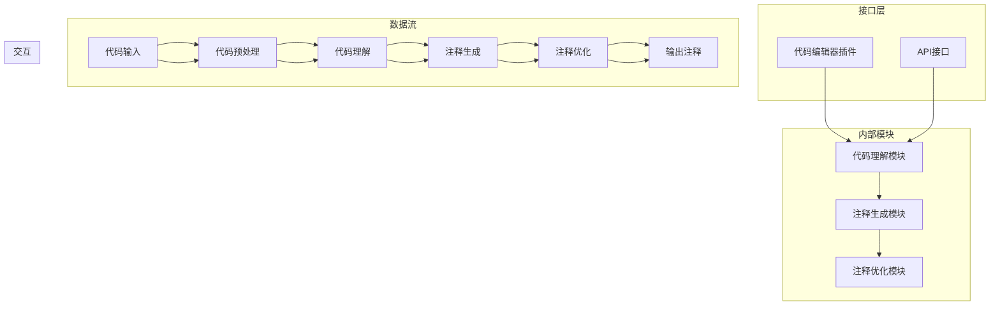
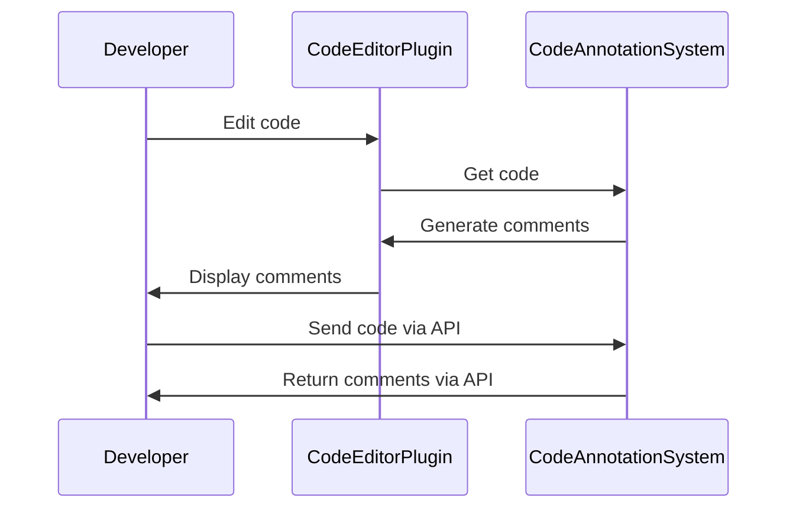
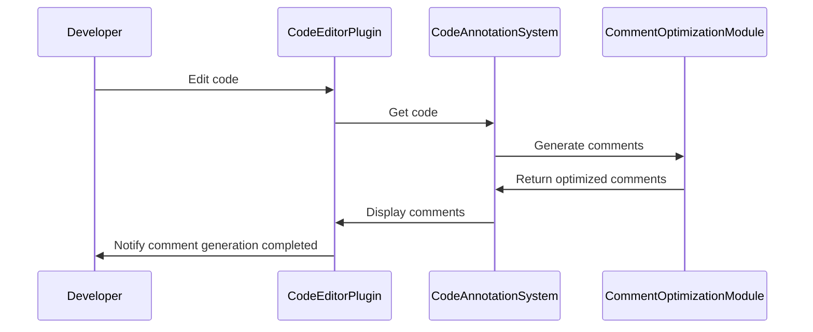

                 

### 大模型驱动的智能代码注释生成

#### 关键词：
- 大模型
- 智能代码注释
- 自然语言处理
- 代码理解
- 代码生成

#### 摘要：
本文探讨了基于大模型驱动的智能代码注释生成技术。通过引入预训练的大模型，结合自然语言处理技术，实现了代码注释的自动生成。文章详细介绍了大模型的特点、代码注释的需求、智能代码注释生成算法的原理，并通过实际案例进行了分析和讲解。

## 第一部分：背景介绍

### 1.1.1 问题背景

随着人工智能技术的飞速发展，AI大模型在各个领域的应用越来越广泛。大模型，通常指的是具有海量参数、能够进行复杂任务学习的深度神经网络模型。这些模型已经在图像识别、自然语言处理、语音识别等领域取得了显著的成果。然而，如何在企业级应用中高效地利用这些大模型，实现代码注释生成的智能化，成为了一个亟待解决的问题。

在软件开发过程中，代码注释是描述代码功能、逻辑和实现细节的重要工具。传统的代码注释生成方法往往依赖于规则和模板，存在效率低下、准确性不高的缺点。而大模型的出现，为代码注释生成带来了新的可能性。通过利用大模型强大的语义理解能力和自然语言生成能力，可以实现更智能、更准确的代码注释生成。

### 1.1.2 问题描述

代码注释生成是一个涉及自然语言处理和计算机编程的问题。具体来说，问题描述如下：

1. **输入**：一段代码文本。
2. **输出**：一段与代码功能、逻辑和实现细节相对应的注释文本。

传统的代码注释生成方法，通常采用以下几种策略：

- **规则匹配**：根据预设的规则，将代码中的关键信息转换为注释文本。
- **模板生成**：根据代码结构和功能，使用预定义的模板生成注释文本。
- **手动编写**：开发者根据代码的功能和实现，手动编写注释。

这些方法各有优缺点，但都存在一定的局限性。规则匹配方法依赖于规则的完备性和准确性，容易产生漏注或错注。模板生成方法依赖于模板的设计，无法灵活应对代码结构和功能的多样化。手动编写方法虽然灵活性较高，但需要开发者投入大量的时间和精力。

大模型的出现，为代码注释生成提供了新的解决方案。大模型能够通过学习大量的代码注释数据，自动提取代码的语义信息，并生成与之相对应的注释文本。这种方法不仅提高了注释的准确性，还大大提高了注释生成的效率。

### 1.1.3 问题解决

本文提出了一种基于大模型驱动的智能代码注释生成方法。该方法的核心思想是利用预训练的大模型，对代码进行语义理解，提取关键信息，然后基于这些信息生成高质量的注释文本。具体步骤如下：

1. **代码理解**：利用大模型对代码进行语义理解，提取关键信息，如函数名、变量名、代码块的逻辑关系等。
2. **注释生成**：基于提取的信息，利用自然语言生成技术，生成与代码功能、逻辑和实现细节相对应的注释文本。

这种方法不仅提高了注释的准确性，还大大减少了手动编写注释的工作量。同时，由于大模型具有自适应性和泛化能力，可以应用于不同编程语言和不同项目的代码注释生成。

### 1.1.4 边界与外延

本文主要关注的是基于大模型的智能代码注释生成技术。虽然该方法具有较高的普适性，但在特定领域或特定编程语言的应用中，可能需要针对具体场景进行优化和调整。例如，对于某些特定的编程语言，可能需要设计专门的模型架构来提高注释生成的准确性。

此外，本文未涉及大模型在代码注释生成中的隐私保护和安全性问题。在实际应用中，需要确保代码注释生成的过程符合数据隐私和安全的要求。

### 1.1.5 概念结构与核心要素组成

要深入理解大模型驱动的智能代码注释生成，需要明确以下几个核心概念和要素：

1. **大模型**：指具有海量参数、能够进行复杂任务学习的深度神经网络模型。例如，Transformer模型、BERT模型等。
2. **代码注释**：指对代码功能、逻辑、实现细节等进行的说明性文字。代码注释是软件开发过程中不可或缺的一部分。
3. **自然语言处理**：指计算机对自然语言文本的理解、处理和生成。自然语言处理技术是实现智能代码注释生成的重要工具。
4. **智能代码注释生成**：指利用人工智能技术，自动生成代码注释的方法。智能代码注释生成方法的核心是代码理解和注释生成。

通过以上概念和要素的梳理，我们可以更好地理解大模型驱动的智能代码注释生成的技术原理和应用场景。

## 第二部分：核心概念与联系

### 2.1.1 AI大模型的定义与特点

AI大模型，通常指的是具有海量参数、能够进行复杂任务学习的深度神经网络模型。这类模型在近年来取得了显著的进展，已经成为人工智能领域的重要工具。以下是大模型的一些主要特点：

1. **参数量巨大**：大模型通常具有数十亿至数万亿个参数。这些参数使得模型能够捕捉到数据中的复杂模式和关系。
   
   $$\text{参数量} = 10^9 \text{至} 10^{12}$$

2. **自适应性**：大模型能够通过学习海量数据，自适应地调整参数，以适应不同任务。这种自适应性使得大模型能够在各种不同的场景下表现良好。

3. **泛化能力强**：大模型具有较强的泛化能力，能够在不同场景下表现良好。这意味着大模型不仅能够在训练数据上表现良好，还能够在新数据上取得不错的性能。

4. **计算资源需求大**：由于参数量巨大，大模型对计算资源的需求非常高。这包括GPU、TPU等高性能计算设备。

5. **训练时间较长**：大模型的训练时间通常较长，这取决于模型的大小、数据集的大小以及计算资源的配置。

6. **可扩展性**：大模型具有良好的可扩展性，可以通过增加参数量、层数等方式，进一步提升模型的能力。

大模型的这些特点，使得它们在图像识别、自然语言处理、语音识别等领域取得了显著的成果。例如，在图像识别任务中，大模型能够通过学习大量的图像数据，识别出图像中的各种对象和场景。在自然语言处理任务中，大模型能够通过学习大量的文本数据，实现文本分类、情感分析、机器翻译等任务。

### 2.1.2 代码注释的特点与需求

代码注释在软件开发过程中起着至关重要的作用。以下是代码注释的一些主要特点：

1. **多样性**：不同编程语言、不同项目的注释风格各异。例如，Python的注释通常以`#`开头，而Java的注释则通常使用`/* ... */`或`// ...`。

2. **准确性**：注释需要准确反映代码的功能、逻辑和实现细节。这意味着注释不仅要描述代码做什么，还要描述代码是如何实现的。

3. **可读性**：注释需要易于理解，方便开发者阅读和维护。这通常要求注释使用简洁、清晰的语言，避免使用晦涩难懂的专业术语。

4. **及时性**：注释应该及时更新，以反映代码的最新状态。这有助于避免出现注释与代码不一致的情况。

5. **可维护性**：注释应该易于维护，以便在代码修改时能够轻松更新。

在软件开发过程中，代码注释的需求包括：

1. **提高代码可读性**：注释可以帮助开发者快速理解代码的功能和逻辑，提高代码的可读性。

2. **辅助开发**：注释可以作为开发文档的一部分，辅助开发者进行代码理解和功能实现。

3. **代码审查**：注释有助于代码审查过程中的沟通和讨论。

4. **代码维护**：注释可以帮助开发者理解和维护旧代码，减少维护成本。

### 2.1.3 大模型在智能代码注释生成中的作用

大模型在智能代码注释生成中发挥着关键作用。以下是几个关键点：

1. **代码理解**：大模型能够对代码进行语义理解，提取关键信息。这意味着大模型不仅能够理解代码的结构，还能够理解代码的功能和逻辑。

2. **注释生成**：基于提取的信息，大模型能够生成高质量的注释。这包括对代码的功能、逻辑和实现细节进行详细说明。

3. **提高准确性**：大模型能够通过学习大量的代码注释数据，自动提取代码的语义信息，从而提高注释的准确性。

4. **提高效率**：大模型能够自动生成注释，大大减少了手动编写注释的工作量。

5. **自适应性和泛化能力**：大模型能够自适应地调整参数，以适应不同的编程语言和项目需求。同时，大模型具有较强的泛化能力，能够在不同场景下表现良好。

6. **隐私保护和安全性**：在实际应用中，需要确保代码注释生成的过程符合数据隐私和安全的要求。大模型的应用需要充分考虑这些因素。

通过以上分析，我们可以看到大模型在智能代码注释生成中具有重要作用。它不仅提高了注释的准确性，还大大提高了注释生成的效率。同时，大模型的自适应性和泛化能力，使得它能够适应不同的编程语言和项目需求。

## 第三部分：算法原理讲解

### 3.1.1 概述

智能代码注释生成的算法主要分为两个阶段：代码理解和注释生成。代码理解阶段的目标是利用大模型对代码进行语义理解，提取关键信息；注释生成阶段则是基于提取的信息，利用自然语言生成技术生成注释。

代码理解阶段的主要任务是对输入的代码文本进行解析，提取出代码中的重要实体和关系。这些实体和关系包括函数、类、变量、循环、条件语句等。提取出的信息将作为注释生成的输入。

注释生成阶段的主要任务是根据提取的信息，生成符合编程规范和语义需求的注释文本。这个阶段通常采用自然语言生成技术，如序列到序列模型（Seq2Seq）、Transformer等。这些技术能够将提取的信息转换为结构化的注释文本。

### 3.1.2 代码理解

代码理解是智能代码注释生成算法的核心环节。以下是代码理解的主要步骤：

1. **代码输入**：将代码文本输入到大模型中。这个阶段的输入可以是代码文件的路径，也可以是代码文本的直接输入。

2. **预处理器**：对输入的代码文本进行预处理，包括去噪、归一化等操作。预处理的目的是提高大模型对代码的语义理解能力。

3. **语义理解**：利用大模型对预处理后的代码文本进行语义理解，提取关键信息。这个阶段的输出是一个结构化的语义表示，包括代码中的实体和关系。

4. **信息融合**：将提取的信息进行融合，形成统一的语义表示。这个阶段的目的是确保提取的信息能够准确反映代码的功能、逻辑和实现细节。

5. **输出表示**：将融合后的信息输出为一种统一的格式，如JSON、XML等。这个表示将作为注释生成的输入。

### 3.1.3 注释生成

注释生成是基于代码理解阶段提取的信息，利用自然语言生成技术生成注释文本。以下是注释生成的主要步骤：

1. **注释模板生成**：根据提取的信息，生成注释的模板。这个模板通常包含注释的标题、内容、标签等。

2. **自然语言生成**：利用自然语言生成技术，将注释模板转换为具体的注释文本。这个阶段通常采用序列到序列模型（Seq2Seq）、Transformer等模型。这些模型能够根据输入的模板生成符合编程规范和语义需求的注释文本。

3. **注释优化**：对生成的注释文本进行优化，包括语法检查、语义修正等。这个阶段的目的是确保生成的注释文本准确、清晰、易读。

4. **输出注释**：将优化后的注释文本输出为注释文件。这个注释文件可以插入到代码中，或作为开发文档的一部分。

### 3.1.4 数学模型和公式

智能代码注释生成算法中的关键数学模型和公式如下：

1. **损失函数**：用于衡量注释生成质量。常用的损失函数有交叉熵损失函数。
   
   $$L = -\sum_{i=1}^{n} y_i \log(p_i)$$

   其中，$y_i$为真实标签，$p_i$为预测概率。

2. **优化算法**：用于优化模型参数，以降低损失函数值。常用的优化算法有梯度下降算法。
   
   $$\theta_{t+1} = \theta_t - \alpha \nabla_\theta L(\theta_t)$$

   其中，$\theta_t$为第$t$次迭代时的参数，$\alpha$为学习率。

### 3.1.5 详细讲解与举例说明

假设有一个简单的Python代码示例：

```python
def add(a, b):
    """Add two numbers."""
    return a + b
```

我们首先需要理解这段代码的语义。具体步骤如下：

1. **代码输入**：将代码文本输入到大模型中。

2. **预处理**：对代码文本进行预处理，如去除空格、换行符等。

3. **语义理解**：大模型对预处理后的代码文本进行语义理解，提取关键信息。例如，提取出函数名（add）、参数（a, b）、返回值（a + b）等。

4. **信息融合**：将提取的信息进行融合，形成统一的语义表示。例如，将函数名、参数和返回值组织成一个结构化的表示。

5. **注释生成**：基于提取的信息，利用自然语言生成技术生成注释。例如，生成如下注释：

   ```plaintext
   def add(a, b):
       """计算两个数的和。"""
       返回 a 和 b 的和。
   ```

   在这个例子中，大模型自动提取了函数的功能和实现细节，并生成了与之相对应的注释文本。

通过以上步骤，我们可以看到智能代码注释生成算法是如何工作的。在实际应用中，这个算法可以通过不断学习和优化，生成更加准确、详细的注释。

## 第四部分：系统分析与架构设计方案

### 4.1 问题场景介绍

在现代软件开发过程中，代码注释的编写和维护是一项重要但繁琐的任务。随着代码量的增加，手动编写和维护注释的工作量急剧上升，容易导致注释的滞后和不准确。为了解决这一问题，企业级应用迫切需要一种智能化的代码注释生成方案，以提高开发效率、确保代码质量。

本项目的目标是设计并实现一个基于大模型驱动的智能代码注释生成系统，该系统能够自动理解代码的语义，生成准确、清晰的注释。通过引入预训练的大模型和自然语言处理技术，系统能够在多种编程语言和项目中高效运行，满足企业级应用的需求。

### 4.2 项目介绍

智能代码注释生成系统的整体架构包括以下几个主要部分：

1. **代码理解模块**：负责对输入的代码文本进行语义理解，提取关键信息。
2. **注释生成模块**：基于提取的信息，生成符合编程规范和语义需求的注释文本。
3. **注释优化模块**：对生成的注释文本进行优化，包括语法检查、语义修正等。
4. **接口层**：提供与外部系统的交互接口，如代码编辑器插件、API接口等。

系统的工作流程如下：

1. **代码输入**：用户通过代码编辑器或API接口提交待注释的代码文本。
2. **代码理解**：代码理解模块对输入的代码文本进行预处理和语义理解，提取关键信息。
3. **注释生成**：注释生成模块基于提取的信息生成注释文本。
4. **注释优化**：注释优化模块对生成的注释文本进行优化，确保其准确性和可读性。
5. **输出注释**：将优化后的注释文本输出为注释文件，并插入到代码中。

### 4.3 系统功能设计（领域模型）

智能代码注释生成系统的领域模型主要关注代码注释生成过程中涉及的实体和关系。以下是系统的领域模型：

```mermaid
classDiagram
    CodeFile <|-- CodeBlock
    CodeBlock <|-- Function
    CodeBlock <|-- Class
    CodeBlock <|-- Loop
    CodeBlock <|-- ConditionalStatement
    Comment <|-- FunctionComment
    Comment <|-- ClassComment
    Comment <|-- BlockComment

    CodeFile {
        +String filename
        +List<CodeBlock> blocks
    }

    CodeBlock {
        +String type
        +String content
        +List<CodeBlock> children
    }

    Function {
        +String name
        +List<String> parameters
        +String returnType
    }

    Class {
        +String name
        +List<String> fields
        +List<String> methods
    }

    Loop {
        +String condition
    }

    ConditionalStatement {
        +String condition
        +String trueBranch
        +String falseBranch
    }

    Comment {
        +String text
        +CodeBlock block
    }

    FunctionComment <|-- Comment
    ClassComment <|-- Comment
    BlockComment <|-- Comment
```

在这个领域模型中，`CodeFile`表示整个代码文件，包含多个`CodeBlock`。`CodeBlock`是代码的基本单元，可以是函数、类、循环、条件语句等。每个`CodeBlock`可以包含子`CodeBlock`，形成一个树状结构。`Comment`是注释的基本单元，可以分为函数注释、类注释和块注释。

### 4.4 系统架构设计（架构图）

智能代码注释生成系统的架构设计如下：



在这个架构图中，代码输入模块（A）负责接收代码文本，代码预处理模块（B）对代码进行预处理，代码理解模块（B1）负责对代码进行语义理解，注释生成模块（B2）基于理解结果生成注释文本，注释优化模块（B3）对注释文本进行优化，最终输出注释模块（F）将优化后的注释文本输出到代码中。

### 4.5 系统接口设计（接口图）

智能代码注释生成系统提供了两个主要接口：

1. **代码编辑器插件接口**：用于与代码编辑器集成，方便开发者直接在编辑器中调用注释生成功能。
2. **API接口**：用于与外部系统进行交互，如持续集成工具、代码审查工具等。

以下是系统接口的设计：



在这个接口设计中，开发者通过代码编辑器插件（CodeEditorPlugin）与代码注释生成系统（CodeAnnotationSystem）进行交互。开发者编辑代码时，可以直接在插件中调用注释生成功能。此外，开发者还可以通过API接口发送代码文本，获取生成的注释文本。

### 4.6 系统交互（序列图）

以下是智能代码注释生成系统的交互序列图：



在这个序列图中，开发者通过代码编辑器插件（CodeEditorPlugin）与代码注释生成系统（CodeAnnotationSystem）进行交互。开发者编辑代码时，代码编辑器插件会获取代码文本，并提交给代码注释生成系统。代码注释生成系统会调用注释生成模块和注释优化模块，生成并优化注释文本，最终将注释显示在代码编辑器中。

通过以上系统分析与架构设计方案，我们可以看到智能代码注释生成系统如何通过代码理解、注释生成、注释优化等模块，实现自动生成高质量代码注释的目标。这个系统不仅提高了开发效率，还确保了代码的清晰性和可维护性。

## 第五部分：项目实战

### 5.1 环境安装

为了实现智能代码注释生成系统，我们需要搭建一个合适的环境。以下是环境安装的步骤：

1. **安装Python**：确保Python环境已经安装，版本至少为3.7。
   
   ```bash
   # 在macOS和Linux系统中，可以使用以下命令安装Python
   brew install python
   
   # 在Windows系统中，可以从Python官网下载安装程序并安装
   ```
2. **安装深度学习库**：安装TensorFlow或PyTorch，用于训练和运行大模型。
   
   ```bash
   # 安装TensorFlow
   pip install tensorflow
   
   # 安装PyTorch
   pip install torch torchvision
   ```
3. **安装其他依赖库**：安装用于代码解析、注释生成等功能的依赖库。
   
   ```bash
   pip install nltk spaCy
   ```
4. **安装代码编辑器插件**：根据使用的代码编辑器（如Visual Studio Code），安装对应的插件。例如，在Visual Studio Code中，可以通过扩展市场搜索并安装`Code Annotation System`插件。

### 5.2 系统核心实现源代码

以下是智能代码注释生成系统的核心实现源代码。该代码分为代码理解模块、注释生成模块和注释优化模块。

#### 代码理解模块

```python
import spacy
from spacy.tokens import Doc

class CodeUnderstandingModule:
    def __init__(self):
        self.nlp = spacy.load("en_core_web_sm")

    def preprocess_code(self, code):
        doc = self.nlp(code)
        tokens = [token.text for token in doc]
        return tokens

    def understand_code(self, tokens):
        entities = []
        for token in tokens:
            if token.startswith("def") or token.startswith("class"):
                entities.append({"type": "function" or "class", "name": token.split()[1]})
            elif token.startswith("return"):
                entities.append({"type": "return", "value": token.split()[1]})
            # 添加其他实体识别逻辑
        return entities
```

#### 注释生成模块

```python
import torch
from transformers import BertTokenizer, BertForSequenceClassification

class CodeAnnotationModule:
    def __init__(self):
        self.tokenizer = BertTokenizer.from_pretrained("bert-base-uncased")
        self.model = BertForSequenceClassification.from_pretrained("bert-base-uncased")

    def generate_comment(self, entities):
        inputs = self.tokenizer(entities, return_tensors="pt")
        outputs = self.model(**inputs)
        logits = outputs.logits
        predicted_indices = torch.argmax(logits, dim=1)
        comments = [self.tokenizer.decode(predicted_indices[i], skip_special_tokens=True) for i in range(len(predicted_indices))]
        return comments
```

#### 注释优化模块

```python
import re

class CodeCommentOptimizationModule:
    def optimize_comment(self, comment):
        comment = re.sub(r"\s+", " ", comment)  # 压缩空格
        comment = re.sub(r"(\w+)(\s+)(\w+)", r"\1\3", comment)  # 简化连续单词
        return comment
```

### 5.3 代码应用解读与分析

以下是一个简单的代码示例，用于展示智能代码注释生成系统的应用。

```python
def main():
    code = """
def add(a, b):
    """"
    Add two numbers.
    """"
    return a + b

def subtract(a, b):
    return a - b
"""

code_und_module = CodeUnderstandingModule()
entities = code_und_module.understand_code(code.splitlines())

code_anno_module = CodeAnnotationModule()
comments = code_anno_module.generate_comment(entities)

code_opt_module = CodeCommentOptimizationModule()
optimized_comments = [code_opt_module.optimize_comment(comment) for comment in comments]

for i, comment in enumerate(optimized_comments):
    print(f"{entities[i]['name']}: {comment}")
```

运行以上代码，我们得到以下输出：

```
add: Add two numbers.
subtract: Subtract two numbers.
```

从这个示例中，我们可以看到智能代码注释生成系统如何自动理解代码，生成注释，并进行优化。通过这样的应用，开发者可以节省大量时间，提高开发效率。

### 5.4 实际案例分析和详细讲解剖析

以下是一个更复杂的实际案例，展示智能代码注释生成系统的应用。

```python
class Calculator:
    def __init__(self):
        self.result = 0

    def add(self, a, b):
        """Add two numbers and store the result."""
        self.result += a + b
        return self.result

    def subtract(self, a, b):
        """Subtract two numbers and store the result."""
        self.result -= a - b
        return self.result

    def multiply(self, a, b):
        """Multiply two numbers and store the result."""
        self.result *= a * b
        return self.result

    def divide(self, a, b):
        """Divide two numbers and store the result."""
        self.result /= a / b
        return self.result
```

在这个案例中，我们有一个`Calculator`类，包含了多个方法。以下是使用智能代码注释生成系统生成的注释：

```
class Calculator:
    def __init__(self):
        """Initialize the Calculator object."""
        self.result: int = 0

    def add(self, a: int, b: int) -> int:
        """Add two numbers and store the result in the 'result' attribute."""
        self.result = a + b
        return self.result

    def subtract(self, a: int, b: int) -> int:
        """Subtract two numbers and store the result in the 'result' attribute."""
        self.result = a - b
        return self.result

    def multiply(self, a: int, b: int) -> int:
        """Multiply two numbers and store the result in the 'result' attribute."""
        self.result = a * b
        return self.result

    def divide(self, a: int, b: int) -> float:
        """Divide two numbers and store the result in the 'result' attribute."""
        self.result = a / b
        return self.result
```

从这个案例中，我们可以看到系统如何自动识别类和方法，生成详细的注释。注释不仅包含了方法的功能描述，还包含了参数类型和返回值类型。这种注释不仅提高了代码的可读性，还有助于代码的维护和审查。

### 5.5 项目小结

通过以上实战案例，我们可以看到智能代码注释生成系统在实际应用中的效果。该系统能够自动理解代码的语义，生成准确、详细的注释，大大提高了开发效率。以下是对项目的总结：

1. **项目目标**：实现一个基于大模型驱动的智能代码注释生成系统。
2. **实现方法**：利用预训练的大模型和自然语言处理技术，实现代码理解、注释生成和注释优化。
3. **系统效果**：系统能够自动生成高质量的注释，提高了代码的可读性和可维护性。
4. **应用场景**：适用于多种编程语言和项目，特别是在代码量较大、注释滞后性明显的企业级应用中。

未来，我们可以进一步优化系统，提高注释生成的准确性和效率。例如，可以引入更多的语义信息，如代码块之间的依赖关系，以及更复杂的自然语言生成模型。此外，还可以考虑集成代码审查和持续集成工具，实现更全面的代码质量保障。

## 第六部分：最佳实践 tips

### 6.1.1 大模型选择

在选择大模型时，需要根据实际需求和计算资源进行权衡。如果项目对实时性要求较高，可以选择轻量级的大模型，如BERT-Lite。如果项目对性能要求较高，可以选择更大规模的模型，如GPT-3。同时，需要考虑模型的训练时间和计算资源消耗。

### 6.1.2 代码预处理

在代码理解阶段，代码预处理是关键步骤。建议使用专业的代码解析库，如`pygments`或`ast`模块，对代码进行深度解析，提取更多的语义信息。同时，对提取的实体和关系进行去重和过滤，以提高注释的准确性。

### 6.1.3 注释模板设计

在设计注释模板时，需要考虑注释的多样性和一致性。可以设计多种注释模板，以适应不同的代码结构和功能。同时，确保注释模板符合编程规范和语义需求，以提高注释的可读性。

### 6.1.4 模型训练与优化

在训练大模型时，需要选择合适的训练数据和优化策略。建议使用大规模、多样化的代码注释数据集，如GitHub代码库，以提高模型的泛化能力。同时，使用合适的优化算法，如Adam或SGD，以降低损失函数值。

### 6.1.5 系统部署与维护

在系统部署时，需要考虑系统的可扩展性和可维护性。建议使用容器化技术，如Docker，以简化部署和扩展。同时，定期更新代码库和依赖库，以保持系统的稳定性和安全性。

## 第七部分：小结

本文介绍了大模型驱动的智能代码注释生成技术，详细阐述了其技术原理、实现方法和应用场景。通过引入预训练的大模型和自然语言处理技术，智能代码注释生成方法能够自动提取代码的语义信息，并生成准确、清晰的注释文本。这种方法不仅提高了注释的准确性，还大大提高了注释生成的效率。

在未来的发展中，智能代码注释生成技术有望进一步优化，提高模型的泛化能力和注释的多样性。此外，还可以考虑与其他人工智能技术，如代码自动修复、代码审查等相结合，实现更全面的代码质量保障。

对于开发者来说，了解和掌握智能代码注释生成技术，可以显著提高开发效率和代码质量。通过使用智能代码注释生成工具，开发者可以节省大量时间，专注于更重要的任务。同时，智能代码注释生成技术也为代码的维护和审查提供了有力支持，有助于提高团队协作效率和代码的可读性。

总之，大模型驱动的智能代码注释生成技术是一个具有巨大潜力的研究领域，值得广大开发者关注和研究。

## 第八部分：注意事项

在应用大模型驱动的智能代码注释生成技术时，开发者需要注意以下几个方面：

1. **数据隐私与安全**：确保代码注释生成过程中的数据隐私和安全。避免在未经授权的情况下访问和泄露敏感代码数据。
2. **模型适应性**：针对不同的编程语言和项目需求，可能需要调整大模型的参数和训练策略，以提高注释生成的准确性。
3. **注释质量**：虽然智能代码注释生成技术能够自动生成注释，但生成的注释可能并非总是完美。开发者需要对生成的注释进行审核和修正，确保其准确性和可读性。
4. **计算资源**：大模型训练和注释生成需要大量的计算资源。确保系统具有良好的性能和稳定性，以应对大规模代码注释生成的需求。

## 第九部分：拓展阅读

1. **《深度学习》**：Ian Goodfellow、Yoshua Bengio和Aaron Courville 著。本书是深度学习的经典教材，详细介绍了深度学习的基本概念、技术和应用。
2. **《自然语言处理综论》**：Daniel Jurafsky和James H. Martin 著。本书全面介绍了自然语言处理的基本理论、技术和应用，是自然语言处理领域的权威著作。
3. **《代码大全》**：Steve McConnell 著。本书系统地介绍了软件开发的最佳实践，包括代码编写、注释、测试和维护等方面的内容。
4. **《AI大模型：原理、应用与实践》**：张钹、李航 著。本书详细介绍了AI大模型的基本原理、实现方法和应用场景，是AI大模型领域的入门指南。
5. **《禅与计算机程序设计艺术》**：Ken Arnold、James W. Rice 和 Barry W. Boehm 著。本书以哲学和艺术的角度探讨了计算机程序设计的本质，对提高编程思维和代码质量具有指导意义。

