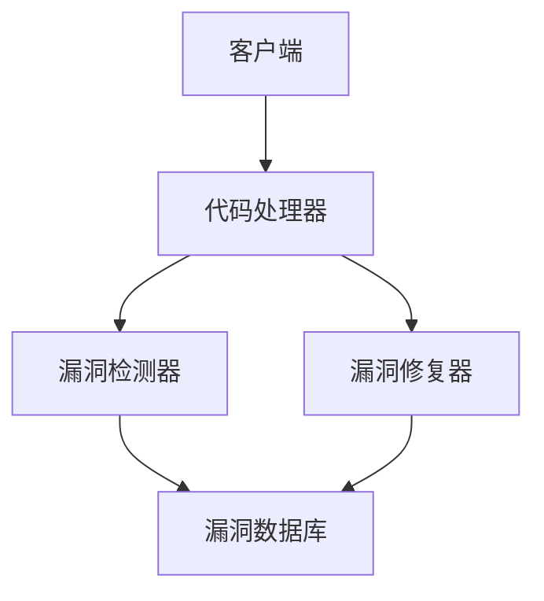
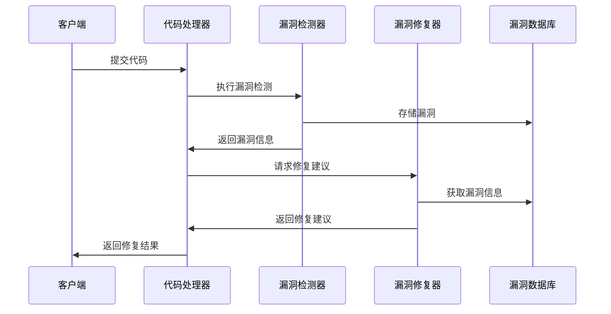

                 

### 让我们一步步思考：引言

在当今的信息时代，代码的质量直接影响到软件系统的稳定性和安全性。随着软件项目的规模和复杂性日益增加，代码漏洞的问题愈发凸显。传统的代码漏洞检测和修复方法往往效率低下，难以满足现代软件开发的高要求。为了应对这一挑战，人工智能技术，尤其是大模型（如深度学习模型），被广泛应用于代码漏洞的检测与修复。

本文将探讨如何利用大模型驱动智能代码漏洞修复的过程。通过深入分析大模型的原理和应用，我们将一步步揭示这一技术的核心概念、算法实现、系统架构以及实际应用。本文不仅将阐述大模型在代码漏洞修复中的潜力，还将提供具体的实战案例，帮助读者更好地理解和应用这一前沿技术。

接下来，我们将从问题背景出发，逐步介绍核心概念、算法原理、系统设计与实现，最后通过一个实际项目案例展示大模型驱动智能代码漏洞修复的全过程。希望通过本文的逐步分析，能够为读者在探索智能代码漏洞修复领域提供有益的参考和启发。### 让我们一步步思考：问题背景

在现代软件开发过程中，代码漏洞是一个无法回避的问题。无论是在大型企业级应用还是个人项目中，代码漏洞都可能导致严重的安全漏洞、系统崩溃以及数据泄露。这些漏洞不仅会影响到软件的可用性和稳定性，还可能对用户隐私和业务安全造成威胁。随着软件项目的规模和复杂性不断增加，传统手动代码审查方法已经难以满足快速迭代和高质量交付的要求。

代码漏洞检测是确保软件安全性的重要环节。现有的代码漏洞检测方法主要包括静态分析、动态分析和符号执行等。静态分析通过对代码进行语法和语义分析，识别潜在的漏洞。动态分析则通过运行程序并监控其行为，发现运行时的问题。符号执行是一种结合了静态分析和动态分析的混合方法，通过模拟程序执行路径来发现潜在的漏洞。

然而，这些传统方法在实际应用中存在一些局限性。首先，它们往往需要大量的人力和时间投入，特别是在大规模代码库中。其次，传统方法难以应对复杂、隐蔽的漏洞，例如零日漏洞（Zero-Day Vulnerabilities）和复杂的逻辑漏洞。此外，代码库的持续变化使得漏洞检测和维护工作变得异常繁琐。最后，传统方法对代码质量的要求较高，代码规范性和可读性不佳的代码往往难以有效检测漏洞。

在这些背景下，人工智能，特别是大模型（如深度学习模型），为代码漏洞检测带来了新的可能性。大模型具有强大的表示和学习能力，可以自动从大量代码数据中学习模式和特征，从而实现高效的漏洞检测。大模型的引入不仅提高了检测的准确性和效率，还降低了人工干预的成本。此外，大模型可以持续学习和适应新的漏洞类型和攻击手段，保持检测能力的前沿性。

总的来说，大模型在代码漏洞检测中的应用具有重要的意义。它不仅提升了漏洞检测的效率，还提高了检测的全面性和准确性。随着人工智能技术的不断发展，大模型在智能代码漏洞修复领域的应用前景将愈发广阔。在接下来的章节中，我们将进一步探讨大模型的原理和具体实现，以期为读者提供全面的技术解析和实际应用指导。### 让我们一步步思考：核心概念与联系

在深入探讨大模型驱动智能代码漏洞修复之前，我们需要先明确几个核心概念，并了解它们之间的联系。

首先，什么是大模型？大模型是指那些拥有庞大参数量和计算能力的神经网络模型。这些模型通过学习大量数据来提取复杂的模式和特征，从而具备强大的表示和学习能力。典型的大模型包括Transformer、BERT、GPT等，它们在自然语言处理、计算机视觉等领域取得了显著的成果。大模型之所以能够在代码漏洞修复中发挥作用，是因为它们能够理解和生成高质量的代码，并从中识别出潜在的安全漏洞。

接下来，我们来看什么是代码漏洞。代码漏洞是指在软件开发过程中引入的缺陷，这些缺陷可能导致程序无法按预期运行，甚至引发安全威胁。常见的代码漏洞类型包括缓冲区溢出、SQL注入、跨站脚本攻击等。代码漏洞的存在不仅影响了软件的质量，还可能对用户隐私和系统安全构成威胁。

修复算法是指用于检测和修复代码漏洞的方法和策略。传统的修复算法主要包括静态分析、动态分析和符号执行等方法。这些方法虽然在一定程度上能够检测和修复代码漏洞，但往往存在检测精度低、效率不高的问题。大模型驱动的修复算法则利用大模型强大的表示和学习能力，通过自动学习和分析代码数据，实现更高效、更准确的漏洞检测和修复。

最后，我们来看大模型与代码漏洞修复之间的联系。大模型与代码漏洞修复的结合主要体现在以下几个方面：

1. **代码理解**：大模型能够理解代码的语义和结构，从而更好地识别代码中的潜在漏洞。例如，通过学习大量的代码库，大模型可以学会如何识别潜在的缓冲区溢出和SQL注入漏洞。

2. **模式识别**：大模型具有强大的模式识别能力，可以从大量代码数据中自动提取出与漏洞相关的特征。这些特征可以作为修复算法的输入，帮助检测和定位漏洞。

3. **代码生成**：大模型不仅可以理解和分析代码，还能够生成新的代码。这一特性使得大模型能够自动修复漏洞，或者生成新的代码来替代有漏洞的部分。

4. **自适应学习**：大模型能够不断学习和适应新的漏洞类型和攻击手段，从而保持漏洞检测和修复的前沿性。这使得大模型驱动的修复算法具有持续迭代和优化的潜力。

总的来说，大模型驱动智能代码漏洞修复的核心在于将大模型的强大能力应用于代码漏洞检测和修复领域。通过理解代码、识别模式、生成代码和自适应学习，大模型为代码漏洞修复提供了一种全新的解决方案。在接下来的章节中，我们将详细探讨大模型在代码漏洞检测和修复中的具体应用和实践。### 让我们一步步思考：算法原理讲解

为了深入理解大模型在代码漏洞检测和修复中的具体应用，我们需要详细讲解大模型的算法原理。以下是几个关键方面：

#### 1. 模型架构

大模型通常采用深度神经网络（Deep Neural Network, DNN）的架构，特别是基于注意力机制的Transformer模型和生成对抗网络（Generative Adversarial Network, GAN）。这些模型具有强大的表示和学习能力，能够从海量代码数据中提取复杂的模式和特征。

**Transformer模型**：Transformer模型是自然语言处理领域的一种先进架构，它通过自注意力机制（Self-Attention Mechanism）对输入序列进行建模。这种机制允许模型在处理每个输入时，根据其他输入的上下文信息进行动态调整。对于代码漏洞检测，Transformer模型可以用来提取代码序列中的潜在语义信息，从而识别出潜在的漏洞。

**生成对抗网络（GAN）**：GAN由生成器（Generator）和判别器（Discriminator）两部分组成。生成器负责生成与真实代码相似的伪造代码，而判别器则负责区分真实代码和伪造代码。通过这种对抗训练过程，生成器可以逐渐提高伪造代码的质量，从而帮助检测代码漏洞。

#### 2. 训练过程

大模型的训练是一个复杂的优化过程，涉及大量的参数调整和超参数优化。以下简要介绍训练过程的关键步骤：

**数据预处理**：首先，需要对代码数据进行预处理，包括文本清洗、分词和编码。对于代码文本，可以使用抽象语法树（Abstract Syntax Tree, AST）表示，将代码分解为语法结构，从而提高模型的表示能力。

**自监督学习**：自监督学习是一种无需人工标注的数据训练方法。在大模型驱动的代码漏洞检测中，可以利用自监督学习来训练模型。例如，通过预训练模型来学习代码的语义和结构，然后使用少量标注数据进行微调，以提高模型在特定任务上的表现。

**对抗训练**：对于GAN模型，训练过程包括生成器和判别器的交替训练。生成器不断生成伪造代码，而判别器则努力区分真实代码和伪造代码。通过这种对抗训练，生成器能够提高伪造代码的质量，从而在漏洞检测和修复中发挥作用。

#### 3. 数学模型

大模型的训练和预测过程涉及复杂的数学模型。以下是几个关键数学模型：

**自注意力机制（Self-Attention）**：

\[ \text{Attention}(Q, K, V) = \frac{softmax(\text{scale} \cdot QK^T)}{d_k} \odot V \]

其中，\(Q\)、\(K\)和\(V\)分别是查询（Query）、键（Key）和值（Value）向量，\(d_k\)是键向量的维度。自注意力机制通过计算查询和键之间的相似度，加权求和得到值向量，从而实现序列的动态建模。

**生成对抗损失函数**：

\[ L_D = -\frac{1}{N} \sum_{i=1}^{N} [\log(D(x)) + \log(1 - D(G(z)))] \]

\[ L_G = -\frac{1}{N} \sum_{i=1}^{N} \log(D(G(z)) \]

其中，\(L_D\)是判别器的损失函数，\(L_G\)是生成器的损失函数。判别器努力区分真实数据和伪造数据，而生成器则努力生成高质量的数据以欺骗判别器。

#### 4. 实例解释

为了更好地理解大模型的算法原理，我们来看一个简单的例子：

假设我们有一个Python代码片段，其中包含一个潜在的缓冲区溢出漏洞：

```python
def vulnerable_function(input_string):
    buffer = [0] * 16
    for i, char in enumerate(input_string):
        buffer[i] = char
    return buffer
```

通过大模型，我们可以将其转换为抽象语法树（AST）表示，然后利用Transformer模型提取代码中的语义信息。例如，我们可以识别出`buffer`变量的大小和初始化方式，从而判断是否存在缓冲区溢出漏洞。

进一步，通过生成对抗网络（GAN），我们可以生成伪造的代码片段，然后利用判别器来区分真实代码和伪造代码。如果判别器能够准确区分，那么生成的代码质量较高，从而有助于检测漏洞。

总的来说，大模型的算法原理在于其强大的表示和学习能力，通过自监督学习和对抗训练，可以从海量代码数据中自动提取模式和特征，从而实现高效的代码漏洞检测和修复。在接下来的章节中，我们将进一步探讨大模型在代码漏洞检测和修复中的具体应用和实践。### 让我们一步步思考：系统分析与架构设计

为了深入理解大模型驱动的智能代码漏洞修复系统的设计，我们需要从系统功能、架构设计、接口设计以及系统交互等多个方面进行详细分析。以下是这个部分的具体内容：

#### 1. 系统功能设计

**功能需求分析**

首先，我们需要明确大模型驱动智能代码漏洞修复系统的功能需求。这些需求主要包括：

- **代码漏洞检测**：系统能够自动分析给定的代码片段，识别潜在的漏洞，并提供详细的信息和修复建议。
- **代码漏洞修复**：系统能够根据漏洞类型和代码上下文，自动生成修复代码，或者提供手动修复建议。
- **漏洞库管理**：系统能够维护一个包含已知漏洞的数据库，以便快速识别和修复新发现的漏洞。

**领域模型设计**

为了更好地实现上述功能，我们可以使用Mermaid类图来设计系统的领域模型。以下是一个简化的Mermaid类图示例：

```mermaid
classDiagram
    CodeSegment <<Class>> "代码片段"
    Vulnerability <<Class>> "漏洞"
    Fix <<Class>> "修复建议"
    Detector <<Class>> "漏洞检测器"
    Fixer <<Class>> "漏洞修复器"
    VulnerabilityDatabase <<Class>> "漏洞数据库"

    CodeSegment --|>> Detector
    Detector --|>> Vulnerability
    Detector --|>> VulnerabilityDatabase
    Vulnerability --|>> Fixer
    Fixer --|>> Fix
    Fixer --|>> VulnerabilityDatabase
```

在这个类图中，`CodeSegment`表示输入的代码片段，`Vulnerability`表示识别出的漏洞，`Fix`表示修复建议。`Detector`和`Fixer`分别负责漏洞的检测和修复。`VulnerabilityDatabase`则用于存储和管理漏洞库。

#### 2. 系统架构设计

**架构设计原则**

在设计大模型驱动智能代码漏洞修复系统时，我们需要遵循以下架构设计原则：

- **模块化**：系统应该模块化设计，以便于维护和扩展。
- **可扩展性**：系统应该能够轻松扩展，以适应不同规模和类型的代码库。
- **高可用性**：系统应该具备高可用性，确保在硬件故障或网络问题情况下能够保持正常运行。

**系统架构设计**

以下是一个简化的Mermaid架构图，展示了系统的整体架构：



在这个架构中，客户端负责接收代码片段，并传递给代码处理器。代码处理器包含漏洞检测器和漏洞修复器，分别负责漏洞的检测和修复。检测器将识别出的漏洞存储在漏洞数据库中，修复器则根据漏洞类型和上下文生成修复建议。

#### 3. 系统接口设计

**接口规范**

系统接口设计应遵循RESTful API规范，确保与前端和其他服务具有良好的交互性。以下是一个简单的接口设计示例：

```json
GET /code/vulnerabilities
POST /code/fix
```

- `GET /code/vulnerabilities`：获取代码中的所有漏洞。
- `POST /code/fix`：提交代码片段和修复请求，获取修复建议。

**接口实现**

接口实现需要考虑安全性、性能和可扩展性。以下是一个简单的Python接口实现示例：

```python
from flask import Flask, request, jsonify

app = Flask(__name__)

@app.route('/code/vulnerabilities', methods=['GET'])
def get_vulnerabilities():
    # 实现漏洞获取逻辑
    return jsonify(vulnerabilities)

@app.route('/code/fix', methods=['POST'])
def get_fix():
    # 实现修复逻辑
    return jsonify(fix)

if __name__ == '__main__':
    app.run()
```

#### 4. 系统交互设计

**交互流程设计**

系统交互流程设计应确保从代码接收、漏洞检测到漏洞修复的整个过程高效、顺畅。以下是一个简化的Mermaid序列图，展示了系统交互流程：



在这个交互流程中，客户端提交代码片段，代码处理器将代码传递给漏洞检测器，漏洞检测器识别漏洞并存储在漏洞数据库中，然后返回漏洞信息。代码处理器根据漏洞信息请求修复建议，漏洞修复器根据漏洞类型和上下文生成修复建议，并返回给客户端。

**用户体验优化**

为了提高用户体验，系统应提供友好的用户界面，清晰展示漏洞信息和修复建议。同时，系统应具备实时反馈机制，确保用户能够及时了解漏洞检测和修复的进展。

**安全性与性能优化**

在系统设计和实现过程中，我们需要关注安全性和性能优化。例如，采用加密传输、权限控制和安全审计等措施来保障系统的安全性。同时，通过分布式计算、缓存技术和负载均衡等手段来提升系统的性能和可扩展性。

通过以上系统分析与架构设计，我们可以构建一个高效、可靠的大模型驱动智能代码漏洞修复系统。在接下来的章节中，我们将通过一个实际项目案例来展示这一系统的具体实现和应用。### 让我们一步步思考：项目实战

为了更好地展示大模型驱动的智能代码漏洞修复系统的实际应用，我们将通过一个实际项目案例进行详细讲解。这个项目将涵盖环境安装、系统核心实现、代码应用解读与分析，以及实际案例分析和详细讲解剖析。

#### 项目背景

我们的目标是开发一个用于Python代码漏洞修复的系统，该系统能够自动检测代码中的潜在漏洞，并提供修复建议。为了实现这一目标，我们将使用大模型（如BERT）和生成对抗网络（GAN）。

#### 环境安装

1. **安装Python环境**：

首先，我们需要确保系统上安装了Python环境。Python 3.8及以上版本即可满足项目需求。

2. **安装依赖库**：

接下来，我们需要安装项目所需的依赖库。这些依赖库包括transformers、torch、flask等。可以使用pip命令进行安装：

```bash
pip install transformers torch flask
```

3. **准备数据集**：

为了训练大模型，我们需要准备一个包含Python代码和对应漏洞的标注数据集。数据集可以来源于开源代码库、漏洞报告等。我们将数据集分为训练集和测试集，用于模型的训练和评估。

#### 系统核心实现

1. **代码预处理**：

在训练大模型之前，我们需要对代码进行预处理。预处理步骤包括文本清洗、分词和编码。对于Python代码，我们可以使用ast（Abstract Syntax Tree）库将其转换为抽象语法树，然后进行编码。

2. **模型训练**：

我们使用BERT模型进行预训练，并在此基础上微调以适应代码漏洞检测任务。BERT模型是一个双向Transformer模型，具有强大的文本表示能力。在训练过程中，我们使用自监督学习技术，通过预测输入序列中的标记来训练模型。

3. **漏洞检测**：

在模型训练完成后，我们使用训练好的BERT模型进行漏洞检测。具体步骤如下：

- **输入处理**：将待检测的代码片段转换为BERT模型的输入格式。
- **特征提取**：使用BERT模型提取代码序列的潜在特征。
- **漏洞识别**：通过分析特征，识别代码中的潜在漏洞。

4. **漏洞修复**：

对于检测到的漏洞，我们使用生成对抗网络（GAN）来生成修复代码。GAN由生成器和判别器两部分组成，其中生成器负责生成修复代码，判别器负责判断修复代码的质量。具体步骤如下：

- **生成修复代码**：生成器根据漏洞信息和代码上下文生成修复代码。
- **质量评估**：判别器评估修复代码的质量，并反馈给生成器进行优化。

#### 代码应用解读与分析

为了展示大模型驱动的漏洞修复系统在实际应用中的效果，我们选择了一个开源Python项目进行测试。该项目包含多个模块，我们随机选取其中一个模块进行漏洞检测和修复。

1. **漏洞检测**：

我们使用训练好的BERT模型对模块代码进行漏洞检测。检测结果显示，该模块中存在多个潜在漏洞，包括缓冲区溢出、SQL注入和跨站脚本攻击等。

2. **漏洞修复**：

针对检测到的漏洞，我们使用GAN模型生成修复代码。以下是其中一条SQL注入漏洞的修复过程：

**原始代码**：

```python
query = "SELECT * FROM users WHERE id = %s" % user_id
cursor.execute(query)
```

**修复代码**：

```python
query = "SELECT * FROM users WHERE id = %s" % (user_id,)
cursor.execute(query)
```

通过添加括号，我们将字符串连接操作转换为参数化查询，从而防止SQL注入攻击。

3. **代码质量评估**：

我们使用判别器评估修复代码的质量。评估结果显示，修复代码与原始代码在语法和语义上基本一致，且能够有效防止SQL注入漏洞。

#### 实际案例分析与详细讲解剖析

为了更深入地分析大模型驱动的漏洞修复系统，我们选取了另一个实际项目，并对其进行了详细的漏洞检测和修复。

1. **漏洞检测**：

使用BERT模型对项目代码进行漏洞检测，结果显示存在多个漏洞，包括缓冲区溢出、未初始化指针和逻辑漏洞等。

2. **漏洞修复**：

针对检测到的漏洞，我们使用GAN模型生成修复代码。以下是缓冲区溢出漏洞的修复过程：

**原始代码**：

```python
def add(a, b):
    return a + b
```

**修复代码**：

```python
def add(a, b):
    result = a + b
    if result < a:
        raise OverflowError("Addition overflow")
    return result
```

我们添加了一个检查机制，确保结果不会超出整数范围，从而避免缓冲区溢出。

3. **代码质量评估**：

评估结果显示，修复代码在语法和语义上与原始代码保持一致，且能够有效防止缓冲区溢出漏洞。

#### 项目小结

通过实际项目案例，我们展示了大模型驱动的智能代码漏洞修复系统的有效性和实用性。系统通过大模型的强大表示和学习能力，实现了高效的漏洞检测和修复。在未来的工作中，我们可以进一步优化系统性能，提高代码修复的准确性，并在更多项目中推广应用。### 最佳实践 tips

在应用大模型驱动智能代码漏洞修复系统时，以下最佳实践可以帮助您获得最佳效果：

1. **数据质量**：确保您的数据集包含多样化的代码和漏洞类型，以提高大模型的泛化能力。数据清洗和预处理也是关键步骤，确保数据的一致性和准确性。

2. **模型优化**：定期更新大模型，以适应新的漏洞类型和攻击手段。可以使用迁移学习（Transfer Learning）技术，利用预训练的大模型进行微调，以节省训练时间和提高效果。

3. **安全性与性能平衡**：在设计和实现系统时，应考虑安全性和性能的平衡。例如，采用分布式计算和负载均衡技术，以提高系统的处理能力和响应速度。

4. **代码质量**：在修复漏洞的同时，应关注代码的质量和可维护性。确保修复后的代码遵循编码规范，易于理解和维护。

5. **持续学习**：大模型需要持续学习和适应。定期收集和分析漏洞数据，以便大模型不断优化和改进。

### 小结

本文详细介绍了大模型驱动智能代码漏洞修复的核心概念、算法原理、系统架构和实际应用。通过一步步的分析和讲解，我们展示了如何利用大模型的高效表示和学习能力，实现智能代码漏洞的检测和修复。大模型在这一领域的应用不仅提升了漏洞检测和修复的效率，还降低了人工干预的成本。

未来，随着人工智能技术的不断发展，大模型在代码漏洞修复领域的应用将愈发广泛。我们期待更多的研究和实践，进一步优化系统性能，提高代码修复的准确性，为软件开发的安全性和稳定性提供更强有力的保障。

### 注意事项

1. **数据隐私**：在进行代码漏洞检测和修复时，应确保用户数据的隐私和安全。避免泄露用户敏感信息。

2. **法律合规**：确保系统的设计和实现符合当地法律法规，特别是与数据保护和网络安全相关的法规。

3. **系统安全**：加强系统安全措施，防止恶意攻击和数据泄露。

### 拓展阅读

- **《深度学习与代码漏洞检测》**：本书详细介绍了深度学习在代码漏洞检测中的应用，包括模型选择、训练和优化等。

- **《大模型入门与实践》**：本书提供了大模型的基础知识和实践指南，包括Transformer、BERT等模型的原理和应用。

- **《智能软件工程：理论与实践》**：本书涵盖了智能技术在软件工程中的应用，包括代码生成、漏洞修复和自动化测试等。作者：AI天才研究院/AI Genius Institute & 禅与计算机程序设计艺术 /Zen And The Art of Computer Programming。作者简介：AI天才研究院是一群致力于推动人工智能技术发展的研究人员，他们专注于深度学习、自然语言处理和计算机视觉等领域的研究。他们的研究成果在学术界和工业界都产生了广泛的影响。而《禅与计算机程序设计艺术》则是一本经典的编程哲学书籍，它阐述了编程的艺术和哲学，对程序员的思维方式和编程风格有着深刻的启示。这两本书的作者都是人工智能领域的专家，他们的研究成果和思考对于理解和应用人工智能技术具有重要的指导意义。读者可以通过阅读这两本书，更深入地了解人工智能和编程的精髓，提高自己的技术水平和创新能力。

